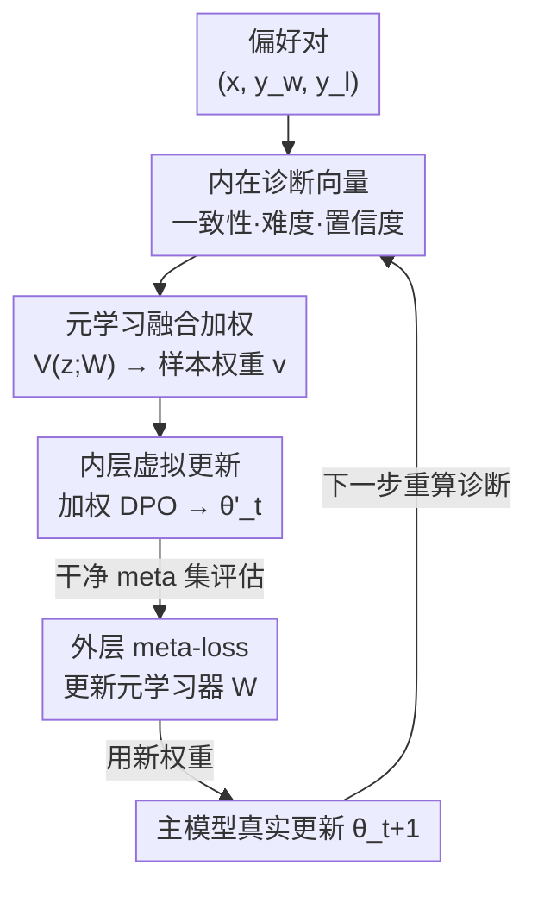

# Aligner, Diagnose Thyself: A Meta-Learning Paradigm for Fusing Intrinsic Feedback in Preference Alignment

**会议**: ICLR2026  
**OpenReview**: [https://openreview.net/forum?id=oIAUP1K5Dq](https://openreview.net/forum?id=oIAUP1K5Dq)  
**代码**: 待确认  
**领域**: 对齐RLHF / 偏好优化 / 噪声鲁棒  
**关键词**: 偏好对齐, DPO, 噪声标签, 元学习, 样本重加权

## 一句话总结
针对偏好数据集里"标错的偏好对"会毁掉 DPO 对齐的问题，本文不再依赖困惑度差这类单一启发式，而是让模型"自我诊断"——从一致性、学习难度、生成置信度三个内在信号拼出一个诊断向量，再用元学习训一个小网络学会融合这些信号给每个样本自适应加权，在多种噪声比例下显著超过现有鲁棒对齐方法。

## 研究背景与动机
**领域现状**：把 LLM 对齐到人类偏好（helpful / harmless / honest）的主流路线是用偏好数据集做 RLHF 或更轻量的 DPO（Direct Preference Optimization）。这些方法都假设数据里"被选中的回复 $y_w$ 确实优于被拒绝的回复 $y_l$"。

**现有痛点**：现实偏好数据普遍含"噪声偏好"（noisy preferences, NP）——由于标注者分歧、主观偏见或 AI 自动标注出错，记录的偏好标签是反的（$y_w$、$y_l$ 实际被调换）。在这种数据上直接最小化 DPO 损失，会把错误行为学进模型，对齐质量急剧下降。

**核心矛盾**：现有鲁棒对齐方法处理 NP 都太"窄"。一类是粗粒度修损失（如 cDPO、rDPO），用一个全局噪声率对所有样本做统一修正，无法处理样本级别的个体差异；另一类是样本级启发式（如 PerpCorrect 用困惑度差 PPLDiff 判断标签是否反了），虽然到了实例粒度，但**只看单一信号**。单一信号有天然盲区：PPLDiff 会被"流畅但事实错误"的回复骗到；训练 loss 高既可能是噪声也可能只是真·难样本；生成不确定性既来自题目歧义也来自模型知识不足。

**本文目标**：让对齐模型对每个偏好对做出"整体可靠性评估"，而不是赌某一个启发式永远对。

**切入角度**：作者观察到"偏好可靠性不是单一属性，而是个多面体"，模型自己的内部状态本身就提供了多路互补的反馈。把这几路信号摆在一起，盲区可以互相补。

**核心 idea**：让"对齐者自我诊断"（Aligner, Diagnose Thyself）——把偏好一致性、学习难度、生成置信度三个内在诊断信号拼成诊断向量，用元学习训一个权重网络学会融合它们，给可靠样本高权重、给可疑样本低权重。

## 方法详解

### 整体框架
方法建立在 DPO 之上。标准 DPO 对一个偏好对 $(x, y_w, y_l)$ 的损失是

$$\mathcal{L}_{\text{DPO}}(\pi_\theta,\pi_{\text{ref}}) = -\log\sigma\Big(\beta\log\tfrac{\pi_\theta(y_w|x)}{\pi_{\text{ref}}(y_w|x)} - \beta\log\tfrac{\pi_\theta(y_l|x)}{\pi_{\text{ref}}(y_l|x)}\Big),$$

其中 $\pi_{\text{ref}}$ 是参考策略（一般是 SFT 模型），$\beta$ 控制偏离参考的程度。当数据里 $(y_w,y_l)$ 被调换，直接最小化这个损失就会学坏。

本文的整体流程是一个**双层优化（bi-level）循环**：每一步先用当前策略 $\pi_{\theta_t}$ 为训练 batch 里每个样本算出一个三维诊断向量 $z$（一致性 / 难度 / 置信度），喂给元学习器 $V(\cdot;W)$ 输出每个样本的权重 $v$；这些权重去调制 DPO 损失，先做一次"虚拟"梯度更新得到临时参数 $\theta'_t$；再在一小批干净的 meta 数据上评估这个虚拟模型的损失（meta-loss），用它来更新元学习器 $W$；最后用更新后的元学习器重新算权重，对主模型 $\theta$ 做真正的更新。如此往复，元学习器逐渐学会"怎么融合这三路诊断信号"。

### 关键设计

**1. 内在诊断向量：把"可靠性"拆成三路互补的内部信号**

针对"单一启发式有盲区"这个痛点，作者不再用一个标量判断样本好坏，而是在每个训练步、用当前策略动态算出一个三维向量 $z\in\mathbb{R}^d$，三个分量各看一个侧面。

- **偏好一致性 $z_{\text{ppl}}$**：对齐良好的模型应给真正更优的回复更高似然（更低困惑度）。用对数困惑度差刻画：$z_{\text{ppl}}^{(i)} = \log\text{PPL}(\pi_{\theta_t},[x;y_w]) - \log\text{PPL}(\pi_{\theta_t},[x;y_l])$，其中 $\text{PPL}(\pi,s)=\exp(-\tfrac{1}{|s|}\sum_k\log\pi(s_k|s_{<k}))$。$z_{\text{ppl}}>0$ 意味着标注的"赢家"在当前模型下反而比"输家"更不可能，是 NP 的强信号。注意它是**动态**算的（每步用最新的 $\pi_{\theta_t}$），比静态预计算更准。
- **学习难度 $z_{\text{loss}}$**：直接用该样本的实例级 DPO 损失 $z_{\text{loss}}^{(i)}=\mathcal{L}_{\text{DPO}}(\pi_{\theta_t},\pi_{\text{ref}};(x,y_w,y_l))$。噪声样本梯度互相冲突，loss 往往偏高，这一路衡量"这个偏好对模型来说有多意外"。
- **生成置信度 $z_{\text{uncert}}$**：用生成回复的平均 token 级熵 $H(y|x;\pi_{\theta_t})=-\tfrac{1}{m}\sum_{j}\sum_{v\in V}\pi_{\theta_t}(v|x,y_{<j})\log\pi_{\theta_t}(v|x,y_{<j})$ 度量不确定性，取偏好回复的熵作为信号。高熵说明模型在几个似是而非的选项间犹豫，对应的偏好标签更可能不可靠。

最终 $z_t^{(i)}=[\text{norm}(z_{\text{ppl}}),\text{norm}(z_{\text{loss}}),\text{norm}(z_{\text{uncert}})]$，三个分量归一化后拼接。这一步的价值在于：三路信号互补——PPLDiff 会被"流畅的错误信息"骗，但高 loss / 高熵能把它揪出来；loss 分不清"噪声"和"真难样本"，但 PPLDiff 能锚定。

**2. 元学习融合加权：学一个权重网络而不是手调融合规则**

三路信号有时互相矛盾（如某样本 PPLDiff 看着干净但生成熵很高），手写规则很难平衡。作者把"怎么融合"交给元学习：训一个两层 MLP 的元学习器 $V(z;W)$，输入诊断向量、输出非负样本权重 $v=V(z;W)$。权重的好坏不靠人定义，而是看"用这套权重训出来的主模型，在一小批干净 meta 数据上表现如何"。这是经典的 learning-to-reweight 范式（Ren et al. 2018 / Shu et al. 2019），但本文的新意在于**喂给元学习器的不是单一 loss，而是这个三维诊断向量**，让元学习器有机会学到非线性的、信号间相互补盲区的复杂融合策略。SHAP 分析显示元学习器确实没有学成简单的线性组合。

**3. 双层优化训练循环：虚拟更新 + meta 评估驱动权重学习**

整套训练按内外两层交替进行（Algorithm 1）。内层"虚拟更新"：先算诊断向量与权重，用权重调制训练 batch 的 DPO 损失 $\mathcal{L}_{\text{weighted}}(\theta_t,W_t)=\tfrac{1}{|B_t|}\sum_{j}v_t^{(j)}\mathcal{L}_{\text{DPO}}(\cdot;j)$，做一步假设性梯度得到虚拟参数 $\theta'_t(W_t)=\theta_t-\alpha_\theta\nabla_{\theta_t}\mathcal{L}_{\text{weighted}}$。外层"meta 目标"：在干净 meta-batch 上评估这个虚拟模型 $\mathcal{L}_{\text{meta}}(W_t)=\tfrac{1}{|B_{\text{meta}}|}\sum_k\mathcal{L}_{\text{DPO}}(\pi_{\theta'_t(W_t)},\pi_{\text{ref}};k)$，然后 $W_{t+1}=W_t-\alpha_W\nabla_{W_t}\mathcal{L}_{\text{meta}}$ 更新元学习器。最后用**更新后**的权重对主模型做真实更新 $\theta_{t+1}=\theta_t-\alpha_\theta\nabla_{\theta_t}\mathcal{L}_{\text{weighted}}(\theta_t,W_{t+1})$。这种"先虚拟走一步、看在干净集上好不好、再回头改权重函数"的设计，让权重的学习目标始终对齐到"在可信数据上泛化更好"，而不是去拟合可能含噪的训练 loss。

### 损失函数 / 训练策略
主模型用权重调制后的 DPO 损失（式 5），元学习器用 meta-loss（式 7）。干净 meta 集很小：Golden HH / OASST1 用 $M=100$，大规模数据集用 $M=200$，敏感性分析显示性能在这个区间已饱和。元学习器是两层 MLP，所有 DPO 类基线都用 TRL 库实现以保证一致。

## 实验关键数据

### 主实验
在 Golden HH 和 OASST1 上，把 chosen/rejected 标签随机调换比例 $\epsilon\in\{0.1,0.2,0.3,0.4\}$ 模拟噪声；另在 StackExchange（10.8M）、GPT4All（0.8M）等大规模自然噪声数据上验证。主指标是独立训练的奖励模型准确率（Reward Model Accuracy），辅以 GPT-4 Win Rate。

| 设置 | 对比对象 | 本文(Fusion) | 结论 |
|------|---------|------|------|
| Golden HH / OASST1, 各噪声率 | Vanilla DPO / cDPO / rDPO / DR-DPO / PerpCorrect(静/动) | 各非零噪声下均刷新 SOTA | 噪声越高（$\epsilon\ge0.3$）优势越大 |
| Golden HH, $\epsilon=0.3$, GPT-4 评判 | vs DR-DPO | 胜率 62.5% | 提升不只在奖励模型，也转化为真实生成质量 |

Vanilla DPO 随噪声升高准确率急剧下滑；cDPO/rDPO/DR-DPO 有改善但仍被本文明显甩开；即便对比同样用动态实例级信号的 PerpCorrect(Dynamic)，融合多诊断也有决定性优势。

### 消融实验
在 Golden HH、$\epsilon=0.3$ 下，把方法限制成只用单一诊断输入：

| 配置 | 奖励准确率(%) | 说明 |
|------|---------|------|
| Ours (Uncertainty only) | 84.7 | 单用生成置信度，最弱 |
| Ours (Loss only) | 88.4 | 单用学习难度 |
| Ours (PPLDiff only) | 95.8 | 单一信号里最强，印证 PPLDiff 是主信号 |
| Ours (Fusion) | 97.1 | 融合三路，显著超过最强单信号 |

### 关键发现
- **融合是必要的**：最强单信号 PPLDiff-only 已达 95.8%，但 Fusion 仍超出到 97.1%——loss 和 uncertainty 虽单用平庸，却提供了 PPLDiff 盲区的关键纠偏信息。
- **SHAP 量化信号重要性**：平均 |SHAP| 为 PPLDiff 0.96 > Loss 0.30 > Uncertainty 0.24，层级清晰；但后两者影响仍可观，验证多视角假设。
- **学到的是非线性关系**：beeswarm 图显示——PPLDiff 高（红点）稳定压低权重；Loss 呈单边效应（低 loss 几乎无影响，高 loss 强烈降权，被元学习器当成"问题样本"红旗）；Uncertainty 是更微妙的调制器，常在与其他信号交互时才显著（如 PPLDiff 看着干净但熵很高的样本仍会被降权）。
- **诊断角色随噪声自适应**：低噪声（$\epsilon=0.1$）下 PPLDiff 相对重要性占 78.3%，高噪声（$\epsilon=0.4$）下降到 50.0%，Loss/Uncertainty 占比上升——噪声越大越需要多信号协同。
- 额外尝试加入梯度范数、回复长度等诊断信号，发现相对核心三元组冗余或无信息（附录 D.3）。

## 亮点与洞察
- **"自我诊断"把对齐鲁棒性问题重构成多信号融合问题**：不再赌某个启发式万能，而是承认每个信号都有盲区、让它们互补，思路干净且可扩展。
- **动态诊断 + 元学习的组合很巧**：诊断向量每步用最新策略实时算，元学习器又用干净 meta 集校准融合规则，二者都规避了"在含噪信号上自我强化"的陷阱。
- **首次给这些内在诊断做定量分析**：用 SHAP 揭示 PPLDiff 主导、loss 当"红旗"、uncertainty 当"微调器"的分工，以及它们随噪声率的角色迁移——这套分析方法本身可迁移到其他"多信号样本筛选"任务。
- **可迁移性**：把"内部状态 → 诊断向量 → 元学习加权"这套框架搬到带噪监督微调、奖励模型训练、数据清洗等场景都说得通，只需替换诊断信号的具体定义。

## 局限与展望
- **需要一小批干净 meta 数据**（$M=100\sim200$）。虽然作者讨论了高一致性过滤、专家标注等获取策略，但在某些领域"绝对干净"的偏好仍难拿到，meta 集质量直接影响上限。
- **每步开销更大**：要为每个样本动态算 PPLDiff、loss、token 级熵，外加双层优化的虚拟更新，相比 vanilla DPO 训练成本明显上升；论文未充分量化吞吐/显存代价。
- **诊断信号靠人工设计**：目前三路信号是基于直觉选的，作者也承认梯度范数等其他候选大多冗余——是否存在更优、可学习的诊断特征仍开放。
- **合成噪声为主**：主结论建立在随机标签翻转上，真实世界的噪声（系统性偏见、相关性噪声）结构更复杂，大规模数据上的验证是补充但不能完全替代。

## 相关工作与启发
- **vs PerpCorrect (Kong et al. 2024)**：他们只用 PPLDiff 单信号检测/翻转噪声标签，本文把 PPLDiff 仅当作三路诊断之一，并用元学习融合——消融显示 PPLDiff-only 95.8% 被 Fusion 97.1% 超过，证明多信号必要。
- **vs cDPO / rDPO / DR-DPO**：这些是粗粒度鲁棒损失，用全局噪声率统一修正所有样本，缺乏样本级精度；本文是实例级自适应加权。
- **vs 经典 learning-to-reweight (Ren et al. 2018 / Shu et al. 2019)**：沿用 meta-net 把样本特征映射到权重的框架，但前人多只喂训练 loss，本文的关键差异在于**喂入多视角诊断向量**，让元学习器能学到信号间互补盲区的非线性融合。

## 评分
- 新颖性: ⭐⭐⭐⭐ "自我诊断 + 多内在信号融合"重构了鲁棒对齐，元学习骨架不新但喂入设计新颖
- 实验充分度: ⭐⭐⭐⭐ 多模型多数据多噪声率 + SHAP 分析 + 大规模自然噪声验证，较扎实；真实噪声结构覆盖偏少
- 写作质量: ⭐⭐⭐⭐ 动机层层递进、诊断信号定义清晰、分析图表有说服力
- 价值: ⭐⭐⭐⭐ 对带噪偏好对齐是实用且可扩展的范式，分析结论可迁移

<!-- RELATED:START -->

## 相关论文

- [\[ICLR 2026\] Stackelberg Learning from Human Feedback: Preference Optimization as a Sequential Game](stackelberg_learning_from_human_feedback_preference_optimization_as_a_sequential.md)
- [\[ICLR 2026\] What's In My Human Feedback? Learning Interpretable Descriptions of Preference Data](whats_in_my_human_feedback_learning_interpretable_descriptions_of_preference_dat.md)
- [\[ACL 2026\] MAESTRO: Meta-learning Adaptive Estimation of Scalarization Trade-offs for Reward Optimization](../../ACL2026/llm_alignment/maestro_meta-learning_adaptive_estimation_of_scalarization_trade-offs_for_reward.md)
- [\[ICLR 2026\] Text2Grad: Reinforcement Learning from Natural Language Feedback](text2grad_reinforcement_learning_from_natural_language_feedback.md)
- [\[ICLR 2026\] COMAL: A Convergent Meta-Algorithm for Aligning LLMs with General Preferences](comal_a_convergent_meta-algorithm_for_aligning_llms_with_general_preferences.md)

<!-- RELATED:END -->
