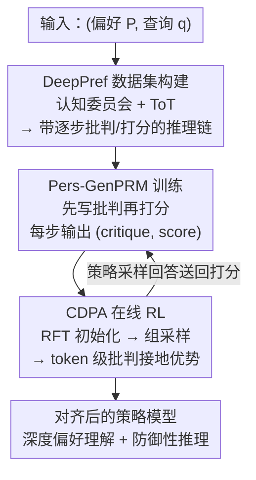

# Aligning Deep Implicit Preferences by Learning to Reason Defensively

**会议**: ICLR2026  
**OpenReview**: [https://openreview.net/forum?id=ZA7i5Otjqd](https://openreview.net/forum?id=ZA7i5Otjqd)  
**代码**: https://DeepPref.github.io/ （数据集）  
**领域**: 对齐RLHF / 个性化对齐 / 过程奖励模型  
**关键词**: 个性化对齐, 隐式偏好, 过程奖励模型, 防御性推理, 在线强化学习

## 一句话总结
针对 LLM 个性化对齐里"只会照搬用户说出口的偏好、推不出深层意图、也不会主动规避风险"的问题，本文把对齐从标量奖励匹配重构成结构化推理过程——先用"多角色认知委员会"造出带逐步批判标注的推理链数据集 DeepPref，再训练一个会"先写批判再打分"的生成式过程奖励模型 Pers-GenPRM，最后用融合数值与自然语言反馈的 token 级在线 RL（CDPA）对齐策略模型，在深度偏好理解和防御性推理上都拿到 SOTA。

## 研究背景与动机
**领域现状**：让 LLM 从"听话的指令执行器"变成"懂你的协作伙伴"，关键在个性化对齐。当前主流做法是 DPO 这类直接偏好优化，以及依赖最终结果监督的 RLHF——它们用一个标量奖励去拟合用户"表面上中意"的回答。

**现有痛点**：这类只看最终结果（outcome-based）的监督有两个具体毛病。其一，模型只会模仿用户**说出口**的偏好，推不出背后的深层意图。论文举了个很到位的例子：用户说"我不想分享实时位置"、又想让家人知道自己安全，一个浅层对齐的模型会推荐"到达后自动共享一个位置 pin"——它正确处理了"不要实时"这个显式约束，却没读懂用户真正在意的是**隐私与自主叙事权**（偏好缺口 preference gap）；同时它也没意识到"聚合的位置日志本身又是一种新的隐私负债"（过程缺口 process gap）。其二，标量奖励信号太稀疏、不可解释，无法引导复杂推理。

**核心矛盾**：作者把它形式化为**双重缺口**——偏好缺口（infer 不出未言明的目标、风险容忍度、优先级）和过程缺口（不会做 defensive reasoning，即主动识别并化解查询模糊性里潜伏的风险）。根因是监督信号挂在"最终答案"上，而不是挂在"得到答案的推理过程"上。还有一个 RL 特有的"零优势（zero advantage）"问题：一组采样回答最终结果可能一样好，但底层推理的质量和安全性差异很大，结果级奖励给不出区分它们的梯度。

**本文目标**：(1) 造出能教模型推理深层意图、主动规避风险的过程级监督数据；(2) 把这种文本批判转成可用于 RL 的结构化奖励；(3) 设计能利用过程级反馈、解决零优势问题的策略优化算法。

**切入角度**：与其监督"最终答案对不对"，不如监督"推理过程好不好"——让模型不仅学会生成答案，还学会**批判（critique）**这个答案有多尊重用户深层偏好、有没有管好潜在风险。批判本身就是一种认知过程监督。

**核心 idea**：用"批判驱动的推理对齐"（Critique-Driven Reasoning Alignment, CDRA）把对齐从标量奖励匹配重构成结构化推理过程，三件套贯通——批判标注数据集 + 生成式过程奖励模型 + 融合数值/语言反馈的在线 RL。

## 方法详解

### 整体框架
CDRA 是一条三阶段串行流水线。输入是 (用户偏好 $P$, 查询 $q$)，目标是学到策略 $\pi(y|q,P)$ 生成与深层隐式偏好 $P$ 对齐的回答 $y$。整体转法是：先用一套"多角色认知委员会 + 思维树"造出带逐步批判与打分的推理链，作为过程级监督的数据底座（DeepPref）；再用这批数据训练一个**生成式过程奖励模型** Pers-GenPRM，它对一个回答的每一步先写文本批判、再据此给标量分；最后把这种"批判接地"的逐步奖励喂给一个 token 级在线 RL 算法 CDPA，去对齐策略模型。三阶段之间是数据→奖励信号→策略的依赖关系，奖励模型和策略优化之间还形成一个紧反馈回环。

### 关键设计

**1. DeepPref 数据集：用"认知委员会 + 思维树"造出带逐步批判的过程监督**

偏好缺口和过程缺口的根子在于没有过程级监督数据——已有数据集都是 outcome-based 的偏好对，只告诉你"哪个答案更好"，不告诉你"怎么一步步推理出深层意图、怎么主动压住风险"。DeepPref 专门来补这个。它含 3000 个跨 20 个领域（个人理财、医疗健康等）的独特场景，每个是一个 $(P,q)$ 元组：偏好 $P$ 被刻意设计成含细腻、常常互相冲突的价值与未言明目标（如"我看重便利但又极度在意隐私"），查询 $q$ 则故意开放、含糊，逼模型去推理 $P$ 而非简单照做。

构造分两阶段。**(1) 多样路径生成**：用思维树（Tree of Thoughts）框架为每个场景生成推理路径，由一个**多角色认知委员会**（社会学家、心理学家、实用主义者、教育者、唱反调者等不同专家人格）引导、配合启发式剪枝，产出一批多样的推理链 $\tau_i=(s_i^1,\dots,s_i^{T_i})$。**(2) 逐步批判与打分**：一个强 LLM 评估器对链里每一步 $s_i^j$ 在给定前文路径的条件下，生成一段详细文本批判 $c_i^j$（评这一步对偏好 $P$ 的契合度、对风险的化解效果）和一个标量质量分 $r_i^j$。最终数据条目是 $(P,q,\tau_i,\{c_i^j,r_i^j\}_{j=1}^{T_i})$。其中含全部推理链与批判的子集 $D_{\text{Rea}}$ 用来训 Pers-GenPRM，质量最高的路径子集 $D_{\text{RFT}}$ 留给策略模型做初始微调。论文还把偏好分成"显式偏好"（直接说出来的，如"我不吃辣"）和"深度隐式偏好"（藏在语境/价值/未言明目标里的，如"不想分享实时位置"暗含对自主权的看重）——后者才是偏好缺口的核心难点。多角色 + 唱反调的设计，正是为了让推理链既能挖深层意图、又能被"压力测试"出潜在风险。

**2. Pers-GenPRM：把奖励建模变成"先批判后打分"的推理任务**

个性化偏好天生主观，没有数学那样的客观 ground truth，简单标量奖励容易强化表面相关性而非深层因果推理。Pers-GenPRM 的做法是不当一个"整体打分器"，而当一个**逐步批判模型**：对推理链里每一步 $s_i^j$，吃进前文上下文 $(P,q,\tau_i^{\le j})$，生成一个批判-分数对

$$(P,q,\tau_i^{\le j}) \mapsto (c_i^j, r_i^j)$$

其中 $c_i^j$ 是显式文本批判、$r_i^j$ 是据此得出的标量奖励。它在 $D_{\text{DeepPref}}$ 上用 SFT 训练，目标是最大化生成 ground-truth 批判-分数对的对数似然；由于是先自回归生成批判 $c_i^j$、再生成分数 $r_i^j$，损失拆成两项：

$$L_{\text{SFT}}(\theta) = -\mathbb{E}\Big[\sum_{j=1}^{T_i}\big(\log P_\theta(c_i^j|P,q,\tau_i^{\le j}) + \log P_\theta(r_i^j|c_i^j,P,q,\tau_i^{\le j})\big)\Big]$$

这样每一步都得到双成分奖励：一个可解释的批判 $c_i^j$ 给出透明的语义解释，一个**接地在该批判上**的标量 $r_i^j$ 作为批判的量化蒸馏。"先批判再打分"这个顺序很关键——它把数值信号因果地锚定到人类可读的理由上，让奖励的依据透明、可审计。把逐步分数聚合成稠密奖励 $R_{\text{dense}}(\tau_i)=\sum_{j=1}^{T_i} r_i^j$，就能按推理质量区分不同路径，缓解零优势问题。这相比"用自然语言反馈（NLF）当奖励"的已有工作更进一步：它不是只产文字，而是文字与可优化标量绑定。

**3. CDPA：把逐步批判奖励转成 token 级优势的在线 RL**

有了过程级奖励信号，还得有能吃下它的策略优化算法。CDPA 建立在 GRPO 之上，核心创新是给**每个 token 位置**赋一个细粒度优势，直接由 Pers-GenPRM 的逐步、批判接地奖励导出，从而在奖励建模与策略优化之间形成紧反馈回环。流程五步：**Step 1 策略初始化**——用高质量子集 $D_{\text{RFT}}$ 做拒绝采样微调（RFT）初始化策略 $\pi_\theta$；**Step 2 组采样**——对每个输入 $(P,q)$ 从当前策略采一组 $G$ 个回答；**Step 3 过程级奖励生成**——Pers-GenPRM 给每个回答的每一步 $s_i^j$ 打批判接地分 $r_i^j$；**Step 4 批判接地优势估计**——把某 token $t$ 所属步骤 $s_i^j$ 的奖励直接当成它的 token 级奖励 $r_{i,t}=r_i^j$，再在组内做零均值单位方差归一化：

$$\hat{A}(t,y_i)=\frac{r_{i,t}-\mu_g}{\sigma_g+\epsilon}$$

其中 $\mu_g,\sigma_g$ 是组内对应位置 token 级奖励的经验均值与标准差；**Step 5 策略更新**——用 PPO 式裁剪目标结合每 token 优势：

$$J_{\text{CDPA}}(\theta)=\mathbb{E}\Big[\frac{1}{G}\sum_{i=1}^{G}\sum_{t=1}^{C_i}\min\big(\rho_t\hat{A}(t,y_i),\,\text{clip}(\rho_t,1-\epsilon,1+\epsilon)\hat{A}(t,y_i)\big)\Big]-\beta D_{\text{KL}}(\pi_\theta\|\pi_{\text{ref}})$$

$\rho_t=\pi_\theta(t|\cdot)/\pi_{\text{old}}(t|\cdot)$ 是重要性比。为什么有效：标准 outcome-based RL 在"多个回答最终都对、但推理质量/安全性差异大"时给不出区分梯度（零优势）；CDPA 把奖励下沉到步骤/ token 级，让同组内每个 token 的"步骤质量"和同伴对比，从而提供能把策略推向**不仅正确、还可辩护、稳健、深度对齐**的稠密梯度。

### 损失函数 / 训练策略
基座统一用 Qwen2.5-7B-Instruct，借助 trl + vLLM 在 4×H20 上训练。Pers-GenPRM 用上面的 $L_{\text{SFT}}$ 在 DeepPref 上 SFT。策略侧先 RFT 初始化，再跑 CDPA：每个 prompt 采 $G=5$ 个回答、温度 1.0；所有 RL 方法在 400 个优化步内取最佳 checkpoint 汇报。

## 实验关键数据

### 主实验
评测覆盖三个维度：核心表现（显式偏好遵循 $\text{Acc}_{PF}$↑、深度对齐准确率 $\text{Acc}_{DA}$↑、误导风险 $\text{Acc}_{Mis}$↓）与深度推理质量（缜密度 $m_{th}$、深挖 $m_{dm}$、创新拓展 $m_{ie}$，均↑）。在自建 DeepPref 与 PrefEval 两个基准上对比一众基线：

| 数据集 | 方法 | $\text{Acc}_{PF}$↑ | $\text{Acc}_{DA}$↑ | $\text{Acc}_{Mis}$↓ | $m_{dm}$↑ | $m_{ie}$↑ |
|--------|------|------|------|------|------|------|
| DeepPref | CoT | 59.7 | 49.3 | 50.3 | 25.3 | 0.7 |
| DeepPref | SFT | 83.3 | 75.0 | 34.7 | 63.7 | 40.3 |
| DeepPref | GRPO | 83.7 | 70.3 | **30.7** | 58.7 | 34.0 |
| DeepPref | **CDRA** | **84.7** | **76.3** | 32.3 | **65.0** | **42.7** |
| PrefEval | GRPO | 67.0 | 51.8 | 27.3 | 17.0 | 1.8 |
| PrefEval | **CDRA** | **68.8** | **62.5** | 21.0 | **37.5** | **15.2** |

CDRA 在两个基准上深度对齐准确率都最高（DeepPref 76.3% / PrefEval 62.5%），尤其在创新拓展 $m_{ie}$ 上领先次优方法 2.4%+，同时显式偏好遵循也最高（84.7%），说明复杂推理能力的提升没有牺牲对显式指令的基本遵循。

多轮对话上做了人评（ALOE 数据集，1-5 分），CDRA 平均 3.92 分居首，且分数随对话轮次推进**持续上升**、后期峰值 4.6，而基线普遍趋于平台或退化——说明它能跨长对话累积用户语境、维持深度对齐：

| 模型 | k=1 | k=5 | k=8 | k=10 | 平均 |
|------|-----|-----|-----|------|------|
| TPO | 2.4 | 4.2 | 4.0 | 4.0 | 3.86 |
| GRPO | 2.0 | 3.6 | 3.4 | 3.4 | 3.18 |
| **CDRA** | 2.0 | 4.4 | 4.2 | 4.0 | **3.92** |

### 消融实验
在 DeepPref 上对比不同奖励建模范式（Pro. Sup. = 过程监督，Cri. Sup. = 批判监督）：

| 配置 | 过程监督 | 批判监督 | $\text{Acc}_{DA}$↑ | $m_{ie}$↑ |
|------|:---:|:---:|------|------|
| Base (Qwen2.5-7B-Instruct) | – | – | 49.3 | 0.7 |
| GRPO (with RM) | – | – | 70.3 | 34.0 |
| GRPO (with GRM，仅批判) | – | ✓ | 74.7 | 37.0 |
| GRPO (with PRM，仅过程) | ✓ | – | 73.0 | 38.3 |
| GRPO (Rubric-based RM) | – | – | 73.7 | 34.7 |
| GRPO (Test-Time Scaling) | – | – | 73.0 | 34.7 |
| **CDRA (Pers-GenPRM)** | ✓ | ✓ | **76.3** | **42.7** |

### 关键发现
- **过程监督 + 批判监督缺一不可**：单加过程监督（PRM）或单加批判监督（GRM）都能把深度对齐从 70.3% 提到 73~74.7%，但只有两者都上（CDRA）才到 76.3%，且创新拓展 $m_{ie}$ 从 34~38% 跳到 42.7%——证明"监督批判性推理过程本身"比只监督最终结果或中间步骤更关键。
- **简单启发式替代不了**：Rubric-based RM、Test-Time Scaling 这些更省事的方案在创新拓展上只有 34.7%，远不及 CDRA 的 42.7%，说明它们复刻不出挖掘潜在偏好所需的细腻推理。
- **存在可控权衡**：CDRA 主攻深挖与创新（$m_{dm}$/$m_{ie}$ 最高），代价是误导风险 $\text{Acc}_{Mis}$ 与缜密度 $m_{th}$ 略逊于个别基线——作者把这视为"产更多新颖高价值想法"换来的合理代价。
- **注意力证据**：注意力分布分析显示 CDRA 把 35.7% 的注意力质量集中在"偏好区域"，而 SFT/GRPO 的注意力是分散的——说明 Pers-GenPRM 监督教会了模型"该往哪看"，主动锚定用户约束、减少偏好无意识违背。

## 亮点与洞察
- **把"奖励建模"重写成"推理任务"**：Pers-GenPRM 先写批判再给分、且分数因果接地于批判，这一步把黑箱标量奖励变成可解释、可审计的信号，是本文最巧的地方——它既给了 RL 能用的标量，又保留了自然语言反馈的语义密度。
- **"零优势"问题的命名与解法很实用**：指出"最终结果一样好但推理质量不同"时标准 RL 给不出梯度，并用 token 级、组内归一化的批判接地优势把奖励下沉，这套思路可迁移到任何"过程比结果更重要"的对齐/推理任务（数学证明、agent 规划、安全对齐）。
- **"多角色认知委员会 + 唱反调者"造数据**：用对抗式人格主动 stress-test 候选回答，是把"防御性推理"这种难标注的能力工程化进数据的聪明做法，可复用于构造任何需要"主动找茬"的监督数据。
- **防御性推理这个问题设定**：把"显式约束满足"和"隐式原则违背"区分开（位置 pin 的例子），点出了个性化对齐里一个被忽视但很真实的失效模式。

## 局限与展望
- **可控权衡未必总划算**：误导风险 $\text{Acc}_{Mis}$ 和缜密度 $m_{th}$ 上 CDRA 并非最优（DeepPref 上 GRPO 的 $\text{Acc}_{Mis}$ 更低），在高风险场景（医疗、法律）里"更敢创新"可能不是想要的，权衡方向需按场景调。
- **奖励模型即天花板**：整套流程的监督质量被 Pers-GenPRM（及造数据用的强 LLM 评估器、DeepSeek-V3.2 评判器）决定，存在评估器偏好被蒸馏进策略、"LLM-as-judge"自洽循环的风险；偏好与批判的"正确性"本身是主观的，缺乏客观 ground truth 校验。
- **规模与基座单一**：仅在 Qwen2.5-7B-Instruct 上验证，DeepPref 3000 场景 / 20 领域，是否在更大模型、更广领域上仍优于简单基线未知；CDPA 的 token 级奖励赋值（同一步内所有 token 共享步奖励）较粗，是否真需要 token 级粒度可再探。
- **改进思路**：引入客观可验证的安全/风险检验器去校准误导风险一端；把批判奖励与可验证奖励（如规则/工具反馈）混合，缓解纯主观评判的自洽偏差。

## 相关工作与启发
- **vs DPO / 标准 RLHF**：它们用 outcome-based 标量监督拟合表面偏好；本文把监督下沉到推理过程、用批判当过程监督，目标是推出深层隐式偏好并主动规避风险，优势在"懂言外之意"，劣势是依赖昂贵的过程级数据与生成式奖励模型。
- **vs GRPO**：CDPA 直接建在 GRPO 上，区别在于优势信号——GRPO 用结果级组内归一化，CDPA 用批判接地的逐步/ token 级奖励，专门解 GRPO 在"结果同样好"时的零优势问题。
- **vs TPO（Tree Preference Optimization）**：两者都涉及思维树式结构，但 TPO 仍是偏好优化框架、易陷入字面遵循（实验里出现"提取了偏好仍无意识违背"的失败）；CDRA 先在语义/风险层面推理再生成，更能避免偏好无意识违背。
- **vs 用 NLF 当奖励的工作（Saunders 等）**：它们多产文本反馈；Pers-GenPRM 把文本批判与可优化标量绑定、且标量因果接地于批判，让自然语言反馈真正进得了 RL 的梯度。

## 评分
- 新颖性: ⭐⭐⭐⭐⭐ 把个性化对齐从标量匹配重构成"批判驱动的推理过程监督"，并贯通数据/奖励/RL 三层，问题设定（双重缺口、零优势）与解法都新。
- 实验充分度: ⭐⭐⭐⭐ 三维度评测 + 多基准 + 人评 + 奖励范式消融 + 注意力分析较完整，但仅单基座单规模、主观评判缺客观校验。
- 写作质量: ⭐⭐⭐⭐⭐ 动机用"位置 pin"实例讲得极清楚，方法分阶段、公式齐全，问题命名（preference/process gap、zero advantage）记忆点强。
- 价值: ⭐⭐⭐⭐ 过程级批判奖励 + token 级优势的范式对"过程比结果重要"的对齐/推理任务有较强迁移价值，DeepPref 数据集也有复用潜力。

<!-- RELATED:START -->

## 相关论文

- [\[ICLR 2026\] COMAL: A Convergent Meta-Algorithm for Aligning LLMs with General Preferences](comal_a_convergent_meta-algorithm_for_aligning_llms_with_general_preferences.md)
- [\[ICML 2026\] Implicit Safety Alignment from Crowd Preferences](../../ICML2026/llm_alignment/implicit_safety_alignment_from_crowd_preferences.md)
- [\[ICLR 2026\] Learning Ordinal Probabilistic Reward from Preferences (OPRM)](learning_ordinal_probabilistic_reward_from_preferences.md)
- [\[ACL 2025\] Synergistic Weak-Strong Collaboration by Aligning Preferences](../../ACL2025/llm_alignment/synergistic_weak-strong_collaboration_by_aligning_preferences.md)
- [\[ICLR 2026\] Data Selection for LLM Alignment Using Fine-Grained Preferences](data_selection_for_llm_alignment_using_fine-grained_preferences.md)

<!-- RELATED:END -->
