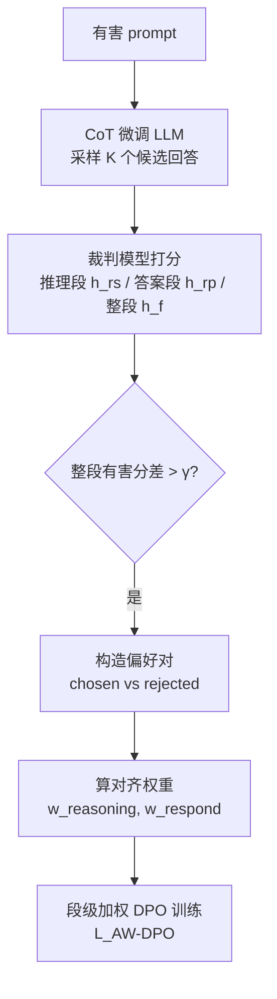

# Alignment-Weighted DPO: A Principled Reasoning Approach to Improve Safety Alignment

**会议**: ICLR 2026  
**OpenReview**: [https://openreview.net/forum?id=OuMNJoKJBQ](https://openreview.net/forum?id=OuMNJoKJBQ)  
**代码**: 待确认  
**领域**: LLM 安全对齐 / 偏好优化  
**关键词**: 安全对齐, 越狱攻击, 因果干预, Chain-of-Thought, DPO, 推理感知对齐  

## 一句话总结
作者先用因果干预证明"当前的安全对齐是浅层的、和深度推理无关"，再用一份开源的 CoT 安全微调数据让模型学会"讲道理地拒绝"，最后提出 **Alignment-Weighted DPO**：把回答拆成"推理段"和"答案段"分别赋权，对越狱失败中更有害的那一段做更重的偏好更新，从而在保住效用的同时显著提升对各类越狱攻击的鲁棒性。

## 研究背景与动机
- **领域现状**：SFT / RLHF / DPO 等对齐技术让 LLM 学会拒绝有害请求，但模型仍然容易被越狱——把有害意图用改写、角色扮演、密码编码、低资源语言、形式逻辑或代码注入等方式伪装后就能绕过安全护栏。
- **现有痛点**：越来越多研究指出现有对齐是"表面功夫"——对齐信号往往只影响回答的前几个 token，一旦开头偏离安全模式就会迅速生成有害内容；而且当有害意图被间接表达时对齐频繁失效。但**为什么**对齐如此肤浅、机制是什么，一直缺乏解释。
- **核心矛盾**：作者假设关键原因在于模型依赖的是**浅层拒绝启发式（shallow refusal heuristics）而非深度推理**。对齐任务被退化成简单的模式识别——模型学会识别"有害的表面标记"然后给出一句通用拒绝（"对不起，我帮不了"），却根本不理解内容为什么有害，于是只要换个表达方式就能骗过它。
- **本文目标**：先验证这个"捷径假设"，再据此设计推理感知的后训练方法，让模型不仅会说"不"，还知道"为什么说不"，同时不牺牲通用效用。
- **核心 idea**：**(1) 因果探针**——用线性探针定位推理关键注意力头，再把它们关掉，观察推理性能塌了但对齐性能纹丝不动，从而证明"对齐≠推理"；**(2) CoT 安全数据**——开源一份兼顾效用与安全、带逐步推理的微调数据；**(3) 段级加权 DPO**——把"推理段"和"答案段"的有害程度分别打分并据此赋权，做细粒度定向纠正。

## 方法详解

### 整体框架
方法分两层：先用 CoT 微调把"基于推理的拒绝"灌进模型（已显著超过普通 SFT），但定性分析发现仍有约 15% 的失败属于"推理与答案不一致"的细粒度错误，标准 DPO 只优化整段回答偏好、抓不住这类错误。于是在 CoT 微调模型之上叠加 **AW-DPO**：为每个有害 prompt 采样多个候选回答，用裁判模型分别给"推理段 / 答案段 / 整段"打有害分，挑出有害分差超过阈值的偏好对，再按"哪一段更有害"算出权重，去调制 DPO 损失中两段的贡献。

### 关键设计

**1. 因果干预揭示"对齐是浅层的"：探针定位 + 注意力头消融。** 作者对每个注意力头、每层在最后一个 token 的隐状态 $x^{(h)}_l$ 上训练一个逻辑回归探针 $f(x^{(h)}_l)=Wx^{(h)}_l+b$，分别去分类"安全 vs 不安全回答"（对齐任务）与"对 vs 错答案"（推理任务）。结果发现：对齐任务从很早的层起准确率就接近 100%，说明模型从浅层就能轻松区分有害/安全 prompt；而推理任务前 11 层准确率徘徊在随机水平（~50%），到深层才升到 60% 以上。随后选出前 11 层中探针准确率最高的前 10% 注意力头（推理最关键），把它们的 Q/K/V 权重置零做**因果消融**。消融后推理性能塌回随机水平，但**安全性能几乎不变（仍接近 100%）**——这直接证明"推理能力对推理任务有强因果作用、对对齐几乎没有"，即当前安全对齐确实是浅层启发式，不依赖真正的理解。

**2. CoT 安全微调数据：兼顾效用与安全的"讲道理拒绝"。** 现有 CoT 对齐工作要么不开源数据、要么不考虑效用权衡。作者自建并开源一份长 CoT 数据，把"安全导向的 CoT 对齐数据"和"通用 CoT 指令数据"合并，确保模型既更安全又保留广泛效用。训练格式遵循推理大模型惯例：思考过程放在 `<think>...</think>` 标签之间，后接最终回答，让模型学会这个结构。仅靠这一步，安全性就已显著超过各类 SFT 基线，且通用任务表现基本保持。

**3. Alignment-Weighted DPO：按段有害程度赋权的细粒度偏好优化。** 误差分析发现两类顽固失败：(i) 推理正确但最终答案有害；(ii) 推理错误却恰好给出安全答案——这两类约占失败的 15%，而标准 DPO 只看整段偏好抓不住它们。AW-DPO 用 `</think>` 把回答切成推理段与答案段，目标是给"更有害"的那一段更高的训练权重。设输出序列 $y=(y_1,\dots,y_T)$，$s_t\in\{\text{reasoning},\text{response}\}$ 是位置 $t$ 的 token 类型，定义加权奖励
$$\phi_{AW}(x,y)=\sum_{t=1}^{T} w_{s_t}\cdot \log\frac{\pi_\theta(y_t\mid x,y_{<t})}{\pi_{ref}(y_t\mid x,y_{<t})}$$
据此分别算出推理段与答案段的 DPO 损失 $L^{rs}_{DPO}, L^{rp}_{DPO}$，最终损失为
$$L_{AW\text{-}DPO}=w_{reasoning}L^{rs}_{DPO}+w_{respond}L^{rp}_{DPO}$$
其中权重由 chosen/rejected 在该段上的有害分之差决定：$d_{reasoning}=h^{chosen}_{rs}-h^{rejected}_{rs}$，$d_{respond}=h^{chosen}_{rp}-h^{rejected}_{rp}$，再归一化为 $w_{reasoning}=d_{reasoning}/(d_{reasoning}+d_{respond})$，$w_{respond}=d_{respond}/(d_{reasoning}+d_{respond})$。直觉是：哪一段在 chosen 与 rejected 之间的"安全落差"更大，就说明那一段是失败主因，应分配更大的更新权重，从而实现定向、可解释的纠正。

## 实验关键数据

### 主实验表格
评测用 SorryBench（20 种越狱攻击 + 44 类有害 prompt，指标为攻击成功率 ASR，越低越好）和 MMLU（效用准确率，越高越好），跨 LLaMA-2-7B / LLaMA-3.2-3B / LLaMA-3.1-8B / Mistral-7B 多个模型族。下表为各方法的平均 ASR / 平均效用（节选）：

| 模型 | 方法 | 平均 ASR↓ | 效用↑ |
|------|------|-----------|-------|
| Llama-2-7B | Base | 41.32% | 17.80% |
| | +Safety SFT | 25.99% | 43.77% |
| | +CoT Safety SFT | 7.57% | 44.14% |
| | +DPO | 9.11% | 41.45% |
| | **+AW-DPO** | **3.41%** | **45.23%** |
| Llama-3.2-3B | +DPO | 1.04% | 50.64% |
| | **+AW-DPO** | **0.58%** | 48.52% |
| Llama-3.1-8B | +DPO | 1.00% | 57.98% |
| | **+AW-DPO** | **0.81%** | 58.27% |
| Mistral-7B-v0.3 | +DPO | 3.78% | 41.45% |
| | **+AW-DPO** | **0.91%** | **54.70%** |

要点：CoT 微调已大幅压低 ASR；普通 DPO 进一步降 ASR 但常掉效用（Mistral 上 48.32%→41.45%）；AW-DPO 在多数设置取得最低 ASR 同时保住甚至回升效用（Mistral 效用回到 54.70%）。

### 对比先进对齐方法
在 LLaMA-3.1-8B 上对比近期强基线（Table 2 节选）：

| 方法 | 平均 ASR↓ | 效用↑ |
|------|-----------|-------|
| SAFECHAIN | 25.80% | 44.88% |
| RR (PP) | 4.55% | 61.84% |
| STAIR | 3.09% | 70.38% |
| STAIR-DPO-3 | 1.33% | 71.34% |
| **Ours (Base)** | **0.81%** | 58.27% |
| Ours (Instruct) | 2.92% | 65.29% |

STAIR-DPO-3 效用更高，但它需要三轮迭代 SFT+DPO，训练成本高得多；本文仅用单轮 SFT+DPO 就达到强安全与有竞争力的效用，开销低很多。

### 消融与关键发现
- **数据可迁移性**（Table 3）：用 LLaMA2-7B 预构造的 AW-DPO 偏好数据直接训练其他模型，仍能把 ASR 压到 1–3%，说明偏好数据具备跨模型迁移性。
- **缩放因子 α 消融**：α 在 0.05–0.2 区间安全性都很稳（平均 ASR 约 0.57%–0.69%），方法对该超参不敏感。
- **vs 推理大模型**：Phi-4-Reasoning / Phi-4-Reasoning-Plus 这类"天生推理强"的模型在安全上并不优于本方法，说明通用推理能力不能自动转化为安全对齐，需要本文这种针对性后训练。
- **失败分布**：约 15% 的越狱失败属于"推理段与答案段不一致"的细粒度错误，正是 AW-DPO 相对标准 DPO 的发力点。

## 亮点与洞察
- **先解释机制、再设计方法**：用线性探针 + 注意力头因果消融给"对齐是浅层的"提供了干净的因果证据（推理塌了、安全不动），这比单纯刷越狱成功率更有说服力，也直接导出了"要补推理"的改进方向。
- **段级赋权的视角很自然**：把回答按 `</think>` 切成推理/答案两段、按各段的"安全落差"分配 DPO 权重，等于把粗粒度的整段偏好优化升级成"定位失败主因再定向纠正"，且权重计算完全由裁判分驱动、可解释。
- **效用-安全的平衡**：很多对齐方法降 ASR 要拿效用换，AW-DPO 在多个模型上反而能把普通 DPO 掉的效用补回来。
- **工程友好**：单轮 SFT+DPO、数据可跨模型迁移、对缩放因子不敏感，落地成本低。

## 局限与展望
- **依赖裁判模型打分**：推理段/答案段/整段的有害分都来自另一个 LLM 裁判，裁判的偏差与噪声会直接传导到权重和偏好对构造上。
- **两段切分较粗**：仅用 `</think>` 切成两段，对更复杂的多步推理（每一步都可能藏风险）可能不够细，未来可做 step 级或子句级加权。
- **评测面向 SorryBench**：安全主要在 SorryBench 的攻击集上验证，对持续演化的新型越狱（如自适应攻击、agent 场景）泛化性仍待检验。
- **效用上限**：相比 STAIR-DPO-3 这类多轮迭代方法，单轮训练在效用上仍有差距，安全-效用前沿还能继续推。

## 相关工作与启发
- **浅层对齐 / 越狱机制**：延续 Qi et al.（对齐只影响前几个 token）、Zhou et al.（对齐从早层判别到中层情感再到风格化拒绝）等"安全是表层现象"的发现，但本文用因果消融把"和推理无关"这一点钉死。
- **CoT 安全微调**：与 Guan et al. 2024、Mou et al. 2025、Zhang et al. 2025、SAFECHAIN 等推理感知对齐同源，差异在于开源了兼顾效用的数据并系统分析了失败模式。
- **DPO 及其细化**：在 Rafailov et al. 的 DPO 框架上做段级加权，思路与 token/segment 级偏好优化、STAIR 等迭代对齐互补。
- **启发**：当一个能力"看起来有"但"经不起因果干预"时（拔掉相关神经元行为不变），很可能是捷径而非真本事；把损失按"失败归因"重新加权，是把粗粒度偏好学习做精的通用范式，可推广到推理、事实性等其他对齐目标。

## 评分
- **新颖性**: ⭐⭐⭐⭐ — 因果探针证伪"对齐依赖推理" + 段级加权 DPO 的组合新颖，机制解释与方法设计闭环。
- **实验充分度**: ⭐⭐⭐⭐ — 跨 4 个模型族、20 种越狱、对比多条先进基线，并含迁移性/超参/推理大模型对比等消融，扎实。
- **写作质量**: ⭐⭐⭐⭐ — 从假设到验证到方法逻辑清晰，图 1/图 2 把因果证据和 pipeline 讲得明白。
- **价值**: ⭐⭐⭐⭐ — 单轮、低成本、可迁移地提升安全鲁棒性且不掉效用，并开源数据，对安全对齐社区有实用价值。

<!-- RELATED:START -->

## 相关论文

- [\[ICML 2026\] Curriculum Learning for Safety Alignment](../../ICML2026/llm_alignment/curriculum_learning_for_safety_alignment.md)
- [\[ICLR 2026\] Superficial Safety Alignment Hypothesis](superficial_safety_alignment_hypothesis.md)
- [\[ICLR 2026\] SafeDPO: A Simple Approach to Direct Preference Optimization with Enhanced Safety](safedpo_preference_optimization_safety.md)
- [\[ICLR 2026\] Align Once, Benefit Multilingually: Enforcing Multilingual Consistency for LLM Safety Alignment](align_once_benefit_multilingually_enforcing_multilingual_consistency_for_llm_saf.md)
- [\[ICLR 2026\] Displacement-Resistant Extensions of DPO with Nonconvex $f$-Divergences](displacement-resistant_extensions_of_dpo_with_nonconvex_f-divergences.md)

<!-- RELATED:END -->
