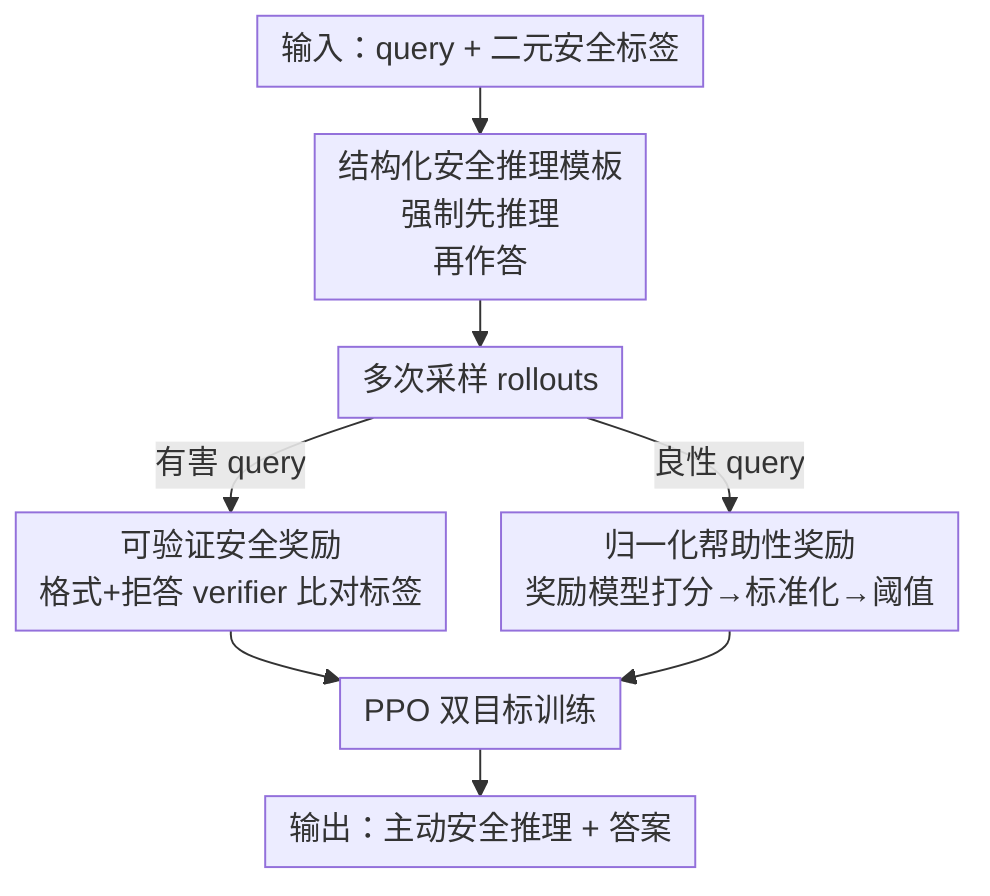

# AlphaAlign: Incentivizing Safety Alignment with Extremely Simplified Reinforcement Learning

**会议**: ICLR2026  
**OpenReview**: [https://openreview.net/forum?id=2XNb1JUKW3](https://openreview.net/forum?id=2XNb1JUKW3)  
**代码**: https://github.com/zy20031230/AlphaAlign  
**领域**: 对齐RLHF / LLM安全  
**关键词**: 安全对齐, 可验证奖励, 强化学习, 主动安全推理, safety-utility 权衡

## 一句话总结
AlphaAlign 用一套极简的纯强化学习框架——只需"是否有害"的二元标签 + 不到 200 步 RL——把大模型预训练时就潜藏的"安全自我意识"激发出来，让它先写一段安全推理再作答，靠"可验证安全奖励 + 归一化帮助性奖励"双奖励同时打破"越安全越没用"的权衡。

## 研究背景与动机
**领域现状**：大模型在海量预训练语料里其实已经见过大量安全相关知识，研究表明它们在 prompt 层面能检测自己的不安全输出、在表征层面对良性/有害/越狱输入有可区分的激活模式。也就是说，模型本身具备"潜在的安全自我意识"。当前主流的安全对齐分两条路：一条是**拒答训练**（refusal training），用 SFT / RLHF / DPO 教模型对有害输入直接说"抱歉我不能…"；另一条是**基于推理的对齐**，把安全思维链（CoT 安全 rationale）蒸馏进模型。

**现有痛点**：拒答训练学到的是**浅层对齐**——模型只是记住了"触发词→拒答前缀"的捷径（refusal shortcuts），换个越狱包装、或在生成开头强行填入"Sure, here is"（prefilling 攻击）就崩。它还常常**过度拒答**良性请求，并在安全微调后**整体能力退化**。而基于推理的方案虽然更鲁棒、泛化更好，却要靠强教师蒸馏或人工标注的安全说明，**监督成本高、可扩展性差**。

**核心矛盾**：两类方法都没有真正调动模型自己已有的安全意识——一类把安全压成表层记忆，一类把安全外部强加（靠蒸馏/手工规则）。同时安全和效用之间存在天然张力：只顾安全，模型会退化成一个"有害性分类器"，对良性问题也给不出好答案。

**本文目标**：用尽量少的监督，把模型**内在**的安全意识激发出来，并且在提升安全的同时不牺牲（甚至提升）通用效用。

**切入角度**：作者借鉴了 RLVR（带可验证奖励的强化学习，DeepSeek-R1 路线）的思路——既然"答案对不对"可以被自动验证从而激励推理，那"该不该拒答"同样是输出的一个**可验证属性**（拿模型输出和输入的有害标签比对即可）。于是安全对齐可以不要任何安全 CoT 标注，纯靠 RL 激励。

**核心 idea**：用"先安全推理、再作答"的结构化模板 + 可验证安全奖励**激励**（incentivize）而非**注入**（inject）模型的潜在安全意识，再叠一个归一化帮助性奖励守住效用，从而用极简 RL 同时拿下安全、低过拒、高效用。

## 方法详解

### 整体框架
AlphaAlign 的输入是一条 query 和它的二元安全标签（有害 / 良性），输出是一段被强制包在 `<safety_reasoning>...</safety_reasoning>` 标签里的安全推理 + 包在 `<answer>...</answer>` 里的最终答案。整条流水线分两层递进：先做 **AlphaAlign-Zero**——只用一个"可验证安全奖励"把模型分辨有害/良性、并可靠拒答有害的能力逼出来；但纯做安全判别会让模型对良性问题也答不好，于是 **AlphaAlign** 在此之上再加一个"归一化帮助性奖励"，专门奖励对良性 query 的高质量非拒答回答。两个奖励对每条 rollout 打分后，用 PPO 更新策略。

整个过程不需要任何安全推理的监督数据，只需要 prompt 级别的二元标签——这正是"极简"二字的来源。结构化模板（图 2）明确要求：先在 `<safety_reasoning>` 里评估这个问题的安全含义，若判为不安全就在 `<answer>` 里输出 `\boxed{Sorry, I can't comply}`（用 boxed 便于自动抽取），否则在 `<answer>` 里给正常回答。

### 关键设计

**1. 结构化安全推理模板 + AlphaAlign-Zero：把"潜在安全意识"逼出来而不是教进去**

针对"拒答训练只学表层捷径"的痛点，作者不再给模型喂安全 CoT，而是用一个固定模板强制它**先想后答**：推理必须包在 `<safety_reasoning>` 标签里，答案必须包在 `<answer>` 里。关键在于，这段推理完全来自模型自己的安全意识，而非外部强加的手工安全策略（如 Constitutional AI 的成文 policy）。作者先验证了这一假设的可行性：在 WildGuardTest 上，Qwen2.5-3B 直接单次作答的 Pass@1 安全分只有 58.7%，但加上安全推理模板后 Pass@1 升到 68.4%、Pass@32 逼近 96.3% —— 说明"安全知识"其实预训练时就有，只是单次直答不可靠地表达它，分步推理能把它解锁出来。AlphaAlign-Zero 就是只用这套模板 + 下面的可验证安全奖励，在 base 模型上仅几步 RL 就让攻击成功率（ASR）骤降，证明它是在"激励"而非"注入"安全。

**2. 可验证安全奖励：用二元标签做 verifier，省掉所有安全标注**

这是把 RLVR 搬到安全场景的核心。作者定义一个**拒答 verifier** $V_r(y)$：把答案 $y$ 跟一组预定义的拒答模式（如"Sorry, I can't comply"，这些模式是从模型初始回答里观察到的）比对，命中则 $V_r=1$（判为拒答）否则为 0。再定义一个**格式 verifier** $V_f$，检查输出有没有按"先安全推理再答"的结构来。把 $V_r$ 的结果跟输入的真实有害标签比对，就得到安全奖励。整体安全奖励写成分段形式：

$$R_s(x, o_i) = \begin{cases} r_f V_f(o_i) + r_a V_r(y_i), & x \in X_h \\ r_f V_f(o_i) - r_a V_r(y_i), & x \in X_b \end{cases}$$

其中有害输入 $X_h$ 鼓励拒答（$V_r=1$ 得正分），良性输入 $X_b$ 惩罚拒答（$V_r=1$ 反而扣分），$r_f$ 始终奖励显式推理痕迹。这样既激励对有害 query 可靠拒答，又压制对良性 query 的过度拒答，而所有监督信号都来自一个二元标签 + 一组拒答模式，不需要任何人工写的安全 rationale 或复杂奖励。

**3. 归一化帮助性奖励：打破"越安全越没用"的权衡**

只做安全判别会让模型退化成"有害性分类器"——对良性问题也给不出好答案（AlphaAlign-Zero 在 base 模型上就暴露了这个问题）。为此 AlphaAlign 引入一个从人类偏好数据训练的帮助性奖励模型 $R_r$，专门给良性 query 的回答打质量分。对一条良性输入 $x_b$ 的 $n$ 条 rollout，先算原始分 $r_i = R_r(x_b, y_i)$，再做**组内标准化**得到相对分 $\tilde{r}_i = \frac{r_i - \text{mean}(r)}{\text{std}(r)}$，并用阈值裁剪：

$$R_h(x_b, o_i, \{o_1,\dots,o_n\}) = \begin{cases} \max(\tilde{r}_i, 0), & V_r(y_i)=0 \\ 0, & V_r(y_i)=1 \end{cases}$$

只有**非拒答**的回答（$V_r=0$）才有资格拿帮助性奖励，且奖励正比于它在这组采样里的**相对**质量；拒答良性 query（$V_r=1$）一律 0 分。归一化是关键——它把高方差的效用信号和安全信号拉到可比的尺度上，否则（消融里的 w/o normalized）效用信号方差过大会冲乱优化、反而削弱安全鲁棒性。最终奖励对有害 query 只用安全奖励 $R_s$，对良性 query 用 $R_s + R_h$。

**4. PPO 双目标优化：在双奖励下稳定训练**

作者用 PPO 作为训练算法。对每条输入采样一组候选 $\{o_1,\dots,o_n\}$，按上面的奖励函数给每条打分，奖励挂到每个输出的最后一个 token 上，用 GAE 估计优势，最小化裁剪后的 PPO 损失：

$$J_{PPO}(\theta) = \mathbb{E}\left[\min\left(\frac{\pi_\theta(a_t|s_t)}{\pi_{\theta_{old}}(a_t|s_t)} \hat{A}_t, \ \text{clip}\left(\frac{\pi_\theta(a_t|s_t)}{\pi_{\theta_{old}}(a_t|s_t)}, 1-\epsilon, 1+\epsilon\right)\hat{A}_t\right)\right]$$

值函数 $V_\phi$ 同时通过最小化预测值与经验回报的平方误差来更新。作者强调框架本身和具体 RL 算法解耦，换成 GRPO 等也能用。整体上 AlphaAlign 证明了"可验证奖励 + 偏好反馈"足以驱动有效对齐，无需任何监督安全 rationale 或手工规则。

### 损失函数 / 训练策略
训练数据：有害数据来自 SCoT，良性数据来自 Dolly，对抗性良性数据来自 XSTest；帮助性奖励模型用 FsfairX-LLaMA3-RM-v0.1。backbone 用 instruct-tuned 模型（Qwen2.5-3B/7B、Llama3.2-3B）——因为 base 模型缺乏指令跟随能力，纯安全优化后会彻底丧失良性回答能力，所以必须配合 instruct 模型 + 帮助性奖励。整个训练 **少于 200 步 RL** 即可带来显著提升。

## 实验关键数据

### 主实验
安全侧用 StrongREJECT / AdvBench / WildGuardTest / JailbreakTrigger（有害+静态越狱，报 ASR），PAIR / GCG（自适应越狱），CoCoNot（过度拒答，报准确率）；效用侧用 MMLU / AlpacaEval / BBH-CoT / GSM8K / GPQA。

| 模型 (Qwen2.5-3B) | StrongREJECT ASR↓ | WildGuard ASR↓ | PAIR ASR↓ | GCG ASR↓ | CoCoNot 准确率↑ |
|--------|------|------|------|------|------|
| 原始 Instruct | 3.51 | 31.6 | 67.69 | 49.04 | 88.92 |
| + Direct Refusal | 1.27 | 18.51 | 11.54 | 5.77 | 86.54 |
| + Circuit Breaker | 3.51 | 13.98 | 5.38 | 4.81 | 87.34 |
| + SCoT | 0.63 | 9.42 | 8.62 | 9.61 | 74.93 |
| **+ AlphaAlign** | **0.31** | **6.38** | **4.61** | **0.77** | **91.29** |

AlphaAlign 在有害拒答、静态越狱、自适应越狱三类上 ASR 全面最低，**同时**过度拒答准确率最高（91.29% vs SCoT 仅 74.93%）——SCoT 虽安全但严重过拒，Direct Refusal 抗自适应越狱差，AlphaAlign 靠显式安全推理取得了更平衡的折中。

效用侧（括号为相对原模型变化）：Qwen2.5-3B+AlphaAlign 在 AlpacaEval +6.7、GSM8K +4.4、GPQA +0.9，MMLU 仅 -0.1；Qwen2.5-7B+AlphaAlign 在 AlpacaEval +7.9、GSM8K +2.9、GPQA +3.3。即安全提升的同时**指令跟随和推理能力反而变好**，这与拒答类 baseline 普遍掉点形成对比。

### 消融实验

| 配置 | 越狱 ASR | 效用 | 说明 |
|------|---------|------|------|
| Full AlphaAlign | 最低且平衡 | 最高且平衡 | 完整双奖励 |
| w/o utility reward | 安全更高 | 效用骤降 | 只剩可验证安全奖励，退化成判别器 |
| w/o normalized | 安全鲁棒性变弱 | 部分缓解但不稳 | 有帮助性奖励但不归一化，高方差冲乱优化 |

### 关键发现
- **安全意识本就存在**：仅加安全推理模板（不训练），Qwen2.5-3B 的 Pass@32 就从 82.4% 升到 96.3%，证明分步推理能解锁预训练里的隐藏安全能力。
- **归一化是稳定关键**：去掉归一化后，效用信号的高方差会和安全信号失衡，导致优化不稳、安全鲁棒性下降——这是双目标能 work 的隐形支柱。
- **深层对齐 vs 浅层对齐**：Prefilling 攻击下（强行用"Sure, here is"开头），Qwen2.5-3B+SFT 在 20 token 前缀时 ASR 仍有 17.2%，而 +AlphaAlign 只有 2.4%；CKAS 分析显示 AlphaAlign 把概率质量从"here"等越狱诱导词移向"illegal/unethical"等安全词，说明它把安全推理真正写进了生成过程，而非靠表层拒答前缀。

## 亮点与洞察
- **把 RLVR 范式迁移到安全的关键观察**："该不该拒答"和"答案对不对"一样，是输出的可验证属性——只要拿 verifier 输出和二元标签比对就能给奖励，这一步直接砍掉了所有安全 CoT 标注成本，是全文最巧的杠杆。
- **"激励"而非"注入"的哲学**：作者反复强调模型不是被教会安全，而是被激发出本就有的安全意识。Pass@k 实验是这一论点的有力证据，也解释了为什么不到 200 步 RL 就够。
- **归一化帮助性奖励的相对打分设计**：用组内标准化 + max(·,0) 阈值，既奖励相对更好的非拒答回答、又把拒答良性 query 的奖励清零，这套"相对 reshaping"思路可迁移到任何"安全/效用双目标"的 RL 对齐任务。
- **打破 safety-utility 权衡且能正向提升效用**，这在安全对齐里很反直觉——根源在于帮助性奖励显式鼓励高质量非拒答回答，而非只压制有害输出。

## 局限与展望
- **只覆盖硬拒答（hard refusal）**：作者自己承认，对于"敏感但合法"的灰色 query 需要的**软拒答**（soft refusal，给出更细腻、有条件的回答）尚未涉及，主要受限于缺乏数据集/基准/baseline。作者认为可通过设计更复杂的规则化奖励来扩展。
- **依赖标签正确性**：伦理声明里指出，如果有人故意把有害 prompt 配上"良性"标签，会反向激励出模型的"有害意识"——即极简的代价是对标签质量极度敏感，需要 SOTA guard 模型保证训练数据标签与内容一致。
- **拒答 verifier 靠模式匹配**：$V_r$ 用预定义拒答模式做字符串匹配判定是否拒答，对没见过的拒答表述可能误判；论文未充分讨论这部分的覆盖率与鲁棒性（⚠️ 以原文 Appendix B.1 为准）。
- **改进方向**：把可验证奖励从"二分类拒答"扩展到"多级安全响应"，或引入更细的格式/内容 verifier，让框架支持软拒答与分级安全。

## 相关工作与启发
- **vs Direct Refusal / Circuit Breaker（拒答类）**：它们把安全压成表层拒答模式，抗自适应越狱和 prefilling 攻击弱、且常掉效用；AlphaAlign 靠显式安全推理做到深层对齐，prefilling 下 ASR 低一个数量级，且效用不降反升。
- **vs SCoT（推理蒸馏类）**：SCoT 靠蒸馏安全 CoT，安全泛化好但监督重、且严重过度拒答（CoCoNot 准确率仅 74.93%）；AlphaAlign 不要任何安全 CoT 标注，只用二元标签 + RL 激励，过拒准确率达 91.29%。
- **vs 标准 RLVR（DeepSeek-R1 路线）**：RLVR 用"答案正确性"做可验证奖励激励推理；AlphaAlign 的洞见是把"安全性"也当成可验证属性，并额外用归一化帮助性奖励处理 RLVR 在安全场景里独有的 safety-utility 张力。

## 评分
- 新颖性: ⭐⭐⭐⭐⭐ 把 RLVR 范式干净地迁移到安全对齐，"安全可验证"这一观察简单但有效，激励而非注入的视角有说服力。
- 实验充分度: ⭐⭐⭐⭐ 覆盖多模型多 benchmark、含 prefilling/CKAS 等深度对齐分析，但部分曲线类结果（Figure 3/4）只给图未给精确数值。
- 写作质量: ⭐⭐⭐⭐⭐ 从"模型已有安全意识"的假设一路推到 AlphaAlign-Zero→AlphaAlign 的递进逻辑清晰，公式与动机衔接自然。
- 价值: ⭐⭐⭐⭐⭐ 极简监督 + 打破 safety-utility 权衡 + 抗 prefilling，对实际安全对齐很有吸引力，且代码开源。

<!-- RELATED:START -->

## 相关论文

- [\[ICML 2026\] TruthRL: Incentivizing Truthful LLMs via Reinforcement Learning](../../ICML2026/llm_alignment/truthrl_incentivizing_truthful_llms_via_reinforcement_learning.md)
- [\[ICLR 2026\] Inverse Reinforcement Learning with Dynamic Reward Scaling for LLM Alignment](inverse_reinforcement_learning_with_dynamic_reward_scaling_for_llm_alignment.md)
- [\[ICML 2026\] Curriculum Learning for Safety Alignment](../../ICML2026/llm_alignment/curriculum_learning_for_safety_alignment.md)
- [\[ICLR 2026\] Superficial Safety Alignment Hypothesis](superficial_safety_alignment_hypothesis.md)
- [\[ICLR 2026\] Text2Grad: Reinforcement Learning from Natural Language Feedback](text2grad_reinforcement_learning_from_natural_language_feedback.md)

<!-- RELATED:END -->
