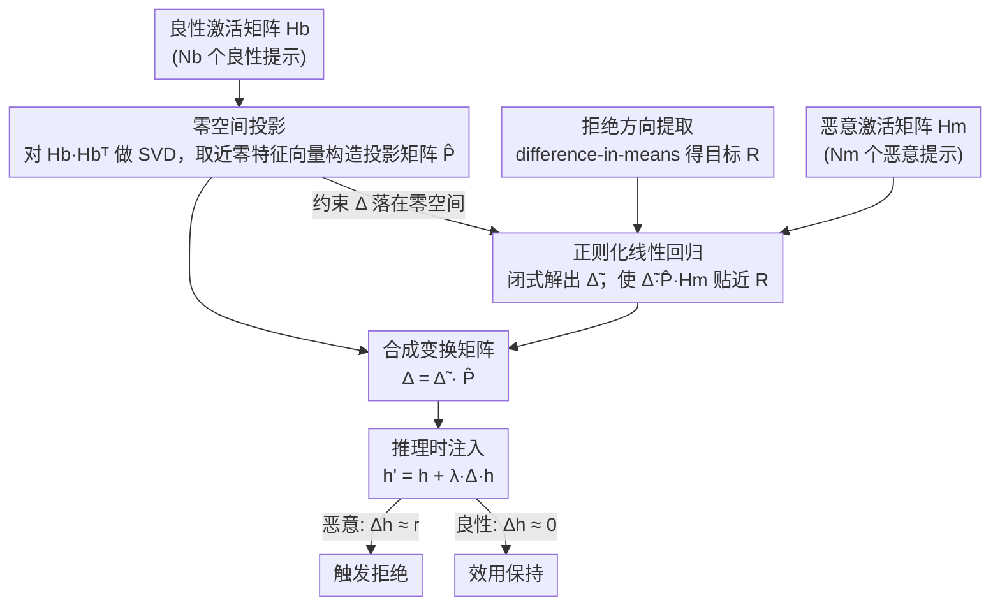

# AlphaSteer: Learning Refusal Steering with Principled Null-Space Constraint

**会议**: ICLR 2026  
**arXiv**: [2506.07022](https://arxiv.org/abs/2506.07022)  
**代码**: [https://github.com/AlphaLab-USTC/AlphaSteer](https://github.com/AlphaLab-USTC/AlphaSteer)  
**领域**: LLM对齐  
**关键词**: activation steering, refusal direction, null-space projection, jailbreak defense, safety-utility trade-off

## 一句话总结
提出 AlphaSteer，通过学习一个受零空间约束的变换矩阵来动态构造 steering 向量，对良性输入产生近零向量（保持效用），对恶意输入重建拒绝方向向量（增强安全），在理论上保证了安全与效用的解耦。

## 研究背景与动机
**领域现状**：激活引导（activation steering）是一种新兴的 LLM 安全增强方法，核心思路是在推理时向模型内部激活注入一个"拒绝方向向量" $\mathbf{r}$，使模型对恶意提示产生拒绝行为。

**现有痛点**：直接对所有输入注入同一个 $\mathbf{r}$ 会导致良性提示也被过度拒绝，出现安全性与实用性的 trade-off。现有工作要么做向量校准（Surgical 等用 PCA 分解/减去假拒绝分量），要么做条件引导（CAST 等设阈值仅对"恶意"激活施加引导），但都是启发式设计，缺乏理论保证。

**核心矛盾**：safety enhancement 和 utility preservation 本质上是对同一个 steering 操作的对立需求——恶意激活需要被大幅改变，良性激活需要保持不变，而现有方法无法在数学上保证这一点。

**本文目标**（1）如何让 steering 对良性激活严格无影响？（2）如何让 steering 对恶意激活可靠地重建拒绝方向？

**切入角度**：作者注意到零空间（null space）的数学性质——如果变换矩阵的行向量都在良性激活矩阵的零空间中，那么该变换作用于良性激活必然产生零向量。

**核心 idea**：用"零空间约束的可学习变换矩阵"代替"固定拒绝方向向量"，实现对良性/恶意输入的自适应引导。

## 方法详解

### 整体框架
AlphaSteer 要解决的是激活引导里"注入同一个拒绝向量会误伤良性提示"的老问题：它不再注入固定向量，而是让 steering 向量随输入自适应变化——良性输入几乎不被改动，恶意输入才被推向拒绝方向。具体地，取 LLM 某层激活 $\mathbf{h}^{(l)}$，用一个变换矩阵 $\Delta^{(l)}$ 动态生成 steering 向量 $\mathbf{s}^{(l)} = \Delta^{(l)} \mathbf{h}^{(l)}$，再加回激活：$\mathbf{h}'^{(l)} = \mathbf{h}^{(l)} + \lambda \Delta^{(l)} \mathbf{h}^{(l)}$。关键在于把 $\Delta$ 拆成两块相乘 $\Delta = \tilde{\Delta} \hat{\mathbf{P}}$：右边的 $\hat{\mathbf{P}}$ 是从良性激活解析出的零空间投影矩阵，负责"对良性输入失效"；左边的 $\tilde{\Delta}$ 是以拒绝方向为回归目标、用正则化最小二乘闭式解出的矩阵，负责"对恶意输入重建拒绝方向"。整条流水线分两路准备再汇合——良性激活一路 SVD 出投影矩阵，恶意激活配上拒绝方向一路回归出变换矩阵，两者相乘得到 $\Delta$ 后只在推理时多做一次矩阵乘法。两块各管一个目标，从结构上把安全和效用解耦开，全程无需梯度训练。

### 关键设计

**1. 零空间投影：让 steering 对良性激活天然失效**

这一步针对的痛点是"良性提示被过度拒绝"。作者的做法是先收集 $N_b$ 个良性提示的激活拼成矩阵 $\mathbf{H}_b$，对其非中心协方差矩阵 $\mathbf{H}_b \mathbf{H}_b^\top$ 做 SVD，取接近零的特征值所对应的特征向量张成零空间，构造投影矩阵 $\hat{\mathbf{P}} = \hat{\mathbf{U}} \hat{\mathbf{U}}^\top$。由于 $\hat{\mathbf{P}}$ 把任何向量投到良性激活的零空间里，所以 $\tilde{\Delta} \hat{\mathbf{P}} \mathbf{H}_b = \mathbf{0}$ 严格成立——无论 $\tilde{\Delta}$ 学成什么样，作用在良性激活上的 steering 向量都是零。和 Surgical、CAST 那种靠校准或阈值"尽量别动良性输入"的启发式不同，这里是数学上的硬保证。实现上还借助 Lemma 1 把零空间计算从 $N_b$ 维降到激活维度 $d$（$d \ll N_b$），避免对大矩阵直接 SVD。

**2. 正则化线性回归：让 steering 对恶意激活重建拒绝方向**

零空间投影解决了"不误伤良性"，但还要保证"恶意输入真的被拒绝"，这就由 $\tilde{\Delta}$ 来学。把目标写成带正则的最小二乘：

$$\min_{\tilde{\Delta}} \ \|\tilde{\Delta} \hat{\mathbf{P}} \mathbf{H}_m - \mathbf{R}\| + \alpha \|\tilde{\Delta} \hat{\mathbf{P}}\|$$

即希望对恶意激活矩阵 $\mathbf{H}_m$，生成的 steering 向量 $\tilde{\Delta}\hat{\mathbf{P}}\mathbf{H}_m$ 尽量贴近目标拒绝方向 $\mathbf{R}$，正则项 $\alpha$ 控制幅度、防过拟合。这个问题有闭合解：

$$\tilde{\Delta}^\star = \mathbf{R} \mathbf{H}_m^\top \hat{\mathbf{P}}^\top \big(\hat{\mathbf{P}} \mathbf{H}_m \mathbf{H}_m^\top \hat{\mathbf{P}}^\top + \alpha \hat{\mathbf{P}} \hat{\mathbf{P}}^\top\big)^+$$

有闭合解意味着不用迭代优化、不用反向传播，一次矩阵运算就能得到 $\tilde{\Delta}$，部署极简。注意 $\hat{\mathbf{P}}$ 出现在回归里，保证学出来的 $\Delta = \tilde{\Delta}\hat{\mathbf{P}}$ 仍落在零空间约束内，不破坏设计 1 的效用保证。

**3. 拒绝方向提取：给回归一个"拒绝长什么样"的目标**

回归里的目标 $\mathbf{R}$ 来自拒绝方向向量 $\mathbf{r}$，提取方式沿用 Arditi et al. 的 difference-in-means——计算模型在拒绝响应和服从响应上的激活均值之差。区别在于用法：以往方法直接把 $\mathbf{r}$ 注入所有输入，而 AlphaSteer 只把它当作恶意输入的回归目标，让 $\Delta$ 学会"仅对恶意激活重建出 $\mathbf{r}$、对良性激活输出零"，从而避开了直接注入带来的效用损失。

### 训练策略
整个方法不需要梯度优化：零空间投影矩阵 $\hat{\mathbf{P}}$ 由 SVD 解析得到，变换矩阵 $\tilde{\Delta}$ 由正则化最小二乘的闭合解得到。全流程只需前向传播收集良性/恶意激活 + 几次矩阵运算，无反向传播，推理时也只多一次矩阵乘法，部署成本极低。

## 实验关键数据

### 主实验：防御成功率 (DSR)

| 模型 | 方法 | AIM | AutoDAN | Cipher | GCG | Jailbroken | PAIR | ReNeLLM | Avg DSR |
|------|------|-----|---------|--------|-----|------------|------|---------|---------|
| Llama-3.1-8B | Vanilla | 92 | 48 | 0 | 58 | 75 | 45 | 28 | 48.0 |
| | Surgical | 100 | 76 | 61 | 98 | 88 | 90 | 67 | 82.8 |
| | Circuit Breaker | 100 | 100 | 34 | 100 | 80 | 96 | 81 | 84.4 |
| | **AlphaSteer** | **100** | **99** | **63** | **97** | **92** | **98** | **100** | **91.9** |
| Qwen2.5-7B | Vanilla | 25 | 2 | 1 | 22 | 71 | 19 | 4 | 20.6 |
| | **AlphaSteer** | **100** | **100** | **100** | **100** | **95** | **88** | **98** | **97.3** |
| Gemma-2-9b | Vanilla | 0 | 5 | 0 | 75 | 68 | 17 | 8 | 24.7 |
| | **AlphaSteer** | **100** | **98** | **100** | **100** | **99** | **91** | **99** | **98.2** |

### 效用保持对比

| 模型 | 方法 | XSTest CR↑ | AlpacaEval WR↑ | MATH Acc↑ | GSM8K Acc↑ | Utility Score |
|------|------|------------|----------------|-----------|------------|---------------|
| Llama-3.1-8B | Vanilla | 92.4 | 50.0 | 45.0 | 81.0 | 67.1 |
| | CAST | 90.0 | 31.1 | 0.0 | 0.0 | 30.2 |
| | RV (直接注入) | 4.0 | 10.4 | 37.0 | 65.0 | 29.1 |
| | **AlphaSteer** | **91.2** | **48.1** | **46.0** | **84.0** | **67.3** |
| Qwen2.5-7B | Vanilla | 97.2 | 50.0 | 67.0 | 96.0 | 77.6 |
| | **AlphaSteer** | **95.6** | **48.1** | **65.0** | **95.0** | **75.9** |

### 关键发现
- AlphaSteer 在 3 个模型上平均 DSR 均超 90%，同时 utility score 几乎不降（与 vanilla 差距 <2%）。
- 对比鲜明：CAST 在数学任务上 accuracy 降至 0%（将数学题误判为恶意），直接注入 RV 的 utility score 降至 2.4~29.1%。
- PCA 可视化显示 AlphaSteer 的 steering 向量对良性激活的 L2 范数远小于恶意激活，验证了零空间约束的有效性。
- 随着 steering 强度 $\lambda$ 增大，AlphaSteer 的安全性持续提升而效用保持稳定，baselines 则出现效用急剧下降。

## 亮点与洞察
- **理论 → 实践的完美落地**：将零空间投影这一经典线性代数工具引入激活引导，从数学上保证了良性激活不受影响。整个方法有闭合解，无需训练循环，推理时只增加一次矩阵乘法，非常优雅。
- **安全-效用完全解耦**：不同于以往 trade-off 式的设计，AlphaSteer 从结构上将两个目标解耦——零空间投影负责效用，线性回归负责安全，互不干扰。
- **可迁移的设计思路**：零空间约束的"对一类数据无影响，对另一类数据最大化效果"的设计范式可以迁移到其他需要选择性干预的场景（如 continual learning 中防止遗忘、模型编辑中保护非目标知识）。

## 局限与展望
- 仅在 7-9B 模型上验证，未测试大规模推理模型（如 o1/DeepSeek-R1），零空间维度在更大模型上是否依然有效存疑。
- 需要预先收集良性和恶意激活来计算零空间和学习 $\tilde{\Delta}$，对数据分布敏感——若测试时的恶意模式与训练时差异大，reconstruction 质量可能下降。
- 零空间的实际计算中将最小 $p\%$ 特征值视为零，这个阈值是超参数，影响安全-效用的平衡点。
- 方法仅在推理时修改激活，不改变模型权重，因此不具备对抗 weight-level 攻击的能力。

## 相关工作与启发
- **vs Surgical (Wang et al., 2024)**：Surgical 通过 PCA 校准拒绝方向，但仍然对所有输入统一施加，PCA 可视化明显扭曲了良性激活。AlphaSteer 的零空间约束从数学上避免了这个问题。
- **vs CAST (Lee et al., 2024)**：CAST 用阈值判断是否施加 steering，但阈值设计是启发式的，导致数学题被误判为恶意、utility 归零。AlphaSteer 无需阈值判断。
- **vs Circuit Breaker (Zou et al., 2024)**：Circuit Breaker 需要额外训练，而 AlphaSteer 仅需矩阵运算即可部署，计算成本更低。
- 该方法的零空间投影思路与 continual learning 中的 OWM/PackNet 有异曲同工之妙，都是通过投影到正交空间来保护已有功能。

## 评分
- 新颖性: ⭐⭐⭐⭐ 零空间约束应用于激活引导是新颖的理论贡献，但拒绝方向提取仍沿用已有方法
- 实验充分度: ⭐⭐⭐⭐ 3 个模型 × 7 种攻击 × 4 个效用基准，覆盖全面，但缺少大模型实验
- 写作质量: ⭐⭐⭐⭐⭐ 理论推导清晰，公式-图-表配合得当，从动机到方法到实验逻辑链完整
- 价值: ⭐⭐⭐⭐ 提供了一个推理时零成本的安全增强方案，实用价值高，但可扩展性待验证

<!-- RELATED:START -->

## 相关论文

- [\[CVPR 2026\] Principled Steering via Null-space Projection for Jailbreak Defense in Vision-Language Models](../../CVPR2026/llm_alignment/principled_steering_via_null-space_projection_for_jailbreak_defense_in_vision-la.md)
- [\[ICLR 2026\] Mitigating the Safety Alignment Tax with Null-Space Constrained Policy Optimization](mitigating_the_safety_alignment_tax_with_null-space_constrained_policy_optimizat.md)
- [\[ICLR 2026\] RECAST: Expanding the Boundaries of LLMs' Complex Instruction Following with Multi-Constraint Data](recast_expanding_the_boundaries_of_llms_complex_instruction_following_with_multi.md)
- [\[ICLR 2026\] Alignment-Weighted DPO: A Principled Reasoning Approach to Improve Safety Alignment](alignment-weighted_dpo_a_principled_reasoning_approach_to_improve_safety_alignme.md)
- [\[ICLR 2026\] Sysformer: Safeguarding Frozen Large Language Models with Adaptive System Prompts](sysformer_safeguarding_frozen_large_language_models_with_adaptive_system_prompts.md)

<!-- RELATED:END -->
