# Anchored Supervised Fine-Tuning

**会议**: ICLR 2026  
**OpenReview**: [https://openreview.net/forum?id=PORko7QT64](https://openreview.net/forum?id=PORko7QT64)  
**代码**: [https://github.com/zhuchichi56/ASFT](https://github.com/zhuchichi56/ASFT)  
**领域**: LLM 对齐 / 后训练 (Post-training)  
**关键词**: 监督微调, Dynamic Fine-Tuning, reward-weighted regression, KL 锚定, 分布漂移  

## 一句话总结
本文用 reward-weighted regression (RWR) 框架严格解释了 DFT「更紧但会漂移」的本质，并提出在 DFT 重加权目标上叠加轻量级 KL 锚定项的 ASFT，以 SFT 级算力同时拿下推理与知识两类任务的稳定增益。

## 研究背景与动机
- **领域现状**：LLM 后训练在 SFT 与 RL 之间存在根本权衡——SFT 高效模仿示范但倾向死记表面模式、泛化弱；RL 用结果奖励换来更强泛化，却昂贵且不稳定。学界因此涌现一批「以 RL 视角重看 SFT」的折中方法，其中 Dynamic Fine-Tuning (DFT) 用 token 概率对 SFT 目标重加权，在数学推理上效果显著。
- **现有痛点**：DFT 是个启发式构造，缺乏理论解释，且效果高度领域依赖——在推理任务出色，但在知识密集型任务（如医学问答）反而不稳定甚至倒退（10k 规模平均掉 -2.19 分）。没人说清它「为什么在某些域有效、为什么会崩」。
- **核心矛盾**：DFT 的重加权确实给出了比 SFT 更紧的 RL 下界，但这个构造**没有任何分布锚定机制**，训练中策略分布会渐进偏离参考分布，使下界越来越松、重要性权重方差爆炸，有效样本数下降，最终训练发散。即「更紧」和「稳定」无法兼得。
- **本文目标**：在 RWR 框架内把 DFT 讲清楚（它对应哪种辅助分布、为什么更紧、为什么会漂移），并设计一个既保住紧致性、又恢复稳定性的轻量方法。
- **核心 idea**：**「紧致性来自重加权，稳定性来自锚定」**——保留 DFT 的概率重加权目标不动，额外加一项把策略约束在预训练模型信任域内的 KL 正则，用极小算力开销同时获得 RL 级泛化与 SFT 级效率。

## 方法详解

### 整体框架
全文先在 RWR 框架下做理论拆解：SFT 是 RL 目标的一个稳定但松的下界，而通过引入辅助分布 $q(\tau)$ 可以构造更紧的下界（公式 2）。作者证明 DFT 恰好对应一种特定的 $q$ 选择，它严格更紧但缺乏锚定导致漂移。ASFT 的做法极简：在 DFT 目标上加一个把策略拉回预训练基模型的 KL 项，从而在不破坏下界紧致结构的前提下提供方差控制。

```mermaid
flowchart LR
    A[RL 目标 J&#40;θ&#41;] --> B[SFT: 稳定但松的下界]
    A --> C[RWR: 引入辅助分布 q&#40;τ&#41;<br/>可构造更紧下界]
    C --> D[DFT: 特定 q 选择<br/>严格更紧 但无锚定→漂移]
    D --> E[ASFT: DFT目标 + λ·KL锚定<br/>保紧致 + 控方差]
```

### 关键设计
**1. 用 RWR 框架给 DFT 一个精确身份：它是一种 stop-gradient 加权的辅助分布。** 作者从 reward-weighted regression 出发，写出 RL 目标的一族辅助分布下界 $J(\theta)\ge c_{\text{ref}}\cdot\mathbb{E}_{\tau\in D^+}\big[\tfrac{q(\tau)}{\pi_{\text{ref}}(\tau)}\log\pi_\theta(\tau)\big]$，其中辅助分布 $q$ 同时决定下界的紧致度与优化稳定性。关键发现是 DFT 等价于选择 $q(\tau)=\pi_{\text{ref}}(\tau\mid D^+)\cdot\tfrac{\text{sg}[p_\theta(\tau)]}{\mathbb{E}[\text{sg}[p_\theta(\tau)]]}$，代回即精确复现 DFT 的序列级目标 $L_{\text{DFT}}=-\mathbb{E}_{\tau\in D^+}[\text{sg}(p_\theta(\tau))\log p_\theta(\tau)]$。这把一个启发式的「概率重加权」trick 落到了 RWR 的形式化地基上。

**2. 证明 DFT 严格更紧、但也证明它必然漂移——两者同源。** 在此基础上 Theorem 1 给出：只要策略在 $D^+$ 上对示范的概率非均匀（$\mathrm{Var}(p_\theta(\tau))>0$），DFT 的辅助分布就给出**严格紧于** SFT 的下界，这解释了它在高方差推理域的优势。但同一构造也埋了雷：推导 RL 下界用到的不等式 $u\ge 1+\log u$ 仅当 $u=1$ 取等，而 DFT 中 $u=\pi_\theta(\tau)/q_\theta(\tau)$，紧致只在 $p_\theta(\tau)$ 于 $D^+$ 上恒定时成立。训练越走 $p_\theta$ 越不均匀，$q$ 越集中到高概率轨迹，形成反馈回路、有效样本数萎缩——这就是 DFT 在知识任务上发散的根因，且它和「更紧」是一枚硬币的两面。

**3. ASFT：在重加权目标上叠加 KL 锚定，不动下界结构只控方差。** 解法只加一项：
$$L_{\text{ASFT}}(\theta)=L_{\text{DFT}}(\theta)+\lambda\,\mathbb{E}_s\big[D_{\text{KL}}(\pi_{\text{base}}(\cdot\mid s)\,\Vert\,\pi_\theta(\cdot\mid s))\big]$$
其中 $\pi_{\text{base}}$ 是固定的预训练模型，$\lambda>0$ 控锚定强度（实验取 $\lambda=0.05$）。这个 KL 项在参考策略周围划出一个信任域，允许策略「受控地」去探索更紧的下界而不漂走。关键是它**不改变下界的紧致结构**（DFT 的重加权照常生效），只额外提供显式方差控制，阻止纯 DFT 中重要性权重的指数级增长。

**4. 用前向 KL（mode-covering）而非反向 KL，且按 token 归一化实现。** 选用 $D_{\text{KL}}(\pi_{\text{base}}\Vert\pi_\theta)$（前向、覆盖众数），鼓励策略保住基模型的宽分布、防止坍缩；反向 KL 是寻众数的，容易让模型收窄。落地上沿用主流训练范式，把序列级权重按位置归一化摊到每个 token，保证与序列级理论框架数学等价，同时只比标准 SFT 多一个简单 KL 惩罚、算力开销极小（仅约全量 RL 的 3%）。

## 实验关键数据
- **模型**：医学知识用 LLaMA-2-7B 与 Qwen2.5-7B；数学推理用 Qwen2.5-7B。
- **数据**：数学用 NuminaMath CoT（10k/30k/100k），测 Math500/Minerva/Olympiad/AIME24/AMC23；医学用 MedMCQA（10k/30k/100k），测 MMLU-medical/MedQA/MedMCQA。

### 主实验表格
医学（LLaMA-2-7B）与数学（Qwen2.5-7B）各 benchmark 平均分（Avg.）：

| 数据规模 | 方法 | 医学 Avg. | 数学 Avg. |
|---|---|---|---|
| Base | — | 31.38 | 12.61 |
| 10k | SFT | 33.37 | 16.73 |
| 10k | DFT | 29.19（↓掉点） | 27.77 |
| 10k | **ASFT** | **42.03** | **28.75** |
| 30k | SFT | 36.02 | 19.93 |
| 30k | DFT | 33.14 | 27.66 |
| 30k | **ASFT** | **42.01** | 27.18 |
| 100k | SFT | 35.71 | 19.15 |
| 100k | DFT | 38.06 | 26.04 |
| 100k | **ASFT** | **39.98** | **30.50** |

要点：医学任务上 DFT 在 10k 直接掉到 base 以下，而 ASFT 各规模稳定 +8.6~+10.65 分；数学任务 ASFT 与 DFT 都远超 SFT，但 ASFT 在难题（AMC23 100k：36.72 vs DFT 27.19）上优势更明显。

### 消融实验表格

| 消融维度 | 设置 | 结论 |
|---|---|---|
| KL 方向 | 前向 $D_{\text{KL}}(P\Vert Q)$ vs 反向 $D_{\text{KL}}(Q\Vert P)$ | 前向 KL 一致更优；mode-covering 防坍缩、保住基模型宽分布 |
| 超参鲁棒性 | 学习率 / batch size 扫描 | ASFT 对关键超参稳健 |

### 关键发现
- **稳定性是 ASFT 的核心卖点**：Figure 1 显示 DFT 的 KL 散度随训练飙升（严重漂移），ASFT 靠锚定把 KL 压平，同时 in-domain（MedMCQA）与 out-of-domain（MMLU）都更高。
- **跨域一致性**：DFT 增益在数学上波动大、知识上甚至负向；ASFT 在两类域都给出更大且更一致的提升。
- **scale 鲁棒**：医学任务上 ASFT 三个规模分别 +10.65 / +10.63 / +8.60，几乎不随数据量恶化，印证锚定缓解了 DFT 的 scale 不稳定。
- **算力账**：医学任务上 ASFT 比 base +10.65 分，却只需约全量 RL 3% 的训练成本。
- **难题增益更大**：数学 100k 上 ASFT 在 AMC23 拿到 36.72（DFT 27.19），说明锚定不仅稳，还释放了更强的泛化上限。

## 亮点与洞察
- **「先解释后改进」的范式范例**：不是又拍一个 trick，而是先用 RWR 把 DFT 的紧致性与不稳定性证明为同一构造的两面，再针对性地补锚定——理论分析直接导出更强保证与实际收益。
- **极简却对症**：方法本体只是 `L_DFT + λ·KL`，几乎零工程改动，却把 DFT「只在推理域能用」扩成「推理+知识通用」。
- **把 SFT/DFT/RL 统一进一张图**：RWR 框架给后训练方法提供了一个系统透镜——SFT 是松下界、DFT 是无锚的紧下界、RL 是直接优化，ASFT 是带信任域的紧下界。

## 局限与展望
- 实验集中在 7B 规模与数学/医学/代码三类任务，更大模型与更广任务（开放生成、Agent）上的表现待验证。
- 锚定强度 $\lambda$ 固定为 0.05，未探索随训练动态调度 $\lambda$ 或自适应锚定是否能进一步逼近 RL 上限。
- 锚定到「固定预训练基模型」是一种选择，若任务分布远离基模型先验，前向 KL 的覆盖性约束是否反成包袱值得探讨。
- 与 PPO/GRPO 等真 RL 在同等预算下的系统对比可以更全面，目前主要对照 SFT/DFT。

## 相关工作与启发
- **DFT (Wu et al., 2025a)**：本文的直接前身与靶子，提供概率重加权目标；ASFT 给它补理论与锚定。
- **Reward-Weighted Regression / 重要性采样 (Peters & Schaal 2007; Rubinstein & Kroese 2016)**：本文形式化分析的地基。
- **信任域 / PPO (Schulman et al., 2015; 2017)**：KL 锚定思想的来源，把「约束策略靠近参考」从 RL 借到 SFT 重加权上。
- **Proximal SFT / 重要性加权 SFT (Zhu et al., 2025; Qin & Springenberg, 2025)**：同一条「以 RL 视角收紧 SFT」研究线，ASFT 的差异点是把辅助分布本身锚定到基模型。
- **启发**：当一个启发式方法效果时好时坏，与其堆 trick，不如找一个统一框架把它的成功与失败证明为同源，往往「失败的根因」直接指向最小化的修复方案。
- **可迁移性**：ASFT 的「重加权 + 信任域锚定」骨架与具体重加权方式解耦，理论上任何「收紧 SFT 下界」的辅助分布都能配上同款 KL 锚定来稳住训练。

## 评分
- **新颖性**: ⭐⭐⭐⭐ — 把 DFT 精确嵌入 RWR 并证明「紧致与漂移同源」，再以最小 KL 锚定修复，理论与方法的结合干净有说服力。
- **实验充分度**: ⭐⭐⭐⭐ — 覆盖数学/医学两类域、三种数据规模、两种基模型 + KL 方向与超参消融，训练动态可视化到位；规模与任务广度仍可扩。
- **写作质量**: ⭐⭐⭐⭐ — 理论叙事清晰，三条 Key Finding 层层递进，图表对照（漂移 vs 稳定）直观。
- **价值**: ⭐⭐⭐⭐ — 几乎零成本把 DFT 从「域受限」升级为「通用稳定」，对后训练实践有直接落地价值，RWR 透镜也具方法论意义。

<!-- RELATED:START -->

## 相关论文

- [\[ACL 2026\] Why Supervised Fine-Tuning Fails to Learn: A Systematic Study of Incomplete Learning in Large Language Models](../../ACL2026/llm_alignment/why_supervised_fine-tuning_fails_to_learn_a_systematic_study_of_incomplete_learn.md)
- [\[ICLR 2026\] Safety Subspaces are Not Linearly Distinct: A Fine-Tuning Case Study](safety_subspaces_are_not_linearly_distinct_a_fine-tuning_case_study.md)
- [\[ICLR 2026\] Semi-Supervised Preference Optimization with Limited Feedback](semi-supervised_preference_optimization_with_limited_feedback.md)
- [\[ACL 2026\] Compatibility-Aware Dynamic Fine-Tuning for Large Language Models](../../ACL2026/llm_alignment/compatibility-aware_dynamic_fine-tuning_for_large_language_models.md)
- [\[ICML 2026\] Safety Anchor: Defending Harmful Fine-tuning via Geometric Bottlenecks](../../ICML2026/llm_alignment/safety_anchor_defending_harmful_fine-tuning_via_geometric_bottlenecks.md)

<!-- RELATED:END -->
