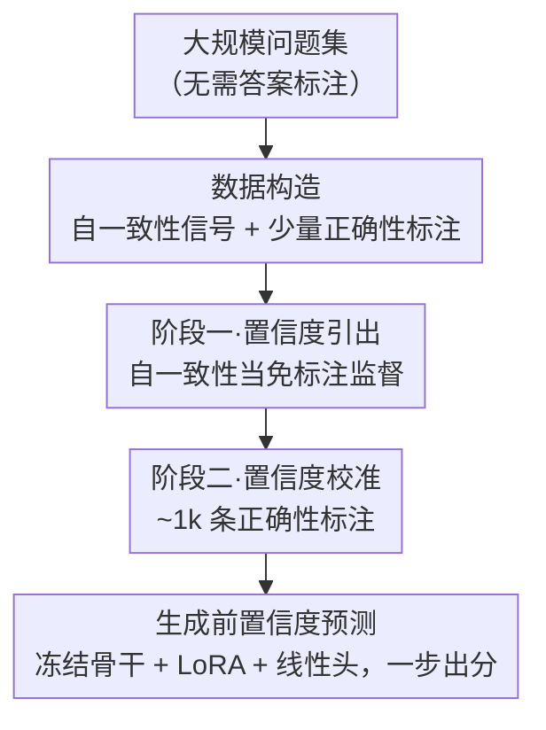

# Annotation-Efficient Honesty Alignment via Confidence Elicitation and Calibration

**会议**: ICLR2026  
**OpenReview**: [https://openreview.net/forum?id=cW6oDsPobl](https://openreview.net/forum?id=cW6oDsPobl)  
**代码**: 待确认  
**领域**: 对齐RLHF / LLM诚实性  
**关键词**: 诚实对齐, 置信度校准, 自一致性, 标注高效, AUROC

## 一句话总结
这篇论文把"诚实对齐"（让 LLM 在回答前就准确说出自己有多大把握）拆成"引出-再-校准"两阶段：先用免标注的自一致性信号教模型把内在置信"说出来"，再用极少量（~1k 条，约 0.18% 全量）正确性标注把这个置信校准到真实准确率上，配套发布了 56 万训练样本的 HonestyBench，使得只用 1k 标注就能达到全量监督 98% 的对齐效果。

## 研究背景与动机
**领域现状**：诚实对齐（honesty alignment）是 HHH（helpful / harmless / honest）三准则之一，目标是让模型"知道自己知道什么、不知道什么"——理想情况下，模型在生成答案*之前*就能给出一个校准好的置信度：高置信就直接答，低置信就拒答或触发检索增强。现有做法分两类：**训练无关**方法（token 概率、口头表达置信、自一致性）和**训练相关**方法（用正确性标注去校准置信）。在训练无关里，自一致性（采样多条回答、看语义一致比例）与真实正确率的相关性最强。

**现有痛点**：训练相关方法虽然普遍更准，但要做出一个跨任务都可靠的*通用*诚实模型，需要海量带正确性标注（即每道题的标准答案）的数据，标注成本极高；而自一致性虽然免标注，却要在推理时反复采样 k 条回答再做一致性检查，开销大、无法一次出结果。

**核心矛盾**：作者把"正确性标注"的作用拆成两件事——**第一，教模型把置信表达出来；第二，把表达出的置信校准到真实正确率上**。如果第一件事能用便宜的信号（自一致性）替代，那昂贵的正确性标注就只需要留给第二件事，需求量会大幅下降。现有方法把这两件事混在一起、都靠正确性标注从零学，才导致标注需求居高不下。

**本文目标**：(1) 设计一个标注高效的训练框架，用极少正确性标注达到接近全量监督的诚实对齐；(2) 提供一个足够大、跨任务的基准来探索诚实对齐性能的上界。

**切入角度**：作者观察到（图 2）模型虽然普遍**过度自信**，但其自一致性置信与真实准确率在题目间高度相关（Spearman $\rho=0.789$）。这说明"内在置信"本身是可学习的信号——只要把它从模型内部状态里引出来，剩下的就只是一个轻量的标定问题。

**核心 idea**：用"自一致性引出 + 少量标注校准"的两阶段范式（类比预训练-微调）替代"全靠正确性标注从零校准"，把诚实对齐变成标注高效问题。

## 方法详解

### 整体框架
EliCal（Elicitation-Then-Calibration）把诚实对齐重构成一个两阶段学习问题。输入是一大批问题（无需标注答案），输出是一个能在**生成回答之前**就给出 0~1 置信分的模型。整条管线是：先从大规模问题集构造自一致性数据（每题采样 k 条回答，算与贪心答案语义一致的比例当作目标置信）；**阶段一·置信度引出**用这些免标注信号训练模型，让它学会"一次性"说出内在置信，不必再反复采样；**阶段二·置信度校准**再拿一小批带正确性标注的 QA 对，把引出的置信微调对齐到真实准确率。两阶段共享同一套"冻结骨干 + LoRA + 线性头"的架构，最终模型在推理时一步就能预测置信度。

### 关键设计

**1. 把诚实对齐拆成"先引出、再校准"两阶段：核心重构**

痛点在于：以往训练相关方法用正确性标注"从零"学置信，等于让一个昂贵信号同时承担"教模型表达置信"和"标定到正确率"两份活，所以标注需求大、还容易过拟合到训练任务上。EliCal 的洞察是这两份活可以解耦——表达置信靠便宜的自一致性就够，正确性标注只留给最后的标定。形式化地，诚实对齐的目标是学一个目标置信 $\text{Confidence}^*_\theta(q)$ 使其等于模型在该题上的期望准确率 $\text{Accuracy}_\theta(q)=\mathbb{E}_{r\sim p^\pi_\theta(\cdot\mid q)}[\,\mathbb{I}[r\in G(q)]\,]$（$G(q)$ 是 $q$ 的正确答案集合）。EliCal 把它分成：阶段一先逼近自一致性置信 $\text{Confidence}_\theta(q)$，阶段二再从这个起点微调到 $\text{Accuracy}_\theta(q)$。这一拆解之所以有效，是因为它和"预训练-微调"同构——阶段一用海量免标注数据打好"会表达置信"的基础，阶段二只需少量标注做领域标定；正因为基础牢，校准既更精确、又对未见任务泛化更好。

**2. 阶段一·置信度引出：用免费的自一致性信号教模型把内在置信"说出来"**

针对"推理时反复采样开销大、且置信需要昂贵标注"这个痛点，阶段一不要任何人工标注。对每道题 $q$，先采 $k$ 条回答（论文取 $k=20$，温度 1）和一条贪心回答，把"与贪心答案语义一致的回答占比"当作目标置信：$p^\pi_\theta(\tilde r\mid q)\approx\frac1k\sum_{r\in\hat R}s(r,\tilde r)$，其中 $s(r,\tilde r)=\mathbb{I}[\text{两条回答语义一致}]$。然后用 MSE 训练模型直接预测这个值：$\mathcal{L}=\frac1{|Q|}\sum_q(\hat c(q)-\text{Confidence}_\theta(q))^2$。这一步之所以成立，是因为自一致性置信本质上只依赖模型内部表示、因而"天生可学"；训完之后模型把"采 20 条再数一致比例"这个过程内化成了一步前向预测——既省掉推理时的多次采样，又因为只在大规模问题上拟合内部信号（而非领域专属标签）而具备较强泛化。消融（图 7）显示引出性能随训练数据增大而提升、最终逼近多采样的 Consis-Sem 上限；对采样数 $k$ 也很鲁棒，$k=2$ 时虽噪声大但信号仍够用。

**3. 阶段二·置信度校准：1k 条正确性标注就够**

阶段一引出的置信和真实正确率之间还有系统性偏差（模型整体过度自信），需要校准。这一步从阶段一得到的参数 $(\phi^1,\theta^1_{\text{LoRA}})$ 出发，拿一小批带正确性标注的 QA 对 $Q_{\text{small}}$ 继续用 MSE 微调，让预测分逼近真实准确率：$\mathcal{L}=\frac1{|Q_{\text{small}}|}\sum_{q\in Q_{\text{small}}}(\hat c(q)-\text{Accuracy}_\theta(q))^2$。关键在于"小"——因为阶段一已经把"会表达置信"这件难事解决了，这里只剩一个轻量的标定，所以仅 ~1k 条标注（约全量 0.18%）就能把对齐推到接近全量监督的水平。这与纯校准基线（Cal-Only，从零用正确性标注学）形成鲜明对比：后者在 1k 标注下很多数据集上甚至打不过最好的训练无关方法，因为它要同时承担"教表达"和"标定"两件事却没有引出阶段打底。

**4. 冻结骨干 + LoRA + 线性头：在生成前一步直接预测置信度**

为了不破坏模型原有的问答能力，EliCal 冻结骨干参数 $\theta$，在所有线性层插入 LoRA 模块 $\theta_{\text{LoRA}}$ 与内部状态充分交互，并在最后一层接一个线性头 $f_\phi$ 把最后一个问题 token 的隐状态映射成置信分：$\hat c=f_\phi(h^{(L)}_T(\theta,\theta_{\text{LoRA}}))=w^\top h^{(L)}_T+b$。训练时只更新 $\theta_{\text{LoRA}}$ 和 $\phi=\{w,b\}$，骨干不动。这一设计有两个好处：其一，置信预测发生在最后一个问题 token 处、即**生成答案之前**，天然支持"先评估再决定答不答/要不要检索"的部署场景；其二，冻结骨干保证训练诚实性不会损害原始 QA 性能。消融里还试了"只训一个线性头"的极轻量版本（不加 LoRA），结论是性能随标注增多而升、且 EliCal 仍稳压 Cal-Only，但因交互/表达能力受限整体低于加 LoRA 的版本。

### 损失函数 / 训练策略
两阶段都用 MSE 回归：阶段一回归自一致性置信 $\text{Confidence}_\theta(q)$（公式 10），阶段二回归正确性 $\text{Accuracy}_\theta(q)$（公式 11），监督信号都是 0~1 标量。阶段一在 HonestyBench-Train 全部 56 万题上做引出，阶段二从 1k 到 56 万不等地采样正确性标注做校准，用以考察性能随标注量的扩展曲线。

## 实验关键数据

构建 **HonestyBench**：整合 10 个自由形式事实型 QA 数据集，含 56.7 万训练样本、约 3.8 万域内评测、约 3.3 万域外（OOD）评测；覆盖单跳/多跳/模板生成三类问题，并为三个代表性 LLM（Qwen2.5-7B/14B-Instruct、Llama3-8B-Instruct）每题提供 20 条采样回答 + 1 条贪心回答，标注语义一致性与正确性。评测指标主用 **AUROC**（区分对/错回答的能力，1 为完美、0.5 为随机），另用 alignment（二值化置信与正确性的匹配比例）。

### 主实验
Qwen2.5-7B-Instruct 上的 AUROC（域内 5 数据集 + OOD 5 数据集均值）：

| 方法 | 标注量 | 域内 Avg. | OOD Avg. |
|------|--------|-----------|----------|
| Consis-Sem（最强训练无关） | 0 | 73.62 | 70.20 |
| Eli-Only（仅引出） | 0 | 71.19 | 69.66 |
| Cal-Only（仅校准） | 1k | 73.41 | 77.32 |
| **EliCal** | **1k** | **84.36** | **84.47** |
| Cal-Only（上界） | 560k | 86.20 | 85.75 |
| EliCal（上界） | 560k | 86.49 | 85.83 |

要点：(1) 全量监督下 EliCal/Cal-Only 都把训练无关最优甩开 17%+，首次在如此大规模上探到诚实对齐的上界；(2) **EliCal 仅 1k 标注（~0.18%）就达到全量上界约 98%**，域内 84.36 对全量 86.49；同样 1k 下 Cal-Only 仅 73.41，很多数据集（如 NQ、HQ）甚至打不过最好的训练无关方法。

### 消融实验

| 配置 | 关键发现 | 说明 |
|------|---------|------|
| 引出训练量 ↑ | AUROC 升、增速放缓，逼近 Consis-Sem(73.62) | 引出阶段数据越多基础越牢（图 7） |
| 采样数 $k\in\{2,5,10,20\}$ | Consis-Sem 随 $k$ 单调升；EliCal 几乎不变 | $k=2$ 时 EliCal(1k) 域内仍 84.41，对 $k$ 极鲁棒（表 3） |
| 只训线性头（不加 LoRA） | EliCal 仍稳压 Cal-Only，但整体低于加 LoRA | 轻量头交互/表达能力受限 |
| MMLU（多选、与训练分布差异大） | 即便 560k 标注，Cal-Only 仍落后 EliCal | 引出内部信号比只拟合任务标签更能泛化 |

### 关键发现
- **引出阶段是泛化的来源**：在与训练分布差异最大的 MMLU 上，纯校准即便用满 560k 标注都追不上 EliCal——说明大规模引出"内部信号"比只拟合任务专属标签更能跨任务迁移。
- **置信可二值化用于决策**：用 alignment 指标看，EliCal 显著优于 Cal-Only；它给出的置信能可靠地二值化成"答/不答"判断，直接服务于"要不要触发检索增强"这类现实场景。
- **LLM 确实能被教会表达内在置信**：Eli-Only（零标注）与多采样的 Consis-Sem 持平，却不需要推理时反复采样，省掉了置信估计的采样开销。

## 亮点与洞察
- **"标注的两个作用"这一拆解是全文最妙处**：把正确性标注承担的"教表达"和"做标定"显式分开，再分别匹配便宜信号与昂贵信号，直接把标注需求从 560k 压到 1k，思路干净且可迁移到其它"标注昂贵但有免费弱信号"的对齐任务（如安全、拒答）。
- **自一致性"内化为一步前向"**：把原本推理时要采 20 条的过程蒸馏进模型内部状态，既省推理开销又保留判别力，是个可复用的 trick——任何依赖多采样的不确定性估计都可以照此"引出"成一次预测。
- **生成前预测置信**的设计天然契合检索增强/拒答的部署逻辑：先看把握、再决定要不要答或求助，而非生成后再补救。
- 配套的 **HonestyBench**（56 万训练 + 双重 OOD 评测、三模型全标注）本身是一项基础设施贡献，把诚实对齐从"小规模域内评测"推到"大规模通用模型上界探索"。

## 局限与展望
- 评测全部集中在**自由形式事实型 QA**，且多数题目源自 Wikipedia——域内与 OOD 现象高度相似，正是因为问题格式和知识来源同质；真正异质的只有 MMLU 一个多选基准，对推理密集、长文、代码等任务的诚实对齐尚未验证。
- 置信用单一标量回归（MSE），假设"模型对一题有一个确定的期望准确率"，对**多答案合理/答案随上下文变化**的开放问题可能不适用。
- 自一致性置信本身会被模型的系统性过度自信污染，阶段一拟合的是这个有偏信号，最终上界仍受其质量限制（消融里引出性能逼近但不超过 Consis-Sem）。
- 改进方向：把引出信号从自一致性扩展到更丰富的内部信号（如多层隐状态、注意力），或把两阶段拓展到生成式置信表达（口头说出而非线性头打分），以服务对话式拒答。

## 相关工作与启发
- **vs 训练无关方法（Consis-Sem 等）**：它们靠推理时多次采样估计置信、不需训练但开销大且无法校准系统性过度自信；EliCal 把自一致性引出为一步预测、再用少量标注校准，既省采样又更准。
- **vs 纯校准方法（Cal-Only / Yang et al. 2023）**：它们从零用正确性标注同时学"表达 + 标定"，标注需求大、跨任务泛化弱；EliCal 用引出阶段打底，1k 标注即接近其 560k 上界，且在 OOD/MMLU 上更强。
- **vs 温度缩放类（Thermometer、DACA）**：这些方法在 logit 上做后处理标定，受限于原始 logit 质量；EliCal 直接从内部状态学置信头，表达力更强（表 2 中均明显领先）。
- **vs 利用内部不确定性的工作（Zhang et al. 2024、Tjandra et al. 2024）**：它们把内部不确定性只用于"是否拒答"，而 EliCal 把它当作可学习的监督信号去**教模型表达自己的置信**，用途更进一步。

## 评分
- 新颖性: ⭐⭐⭐⭐⭐ "标注两作用解耦 + 引出-校准两阶段"重构干净有力，视角新
- 实验充分度: ⭐⭐⭐⭐⭐ 三模型、域内+双 OOD、标注量扫描、$k$/线性头/训练量多重消融，配套大规模基准
- 写作质量: ⭐⭐⭐⭐ 形式化清晰、图表完整；部分公式排版稍密
- 价值: ⭐⭐⭐⭐⭐ 把诚实对齐成本压两个数量级，且贡献了可复用的 HonestyBench

<!-- RELATED:START -->

## 相关论文

- [\[ICML 2026\] Decoupling Reasoning and Confidence: Resurrecting Calibration in Reinforcement Learning from Verifiable Rewards](../../ICML2026/llm_alignment/decoupling_reasoning_and_confidence_resurrecting_calibration_in_reinforcement_le.md)
- [\[ICLR 2026\] PALC: Preference Alignment via Logit Calibration](palc_preference_alignment_via_logit_calibration.md)
- [\[ICLR 2026\] When Weak LLMs Speak with Confidence, Preference Alignment Gets Stronger](when_weak_llms_speak_with_confidence_preference_alignment_gets_stronger.md)
- [\[ICLR 2026\] ActiveDPO: Active Direct Preference Optimization for Sample-Efficient Alignment](activedpo_active_direct_preference_optimization_for_sample-efficient_alignment.md)
- [\[CVPR 2026\] EcoAlign: An Economically Rational Framework for Efficient LVLM Alignment](../../CVPR2026/llm_alignment/ecoalign_an_economically_rational_framework_for_efficient_lvlm_alignment.md)

<!-- RELATED:END -->
