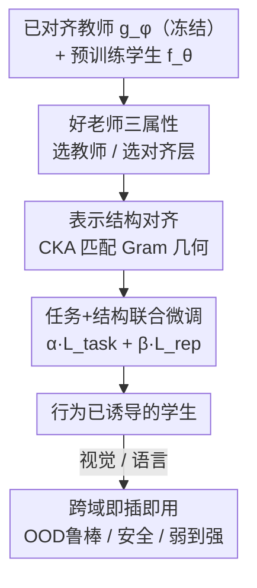

# BIRD: Behavior Induction via Representation-structure Distillation

**会议**: ICLR2026  
**OpenReview**: [https://openreview.net/forum?id=jbJGhHpwmJ](https://openreview.net/forum?id=jbJGhHpwmJ)  
**代码**: https://github.com/gpogoncheff/bird  
**领域**: 对齐 / 行为迁移 / 弱到强泛化  
**关键词**: 表示结构蒸馏, CKA, 弱到强泛化, 安全对齐, 行为迁移

## 一句话总结
BIRD 通过让学生模型的内部表示**结构**（batch 内成对相似度的几何，用 CKA 度量）去匹配一个已对齐教师的表示结构，把鲁棒性 / 安全性这类"对齐行为"从一个异构教师迁移到学生——教师和学生可以任务、数据、架构、输出空间全都不同；在图像 OOD 鲁棒迁移上比微调 / 迁移学习 / 持续学习最多高 18% 鲁棒精度，并能从一个比学生小 25× 的教师做弱到强迁移。

## 研究背景与动机

**领域现状**：让模型具备"与人类价值对齐"的行为（鲁棒、安全、公平）通常代价高昂——对抗训练、人类反馈、专门数据集。一个自然的省力方向是把已经对齐的模型当老师，把它的对齐行为"迁移"给做别的任务的学生，最近热门的**弱到强泛化（weak-to-strong generalization）**就是用一个小而对齐的弱模型去监督一个更大更通用的强模型。

**现有痛点**：对齐行为在微调时极易被遗忘（catastrophic forgetting）；而现有迁移 / 蒸馏方法几乎都假设师生**共享训练数据、共享输出空间或共享任务**。更糟的是，训练对齐模型用的数据往往是私有的、拿不到。

**核心矛盾**：现有方法迁移的是"实例级"信息——要么对齐输出 logits（soft-label 蒸馏），要么对齐隐层**激活值**（hint-based 蒸馏），这些都和教师的具体输出 / 具体样本强绑定，所以才必须共享任务和数据；一旦师生异构，这些信号就失效或不可得。

**本文目标**：能不能在师生**架构、任务、训练数据全都不同**的情况下，仍把对齐行为迁过去？且不需要访问教师的训练数据。

**切入角度**：来自 NeuroAI 与表示工程的一个核心假设——**任务无关的行为属性（鲁棒、不变性、安全）编码在模型潜在表示空间的"几何结构"里**，而不在某个具体激活值上。既然如此，迁移就不该去对齐激活值，而应去对齐表示空间的**结构**（成对相似度的组织方式）。

**核心 idea**：用 CKA（Centered Kernel Alignment）度量师生表示的**成对相似度结构**，把"1 − CKA"作为表示损失，和原任务损失一起微调学生——只对齐几何、不对齐激活值，从而摆脱共享数据 / 共享输出空间的束缚。

## 方法详解

### 整体框架

BIRD（Behavior Induction via Representation-structure Distillation）是一个即插即用框架：给定一个已经具备某种对齐行为的**教师** $g_\phi:\mathcal{D}_{teacher}\to\mathcal{Y}_{teacher}$ 和一个已在自己任务上预训练好的**学生** $f_\theta:\mathcal{D}_{student}\to\mathcal{Y}_{student}$，目标是把教师的行为属性诱导进学生，同时不破坏学生原任务性能。整条流程分三步：(1) 假定教师已训练好并冻结；(2) 在教师里选一个"引导层（guiding layer）"、在学生里选一个"被引导层（guided layer）"作为蒸馏对接点；(3) 用学生**自己**的训练数据微调学生，让被引导层的表示结构去逼近教师引导层的表示结构。

关键在于：监督信号**只来自把学生的输入投影进教师表示空间后得到的结构**，既不需要教师的训练数据、也不需要成对样本、更不要求师生共享输出空间。

### 关键设计

**1. 表示结构对齐：用 CKA 蒸馏几何而非激活值**

这是 BIRD 的命门，直接针对"实例级信号不可跨域"的痛点。BIRD 不去匹配教师的输出或激活值，而是匹配一个 batch 内输入两两之间的**相似度结构**（可理解为对表示做 Gram 矩阵后的几何）。表示损失定义为

$$L_{rep}\big(u(B),v(B)\big)=1-\mathrm{CKA}_{linear}\big(u(B),v(B)\big),$$

其中 $u,v$ 分别把一个 batch $B$ 映到教师引导层、学生被引导层的中间表示。线性 CKA 写作

$$\mathrm{CKA}_{linear}(u,v)=\frac{\lVert v(B)^{\top}u(B)\rVert_F^2}{\lVert u(B)^{\top}u(B)\rVert_F^2\cdot\lVert v(B)^{\top}v(B)\rVert_F^2}.$$

之所以选 CKA：它在比较深网络表示上被反复验证有效、对高维表示空间鲁棒、且可解释。和 KD 常用的 L2 / KL 散度相比，后两者强制**逐样本**对齐——逐样本相似度和教师的具体输出紧绑定，所以才迁不动；而 CKA 评估的是 batch 内**成对**相似度，捕捉的是更高阶的、行为相关的几何关系，于是能在师生异构时仍然成立。论文用 Hints（同样的对接层、但改用线性映射 + L2）做对照，发现 BIRD 在每个设置、每类损坏上都更鲁棒——说明 BIRD 的成功"不只来自在哪监督，更来自怎么监督"。

**2. 任务+结构联合微调：三步走流程**

针对"对齐行为在微调时被遗忘"的痛点，BIRD 不让学生只追结构而丢掉本职任务，而是把两个目标加权联合优化：

$$\mathbb{E}_{B\sim\mathcal{D}_{student}}\Big[\alpha\,L_{task}\big(f_\theta(B),\cdot\big)+\beta\,L_{rep}\big(u(B),v(B)\big)\Big],$$

其中 $L_{task}$ 就是学生原本的训练损失（如交叉熵），$\alpha,\beta$ 权衡任务性能与结构对齐。注意整个过程用的是**学生自己**的训练分布 $\mathcal{D}_{student}$，把这些输入分别过教师和学生取中间层表示来算 $L_{rep}$，因此完全不碰教师的训练数据。教师全程冻结，只有学生被更新——这让 BIRD 成为一个"drop-in"的微调附加项，可以叠加在已有训练流程上。

**3. 好老师的三个可计算属性：任务相关性 + 行为相关性**

迁移效果到底取决于什么？BIRD 把它归结为教师表示空间的两类、共三个**可计算且可解释**的属性，用来指导选教师 / 选对接层：

- **任务相关性（task relevance）**：教师表示对学生下游任务有多少用。用两个指标——(i) **探针精度**：在教师表示上用学生干净数据训线性探针，测其在留出集上的分类精度；(ii) **互补知识（complementary knowledge）**：教师探针答对、但学生自身表示训的探针答错的那部分样本占比。
- **行为相关性（behavioral relevance）**：教师表示在多大程度上支撑目标对齐行为。用聚合的 **$\gamma$-鲁棒有用性（$\gamma$-robust usefulness）**度量特征在损坏下是否仍保有预测力。

论文在 **432 个师生对**上拟合一个线性模型，用这三个属性预测迁移后的鲁棒精度，$R^2$ 高达 73.6%–85.5%（不同学生数据集），其中**行为相关性单独就能解释超 50% 的方差**。结论很可操作：选老师时优先挑行为相关性高的，哪怕它和学生任务重叠很少、数据集完全不同。

**4. 跨域即插即用：从视觉鲁棒到语言安全**

因为 BIRD 只依赖表示结构、不依赖输出空间，它能当一个通用附加项叠到别的对齐方法上，论文给了两个语言侧验证：(i) **DPO+BIRD**——在 DPO 安全对齐里，额外让生成式学生的表示结构去逼近一个"判别回答是否安全"的小分类器教师的结构；(ii) **soft-label+BIRD**——在弱到强泛化里，把 BIRD 的结构损失加在 soft-label 蒸馏之上（对接到师生最后一个 token 嵌入层）。这一设计把 BIRD 从"视觉鲁棒迁移"推广成"可与现有对齐方法互补的通用机制"，也是论文标题里"behavior induction"的落点——小而对齐的模型可以当大模型的"对齐种子（alignment seed）"。

### 损失函数 / 训练策略

总损失即式 (1)：$\alpha L_{task}+\beta L_{rep}$，$L_{rep}=1-\mathrm{CKA}_{linear}$。CKA 在 batch 上估计，batch size 越大结构估计越准——消融显示 32/64 也有提升但远不如 128，且更大 batch 可能带来更强迁移。CKA 核默认用线性核，换 RBF 核效果相当。鲁棒迁移实验里教师对 15 种 ImageNet-C 损坏鲁棒、学生只见干净图，全部 resize 到 $32\times32$。对齐只在**单层**进行（启发式选层），论文指出层选择对结果不太敏感，多层扩展留作未来工作。

## 实验关键数据

### 主实验

图像 OOD 鲁棒迁移，跨 4 种架构（MobileNetV2 / ResNet18 / DenseNet169 / ViT）、5 个数据集对，指标为干净+损坏测试集精度（%），3 seed 平均。下表节选 DenseNet169 结果：

| 师→生数据 | None | LP | FT | LP-FT | Hints | LwF | **BIRD** |
|-----------|------|------|------|-------|-------|------|----------|
| C10→C100 | 54.51 | 23.92 | 55.84 | 53.39 | 54.92 | 56.92 | **59.04** |
| C100→TIN | 22.59 | 23.55 | 23.19 | 24.86 | 22.75 | 26.14 | **27.46** |
| C10→TIN | 22.59 | 10.66 | 23.39 | 21.20 | 22.68 | 24.14 | **25.25** |

用 PGR（Performance Gap Recovered，恢复了多少到"直接用损坏数据训练"上限的差距）看，C10→C100 时 BIRD 恢复 **31.8%**，次优 LwF 仅 13.5%；C10→TIN 为 **22.4% vs 4.9%**。整体几乎在所有架构 × 数据集对上 BIRD 都拿最高鲁棒精度与 PGR。

弱到强 / 极端容量错配：固定一个 MobileNetV2 教师，对 ResNet152 学生（参数量是教师 **25×**）仍取得 22.4% PGR，证明小教师能当大学生的对齐脚手架。

### 语言模型迁移

| 任务 | 学生 | None | DPO | DPO+BIRD |
|------|------|------|------|----------|
| 安全对齐 %Safe↑ | SmolLM2-135M | 43.88 | 65.48 | **71.28** |
| 安全对齐 %Safe↑ | SmolLM2-360M | 47.63 | 86.57 | **88.37** |

弱到强（GPT2-Small 教师 → GPT2-Medium/Large）PGR：

| 任务 | 学生 | Soft-Label | +BIRD |
|------|------|-----------|-------|
| SciQ | GPT2-Medium | 7.79 | **16.14** |
| SciQ | GPT2-Large | 17.70 | **24.19** |
| Cosmos QA | GPT2-Large | 65.51 | **68.02** |

### 关键发现
- **怎么监督 > 在哪监督**：同样的对接层，CKA 结构对齐（BIRD）在每个设置都胜过激活值对齐（Hints），证明几何比激活值携带更可泛化的行为信息。
- **行为相关性是头号预测因子**：三属性线性模型 $R^2$ 达 85.5%，行为相关性单独解释 >50% 方差，给选教师提供了可执行准则。
- **失败场景**：BoolQ 上 soft-label 与 +BIRD 都没超过弱教师（0% PGR），提示单层、末层结构对齐对复杂推理任务可能不够，需多层监督。
- **batch size 敏感**：CKA 需足够大 batch 才能刻画结构，太小（32/64）增益骤减。

## 亮点与洞察
- **把"对齐"重新定义成几何匹配问题**：不迁 logits、不迁激活，而迁表示空间的成对相似度结构，从根上解开了"必须共享数据 / 任务 / 输出空间"的死结——这是最"啊哈"的一步。
- **可计算的"选师指南"**：三个能直接算出来的属性把"什么样的老师好"从玄学变成可预测（$R^2$ 0.74–0.86），并发现"行为相关性 > 任务相关性"，实践价值很高。
- **小模型当对齐种子**：25× 容量错配仍能弱到强迁移，意味着可以低成本造一个小而对齐的模型，去给一堆大模型做对齐脚手架。
- **可迁移 trick**：1−CKA 作为即插即用正则项，能叠加到 DPO、soft-label 蒸馏等任意已有对齐流程上，几乎零侵入。

## 局限与展望
- **行为相关性度量绑定鲁棒分类**：$\gamma$-鲁棒有用性是为鲁棒分类设计的，迁到诚实性等其他行为时需换工具（如线性层析、因果中介分析）。
- **单层 + 启发式选层**：目前只在一层做对齐，复杂推理任务（如 BoolQ）失效暗示需要多层监督，但多层会带来"选层对 + 配权重"的新难题。
- **受学生容量与任务复杂度上界约束**：迁移成功存在饱和效应，论文只给了初步证据，未精确刻画。
- **教师即风险源**（伦理）：若教师本身编码了偏见 / 有害行为，BIRD 会一并迁给学生——部署前必须保证教师的"品行"。
- 跨模态师生对、超出鲁棒 / 安全的更多行为，均留作未来工作。

## 相关工作与启发
- **vs 弱到强泛化（Burns et al. 2023）**：他们靠 soft-label 监督，仍要求师生共享输出空间、能访问教师（哪怕无标签）数据；BIRD 用表示结构当监督信号，允许师生任务 / 数据 / 架构全异构，并能与 soft-label 互补叠加。
- **vs 知识蒸馏（Hints / FitNets, Romero 2014）**：Hints 用线性映射 + L2 对齐**激活值**，是实例级、需共享任务；BIRD 对齐 batch 级**结构几何**，在相同对接层上每个设置都更鲁棒。
- **vs LwF / 鲁棒迁移学习（Shafahi 2019）**：靠约束末层特征漂移来抗遗忘，假设鲁棒特征能跨域泛化（只在大规模多样预训练下成立）；BIRD 能从小、简单、低资源域的教师迁出行为，不要求共享输入或标签。
- **vs NeuroAI 表示对齐（Dapello 2023 等）**：那类方法把网络表示往脑记录上拉（CKA/RSA 目标），但需神经数据、假设共享刺激域、泛化有限；BIRD 去掉了脑记录与刺激重叠的要求，把"结构化表示支撑通用行为"这一假设算子化成通用对齐框架。

## 评分
- 新颖性: ⭐⭐⭐⭐⭐ 把对齐行为迁移重构为表示结构（CKA 几何）匹配，彻底松绑共享数据 / 任务 / 输出空间的假设。
- 实验充分度: ⭐⭐⭐⭐⭐ 432 师生对的大规模分析 + 三属性可解释建模 + 跨视觉/语言双域验证，含失败案例。
- 写作质量: ⭐⭐⭐⭐ 动机链清晰、消融到位；个别细节（γ-鲁棒有用性、选层启发式）压在附录。
- 价值: ⭐⭐⭐⭐⭐ "小模型当对齐种子 + 可计算选师准则"对可扩展安全对齐有直接落地意义。

<!-- RELATED:START -->

## 相关论文

- [\[ACL 2026\] How Value Induction Reshapes LLM Behaviour](../../ACL2026/llm_alignment/how_value_induction_reshapes_llm_behaviour.md)
- [\[AAAI 2026\] Align to Structure: Aligning Large Language Models with Structural Information](../../AAAI2026/llm_alignment/align_to_structure_aligning_large_language_models_with_struc.md)
- [\[ACL 2026\] Pref-CTRL: Preference Driven LLM Alignment using Representation Editing](../../ACL2026/llm_alignment/pref-ctrl_preference_driven_llm_alignment_using_representation_editing.md)
- [\[ICML 2026\] When Distance Distracts: Representation Distance Bias in BT-Loss for Reward Models](../../ICML2026/llm_alignment/when_distance_distracts_representation_distance_bias_in_bt-loss_for_reward_model.md)
- [\[CVPR 2026\] MorphSeek: Fine-grained Latent Representation-Level Policy Optimization for Deformable Image Registration](../../CVPR2026/llm_alignment/morphseek_fine-grained_latent_representation-level_policy_optimization_for_defor.md)

<!-- RELATED:END -->
