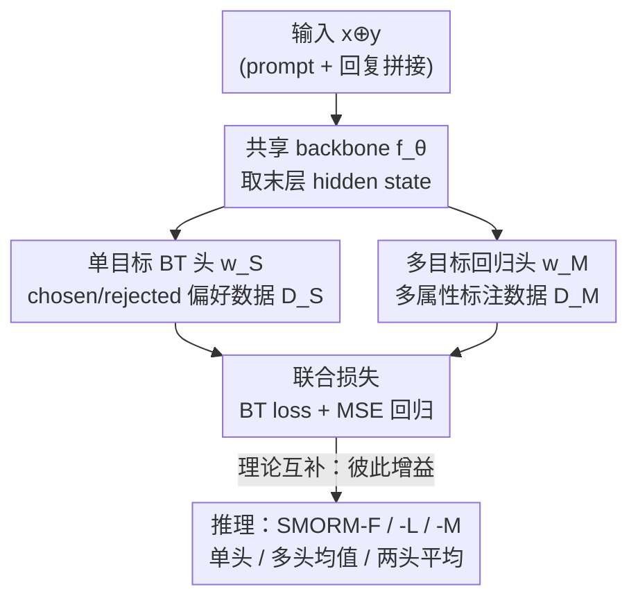

# Bradley–Terry and Multi-Objective Reward Modeling Are Complementary

**会议**: ICLR 2026  
**OpenReview**: [https://openreview.net/forum?id=3QHKJcwnpb](https://openreview.net/forum?id=3QHKJcwnpb)  
**领域**: 对齐RLHF / 奖励建模  
**关键词**: 奖励建模, Bradley-Terry, 多目标奖励, reward hacking, OOD 鲁棒性

## 一句话总结
本文提出 SMORM，在一个共享 embedding 上同时挂一个 Bradley–Terry 单目标奖励头和一个多目标回归头联合训练，理论上证明两者互补——回归头帮单目标头在 OOD 下抗 reward hacking，BT 头反过来把弱小的多目标头"托举"上去，最终一个 7B 模型超过 70B 基线。

## 研究背景与动机

**领域现状**：RLHF 把奖励学习和策略学习解耦，先用人类偏好数据训一个 proxy 奖励模型，再用 PPO / BoN 之类的算法去优化策略。当前主流奖励模型基本都建在 Bradley–Terry（BT）框架上：给定 prompt $x$、chosen 回复 $y_c$ 和 rejected 回复 $y_r$，最小化 $-\log \sigma(r_\theta(x,y_c) - r_\theta(x,y_r))$，让模型给被人偏好的回复打更高分。

**现有痛点**：RLHF 最大的隐患是 reward hacking——策略学会钻奖励函数的空子（比如生成重复、套路化内容）来刷高 proxy 分，却没真正变好。前人缓解 reward hacking 的路线（奖励集成、约束策略优化、ODIN 拆质量/长度、GRM 加文本生成正则）都有各自的代价：集成要训多个模型、约束优化对超参敏感、ODIN 只拿长度当偏置不够、GRM 的生成目标和奖励目标互相打架导致训练不稳。更关键的是，这些方法几乎都只在**同分布（ID）**下评测。

**核心矛盾**：本文实验发现，一旦 PPO/BoN 用的 prompt 和奖励模型训练数据来自**不同分布（OOD）**，这些 SOTA 方法纷纷失效。作者推断：只用 chosen/rejected 二元标签训出来的 BT 模型是有偏的，分不清细粒度的质量差异，所以在 OOD 下被钻空子。一个自然的解药是引入**多目标奖励模型（MORM）**——它对 helpfulness、correctness、verbosity 等多个属性分别打分，逼着策略在所有维度上同时变好，让"低质量却高分"的捷径更难走。但 MORM 有个致命短板：高质量多属性标注数据稀缺（人工标贵、LLM-as-Judge 标的质量差），导致 MORM 单独打分能力往往**还不如**只用海量 chosen/rejected 标签训的单目标模型（SORM）。

**本文目标**：在不引入额外昂贵多属性偏好数据的前提下，高效地用细粒度属性分来缓解 OOD 下的 reward hacking。把 SORM 和 MORM 简单拼成 ensemble 会撞上两个问题：(1) 要跑两次独立推理，开销大；(2) 弱小的 MORM 会拖累聚合结果，成为系统瓶颈。

**核心 idea**：与其把两个模型当独立 ensemble，不如让一个**共享 backbone** 上的两个头联合训练——单目标 BT 头和多目标回归头共用同一个 embedding 空间，一次前向就出两套分。作者进一步从理论上证明：这俩看似形式迥异的损失，在共享 embedding 下会**互相增益**，而不只是简单叠加。

## 方法详解

### 整体框架

SMORM（Single and Multi-Objective Reward Model）的核心是"一个躯干、两个头、联合训练"。拿一个去掉原始输出线性层的 decoder-only LLM 当特征抽取器 $f_\theta$，把 prompt 和回复拼接成 $x \oplus y$ 喂进去，取最后一层 decoder 的 hidden state 作为 $d$ 维特征。在这个特征之上挂两个线性头：单目标头权重 $w_S \in \mathbb{R}^{d\times 1}$ 输出一个标量评分；多目标头权重 $w_M \in \mathbb{R}^{d\times k}$ 输出 $k$ 维属性分向量。两个头共享 $f_\theta$，所以只需**一次前向**就能同时拿到单目标分和多属性分，从根上解决了 ensemble 要跑两遍的效率问题。

训练时给两类数据：单目标头吃 chosen/rejected 偏好数据 $D_S$（用 BT 损失），多目标头吃多属性标注数据 $D_M$（用 MSE 回归损失），两套损失加在一起对 $\theta, w_S, w_M$ 联合优化。妙处在于：BT 头沿 chosen/rejected 方向校正 embedding 里样本的相对位置，使得多目标头哪怕只有少量数据也能学好；反过来多目标头把 embedding 雕琢得能区分多个属性的质量差异，使单目标头泛化性更强、在 OOD 下更抗 hacking。推理时支持三种策略：SMORM-F 只用单目标头出分、SMORM-L 取多目标头各属性分的均值、SMORM-M 取两个头分数的平均。

### 关键设计

**1. 共享 embedding 上的双头联合损失：用一次前向同时训 BT 和回归**

这一设计直接针对"SORM+MORM 当 ensemble 要两次推理、且弱头拖后腿"的痛点。SMORM 不再训两个独立模型，而是在同一个 $f_\theta$ 上挂两个头，用如下联合损失训练：

$$\min_{\theta, w_S, w_M} -\mathbb{E}_{D_S}\big[\log\sigma\big(w_S^\top(f_\theta(x_s,y_c)-f_\theta(x_s,y_r))\big)\big] + \mathbb{E}_{D_M}\big\|w_M^\top f_\theta(x_m,y_m)-r\big\|_2^2$$

第一项是 BT 偏好损失，让单目标头在 chosen/rejected 方向上拉开分差；第二项是多属性回归的 MSE，让多目标头逼近真实属性分 $r \in \mathbb{R}^K$。表面上看这只是 BT 和回归损失的简单相加，但作者强调其联合训练**非平凡**：两个损失形式根本不同（一个是对差值的 sigmoid、一个是对绝对值的平方误差），它们如何通过共享 embedding 互相影响，是前人从未刻画过的。设计上还有个实用细节——两个头的训练数据**不必是同一批 prompt-response 对**，$D_S$ 和 $D_M$ 可以来自不同来源甚至不同领域，训练非常灵活。

**2. 隐式多属性效应：BT 头把弱小的多目标头"托举"起来**

MORM 单独训往往因数据稀缺而打分能力弱，这是它沦为瓶颈的根因。本文用 Theorem 1（Implicit Multi-Attribute Effect）证明：在共享 embedding 下联合训练后，多目标头输出的平均属性分 $r_m(x,y)=\frac{1}{K}\sum_i w_{M,i}^\top f_\theta(x,y)$ 会被单目标分 $r_s$ **下界控制住**：

$$r_m(x,y) \geq c \cdot r_s(x,y) - \varepsilon$$

其中常数 $c$ 和 $\varepsilon$ 只依赖特征上界 $B$ 和二阶矩，且依赖一个温和假设——多属性聚合分与单目标 reward 正相关（$1^\top\alpha \geq 0$）。这个不等式给出两个推论：(1) 只要单目标分高（$r_s \geq \tau$），多属性均分就至少有 $c\tau - \varepsilon$ 的保底质量——这解释了为什么**只用单头的 SMORM-F 能和用双头的 SMORM-M 打平**；(2) 单目标分的排序会被多属性分的下界继承，于是可以用海量易得的 chosen/rejected 数据训一个强 SORM，再去"指导"缺数据的 MORM，省掉昂贵的细粒度标注。

**3. BT–回归桥接定理：证明联合训练严格优于各自单训**

前面解决了"MORM 被托举"，但还有个顾虑：联合训练会不会反过来拖垮 SORM？本文用 Lemma 1 + Theorem 2 回答。Lemma 1 建立了 BT 偏好误差与 MSE 的桥梁：成对偏好预测误差被回归 MSE 的平方根上界控制，

$$\mathbb{E}_{D_S}\big|P(y_A\succ y_B)-P^\star(y_A\succ y_B)\big| \leq \tfrac{1}{4}\mathbb{E}_{D_S}\big[\sqrt{2\,\mathrm{MSE}(r_s)}\big]$$

也就是说降低 MSE 就直接收紧了偏好预测误差。在此基础上 Theorem 2 证明：SMORM 学到的特征抽取器让两个头的渐近 MSE 都比各自单训时更小——$\mathrm{MSE}^{\text{SMORM}}_S < \mathrm{MSE}^{\text{single}}_S$ 且 $\mathrm{MSE}^{\text{SMORM}}_M < \mathrm{MSE}^{\text{multi}}_M$。这是首个证明"共享 BT–回归架构严格优于两头独立训练"的理论保证，也解释了为什么 SMORM-F 在 RewardBench 上比单独训的 SORM 还高。

## 实验关键数据

### 主实验

奖励建模评测（RewardBench / RM-Bench），与单目标、多目标基线对比：

| 设置 | 指标 | 本文 SMORM | 对应基线 | 提升 |
|--------|------|------|----------|------|
| Gemma-2B, UF400k/UltraFeedback, RewardBench Avg | SMORM-F vs Baseline(Single) | 72.8 | 68.2 | +4.6 |
| Gemma-2B, UF40k/HelpSteer2, RewardBench Avg | SMORM-F vs Baseline(Single) | 71.0 | 64.2 | +6.8 |
| Mistral-7B, UF40k/HelpSteer2, RewardBench | SMORM-L vs Baseline(Multi) | 79.9 | 66.0 | +13.9 |
| Mistral-7B, UF40k/HelpSteer2, RM-Bench | SMORM-L vs Baseline(Multi) | 64.4 | 52.0 | +12.4 |

与大型先进多目标奖励模型对比（RewardBench Avg），SMORM 用远少的数据逼平/超越大模型：

| 奖励模型 | $D_M$ 规模 | 模型大小 | Avg |
|------|---------|---------|------|
| Nemotron-4-340B-RM | 20K | 340B | 93.7 |
| ArmoRM-Llama3-8B-v0.1 | 585.4K | 8B | 90.4 |
| Llama-3-70B-RM | 20K | 70B | 88.8 |
| SMORM-L 7B (Ours) | 20K | 7B | 89.0 |
| SMORM-L 8B (Ours) | 20K | 8B | 90.4 |

SMORM-L 7B 用 20K 多目标数据就超过 70B 基线；8B 版用 15.9× 更少的数据追平 ArmoRM-8B。

### 消融 / 分析实验

RLHF 下的 reward hacking 鲁棒性（PPO / BoN，看 gold score 是否随训练/KL 增大而崩）：

| 配置 | ID 设置表现 | OOD 设置表现 |
|------|---------|------|
| Baseline (Single) | gold 分先升后降，典型过优化 | OOD 下被钻空子失效 |
| GRM | 升得快但随后回落 | 与 SMORM 差距进一步拉大 |
| ODIN | 只用长度偏置，PPO 下 gold 反降 | 不足以缓解 hacking |
| Baseline SM (SORM+MORM ensemble) | 比 GRM/ODIN 好，但 BoN 下被弱 MORM 拖累 | 弱头成瓶颈 |
| SMORM-F / SMORM-M | gold 分全程稳定上升 | OOD 下显著领先，最稳 |

### 关键发现
- **弱多目标头是真瓶颈**：Baseline SM（朴素 ensemble）在 BoN 下甚至比单目标基线还差，印证了"直接拼 SORM+MORM"会被弱 MORM 拖垮——这正是 SMORM 用共享 embedding 联合训练要解决的核心问题。
- **SMORM-F ≈ SMORM-M**：只用单目标头推理就能逼近用双头的效果，实证了 Theorem 1 的隐式多属性下界——多属性质量已经被单目标分"保底"，推理时甚至不用真去算多目标头。
- **OOD 比 ID 更能拉开差距**：在 OOD 设置下，SMORM 与 GRM 的性能差距比 ID 下更明显，说明现有方法的鲁棒性是被 ID 评测掩盖了的。

## 亮点与洞察
- **把 ensemble 改成共享 embedding 联合训练**：同样是想"用多属性分救单目标头"，前人做成两个独立模型的 ensemble，本文做成一个躯干两个头，既省掉一次推理又让两头互相增益——这是"架构选择决定能不能互补"的典型案例。
- **首次给 BT 与多目标回归建理论桥梁**：Lemma 1 把 BT 偏好误差 bound 到 MSE，Theorem 1/2 证明双头联合严格优于单训。这套分析把"经验上有用"升级成"理论上必然"，也解释了 SMORM-F≈SMORM-M 这个反直觉现象。
- **可迁移的设计思路**：当你有一个数据多但信号粗的任务 A 和一个数据少但信号细的任务 B，共享表示 + 多头联合训练，可能让 A 的海量数据隐式托举 B 的小数据头——这个"强头托举弱头"的范式不限于奖励建模。

## 局限与展望
- 理论的关键假设是"多属性聚合分与单目标 reward 正相关（$1^\top\alpha\geq 0$）"，作者论证它通常成立，但在属性间冲突剧烈、或多属性标注本身有偏的场景下未必满足，此时下界可能失效。
- 实验 backbone 集中在 gemma-2B 和 Mistral-7B，最大到 8B；在更大规模策略模型、更复杂的真实 RLHF 流水线（如 GRPO、迭代式优化）上的表现还需验证。
- 多目标头的属性集（helpfulness/correctness/verbosity 等）依赖现有标注数据集定义，属性维度本身的选择和粒度对最终效果的影响没有深入消融。

## 相关工作与启发
- **vs GRM（生成正则）**: GRM 往奖励建模里加文本生成正则来抗 hacking，但奖励目标和生成目标互相冲突、对平衡权重敏感、训练不稳；SMORM 加的是多目标回归头，两者通过共享 embedding 协同而非对抗，且有理论保证联合优于单训。
- **vs ODIN（拆质量/长度）**: ODIN 用两个 BT 头分别学质量和长度，但只拿长度当偏置不足以缓解 hacking，且两头都是 BT 损失、共享 embedding 时的交互简单；SMORM 一头 BT 一头 MSE 回归，刻画两种异质损失的相互作用才是难点和贡献。
- **vs 朴素 SORM+MORM ensemble（Baseline SM）**: 同样想结合单/多目标，ensemble 要两次推理且被弱 MORM 拖累成瓶颈；SMORM 一次前向、且 BT 头反向托举 MORM，把"弱头"变成了"被增益的头"。

## 评分
- 新颖性: ⭐⭐⭐⭐⭐ 首个为 BT 偏好建模与多目标回归建立理论联系并证明互补的工作，视角新。
- 实验充分度: ⭐⭐⭐⭐ ID/OOD、PPO/BoN、两种 backbone、奖励建模+RLHF 都覆盖，但最大规模止于 8B。
- 写作质量: ⭐⭐⭐⭐ 动机层层递进、理论与实验呼应清晰。
- 价值: ⭐⭐⭐⭐⭐ 用更少数据让 7B 超 70B、且抗 OOD reward hacking，对实际 RLHF 流水线很有用。

<!-- RELATED:START -->

## 相关论文

- [\[ICLR 2026\] Multi-objective Large Language Model Alignment with Hierarchical Experts](multi-objective_large_language_model_alignment_with_hierarchical_experts.md)
- [\[ICLR 2026\] OrthAlign: Orthogonal Subspace Decomposition for Non-Interfering Multi-Objective Alignment](orthalign_orthogonal_subspace_decomposition_for_non-interfering_multi-objective_.md)
- [\[ICLR 2026\] Omni-Reward: Towards Generalist Omni-Modal Reward Modeling with Free-Form Preferences](omni-reward_towards_generalist_omni-modal_reward_modeling_with_free-form_prefere.md)
- [\[ICLR 2026\] Robust Reward Modeling via Causal Rubrics](robust_reward_modeling_via_causal_rubrics.md)
- [\[ACL 2026\] AdaJudge: Adaptive Multi-Perspective Judging for Reward Modeling](../../ACL2026/llm_alignment/adajudge_adaptive_multi-perspective_judging_for_reward_modeling.md)

<!-- RELATED:END -->
