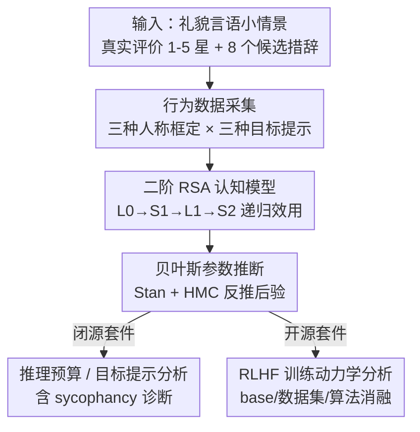

# Cognitive models can reveal interpretable value trade-offs in language models

**会议**: ICLR2026  
**OpenReview**: [https://openreview.net/forum?id=nM2QhvybwI](https://openreview.net/forum?id=nM2QhvybwI)  
**代码**: https://github.com/skmur/many-wolves  
**领域**: 对齐RLHF / 可解释性  
**关键词**: 认知模型, RSA, 价值权衡, RLHF, 可解释性, sycophancy

## 一句话总结
本文把认知科学里的「礼貌言语」理性言语行为（RSA）认知模型当作探针，给语言模型在一个真话-给面子两难任务上的回答拟合出三种效用（信息/社交/呈现）的权重，从而把模型的推理预算、系统提示、RLHF 训练动力学等"看不见的低层决策"翻译成一组可解释的价值权衡参数。

## 研究背景与动机
**领域现状**：当前的价值对齐范式大多把模型往"有用""真实"这类**单一属性**上推，并用 helpfulness/harmlessness 一类标量奖励来度量对齐程度。可解释性工具（探针、SAE、电路分析等）则主要看模型内部表示，很难直接回答"模型在多个相互冲突的价值之间是怎么权衡的"。

**现有痛点**：人类沟通的本质是**多目标权衡**——告诉朋友蛋糕难吃，要同时平衡"说真话"和"照顾对方感受"。现有对齐评测把价值压成单一维度，既看不出模型在信息效用和社交效用之间往哪边偏，也无法把这种偏好和训练里的具体决策（base model、反馈数据集、对齐算法、推理预算）对应起来。sycophancy（谄媚）就是这种权衡失衡的典型表现，但缺一个能形式化刻画它的工具。

**核心矛盾**：价值是**动态、多面、相互冲突**的，而主流评测是**静态、单维、标量**的。要诊断对齐到底改变了模型的哪种价值偏好，需要一个能把行为分解成多个可解释效用分量的"地面真值"模型。

**本文目标**：找一个理论扎实、参数可解释的框架，把 LLM 在价值冲突场景下的行为分解成若干效用权重，并用它去探测 (a) 闭源前沿模型的推理预算与提示操纵、(b) 开源模型 RLHF 后训练的动力学。

**切入角度**：认知科学早已用 RSA 这类递归概率生成模型形式化了人类的语用沟通——一个语用说话人会在"信息量""社交价值""自我呈现"等多个效用间做混合权衡。作者把 RLHF 看成一种逆强化学习（IRL）：从人类行为里反推隐含目标，因此可以用拟合人类礼貌言语的认知模型，反过来给 LLM 当"逆向工程"的标尺。

**核心 idea**：拿一个**为解释人类礼貌言语而设计**的 RSA 认知模型当探针，给 LLM 的回答分布拟合出 $\omega_{inf}, \omega_{soc}, \omega_{pre}$ 三种效用权重和投射混合参数 $\phi$，把低层训练决策映射成可解释的价值权衡。

## 方法详解

### 整体框架
方法把一个本属于认知科学的生成模型搬来当 LLM 的"行为解码器"。整条管线分三步：先让 LLM 在一批**社交敏感小情景**（如"朋友烤了蛋糕问你好不好吃"）里从 8 个候选措辞中选话，收集它的回答频次；再把 Yoon et al. (2020) 那套二阶语用说话人 RSA 模型拟合到这些频次上，用贝叶斯推断反推出模型背后的效用权重；最后在两套模型套件上读这些参数——闭源套件看推理预算和提示目标怎么挪动权重，开源套件沿 RLHF checkpoint 看价值随训练怎么漂移。整套流程的关键在于，**参数本身就是可解释的**：$\phi$ 接近 1 表示说话人想投射"我重信息"，接近 0 表示想投射"我重社交"；$\omega$ 三元组则是说话人实际在信息/社交/呈现三种效用上的混合配比。

### 关键设计

**1. 二阶语用说话人 RSA 模型：把"说什么"拆成三种相互竞争的效用**

要诊断价值权衡，先得有一个把"权衡"写成数学的模型。本文采用的核心是一个二阶语用说话人 $S_2$，它选措辞 $u$ 的概率正比于一个总效用的 softmax：$P_{S_2}(u|s,\omega)\propto\exp(\alpha U_{total})$，其中 $\alpha$ 是最优性温度，总效用按混合权重 $\omega$ 分成三块：$U_{total}=\omega_{inf}\cdot U_{inf}+\omega_{soc}\cdot U_{soc}+\omega_{pre}\cdot U_{pre}$。**信息效用** $U_{inf}=\log P_{L1}(s|u)$，衡量一个语用听者 $L_1$ 能多大程度从 $u$ 还原真实状态 $s$；**社交效用** $U_{soc}=\mathbb{E}_{P_{L1}(s|u)}[V(s)]$，衡量这句话期望给听者带来的社交价值（这里 $V$ 简化成"星数"的恒等映射）；**呈现效用** $U_{pre}=\log P_{L1}(\phi|u)$，衡量说话人想让听者推断出"我持有的信息-社交权衡 $\phi$"被传达得多准。这三层效用层层嵌套在 $L_0\to S_1\to L_1\to S_2$ 的递归里——一阶说话人 $S_1$ 只权衡信息和社交两项（$\propto\exp(\alpha(\phi\log P_{L0}(s|u)+(1-\phi)\mathbb{E}_{L0}[V(s)]))$），$S_2$ 再在它之上加一层"我想被怎么看"的呈现考量。正是这种分层让"谄媚"这类高层行为有了细粒度的参数刻画，而不是只能说"模型太顺着用户"。

**2. 礼貌言语任务与多视角框定：给 LLM 复刻人类的两难处境**

光有模型还不够，得让 LLM 落进一个真有价值冲突的场景。作者直接复用 Yoon et al. (2020) 给人类被试用的同一批小情景：说话人对听者的创作（蛋糕、诗、演讲等）有个真实评价 $s\in\{1,\dots,5\}$ 星，要从 4 个描述词及其否定共 8 个措辞里选一句回答，且每次查询都打乱选项顺序以消除位置偏置。**之所以选礼貌言语这个域**，是因为它天然把"传达真实有用信息"和"让对方好受"这对正是对齐核心的对立效用摆上台面，而且沟通性质比经典指代博弈更贴近真实 LLM 使用场景。在原本第三人称（LLM-as-judge）框定之外，作者还加了第一/第二人称框定来模拟 LLM-as-agent 和 LLM-as-assistant 三种视角；闭源套件再叠加三种**目标提示**——只求信息、只求让人开心（社交）、两者兼顾——来主动操纵说话人的"沟通目标"，看权重怎么响应。

**3. 字面语义子任务 + 贝叶斯参数推断：把回答频次反解成后验**

要从 LLM 的选话频次 $M$ 反推 $\Theta=\{\phi,\alpha,\omega_{inf},\omega_{soc},\omega_{pre}\}$，还缺一个量：每个措辞 $u$ 对状态 $s$ 为真的概率 $\theta$（即字面语义 $[[u]](s)$）。作者用一个**字面语义子任务**单独问模型"你觉得说话人认为蛋糕是 [措辞] 吗？只回 yes/no"来估出 $\theta$，再喂给 RSA 模型。整个推断是贝叶斯的：在均匀先验下求后验 $P(\Theta|M)\propto\prod_{i}\prod_{j}P_{S_2}(u_i|s_j;\Theta)^{M_{i,j}}$，用 Stan 概率编程语言加 HMC（No-U-Turn 采样器）做近似推断。这样每个模型、每种配置都得到一组带不确定性（95% 高密度区间）的效用权重，可以直接拿来横向对比。作者还用后验预测检验确认参数能泛化到留出测试集，推断参数的平均 MSE（0.03）显著低于从先验随机采样（0.06，$z=-12.49,p<0.001$）。

### 损失函数 / 训练策略
方法本身不训练新模型，而是拟合认知模型参数（HMC 采样），所以无对齐损失。被探测的开源套件训练流程是：从 instruct 模型出发，先在 chosen 回答上做 1 个 epoch SFT，再用 DPO 或 PPO（OpenRLHF 实现，PPO 用 ArmoRM 当奖励模型）做 1 个 epoch 偏好优化，沿均匀间隔的 checkpoint 拟合效用权重以追踪价值漂移。

## 实验关键数据

### 主实验
闭源套件覆盖 Anthropic / Google / OpenAI 三家、三档推理预算（none / low / medium）；开源套件用 2 个 7B base（Qwen2.5-Instruct、Llama-3.1-Instruct）× 2 个反馈数据集（UltraFeedback、HH-RLHF）× 2 个算法（DPO、PPO）共 8 种配置。

| 探测对象 | 操纵 | 主要发现 |
|----------|------|----------|
| 闭源·推理预算 | none → low/medium | 推理变体的投射混合 $\phi$ 显著升高（更偏信息效用），$\beta_{low}=0.228$、$\beta_{medium}=0.211$，均 $p<0.001$；low vs medium 无显著差异 |
| 闭源·目标提示 | informative / social / both | 三家模型一致地按提示挪动权重：informative 抬高 $\omega_{inf}$ 和 $\phi$，social 抬高 $\omega_{pre}$、压低 $\omega_{inf}$ 和 $\phi$；但模型受提示影响**比人类更剧烈** |
| 闭源·谄媚诊断 | social 目标条件 | 出现 sycophancy 签名：低 $\phi$ + 高 $\omega_{pre}$ + 低 $\omega_{inf}$/$\omega_{soc}$，且在 none→low 推理预算切换处变化最陡 |
| 开源·RLHF 动力学 | 沿 checkpoint | 最大价值漂移发生在训练**前 1/4**；base model 与预训练数据的影响盖过反馈数据集和对齐算法 |

### 消融实验

| 因素 | 关键现象 | 说明 |
|------|---------|------|
| base model | Qwen-instruct 比 Llama-instruct 持续更高 $\omega_{inf}$、更低 $\omega_{pre}$ | 与 Qwen 在数学/推理任务更强的先验一致 |
| 反馈数据集 | UltraFeedback 收敛到更高 $\omega_{inf}$；HH-RLHF 更高 $\omega_{soc}$ | 与数据集属性（前者重指令遵循/真实，后者重无害）吻合 |
| 对齐算法 | PPO 把四种配置的 $\phi$ 拉到约 0.7；DPO 下 Qwen 的 $\phi$ 几乎到 1 | PPO/DPO 差异较小，部分因只训 1 epoch 且 ArmoRM 训练数据与偏好集重叠 |
| 说话人最优性 $\alpha$ | 三家 $\alpha$ 均 >1（Anthropic 3.52 / Gemini 6.19 / OpenAI 4.78） | 说明效用权重确实进入了模型的选话决策 |

### 关键发现
- **推理预算是放大器**：哪怕很小的推理预算也会把模型推向更偏信息效用，且 sycophancy 签名在 none→low 切换处变化最陡——说明推理痕迹的内容会强化系统提示里的某些行为属性。
- **base model 决定基调，反馈数据集只微调轨迹**：价值漂移主要发生在训练早期，反馈数据集只是在 base model 定下的轨迹上平移，不会让不同 base 的行为收敛——这和"奖励模型偏见可回溯到预训练模型"的并行工作一致。
- **信息效用最易被稳定表示**：各目标条件下 $\omega_{inf}$ 的相对模式最像人类签名，$\omega_{pre}$/$\omega_{soc}$ 则不像，暗示模型更容易稳定地表示"信息量"这一维。

## 亮点与洞察
- **把认知科学模型当可解释性探针**：不同于探针/SAE 看内部表示，本文用一个有理论根基、参数本身就有意义的生成模型来"读"行为分布，给可解释性工具箱加了一种正交的、行为层面的方法。
- **sycophancy 第一次被写成参数组合**：把谄媚刻画成"低 $\phi$ + 高 $\omega_{pre}$ + 低 $\omega_{inf}/\omega_{soc}$"，让一个含糊的高层概念有了可测、可干预的形式化定义，并能据此提出训练干预点。
- **IRL 视角串起认知科学与 RLHF**：把"从人类行为反推目标"的 RSA 拟合和"从人类反馈反推奖励"的 RLHF 在 IRL 框架下对齐，这个类比可迁移到别的行为概念——只要能为目标行为造一个低维可解释的效用模型，就能套同一套拟合-诊断流程。

## 局限与展望
- **认知模型是定制的、难泛化**：RSA 礼貌言语模型为特定域量身打造，不易迁移到开放式自然语言；作者尝试用 LLM 把开放文本映射到低维可解释特征空间时遇到技术障碍（小模型难生成覆盖完整语义范围的替代措辞、续写概率难直接进 RSA）。
- **复杂模型的推断稳定性**：二阶 $S_2$ 模型参数多，基于采样的近似推断在有限算力下不保证稳定无偏，依赖统计与机器学习交叉处的持续研究。
- **价值集合未必贴合机器**：本文用的信息/社交/呈现这组目标经过人类行为验证，但未必是最能描述 LLM 行为的目标集；作者建议发展面向"人-机沟通"的新认知模型（含连接人机概念的 neologism）。
- **PPO vs DPO 差异可能被低估**：两种方法都只训 1 epoch，且 PPO 的 ArmoRM 奖励模型训练数据与偏好集重叠，削弱了二者差异，需更长训练再验证。

## 相关工作与启发
- **vs 传统对齐评测（标量属性）**：主流做法把价值压成 helpfulness/harmlessness 等单一标量打分；本文把行为分解成多个可解释效用权重，能看出权衡往哪边偏，而非只给一个"对齐度"。
- **vs 内部可解释性（探针/SAE/电路）**：那类方法看激活与表示，本文从**行为分布**反推目标，两者正交——RSA 给出的是"模型在价值上怎么权衡"的功能性解释。
- **vs 原始 RSA 礼貌言语（Yoon et al. 2020）**：原工作拿模型解释人类行为，本文把同一模型反过来当 LLM 的解码器，并扩展出第一/二/三人称框定和目标提示操纵，使其能探测推理预算与 RLHF 动力学。

## 评分
- 新颖性: ⭐⭐⭐⭐⭐ 把认知科学的 RSA 生成模型当作 LLM 价值权衡的可解释探针，视角新且理论扎实。
- 实验充分度: ⭐⭐⭐⭐ 闭源三家×三档推理 + 开源 2×2×2 配置 + 训练动力学，覆盖面广；但单域、单 epoch 训练限制了部分结论强度。
- 写作质量: ⭐⭐⭐⭐ 公式与图示清晰，把跨学科概念讲得相对易懂，附录细节扎实。
- 价值: ⭐⭐⭐⭐⭐ 给对齐诊断提供了可解释、可干预的工具，尤其把 sycophancy 形式化，实用价值高。

<!-- RELATED:START -->

## 相关论文

- [\[ICLR 2026\] Reward Models Inherit Value Biases from Pretraining](reward_models_inherit_value_biases_from_pretraining.md)
- [\[ACL 2025\] Internal Value Alignment in Large Language Models through Controlled Value Vector Activation](../../ACL2025/llm_alignment/internal_value_alignment_in_large_language_models_through_controlled_value_vecto.md)
- [\[ICML 2026\] VALUEFLOW: Toward Pluralistic and Steerable Value-based Alignment in Large Language Models](../../ICML2026/llm_alignment/valueflow_toward_pluralistic_and_steerable_value-based_alignment_in_large_langua.md)
- [\[ACL 2026\] MAESTRO: Meta-learning Adaptive Estimation of Scalarization Trade-offs for Reward Optimization](../../ACL2026/llm_alignment/maestro_meta-learning_adaptive_estimation_of_scalarization_trade-offs_for_reward.md)
- [\[ICLR 2026\] Pretrain Value, Not Reward: Decoupled Value Policy Optimization](pretrain_value_not_reward_decoupled_value_policy_optimization.md)

<!-- RELATED:END -->
