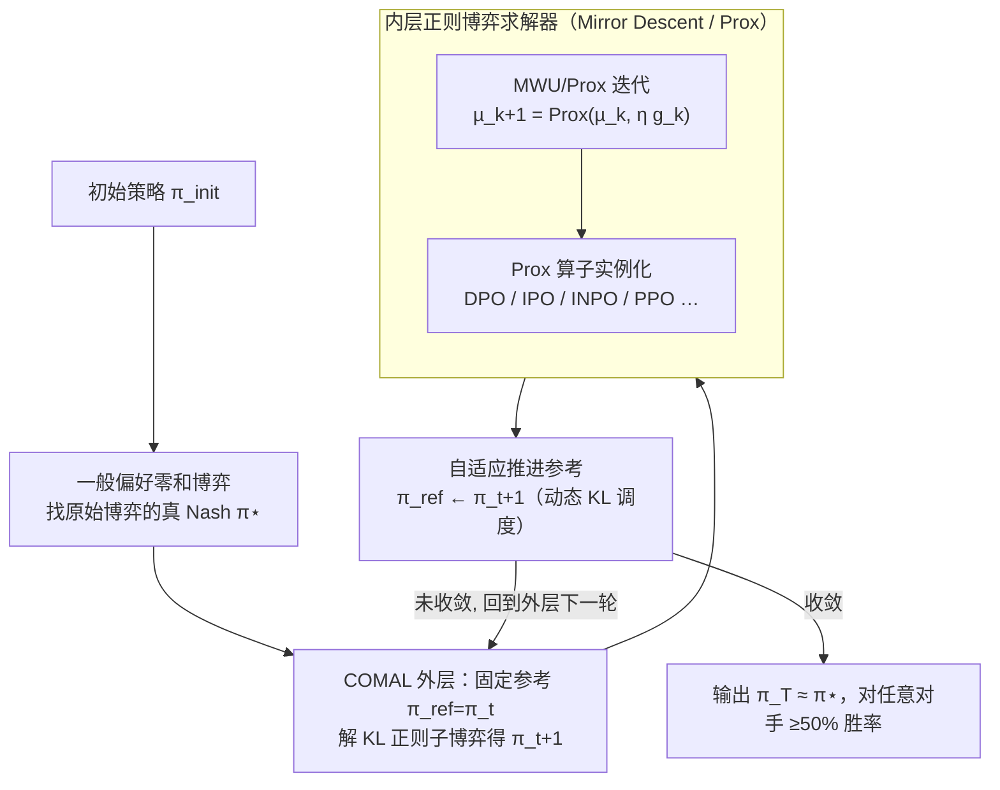

# COMAL: A Convergent Meta-Algorithm for Aligning LLMs with General Preferences

**会议**: ICLR2026  
**OpenReview**: [https://openreview.net/forum?id=OsrE5DJ9Fu](https://openreview.net/forum?id=OsrE5DJ9Fu)  
**代码**: 待确认  
**领域**: 对齐RLHF  
**关键词**: 一般偏好, 纳什均衡, 零和博弈, 末迭代收敛, 近端算子  

## 一句话总结
COMAL 把"对齐到一般人类偏好"建模成一个原始（无正则）的两人零和博弈，用源自博弈论的 Conceptual Prox 元算法——每轮解一个 KL 正则子博弈、然后把参考策略推进到当前解——首次证明算法能**末迭代收敛到原始博弈的精确纳什均衡**，从而保证对任意对手策略都有 ≥50% 胜率；它能以极小改动套在 DPO/IPO/INPO 等现有方法之上，实测在 Llama-3-8B-Instruct 上对所有对比算法保持 >60.2% 胜率。

## 研究背景与动机

**领域现状**：当前主流的 LLM 对齐方法（RLHF、DPO 等）几乎都建立在 Bradley-Terry（BT）奖励假设之上——即假设每条回复有一个标量奖励 $r(y)$，偏好概率由 $\sigma(r(y_1)-r(y_2))$ 给出。学好这个奖励模型（或像 DPO 那样隐式地学），再去最大化它，就完成了对齐。

**现有痛点**：BT 模型只能表达**传递性偏好**——如果多数人 A>B、B>C，那它必然推出多数人 A>C。但真实的群体偏好常常是**非传递（循环）**的：对"周日怎么过最好"这种主观问题，一拨人偏好户外胜过读书、另一拨偏好读书胜过看电视、第三拨却偏好看电视胜过户外，聚合起来就是 $A \succ B \succ C \succ A$ 的循环。论文还指出，哪怕每个个体内部是传递的，**两个 BT 模型的混合也无法再用单个 BT 模型刻画**。用 BT 框架去拟合这种偏好，从根上就拟合不了。

**核心矛盾**：要摆脱 BT 假设，就要用更一般的偏好模型 $P(y_1 \succ y_2 \mid x)$（只满足 $P(y_1\succ y_2)=1-P(y_2\succ y_1)$，不要求传递）。这时对齐问题被建模成一个**两人零和博弈**，目标是找它的**纳什均衡策略 $\pi^\star$**——这个策略对任意其他策略都至少有 50% 胜率，是真正"鲁棒"的对齐解。可问题是：现有为此设计的自博弈算法**要么发散、要么跑偏**。基于乘性权重更新（MWU）的 Iter-IPO、SPPO 在末迭代会绕着均衡点打转、不收敛；而 Nash-MD、INPO 这条线虽然收敛，却收敛到一个**加了 KL 正则的"修改版"博弈**的均衡——这个点已经不再保证对任意对手 50% 胜率了。

**本文目标**：能不能有一个算法，**末迭代收敛到原始对齐博弈（无正则）的纳什均衡**，从而把 50% 胜率保证真正落到实处？这里"末迭代"是关键——理论上很多方法只保证**平均迭代**（所有 checkpoint 的均匀混合）收敛，但在 LLM 上把几十个深度网络 checkpoint 平均起来既不省存储也不实用，实践中用的就是最后一个 checkpoint。

**切入角度**：作者从优化与博弈论里的 **Conceptual Prox-method**（Nemirovski 2004）出发——这是一个有收敛保证的解零和博弈的经典框架，且它的每一步恰好是一个**近端算子（Prox operator）**。而作者的一个关键观察是：PPO、GRPO、DPO、IPO、SPPO、REBEL、DRO、INPO 这些现有偏好优化算法，**本质上都可以解释成在 LLM 上计算 Prox 算子**。这就给了一条"理论保证 + 即插即用"的路。

**核心 idea**：用 Conceptual Prox 框架做一个**元算法**——每轮以当前策略为参考点解一个 KL 正则子博弈得到 $\pi_t$，然后**自适应地把参考策略推进到 $\pi_t$** 再继续；正则只是稳定训练的"脚手架"，参考点的不断推进让整个序列单调逼近并最终收敛到**原始博弈**的真 Nash。

## 方法详解

### 整体框架

COMAL（Convergent Meta Alignment Algorithm）要解的是一般偏好下的对齐博弈。给定指令分布 $\rho$、回复集 $Y$、一般偏好模型 $P$，策略 $\pi_1$ 对 $\pi_2$ 的胜率记为 $P(\pi_1\succ\pi_2)=\mathbb{E}_{x\sim\rho}\mathbb{E}_{y_1\sim\pi_1,y_2\sim\pi_2}[P(y_1\succ y_2\mid x)]$。对齐博弈的目标函数是

$$J(\pi_1,\pi_2) := P(\pi_1\succ\pi_2) - \tfrac{1}{2},$$

max 玩家控 $\pi_1$ 想最大化、min 玩家控 $\pi_2$ 想最小化（减 $\tfrac12$ 只是把它配成零和，无其他作用）。由于博弈对称，存在对称纳什均衡 $(\pi^\star,\pi^\star)$，且 $\pi^\star$ 对任意 $\pi$ 满足 $P(\pi^\star\succ\pi)\ge P(\pi^\star\succ\pi^\star)=50\%$——这正是我们要的鲁棒对齐解。

COMAL 是一个**两层嵌套**结构：外层是元算法（推进参考策略），内层是一个正则零和博弈求解器（用 Mirror Descent / Prox），而 Prox 这一步又可以由现成的 DPO/IPO/INPO 等算法来实例化。整体跑法是：从 $\pi_{\text{init}}$ 出发，外层每轮 $t$ 固定参考 $\pi_{\text{ref}}=\pi_t$，解一个 KL 正则子博弈 $J_\tau(\pi_1,\pi_2,\pi_{\text{ref}})$ 拿到 Nash $\pi_{t+1}$，然后把参考推进到 $\pi_{t+1}$，循环直到收敛。

### 关键设计

**1. 一般偏好下的零和博弈：盯住"真 Nash"而非妥协解**

BT 假设拟合不了循环偏好，所以 COMAL 直接在一般偏好模型 $P$ 上做文章，把对齐写成对齐博弈 $J(\pi_1,\pi_2)=P(\pi_1\succ\pi_2)-\tfrac12$（定义 2）。这一步定下了整篇文章的"靶子"：要找的是**原始博弈**的纳什均衡 $\pi^\star$，因为只有它满足对任意对手 $\ge 50\%$ 胜率这个鲁棒性保证。这与 Nash-MD/INPO 那条线有本质区别——后者为了训练稳定，在目标里永久加了 KL 正则项，解的是修改版博弈

$$J_\tau(\pi_1,\pi_2,\pi_{\text{ref}}) = J(\pi_1,\pi_2) - \tau\,\mathbb{E}_x[\mathrm{KL}(\pi_1\|\pi_{\text{ref}})] + \tau\,\mathbb{E}_x[\mathrm{KL}(\pi_2\|\pi_{\text{ref}})]$$

它的 Nash $\pi^\star_\tau$ 受参考策略牵引、和真 Nash $\pi^\star$ 之间存在一个**常数均衡间隙（equilibrium gap）**，所以丢掉了 50% 胜率保证。COMAL 不接受这个妥协：正则只能当临时手段，最终必须回到无正则的真 Nash。

**2. COMAL 元算法：自适应推进参考策略，换来末迭代收敛**

这是全文的灵魂，也是与现有方法最大的不同：**不把参考策略钉死，而是每轮把它推进到最新解**。算法（Algorithm 1）每轮 $t$ 解一个以 $\pi_{\text{ref}}=\pi_t$ 为中心的正则子博弈，得到它的 Nash $\pi_{t+1}$，然后令 $\pi_{\text{ref}}\leftarrow\pi_{t+1}$ 再继续。这正是 Conceptual Prox-method 的实例化——只有当一个正则子博弈被解到均衡了，才挪动正则中心，既稳又持续地朝真 Nash 前进。

为什么有效？因为它有一条**单调性保证**（Lemma 4 / Theorem 1）：到真 Nash 的 KL 距离逐轮不增，

$$\mathrm{KL}(\pi^\star\|\pi_{t+1}) \le \mathrm{KL}(\pi^\star\|\pi_t),$$

且对**任意** $\tau>0$ 都成立——这意味着正则强度可以在训练中自适应调整，不需要让它按某个衰减表趋于零。每一轮都被证明把策略拉得离真 Nash 更近，因此 $\lim_{t\to\infty}\pi_t$ 存在且就是原始博弈的 Nash。COMAL 是**第一个对无正则对齐博弈给出可证末迭代收敛**的算法：相比之下 Iter-IPO、SPPO 只有平均迭代收敛（不实用），Nash-MD、INPO 只收敛到正则博弈的均衡（跑偏）。作者还证了更强的 Theorem 3——即便每个子博弈只被**近似**求解，只要每阶段有足够进展，末迭代收敛依然成立，这比要求"精确求解每个正则博弈"的并行工作更贴合实际。

**3. 内层正则博弈求解器：Mirror Descent 与 Prox 算子**

外层每轮要解的子博弈 $J_\tau(\pi_1,\pi_2,\pi_{\text{ref}})$ 由内层的 **Mirror Descent（MD）**来解（Algorithm 2）。MD 是梯度下降的"几何感知"推广，用一个正则项定义的更广义"距离"来约束更新方向；当正则取负熵时，它退化为**乘性权重更新（MWU）**。具体地，要最大化目标 $f(\pi)$ 时，一步更新写成 Prox 算子形式

$$\pi_{t+1} := \mathrm{Prox}(\pi_t,\nabla f(\pi_t)) := \arg\max_{\pi}\Big\{\langle\nabla f(\pi_t),\pi\rangle - \eta^{-1}\mathrm{KL}(\pi\|\pi_t)\Big\},$$

直观上就是"沿梯度走 + 别离上一策略太远（KL 约束）"，防止过激更新破坏稳定。对这个强单调的正则子博弈，MWU 有**线性末迭代收敛率**（Theorem 2）：到正则 Nash $\pi^\star_\tau$ 的 KL 距离指数下降，

$$\mathrm{KL}(\pi^\star_\tau\|\mu_{k+1}) \le \Big(1-\tfrac{\eta\tau}{2}\Big)^k \mathrm{KL}(\pi^\star_\tau\|\pi_{\text{ref}}).$$

取 $\tau=O(\varepsilon)$，就能在 $\tilde O(1/\varepsilon^2)$ 轮内逼近原始博弈的 $\varepsilon$-近似 Nash。

**4. Prox 算子的统一视角：即插即用与动态 KL 调度**

COMAL 真正好用的地方，在于作者把"计算 Prox 算子"这件事和一大批现有算法对上了号：PPO、GRPO（RL 类）和 DPO、IPO、SPPO、REBEL、DRO、INPO（损失最小化类）都可以扩展成 Prox 算子的实现。于是把 COMAL 套到现有 pipeline 上**只需极小改动**——主要就是加一个外层循环和周期性的参考策略更新。论文给出的具体实例是 **COMAL + INPO**（Algorithm 3）：内层用 INPO 解正则子博弈，外层每 6 个迭代（即在 UltraFeedback 上完整过一遍指令集）才把参考策略推进一次。配合这个外层结构，COMAL 还能做**动态 KL 调度**：第一轮 INPO 用较小的 $\eta^{-1}=0.002$（强正则换稳定起步），后两轮调到 $\eta^{-1}=0.1$（弱正则换更高性能上限）。这恰好对应"参考推进 + 正则可变"的理论自由度，也是它能突破 Iter-IPO/INPO 在 Llama-3 上"6 轮后崩"的瓶颈的关键。

## 实验关键数据

### 主实验

**合成博弈**：在 $Y=\{y_a,y_b,y_c\}$ 上构造一个非 BT、含循环偏好的 $3\times3$ 博弈（$P[y_b\succ y_a]=P[y_c\succ y_b]=0.9$，$P[y_a\succ y_c]=0.8$，循环 $y_c\succ y_b\succ y_a\succ y_c$）。Iter-DPO、Iter-IPO、SPPO 全部绕着唯一 Nash 打转、发散；INPO 收敛但停在修改版博弈的均衡、留有常数均衡间隙；**只有 COMAL 收敛到真 Nash**，均衡间隙一路压到 $10^{-11}$ 量级。

**LLM 对齐（Llama-3-8B-Instruct，偏好 oracle 为两 BT 奖励模型的混合）**：报告"行 vs 列"两两胜率（%），COMAL 对所有对比算法均 >60.2%。

| 对手（列）→ | BASE | IPO | DPO | Iter-IPO-L | Iter-IPO | INPO-L | INPO | 平均 |
|--------|------|------|------|------|------|------|------|------|
| Iter-IPO（最佳ckpt） | 94.16 | 79.25 | 78.63 | 50.68 | — | 89.19 | 53.79 | 66.93 |
| INPO（最佳ckpt） | 92.92 | 74.78 | 73.54 | 47.08 | 46.21 | 87.20 | — | 63.44 |
| **COMAL（最终ckpt）** | 90.43 | 78.39 | 78.63 | 62.98 | 60.25 | 86.09 | 64.22 | **71.37** |

在 Qwen2.5-7B 上同样领先：COMAL 平均胜率 68.93%，对最强对手 Iter-IPO/INPO 也有 56.89%/57.89%，即 >56.8%。

### 消融 / 分析

| 配置 | 关键现象 | 说明 |
|------|---------|------|
| Iter-IPO / INPO（小正则 $\eta^{-1}=0.002$） | 第 7 个迭代起**急剧崩坏** | 参考策略固定，Llama-3 post-train 充分后再训很脆 |
| Iter-IPO-L / INPO-L（大正则 $\eta^{-1}=0.1$） | 训练稳但**性能上限被压低** | 强正则牺牲了表达力 |
| **COMAL（参考推进 + 动态 KL）** | 18 个迭代仍**稳步上升** | 自适应调正则强度，兼顾稳定与上限 |
| COMAL vs 标准基准 | GSM8K 77.5 / MMLU 64.9 / BBH 63.3 / HumanEval 77.2 / AlpacaEval 53.5 | 通用能力不退化，且在对齐基准上更强 |

### 关键发现
- **"推进参考策略"是性能不崩的根因**：固定参考的 Iter-IPO/INPO 在 Llama-3 上 6 轮后崩，而 COMAL 把参考逐轮推进、并在后续轮放松正则，因此能跑满 18 个迭代还在涨——这与理论上"参考推进带来末迭代收敛"完全呼应。
- **多轮训练是被低估的维度**：以往工作（如 INPO）最多训 3 轮（约一遍 UltraFeedback），COMAL 训 18 轮，正是这种长程迭代才让收敛性的差异显现出来。
- **Arena-Hard 上 COMAL 不及 Iter-IPO 最佳点**，作者诚实指出这是因为 Iter-IPO 取最佳 checkpoint、COMAL 取最终 checkpoint，且 Arena-Hard 只对固定基线（GPT-4）比，与 COMAL"对任意对手"的目标不完全一致。

## 亮点与洞察
- **"正则只是脚手架，参考推进才是主线"**：把 KL 正则从"永久妥协"降级为"每轮临时稳定器"，靠不断推进参考中心回到无正则真 Nash——这是它能同时拿到稳定性和 50% 胜率保证的根本，思路干净且可证。
- **一个统一视角盘活整条赛道**：把 DPO/IPO/INPO/PPO/GRPO 全部解释成"计算 Prox 算子"，于是 COMAL 几乎不挑内核、加个外层循环就能套——这种"元算法"定位让它有很强的可迁移性，未来在线学习里其他收敛算法（Mirror-Prox、乐观 MWU）也能往里塞。
- **理论强度到位**：不只证了精确求解下的末迭代收敛，还证了**近似求解**也成立（Theorem 3），这才是把"漂亮定理"和"LLM 上只能近似训"之间的鸿沟补上的关键一步。

## 局限与展望
- **依赖偏好 oracle 做评测**：实验用训练同款的"两 BT 混合" oracle 当评测器，是受控设定但也意味着结论是在"oracle 自洽"前提下成立的；换 GPT-4 评测（Arena-Hard）时优势就没那么干净。
- **计算量与多轮成本**：18 个迭代、8×A6000 上约 100 小时，虽与对比算法每迭代成本相当，但"多轮"本身把总开销抬高了；什么时候停、推进参考的频率（这里固定每 6 迭代）如何自适应，文中是经验设定。
- **动态 KL 调度仍靠手调**：$\eta^{-1}$ 从 0.002 切到 0.1 的时机和取值是 grid search + 经验，理论虽允许任意 $\tau>0$，但"怎么调最好"没有自动化方案。
- **可改进方向**：把参考推进频率和正则强度做成由收敛信号（如均衡间隙估计）触发的自适应策略，或在真实人类偏好（而非合成 oracle）上验证鲁棒性。

## 相关工作与启发
- **vs INPO / Nash-MD（KL 正则博弈线）**：它们参考策略固定、解的是修改版正则博弈，末迭代只能收敛到 $\pi^\star_\tau$（带常数均衡间隙），丢了 50% 胜率保证；COMAL 推进参考、收敛到原始博弈真 Nash，保证胜率。INPO 还被 COMAL 直接拿来当内层求解器。
- **vs Iter-IPO / SPPO（MWU 线）**：基于乘性权重更新，只有平均迭代收敛、末迭代会绕均衡振荡发散；COMAL 通过近端框架拿到末迭代线性收敛。
- **vs 并发工作（Magnetic Mirror Descent，Wang et al. 2025）**：两者都是 Conceptual Prox 的变体、都做到末迭代收敛，但对方的理论要求**精确**求解每个正则博弈，COMAL 的 Theorem 3 在**近似**求解下也成立，更贴合 LLM 实际。
- **vs BT 类 RLHF（PPO/DPO）**：BT 只能建传递偏好；COMAL 在一般（可非传递）偏好下工作，且把 PPO/DPO 统一进 Prox 视角当作可选内核。

## 评分
- 新颖性: ⭐⭐⭐⭐⭐ 首个对无正则对齐博弈给出可证末迭代收敛的元算法，"推进参考 + Prox 统一视角"是真正的新框架
- 实验充分度: ⭐⭐⭐⭐ 合成博弈 + 两个 LLM + 标准基准齐全，18 轮长程训练有说服力；偏好 oracle 自评测略减分
- 写作质量: ⭐⭐⭐⭐⭐ 理论与直觉交织、动机清晰，对自身局限（Arena-Hard、最佳 vs 最终 ckpt）诚实交代
- 价值: ⭐⭐⭐⭐⭐ 即插即用、改动极小却带可证收敛保证，对一般偏好对齐这一开放问题是扎实推进

<!-- RELATED:START -->

## 相关论文

- [\[ICLR 2026\] Aligning Deep Implicit Preferences by Learning to Reason Defensively](aligning_deep_implicit_preferences_by_learning_to_reason_defensively.md)
- [\[ACL 2025\] Synergistic Weak-Strong Collaboration by Aligning Preferences](../../ACL2025/llm_alignment/synergistic_weak-strong_collaboration_by_aligning_preferences.md)
- [\[ACL 2026\] WildFeedback: Aligning LLMs With In-situ User Interactions And Feedback](../../ACL2026/llm_alignment/wildfeedback_aligning_llms_with_in-situ_user_interactions_and_feedback.md)
- [\[ICLR 2026\] General Exploratory Bonus for Optimistic Exploration in RLHF](general_exploratory_bonus_for_optimistic_exploration_in_rlhf.md)
- [\[ICLR 2026\] Aligner, Diagnose Thyself: A Meta-Learning Paradigm for Fusing Intrinsic Feedback in Preference Alignment](aligner_diagnose_thyself_a_meta-learning_paradigm_for_fusing_intrinsic_feedback_.md)

<!-- RELATED:END -->
