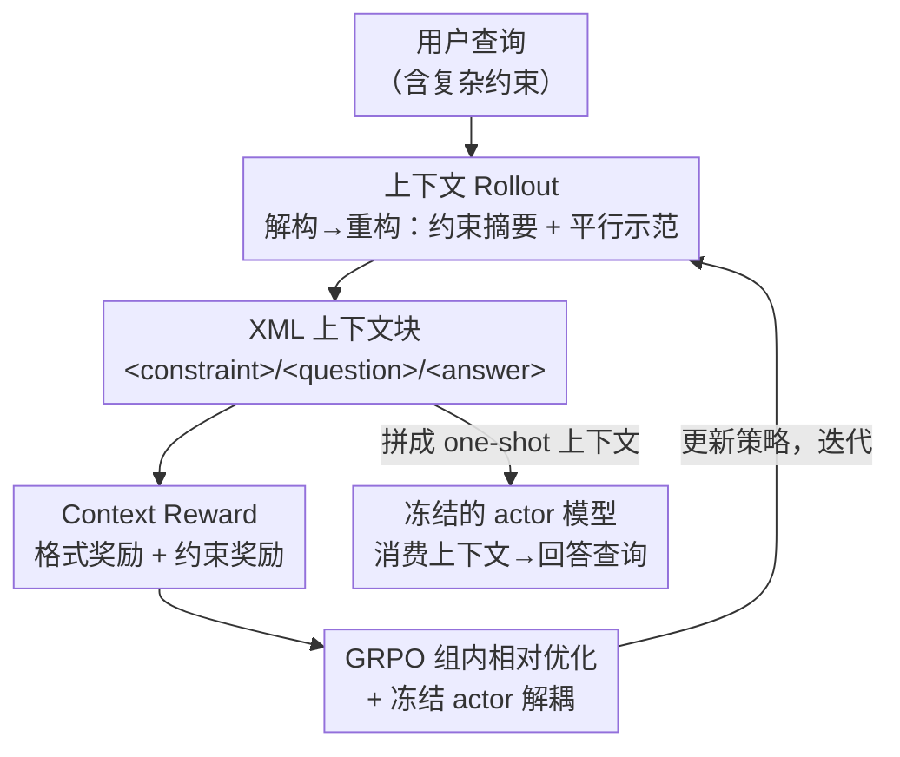

# ContextIF: Enhancing Instruction-Following through Context Reward

**会议**: ICLR2026  
**OpenReview**: [https://openreview.net/forum?id=IuscGSmfEf](https://openreview.net/forum?id=IuscGSmfEf)  
**代码**: https://github.com/ECNU-Text-Computing/ContextIF  
**领域**: 对齐RLHF / 指令遵循 / 强化学习  
**关键词**: 指令遵循、上下文学习、上下文奖励、GRPO、灾难性遗忘

## 一句话总结
ContextIF 用强化学习训练一个"上下文生成器"，让它针对每条指令自动产出约束摘要 + 平行示范，再把这段上下文喂给参数冻结的目标模型做一次上下文学习；靠一套结构 + 语义复合的 Context Reward 引导生成，使开源 8B 模型在 IFEval 上从 77.11 涨到 83.35，且不损伤甚至提升通用能力。

## 研究背景与动机

**领域现状**：要让 LLM 更好地遵循复杂指令（长度限制、关键词、格式、语气……），主流是三条路——大规模 SFT、偏好学习（DPO 等）、以及带可验证奖励的 RLHF。这些方法都要更新模型参数。另一条不动参数的路是上下文学习（In-Context Learning, ICL）：往 prompt 里塞几条示范，模型现学现用。

**现有痛点**：参数微调类方法吃数据吃算力，更糟的是会引发**灾难性遗忘**——为了学指令遵循，把原本的通用知识和泛化能力搞坏了（论文里 SPAR-SFT 在 GSM8K 上掉 1.0 分就是例证），而且对训练时没见过的约束类型泛化很差。ICL 这条路不动参数、天然保住通用能力，但效果完全被示范质量绑死：人工挑示范贵且不可扩展，检索式选示范受限于示范池的覆盖面，而让 LLM 自己生成示范又往往缺乏结构严谨性和语义对齐——生成的东西看着像示范，其实没真正命中用户指令里的约束。

**核心矛盾**：ICL 的效果上限取决于"能不能为每条指令拿到高质量、贴合其约束的示范"，但静态示范池注定覆盖不了真实世界里千变万化、常含新约束的指令；而自由生成又没有质量把关。**两难就在于：既要示范的自适应（per-query 定制），又要示范的可靠（结构 + 语义都对）。**

**本文目标**：把"为指令生成上下文"这件事本身变成一个可优化的策略——既不依赖静态示范池，又能保证生成质量；同时整个过程不碰目标模型参数，从根上回避对齐税。

**切入角度**：作者把上下文生成拆成"先解构、再重构"的两步——先把原指令里的约束抽成一份**约束摘要**，再据此造一对**平行的问答示范**（一个结构同型、约束同类但场景不同的新例子）。这个生成过程恰好可以用一个量化"结构 + 语义"质量的奖励来打分，于是天然适配强化学习。

**核心 idea**：用 RL（GRPO）训练一个生成器策略，让它学会为任意指令产出"结构严谨 + 语义对齐"的 ICL 上下文，再交给冻结的目标模型一次性消费——**用"学会生成自己的学习上下文"代替"直接调参学指令遵循"**。

## 方法详解

### 整体框架

ContextIF 把指令遵循重构成一个"生成上下文 → 消费上下文 → 给上下文打分 → 优化生成器"的闭环。系统里有两个由**同一个基座模型**初始化的副本：一个是可训练的**策略模型（policy / 生成器）**，一个是**全程冻结的 actor 模型（目标 LLM）**。流程是：给定用户查询，策略模型不直接回答，而是先做一步"分析式生成"，吐出一个自包含的 XML 块——含 `<constraint>`（约束摘要）、`<question>` 和 `<answer>`（一对平行示范）。这段 XML 拼成 one-shot 上下文喂给冻结的 actor，由 actor 真正去回答用户查询。同时这段生成的上下文被一个多维奖励模型评估，得到的奖励信号通过 GRPO 的组内相对比较来更新策略模型。如此迭代，策略逐渐变成一个"专业上下文生成器"。

### 关键设计

**1. 上下文 Rollout：把指令"先解构再重构"成一段可复用的示范**

针对"自由生成的示范缺结构、缺对齐"这个痛点，ContextIF 不让模型随性发挥，而是强制它走一条两阶段的结构化生成路径，并把产物锁进固定的 XML 模板。具体地，策略模型对每条查询执行**单次 rollout**，生成一个含三个功能标签的自包含块：`<constraint>` 是对原指令约束的**解构**（把"两段话、不超过 120 词、以某句话结尾"这类要求抽成一份摘要）；`<question>` 和 `<answer>` 是据此**重构**出的一对平行示范——一个换了主题但**约束结构同型**的新问题，以及一个真正满足这些约束的答案。与传统 ICL 从静态池里"选"示范不同，这里是为每条查询当场"造"一段定制上下文，所以新颖、罕见的约束也能被覆盖。这个 XML 块就构成 RL 的完整轨迹（trajectory），既是被打分的对象，也是最终拼给 actor 的 one-shot 上下文。

**2. Context Reward：用"格式 + 约束"复合信号把结构严谨与语义对齐解耦打分**

要把上面的生成过程变成可优化目标，关键是设计一个能同时管住"格式对不对"和"语义准不准"的奖励。ContextIF 把总奖励显式拆成两块：$R_{\text{context}} = R_{\text{format}} + R_{\text{constraint}}$。

格式奖励 $R_{\text{format}} \in \{0,1\}$ 是个二元信号，只看输出是否严格遵循 XML schema——三个标签是否齐全、顺序是否正确，全对给 1，否则给 0，负责结构脚手架。约束奖励 $R_{\text{constraint}} \in \{0,1,2,3\}$ 才是语义核心，用一个强 LLM（如 LLaMA3-70B-Instruct）当程序化裁判，按三条二元标准各计 1 分后求和：$R_{\text{constraint}} = r_{\text{sum}} + r_{\text{demoq}} + r_{\text{demoa}}$。其中 $r_{\text{sum}}$（Summary Accuracy）判 `<constraint>` 是否准确囊括了原查询的所有约束；$r_{\text{demoq}}$（Question Parallelism）判生成的 `<question>` 是否真的实例化了与用户输入**同型的平行约束结构**；$r_{\text{demoa}}$（Constraint Adherence）判生成的 `<answer>` 是否忠实满足了它自己那个问题里定义的约束。这种"解构准不准 + 重构忠不忠"的细粒度拆分，比单一标量奖励更能逼出真正高质量的示范——消融实验也证实，去掉 $r_{\text{demoa}}$（答案忠实度）掉点最狠（IFEval 均分从 83.35 跌到 78.50），去掉 $r_{\text{sum}}$（摘要准确度）次之，而去掉格式奖励掉得相对最轻，说明基座模型本就擅长结构化输出，真正的难点在语义层面的解构与执行。

**3. GRPO 组内相对优化 + 冻结 actor 的解耦设计**

有了奖励还需要一个稳定、不引入额外价值网络的优化器，作者用 GRPO（Group Relative Policy Optimization）。对每条查询 $q$，策略 $\pi_\theta$ 采样一组 $G$ 个独立 rollout $\{c_1,\dots,c_G\}$，每个 $c_i$ 由奖励模型打分得到 $r_i = R_{\text{format}}(c_i) + R_{\text{constraint}}(c_i)$。GRPO 不训练单独的 critic，而是用组内统计量估计基线——算组内均值 $\mu_G$ 和标准差 $\sigma_G$，把优势归一化为

$$\hat{A}_i = \frac{r_i - \mu_G}{\sigma_G + \epsilon}$$

再以带 KL 约束的裁剪目标更新策略：

$$L_{\text{GRPO}}(\theta) = \mathbb{E}\Big[\tfrac{1}{G}\sum_{i=1}^{G}\big(\min(\rho_i(\theta)\hat{A}_i,\ \text{clip}(\rho_i(\theta),1-\alpha,1+\alpha)\hat{A}_i) - \beta D_{\text{KL}}(\pi_\theta\|\pi_{\text{ref}})\big)\Big]$$

其中 $\rho_i(\theta) = \pi_\theta(c_i|q)/\pi_{\theta_{\text{old}}}(c_i|q)$ 是重要性采样比。这套优化只针对组内相对更优的上下文结构做强化，对结构化输出任务很高效。更关键的是**策略与 actor 的解耦**：被 GRPO 更新的只有生成器，目标 actor 全程冻结、只负责消费上下文回答问题。正因为目标模型参数一点没动，ContextIF 从机制上绕开了 SFT/直接 RLHF 那种灾难性遗忘——通用能力不仅没退，反而因为"学会解构指令、生成逻辑自洽示范"这种类自蒸馏的训练而被强化（MMLU +1.7、BBH +1.6）。

### 一个完整示例

以查询 "Write a brief overview of the movie 'Inception' in exactly two paragraphs. Use formal language but avoid technical jargon. The response must not exceed 120 words and should end with the phrase 'A mind-bending experience awaits.'" 为例：策略模型先解构出 `<constraint>`——"恰好两段、正式语气、不超 120 词、以指定句收尾"；再重构一对平行示范，`<question>` 换成另一个同样"两段 + 词数上限 + 固定结尾句"的新影评请求，`<answer>` 给出一段真正满足这些约束的范文。这个三标签 XML 块拼成 one-shot 上下文，连同原查询一起喂给冻结的 actor，actor 看着这份"同型范例"就更容易把 Inception 的简介也写得段数、词数、结尾句全部达标。整个生成质量由 Context Reward 打分（格式 1 + 约束 3 = 满分 4），分数进 GRPO 的组内比较反过来优化生成器。

## 实验关键数据

### 主实验

骨干模型为 LLaMA3-8B-Instruct 与 Mistral-7B-Instruct，在 IFEval、Multi-IF、FollowBench、LiveBench 四个指令遵循基准上评测。

| 模型 | IFEval Avg | Multi-IF Turn3 | FollowBench SSR | LiveBench |
|------|-----------|----------------|-----------------|-----------|
| LLaMA3-8B-Instruct（基座） | 77.11 | 43.92 | 62.90 | 46.70 |
| SPAR-8B（SFT+DPO） | 83.11 | 51.32 | 68.80 | 49.80 |
| UltraIF-8B | 81.20 | 44.84 | 65.10 | 47.50 |
| **ContextIF-8B** | **83.35** | **53.51** | **69.37** | **59.90** |
| LLaMA3-70B-Instruct（参照） | 83.89 | 53.90 | 70.90 | 61.70 |

IFEval 均分相对基座提升 6.24 分（77.11→83.35），且在严格/宽松两种评测下一致提升；多轮场景 Multi-IF 末轮（Turn3）领先同规模最强基线，说明对话越长越能保住约束；LiveBench 上更是大幅甩开同规模模型、逼近大一个数量级的 70B 模型。

与各种 ICL 策略对比（同在 LLaMA3-8B 上）也全面胜出：随机选示范（select-context）反而掉点，LLM 自生成上下文（LLM-context，80.97）有效但不及 RL，甚至用 GPT-4o 生成上下文（GPT4o-context，82.77）也被 ContextIF-8B（83.35）反超——证明"学到的上下文策略"优于"更大模型现场生成的上下文"。

### 消融实验

| 配置 | IFEval Avg | Multi-IF Turn3 | FollowBench SSR | LiveBench |
|------|-----------|----------------|-----------------|-----------|
| ContextIF-8B（完整） | 83.35 | 53.51 | 69.37 | 59.90 |
| w/o Format（去格式奖励） | 81.13 | 51.21 | 67.48 | 56.10 |
| w/o Summary（去摘要奖励 $r_{\text{sum}}$） | 79.22 | 50.88 | 65.05 | 52.10 |
| w/o Demoq（去问题平行性 $r_{\text{demoq}}$） | 81.15 | 50.93 | 66.11 | 55.80 |
| w/o Demoa（去答案忠实度 $r_{\text{demoa}}$） | 78.50 | 49.15 | 64.20 | 51.70 |

### 关键发现

- **语义奖励比结构奖励更关键**：去掉答案忠实度 $r_{\text{demoa}}$ 掉点最狠（83.35→78.50），摘要准确度 $r_{\text{sum}}$ 次之；而去掉格式奖励掉得相对最轻——基座模型本就擅长 XML 结构，真正的瓶颈在语义解构与执行。
- **不损通用能力，反而提升**：在 MMLU/BBH/GSM8K/HumanEval 上，SPAR-SFT 全面退化（GSM8K -1.0），而 ContextIF 全项上升（MMLU +1.7、BBH +1.6、均分 +1.3），印证冻结 actor 的解耦设计避开了对齐税。
- **强泛化到未见约束**：训练时刻意抽掉 "Length"、"Keywords" 约束，测试时 ContextIF 在这两类上仍领先 SPAR-SFT-DPO 约 8 分，"Language" 近满分——说明 RL 学到的是可迁移的指令遵循机制而非模式套用。
- **高效**：只用 4k 条无标注查询做一次性 GRPO，对比 SPAR/AutoIF 动辄 50k+ 合成样本 + 多阶段 SFT/DPO；compute-matched 的 Direct-RL（同样 4k 数据、同奖励直接训 actor 答题）只到 IFEval 80.74 且带轻微对齐税，远不及 ContextIF 的 83.35。

## 亮点与洞察

- **把"挑示范/写示范"升格成"学一个会生成示范的策略"**：这是最巧的视角转换——传统 ICL 的瓶颈是示范池，ContextIF 直接把"per-query 造上下文"变成可被 RL 优化的对象，绕开了池子的覆盖天花板。
- **生成器与目标模型解耦，是规避灾难性遗忘的干净方案**：训练只动生成器、目标模型冻结，相当于把"学指令遵循"外包给一个独立模块，从机制上保证通用能力不退；这个"解耦优化"思路可迁移到任何"既想增强某能力又怕伤通用能力"的场景。
- **奖励的"解构 + 重构"二分法**：把约束奖励拆成"摘要准不准（解构）"和"示范问/答忠不忠（重构）"，让 RL 信号直接对准任务结构，而不是给一个笼统标量——消融显示这种细粒度拆分确实各司其职。
- **学上下文 > 直接学答题**：compute-matched 对照证明，在同等数据和奖励下，"学会生成自己的学习上下文"比"直接 RL 调参答题"更稳更强且无对齐税，对"自蒸馏/元学习"式训练范式有启发。

## 局限与展望

- 推理时要先跑一遍生成器产出 XML 上下文，再让 actor 带着 one-shot 上下文作答，引入固定的 token/前向开销（虽然论文论证比"judge-and-refine"多轮方法更省，但相对零样本直答仍是双倍前向）。
- 约束奖励依赖一个强 LLM 裁判（LLaMA3-70B）打三条二元分，裁判本身的偏差/成本未在主流程中量化（附录 E.3 换 Qwen-2.5-72B 验证了结论稳定，但裁判质量仍是上限）。
- 训练分布只覆盖内容/风格/格式三类约束，作者也承认引入更多样的约束类型有望进一步提升——当前对"训练分布外约束"的强泛化更多是机制红利而非数据覆盖带来的。
- 只在 8B/7B 两个开源骨干上验证，更大规模、闭源或多模态指令场景下生成器–actor 解耦是否同样划算，尚待检验。

## 相关工作与启发

- **vs SFT/偏好学习类（Conifer、AutoIF、UltraIF、SPAR、TULU 3）**：它们靠大规模合成数据 + 多阶段调参提升指令遵循，代价是灾难性遗忘和对新约束泛化差；ContextIF 不动目标模型参数，用 RL 训生成器，既保通用能力又强泛化，且数据量级小一个量级（4k vs 50k+）。
- **vs 传统/检索式 ICL**：传统 ICL 从静态池选示范，受覆盖面限制、随机选还会掉点；ContextIF 为每条查询当场生成定制上下文，覆盖罕见/未见约束。
- **vs LLM 自生成上下文（含 GPT-4o-context）**：自由生成缺质量把关，ContextIF 用可验证的 Context Reward + GRPO 把生成质量训上去，结果反超用 GPT-4o 现场生成的上下文。
- **vs 直接 RLHF/Direct-RL**：直接对目标模型做 RL 答题会带对齐税、伤通用能力；ContextIF 把 RL 用在"生成学习上下文"上、目标模型冻结，等效于一种自蒸馏，既增强指令遵循又提升基础能力。

## 评分
- 新颖性: ⭐⭐⭐⭐⭐ 把指令遵循重构成"RL 训练上下文生成器 + 冻结目标模型消费"，视角新颖且自洽。
- 实验充分度: ⭐⭐⭐⭐⭐ 四基准 + 通用能力 + 未见约束 + 消融 + 换裁判 + compute-matched 对照，覆盖全面。
- 写作质量: ⭐⭐⭐⭐ 方法与动机清晰，奖励/GRPO 公式完整；图示偏概念化、细节需对照正文。
- 价值: ⭐⭐⭐⭐⭐ 无需调参、保通用能力、强泛化、低成本，是很实用的指令遵循增强范式。

<!-- RELATED:START -->

## 相关论文

- [\[ACL 2025\] Reverse Preference Optimization for Complex Instruction Following](../../ACL2025/llm_alignment/reverse_preference_optimization_for_complex_instruction_following.md)
- [\[ACL 2026\] What Makes Good Instruction-Tuning Data? An In-Context Learning Perspective](../../ACL2026/llm_alignment/what_makes_good_instruction-tuning_data_an_in-context_learning_perspective.md)
- [\[ICLR 2026\] RECAST: Expanding the Boundaries of LLMs' Complex Instruction Following with Multi-Constraint Data](recast_expanding_the_boundaries_of_llms_complex_instruction_following_with_multi.md)
- [\[ACL 2026\] MDP-GRPO: Stabilized Group Relative Policy Optimization for Multi-Constraint Instruction Following](../../ACL2026/llm_alignment/mdp-grpo_stabilized_group_relative_policy_optimization_for_multi-constraint_inst.md)
- [\[CVPR 2026\] From Pixel to Precision: Enhancing Handwritten Mathematical Expression Recognition with Image-Level Reward](../../CVPR2026/llm_alignment/from_pixel_to_precision_enhancing_handwritten_mathematical_expression_recognitio.md)

<!-- RELATED:END -->
