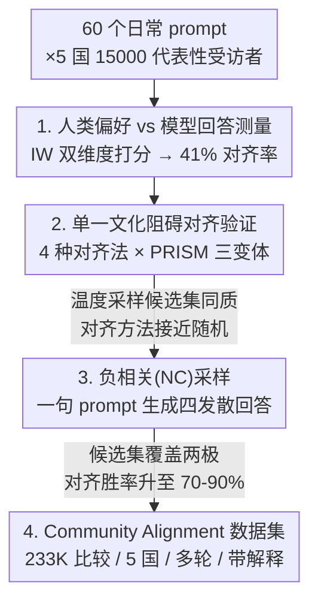

# Cultivating Pluralism In Algorithmic Monoculture: The Community Alignment Dataset

**会议**: ICLR2026  
**OpenReview**: [https://openreview.net/forum?id=4NtoAVqfhA](https://openreview.net/forum?id=4NtoAVqfhA)  
**代码**: [facebook/community-alignment-dataset](https://huggingface.co/datasets/facebook/community-alignment-dataset)  
**领域**: 对齐RLHF / 偏好数据集 / 多元对齐  
**关键词**: 算法单一文化, 多元对齐, 负相关采样, 偏好数据集, 全球价值观

## 一句话总结
作者用 5 国 15,000 人的代表性人类调查证明：21 个 SOTA 大模型的回答只对齐了 41% 的人类偏好（"算法单一文化"），现有偏好数据集因候选回答太同质而学不出这种多样性；为此提出"负相关采样（NC sampling）"——用一句 prompt 让单个模型一次生成四个**刻意发散**的回答，使对齐方法学习异质偏好的能力大幅提升，并据此开源了迄今最大、最具代表性的多语言多轮偏好数据集 Community Alignment（233,319 条比较）。

## 研究背景与动机

**领域现状**：大模型要服务全球用户，就得照顾到跨文化、跨政治、跨价值观的多样偏好。学界为此提出了一系列"多元对齐（pluralistic alignment）"路线——个性化、本地化、基于社会选择的聚合、分布式对齐等。但所有这些路线有一个共同的前提：你首先得**能从数据里学到**人群之间存在差异的偏好。而学偏好的主流工具就是偏好数据集——给人看一个 prompt 下的若干候选回答，让他选最喜欢的那个。

**现有痛点**：调查方法学（survey design / opinion polling）几十年的研究早就指出，"候选项的预先筛选（candidate pre-selection）"会严重影响你对一个群体偏好的结论。但在偏好学习里这件事几乎被忽视了——候选回答通常是大模型生成的，而模型自己就带偏见。如果模型只爱生成某一种文化、某一种政治立场的回答，那候选集里根本不会出现另一极的回答，你自然也学不到更广泛的偏好。作者举了个很直白的例子：用户说"我正在经历丧亲之痛"，一部分用户偏好带宗教信仰抚慰的回答（"愿你的信仰带给你力量……"），另一部分偏好世俗化回答（"愈合需要时间……"）；如果基座模型几乎不采样出宗教那一极，你就永远学不到"宗教 vs 世俗"这个维度上的偏好差异——因为数据集里压根没有相关的对比。

**核心矛盾**：人类偏好高度异质，但大模型回答高度同质，而我们却指望用模型采样出的候选回答去测量人类的异质偏好——这中间存在根本错配。作者把模型回答的这种同质性命名为"算法单一文化（algorithmic monoculture）"。更关键的是，问题不在于模型"不知道"多元价值观，而在于它的**默认行为**只对齐了某一类价值观，所以独立采样（无论是高温度采样还是从多个模型采）都救不了。

**本文目标**：拆成三个子问题——(1) 量化大模型回答相对人类偏好到底有多单一；(2) 证明这种单一文化会让标准对齐方法（prompt-steering / SFT / DPO / GRPO）学不出异质偏好；(3) 找到一个简单可落地的办法，强行让候选集变多样，从而恢复对齐方法学习多元偏好的能力。

**切入角度**：作者借用社会学里 Inglehart-Welzel（IW）的两个经典价值观维度作为"度量标尺"——世俗理性 vs 传统（secular-rational vs traditional）、自我表达 vs 生存（self-expression vs survival）。这两个维度源自全球最大规模的纵向价值观调查 World Values Survey，覆盖了人类价值观变化的主轴，也和常见的政治分歧相关。作者明确说：用这么宽的维度是为了立一个**强的负面结果**——如果连这么宏观、这么显著的维度上偏好数据集都学不出来，那它对更细粒度偏好就更无能为力了。

**核心 idea**：用"负相关采样"代替"独立采样"——让候选集里一个回答出现后，相似回答出现的概率被压低，从而强行覆盖价值观光谱的两极，把对齐方法本就具备的学习能力重新喂活。

## 方法详解

### 整体框架
这篇论文不是一个新模型，而是一条"诊断 → 解药 → 落地"的实证链路，外加一个开源数据集。整体可以分成三块：第一块**测量**——通过配对的"人类调查 + 模型评测"，量化人类偏好的异质性与模型回答的单一性，得出"21 个模型只对齐 41% 人类偏好"这个核心负面事实；第二块**归因 + 解药**——证明算法单一文化导致标准对齐方法在现有偏好数据集（包括最多样的开源数据集 PRISM）上都学不出 IW 维度的偏好，并提出 NC 采样作为简单解药；第三块**落地**——基于 NC 采样收集并开源 Community Alignment 数据集。

### 关键设计

**1. IW 双维度度量 + GPT-4o 裁判：把"价值观对齐"变成可量化的数**

要量化"模型对齐了多少人类偏好"，先得有个标尺和一个能给回答打分的工具。作者选 IW 的两个维度作标尺，对每个 prompt 手工策划三个回答：世俗理性/自我表达极记为 $1$，平衡记为 $0.5$，传统/生存极记为 $0$。人类一侧：每个受访者看 20 个（共 60 个）prompt，每个 prompt 下看四个回答（一个平衡 + 两个对立极 + 一个默认 Llama-3.3-70B 回答），选最喜欢的；某人在某维度上的偏好分 = 其所选回答得分在所有 prompt 上的平均。模型一侧：让 21 个模型对同样的 prompt 开放式作答，再训练一个基于 GPT-4o 的成对裁判判断"哪个回答更偏向某价值观"，在人工标注集上裁判准确率达 80–91%（五种语言、两个维度），用它把模型回答也映射到 $\{0,0.5,1\}$ 并平均。这套设计的巧妙处在于：人类和模型被放到**同一把尺子**上，于是"41% 对齐率"这个数字才有意义——它是模型回答分布与人类偏好分布在 IW 平面上的重合度（取两轴最小值、算落在其上的人类偏好比例）。

**2. 用"算法单一文化"诊断现有数据集为何学不出多元偏好**

有了标尺，作者就能直接看到病灶。图 1 显示：哪怕在美国境内，人类受访者的 IW 偏好也高度异质、分布在四个象限；但 21 个模型几乎清一色落在"世俗理性 + 自我表达"那个象限。更要命的是图 2 的统计——在四个回答的候选集里，60–80% 的情况下模型一个"传统"或"生存"回答都生成不出来；温度采样下"传统"与"生存"价值观的平均覆盖率只有 15% 和 30%。作者还特意指出：温度和价值观覆盖率之间**没有单调关系**，把温度调高（增加 token 随机性）并不会带来价值观上的多样性。这条诊断把锅明确扣在"候选回答同质"上，而非"标注者不够多样"或"对话主题无关价值观"——这正是后面非选 PRISM 不可的原因（PRISM 标注者人口均衡、对话围绕价值观）。

**3. 负相关（NC）采样：一句 prompt 把候选集从同质掰成发散**

这是全文的解药，也是最反直觉地"便宜"的设计。既然独立采样（同一个模型多次采、甚至换 21 个模型采）都改不了候选集同质——因为每次采样都向同一个默认分布回归——那就别独立采，改成**条件采样**：让一个回答进入候选集后，降低相似回答再进来的概率，即让候选集内部呈负相关。作者发现根本不需要复杂的解码算法，一句 prompt 就够了：

> "Generate four responses that represent diverse values. Each response should start with ### to demarcate where one begins and the other ends."（生成四个代表不同价值观的回答，每个以 ### 开头分隔。）

注意这句 prompt **完全没提** IW 那两个维度，但生成的候选集却在 IW 四个价值观上都拿到了 Pareto 改进：传统/生存覆盖率从 15%/30% 升到 60%/53%。机制上，让模型在**同一次生成里**同时产出四个回答，等于强迫它在内部做"互相区分"——已经写了世俗回答，下一个就倾向于换个调子。效果上最惊人的是：用单个模型做 NC 采样，学习异质偏好的能力**反而显著超过**用 21 个模型独立温度采样——既更简单又更有判别力。

**4. 把 NC 采样落地成 Community Alignment 数据集**

最后一步是把方法变成资源。作者用 NC 采样生成候选集（首轮让模型生成三个 NC 回答 + 一个默认 Llama 回答凑四个），招募 5 国（美、法、意、巴、印）标注者做真人偏好标注，得到 233,319 条比较。数据集特意设计了五个推动多元对齐研究的属性：NC 采样候选、多语言（66% 非英语）、比较级别的自然语言解释（44% 的比较附带"我为什么选它"）、prompt 级标注者重叠（2,582 个 prompt 各有 ≥10 人标注，可直接观测同一 prompt 上的偏好分布）、以及人均对话量大（中位数 26 轮对话，PRISM 仅 6 轮，利于个性化研究）。

### 损失函数 / 训练策略
对齐实验侧用了四种现成方法验证 NC 采样的增益，没有自创损失：(1) prompt-steering（10 个训练 prompt 及其被选回答作为 in-context 示例）；(2) SFT（在被选回答上做监督微调）；(3) DPO（在被选/被拒回答对上做直接偏好优化）；(4) GRPO（奖励由裁判比较策略模型生成与数据集中候选回答得到）。在 Llama-3.1-8B 与 3.3-70B 两个 instruct 模型上分别试，评测指标是"微调后模型 vs 原模型"被同一裁判判定的胜率。

## 实验关键数据

### 主实验：单一文化诊断 + NC 采样增益

| 测量项 | 温度采样 | NC 采样 | 说明 |
|--------|---------|---------|------|
| 21 个模型对齐人类偏好的比例 | 41% | — | 模型回答几乎只落在世俗理性+自我表达象限 |
| "传统"价值观候选覆盖率 | 15% | 60% | 四回答候选集里至少含一个该极的概率 |
| "生存"价值观候选覆盖率 | 30% | 53% | 同上，Pareto 改进 |
| 候选集"零传统/生存回答"占比 | 60–80% | 大幅下降 | 温度采样常常一个对立极都没有 |

### 对齐方法学习异质偏好的胜率（PRISM 三变体）

| 候选生成方式 | 微调方法胜率 | 说明 |
|------|---------|------|
| τ=1, 单模型 | ≈随机水平 | 独立温度采样，学不出 IW 偏好 |
| τ=1, 21 模型（原 PRISM） | ≈随机水平 | 换更多模型独立采样仍然失败 |
| NC 采样, 单模型 | 约 70–90% | 四种对齐法、四个 IW 价值观上全面 Pareto 改进 |

### 数据集对比（Table 1）

| 属性 | HH | PRISM | Community Alignment |
|------|----|----|----|
| 总比较数 | 169,352 | 27,172 | **233,319** |
| 非英语比例 | 0% | 1% | **66%** |
| 独立标注者数 | 115 | 1,500 | **3,603** |
| 人均对话中位数 | 未知 | 6 | **26** |
| 每 prompt 标注人数 | 1 | 1 | **2,582 个 prompt ≥10 人** |
| 自然语言反馈 | 无 | 对话级 | **比较级** |

### 关键发现
- **NC 采样不止补"弱势极"，是全面 Pareto 改进**：它不仅把欠表达的传统/生存价值观学习胜率拉上来，连原本就占优的世俗理性/自我表达价值观也一起提升——说明同质候选集对**任何**价值观的学习都是损害。
- **多模型独立采样救不了单一文化**：用 21 个不同厂商的模型独立采样，胜率依旧接近随机；问题的根在"独立采样向默认分布回归"，不在"模型不够多"。
- **温度与多样性非单调**：调高温度增加的是 token 级随机性，不等于价值观级多样性，这驳斥了"高温采样=更多样"的常见假设。
- **裁判一致性设计**：同一个 GPT-4o 裁判既标注被选回答又评测微调模型，作者论证即便裁判有误，实验仍在测核心问题——候选回答如何影响异质偏好的可学习性。

## 亮点与洞察
- **把"算法单一文化"从口号变成可测量的负面结果**：用社会学成熟的 IW 维度当尺子 + GPT-4o 裁判量化，得出"41% 对齐率""15%/30% 覆盖率"这种硬数字，让一个偏哲学的问题落地成实证结论，说服力远强于定性吐槽。
- **解药便宜到让人意外**：解决候选同质不需要新解码算法、新损失、新训练，一句不提具体维度的 prompt 就能诱导出负相关样本，且单模型 NC 采样打败 21 模型独立采样——"简单却更有判别力"这个反差是最大的 aha。
- **诊断与解药咬合得很紧**：先证明"独立采样必然同质"，再顺势推出"那就别独立采、改条件采"，逻辑链是闭合的，不是先有方法再补动机。
- **可迁移的思路**：负相关采样这个想法可以推广到任何需要"覆盖多样性"的候选生成场景——RLHF 候选构造、数据增强、红队多样化、检索去冗余等，凡是"独立采样导致塌缩到默认分布"的地方都适用。

## 局限与展望
- **IW 两维度不能涵盖所有价值观**：作者自己承认用宽维度是为了立强负面结果，但这也意味着论文没回答"更细粒度、更具体的偏好（如具体政策立场）能否被 NC 采样学到"。
- **裁判依赖 GPT-4o**：标注被选回答和评测都靠同一个 GPT-4o 裁判，准确率虽 78–91% 但仍有误差，且裁判本身可能带有它自己的文化偏见；用闭源模型当度量基准也限制了可复现性。
- **NC 采样靠 prompt，稳定性存疑**：一句 prompt 诱导负相关在 Llama 上有效，但换模型、换语言、换主题后这句 prompt 的有效性如何、是否需要重调，论文没有系统给出；prompt 级技巧通常对措辞敏感。
- **"学到偏好"≠"应当部署"**：作者明确声明不主张部署只优化某一 IW 极的模型，这些实验是为评估数据集效用而非给出对齐处方——如何把学到的异质偏好真正用于多元对齐（聚合/个性化/分布式），仍是开放问题。

## 相关工作与启发
- **vs PRISM (Kirk et al., 2024b)**：PRISM 是此前最多样的开源偏好数据集，标注者人口均衡、围绕价值观对话。本文恰恰拿 PRISM 当"即使最好的现有数据集也学不出 IW 偏好"的反例——把锅精准甩给"候选回答同质"而非标注者或主题。Community Alignment 在规模（233K vs 27K）、多语言（66% vs 1% 非英语）、标注者重叠（2,582 prompt ≥10 人 vs 每 prompt 1 人）上全面超越。
- **vs 多元对齐方法路线 (Sorensen et al., 2024 等)**：个性化、社会选择、分布式对齐都假设"已经能学到多样偏好"。本文专攻这个被跳过的前提，是这些路线的上游基础设施。
- **vs 各类多样性解码 (Ippolito 2019 / Corso 2023 / Lanchantin 2025 等)**：这些方法也想让生成更多样，但本文证明一个极简的 prompt-based 负相关采样就能在价值观覆盖上拿到显著增益，无需复杂解码改造。
- **vs OpenAssistant / DICES**：OpenAssistant 是另一个开源多语言偏好集但以英语/西语为主；DICES 虽有多标注者但聚焦安全评测。Community Alignment 是首个同时具备 prompt 级标注者重叠 + 比较级自然语言解释的通用偏好数据集。

## 评分
- 新颖性: ⭐⭐⭐⭐⭐ 把"算法单一文化"量化成强负面结果，并给出极简却反直觉有效的 NC 采样解药。
- 实验充分度: ⭐⭐⭐⭐⭐ 5 国 15,000 人代表性调查 + 21 模型评测 + 4 对齐法 × 3 数据集变体 × 2 模型规模，证据链完整。
- 写作质量: ⭐⭐⭐⭐⭐ "诊断→解药→落地"三段叙事清晰，丧亲例子和"苹果/香蕉/mamey"类比把抽象问题讲得很直观。
- 价值: ⭐⭐⭐⭐⭐ 开源迄今最大多语言多轮偏好数据集 + 一个可立即复用的采样技巧，对多元对齐社区影响面大。

<!-- RELATED:START -->

## 相关论文

- [\[ICLR 2026\] Alignment-Weighted DPO: A Principled Reasoning Approach to Improve Safety Alignment](alignment-weighted_dpo_a_principled_reasoning_approach_to_improve_safety_alignme.md)
- [\[ICLR 2026\] Reward Model Routing in Alignment](reward_model_routing_in_alignment.md)
- [\[ICLR 2026\] Superficial Safety Alignment Hypothesis](superficial_safety_alignment_hypothesis.md)
- [\[ICLR 2026\] Annotation-Efficient Honesty Alignment via Confidence Elicitation and Calibration](annotation-efficient_honesty_alignment_via_confidence_elicitation_and_calibratio.md)
- [\[ICLR 2026\] Data Selection for LLM Alignment Using Fine-Grained Preferences](data_selection_for_llm_alignment_using_fine-grained_preferences.md)

<!-- RELATED:END -->
