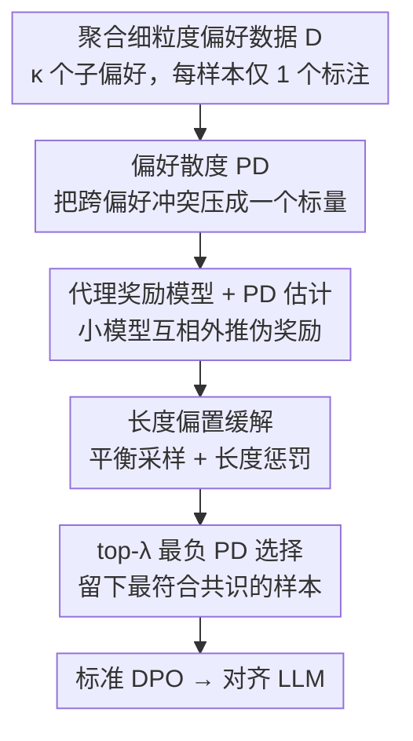

# Data Selection for LLM Alignment Using Fine-Grained Preferences

**会议**: ICLR2026  
**OpenReview**: [https://openreview.net/forum?id=nRS87hbAqU](https://openreview.net/forum?id=nRS87hbAqU)  
**代码**: 待确认  
**领域**: 对齐RLHF / LLM对齐  
**关键词**: 细粒度偏好, 数据选择, 偏好散度, DPO, 偏好冲突

## 一句话总结
针对"把多个细粒度（aspect-specific）偏好聚合后训练 DPO 会被偏好冲突拖垮"的问题，本文提出偏好散度（Preference Divergence, PD）来量化某条样本与其它偏好的冲突程度，并证明"只挑 PD 最负的那部分样本做标准 DPO"具有损失上下界最优性——结果在 UltraFeedback / HelpSteer 上只用 30% 数据就稳定超过全量对齐。

## 研究背景与动机

**领域现状**：让 LLM 对齐人类偏好的主流离线做法是 DPO——在一份"A 比 B 好"的成对偏好数据上直接微调，绕开 PPO 那套昂贵又不稳的在线 RL。DPO 的效果几乎完全取决于这份离线偏好数据的质量。

**现有痛点**：传统的"整体 better-than"标注既模糊又难标。于是一些工作主张把整体偏好拆成若干**细粒度子偏好**（helpfulness、instruction-following、truthfulness、honesty 等），因为单个维度的判断标准更简单、标注更一致、更易收集。但把这些来自不同维度的子偏好数据**聚合**到一起训练时会冒出两个新麻烦：① 现有 DPO 类方法都是为"单一偏好"设计的，处理不了多个互相打架的细粒度偏好；② 更要命的是，聚合数据里充斥着冗余、噪声、尤其是**偏好冲突**——某条样本在 helpfulness 维度判 A 更好，但从整体看其实 B 更好。作者在 UltraFeedback 上统计发现，近 30% 的样本存在显式的细粒度↔整体偏好冲突。

**核心矛盾**：聚合细粒度偏好本应带来更可靠的标注，但聚合本身引入的冲突样本会"淹没"真正有价值的偏好信号，直接拿全量数据喂 DPO 反而越训越差。问题的根子不在于不同维度定义天然不兼容，而在于数据质量——有一批样本就是该被剔掉的。

**本文目标**：在不增加任何额外标注的前提下，从聚合的细粒度偏好数据里**筛出**一个高质量、低冲突的子集来对齐 LLM，同时把训练成本一并降下来。

**切入角度**：作者先把多偏好对齐写成一个统一目标（DFPO），从这个目标的推导里"长出"一个天然的样本权重项——偏好散度 PD。既然这个权重项已经在隐式地区分样本好坏，那与其去硬解那个复杂的加权优化，不如直接把它当成**数据选择的打分**。

**核心 idea**：用"一条样本与其它所有子偏好的共识/冲突程度"（即 PD 项）作为选择信号，**只保留 PD 最负（最符合共识）的 top-λ 样本**，再跑一遍标准 DPO——并从理论上证明这个选择策略能同时压低 DFPO 损失的上下界。

## 方法详解

### 整体框架

整篇方法可以串成一条"先把冲突量化成一个可算的标量，再据此筛数据"的流水线。输入是一份从 κ 个细粒度子偏好聚合而来的成对偏好数据集 $D$（每条样本只带**一个**维度的二元偏好标注）；输出是一个对齐好的策略模型。中间分四步：先从 DFPO 目标推出偏好散度 PD（衡量某样本与其它维度共识/冲突的标量）；再用一组小代理奖励模型把每条样本的 PD 项估计出来；其间用长度偏置缓解保证奖励模型估计可靠；最后挑 PD 最负的 top-λ 子集做标准 DPO。

这里的关键巧思是：整条流水线**不需要任何新标注**。把整份数据看成若干互不相交的子集、每个子集只对一个子偏好标注，那每条样本仍然只要一个偏好标签；代理模型再把这些"单维度模式"互相外推到全集上，就能给所有样本算出 PD 值。

### 关键设计

**1. DFPO 与偏好散度 PD：把"多偏好冲突"压成一个可优化的权重**

要做数据选择，先得有个能判断"这条样本到底该不该学"的量。作者从 PPO 多偏好目标（对 κ 个子偏好奖励取平均、加 KL 约束）出发，仿照 DPO 的推导把它改写成一个直接的离线损失，称为直接细粒度偏好优化（DFPO）：

$$L_{\text{DFPO}}(\theta) = -\mathbb{E}_{z\sim D}\left[\log\sigma\big(\underbrace{\kappa M_\theta(z)}_{\text{偏好边界}} + \underbrace{\Delta\phi_k(z)}_{\text{PD 项}}\big)\right]$$

其中 $M_\theta(z)=\beta\log\frac{\pi_\theta(y_w|x)}{\pi_{\text{ref}}(y_w|x)} - \beta\log\frac{\pi_\theta(y_l|x)}{\pi_{\text{ref}}(y_l|x)}$ 就是 DPO 里那个对数概率边界，而新冒出来的 $\Delta\phi_k(z)=\phi_k(x,y_w)-\phi_k(x,y_l)$、$\phi_k(x,y)=-\sum_{k'\neq k} r_{k'}(x,y)$ 就是**偏好散度 PD**——它衡量"在维度 $k$ 上被判为 winner 的那个回答，在**其它所有维度**看来值不值"。

DFPO 与普通 DPO 的唯一差别就是这个 PD 项，它扮演的是隐式的**逐样本权重**：当 $\Delta\phi_k(z)>0$，说明该样本在维度 $k$ 的偏好与多数其它维度**相冲突**，强行学它会害了整体行为，此时 PD 项把这条样本对损失的贡献压低；当 $\Delta\phi_k(z)<0$，说明该样本的子偏好与众多维度的**共识一致**，大概率是高质量可靠样本，PD 项就把它的优先级抬高。一句话：PD 把"跨维度共识 vs 冲突"变成了一个能直接拿来排序样本的标量，这正是后面数据选择的全部依据。

**2. PD 数据选择策略：选 PD 最负的 top-λ 子集，并带损失上下界最优性**

直接拿 DFPO 去优化要面对高计算开销、以及奖励模型不可得/不可靠带来的不稳定。作者绕开它，把问题**重述为一个数据选择问题**：在预算 $|\tilde D|/|D|=\lambda$ 下，找一个子集 $\tilde D$，使得"只在 $\tilde D$ 上训出来的策略"在原始 DFPO 目标上最优（式 6）。

关键是这个选择有理论撑腰。作者推出 DFPO 损失在子集划分下的上下界（Theorem 3.4），再证明（Theorem 3.5）：在归一化奖励 $r_k\in[0,r]$ 和温和条件 $\frac{2(\kappa-1)}{\kappa}r\le c_2-c_0$ 下，**同时压低上下界的最优划分，就是挑 PD 项最负的那批样本**：

$$\tilde D = \operatorname*{arg\,top\text{-}\lambda}\{-\Delta\phi_k(z),\, z\in D\}$$

这把第 1 个设计里那条"负 PD = 符合共识 = 高质量"的直觉**升级成了带保证的策略**：不是启发式地"觉得该留共识样本"，而是证明了"留最负 PD 同时最小化损失的上下界"。这也是本文区别于其它启发式过滤（比如只用一个统一奖励模型估难度再过滤）的核心——它有理论选择依据。

**3. PD 项估计：用小代理奖励模型互相外推伪奖励**

理论策略要落地，卡在一个现实障碍：算 PD 需要每条样本在**所有**维度上的潜在奖励差，但实际每条样本只带**一个**维度的偏好标注。作者的解法是"分维度建模、跨维度外推"：对每个子偏好 $k$，用一个**更小的代理模型**、按 Bradley–Terry 对比损失训一个奖励模型 $\hat r_k$（式 11）；然后用它去预测**其它**子偏好数据集里样本的伪奖励差 $\Delta\hat r_k(z')=\hat r_k(x',y'_w)-\hat r_k(x',y'_l),\ \forall z'\notin D_k$（式 12）。

为了让不同代理模型给出的伪奖励可比，再做分位数缩放：取每个模型在外集上得分绝对值的 γ-分位数 $q_k$，把分数除以 $q_k$ 后 clip 到 $[-1,1]$（式 13–14），最后每条样本的 PD 估计为 $\text{PD}(z)=-\sum_{k'\neq k}\Delta\tilde r_{k'}(z)$（式 15）。这一步之所以可行，依赖一个判断：细粒度偏好的模式比整体偏好更简单、更好学，所以用小模型、少量数据就能把它建好，兼顾精度与效率（实验也证实对代理模型大小/采样比例不敏感）。

**4. 长度偏置缓解：平衡采样 + 长度惩罚双管齐下**

代理奖励模型有个老毛病——长度偏置：不管质量好坏，更长的回答天然被偏爱。如果不管它，这个偏置会顺着 PD 估计一路传染进去、把选择搞坏。作者用两招压制：

其一是**长度平衡采样**，把每个子偏好集按"winner 是否更长"切成 $D_k^+$（$\text{len}(y_w)\ge\text{len}(y_l)$）与 $D_k^-$ 两份，用平衡温度 $\tau$ 把两份的采样频率调匀 $\hat f_k^+=\frac{\exp(f_k^+/\tau)}{\exp(f_k^+/\tau)+\exp(f_k^-/\tau)}$，避免训练集本身偏向长回答。其二是**显式长度惩罚**，假设总奖励能拆成质量分量和长度分量、后者建模为长度的线性函数 $r_l(y)=\rho\cdot\text{len}(y)$，并把惩罚直接塞进奖励损失：

$$L(r)=\mathbb{E}_{D'_k}\left[-\log\sigma\big(r(x,y_w)-r(x,y_l)-\rho\,\Delta\text{len}(z)\big)\right]$$

其中 $\Delta\text{len}(z)=\text{len}(y_w)-\text{len}(y_l)$。相应地伪奖励差也要减掉这一项（式 17）。消融显示去掉这一缓解（PD (nl)）后选择质量明显下滑，说明长度去偏对可靠 PD 估计是必要的。

### 损失函数 / 训练策略
代理奖励模型用带长度惩罚的 BT 对比损失（式 16）训练；最终对齐用的是**标准 DPO**，不改训练目标，只换数据——把 top-λ 选出的高价值子集喂进去即可。预算 λ 在 UltraFeedback 取 30%、HelpSteer 取 50%。超参 ρ（长度惩罚系数）、γ（分位数）在合理范围内表现稳定，极端值（ρ=0 退化为无惩罚、γ=1 退化为无分位归一）才会掉点。

## 实验关键数据

### 主实验

Llama3.1-8B，UltraFeedback（SELT 类方法均只用 30% 数据；FULL 类用 100%）。WR=AlpacaEval 2 胜率，LC=长度控制胜率，AW=五个开放生成测试集的平均胜分（以 OVA 为基线），GPU Hours 含选择+训练。

| 类别 | 方法 | WR↑ | LC↑ | AW↑ | GPU h↓ |
|------|------|------|------|------|--------|
| INIT | SFT | 7.08 | 14.00 | 0.64 | 0.0 |
| FULL | OVA.（整体偏好重标） | 14.35 | 19.96 | 1.00 | 33.6 |
| FULL | AVG.（细粒度均分重标） | 16.63 | 22.21 | 1.15 | 33.6 |
| FULL | ALL（直接全量带冲突） | 15.18 | 21.14 | 1.08 | 33.6 |
| FULL | DFPO（全量加权优化） | 19.42 | 24.73 | 1.25 | 42.1 |
| SELT | RAND（随机 30%） | 14.72 | 19.56 | 1.02 | 10.1 |
| SELT | RAF（统一奖励过滤） | 19.64 | 23.34 | 1.18 | 16.2 |
| SELT | PD (rati.)（用真实评分算 PD） | 18.85 | 25.38 | 1.23 | 10.1 |
| SELT | **PD (ours)** | **21.00** | **26.11** | 1.24 | 18.6 |

只用 30% 数据，PD (ours) 的 LC（26.11）就把全量 ALL（21.14）和 OVA（19.96）甩开一大截，GPU 时间从 33.6h 降到 18.6h。值得注意的是 DFPO 虽然也比 FULL 强，但它的 PD 估计误差会直接打进策略更新，且低价值样本即便被降权仍占着算力、仍被学到，存在性能瓶颈——这正是改成"先选再标准 DPO"的动机。

### 冲突鲁棒性（Table 2，UltraFeedback 不同冲突水平，LC 胜率）

| 方法 | 冲突 10% | 冲突 20% | 冲突 30% |
|------|---------|---------|---------|
| ALL（全量带冲突） | 21.14 | 18.07 | 16.44 |
| DFPO | 24.73 | 23.28 | 20.99 |
| RAF（30%选择） | 23.34 | 22.62 | 21.76 |
| **PD (ours)（30%选择）** | **26.11** | **25.17** | **24.71** |

随着冲突水平升高，直接全量 DPO（ALL）从 21.14 一路跌到 16.44，而 PD (ours) 始终稳在 24~26，证明"选数据"确实能把有害冲突样本滤掉、扛住噪声。

### 消融与关键发现
- **选择方向是对的**：把策略反过来选 PD **最大**（PD (high)）的样本，结果比初始模型还差——直接证明这批冲突样本是"负资产"，该丢；选中间 PD（PD (mid)）也明显不行。
- **长度去偏不可省**：去掉显式长度缓解（PD (nl)），预测被长度偏置带偏，选择质量与最终对齐都变次优。
- **对代理模型不敏感**：换不同大小/家族的代理奖励模型、不同训练采样比例 $p_r$，性能波动很小；3B 代理略好于 1B（判别力更强、PD 估计更准）。
- **预算有甜点区**：λ 从小到大，性能先升后收敛/回落——太小训练不足，太大就退化成全量 ALL；在合理区间内 PD (ours) 升得快且稳居最优。
- **真实落地有效**：在淘宝直播（Taobao Live）私有下游任务上定义了 4 个兼容子偏好，PD (ours) 在 30%/40%/50% 预算下胜分（1.43/1.45/1.53）均超过全量 ALL（1.33）和各消融对照。

## 亮点与洞察
- **把"难优化的加权目标"重述成"好解的数据选择"**：DFPO 推导出的 PD 权重项本可以拿去做复杂加权优化，作者反手把它当成排序打分，既避开了奖励模型不稳带来的训练崩坏，又顺手省了一半算力——这种"用理论项指导选数据而非改 loss"的思路很值得迁移到别的数据筛选场景。
- **理论与启发式之间补了一块**：大多数对齐数据过滤是启发式的，本文给出 PD 选择"同时最小化损失上下界"的保证（Theorem 3.5），让"选共识样本"从直觉变成可证命题。
- **零额外标注**：每条样本仍只需一个维度的二元标注，靠代理模型把单维度模式互相外推就拿到了全集 PD——这点对工业落地特别友好。
- **"少即是多"的又一例证**：30% 精选数据胜过 100% 全量，且冲突越多优势越明显，呼应了近年数据中心对齐的趋势。

## 局限与展望
- **依赖代理奖励模型的可外推性**：整套 PD 估计建立在"细粒度偏好模式简单、小模型即可建好并跨维度外推"这一假设上；当某个子偏好本身很难学、或维度之间高度纠缠时，伪奖励外推可能失真。
- **冲突被界定为"数据质量问题"而非"维度间真实权衡"**：定义 3.1 明确假设冲突来自标注质量、不是维度定义本身不兼容。若任务里 helpfulness 与 safety 存在本质 trade-off，"丢掉冲突样本"可能反而抹掉了需要被显式权衡的信号，这时该不该选最负 PD 值得商榷。
- **超参与维度数的可扩展性**：实验维度数 κ 较小（公开集 4 个左右、淘宝场景 4 个），PD 是对 $k'\neq k$ 求和，维度很多时估计噪声如何累积、ρ/γ 是否仍稳，文中未充分展开。
- **评测以 AlpacaEval 2 / LLM-as-judge 为主**：这类自动评测本身带长度与风格偏好，虽然作者做了长度控制，但选择策略与评测口径之间是否存在隐性耦合，仍可进一步用人评验证。

## 相关工作与启发
- **vs 多目标偏好优化（Ji et al. 2023 / Wu et al. 2023 / Rame et al. 2023）**：他们给不同子偏好加权、追求 Pareto 前沿，仍是"用全部数据、调权重"；本文不调权重而是**筛数据**，专攻聚合后冲突/噪声导致的训练退化。
- **vs 单偏好的 DPO 数据选择（Deng et al. 2025 / Lee et al. 2025 等，即 RAF）**：这类方法多用一个内部/外部奖励模型估样本难度再过滤，且局限于**整体**偏好；本文的选择信号来自 DFPO 推出的 PD 项、面向**细粒度**偏好，并带损失上下界保证，实验中也稳定优于 RAF。
- **vs 全量重标基线（OVA. / AVG.）**：OVA 用整体偏好、AVG 用细粒度均分重标后做 DPO，能缓解冲突但仍混入难/超模型能力的样本；PD 选择直接把这些"该丢的"剔出去，因此在更省数据的同时反超。

## 评分
- 新颖性: ⭐⭐⭐⭐⭐ 从 DFPO 推出 PD 项、再重述成带理论保证的数据选择，思路完整且少见。
- 实验充分度: ⭐⭐⭐⭐ 覆盖两数据集、多冲突水平、预算扫描、代理模型敏感性、消融与真实业务落地，较全面；维度数偏少。
- 写作质量: ⭐⭐⭐⭐ 动机—理论—方法—实验链条清晰，公式与图配合到位。
- 价值: ⭐⭐⭐⭐⭐ 零额外标注、省一半算力、还涨点，工业对齐可直接用。

<!-- RELATED:START -->

## 相关论文

- [\[ICLR 2026\] Holdout-Loss-Based Data Selection for LLM Finetuning via In-Context Learning](holdout-loss-based_data_selection_for_llm_finetuning_via_in-context_learning.md)
- [\[ACL 2026\] Alignment Data Map for Efficient Preference Data Selection and Diagnosis](../../ACL2026/llm_alignment/alignment_data_map_for_efficient_preference_data_selection_and_diagnosis.md)
- [\[AAAI 2026\] Importance-Aware Data Selection for Efficient LLM Instruction Tuning](../../AAAI2026/llm_alignment/importance-aware_data_selection_for_efficient_llm_instruction_tuning.md)
- [\[ICLR 2026\] Enhancing Trustworthiness of Fine-Tuned LLMs via Regularized Subset Selection](enhancing_trustworthiness_of_fine-tuned_llms_via_regularized_subset_selection.md)
- [\[NeurIPS 2025\] Improving Data Efficiency for LLM Reinforcement Fine-tuning Through Difficulty-targeted Online Data Selection and Rollout Replay](../../NeurIPS2025/llm_alignment/improving_data_efficiency_for_llm_reinforcement_fine-tuning_through_difficulty-t.md)

<!-- RELATED:END -->
