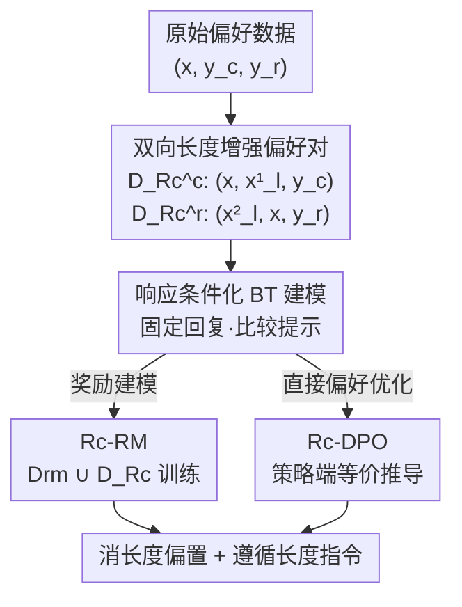

# Disentangling Length Bias in Preference Learning via Response-Conditioned Modeling

**会议**: ICLR2026  
**OpenReview**: [https://openreview.net/forum?id=hKxYESOzen](https://openreview.net/forum?id=hKxYESOzen)  
**代码**: 待确认  
**领域**: 对齐RLHF  
**关键词**: 长度偏置, 偏好学习, 奖励建模, Bradley-Terry, 响应条件化  

## 一句话总结
本文把奖励模型里隐性的「长度偏置」转化为显性的「长度指令理解」，提出响应条件化 Bradley-Terry（Rc-BT）模型——固定同一条回复、比较不同提示词，从而既消除长度作弊又让模型学会遵循长度指令，并可无缝接入奖励建模（Rc-RM）和 DPO（Rc-DPO）。

## 研究背景与动机

**领域现状**：RLHF 用一个可学习的奖励模型当作人类偏好的代理，再用 RL（或 DPO 这类直接偏好优化）去最大化奖励分数来对齐 LLM。标准做法以 Bradley-Terry（BT）模型为核心：给定提示 $x$ 和一对回复 $(y_c, y_r)$，假设存在真实奖励 $r^*$，用 $p^*(y_c \succ y_r) = \frac{\exp(r^*(x,y_c))}{\exp(r^*(x,y_c))+\exp(r^*(x,y_r))}$ 拟合人类标注的偏好。

**现有痛点**：奖励模型极易被「表面混淆因子」攻破，其中**长度偏置**最普遍也最难处理——模型倾向于给更长的回复更高分，而不管语义质量。本文的预备实验把它量化得很扎实：（1）即使把提示换成空提示或随机错配的提示，奖励模型在打分上仍能维持 60% 左右的准确率、且 85% 以上的偏好判断与原数据一致，说明它根本不靠提示、而是靠长度在打分；（2）连评测集 $D_{eval}$ 本身都有偏——59.78% 的 chosen 回复比 rejected 长，于是「只挑更长的」就能蒙到近 60% 准确率，导致评测失真；（3）有长度偏置的模型在显式长度指令上（如「150 词以内」）准确率只有约 50%，跟瞎猜没区别。

**核心矛盾**：以往工作把长度信息一律当作「有害」来抑制——要么在策略优化端加 KL/长度惩罚、reward clipping（对超参和基座模型极敏感、效果有限），要么在奖励建模端强行让质量与长度「正交/线性无关」（双分支过参数化会训练不稳，正则也不保证真独立）。但强行解耦忽略了两件事：长度有时**确实**是质量的一部分（比如长度指令数据集里），而且长度信息或许可以被**利用**来做更好的偏好建模，而非一味丢弃。

**本文目标**：同时解决两个子问题——消除奖励作弊式的长度偏置 + 让模型真正学会遵循显式长度指令，二者不能此消彼长。

**切入角度**：作者的关键观察是，奖励模型在偏好学习中「无意识地」习得了长度偏置，却没把长度当成一个可度量的属性。于是提出假设：**显式地学习长度指令，能让模型对目标长度形成清晰感知，从而把隐性长度偏置转成显性长度理解**。但直接用 $\{x_l, y_c, y_r\}$（把长度约束拼进提示）这种朴素格式训练会过拟合长度指令、反而拖垮语义能力（$D_l^{eval}$ 准确率飙升但 $D_q^{eval}$ 先升后降）。

**核心 idea**：换一个建模视角——不再「给定提示比两条回复」，而是「**给定同一条回复，比较两个提示**」。通过构造长度增强后的提示变体，让模型显式地区分「人类语义意图」和「长度指令要求」，二者各归其位、互不污染。

## 方法详解

### 整体框架

整个方法围绕一句话：**把条件变量从提示翻转到回复**。标准 BT 是「固定提示 $x$、比较回复 $y_c \succ y_r$」；本文的响应条件化 BT（Rc-BT）反过来「固定回复 $y$、比较提示 $x_c \succ x_r$」。具体地，从原始偏好数据 $D_{rm}=\{(x,y_c,y_r)\}$ 出发，给每条回复配一个「带长度约束的提示变体」，构造出两类增强偏好对，再用 BT 形式建模，最后把这套数据 $D_{Rc}$ 和原数据合并，分别灌进奖励模型（Rc-RM）和 DPO（Rc-DPO）两条下游通道。

### 关键设计

**1. 双向长度增强偏好对：让 chosen 端和 rejected 端互补，防止学出新偏置**

朴素的 $\{x_l, y_c, y_r\}$ 格式之所以失败，是因为它把「长度约束」和「语义偏好」捏在同一个比较里，模型只会抄近路去满足长度而牺牲语义。本文把数据拆成两类、各管一头。对 chosen 回复 $y_c$：构造一个长度增强提示 $x_l^1$，**故意让 $y_c$ 违反**这个长度约束，于是偏好对 $(x, x_l^1, y_c)$ 满足 $(x,y_c) \succ (x_l^1,y_c)$——同一条 $y_c$，在原提示下更受偏好、在「它违反约束」的提示下应被降级。对 rejected 回复 $y_r$：构造 $x_l^2$，**让 $y_r$ 恰好满足**约束，于是 $(x_l^2, x, y_r)$ 满足 $(x_l^2,y_r) \succ (x,y_r)$——同一条 $y_r$，在「它满足约束」的提示下反而该被抬升。记 chosen 端 $D_{Rc}^c=\{(x,x_l^1,y_c)\}$、rejected 端 $D_{Rc}^r=\{(x_l^2,x,y_r)\}$，合并为 $D_{Rc}=D_{Rc}^c \cup D_{Rc}^r$。消融（Table 6）证明二者缺一不可：只用一端时质量准确率掉回 Baseline 水平、长度准确率徘徊在 50%，因为单端会让模型发展出新的偏置（比如一律偏好/排斥带长度约束的提示）。

**2. 响应条件化 BT 建模（Rc-BT）：固定回复、比较提示，把长度从隐性偏置变成显性可比量**

这是全文的核心。标准 BT 比较的是「给定提示下两条回复谁好」，长度信息混在 $y$ 里无法被单独度量；Rc-BT 把条件变量翻转过来——固定同一条回复，让模型去比较两个提示。对应上面两类数据，建模为：

$$p^*(x \succ x_l^1 \mid y_c) = \frac{\exp(r^*(x,y_c))}{\exp(r^*(x,y_c))+\exp(r^*(x_l^1,y_c))}, \quad p^*(x_l^2 \succ x \mid y_r) = \frac{\exp(r^*(x_l^2,y_r))}{\exp(r^*(x_l^2,y_r))+\exp(r^*(x,y_r))}$$

最大似然得到 Rc-BT 目标 $L_{Rc} = -\mathbb{E}_{(x,x_l^1,y_c)}[\log p^*(x \succ x_l^1 \mid y_c)] - \mathbb{E}_{(x_l^2,x,y_r)}[\log p^*(x_l^2 \succ x \mid y_r)]$。因为左右两个比较项里**回复完全相同、只有提示在变**，模型唯一能依据的判别信号就是「提示里的长度约束 vs 回复实际长度是否匹配」，于是被迫显式地去感知长度、而不是把长度当成质量的暗号。和 BT 的对照很清楚（Table 3）：BT 的 motivation 是「捕捉回复间偏好」、数据格式 $(x,y_c,y_r)$；Rc-BT 是「捕捉提示间偏好」、数据格式 $(x_c,x_r,y)$。值得注意作者强调 Rc-BT 框架理论上可推广到长度之外的其它指令遵循任务，长度只是一个有代表性的 test bed。

**3. Rc-RM：结构不变、只换数据格式，用 $\lambda$ 平衡两端贡献**

Rc-BT 落到奖励模型时几乎零改动——奖励模型 $r_\phi$ 仍从 $\pi_{SFT}$ 初始化、加一个线性投影层把整句表示映成标量，**网络结构完全不变，变的只是数据格式从提示条件化换成响应条件化**。优化目标对应 Eqn 4 改写成 sigmoid 形式：

$$L_{r_\phi}(D_{Rc}) = -\mathbb{E}_{(x,x_l^1,y_c)}[\log\sigma(r_\phi(x,y_c)-r_\phi(x_l^1,y_c))] - \lambda\,\mathbb{E}_{(x_l^2,x,y_r)}[\log\sigma(r_\phi(x_l^2,y_r)-r_\phi(x,y_r))]$$

其中 $\lambda$ 用来平衡 chosen 端对 $(x,x_l^1,y_c)$ 与 rejected 端对 $(x_l^2,x,y_r)$ 的相对权重。实际训练时把 $D_{Rc}$ 与原始 $D_{rm}$ 合并（$D_{rm} \cup D_{Rc}$），既保留原始语义偏好信号、又叠加显式长度理解，得到 Rc-RM。

**4. Rc-DPO：沿 DPO 的推导路径，把奖励改写成最优策略的函数**

由于 RLHF 里成对偏好建模的普适性，同一套思路可以直接接到 DPO 上而无需在线奖励模型。作者复用 DPO 的标准推导——从带 KL 约束的 RL 目标出发、解出最优策略下奖励的解析表达，再把它代回 Rc-BT 的目标函数 Eqn 4，得到 Rc-DPO 目标：

$$L_{DPO}^{Rc} = -\mathbb{E}_{(x,x_l^1,y_c)}\Big[\log\sigma\big(\beta\log\tfrac{\pi_\theta(x,y_c)}{\pi_{ref}(x,y_c)} - \beta\log\tfrac{\pi_\theta(x_l^1,y_c)}{\pi_{ref}(x_l^1,y_c)}\big)\Big] - \mathbb{E}_{(x_l^2,x,y_r)}\Big[\log\sigma\big(\beta\log\tfrac{\pi_\theta(x_l^2,y_r)}{\pi_{ref}(x_l^2,y_r)} - \beta\log\tfrac{\pi_\theta(x,y_r)}{\pi_{ref}(x,y_r)}\big)\Big]$$

它和原始 DPO 的差别仅在于把「比较两条回复」换成「比较两个提示」，因此可以像 DPO 一样离线、稳定地优化策略，同时获得消长度偏置和遵循长度指令两种能力。（完整推导见原文 Appendix C，块公式以原文为准。）

### 损失函数 / 训练策略
Rc-RM 学习率 $1\times10^{-5}$、cosine 调度、10 步 warmup、batch size 64、5 epoch；Rc-DPO 设置相同但学习率降到 $1\times10^{-6}$。训练数据均为 $D_{rm}\cup D_{Rc}$。评测集构建上，作者用 GPT-4o 把每个三元组 $(x,y_c,y_r)$ 改写出长度方向相反、语义保持一致的两组三元组，得到去偏的质量评测集 $D_q^{eval}$，以避免被原评测集自带的长度偏置误导。基于 DeepSpeed + Transformers，8×A100 训练。

## 实验关键数据

### 主实验

奖励模型质量准确率（$D_q^{eval}$，越高说明越不靠长度作弊、越贴近语义质量）：

| 模型 | Baseline | ODIN | R-DA | Rc-RM |
|------|----------|------|------|-------|
| Qwen2-1.5B-Base | 59.14 | 56.12 | 60.17 | **69.55** |
| Qwen2.5-7B-Instruct | 59.31 | 67.55 | 66.34 | **73.07** |
| Llama-3.1-8B-Instruct | 55.59 | 60.90 | 60.78 | **72.44** |
| Gemma-2-9B-it | 53.45 | 55.85 | 55.21 | **63.56** |
| Qwen2.5-14B-Instruct | 65.57 | 76.22 | 75.14 | **81.70** |

Rc-RM 在所有模型上都超过 Baseline / R-DA / ODIN：Qwen2-1.5B-Base 比 Baseline 高 10.41%、比 ODIN 高 13.43%；Llama-3.1-8B-Instruct 比 Baseline 高 16.85%；扩到 14B 仍达 81.70%，说明方法随模型规模扩展依然稳。

DPO 模型在 AlpacaEval 上的质量胜率（Quality Win Ratio）与平均回复长度：

| 模型 | 指标 | Baseline | SimPO | Dr.DPO | Rc-DPO |
|------|------|----------|-------|--------|--------|
| Qwen2.5-7B-Base | 质量胜率(%) | 33.54 | 41.26 | 39.74 | **45.39** |
| Qwen2.5-7B-Base | 回复长度 | 517.30 | 286.54 | 311.49 | **208.42** |
| Llama-3.1-8B-Instruct | 质量胜率(%) | 42.52 | 58.13 | 52.18 | **64.34** |
| Llama-3.1-8B-Instruct | 回复长度 | 247.74 | 218.46 | 229.17 | **204.77** |

Rc-DPO 同时拿到最高质量胜率和受控的回复长度——Qwen2.5-7B-Base 上质量胜率比 Baseline 高 11.85%、同时把回复从 517 压到 208；Llama-3.1-8B-Instruct 上质量胜率 64.34%，比 SimPO 高 6.21%。LIFT-plus 虽然把长度压得最短，但质量胜率明显下滑，印证「单纯压长度会牺牲语义」。

### 消融实验

| 配置 | 模型 | 质量准确率(%) | 长度准确率(%) |
|------|------|---------------|---------------|
| 完整 Rc-RM | Llama-3.1-8B-Instruct | 72.44（主表） | 高 |
| w/o $D_{Rc}^c$ | Llama-3.1-8B-Instruct | 58.51 | 37.18 |
| w/o $D_{Rc}^r$ | Llama-3.1-8B-Instruct | 52.13 | 33.65 |
| w/o $D_{Rc}^c$ | Qwen2-1.5B-Base | 58.78 | 45.83 |
| w/o $D_{Rc}^r$ | Qwen2-1.5B-Base | 55.59 | 36.22 |

### 关键发现
- **双向偏好对必须同时在**：只保留 chosen 端或 rejected 端任一方，质量准确率立刻掉回 Baseline 水平、长度准确率徘徊 50% 学不到长度指令；进一步分析发现单端训练会让模型对「带长度约束的提示」整体打分偏低或偏高，即发展出新偏置——两端互补才能抵消。
- **去偏评测集很关键**：在自带长度偏置的 $D_{eval}$ 上，Baseline 靠「挑更长的」就能蒙到近 60%；换成 GPT-4o 重构的 $D_q^{eval}$ 后，Baseline 大多跌破 60%，方法间差距才真实显现。
- **质量与长度可兼得**：跨 Reward Score-长度曲线（Figure 3）显示 Rc-RM 的打分随长度变化最平缓（斜率最小），而 Baseline/LIFT-plus 随长度单调上升、ODIN 因惩罚强度而剧烈波动。

## 亮点与洞察
- **「翻转条件变量」是个很轻巧的视角切换**：不改网络、不加分支、不加正则，只把「比较回复」换成「固定回复比较提示」，就让长度从无法度量的暗号变成可显式对比的量。这种「换比较轴」的思路可以迁移到任何「某个表面属性在污染偏好建模」的场景（如格式、礼貌度、bullet point）。
- **把「数据本身有偏」当成一等问题**：作者没有止步于修模型，而是先证明评测集 $D_{eval}$ 自己就偏（59.78% chosen 更长），再用 LLM 重构去偏评测集——这一步让后续所有对比都建立在可信基准上，是很值得借鉴的实验卫生习惯。
- **统一接口**：同一套 Rc-BT 既能做奖励建模又能做 DPO，且都只是「换数据格式 + 改写目标」，几乎零工程成本，复用性强。

## 局限与展望
- **依赖长度约束的可构造性**：方法需要对每条回复构造「违反/满足约束」的提示变体，长度这种可量化属性很好造，但换成礼貌度、风格这类难量化的混淆因子时，如何自动构造高质量的双向偏好对并不显然。
- **去偏评测集依赖 GPT-4o**：$D_q^{eval}$ 由 GPT-4o 改写生成，评测质量受改写模型能力和潜在偏置影响，作者未充分讨论这层风险。
- **$\lambda$ 等超参的敏感性**：chosen/rejected 两端用 $\lambda$ 平衡，文中未给出 $\lambda$ 的系统性敏感度分析，实际部署时的调参成本尚不清楚。
- **泛化到其它偏置仍是承诺**：作者多次强调框架可推广到长度之外的 spurious correlation，但正文实验全部围绕长度，跨偏置的实证仍是 future work。

## 相关工作与启发
- **vs 策略优化端修正（KL 惩罚 / 长度惩罚 / reward clipping）**：他们在 RL 阶段事后压长度，对超参和基座极敏感、效果有限；本文在偏好建模阶段从源头让模型理解长度，更稳更根本。
- **vs ODIN / R-DA（奖励建模端解耦长度）**：他们用双分支过参数化或正则强行让质量与长度「无关/正交」，可能训练不稳且不保证真独立，还把长度一律当有害丢弃；Rc-BT 不丢长度，而是把它显式建模、各归其位，既消偏又保留长度可控性。
- **vs LIFT / LIFT-plus（专门数据集提升长度指令遵循）**：他们用 $\{x_l,y_c,y_r\}$ 格式硬学长度指令，结果过拟合长度、牺牲语义质量；Rc-BT 通过固定回复比较提示，避免了「长度盖过语义」的副作用，质量与长度遵循同时提升。

## 评分
- 新颖性: ⭐⭐⭐⭐⭐ 「翻转条件变量、固定回复比提示」的建模视角简洁而原创，把长度偏置问题重新框定。
- 实验充分度: ⭐⭐⭐⭐ 跨 5 个模型族、RM 与 DPO 双通道、含去偏评测集与互补性消融，扎实；但跨长度之外偏置的验证缺位。
- 写作质量: ⭐⭐⭐⭐ 预备实验层层递进、动机推导清晰，公式与对照表到位。
- 价值: ⭐⭐⭐⭐⭐ 几乎零成本接入 RM/DPO，且框架可推广到更广的 reward hacking 缓解，实用性强。

<!-- RELATED:START -->

## 相关论文

- [\[NeurIPS 2025\] ResponseRank: Data-Efficient Reward Modeling through Preference Strength Learning](../../NeurIPS2025/llm_alignment/responserank_data-efficient_reward_modeling_through_preference_strength_learning.md)
- [\[NeurIPS 2025\] Short-length Adversarial Training Helps LLMs Defend Long-length Jailbreak Attacks](../../NeurIPS2025/llm_alignment/short-length_adversarial_training_helps_llms_defend_long-length_jailbreak_attack.md)
- [\[ICLR 2026\] Aligner, Diagnose Thyself: A Meta-Learning Paradigm for Fusing Intrinsic Feedback in Preference Alignment](aligner_diagnose_thyself_a_meta-learning_paradigm_for_fusing_intrinsic_feedback_.md)
- [\[ICLR 2026\] Stackelberg Learning from Human Feedback: Preference Optimization as a Sequential Game](stackelberg_learning_from_human_feedback_preference_optimization_as_a_sequential.md)
- [\[ICLR 2026\] Beyond Binary Preferences: A Principled Framework for Reward Modeling with Ordinal Feedback](beyond_binary_preferences_a_principled_framework_for_reward_modeling_with_ordina.md)

<!-- RELATED:END -->
