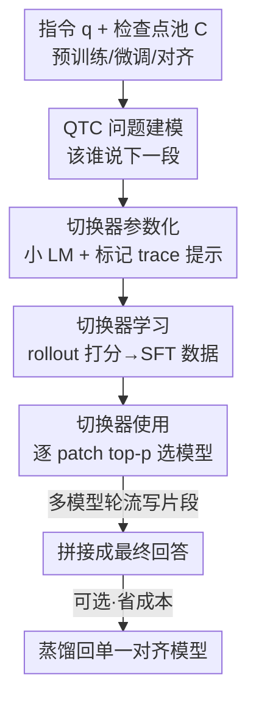

# Don't Throw Away Your Pretrained Model

**会议**: ICLR2026  
**OpenReview**: [https://openreview.net/forum?id=1TTeOEufHz](https://openreview.net/forum?id=1TTeOEufHz)  
**代码**: https://github.com/BunsenFeng/model_collaboration  
**领域**: LLM对齐 / 模型协作 / 推理时融合  
**关键词**: 模型协作, 对齐权衡, 切换生成, 检查点融合, 推理时路由

## 一句话总结
论文提出 SWITCH GENERATION：训练一个小型「切换器」LM，在生成一条回答的过程中按 token 片段动态挑选预训练 / 微调 / 对齐三个检查点轮流「发言」，让对齐丢失的基座能力（创造力、校准、多元性）和对齐获得的能力（推理、指令遵循）互补，在 18 个数据集上比单模型平均提升 31%、比 8 类协作基线再提升 12.9%。

## 研究背景与动机
**领域现状**：对齐（RLHF / RL）已是语言模型训练的标准环节，公认能显著提升推理、指令遵循、安全等能力，于是大家默认「最终对齐版」就是要部署的那一个，训练管线里的预训练版、SFT 版检查点用完即弃。

**现有痛点**：对齐并不是帕累托最优。大量研究发现，对齐在换来推理/指令能力的同时，会牺牲一批基座模型本来更强的技能——创造力、置信度校准、生成多样性、价值多元性（pluralism）、不确定性表达等。也就是说，被丢掉的预训练 / SFT 检查点，在某些技能上其实比对齐版更好。

**核心矛盾**：单一检查点无法同时占住「对齐获得的能力」和「对齐丢失的能力」两头。直接拿基座模型上线又不行——它不会跟随指令、缺少安全护栏。一条回答内部往往交织着多种技能（先回忆知识、再推理、再润色表达），而这些技能分别偏好不同的检查点（图 1 的核心观察）。

**本文目标**：在不重新训练大模型的前提下，把同一训练管线里「预训练 → 微调 → 对齐」这几个本来要扔掉的检查点重新利用起来，让它们在一次生成中协作、互补，各自在最擅长的片段上贡献力量。

**切入角度**：既然「回答不是铁板一块、不同片段偏好不同模型」，那协作的粒度就不该是整条回答（路由）也不该是每个 token（太碎、打断思路），而应该是「片段（patch）级」——在每个片段开始时问一句：现在这一步，谁来写最合适？

**核心 idea**：训练一个小切换器 LM，把「该谁说下一段」建模成一个可学习的决策问题（QTC 问题），推理时让多个检查点在它的指挥下轮流写片段，拼成最终回答。

## 方法详解

### 整体框架
SWITCH GENERATION 是一个推理时的协作生成算法：候选池 $C=\{c_1,\dots,c_n\}$ 是同一训练管线产出的多个检查点（默认是 Tulu-v3 的预训练 / SFT / 对齐三个），一个小切换器 LM $f$ 在每个片段边界决定下一段由谁来写，最终回答就是「不同模型轮流发言」拼起来的序列。

整个方法落在一个核心问题上——作者称之为 QTC 问题（Query-Trace-Candidate）：

$$f(q, t, C) \rightarrow [p_1, \cdots, p_n] \in \mathbb{R}^n$$

其中 $q$ 是用户指令，$t$ 是已经生成的「trace」（到目前为止写了什么），$C$ 是候选检查点池，$p_i$ 是选模型 $c_i$ 写下一段的概率。它和已有路由（RouteLLM 等）的关键区别有三点：trace $t\neq\emptyset$（带上下文决策）、每个被选模型只写一个片段而非整条回答、$f$ 在一次生成里被反复调用多次而非只调一次——这带来更细粒度、更灵活的协作。

方法分两个阶段：**离线学切换器**（通过 rollout 模拟「这一步选谁结果最好」生成 SFT 数据并微调 $f$）和**在线用切换器**（每写一个 patch 调一次 $f$，按 top-p 采样选模型）。最后还可以把协作出来的轨迹蒸馏回单个对齐模型以省推理成本。

### 关键设计

**1. QTC 问题：把「该谁说下一段」形式化为带上下文的片段级决策**

这一设计直接针对「单模型顾此失彼、整条回答粒度太粗」的痛点。作者把协作抽象成 $f(q,t,C)\to[p_1,\dots,p_n]$：给定指令、已写出的 trace 和候选池，输出每个检查点写下一段的可能性。和传统路由相比，它额外吃进了 trace $t$，因此可以「看着前面写到哪了」来判断接下来需要什么技能——比如前半段刚回忆完事实，接下来要做推理推导，就该把发言权交给对齐版。把决策做在片段级、并允许反复决策，让一条回答内部交织的多种技能各自落到最合适的检查点上，这是整套方法的支点。

**2. 切换器参数化：用小语言模型读「带模型标记的 trace」来决定下一位发言者**

切换器 $f$ 本身被参数化成一个小 LM。输入侧，作者用特殊分隔符把 trace 标注成「哪一段是哪个模型写的」：`⟨model i begins⟩…⟨model i ends⟩`，再接一句提示「下一段该由哪个模型生成？请回答 0 到 n-1 的数字。答案是 model ___」。$f$ 在这个位置预测一个模型 ID，取 0~n-1 这些 token 的 logits 作为 $[p_1,\dots,p_n]$。把决策包装成自然语言 + 模型 ID 预测，是为了直接借用语言模型本身的语言理解能力来破解「现在缺什么、谁来补」——它能从「带署名的生成历史」里读出语义脉络，而不是靠一个黑盒分类头。

**3. 切换器学习：用 rollout 模拟「这一步选谁平均结果最好」自动造 SFT 数据**

切换器的训练数据没有人工标注，而是用模拟 rollout 自动生成，针对「到底哪个检查点在某个 (q,t) 上更优」这个没有现成标签的问题。对任意指令 $q$：①先用随机切换 $f_{random}=\text{Uniform}(n)$ 生成一段 trace $t$（长度随机截在回答上限的 10%~90%，覆盖回答不同完成度）；②走一个「分叉步」，让每个候选各写一段：$t_i = t \,\|\, c_i(q,t)$；③对每个 $t_i$ 用随机切换继续采样 $k$ 个续写，算平均效用

$$s_i = \frac{1}{k}\sum_{j=1}^{k}\text{score}(t_i, f_{random}\mid q)$$

其中 score 是与 $q$ 对应的评估指标（准确率 / F1 / 奖励分）。取 $g=\arg\max_i s_i$，则在这个 $(q,t)$ 上模型 $c_g$ 该被选中，于是得到一条 SFT 样本 $(q,t,C)\to c_g$（让 $f$ 在提示「答案是 model」后预测 ID $g$）。在大量 $q$ 上采样这种点，就得到训练 $f$ 的数据集。这种「先模拟未来、再回填最优选择」的造数据方式，让切换器学到的是「选谁能带来更好的最终结果」，而非短视地看当前一步。作者默认每个任务采 10k 条、$k=32$，训练 5 个 epoch，并区分 switch-global（跨所有任务训一个切换器）和 switch-task（每任务一个）。

**4. 切换器使用：逐 patch 调用 + top-p 采样的在线协作生成**

推理时，作者不在每个 token 都换模型（太碎、打断思路、调用太频繁），而是每写一个 patch（固定一组 token，默认 50）调一次切换器，理由是 patch 级扩展性更好、保持思路连续、调用成本低得多。选模型用 top-p（nucleus）采样而非贪心：$\text{top-}p(f(q,t,C))\to c\in C$，在「利用」和「探索」之间取平衡。生成从 $c^{(1)}=\text{top-}p(f(q,\emptyset,C))$ 开始写第一个 patch，第 $i$ 步选 $c^{(i)}=\text{top-}p(f(q,t^{(i-1)},C))$ 并把新 patch 拼回 trace，直到结束或达到最大长度。默认还把首尾两个 patch 固定交给对齐模型（保证开头收尾的指令遵循与安全性），$p=0.7$。

### 一个完整示例
以「市值最大、但不直接向消费者卖东西的公司是哪家」为例（图 2）：切换器先让某个检查点起头给出框架性回答「截至 2025 年 7 月，很可能是 NVIDIA」；写到需要展开「为什么」时，trace 进入分叉点，预训练 / 微调 / 对齐三条候选各写一段续写，rollout 打分后切换器把发言权交给在该片段最擅长的检查点——比如要补「它的核心业务是把 GPU/SoC 卖给企业客户」这种知识性内容时偏向预训练版，要做结构化解释时偏向对齐版。如此一段段轮流，最终拼出一条既准确、又有基座模型知识广度、还保持对齐版表达规范的回答。作者的角色分析（图 6）印证了这一点：预训练模型最常被用于知识回忆，对齐模型最常被用于推理，各司其职。

### 损失函数 / 训练策略
切换器 $f$ 用对齐模型（Llama-3.1-Tulu-3-8B）初始化，在自动构造的 SFT 数据上做标准监督微调（学习率 2e-4、batch size 32、5 epoch）。底层候选模型全部冻结、不参与训练，整套方法只训练这个轻量切换器，因此代价极低、且能即插即用到新的模型套件上。

## 实验关键数据

### 主实验
默认候选为 Tulu-v3 的预训练 / SFT / 对齐三个 8B 模型，对比 11 个基线（含单模型、API 级路由、文本级协作/辩论、logit 级、权重级合并）。18 个数据集按「基座是否有帮助」分三类。

| 方法 | TruthfulQA | GSM8k | BBH | PopQA | AGIEval | 代表性 |
|------|-----------|-------|-----|-------|---------|--------|
| 单·对齐模型 | 29.01 | 56.80 | 35.20 | 31.20 | 11.85 | 强基线 |
| RouteLLM（路由） | 34.38 | 48.10 | 45.90 | 31.30 | 12.32 | 最强协作基线类 |
| Greedy Soup（权重合并） | 33.06 | 58.10 | 36.50 | 31.30 | 11.76 | 权重级最优 |
| **SWITCH-TASK（本文）** | **39.22** | **59.60** | **58.30** | **37.70** | **25.26** | 13 任务最佳 |

- 模型协作（无论基线还是本文）在 **16/18** 个任务上胜过单模型，平均相对提升 **31.0%**——印证「别扔掉预训练模型」。
- SWITCH GENERATION 在 **13/18** 任务上击败所有单模型和协作基线，平均相对提升 **12.9%**；即便在 cat-2/cat-3 这些原本不确定基座是否有用的任务上也平均涨 6.58 分。
- 四类协作基线平均分排序：路由 31.15 > 权重 29.91 > 文本 26.32 > logit 18.97，说明路由类最适合「对齐 × 非对齐」协作，而本文是更细粒度的片段级路由。

### 消融实验

| 配置 | TruthfulQA | GSM8k | BBH | 说明 |
|------|-----------|-------|-----|------|
| SWITCH-TASK（默认 patch=50） | 39.22 | 59.60 | 58.30 | 完整方法 |
| patch size = 100 | 30.31 | 44.70 | 40.40 | 片段太大，协作变粗 |
| patch size = 30 | 35.79 | 52.20 | 53.50 | 不同任务偏好不同粒度 |
| RANDOM SWITCH | 27.07 | 44.70 | 53.10 | 随机切换，明显差 |
| UNTUNED SWITCH | 31.12 | 47.90 | 41.80 | 直接拿对齐模型当切换器不微调 |

### 关键发现
- **切换器微调是关键**：在全部 5 个任务上都稳超随机切换和未微调切换，说明「学到的切换策略」而非「换模型本身」带来增益。
- **片段粒度因任务而异**：Pluralism 等任务更频繁切换（小 patch）反而更好，GSM8k/BBH 偏好默认 50。
- **弱模型不是没用**：P-helpfulness 分析（图 4）显示，预训练模型虽不是单独最强（P-performance < 0），但在协作中几乎总能贡献正收益（P-helpfulness > 0）——「璞玉」论得到量化支持。
- **解决谁都解不出的题**：SWITCH GENERATION 答对了 10.7% 的「所有单模型都答错」的问题，仅丢失 8.2% 单模型本可答对的，净赚 2.5%（表 5），说明它能组合出新技能而非简单取最优。
- **可蒸馏省成本**：把协作轨迹蒸馏回单个对齐模型，能用 1/4 推理成本恢复 57.5% 的协作增益（图 3）。
- **泛化性**：训好的 switch-global 切换器直接迁移到 Qwen 家族 / 增删模型 / 专家模型四种新设置，平均相对提升 5.8%/14.3%/13.1%/3.1%（表 3）；迁移到 6 个未见任务平均提升 3.9%（表 4）。

## 亮点与洞察
- **反直觉但扎实的主张**：「别扔掉你的预训练模型」——把训练管线里被废弃的中间检查点当作可复用资产，这个视角既省钱（不用再训新模型）又能系统性回收对齐损失的能力，立意新颖。
- **片段级路由是甜点**：在「整条回答路由」和「每 token 切换」之间找到 patch 这个甜点，兼顾思路连续性和细粒度协作，是工程上很聪明的折中。
- **rollout 造 SFT 数据**：用「模拟未来 + 取 argmax 效用」自动生成切换标签，绕开了「该谁说下一段」没有 ground truth 的难题，这套造数据范式可迁移到其他「选哪个工具/agent」的决策问题。
- **协作可蒸馏回单模型**：把多模型系统的行为蒸回单模型以换推理效率，对「多 agent 系统怎么落地」是一个有启发的通用思路。
- **角色分析讲清了「为什么有效」**：用 LLM-as-judge 标注每段技能，发现预训练管知识回忆、对齐管推理，让「不同检查点各擅其长」从口号变成证据。

## 局限与展望
- **推理成本高**：在线协作要同时加载并运行 $n+1$ 个模型（默认 3 模型 + 1 切换器），虽然多 GPU 并行可缓解、蒸馏可回收部分增益，但默认形态的部署成本明显高于单模型。
- **依赖同源检查点**：方法默认候选来自同一训练管线（预训练/SFT/对齐），虽然实验证明能泛化到异构/专家模型，但收益（设置 1、4 仅 5.8%/3.1%）明显小于同源场景，对「随便几个模型」的适用性还需更多验证。
- **切换标签依赖可评测的 score**：rollout 打分需要任务有明确评估指标（准确率/F1/奖励），对开放式、难自动评估的生成任务如何造切换数据，论文着墨不多。
- **patch 粒度需调**：最优 patch size 因任务而异，没有自适应机制，实际部署需要针对任务调参。

## 相关工作与启发
- **vs 路由（RouteLLM / RouteLLM 类）**：路由对整条回答只决策一次、选定的模型写全文；本文带 trace、片段级、反复决策，是「更细、更动态」的路由，因此在对齐×非对齐协作上更强。
- **vs 权重合并（Greedy Soup / DARE-TIES）**：权重级合并产出一个静态融合模型，无法按片段动态调度；本文保留各检查点独立、按需调用，能解出合并模型解不出的题。
- **vs logit 级融合（Proxy Tuning / Logit Merge）**：logit 级在每 token 融合分布，本文证明这类方法平均分最低（18.97），而片段级切换更能保持各模型「思路连续性」。
- **vs 对齐权衡研究（West & Potts、Yue et al. 等）**：这些工作指出对齐会牺牲创造力/多样性/推理等基座能力；本文不是去改对齐训练，而是从「推理时协作回收」这条正交路径化解权衡，可与前者互补。

## 评分
- 新颖性: ⭐⭐⭐⭐⭐ 「回收废弃检查点 + 片段级切换生成」视角新颖、立意漂亮
- 实验充分度: ⭐⭐⭐⭐⭐ 18 数据集、11 基线、4 类泛化设置、蒸馏与角色分析齐全
- 写作质量: ⭐⭐⭐⭐ 论证清晰、图示到位，部分分析（造数据细节）略密
- 价值: ⭐⭐⭐⭐ 提供低成本回收对齐损失能力的实用范式，但默认推理成本偏高

<!-- RELATED:START -->

## 相关论文

- [\[NeurIPS 2025\] Ask a Strong LLM Judge when Your Reward Model is Uncertain](../../NeurIPS2025/llm_alignment/ask_a_strong_llm_judge_when_your_reward_model_is_uncertain.md)
- [\[ACL 2025\] Don't Say No: Jailbreaking LLM by Suppressing Refusal](../../ACL2025/llm_alignment/dont_say_no_jailbreaking_llm_by_suppressing_refusal.md)
- [\[ICLR 2026\] Reward Model Routing in Alignment](reward_model_routing_in_alignment.md)
- [\[ICLR 2026\] RewardBench 2: Advancing Reward Model Evaluation](rewardbench_2_advancing_reward_model_evaluation.md)
- [\[ICLR 2026\] Towards Understanding Valuable Preference Data for Large Language Model Alignment](towards_understanding_valuable_preference_data_for_large_language_model_alignmen.md)

<!-- RELATED:END -->
