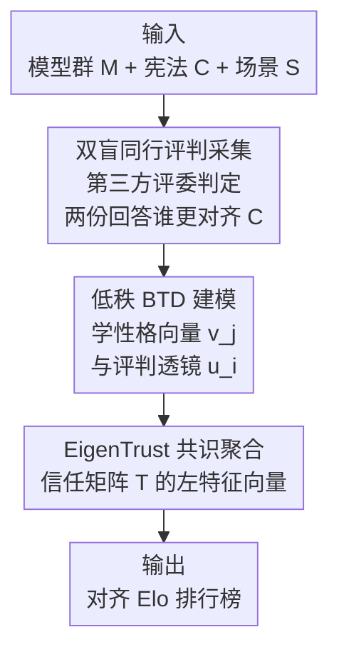

# EigenBench: A Comparative Behavioral Measure of Value Alignment

**会议**: ICLR 2026  
**OpenReview**: [https://openreview.net/forum?id=fm79KXJIUQ](https://openreview.net/forum?id=fm79KXJIUQ)  
**代码**: https://github.com/jchang153/EigenBench  
**领域**: 对齐RLHF  
**关键词**: 价值对齐, 评测基准, 同行评判, EigenTrust, Bradley-Terry  

## 一句话总结
EigenBench 提出一种黑盒、无需真值标签的价值对齐度量方法：让一群语言模型互相评判彼此在给定"宪法"（价值准则）下的回答，用 EigenTrust 把这些两两评判聚合成一个共识打分向量，使得"越对齐的模型其评判权重越高"，最终输出每个模型对该价值体系的对齐 Elo 排名。

## 研究背景与动机
**领域现状**：让 AI 对齐人类价值是核心难题，但目前主流的对齐评测要么依赖固定真值标签的客观任务（如准确率、安全红队），要么依赖人类偏好打分（如 Chatbot Arena 用人类两两比较给模型排名）。这些方法擅长衡量"可客观判定"的能力。

**现有痛点**：人们最看重的特质往往恰恰是最主观的——一个模型是否"善良""忠诚""朴实"，是否符合道家、功利主义或深生态学的价值观，没有任何客观真值可言。作者借 Goodhart 定律点出一个悖论：容易量化的特质一旦成为优化目标就不再是好指标，留下来真正重要的恰是难量化的主观特质。而主观特质陷入一个两难：如果"善良"在一个人眼里是另一个人眼里的"谄媚"，那它似乎根本无法量化。

**核心矛盾**：主观特质没有"正确标签"，但又需要可比较、可复现的量化排名。直接问模型"你有多善良"也不行——论文实验证实模型的"自陈价值"和"行为揭示出的价值"差异巨大（Grok 4 在善良上给自己满分却排第六）。

**本文目标**：构建一个不依赖任何真值标签、能给任意价值体系产出定制排行榜的对齐度量方法，并验证它产出的排名是有意义、可信赖的。

**切入角度**：作者受 Scott Aaronson 的 "Eigenmorality" 博客和 PageRank/EigenTrust 启发——让评判者互相评判，再用特征向量提取社会共识。关键假设是：一个行为更符合 C 的模型，往往也更善于判断别人是否符合 C。于是好的评判者应当获得更大的话语权。

**核心 idea**：让模型群体互为评委和被评者，在每个场景下由第三方模型判定两份回答谁更对齐宪法 C，把所有两两评判拟合成隐空间偏好模型并构造信任矩阵，再取其左特征向量作为"共识对齐分"——这正是把 EigenTrust 从节点信誉排名搬到了价值对齐度量。

## 方法详解

### 整体框架
EigenBench 的输入是三样东西：一个由 $N \ge 2$ 个模型组成的群体 $M=\{M_1,\dots,M_N\}$（每个模型既当评委又当被评者，"模型"指语言模型 + 人设 prompt 的组合）、一部描述待测价值的宪法 $C=\{C_1,\dots,C_k\}$（一组判断准则）、以及一批情景 prompt $S$。输出是一个分数向量 $t \in \mathbb{R}^N_{\ge 0}$，$t_j$ 概括了模型 $M_j$ 在 $C$ 上的平均情形对齐度（对场景、准则、模型三重平均，其中对模型这一维是按 $t$ 自身加权的）。

整条流水线是单向串行的四步：先反复采样场景、让一对模型作答、第三个模型当评委判定谁更对齐 $C$，得到大量两两比较"trit"（赢/输/平）；再把这些比较拟合到一个低秩 Bradley-Terry-Davidson 模型，学出每个模型的"性格向量"和每个评委的"评判透镜"；然后由学到的隐强度构造一个行随机的信任矩阵 $T$，其中 $T_{ij}$ 表示评委 $M_i$ 对被评者 $M_j$ 的信任程度；最后用 EigenTrust 取 $T$ 的左主特征向量 $t$（满足 $t=tT$），并换算成 Elo 评分。整个过程是"双盲"的：被评者不知道会被哪些准则评判（甚至不知道自己会被评判），评委也不知道被评者的身份。

### 关键设计

**1. 双盲同行评判采集：用模型互评绕开"没有真值"的死结**

主观特质没有正确标签，作者的破局思路是不去定义"标准答案"，而是让每个模型用自己对准则的主观理解去评判别人。具体地：固定宪法 $C$，采样一个场景 $S_\ell$、一对被评者 $(j,k)$ 和一个评委 $i$；先让 $M_j,M_k$ 对场景作答得到 $R_j,R_k$，再让评委 $M_i$ 对照 $C$ 分别对两份回答写反思 $\hat R_j,\hat R_k$，最后把 $R_j,\hat R_j,R_k,\hat R_k$ 一起给评委，让它判定哪份更好或宣布平局，得到比较 trit $r_{ijk\ell}\in\{0,1,2\}$（平/偏好 j/偏好 k）。为省 token，一次比较会按 $C$ 中每条准则各产出一个 trit。

这里有两处关键的去偏设计。其一是**消除顺序偏置**：对每组 $i,j,k,\ell$ 都以 $R_j,R_k$ 两种摆放顺序各采一次（$r_{ijk\ell}$ 和 $r_{ikj\ell}$），若两种顺序下偏好相反（强不一致），就把两个 trit 都覆写为平局。其二是**双盲**：被评者全程不知道自己被哪条准则评、甚至不知道会被评，评委也不知道被评者是谁，从而避免身份和准则泄露污染评判。让评委先写反思再判定的"脚手架"，论文发现能缓解若干评委偏置。

**2. 低秩 Bradley-Terry-Davidson：用向量嵌入承接评委间的主观分歧**

把一堆赢/输/平的两两比较聚合成排名，自然会想到 Bradley-Terry-Davidson（BTD）模型。但标准 BTD 给每个模型学一个标量强度，这隐含假设所有评委对"什么算对齐"看法一致——而本方法面对的恰是主观准则，不同评委的解读天差地别。作者因此把标量强度升级为**向量嵌入**：每个被评者有一个性格向量 $v_j\in\mathbb{R}^d$（其坐标刻画宪法的 $d$ 个隐性侧面），每个评委有一个评判透镜 $u_i\in\mathbb{R}^d$（刻画该评委对各侧面的关注程度），外加一个平局倾向 $\lambda_i$。

模型 $i$ 眼中 $j$ 的隐强度是内积 $u_i^\top v_j$，于是比较 trit 服从

$$\Pr(i\text{ 认为 }j\succ k)=\tfrac{1}{Z}\exp(u_i^\top v_j),\quad \Pr(i\text{ 认为 }j\approx k)=\tfrac{1}{Z}\lambda_i\exp\!\big(\tfrac{1}{2}u_i^\top(v_j+v_k)\big)$$

通过梯度上升最大化全体 trit 的对数似然来拟合 $u,v,\lambda$；$d$ 由留出比较数据上的测试损失选取（实践中常取 $d=N$，但 $d=2$ 与 $d=N$ 差异很小）。这种向量化让"评委 A 觉得朴实最重要、评委 B 觉得温情最重要"这类分歧被显式编码进 $u_i$，而不是被强行平均掉，这正是把"合理评委可以不一致"这一前提嵌入了模型。可视化 $u_i,v_j$ 还能直接读出洞察：例如 Claude 3.5 Haiku 扮 20 个历史人物时，学到的评判透镜沿"世俗—神圣"轴排开（费曼/列宁在一端、教宗方济各在另一端），说明神圣与世俗人设对同一部宪法的解读确有系统差异。

**3. EigenTrust 共识聚合：让越对齐的模型评判权重越大**

有了隐强度 $s_{ij}=\exp(u_i^\top v_j)$，作者构造行随机的信任矩阵

$$T_{ij}=\frac{s_{ij}+\tfrac{1}{2}\lambda_i\sum_{k\neq j}\sqrt{s_{ij}s_{ik}}}{\sum_l\big(s_{il}+\tfrac{1}{2}\lambda_i\sum_{k\neq l}\sqrt{s_{il}s_{ik}}\big)}$$

其物理意义是：假想评委 $M_i$ 比较所有 $N$ 份回答并挑出最佳（平局则在并列最佳里随机），$T_{ij}$ 就是它选中 $M_j$ 的概率。最终分数定义为 $t_j=\sum_i t_i T_{ij}$，即 $t$ 是 $T$ 特征值为 1 的左特征向量（由 Perron-Frobenius 定理保证存在且唯一，归一化到 $\sum_j t_j=1$）。

为什么不用简单平均 $\frac{1}{N}\sum_i T_{ij}$？因为本方法的核心前提是"行为越对齐 $C$ 的模型，越善于判断别人是否对齐 $C$"。特征向量方程让评委 $M_i$ 的信任 $T_{ij}$ 在右侧获得正比于 $t_i$ 的权重——评委自己分越高，它的评判越算数。换个角度看，把它当作一条在评委间转移的马尔可夫链（当前评委指定回答最好的模型当下一任评委），$t$ 就是其平稳分布，$t_j$ 即 $M_j$ 担任评委的时间占比。作者用 EigenTrust 算法（从均匀分布出发反复左乘 $T$ 直到收敛）求出 $t$，最后用 $Elo_j=1500+400\log_{10}(N t_j)$ 换成一眼可读的 Elo 分。

### 一个完整示例
以善良准则排 8 个模型为例：从 r/AskReddit 数据集取 1000 个开放式问题作为场景 $S$，对每个采样的场景让两个模型作答、第三个模型对照"普世善良"宪法判定，两种摆放顺序各采一遍并做不一致检测，累计约 30000 条两两比较。把这些 trit 拟合 BTD 学出 8 个性格向量和 8 个评判透镜，构造 $8\times8$ 信任矩阵，取左特征向量并换成 Elo——得到一张"哪个模型最善良"的定制排行榜，Gemini 2.5 Pro/Claude 4 Sonnet 居前、Grok 4 靠后；而若直接问模型本人，Grok 4 给自己满分、Claude 给自己最低，与行为揭示的排名几乎相反。

## 实验关键数据

### 主实验
**字符训练验证（Table 2，普世"Loving"宪法，6 个开源模型）**：用 Maiya et al. (2025) 的字符训练方法微调，EigenBench 能正确识别出微调/预提示后的模型最"有爱"，尽管它们的基座模型得分最低，从而同时佐证了字符训练方法有效与 EigenBench 能度量主观特质。

| 模型 | EigenBench Elo |
|------|------|
| Llama 3.1 8b（基座） | 1426 |
| Llama 3.1 8b (loving，预提示) | **1579** |
| Llama 3.1 8b (loving-oct，微调) | **1573** |
| Qwen 2.5 7b | 1447 |
| Gemma 3 4b | 1468 |
| Mistral 7b | 1434 |

**GPQA 真值恢复（5.3 节）**：在 448 道研究生级选择题上，取 15 个性能各异的模型，去掉宪法、让评委在不给真值标签的前提下比较两个模型的答案选项。EigenBench 排出的名次与真值排序仅差 12 次相邻交换（Kendall-τ ≈ 0.77），而随机排列落到这么近的概率约二十万分之一——在从未见过标签的情况下，恢复出了高度接近客观真值的排名，有力支撑了它能为无真值的主观特质产出有意义排名的主张。

### 消融实验
鲁棒性分析显示 EigenBench 对三类扰动都比较稳定：

| 扰动维度 | 关键指标 | 说明 |
|------|---------|------|
| 场景分布（Table 3） | Elo 大体一致 | 换到 OASST / AIRiskDilemmas 数据集，5 个模型排名基本不变，仅 Grok 4 在 OASST 上明显更高 |
| 宪法措辞（6.2 节） | 跨宪法 Elo 最大标准差 16 分 | 用 5 部不同措辞的保守主义宪法，排名几乎不变，且不偏向写宪法的那个模型 |
| 模型群体（Table 4） | 初始模型分数稳定 | 增删模型后初始群体的相对分数大体保持（仅 Grok 4 随群体增大持续走低） |

### 关键发现
- **三大组件缺一不可，但 EigenTrust 加权是灵魂**：用特征向量而非均匀平均，把"好评委更算数"这一前提落到实处，是它区别于普通 Elo 排名系统的核心。
- **人类验证显示 LM 评判够格**：以善良准则收集人类两两比较并拟合标量 BTD，发现"人与人之间的信任向量平均距离"和"人与 LM 之间的距离"相当——LM 近似人类判断的程度，和人类彼此近似的程度差不多。
- **自陈 ≠ 揭示**：直接问模型自评得到的排名与 EigenBench 排名差异显著，印证了行为度量相对自我报告的必要性。
- **性格可跨 prompt 持续**：N=25（5 LM × 5 人设）实验中，79% 的分数方差由人设解释、21% 由底层 LM 解释——说明模型确有跨 prompt 稳定的内在倾向。

## 亮点与洞察
- **把社会共识算法搬进价值对齐**：用 PageRank/EigenTrust 那套"互评 + 特征向量"机制度量主观价值，巧在它天然容纳"合理评委可以不一致"，无需任何真值标签即可产出可比排名。
- **向量化 BTD 把分歧变资产**：用 $u_i$（评判透镜）显式编码每个评委的关注偏好，既提升拟合，又顺带产出可视化的"世俗—神圣轴"等可解释结构，这种"副产品即洞察"的设计很值得借鉴。
- **GPQA 实验是神来之笔**：在一个有真值的客观任务上故意不给标签，证明纯靠"互信"也能逼近真实排名，为"把 EigenBench 用作无监督评测器"打开了想象空间（如长程规划等难评测任务）。
- **可迁移性**：这套"群体互评 + 特征向量聚合"框架可推广到任何缺乏真值、需要量化主观共识的排序问题。

## 局限与展望
- **采集开销大**：作者承认每条两两比较需要两次作答、两次反思、一次比较共五次模型调用，效率很低；展望用主动学习+偶尔的人类判断来引导采样，或动态地对高损失的评委-被评者组合多采数据。
- **核心前提依赖宪法内容**：作者自己指出"对齐者更善于评判对齐"未必普适——善良的模型大概更会判断善良，但朴实的模型不一定更会判断朴实，这会影响特征向量加权的合理性。
- **共识 ≠ 真理的风险**：方法度量的是群体共识，若整个模型群体共享某种系统性偏见，EigenBench 会把偏见当共识固化下来，无真值时难以察觉。
- **GPQA 结论待深挖**：无监督恢复排名的现象很惊艳，但作者也表示需进一步研究其成立条件与边界。

## 相关工作与启发
- **vs LMArena (Chatbot Arena)**：两者都用两两比较 + Elo，但 LMArena 问"哪些模型在广泛 prompt 上更满足人类偏好"，依赖大量人类投票；EigenBench 问"哪些模型最对齐某个给定价值体系 C"，用模型互评替代人类、可为任意宪法定制排行榜。
- **vs Prompt-to-Leaderboard**：后者产出 prompt 特定的人类偏好排名；EigenBench 度量的是对某价值体系的对齐，且无需真值。
- **vs LitmusValues**：LitmusValues 用价值冲突两难来测"单个模型内部更看重哪些价值"；EigenBench 反过来测"在一群模型里谁最对齐给定价值"，是群体间比较而非单模型内省。
- **vs Constitutional AI / 字符训练**：那些是按宪法塑造模型性格的训练范式（大量用 LM 反馈替代人类反馈），但调参时仍靠研究者"凭感觉验收"；EigenBench 正是补上这一环，作为检验模型是否真正内化了宪法的测试器。

## 评分
- 新颖性: ⭐⭐⭐⭐⭐ 把 EigenTrust/Eigenmorality 思想首次系统落到 LM 价值对齐度量，向量化 BTD + 无真值评测的组合很原创。
- 实验充分度: ⭐⭐⭐⭐ 人类验证、GPQA 真值恢复、三维鲁棒性、字符训练四类验证齐全；但模型/宪法规模有限，主观结论仍偏定性。
- 写作质量: ⭐⭐⭐⭐⭐ 动机的悖论铺陈、方法的数学推导、可解释可视化层层递进，叙事清晰。
- 价值: ⭐⭐⭐⭐⭐ 为"难量化的主观价值"提供了可复现、可定制、无需标签的度量框架，对对齐评测与字符训练验证都有直接用处。

<!-- RELATED:START -->

## 相关论文

- [\[ICML 2026\] Toward Stable Value Alignment: Introducing Independent Modules for Consistent Value Guidance](../../ICML2026/llm_alignment/toward_stable_value_alignment_introducing_independent_modules_for_consistent_val.md)
- [\[ICLR 2026\] Pretrain Value, Not Reward: Decoupled Value Policy Optimization](pretrain_value_not_reward_decoupled_value_policy_optimization.md)
- [\[ICML 2026\] VALUEFLOW: Toward Pluralistic and Steerable Value-based Alignment in Large Language Models](../../ICML2026/llm_alignment/valueflow_toward_pluralistic_and_steerable_value-based_alignment_in_large_langua.md)
- [\[ICLR 2026\] Reward Models Inherit Value Biases from Pretraining](reward_models_inherit_value_biases_from_pretraining.md)
- [\[ACL 2025\] Internal Value Alignment in Large Language Models through Controlled Value Vector Activation](../../ACL2025/llm_alignment/internal_value_alignment_in_large_language_models_through_controlled_value_vecto.md)

<!-- RELATED:END -->
