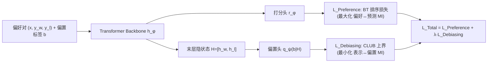

# Eliminating Inductive Bias in Reward Models with Information-Theoretic Guidance

**会议**: ICLR 2026  
**代码**: [https://github.com/Qwen-Applications/DIR](https://github.com/Qwen-Applications/DIR)  
**领域**: llm_alignment  
**关键词**: 奖励模型, RLHF, 归纳偏置, 奖励黑客, 互信息, 信息瓶颈, 去偏  

## 一句话总结
DIR 把奖励模型去偏建模成一个信息论优化问题——最大化「奖励预测↔人类偏好」的互信息、同时最小化「奖励隐表示↔偏置属性」的互信息，用 BA 下界和 CLUB 上界两个变分估计落地，统一处理长度、谄媚、格式等非线性归纳偏置。

## 研究背景与动机

**领域现状**：RLHF 是对齐 LLM 的主流路线，先在人类偏好对上训一个奖励模型（RM），再用 RM 打分驱动 PPO/GRPO 等 RL 训练策略。RM 的质量直接决定对齐的稳定性与上限。

**现有痛点**：人类偏好数据天然低质且充满**归纳偏置**——标注者被要求选「更详尽」的回答，结果更长的回答几乎总被偏好，RM 于是学到「越长越好」这个与内容质量无关的捷径；类似的还有格式（markdown 排版）偏置和谄媚（迎合用户）偏置。RM 一旦被这些虚假相关误导，下游策略就会去 reward hacking，真实能力反而退化。

**核心矛盾**：已有去偏方法都不够通用。基于 Pearson 系数的方法（ALBM、Chen 等）只能刻画**线性**相关，抓不住高阶/非线性偏置；PoE 的双头架构只适用于标量型偏置且缺理论支撑；CRM 用 MMD 强行拉平 chosen/rejected 分布，约束过强会压塌功能不同回答的得分、扭曲奖励地形；InfoRM 用信息瓶颈压缩整个隐表示，但没对偏置属性施加显式约束，无法保证真的去掉了偏置。

**本文目标**：提出一个有理论保证、能统一处理多种复杂非线性偏置、又不扭曲奖励地形的去偏框架。

**核心 idea**：**用互信息（MI）替代 Pearson 系数来度量偏置**——MI 能捕捉任意非线性相关。借鉴信息瓶颈的「压缩-保留」trade-off，把去偏写成一个双 MI 目标：保留偏好信息、压掉偏置信息。

## 方法详解

### 整体框架
RM 由 transformer backbone + 打分头组成。在原有 Bradley-Terry 排序损失之外，DIR（Debiasing via Information optimization for RMs）额外接一个轻量「偏置估计头」$q_\psi(b|H)$ 作用在 backbone 的末层隐状态 $H=[h_\phi(x,y^w), h_\phi(x,y^l)]$ 上。训练时交替更新：先训偏置头把偏置预测准（保证 MI 估计精度），再用它给 RM 算去偏损失，让 RM 的隐表示「藏不住」偏置信息。

### 关键设计

**1. 双互信息去偏目标：把去偏写成信息瓶颈式 trade-off**。DIR 的出发点是把 RM 去偏整体建模成一个互信息优化问题：$\max_\phi I(\mathbb{1}_{y\succ\bar y}; x,y,\bar y) - \lambda \cdot I(\mathbb{1}_{y\succ\bar y}; b)$。前一项（Preference Term）要求奖励预测尽量携带回答内容/偏好的信息，后一项（Debiasing Term）要求奖励预测尽量**不**携带偏置属性 $b$ 的信息，$\lambda$ 平衡二者。相比 Pearson 系数只能抓线性相关，MI 定义为 $I(x;y)=\mathrm{KL}[p(x,y)\|p(x)p(y)]$，天然能刻画任意非线性依赖，这正是 DIR 能统一处理长度、谄媚、格式等多样偏置的根本原因。

**2. 两个变分界把不可计算的 MI 落地**。高维 MI 无法精确计算，DIR 对两项分别用相反方向的变分界。偏好项用 **Barber-Agakov（BA）下界**：$I(\mathbb{1}_{y\succ\bar y}; x,y,\bar y) \ge \mathbb{E}[\log q_\phi(\mathbb{1}_{y\succ\bar y}|x,y,\bar y)] + H[p^*]$，其右端恰好就是标准的 BT 排序损失——这给了一个漂亮的解释：**最小化 BT 损失本身就是在最大化偏好项**，所以 DIR 不改变常规 RM 训练目标，只是给它加了去偏项。去偏项用 **CLUB 上界**：先由数据处理不等式得 $I(\mathbb{1}_{y\succ\bar y}; b)\le I(H;b)\le I_{\mathrm{CLUB}}(H;b)$（因为 $b\to(x,y,\bar y)\to H\to \mathbb{1}_{y\succ\bar y}$ 构成马尔可夫链），再用变分网络 $q_\psi(b|H)$ 在 batch 内估计，最小化它就直接压低偏置与隐表示的相关。最终目标为 $\min_\phi L_{\text{Preference}}(\phi) + \lambda \cdot L_{\text{Debiasing}}(\phi,\psi)$，并按 Algorithm 1 交替更新 $r_\phi$ 与 $q_\psi$（每步先多步训 $q_\psi$ 保证上界估计准确）。

**3. 相对偏置属性（comparative regularizer）：去偏而不扭曲奖励地形**。直接让 $q_\psi$ 从压缩表示里预测「回答有多少 token」这种绝对值很难，且对单个回答的绝对约束容易破坏奖励地形（CRM 的 MMD 就栽在这里）。DIR 改成只看**成对回答之间的相对差异**：例如长度偏置取 $b=\mathbb{1}\{\mathrm{length}(y)>\mathrm{length}(\bar y)\}\in\{0,1\}$，谄媚/格式同理化为类别标签，于是 $q_\psi(b|H)=\mathrm{Softmax}(\mathrm{MLP}(H))$ 只是个轻量两层分类器。与此配套，隐表示也用差值 $\Delta h = h_\phi(x,y^w)-h_\phi(x,y^l)$ 而非拼接，凸显两回答的判别性特征。这样 DIR 约束的是「相对偏置不该决定谁更优」，既能去偏又不会把功能不同回答的得分整体压塌。

## 实验关键数据

在三类偏置（长度、谄媚、格式）下用 Llama3.1-8B-Instruct 作 RM backbone，对比 BT、Skywork、PoE、ALBM、Length-Penalty、InfoRM 等。

### 主实验：长度去偏 RLHF 性能（部分基准，Avg. Acc.）

| 初始策略 | Base | SK | PoE | LP | ALBM | InfoRM | Ours |
|---|---|---|---|---|---|---|---|
| Llama3.1-8B-Instruct | 62.83 | 63.31 | 63.14 | 61.36 | 63.92 | 62.80 | **66.20** (↑3.37) |
| OpenRLHF-Llama3-8B-SFT | 55.68 | 56.94 | 57.85 | 56.54 | 57.72 | 55.34 | **59.25** (↑3.57) |

- RM-Bench 上 DIR 的长度-奖励 Pearson 相关最低（**0.468** vs BT 0.533、Skywork 0.498、ALBM 0.560），打分随长度最平坦。
- ArenaHard 上 DIR 策略胜率最高（vs Llama3.1 基线 **54.3%**，vs GPT4o-0314 41.9%），且回答更短（679 token，低于 ALBM 722、原始基线 754），实现「更高胜率 + 更低冗长」的更优 trade-off。

### DPO 结合实验（ArenaHard，OpenRLHF-Llama-3-8B-SFT）

| 方法 | Win Rate (%) | 平均长度 |
|---|---|---|
| DPO | 38.63 | 436.55 |
| +LC | 40.96 | 407.23 |
| +Ours | **45.27** | **404.61** |

DPO+DIR 在胜率与长度控制上同时超过专门的 Length-Controlled DPO，SFT 模型上 Avg. 提升达 ↑6.84。

### 谄媚去偏（半谄媚污染 HelpSteer3，偏好准确率 All./Nat./Adv.）

不同污染比 $\gamma$/$\alpha$ 下 DIR 在自然、对抗、整体设置中多数取得最高准确率（如 $\gamma$=40%,$\alpha$=30% 时 Adv. 达 **93.9** vs BT 88.9、InfoRM 90.3），即便高污染下仍最稳健。

### 关键发现
- 即使训练集里 chosen 回答平均反而**更短**（622.86 vs 707.24 token），标准 BT 仍学到「越长越好」——说明 BT 目标本身就易捕捉非因果的简单模式，去偏必须显式介入。
- 去长度偏置不仅没损害、反而提升了策略的推理/知识核心能力，跨两个 base 模型一致。
- 消融显示「表示差值 $\Delta h$」优于拼接，$\lambda$ 体现偏好学习与去偏的 trade-off。

## 亮点与洞察
- **理论与实践对得很齐**：BA 下界把去偏框架与标准 BT 损失无缝衔接，CLUB 上界给去偏项提供可优化的目标，整套推导从信息瓶颈出发自洽。
- **"相对偏置"是点睛之笔**：把绝对属性预测换成成对相对标签，既绕开了高维回归的难度，又从根上避免了 MMD 那类约束扭曲奖励地形的副作用。
- **通用性强**：同一框架不改结构就能覆盖长度、谄媚、格式三类性质迥异的偏置，且能即插即用地接到 PPO 和 DPO 上。

## 局限与展望
- 偏置属性 $b$ 仍需**预先定义并能标注**（长度/谄媚前缀/格式标签），对未知或难以显式刻画的偏置尚无自动发现机制。
- 谄媚实验依赖人工注入前缀的合成污染数据，真实场景的谄媚更隐蔽，泛化性有待验证。
- 多偏置并发（concurrent multi-bias）只做了初步探索；交替训练偏置头带来额外开销，虽论文称可控但仍是系统复杂度。

## 相关工作与启发
- **vs InfoRM**：同样走信息论，但 InfoRM 只压缩整体隐表示、无显式偏置约束，无法保证去偏；DIR 用 CLUB 直接最小化「表示↔偏置」MI，目标更精准。
- **vs Pearson 系方法（ALBM/Chen/Zhang）**：从线性相关升级到任意非线性 MI。
- **vs PoE / CRM**：PoE 仅限标量偏置且启发式；CRM 用 MMD 易过约束。DIR 的相对偏置正面回应了这些局限。
- 启发：MI 上界（CLUB）作为「信息泄漏惩罚」可推广到更广义的 spurious feature 去除（公平性、去捷径学习），而「用变分下界把训练损失重解释成 MI 最大化」也是一个值得复用的分析视角。

## 评分
- 新颖性: ⭐⭐⭐⭐ 把 BA/CLUB 双变分界统一进 RM 去偏并用相对偏置规避地形扭曲，组合新颖、动机清晰，虽各组件均来自已有信息论工具。
- 实验充分度: ⭐⭐⭐⭐ 覆盖三类偏置 + PPO/DPO 两条对齐路线 + 多 backbone + RM-Bench/ArenaHard 等多基准，对比扎实；多偏置并发与真实谄媚仍偏初步。
- 写作质量: ⭐⭐⭐⭐ 推导严谨、图表清晰，BA↔BT 的衔接解释尤其漂亮。
- 价值: ⭐⭐⭐⭐ 给 RLHF 去偏提供了通用且有理论保证的框架，代码开源，实用性强。

<!-- RELATED:START -->

## 相关论文

- [\[ICML 2026\] When Distance Distracts: Representation Distance Bias in BT-Loss for Reward Models](../../ICML2026/llm_alignment/when_distance_distracts_representation_distance_bias_in_bt-loss_for_reward_model.md)
- [\[ICLR 2026\] Robust Reward Modeling via Causal Rubrics](robust_reward_modeling_via_causal_rubrics.md)
- [\[ICLR 2026\] Learning to Summarize User Information for Personalized RLHF（PLUS）](learning_to_summarize_user_information_for_personalized_reinforcement_learning_f.md)
- [\[ACL 2025\] Cheems: A Practical Guidance for Building and Evaluating Chinese Reward Models from Scratch](../../ACL2025/llm_alignment/cheems_chinese_reward_models.md)
- [\[ICLR 2026\] Reward Models Inherit Value Biases from Pretraining](reward_models_inherit_value_biases_from_pretraining.md)

<!-- RELATED:END -->
