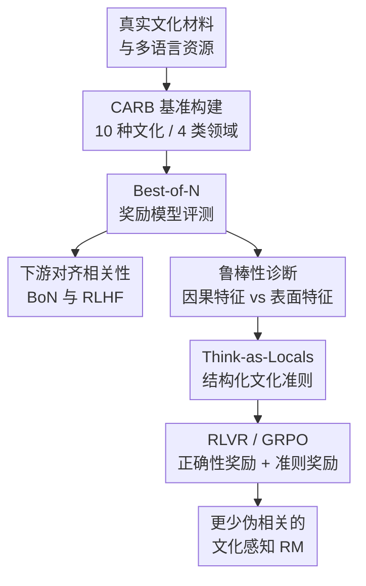

# Evaluating and Improving Cultural Awareness of Reward Models for LLM Alignment

**会议**: ICLR 2026  
**OpenReview**: [https://openreview.net/forum?id=WhSzqsMhfZ](https://openreview.net/forum?id=WhSzqsMhfZ)  
**代码**: 待确认  
**领域**: LLM 对齐 / 奖励模型 / 文化感知  
**关键词**: 奖励模型, 文化感知, 多语言对齐, RLHF, 可验证奖励  

## 一句话总结
本文提出 CARB 文化感知奖励模型基准，系统评估奖励模型在 10 种文化和 4 类文化领域中的偏好判断能力，并进一步用 Think-as-Locals 让生成式奖励模型先生成本地文化评价准则、再通过 RLVR/GRPO 优化判断，从而减少表面语言线索带来的伪相关。

## 研究背景与动机
**领域现状**：LLM 对齐通常依赖奖励模型（Reward Model, RM）把人类偏好转成训练或选择信号：训练时可用于 RLHF，推理时可用于 Best-of-N 采样选择更好的回答。随着 LLM 被部署到多语言、多地区场景，奖励模型不再只需要判断“有帮助/无害/流畅”，还需要理解不同文化背景下什么回答才算合适。

**现有痛点**：主流奖励模型基准大多评估通用能力，例如一般偏好、指令遵循、事实性或安全性。即便有 M-RewardBench 这类多语言奖励模型评测，它更多是把通用任务翻译到多语言环境中，并不能检验模型是否真正懂文化语境。一个奖励模型可能在英文安全问答上表现很好，却在“某个节日是否属于某文化”“某句谚语在本地语境下是否得体”“某种价值判断是否符合当地公共意见”这类问题上犯错。

**核心矛盾**：奖励模型在全球化对齐中扮演代理人，但现有评测并没有检查这个代理人是否懂本地文化偏好。如果 RM 只会捕捉语言、显式国家标签、回答长度等表面模式，它在 RLHF 中可能把策略模型推向看似本地化、实际文化理解很浅的方向，甚至诱发 reward hacking。

**本文目标**：作者把问题拆成三步：先构建一个能评估文化感知 RM 的基准 CARB；再验证 CARB 分数是否真的能预测下游多语言文化对齐效果；最后诊断 RM 的打分是否来自真实文化概念，若不是，则提出新的训练方法提升生成式 RM 的文化推理能力。

**切入角度**：论文没有直接训练一个面向最终用户的聊天模型，而是回到 RLHF 链条中的奖励模型。这个角度很关键：如果能提前知道哪个 RM 更会判断文化偏好，就能少做昂贵的全量下游对齐实验；如果能让 RM 的判断过程显式生成文化评价准则，也更容易约束它不要走“看到中文/看到国家名就加分”的捷径。

**核心 idea**：用 CARB 把“文化感知奖励建模”变成可测量问题，再用 Think-as-Locals 让生成式 RM 先像本地人一样提出文化评价标准，然后用可验证奖励强化这种结构化推理。

## 方法详解

### 整体框架
本文的方法可以看成“评测基准 + 诊断分析 + 定向改进”三段。第一段构建 CARB：从真实文化资料和多语言安全/语言资源中整理 prompt，生成 chosen/rejected responses，并组织成 Best-of-N 偏好选择任务。第二段用 CARB 检查不同 RM 是否能区分文化上合适的回答，并把 CARB 分数同 BoN 与 RLHF 下游效果做相关性验证。第三段提出 Think-as-Locals，用 RLVR 训练生成式 RM 先输出结构化文化评价准则，再给出偏好判断。

CARB 的基本样本是一个 prompt 加一个文化上正确的 chosen answer，以及多个 rejected answers。评测时 RM 需要从 4 个候选回答中选出唯一 chosen response，因此随机基线是 25%。最终指标是跨文化、跨领域的加权平均准确率，这让模型必须在不同语言、文字系统和文化主题上都稳定工作，而不是靠单一语言或单一安全任务刷分。

### 关键设计
**1. CARB：把文化感知奖励建模做成 Best-of-N 偏好选择**

CARB 覆盖 Arabic、Chinese、English、German、Japanese、Korean、Russian、Spanish、Thai、Vietnamese 这 10 种文化，并按 cultural commonsense knowledge、values、safety、linguistics 四个领域组织。这个设计不是简单把英文偏好题翻译成多语言题，而是尽量从 Cultural Atlas、MANGO、World Values Survey、多语言 toxicity 数据集、习语/语言学习资料等来源抽取真实文化材料。这样生成的问题本身就带有文化语境，例如节日、价值观、禁忌、成语含义，而不是普通通用问答的翻译版。

数据构建时，作者用强模型配合对应文化 reference 生成 chosen completions，并用 24 个不同能力的开闭源 LLM 在故意错配的文化 reference 下生成 rejected completions。为了避免 rejected 太弱或 chosen 不够可靠，论文还用 embedding 相似度过滤和重生成机制控制质量，最终得到 8,576 个高质量 prompts/BoN sets。对 RM 来说，这种设置比二选一更硬：模型必须让 chosen score 高于多个 rejected scores，才算真正识别了文化上合适的回答。

**2. CARB 有效性验证：不仅看 RM 排名，还看它能否预测下游对齐**

一个奖励模型基准如果只在自身测试集上排名好，并不一定有用；本文额外检查 CARB 分数是否能预测下游多语言文化对齐。作者在两个典型使用场景中验证这一点：推理阶段用 RM 对 16 个候选回答做 Best-of-N 选择；训练阶段用 GRPO/RLHF 根据不同 RM 优化同一个 policy model。下游评测使用 include-44-base、BLEnD 和 OMGEval 等文化相关多语言任务。

这个设计抓住了 RM 的真实用途：RM 不是最终产品，而是选择或训练 policy model 的信号。如果 CARB 排名能和下游 policy 表现保持正相关，就说明它确实测到了“适合拿来做文化对齐奖励”的能力。实验中 CARB 与下游评分的线性关系很强，BLEnD 和 OMGEval 上的 $r^2$ 分别达到 0.649 和 0.680，且 $p < 0.001$；相比之下 M-RewardBench 的 $r^2$ 低于 0.1，统计上不显著。这说明文化感知不是通用多语言奖励能力的副产品，必须单独评测。

**3. 伪相关诊断：区分模型是真的懂文化，还是只在看表面线索**

论文进一步问：RM 给分高，是因为它识别了文化概念，还是因为看到了语言、国家名、显式文化标签这类捷径？作者构造了四种扰动：CC 改变核心文化概念但保留显式文化标签；RC 移除显式文化标签；CL 改变回答语言；RP 改写句子表达。理想 RM 应该对 CC 很敏感，因为文化事实变了；对 RC、CL、RP 相对不敏感，因为这些主要是表面变化。

这个诊断把“文化意识”从一个模糊形容词拆成了可测的鲁棒性问题。结果显示，CARB 排名靠前的模型更接近人类判断：对因果文化特征变化反应大，对表面扰动反应小。弱模型则相反，容易被删除文化标签或改变语言显著影响分数。论文还评估跨语言一致性，用 $e^{-k|\Delta|}$ 把不同语言响应的打分差异映射成一致性分数；分数越高，说明同义回答换语言后 RM 越不偏。结果显示所有 RM 都还有语言不平衡问题，只是强 RM 稍好。

**4. Think-as-Locals：用结构化文化准则和可验证奖励训练生成式 RM**

Think-as-Locals 针对伪相关问题的核心做法，是要求生成式 RM 不要直接输出“哪个回答更好”，而是先生成一段包含文化评价准则的推理序列 $z$，再输出最终判断 $\hat{j}$。形式上，给定 prompt $q$、两个回答 $y_1,y_2$ 和真实偏好 $j$，模型生成 $r_\theta(z|q,y_1,y_2)$，其中 $z$ 同时包含中间文化准则和最终判断。这样训练目标就从“猜对标签”变成“用文化上可解释的准则支持正确标签”。

奖励设计分为两部分。正确性奖励 $R_{corr.}$ 很直接：若 $\hat{j}=j$ 给 $+1$，否则给 $-1$。准则适当性奖励 $R_{appr.}$ 更有意思：它衡量生成的文化准则 $z$ 对正确判断 $j$ 的“净概率提升”。直觉是，如果先读这段准则后，模型更容易生成正确判断，那么准则对判断有帮助；如果准则和正确判断无关甚至误导，就不应该被奖励。论文用“带准则时生成正确判断的 log probability”减去“不带中间推理时生成正确判断的 log probability”来近似这个贡献。

### 损失函数 / 训练策略
训练采用 GRPO，把生成式 RM 当作 policy。对每个查询采样一组输出 $G=\{z^{(i)},\hat{j}^{(i)}\}_{i=1}^{|G|}$，根据总奖励 $R(z^{(i)},j)$ 计算组内归一化 advantage：$A_i=(R(z^{(i)},j)-\mu_G)/(\sigma_G+\eta)$。优化目标包含 clipped policy ratio 和 KL 惩罚，避免模型为了拿奖励偏离参考模型太远：

$$
J_{GRPO}(\theta)=\mathbb{E}\left[\frac{1}{|G|}\sum_i \left(\min(r_i A_i, \mathrm{clip}(r_i,1-\epsilon,1+\epsilon)A_i)-\beta D_{KL}(r_\theta\|r_{ref})\right)\right]
$$

其中 $r_i$ 表示新旧策略对生成序列的概率比。训练数据来自 HelpSteer3、CARE 和作者自建数据；评测时重点看 Arabic、Chinese、Japanese 子集上的 M-RewardBench 与 CARB。这个训练策略的意义在于：正确标签保证 RM 不跑偏，结构化准则奖励则让它把判断建立在文化推理而非表面 token 线索上。

## 实验关键数据

### 主实验
CARB 排行榜显示，生成式 RM 在文化感知奖励建模中明显占优。Qwen3-235B-A22B-Instruct-2507 平均分最高，GPT-4.1 和 DeepSeek-R1 紧随其后；最强 classifier-based RM Skywork-Reward-Gemma-2-27B 排在第五。论文解释为生成式模型拥有更强世界知识和推理能力，能处理文化 commonsense、linguistics 这类需要语境理解的任务。

| 模型 | 类型 | CARB 平均分 | 代表性观察 |
|------|------|-------------|------------|
| Qwen3-235B-A22B-Instruct-2507 | 生成式 RM | 76.5 | 整体第一，跨文化表现最稳 |
| gpt-4.1-2025-04-14 | 生成式 RM | 75.9 | 多文化平均第二，德语等高资源文化很强 |
| DeepSeek-R1-0528 | 生成式 RM | 74.7 | reasoning 能力带来较好文化判断 |
| DeepSeek-V3-0324 | 生成式 RM | 74.5 | 稳定领先多数 classifier RM |
| Skywork-Reward-Gemma-2-27B | 分类式 RM | 73.0 | 最强分类式 RM，但跨文化鲁棒性不足 |
| INF-ORM-Llama3.1-70B | 分类式 RM | 71.0 | 英语表现较好，整体弱于强生成式 RM |

CARB 与下游对齐的相关性是本文最有说服力的实验之一。作者把不同 RM 的 CARB 分数与由这些 RM 优化后的 policy model 表现对齐，发现 CARB 能显著预测文化对齐结果，而 M-RewardBench 基本不能。

| 基准 | 下游任务 | 相关性结果 | 结论 |
|------|----------|------------|------|
| CARB | BLEnD | $r^2=0.649$, $p=9.43\times10^{-5}$ | 与下游文化评分强相关 |
| CARB | OMGEval | $r^2=0.680$, $p=4.60\times10^{-5}$ | 能预测不同 RM 优化后的表现 |
| M-RewardBench | BLEnD | $r^2=0.039$, $p=0.445$ | 相关性弱且不显著 |
| M-RewardBench | OMGEval | $r^2=0.022$, $p=0.569$ | 不能反映文化对齐趋势 |

### 消融实验
Think-as-Locals 在主比较中显著提升了基座模型的文化奖励能力，尤其是 Qwen2.5 系列。完整方法不仅在 CARB 上提升大，也保持了 M-RewardBench 上的通用奖励建模能力。

| 配置 | M-RB | CARB | 平均 | 说明 |
|------|------|------|------|------|
| Qwen2.5-7B-Inst | 77.1 | 62.6 | 69.9 | 7B 生成式基座 |
| Ours (Qwen2.5-7B-Inst) | 80.4 | 78.8 | 79.6 | CARB 提升 16.2 分 |
| Qwen2.5-14B-Inst | 80.4 | 63.6 | 72.0 | 14B 生成式基座 |
| Ours (Qwen2.5-14B-Inst) | 84.0 | 82.1 | 83.1 | CARB 提升 18.5 分 |
| Qwen2.5-32B-Inst | 86.0 | 71.4 | 78.7 | 32B 生成式基座 |
| Ours (Qwen2.5-32B-Inst) | 89.5 | 84.3 | 86.9 | 表中整体最强平均分 |
| RM-R1-Qwen-Inst-7B† | 79.2 | 75.5 | 77.4 | 可比训练设置下仍低于 Ours 7B |

奖励函数消融说明两个 reward 都必要。去掉 correctness reward 后准确率下降最大，说明最终偏好判断不能只靠“写出漂亮文化解释”；去掉 criteria reward 后响应 entropy 更高，结构化准则生成不稳定。论文还比较了伪相关扰动：基础模型对改变回答语言 CL 的相对变化达到 39.1%，Think-as-Locals w/ criteria 降到 10.9%；对因果文化特征 CC 的变化则从 12.7% 升到 30.8%，说明模型更关注真正文化概念。

| 配置 | 因果特征 CC 变化 | 移除文化标签 RC | 改变语言 CL | 改写表达 RP | 解释 |
|------|------------------|-----------------|-------------|-------------|------|
| Base | 12.7% | 3.9% | 39.1% | 6.5% | 对语言变化过敏，文化概念不够敏感 |
| Think-as-Locals w/o criteria | 16.6% | 3.6% | 33.8% | 6.9% | 正确性训练有帮助，但表面线索仍强 |
| Think-as-Locals w/ criteria | 30.8% | 1.8% | 10.9% | 5.9% | 因果文化特征成为主要打分依据 |

### 关键发现
- CARB 不是普通多语言 RM 基准的替代名称，而是专门评估文化感知能力；它与下游文化对齐表现显著相关，说明评测目标和实际 RLHF/BoN 用途对上了。
- 生成式 RM 普遍优于分类式 RM，尤其在 commonsense knowledge 和 linguistic 领域更明显；分类式 RM 在高资源语言中可表现不错，但跨文化一致性弱。
- Safety 是所有 RM 相对最容易的领域，Value 最难，因为价值判断更主观、更依赖具体文化背景。
- 现有 RM 容易出现伪相关：弱模型会被语言、显式文化标签、句式改写干扰，不能稳定围绕核心文化概念打分。
- Think-as-Locals 的收益来自“先生成准则再判断”这一结构，而不只是多训了一轮 RL；criteria reward 能让推理内容对正确判断产生可测贡献。

## 亮点与洞察
- CARB 的评测对象选得很准：它不是直接问 LLM 是否懂文化，而是问“奖励模型能不能判断哪个回答更符合文化”。这更贴近 RLHF 链条，也让 benchmark 的实际价值更强。
- Best-of-N 格式比普通 pairwise 更能暴露问题。只要一个 rejected 恰好语言很像、带有显式文化标签，弱 RM 就可能被吸引；这类困难样本更适合检查奖励模型是否真的懂文化。
- 伪相关分析很有启发。很多“文化对齐”失败并不是模型完全没有知识，而是评分函数把错误特征当成捷径；把 CC/RC/CL/RP 拆开后，问题立刻变得可诊断。
- Think-as-Locals 的准则奖励可以迁移到其他 reward modeling 场景。例如医学对齐可以要求模型先生成临床评价准则，法律场景可以先生成管辖区相关标准，再奖励这些准则是否提升正确判断概率。
- 论文提醒我们：多语言并不等于多文化。把英文基准翻译成十种语言，只能测试语言迁移；要测试文化感知，prompt、reference、错误候选都必须来自文化语境本身。

## 局限与展望
- CARB 覆盖 10 种文化和 4 个领域，但世界文化远不止这些；一些低资源语言、少数族群文化、跨文化混合身份仍可能缺席。未来可以做动态扩展，让本地社区持续贡献新样本。
- 数据构建仍依赖 GPT-4o 和强 LLM 生成/标注，虽然作者做了 native annotator agreement 与 GPT-human IAA 验证，但自动标注偏差不可能完全消除。尤其是价值观问题，单一“正确答案”可能简化了文化内部差异。
- Think-as-Locals 主要改进生成式 RM，对 classifier-based RM 的适配不直接。实际工业系统中标量 RM 仍大量使用，如何把结构化文化准则蒸馏进标量模型值得继续研究。
- 准则奖励基于模型自身概率提升来衡量推理质量，可能仍会受到模型先验影响。如果模型本身对某文化知识薄弱，它可能给错误但自洽的准则较高概率。
- 下游 DPO/RLHF 实验规模已有说服力，但仍主要在公开文化 benchmark 上验证；真实用户交互中的文化适切性、冒犯风险和地区差异更复杂，需要部署侧长期评估。

## 相关工作与启发
- **vs RewardBench / RewardBench2**: 这些基准评估通用 reward modeling 能力，适合看 RM 是否能判断一般偏好；CARB 则专门看多文化语境中的偏好判断，并验证其与文化对齐下游任务相关。
- **vs M-RewardBench**: M-RewardBench 解决了多语言覆盖问题，但本质仍偏通用任务翻译；CARB 的 prompt、chosen、rejected 都围绕文化内容构建，因此更能测出文化理解而不是翻译鲁棒性。
- **vs CARE / 文化对齐数据集**: CARE 等工作更关注最终 LLM 的文化偏好学习；本文把焦点前移到 RM，试图找到更便宜、更可诊断的对齐代理。
- **vs RM-R1 / reasoning reward models**: 现有 reasoning RM 多从数学或代码推理中获得能力，未必擅长文化判断；Think-as-Locals 把 reasoning 显式约束为文化评价准则，并用准则对正确判断的贡献来奖励。
- **启发**: 未来做 alignment benchmark 时，可以把“评测分数是否预测下游优化效果”作为基本验证项。一个 benchmark 只有能指导选择 RM、训练策略或数据配方，才真正服务对齐工程。

## 评分
- 新颖性: ⭐⭐⭐⭐ 文化感知 RM benchmark 加伪相关诊断很有针对性，Think-as-Locals 的准则奖励也有新意。
- 实验充分度: ⭐⭐⭐⭐⭐ 覆盖 RM leaderboard、下游相关性、扰动鲁棒性、RLVR 改进、DPO 下游验证和奖励消融，链条完整。
- 写作质量: ⭐⭐⭐⭐ 主线清楚，RQ1-RQ4 层层推进；少数公式排版和符号细节略拥挤，但不影响理解。
- 价值: ⭐⭐⭐⭐⭐ 对全球化 LLM alignment 很实用，尤其适合指导多文化场景下 RM 选择和 reward modeling 训练。

<!-- RELATED:START -->

## 相关论文

- [\[ICML 2026\] Steerable Cultural Preference Optimization of Reward Models](../../ICML2026/llm_alignment/steerable_cultural_preference_optimization_of_reward_models.md)
- [\[ICML 2026\] Korean Culture into LLM Alignment: Toward Cultural Coherence](../../ICML2026/llm_alignment/korean_culture_into_llm_alignment_toward_cultural_coherence.md)
- [\[ICLR 2026\] Eliminating Inductive Bias in Reward Models with Information-Theoretic Guidance](eliminating_inductive_bias_in_reward_models_with_information-theoretic_guidance.md)
- [\[ICLR 2026\] Omni-Reward: Towards Generalist Omni-Modal Reward Modeling with Free-Form Preferences](omni-reward_towards_generalist_omni-modal_reward_modeling_with_free-form_prefere.md)
- [\[ACL 2025\] Cheems: A Practical Guidance for Building and Evaluating Chinese Reward Models from Scratch](../../ACL2025/llm_alignment/cheems_chinese_reward_models.md)

<!-- RELATED:END -->
