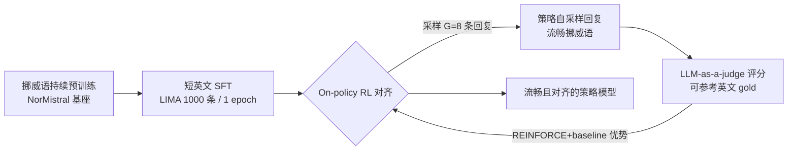

# Fluent Alignment with Disfluent Judges: Post-training for Lower-Resource Languages

**会议**: ICLR 2026  
**OpenReview**: [https://openreview.net/forum?id=htOZXpUPFZ](https://openreview.net/forum?id=htOZXpUPFZ)  
**代码 / 数据**: [normistral-fluency-annotation 数据集](https://hf.co/datasets/ltg/normistral-fluency-annotation)  
**领域**: LLM 对齐 / 低资源语言后训练  
**关键词**: 偏好对齐, On-policy RL, RLAIF, 低资源语言, 流畅度, LLM-as-a-judge, 挪威语  

## 一句话总结
本文提出一套面向低资源语言的后训练方法：完全不使用目标语言的指令数据，只靠 on-policy 强化学习从模型自身采样的回复中学习，从而即便用一个本身"说话不流畅"的裁判模型也能训出语言地道的对齐模型——核心是"训练阶段绝不让模型见到任何翻译腔文本"。

## 研究背景与动机
**领域现状**：偏好优化（RLHF / DPO 等）已是现代 LLM 的标配，但绝大多数研究集中在英语和中文这类高资源语言，它们既有海量母语者书写的指令数据，又有能生成流畅合成数据的强指令模型。

**现有痛点**：低资源语言（如约 500 万使用者的挪威语 Bokmål）两头都缺——既没有母语者写的指令数据集，也没有能产出流畅合成数据的指令模型。主流做法是把英文指令数据**机器翻译**到目标语言再做 SFT。问题在于翻译会引入"翻译腔"（translationese）：语法虽对但读起来不自然，机器翻译模型受其影响尤甚，且有并行工作证明**哪怕短暂接触翻译数据也会让模型流畅度快速崩坏**。

**核心矛盾**：要让模型在目标语言里"说人话"，就不能拿翻译数据去训它；可低资源语言又恰恰只有翻译数据可用。流畅度和可获得数据之间存在根本冲突。

**本文目标**：在**完全没有目标语言指令数据**的前提下，训出一个既流畅又对齐（有用、真实、安全）的模型。

**核心 idea（关键洞察）**：**在 on-policy 强化学习里，模型只从自己采样的回复中学习，因此可以彻底避开翻译文本**。预训练已让模型学会在目标语言里流畅生成，只要对齐阶段不把它推出"流畅子空间"，流畅度就能保住。更进一步，**裁判（reward 来源）自己不需要流畅**——它只要"看得懂"目标语言、能判断回复质量好坏即可，一个 disfluent 的裁判照样能引导出 fluent 的策略。

## 方法详解

### 整体框架
方法是一条三阶段流水线，贯穿始终的原则是"**绝不在任何不自然文本上训练模型**"：① 在目标语言上持续预训练（直接复用已有的挪威语基座，本文不展开）；② 在一个小而精的**英文**数据（LIMA 的 1000 条对话，仅 1 个 epoch）上做短 SFT，教会模型对话格式、又短到不至于灾难性遗忘目标语言；③ 在目标语言上做 **on-policy 强化学习**，奖励信号来自一个 LLM-as-a-judge（无需单独训练 reward model），裁判可访问 No Robots 数据集里的英文 gold 回复作为评分参照。整个对齐阶段模型只见到自己采样的挪威语回复，从不接触翻译回复。

### 关键设计

**1. 三阶段后训练：用"短英文 SFT + on-policy RL"替代"翻译 SFT"。** 传统路线是把英文指令数据翻译到目标语言后直接 SFT，模型被迫去最小化翻译回复的负对数似然，于是把翻译腔学了进去。本文把唯一的监督学习放在**英文**上，且只用 1000 条 LIMA、训 1 个 epoch——既教会模型聊天格式，又短到不会冲掉预训练习得的目标语言能力；真正的对齐留给第三阶段的 on-policy RL。由于 RL 阶段只在模型自采样的回复上更新，模型永远不会被推离它在预训练中学到的流畅输出子空间。这正是"流畅度得以保持"的机制根因。

**2. 简化的 REINFORCE 式目标：直接 d-RLAIF，免训 reward model。** 目标是最大化策略 $\pi_\theta$ 采样回复获得的奖励 $J(\theta)=\mathbb{E}_{x\sim D,\,y\sim\pi_\theta(\cdot|x)}\,r(x,y)$，用策略梯度优化。为了稳定收敛，作者不另训 critic，而是对每个 prompt 采样 $G=8$ 条回复，用组内样本均值和标准差直接估计优势：$\hat{A}(x,y)=\frac{r(x,y)-\mathrm{mean}\{r(x,y^{(i)})\}}{\mathrm{std}\{r(x,y^{(i)})\}}$。奖励直接来自 LLM-as-a-judge（d-RLAIF），只需写一份"宪法"式的打分模板引导多语裁判评估回复质量，无需任何目标语言的偏好数据集，也无需 Bradley-Terry reward model。损失里还按整批回复总长度归一化以消除长度偏置，并刻意**不用 PPO 的裁剪/重要性采样**——因为同步并行让样本几乎全程 on-policy。

**3. Rao-Blackwell 化的 KL 正则：用完整词表分布而非单点估计。** 策略梯度容易 reward-hacking，标准做法是加 KL 约束让策略别偏离参考模型太远：$J(\theta)=\mathbb{E}[r(x,y)-\beta D_{KL}[\pi_\theta\|\pi_{\theta_{ref}}]]$。常见的蒙特卡洛 KL 估计只用到采样 token 的单个概率 $\pi_\theta(y_i|\cdot)$，粗糙且偶尔为负。本文改用整个词表 $V$ 上的下一 token 分布做估计：$L_{KL}(\theta)=\mathbb{E}\big[\sum_i \sum_{w\in V}\pi_\theta(y_i{=}w|\cdot)\log\frac{\pi_\theta(y_i{=}w|\cdot)}{\pi_{\theta_{ref}}(y_i{=}w|\cdot)}\big]$，被证明无偏且方差更低，计算开销可忽略（一次前后向已包含该信息），还顺带省掉了通常需要的熵正则项，进一步简化训练。

**4. 完全同步的分布式并行：把 RL 循环拆开但只滞后 3 步。** On-policy RL 需要同时维持策略、参考策略、采样策略、裁判四个模型，串行执行低效。作者把循环拆开、延后采样策略的权重更新来并行三类模型，但保持**完全同步**：所有 worker 等最长回复跑完。代价是采样资源略有闲置，好处是样本无偏（异步方案会过采样短回复）、实现简单。由于样本最多只滞后 3 步、几乎全程 on-policy，可以稳稳用 REINFORCE 式损失而无需 PPO。

## 实验关键数据

### 主实验：母语者人工流畅度评测
三个模型同源于 Mistral Nemo 12B，用同样的基座、同样的训练数据、同样的样本数对比。5 位挪威语母语者对 300 对回复做 A/B 流畅度对比（每对 15–20 小时）。胜率（行 vs 列，1/0.5/0 聚合）：

| 模型 | vs On-policy RL | vs Translated SFT | vs Mistral Nemo | 平均 |
|------|------|------|------|------|
| **On-policy RL（本文）** | — | **67.5** | 91.8 | **79.7** |
| Translated SFT | 32.5 | — | 87.5 | 60.0 |
| Mistral Nemo（裁判本身） | 8.2 | 12.5 | — | 10.3 |

On-policy RL 在与翻译 SFT 的对比中 67.5% 胜出，且**显著比它的裁判（Mistral Nemo）更流畅**——证明策略可以在流畅度上反超裁判。

### 消融实验

**裁判流畅度与策略流畅度无关**（自动流畅度评分，sigmoid 归一化为百分比）：

| 裁判 | 裁判 NLU | 裁判 NLG | 裁判流畅度 | 训出策略的流畅度 |
|------|------|------|------|------|
| Mistral Nemo 12B | 87.5 | 29.7 | 67.0 | 92.2 |
| Mistral Large 123B | 90.0 | 70.4 | 83.4 | 94.2 |
| Qwen 2.5 14B | 89.6 | 43.5 | **39.0** | 93.1 |
| Qwen 2.5 72B | 92.0 | 75.2 | 50.7 | 92.9 |
| Llama 3.3 70B | 90.7 | 57.7 | 84.2 | 93.5 |

裁判流畅度（39.0~84.2 大幅波动）与策略流畅度（稳定 ~93%）的 Pearson 相关仅 **0.067**：策略流畅度与裁判是否流畅几乎无关。

**初始 SFT 阶段 / 翻译数据暴露的影响**：

| SFT 设置 | RL 后流畅度 |
|------|------|
| 英文数据（1 epoch） | **94.2** |
| 英文数据（2 epoch） | 93.2 |
| 英文数据（4 epoch） | 92.8 |
| 翻译数据（1 epoch） | 91.0 |

**翻译模型质量的影响**（在翻译数据上 SFT）：

| 翻译模型 | 规模 | 流畅度 |
|------|------|------|
| Tower-Plus | 72.7B | 85.7 |
| MADLAD-400 | 10.7B | 82.4 |
| NLLB-200 | 3.3B | 75.5 |
| Seed-X | 7.5B | 73.4 |
| OPUS Eng-Gem | 0.1B | 68.2 |

### 关键发现
- **on-policy 是关键**：模型只从自采样回复学习，是流畅度得以保持的根因；翻译 SFT 哪怕训得再好也会从起点开始持续掉流畅度（图 3）。
- **少量翻译数据即有害**：英文 1→4 epoch 流畅度从 94.2 缓降到 92.8，但换成翻译数据 1 epoch 就掉到 91.0——"绝不接触翻译文本"的原则得到量化支撑。
- **裁判不必流畅，只需懂**：disfluent 裁判照样训出 fluent 策略，使没有现成流畅指令模型的语言也能 bootstrap 对齐。
- 自动流畅度打分器与人工标注一致率达 85.5%，甚至略高于标注者间一致率 83.2%。

## 亮点与洞察
- **重新定义了裁判的角色**：以往默认"教师必须比学生强/流畅"，本文证明在 on-policy 设定下裁判只需具备"判别力"而非"生成力"，把对齐对优质模型的依赖解耦了。
- **机制解释干净利落**：流畅度保持不是靠某个 trick，而是源于"训练分布 = 模型自身分布"这一结构性约束，可解释、可复现。
- **真·人工评测**：雇 5 位母语者做 300 对、每人 15–20 小时的盲评，并公开标注数据，在低资源语言流畅度这种难以量化的指标上提供了高可信度证据。
- 工程上把 KL 估计 Rao-Blackwell 化、同步并行、去掉 PPO 裁剪和熵正则，整套训练流程比主流 RLHF 更简洁。

## 局限与展望
- **依赖已有的目标语言强基座**：方法把"流畅度"的来源全部押在预训练阶段，对于连像样基座都没有的极低资源语言并不直接适用。
- **单语言案例研究**：仅在挪威语 Bokmål 上验证，挪威语虽低资源但仍有不错的评测基础设施；更稀缺的语言、形态更复杂的语言能否复现仍待考。
- **裁判仍需"懂"目标语言**：若裁判对目标语言理解太差，奖励信号会失效——这对真正零资源语言仍是门槛。
- 评测聚焦流畅度，对"有用性/事实性/安全性"等其他对齐维度的系统评估相对有限。
- 展望：把该范式推广到多语言联合 RL、探索裁判理解力的最低阈值、以及与合成数据生成的结合。

## 相关工作与启发
- **RLAIF / d-RLAIF**（Bai et al. 2022；Lee et al. 2024）：本文是 d-RLAIF 在低资源语言上的一次有针对性的成功落地。
- **REINFORCE with baseline / GRPO 式组内优势**（Williams 1992；Kool et al. 2019；Shao et al. 2024）：优势估计借鉴了组采样归一化思路，但刻意回避 PPO。
- **翻译腔研究**（Bizzoni et al. 2020；Kunz 2026）：为"避免翻译数据"提供了理论与实证依据。
- **启发**：对任何"目标域优质数据稀缺"的对齐场景（不限语言，如特定专业领域、风格化生成），"on-policy + 弱裁判"都可能是绕开数据瓶颈的通用思路——只要你有一个能在该域流畅生成的基座 + 一个能判别好坏的裁判。

## 评分
- **新颖性**: ⭐⭐⭐⭐ 「disfluent judge 也能训出 fluent policy」这一反直觉论断清晰且被严谨验证，把对齐从"依赖强生成模型"中解放出来，视角新颖。
- **实验充分度**: ⭐⭐⭐⭐ 人工母语者盲评 + 自动指标 + 8 个裁判 + 训练长度 / SFT 设置 / 翻译模型多维消融，证据链完整；扣分在仅单语言验证。
- **写作质量**: ⭐⭐⭐⭐ 动机—机制—验证逻辑顺畅，公式与图表清楚，核心主张反复用消融钉死。
- **价值**: ⭐⭐⭐⭐ 为数千种低资源语言的"无指令数据对齐"提供了可操作、低成本的范式，对语言技术普惠意义明确。

<!-- RELATED:START -->

## 相关论文

- [\[ICLR 2026\] Spectrum Tuning: Post-Training for Distributional Coverage and In-Context Steerability](spectrum_tuning_post-training_for_distributional_coverage_and_in-context_steerab.md)
- [\[ICLR 2026\] Chasing the Tail: Effective Rubric-based Reward Modeling for Large Language Model Post-Training](chasing_the_tail_effective_rubric-based_reward_modeling_for_large_language_model.md)
- [\[ICLR 2026\] Quagmires in SFT-RL Post-Training: When High SFT Scores Mislead and What to Use Instead](quagmires_in_sft-rl_post-training_when_high_sft_scores_mislead_and_what_to_use_i.md)
- [\[ICLR 2026\] On the Shelf Life of Fine-Tuned LLM-Judges: Future-Proofing, Backward-Compatibility, and Question Generalization](on_the_shelf_life_of_fine-tuned_llm-judges_future-proofing_backward-compatibilit.md)
- [\[NeurIPS 2025\] GVPO: Group Variance Policy Optimization for Large Language Model Post-Training](../../NeurIPS2025/llm_alignment/gvpo_group_variance_policy_optimization_for_large_language_model_post-training.md)

<!-- RELATED:END -->
