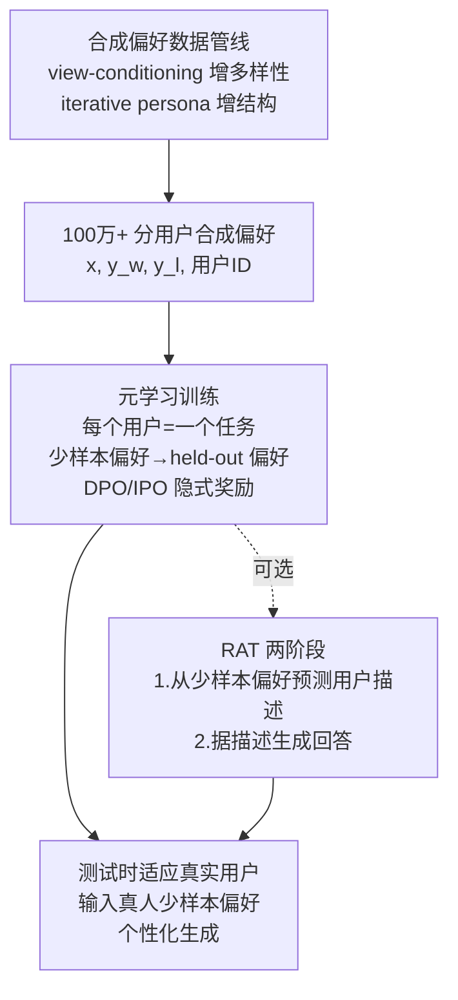

# FSPO: Few-Shot Optimization of Synthetic Preferences Effectively Personalizes to Real Users

**会议**: ICLR 2026  
**OpenReview**: [https://openreview.net/forum?id=SzEc5fSBXv](https://openreview.net/forum?id=SzEc5fSBXv)  
**代码**: 待确认（论文提供匿名仓库，基于 DPO 官方代码库）  
**领域**: LLM 对齐 / 个性化偏好优化  
**关键词**: 个性化对齐, 元学习, 少样本偏好优化, 合成偏好数据, Sim2Real, 奖励建模  

## 一句话总结
把奖励建模重构成"以用户为任务"的黑盒元学习问题，用少样本上下文偏好让 LLM 快速推断每个用户的个性化奖励函数，并配合百万级合成偏好数据集（强调多样性 + 结构性）实现从合成用户到真实用户的迁移，在开放式问答上对真人取得 70% 胜率。

## 研究背景与动机
**领域现状**：当前主流的 RLHF / DPO 把全体人群的偏好聚合成单一奖励函数，训练出"一个模型服务所有人"的策略。这种做法在通用对齐上有效，但天然抹平了个体差异——不同用户因文化背景、个人经历、价值观而拥有截然不同甚至相反的偏好。

**现有痛点**：① 聚合式 RLHF 会边缘化少数群体观点、把系统性偏见固化进模型；② 已有的个性化尝试要么只做分布对齐（匹配统计属性而非个体偏好），要么显式建模奖励分布但训练/推理样本效率低、评测只覆盖极少数人工用户（如只有"helpfulness 用户"和"honest 用户"）；③ 偏好数据本身难以大规模采集，真人标注昂贵且不可靠，覆盖面有限。

**核心矛盾**：要个性化就得为每个用户建一套奖励函数，但真人标注成本让"为大量用户收集足量分层偏好数据"几乎不可行；而纯合成数据又面临 Sim2Real 鸿沟——在虚拟用户上学到的奖励模型能否迁移到真实人类？

**本文目标**：在开放式问答（而非以往的多选题 / survey 设定）上实现对真实用户的个性化，且无需为每个用户重新训练。

**核心 idea**：**把个性化重构成黑盒元学习**——每个用户视为一个"任务"，模型从用户的少量已标注偏好（few-shot）中快速推断其奖励函数，再据此个性化生成。为绕开真人数据瓶颈，**借鉴机器人领域的 domain randomization 思想合成百万级偏好数据**，并提出 **用户描述合理化（RAT）** 用推理时算力把少样本偏好显式总结成自然语言用户画像来提升奖励建模。

## 方法详解

### 整体框架
FSPO 由三块拼成：(1) 把偏好优化包成"对用户做元学习"的训练目标，模型输入某用户的 N 条少样本偏好 + 一条待判定的 held-out 偏好，用 DPO/IPO 这类隐式奖励目标学会从少样本上下文推断该用户偏好；(2) RAT 把"直接预测回答"改成"先从少样本偏好预测用户描述、再据描述生成回答"的两阶段流程，用额外推理算力提升奖励建模与指令遵循；(3) 一套强调"多样性 + 结构性"的合成偏好数据管线，把 domain randomization 落到偏好数据上以跨越 Sim2Real。

### 关键设计

**1. 个性化即元学习：以用户为任务的偏好优化**——FSPO 在标准偏好数据上额外只要求一个弱标注：每条偏好附带用户 ID $S^{(i)}$，从而把数据集写成 $D_{\text{pref}}=\{(x^{(i)},y_w^{(i)},y_l^{(i)},S^{(i)})\}$。每个用户的奖励函数由其偏好集合刻画，于是个性化自然变成在用户分布 $\mathcal{S}=P(S^{(i)})$ 上的元学习目标：$\min_\theta \mathbb{E}_{S^{(i)}\sim\mathcal{S}}\big[\mathbb{E}_{(x,y_1,y_2,c)\sim D_i,\,\{\cdot\}_1^N\sim D_i}[\mathcal{L}^\theta_{\text{pref}}(x,y_1,y_2,c\mid\{(x,y_1,y_2,c)\}_1^N)]\big]$。模型读入用户 $S^{(i)}$ 的少样本偏好序列 $D_i^{\text{fewshot}}$，再对一条 held-out 偏好做预测，整个过程拼成一个 few-shot prompt 喂给预训练 LLM。这样既复用了 LLM 的上下文学习能力，又用 IPO 的目标 $\mathcal{L}^\theta_{\text{pref}}=\|h_{\pi_\theta}^{y_w,y_l}-(2\beta)^{-1}\|_2^2$（其中 $h_{\pi_\theta}^{y_w,y_l}=\log\frac{\pi_\theta(y_w|x)}{\pi_{\text{ref}}(y_w|x)}-\log\frac{\pi_\theta(y_l|x)}{\pi_{\text{ref}}(y_l|x)}$）把奖励隐式参数化为 $\beta\log\pi_\theta/\pi_{\text{ref}}$，从而避开了显式奖励分布建模的样本低效与 on-policy 采样的不稳定，只用一个简单分类目标就能学到能快速适应新用户的奖励模型。从信息论看，N 条二元偏好相当于用户的一个 N-bit 表示，最多区分 $2^N$ 种人格——这种受限表示反而有利于从合成人格迁移到真人。

**2. 用户描述合理化 RAT：把推理算力花在"先画像再回答"上**——直接从少样本偏好生成回答时，用户特征隐含在上下文里，模型难以充分利用。RAT 把预测拆成两步：先根据少样本偏好生成一段自然语言用户描述（如"该合成用户重视家庭"），再以"查询 + 少样本偏好 + 生成的用户描述"为条件生成回答。这段用户描述是少样本偏好的可解释总结，也是更好的生成条件。RAT 用专家引导的偏好对来微调：在 on-policy 采样的用户描述上，把"语义上更接近真实用户描述"的那条设为偏好正例 $y^+_{S^{(i)}}$、更远的设为负例 $y^-_{S^{(i)}}$，再套用同一套元学习损失（Eq.5/6）优化。它和数学/代码推理里用规则奖励训 Long-CoT 的做法本质不同——开放式任务没有可验证的 verifier，所以 RAT 用"靠近 gold 用户描述"作为软奖励信号。效果上 RAT 把 Roleplay 胜率从 82.6% 拉到 90.3%，几乎追平用真实用户描述提示的 Oracle（90.9%），说明它确实恢复出了未见用户的画像。

**3. 多样性增强：view-conditioning + 模型集成对抗"千篇一律"**——元学习要泛化，合成偏好必须覆盖足够多的观点。单纯调高温度采样得到的回答仍高度相似（Llama 3.2 3B 在 temp=1.0 下 mean similarity 仍达 0.94）。FSPO 改用两招：对 ELIX/Reviews 用 persona steering（按随机人格生成回答）；对 Roleplay 由于人格常欠定，改用 **view-conditioning**——先让模型为一个问题列出多个可能的"观点/视角"（如"看 YouTube 视频" vs "用菜谱书" vs "上烹饪课"），再分别以每个视角为条件生成回答。叠加一个比微调基座更大的模型集成（Llama 3.3 70B、Gemma 2 27B）高温采样，最终把 mean similarity 压到 0.71（ALOE/BGE-M3 度量），显著拉开回答多样性，也为奖励标注提供了更宽的响应支撑。

**4. 结构性增强：一致性打分 + 迭代人格精化，压低 Sim2Real 鸿沟**——光有多样性不够，元学习还需要"任务间共享的潜在结构"来避免学到不泛化的捷径。FSPO 从两端控制结构：打分端用 AI Feedback 做相对成对打分（类 AlpacaEval，比绝对 rubric 打分更稳），并条件在打分用户描述 + 用户感知打分指南上；同时把每对偏好正反顺序各喂一遍、过滤掉对顺序敏感的样本来去 position bias，还显式提示模型忽略长度偏好。针对"人格欠定导致偏好标注前后矛盾"（如一处偏好素食蛋糕、另一处又偏好牛排馆），用 **迭代人格精化**：从种子人格出发，对每个问答对，若现有描述不足以确定偏好，就随机选一个偏好并把相应信息追加进人格描述，使后续打分器能做出同样判断，最后用更新后的描述重标该用户全部偏好。此外通过监控用户间偏好的 disagreement 矩阵、对分歧过大的数据重生成，保证用户间有适度重叠以便知识迁移。量化上，迭代精化把偏好标签的二元 Shannon 熵从 0.64 nats 降到 0.13 nats，验证了它在提升"人格-问题-回答"一致性上的作用。

## 实验关键数据

### 主实验表格

Roleplay（1500 用户）合成胜率：

| 方法 | Winrate (%) |
|------|-------------|
| Llama 3.2 3B Instruct | 50.0 |
| IPO | 72.4 |
| Few-shot Prompting | 63.2 |
| Few-shot Pref-FT (GPO) | 62.8 |
| RIC | 53.3 |
| VPL | 67.3 |
| FSPO (DPO) | 81.3 |
| FSPO (IPO) | 82.6 |
| **FSPO + RAT (IPO)** | **90.3** |
| Oracle（真实人格提示，上界） | 90.9 |

ELIX（550 用户）胜率：

| 方法 | ELIX-easy | ELIX-hard |
|------|-----------|-----------|
| Llama 3.2 3B Instruct | 50.0 | 50.0 |
| Few-shot Prompted | 92.4 | 81.4 |
| Few-shot Pref-FT | 91.2 | 82.9 |
| **FSPO (Ours)** | **97.8** | **91.8** |

真人评测（Roleplay，50 用户 / 11 问题）：

| 对比方法 | Winrate (%) |
|----------|-------------|
| FSPO vs Base | 68.2 ± 1.93 |
| FSPO vs SFT | 72.3 ± 1.34 |

单边二项检验 p 值 = 5.65e-09，显著优于 baseline。论文总结的"对合成用户 87% 平均胜率、对真人 70% 胜率"即来自这些结果。

### 消融实验表格

Reviews 任务（Trained vs Interpolated 用户），逐步加 shot / FT / RAT：

| 方法 | Trained | Interpolated |
|------|---------|-------------|
| Llama 3.2 3B Instruct | 50.0 | 50.0 |
| 4-shot Prompted | 66.6 | 61.9 |
| 4-shot Pref-FT | 66.5 | 66.1 |
| 4-shot FSPO | 78.4 | 71.3 |
| 8-shot Prompted | 69.1 | 59.1 |
| 8-shot Pref-FT | 65.6 | 70.7 |
| 8-shot FSPO | 80.4 | 73.6 |
| **8-shot FSPO + RAT** | **92.3** | **84.6** |

数据多样性消融（ALOE / BGE-M3 相似度，越低越好）：

| 策略 | Mean Sim (↓) | Median Sim (↓) |
|------|-------------|----------------|
| Llama 3.2 3B Instruct, temp=0.3 | 0.96 | 0.97 |
| 同上 temp=1.0 | 0.94 | 0.95 |
| + persona steering | 0.81 | 0.82 |
| + view steering | 0.78 | 0.78 |
| **Ensemble + view steering** | **0.71** | **0.73** |

### 关键发现
- **RAT 是性能跃升的关键**：在 Roleplay 上把胜率从 82.6% 推到 90.3%，几乎追平 Oracle，说明"先生成用户画像再回答"确实恢复出了未见用户特征。
- **结构性可量化验证有效**：迭代人格精化把偏好标签熵从 0.64 降到 0.13 nats；多样性策略把相似度从 0.94 降到 0.71，二者共同支撑 Sim2Real 迁移。
- **元学习显著优于纯提示/纯 SFT**：同样的少样本上下文，FSPO（隐式奖励元学习）比 few-shot prompting 和 Pref-FT 高出 10+ 个百分点。
- **能真正迁移到真人**：50 名跨性别、跨大洲的真实用户上对 Base 68%、对 SFT 72% 胜率，p≈5.65e-09，并在外部 PRISM 数据集上得到进一步验证。
- **shot 越多越好**：从 4-shot 到 8-shot 性能单调提升，偏好数据量扩大也单调提升。

## 亮点与洞察
- **视角转换很优雅**：把"个性化"从"建模一个聚合奖励函数"重述为"建模一个奖励函数的分布"，再落成"以用户为任务的黑盒元学习"，让 LLM 现成的上下文学习能力直接被复用，无需为每个用户重训。
- **Sim2Real 借用机器人思想**：把每个用户类比成一个待模拟的"环境"，用 domain randomization 的"多样性 + 结构性"框架指导合成数据构建，这套类比把抽象的"合成数据怎么做才能迁移"落成了可执行的工程配方。
- **RAT 把推理时算力用在刀刃上**：不是 CoT 式堆 token，而是显式产出可解释、可监督（靠近 gold 描述）的用户画像，既提升性能又提供可读的中间产物。
- **首个在开放式问答上对真人验证个性化的工作**：以往个性化多停留在多选/survey，本文做了带统计显著性的真人研究。

## 局限与展望
- **依赖合成数据 + 合成评测**：核心训练信号来自 LLM 生成的偏好与 AI Feedback 打分，存在打分器自身偏见被放大的风险；真人研究规模仍偏小（50 用户 / 11 问题）。
- **用户表示受限**：刻意采用 N-bit 二元偏好表示以利迁移，更丰富的用户表示（聊天历史、长期交互）留作未来工作。
- **回声室 / 偏见放大风险**：个性化可能强化用户既有偏见；论文刻意回避价值观类问题、只做推荐风格问题来规避，但未显式做去偏，建议结合 Persona Vectors 等机制。
- **基座规模较小**：微调基座为 Llama 3.2 3B，更大模型上的表现与扩展性尚待验证。
- **few-shot 偏好需用户先标注**：测试时仍需真人先标几条偏好作为上下文，冷启动成本存在。

## 相关工作与启发
- **个性化对齐谱系**：相比分布对齐（只匹配统计属性）、显式奖励分布建模（VPL、Reward-in-Context，样本低效且评测用户极少）、GPO（多选 survey 个性化）等，FSPO 主打开放式生成 + 真人验证。
- **偏好学习算法**：建立在 DPO / IPO / KTO 的隐式奖励参数化之上，把它们包进元学习外层。
- **黑盒元学习**：延续语言建模 / 图像分类 / RL 中用通用序列算子（自注意力/递归）处理任务上下文的范式，本文把"任务"实例化为"用户"。
- **启发**：① "把每个个体当一个元学习任务"的思路可推广到推荐、教育、医疗等需要个性化奖励的场景；② "多样性 + 结构性"双约束是合成数据能否跨 Sim2Real 的关键判据，值得迁移到其他合成数据工作；③ 用可监督的自然语言中间表示（用户画像）替代不可验证任务的 verifier，是开放式任务做"推理时算力换质量"的一条可行路径。

## 评分
- **新颖性**: ⭐⭐⭐⭐ — "个性化即用户元学习"的重述 + RAT + Sim2Real 合成数据配方组合新颖，尤其首次在开放式问答上对真人做带显著性的个性化验证。
- **实验充分度**: ⭐⭐⭐⭐ — 3 域 / 最多 1500 合成用户 + 真人研究 + 多样性/结构性量化消融 + PRISM 外部验证，较为完整；真人样本量偏小、基座较小略减分。
- **写作质量**: ⭐⭐⭐⭐ — 动机清晰、图示（Fig.1/2/3）直观、数据集构建流程交代充分，方法与数据管线衔接顺畅。
- **价值**: ⭐⭐⭐⭐ — 给"可扩展、可迁移的 LLM 个性化"提供了一套从数据到算法的完整方案，对虚拟助手、内容推荐等用户面向应用有直接落地价值。

<!-- RELATED:START -->

## 相关论文

- [\[NeurIPS 2025\] PolyJuice Makes It Real: Black-Box, Universal Red Teaming for Synthetic Image Detectors](../../NeurIPS2025/llm_alignment/polyjuice_makes_it_real_black-box_universal_red_teaming_for_synthetic_image_dete.md)
- [\[ICLR 2026\] Learning Ordinal Probabilistic Reward from Preferences (OPRM)](learning_ordinal_probabilistic_reward_from_preferences.md)
- [\[ICLR 2026\] Aligning Deep Implicit Preferences by Learning to Reason Defensively](aligning_deep_implicit_preferences_by_learning_to_reason_defensively.md)
- [\[ICLR 2026\] Omni-Reward: Towards Generalist Omni-Modal Reward Modeling with Free-Form Preferences](omni-reward_towards_generalist_omni-modal_reward_modeling_with_free-form_prefere.md)
- [\[ICLR 2026\] Data Selection for LLM Alignment Using Fine-Grained Preferences](data_selection_for_llm_alignment_using_fine-grained_preferences.md)

<!-- RELATED:END -->
