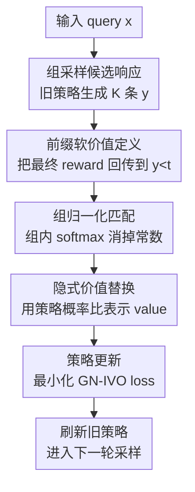

# Group-Normalized Implicit Value Optimization for Language Models

**会议**: ICLR 2026  
**OpenReview**: [https://openreview.net/forum?id=eFXmrCun0c](https://openreview.net/forum?id=eFXmrCun0c)  
**代码**: 待确认  
**领域**: LLM对齐 / 后训练优化  
**关键词**: 强化学习后训练、隐式价值函数、组归一化、序列级信用分配、无 critic 优化  

## 一句话总结
GN-IVO 把 LLM 生成看作逐步决策过程，用同一 prompt 下的一组候选回答构造归一化的奖励分布，再用策略相对旧策略的前缀概率比去匹配这个分布，从而在不训练显式 critic / value network 的情况下给 token 或 reasoning step 提供更细粒度的价值信号。

## 研究背景与动机

**领域现状**：LLM 后训练里，强化学习已经成为提升对齐、摘要、开放生成和数学推理能力的常用手段。PPO、DPO、Online DPO、GRPO、RLOO 等方法都在试图把“最终回答好不好”转成模型参数更新，其中不少方法为了省显存和工程成本，会避免单独训练 critic。

**现有痛点**：很多主流方法仍然把整段回答当作一个 action，只在序列结束后拿到一个标量 reward。这个 bandit 视角在短回答或偏好对齐里还能工作，但遇到长链推理时就很粗：最终答案错了，不知道是第 2 步代数变形错、还是最后格式没写对；最终答案对了，也不知道哪些中间步骤真正贡献了成功。

**核心矛盾**：序列级 RL 方法可以用 Bellman consistency 或 soft Q-learning 去学习 step-level value，但通常要额外的价值网络、partition function 估计或 value head。对 LLM 后训练来说，这些附加组件会带来显存占用、训练不稳定和调参负担；而纯 group-based 的 GRPO / RLOO 虽然无 critic，却又主要在整段回答层面做优势估计，没有真正建模前缀的价值。

**本文目标**：作者想同时满足两个条件：第一，语言生成要按 token 或 reasoning step 做信用分配，而不是只给整段回答一个标签；第二，训练过程不能依赖显式 critic，也不能为了估计不可解的 partition function 再引入新网络。

**切入角度**：论文从 KL-regularized RL 的闭式最优策略出发，发现完整序列上的 reward reweighting 可以推广到任意前缀。也就是说，某个前缀 $y_{<t}$ 的“好坏”可以被写成 soft value $V(x,y_{<t})$，而这个 value 又和最优策略相对旧策略的概率比有直接关系。

**核心 idea**：用同一输入下 $K$ 个候选回答组成一个小组，在组内归一化掉所有共享常数，让策略自己的前缀概率比充当隐式 value，从而用 distribution matching 学到 step-level credit assignment。

## 方法详解

### 整体框架

GN-IVO 的整体流程可以理解为“先用旧策略采样一组候选，再用最终 reward 形成组内目标分布，最后让当前策略在某个前缀步上的相对概率比去拟合这个分布”。它不是给每个 token 训练一个单独的价值头，而是把 value 藏进策略比值 $\pi_\theta(y_{<t}|x) / \pi_{\theta_{old}}(y_{<t}|x)$ 里。

在数学推理任务中，论文把 $y_t$ 视为一个完整 reasoning step；在普通文本生成任务中，$y_t$ 可以是单个 token。训练时对每个 query 采样 $K$ 条完整响应，评估每条响应的标量 reward，再随机抽一个时间步 $t$，用这些响应在 $t$ 之前的前缀构造组内匹配目标。

这张图里真正的贡献节点是后面四步：前缀软价值定义、组归一化匹配、隐式价值替换和策略更新。采样与 reward evaluation 是训练脚手架，但它们决定了 group-normalized objective 能拿到什么样的相对反馈。

### 关键设计

**1. 前缀软价值定义：把终局 reward 变成可分配到中间步骤的信号**

论文先从标准 KL-regularized objective 出发：在给定 query $x$ 时，最优策略满足 $\pi^*(y|x) \propto \pi_{old}(y|x) e^{R(x,y)/\alpha}$。常规理解里，这只说明整段 completion 的概率应该按 reward 重新加权；GN-IVO 的第一步是证明同样的结构也适用于任意前缀 $y_{<t}$。

作者定义 soft value：当 $t=T$ 时，$V(x,y_{<t})=R(x,y)/\alpha$；当 $t<T$ 时，$V(x,y_{<t})=\log \mathbb{E}_{\pi_{old}(y|y_{<t},x)}[e^{R(x,y)/\alpha}]$。这个定义的意思很直观：一个前缀的价值，不是看它当前写得像不像正确答案，而是看从这个前缀继续生成时，未来能得到多高的指数化 reward。于是最优前缀分布可以写成 $\pi^*(y_{<t}|x)=\pi_{old}(y_{<t}|x)e^{V(x,y_{<t})}/Z(x)$，这就给 step-level credit assignment 一个明确目标。

**2. 组归一化匹配：用同一 query 的候选组消掉不可计算的 partition function**

如果直接拟合 $V(x,y_{<t})$，会遇到 $Z(x)$ 这种要对所有可能序列求和的 partition function。GN-IVO 的关键处理是：对同一个 query 采样 $K$ 条响应，在同一组内比较这些前缀的相对价值。因为 $Z(x)$ 对这组候选共享，所以只要做组内归一化，这个常数就会被自动抵消。

具体地，目标分布来自每条完整响应的指数化 reward，实践里使用 $\mathrm{softmax}(R(x,y^{(i)})/\alpha)$ 作为组内权重；模型分布来自每个前缀的指数化 value。训练目标是让这两个组内分布匹配。它学到的不是“绝对 value 是多少”，而是“在这组候选里，哪个前缀更应该被认为通向高 reward 结果”。论文进一步证明，在无限容量和数据下，这个目标能恢复真实 soft value 到一个与 $y_{<t}$ 无关的加性常数，而这个常数不改变诱导出的最优策略。

**3. 隐式价值替换：不用 critic，让策略概率比承担 value 的角色**

组归一化目标一开始可以写成显式 value estimator $V_\psi$ 的训练损失，但论文最终不训练这个网络。根据前缀分布关系，$e^{V(x,y_{<t})}$ 与 $\pi^*(y_{<t}|x)/\pi_{old}(y_{<t}|x)$ 成正比；把可训练策略 $\pi_\theta$ 代入后，模型侧的组内分布就可以直接写成策略概率比的归一化形式。

这样做的好处很实际：critic、value head、partition estimator 都不需要出现。对每个候选前缀，只要计算当前策略与旧策略在该前缀上的 log probability 差，就能得到隐式 value score。由于 softmax 在组内做，$C_t(x)$ 和 $Z(x)$ 这类公共倍数都会从分子分母里消失，留下的只有不同候选前缀之间的相对偏好。

**4. 在线迭代训练：每轮用旧策略采样，再用当前策略匹配组内奖励分布**

GN-IVO 的实际算法是在线式的。每轮先把上一轮策略冻结成 $\pi_{old}$，用它为每个 query 采样 $K$ 条响应；然后用任务 reward function 评估完整响应；最后用 Eq. 9 的 GN-IVO loss 更新当前策略 $\pi_\theta$。更新结束后，再把 $\pi_{old}$ 刷新为当前策略，进入下一轮。

这个设计和 GRPO / RLOO 都使用 group samples，但用法不同。GRPO/RLOO 把 group reward 主要当作整段回答的 baseline 或 advantage，GN-IVO 则把 group 用来构造“前缀价值分布”。所以当输出很长、错误集中在中间步骤时，GN-IVO 能给策略一个更细的方向，而不是把同一条序列里所有 token 都平均背锅。

### 一个完整示例

可以想象一个数学题 query 下，旧策略采样出 4 条 step-by-step 解答。第 1 条最终答案正确且格式合规，reward 最高；第 2 条计算过程大体正确但最后没写 $\boxed{}$；第 3 条中途代数变形错了；第 4 条一开始就选错公式。传统 outcome-only 更新只知道四条完整回答的分数，难以说明哪一步开始分叉。

GN-IVO 会随机抽一个时间步 $t$，比如抽到第 3 个 reasoning step。此时它比较的是 4 条回答各自的前三步前缀：如果第 1 条和第 2 条前三步都通向较高 reward，它们在组内目标分布中权重较大；如果第 3 条在第二步已经把等式变形错，第三步前缀对应的权重就会低；第 4 条更低。模型更新时并不是简单复制第 1 条完整答案，而是提高那些“从当前前缀继续生成更可能得到高 reward”的前缀概率比。

如果抽到更早的 $t$，模型学到的是早期解题方向的价值；如果抽到更晚的 $t$，模型学到的是格式检查、最终答案呈现等后期决策的价值。多轮训练后，稀疏的最终 reward 就被反复投影到不同前缀位置上，形成比整段回答 advantage 更细的训练信号。

### 损失函数 / 训练策略

最终 GN-IVO loss 可以概括为：目标侧用组内归一化 reward 权重，模型侧用组内归一化策略比值。论文的 Eq. 9 写作：

$$
L_{\mathrm{GN\text{-}IVO}}(\theta)=\mathbb{E}\left[-\sum_{i=0}^{K-1} e^{R(x,y^{(i)})/\alpha}\left(\log \frac{\pi_\theta(y^{(i)}_{<t}|x)}{\pi_{old}(y^{(i)}_{<t}|x)}-\log\sum_{j=0}^{K-1}\frac{\pi_\theta(y^{(j)}_{<t}|x)}{\pi_{old}(y^{(j)}_{<t}|x)}\right)\right].
$$

实际实现中，作者为了稳定性把 $e^{R/\alpha}$ 换成组内归一化权重 $e^{R/\alpha}/\sum_j e^{R_j/\alpha}$。所有方法都基于 `trl` 实现；GN-IVO 使用 base trainer，默认 group size $K=4$，温度 $\alpha=0.2$，并保留相对初始模型的 KL penalty $\beta$。数学推理实验用 LoRA 微调 Qwen2.5-Math-7B 与 Llama-3.1-8B-Instruct，文本生成实验训练 500 iterations。

## 实验关键数据

### 主实验

论文在数学推理和三类文本生成任务上验证 GN-IVO。数学推理用 MATH 训练，测试 AMC 2023、Minerva Math、Olympiad-Bench、AIME 2024/2025；文本生成覆盖 Helpful assistant、TL;DR summarization 和 text-to-image prompt generation。

| 任务 / Backbone | 指标 | GN-IVO | 最强或次强基线 | 提升与现象 |
|--------|------|------|----------|------|
| AMC2023 / Llama-3.1-8B-Instruct | Pass@1 | 42.5 | RLOO/GRPO 35.0 | 明显提升，说明 group signal 加前缀建模对推理早期决策有帮助 |
| AIME2024 / Qwen2.5-Math-7B | Pass@3 | 40.0 | RLOO 36.6 / GRPO 33.3 | 在高难数学题上保持优势，优于纯 group advantage 方法 |
| Helpful assistant / Qwen2.5-1.5B-Instruct | Avg@1 | 1.650 | GRPO 1.594 | 开放生成中也优于强 RL baseline |
| TL;DR / Llama-3.2-3B-Instruct | Avg@1 | 3.347 | Ours one-step 3.398 / RLOO 3.181 | 短摘要任务上 sequential 版本与 one-step 接近，说明任务长度会影响收益 |
| Prompt generation / Llama-3.2-3B-Instruct | Avg@1 | 0.384 | Ours one-step 0.371 / Online DPO 0.372 | 在风格 prompt 生成上小幅但稳定领先 |

| Backbone | 任务集合 | GN-IVO 几何均值 GM | 最强基线 GM | 说明 |
|--------|------|------|------|------|
| Qwen2.5-1.5B-Instruct | 三个文本生成任务 | 1.152 | Ours one-step 1.056 / RLOO 1.004 | 序列版整体最好，说明前缀价值不仅服务数学推理 |
| Llama-3.2-3B-Instruct | 三个文本生成任务 | 1.630 | Ours one-step 1.478 / RLOO 1.193 | 对较强文本生成 backbone 提升更明显 |

### 消融实验

论文的分析主要围绕 group size、温度系数、reward normalization 与采样时间步数量展开。虽然附录图中没有把所有数值逐项列出，但趋势非常清楚。

| 配置 | 关键指标 / 趋势 | 说明 |
|------|---------|------|
| $K=2,4,8,16$ | $K$ 越大 reward 越高 | 组内候选越多，经验目标分布越接近真实相对价值；小组时 GN-IVO 相对 GRPO 的优势更突出 |
| $\alpha=0.1,0.2$ | 最终 reward 较高 | 较小温度让 $\mathrm{softmax}(R/\alpha)$ 更尖锐，更强调高质量响应 |
| $\alpha=0.5,1.0$ | 最终 reward 较低 | 分布过于平滑，高低质量响应被拉近，训练信号变弱 |
| reward w/ normalization | 训练更稳定 | 实践中把指数 reward 归一化后更新尺度更可控，是 Eq. 9 的稳定实现版本 |
| sampled $t=1,20,T$ | 多时间步采样优于只看单一位置 | 说明把稀疏 reward 投射到不同前缀位置，是 GN-IVO 的核心收益来源之一 |

### 关键发现

- GN-IVO 的优势主要出现在长输出、需要中间推理或多阶段生成的任务上；这和它的 step-level value 建模目标一致。
- 纯 critic-based 的 PPO、DRO、OREO 并没有稳定占优，作者认为问题在于长程推理场景下 value network 很难估准，critic 误差反而会拖累策略。
- GRPO/RLOO 这类无 critic 且使用 group samples 的方法普遍强于单样本或两样本方法，但 GN-IVO 在多数任务上进一步领先，说明“怎么使用 group”比“是否使用 group”更关键。
- 在 TL;DR 这类输出较短的任务上，sequential GN-IVO 和 one-step 版本差距变小，说明方法收益依赖任务是否真的需要细粒度信用分配。
- 温度 $\alpha$ 不能太大；如果 reward 分布被软化到接近均匀，组内匹配目标就失去区分力。

## 亮点与洞察

- 最巧妙的地方是把 value learning 变成组内分布匹配。它不追求绝对 value 数值，而只学习同一 query 下不同前缀的相对价值，这正好绕过了 partition function。
- GN-IVO 对 DPO 思路做了一个顺滑延伸：DPO 是“语言模型 secretly a reward model”，GN-IVO 更像是“语言模型 secretly a step-level value model”。二者都在用策略比值替代额外预测器。
- 这篇论文把 GRPO/RLOO 的 group sampling 和 OREO/DQO 的 sequential credit assignment 拼在一起，但不是简单相加；关键在于 group normalization 让“无 critic”和“前缀价值”可以同时成立。
- 对需要过程监督但缺少 step-level labels 的任务，这个框架很有迁移价值。只要能对完整输出打 reward，就可能用随机前缀采样把监督信号分配到中间状态。
- 理论保证写得比较干净：恢复 true value up to additive constant 听起来弱，但对 softmax policy 来说足够，因为策略只关心前缀之间的相对偏好。

## 局限与展望

- 方法依赖每个 query 采样 $K$ 条响应并评估 reward，训练开销不在 critic 上，但会转移到采样和 reward evaluation 上；当 reward model 很贵或输出很长时，吞吐仍然是问题。
- 论文默认 group 内候选能提供足够的相对差异。如果某个任务 reward 极稀疏，$K=4$ 的组里大多数响应全错且分数相同，目标分布可能仍然不够有信息量。
- 理论分析建立在无限容量、足够数据和旧策略支持集覆盖等理想条件上；实际 LLM 微调中，LoRA 容量、采样分布漂移和 KL penalty 都会影响这个保证的落地程度。
- 实验主要证明 reward 指标提升，但对训练成本、显存节省、wall-clock 时间和大模型规模扩展的量化还不够。尤其是相对 GRPO 的真实工程性价比，需要更大规模实验支撑。
- 未来可以把这个组归一化隐式 value 思路迁移到 diffusion、agent planning 或工具调用任务中，但这些任务的“前缀状态”定义会更复杂，不一定能直接沿用 token / reasoning step 形式。

## 相关工作与启发

- **vs PPO**: PPO 用 critic 估计 advantage，再做 clipped policy update；GN-IVO 不训练显式 critic，而是用组内归一化的策略比值学习前缀相对价值，省掉 value network 的显存与稳定性问题。
- **vs DPO / Online DPO**: DPO 把偏好对转成监督式 policy loss，但基本是整段回答级别；GN-IVO 面向 scalar reward 和在线采样，并把信号分配到前缀层面。
- **vs GRPO / RLOO**: GRPO 和 RLOO 都用同组 reward 统计量构造 advantage，优点是无 critic；GN-IVO 同样无 critic，但 group 的作用从 baseline 变成了 distributional matching，因此更适合长链推理。
- **vs DRO**: DRO 基于 soft Bellman 思路处理 score feedback，但偏 bandit setting，并需要 value / partition 相关估计；GN-IVO 用组内归一化避开这个估计。
- **vs OREO / DQO**: OREO 和 DQO 也重视 sequential decision making，但依赖 step-level value network 或 Q-function；GN-IVO 的启发是，序列建模不一定要显式 critic，策略概率比本身就能承载足够的 value 信息。

## 评分

- 新颖性: ⭐⭐⭐⭐⭐ 把组归一化、隐式 value 和序列级信用分配结合得很自然，理论动机也比较完整。
- 实验充分度: ⭐⭐⭐⭐ 覆盖数学推理与三类文本生成，并和 PPO/DPO/GRPO/RLOO/OREO 等强基线比较；但训练成本和更大模型规模分析还可以更充分。
- 写作质量: ⭐⭐⭐⭐ 方法推导清晰，核心 theorem 能服务算法设计；实验表格较密，部分附录趋势图缺少可直接引用的精确数值。
- 价值: ⭐⭐⭐⭐⭐ 对 LLM 后训练很实用，尤其适合想要过程级 credit assignment、但又不想承担 critic 成本的 RLHF / reasoning 优化场景。

<!-- RELATED:START -->

## 相关论文

- [\[ICLR 2026\] Pretrain Value, Not Reward: Decoupled Value Policy Optimization](pretrain_value_not_reward_decoupled_value_policy_optimization.md)
- [\[ICLR 2026\] Cognitive models can reveal interpretable value trade-offs in language models](cognitive_models_can_reveal_interpretable_value_trade-offs_in_language_models.md)
- [\[ICLR 2026\] Reward Models Inherit Value Biases from Pretraining](reward_models_inherit_value_biases_from_pretraining.md)
- [\[ICML 2026\] VALUEFLOW: Toward Pluralistic and Steerable Value-based Alignment in Large Language Models](../../ICML2026/llm_alignment/valueflow_toward_pluralistic_and_steerable_value-based_alignment_in_large_langua.md)
- [\[ACL 2025\] Internal Value Alignment in Large Language Models through Controlled Value Vector Activation](../../ACL2025/llm_alignment/internal_value_alignment_in_large_language_models_through_controlled_value_vecto.md)

<!-- RELATED:END -->
