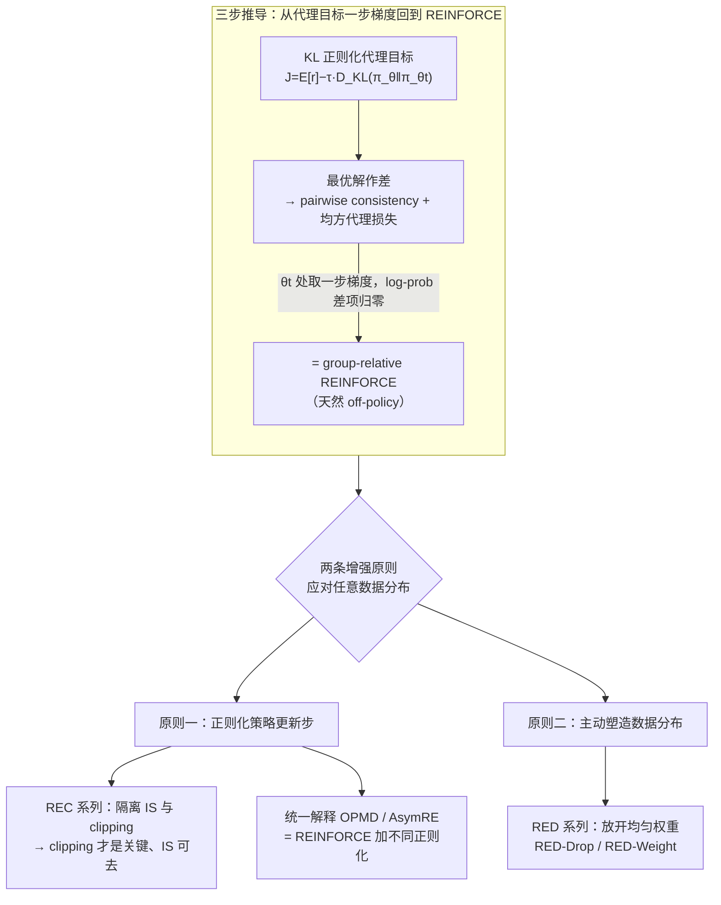

# Group-Relative REINFORCE Is Secretly an Off-Policy Algorithm: Demystifying Some Myths About GRPO and Its Friends

**会议**: ICLR 2026  
**arXiv**: [2509.24203](https://arxiv.org/abs/2509.24203)  
**代码**: [Trinity-RFT](https://github.com/agentscope-ai/Trinity-RFT/tree/main/examples/rec_gsm8k)  
**领域**: LLM对齐 / RL  
**关键词**: GRPO, off-policy RL, importance sampling, clipping, REINFORCE, 策略优化

## 一句话总结

通过构造 KL 正则化代理目标并推导 pairwise consistency condition，从第一原理证明 group-relative REINFORCE（GRPO）天然是 off-policy 算法；进而通过组件隔离实验发现 clipping 才是训练稳定性的关键而 importance sampling 完全可以去掉，并在此统一框架下重新解释了 Kimi OPMD、Meta AsymRE 等多个看似独立的算法。

## 研究背景与动机

**领域现状**：GRPO 及其变体（DAPO、GiGPO）已成为 LLM RL 训练的主流算法。DeepSeek-R1 用 GRPO 训练推理模型取得了突破性成果，Kimi 团队提出了 OPMD，Meta 提出了 AsymRE——这些方法各自给出了不同的理论 justification，但实际上它们之间的内在联系并不清楚。

**现有痛点**：GRPO 的成功被归因于多种因素——group-relative advantage 降低方差、importance sampling 校正分布偏移、clipping 稳定训练——但每个组件的真实贡献从未被系统性地隔离和验证。更关键的是，GRPO 在理论上被视为 on-policy 算法（需要从当前策略采样以得到无偏梯度估计），但工程实践中几乎总是在 off-policy 数据上运行（rollout 生成和模型训练速度不匹配、数据来自旧版策略、奖励反馈延迟），这种理论与实践的脱节缺乏严格解释。

**核心矛盾**：经典策略梯度理论要求训练数据来自当前策略 $\pi_\theta$，off-policy 校正依赖 importance sampling 权重 $\pi_\theta(y|x)/\pi_b(y|x)$，但这些权重在 LLM 语境下会随序列长度指数爆炸。现有做法用 token-wise 比率代替 response-wise 比率，引入了偏差但没有严格的理论保证。

**本文要解决**：(1) 为 GRPO 提供不依赖采样分布假设的理论推导；(2) 系统性地隔离 IS、clipping 等组件的作用；(3) 在统一框架下解释 GRPO、OPMD、AsymRE 的内在联系。

**切入角度**：作者观察到如果从 KL 正则化代理目标出发，推导其最优解满足的 pairwise consistency condition，然后构造强制满足该条件的均方代理损失，对这个代理损失在当前参数处取一步梯度——恰好就是 GRPO 的更新公式。整个推导过程完全不需要指定数据来自哪个策略。

**核心idea**：GRPO 是 off-policy 算法；clipping 是稳定性的唯一关键组件而 IS 几乎无用；用两条增强原则（正则化策略更新 + 主动塑造数据分布）可以统一理解和改进一系列 RL 算法。

## 方法详解

### 整体框架

这篇论文想回答一个长期被含糊带过的问题：GRPO 在理论上被当成 on-policy 算法，工程上却几乎总跑在 off-policy 数据上，这两者到底怎么调和，又是哪个组件在真正撑着训练稳定性。作者的做法不是从采样分布出发去打补丁，而是反过来从一个 KL 正则化的代理目标出发，证明 GRPO 的更新公式可以在不假设数据来源的情况下被推出来——既然推导里压根没用到"数据来自当前策略"，那它天然就是 off-policy 的。

整套理论沿三步展开。第一步，定义以上一轮策略 $\pi_{\theta_t}$ 为锚点的 KL 正则化代理目标 $J(\theta; \pi_{\theta_t}) = \mathbb{E}[r(x,y)] - \tau \cdot D_{\text{KL}}(\pi_\theta \| \pi_{\theta_t})$，求出它的最优策略满足的 pairwise consistency condition；第二步，用有限样本构造一个强制该条件成立的均方代理损失；第三步，在当前参数 $\theta_t$ 处对这个损失取一步梯度，结果恰好等价于 group-relative REINFORCE 的更新公式。拿到这个 off-policy 解释后，作者再从中提炼出两条增强原则来应对任意数据分布：一是**正则化策略更新步**（clipping、KL 惩罚等），防止在次优数据分布下一步走得太大把策略带崩；二是**主动塑造训练数据分布**（样本加权、丢弃低奖励样本等），引导更新方向。下面四个设计点里，第一个就是这套推导本身（理论地基，也正是它催生了两条原则），后三个再分别落到两条原则上：REC 系列与 OPMD/AsymRE 的统一解释属第一条原则，RED 系列属第二条。

### 关键设计

**1. 三步推导：从代理目标一步梯度回到 REINFORCE**

整个理论的地基。KL 正则化代理目标的最优解是一个封闭形式 $\pi^*(y|x) \propto \pi_{\theta_t}(y|x) \exp(r(x,y)/\tau)$，对它取对数、在任意两个响应 $y_1, y_2$ 之间作差，就得到 pairwise consistency condition：$r_1 - \tau(\log\pi(y_1|x) - \log\pi_{\theta_t}(y_1|x)) = r_2 - \tau(\log\pi(y_2|x) - \log\pi_{\theta_t}(y_2|x))$，即每个响应的"奖励减去 KL 偏移"应当处处相等。作者把这个条件写成一个对所有样本对都要满足的均方损失：

$$\hat{L} = \frac{1}{K^2}\sum_{i<j}(a_i - a_j)^2$$

关键的一步在求梯度时发生：在 $\theta = \theta_t$ 处求导，所有 log-probability 的差项都因为 $\pi_\theta = \pi_{\theta_t}$ 而归零，剩下的部分化简成 $\frac{1}{K}\sum_i (r_i - \bar{r}) \nabla_\theta \log\pi_\theta(y_i|x)$——这正是 GRPO 的更新公式。整个过程从头到尾没有出现"数据必须来自 $\pi_\theta$"的假设，所以它绕开了经典策略梯度对 on-policy 采样的要求，直接从最优性条件给 off-policy 使用提供了正当性。

**2. REC 系列：把 IS 和 clipping 单独拎出来做对照**

有了理论框架，接下来要回答的是 GRPO 那几个组件里到底谁在干活。作者设计了一组 REINFORCE-with-Clipping（REC）变体逐个剥离：REC-OneSide-IS 保留 IS 权重和单侧 clipping、但去掉 advantage normalization；REC-OneSide-NoIS 在此基础上再把 IS 权重也去掉，只留 clipping mask

$$M_i^t = \mathbb{1}(A_i > 0,\ \rho_i^t \leq 1+\epsilon_{\text{high}}) + \mathbb{1}(A_i < 0,\ \rho_i^t \geq 1-\epsilon_{\text{low}})$$

同时把 clipping 范围从标准的 $(0.2, 0.2)$ 一路放宽到激进的 $(0.6, 2.0)$ 做对照。社区一直默认 IS 是 off-policy 校正的核心机制，但这组实验给出的答案恰好相反：去掉 IS 后奖励曲线完全重叠、性能几乎不变，而一旦去掉 clipping 训练立刻崩溃。换句话说，clipping 才是那个隐式的信赖域约束——它限制了每步策略更新的幅度，在有限样本覆盖不足时把策略拉住、不让它偏到次优区域去；IS 在 LLM 微调这种策略变化本就不大的场景下几乎是个摆设。

**3. 统一解释 OPMD 和 AsymRE：换皮的都是 REINFORCE 加正则化**

第一原则的解释力还能往外延伸。Kimi 的 OPMD 看似是独立算法，但它的损失可以拆成 REINFORCE loss 加一项均方正则化 $\frac{\beta}{2K}\sum_i(\log\pi_\theta(y_i|x) - \log\pi_{\text{old}}(y_i|x))^2$（其中 $\beta = \tau$）；Meta 的 AsymRE 那个 baseline 偏移 $\bar{r} - \beta$，等价于 REINFORCE loss 加一项 KL 正则化 $\frac{\beta}{K}\sum_i \log\frac{\pi_{\text{old}}(y_i|x)}{\pi_\theta(y_i|x)}$，在大样本极限下收敛到 $\beta \cdot D_{\text{KL}}(\pi_{\text{old}} \| \pi_\theta)$。原论文各自的推导路径不同——OPMD 从 KL 目标的 pointwise consistency condition 出发（和本文 step 1 重叠、step 2 分道），AsymRE 用多臂赌博机分析去 justify baseline 偏移——但在本文视角下它们只是同一件事的不同正则化形式，全都归到"正则化策略更新"这条原则下，GRPO 用的是 clipping、OPMD 用的是均方、AsymRE 用的是 KL。

**4. RED 系列：把均匀权重放开，落到第二条原则上**

前面 REC 与 OPMD/AsymRE 的统一解释两点都在第一条原则（正则化更新）里打转，第四点转向第二条原则（塑造数据分布）。作者把 pairwise 代理损失里的均匀权重推广成一般权重 $\sum_{i<j} w_{i,j}(a_i - a_j)^2$，推出加权版的 REINFORCE 更新公式，并据此给出两种具体方法。**RED-Drop** 丢弃一部分低奖励负样本、只在子集 $\mathcal{S} \subseteq [K]$ 上训练，动机是负梯度会加剧 entropy collapse 的风险（与 Kimi-Researcher 博客的经验建议一致），而在 off-policy 框架下这种丢弃有了理论依据。**RED-Weight** 则用奖励相关的权重 $w_i$ 给每个样本的梯度项加权，它可以分解为 pairwise 加权 REINFORCE 加一个模仿高奖励响应的正则化项，正好呼应 offline RL 文献里"对高奖励轨迹做正则化，比保守地模仿所有轨迹更有效"的结论。

### 损失函数 / 训练策略

核心损失始终是标准 REINFORCE loss $-\frac{1}{K}\sum_i(r_i - \bar{r})\log\pi_\theta(y_i|x)$，再叠加一个可选的正则化项——clipping mask、KL 惩罚或均方正则化，不同搭配就对应到不同算法（GRPO/OPMD/AsymRE/RED）。训练在 Trinity-RFT 框架上进行，靠 `sync_interval`（模型同步频率）和 `sync_offset`（rollout 与训练之间的延迟）两个参数精确控制 off-policy 的程度，从而支撑前面 on-policy / mixed / offline 三档对照实验。

## 实验关键数据

### 主实验：IS vs Clipping 消融（GSM8k, Qwen2.5-1.5B-Instruct）

| 算法 | Clipping 范围 | IS | On-Policy 奖励 | Mixed 奖励 | Offline 奖励 |
|------|-------------|-----|---------------|-----------|-------------|
| GRPO | (0.2, 0.2) | ✓ | 收敛正常 | 收敛正常 | 收敛正常 |
| REC-OneSide-IS | (0.2, 0.2) | ✓ | ≈ GRPO | ≈ GRPO | ≈ GRPO |
| REC-OneSide-NoIS | (0.2, 0.2) | ✗ | ≈ GRPO | ≈ GRPO | ≈ GRPO |
| REC-OneSide-NoIS | (0.6, 2.0) | ✗ | **加速收敛** | **加速收敛** | 速率↑但不稳定 |
| REINFORCE（无 clipping） | — | ✗ | **训练崩溃** | **训练崩溃** | **训练崩溃** |

核心结论：去掉 IS 后三种设置下奖励曲线完全重叠，证明 IS 非必要；去掉 clipping 则立即崩溃，证明 clipping 是唯一关键组件。扩大 clipping 范围在 on-policy 和 mixed 设置下加速收敛，但在纯 offline 设置下出现速率-稳定性 trade-off。

### 消融与扩展实验

| 实验设置 | 任务/模型 | 关键发现 |
|---------|----------|---------|
| REC 系列 | ToolACE / Llama-3.2-3B | IS 非必要；clipping 仍然是稳定性关键；结论跨模型和任务一致 |
| RED-Drop | GSM8k / Qwen2.5-1.5B | 丢弃低奖励样本在 on/off-policy 均有效，性能与 REC 扩大范围相当 |
| RED-Weight | Guru-Math / Qwen2.5-7B | 加权方法在大规模任务上超过 GRPO，且 KL 偏移相近，规模效应正面 |
| RED-Weight | MATH / Llama-3.1-8B | 跨模型验证有效性，在更难的数学任务上仍有提升 |
| OPMD 复现 | GSM8k / Qwen2.5-1.5B | 均方正则化和 clipping 有互补效果，但单独使用 clipping 已足够 |
| AsymRE 复现 | GSM8k / Qwen2.5-1.5B | Baseline 偏移（KL 正则化）有效但不如 clipping 鲁棒 |
| Offline 压力测试 | GSM8k | 只用初始策略采样的离线数据训练，暴露了扩大 clipping 范围的稳定性极限 |

### 关键发现

- **IS 完全可以去掉**：在所有测试的模型（1.5B/3B/7B/8B）、任务（GSM8k/MATH/ToolACE/Guru-Math）和 off-policy 程度（on-policy/mixed/offline）下，去掉 IS 后性能无显著变化。这意味着工程实现可以省去存储和计算旧策略概率的开销
- **Clipping 是唯一不可或缺的组件**：相当于隐式信赖域约束，限制了 $\pi_\theta/\pi_{\text{old}}$ 的变化幅度。没有它，策略更新在有限样本下方向不可控
- **扩大 clipping 不对称范围可加速训练**：允许正 advantage 的策略比率更大增长（$\epsilon_{\text{high}} = 2.0$），同时适度放松负 advantage 的下限（$\epsilon_{\text{low}} = 0.6$），直觉上是鼓励学好的同时允许遗忘坏的
- **3-arm bandit 反例**：vanilla REINFORCE 在行为策略 $\pi_b = [0.3, 0.6, 0.1]$、奖励 $r = [0, 0.8, 1]$ 时会收敛到次优动作 $a_2$ 而非最优 $a_3$，因为 $\pi_b(a_2)(r(a_2) - \mu_r) > \pi_b(a_3)(r(a_3) - \mu_r)$——说明不加正则化/数据塑造时 off-policy REINFORCE 必然失败

## 亮点与洞察

- **理论推导的优雅性**：三步推导（代理目标 → consistency condition → 均方损失 → 一步梯度 = REINFORCE）结构清晰，每步都有明确的物理直觉。特别是在 $\theta_t$ 处取梯度时 log-probability 差项自然归零的技巧，使得最终公式干净地回到 REINFORCE——这不是偶然的巧合而是深层结构的反映
- **"IS 无用"的反直觉发现**：IS 通常被认为是 off-policy RL 的基础设施，但在 LLM 微调的语境下（策略变化通常不大，token-wise IS 本身就是偏的），IS 权重接近 1，校正效果可忽略。真正起作用的是 clipping 带来的隐式信赖域。这个洞察直接简化了工程实现
- **统一框架的解释力**：将 GRPO（clipping 正则化）、OPMD（均方正则化）、AsymRE（KL 正则化）统一为 REINFORCE + 不同正则化形式，把三条独立的研究线索串成了一个故事。同时，RED-Drop 和 RED-Weight 对应第二条原则（数据分布塑造），完成了理论闭环

## 局限与展望

- **缺乏收敛保证**：off-policy 解释提供了正当性但没有给出 policy improvement 或收敛的形式化保证，需要未来工作在特定数据分布假设下建立
- **纯 offline 设置的 trade-off 未解决**：扩大 clipping 范围在 offline 设置下可能导致不稳定，作者指出这是一个开放问题，可能需要自适应 clipping 策略（根据训练进度、off-policy 程度动态调整范围）
- **单/多轮 RL 的差异**：主要分析基于 one-step RL（单轮 prompt-response），多步推广在附录但缺乏实验验证。对于需要多轮环境交互的 agentic RL，结论的迁移性有待检验
- **仅验证了数学推理和工具使用**：GSM8k、MATH、ToolACE 等任务的奖励信号都是明确的正确/错误，对于奖励更模糊的场景（如对话质量、创意写作）中组件贡献是否一致尚不清楚
- **Group size $K$ 的影响未充分分析**：pairwise consistency condition 基于有限样本对，$K$ 的选择如何影响代理损失对真实目标的近似质量？小 $K$ 下 group-relative baseline 的方差问题是否与 off-policy 程度交互？

## 相关工作与启发

- **vs PPO**：PPO 用 clipping 限制 on-policy 策略更新步长，本文证明同样的 clipping 机制在 off-policy 设置下也是关键的稳定器。区别在于 GRPO 的 clipping 作用于 group-relative advantage 而非原始 ratio，且 GRPO 不需要 value function
- **vs DPO**：DPO 是纯 offline 偏好优化（Bradley-Terry 模型推导），本文的 off-policy REINFORCE 保持了 online 学习能力但可以容忍旧数据。两者可以互补——DPO 用于冷启动，GRPO 用于持续学习
- **vs DAPO**：DAPO 在 GRPO 基础上增加了 token-level entropy bonus 和 dynamic sampling 等探索机制。本文的分析为 DAPO 的经验成功提供了理论基础——DAPO 的改进本质上都可以归入"正则化策略更新"和"塑造数据分布"两条原则
- **vs REBEL/CoPG**：这两个工作与本文共享 KL 正则化目标和 pairwise consistency condition（step 1-2 重叠），但它们选择直接最小化代理损失（多步梯度下降），而本文的贡献在于发现单步梯度就回到 REINFORCE——由此建立了理论和实践的桥梁

## 评分

- 新颖性: ⭐⭐⭐⭐⭐ 从第一原理推导出 GRPO 的 off-policy 解释，组件隔离实验彻底推翻了"IS 是核心"的共识
- 实验充分度: ⭐⭐⭐⭐ 覆盖 5 个模型、4 个任务、3 种 off-policy 程度，消融全面；但缺少更多 agentic 和对话场景验证
- 写作质量: ⭐⭐⭐⭐⭐ 理论推导极其清晰，三步结构层层递进；统一框架的呈现方式教科书级别
- 价值: ⭐⭐⭐⭐⭐ 对 LLM RL 社区有根本性指导——"去掉 IS、扩大 clipping 范围"是可立即落地的工程优化

<!-- RELATED:START -->

## 相关论文

- [\[ACL 2026\] MDP-GRPO: Stabilized Group Relative Policy Optimization for Multi-Constraint Instruction Following](../../ACL2026/llm_alignment/mdp-grpo_stabilized_group_relative_policy_optimization_for_multi-constraint_inst.md)
- [\[ICLR 2026\] Mitigating the Safety Alignment Tax with Null-Space Constrained Policy Optimization](mitigating_the_safety_alignment_tax_with_null-space_constrained_policy_optimizat.md)
- [\[ICML 2026\] UDM-GRPO: 统一离散扩散模型的稳定高效 GRPO](../../ICML2026/llm_alignment/udm-grpo_stable_and_efficient_group_relative_policy_optimization_for_uniform_dis.md)
- [\[ICLR 2026\] When Data Is the Algorithm: A Systematic Study and Curation of Preference Optimization Datasets](when_data_is_the_algorithm_a_systematic_study_and_curation_of_preference_optimiz.md)
- [\[ICLR 2026\] Learning More with Less: A Dynamic Dual-Level Down-Sampling Framework for Efficient Policy Optimization](learning_more_with_less_a_dynamic_dual-level_down-sampling_framework_for_efficie.md)

<!-- RELATED:END -->
