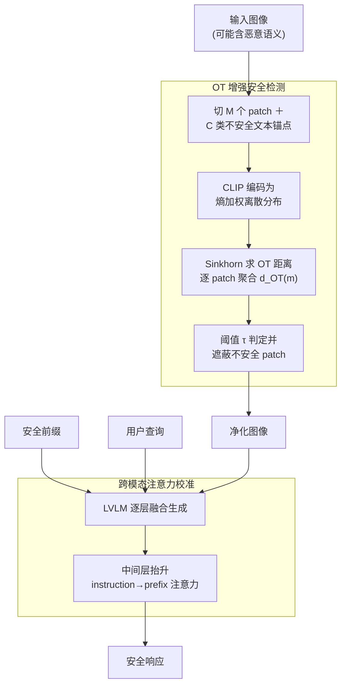

# GuardAlign: Test-time Safety Alignment in Multimodal Large Language Models

**会议**: ICLR 2026  
**arXiv**: [2602.24027](https://arxiv.org/abs/2602.24027)  
**代码**: 无  
**领域**: LLM对齐  
**关键词**: LVLM安全, 最优传输, 注意力校准, 推理时防御, 视觉安全检测

## 一句话总结
提出 GuardAlign，一个无需训练的多模态大模型推理时安全防御框架：用最优传输(OT)精确检测图像中的不安全区域并遮蔽，再通过跨模态注意力校准保持安全前缀的影响力不衰减，在6个LVLM上将不安全响应率降低最多39%，同时保持甚至提升通用能力。

## 研究背景与动机

**领域现状**：LVLM（如LLaVA、InternVL）在视觉-语言推理上取得了卓越进展，但当输入图像携带恶意语义时容易产生有害响应。现有防御分为微调方法（成本高）和推理时方法（如对比解码，额外开销大），最近出现轻量的输入侧防御范式。

**现有痛点**：
   - 输入侧防御第一步用CLIP检测不安全图像，但复杂场景下安全/不安全样本的相似度分数严重重叠，检测不准
   - 第二步添加安全前缀激活模型内部防御机制，但随着层数增加，前缀的注意力权重持续衰减，安全信号被稀释
   - 模型初始拒绝后，常在"However"等过渡词后开始生成不安全内容

**核心矛盾**：全局CLIP相似度无法捕获局部恶意语义 + 安全前缀信号在深层衰减

**本文目标** 更准确的不安全内容检测 + 更持久的安全信号维持

**切入角度**：用最优传输(OT)建模图像patch与不安全语义之间的细粒度分布距离；用注意力校准机制防止安全前缀信号衰减

**核心 idea**：OT检测恶意patch + 注意力校准维持安全前缀 = 无训练的LVLM安全防御

## 方法详解

### 整体框架
GuardAlign 要在不碰模型权重的前提下，把一张可能藏有恶意语义的图像变成"安全可用"的输入。它分两步走：先做 **OT 增强安全检测**，逐 patch 找出图像里哪些局部区域携带不安全语义并把它们遮蔽，得到一张净化图像；再把净化图像、一段安全前缀和用户查询一起喂进 LVLM，在生成过程中做 **跨模态注意力校准**，在中间层持续抬升安全前缀的注意力，确保它的影响力不会随层深衰减。两步都在推理时完成，不需要任何训练或微调。

### 关键设计

**1. OT 增强安全检测：用最优传输在 patch 级别精确定位恶意区域**

旧范式第一步用 CLIP 全局相似度判图像是否不安全，但在复杂场景里安全样本和不安全样本的相似度分数大面积重叠，根本分不开。GuardAlign 改成在 patch 级别建模细粒度对齐：把图像切成 $M$ 个 patch，为 $C$ 个不安全类别各准备一组文本锚点，用 CLIP 分别编码图像 patch $\{\mathbf{x}^m\}$ 和文本变体 $\{\mathbf{z}_i^n\}$，再写成两个离散分布

$$\mathbb{P}(\mathbf{x})=\sum_m a^m \delta(\mathbf{x}^m), \qquad \mathbb{Q}_i(\mathbf{z})=\sum_n b_i^n \delta(\mathbf{z}_i^n)$$

其中 patch 权重 $a^m$ 用熵加权——置信度高（低熵）的 patch 权重更大。用 Sinkhorn 算法求两个分布间的 OT 距离后，把每个 patch 在所有类别上的传输贡献聚合起来

$$d_{\text{OT}}(m)=\sum_i\sum_n \mathbf{T}_i(m,n)\,\mathbf{C}_i(m,n)$$

低于阈值的 patch 就判为不安全并遮蔽。这样做的好处是传输计划天然给出了"哪些 patch 最可疑"的信息，不需要再额外定位。论文还给了理论保证：OT 方法的分类误差不超过余弦相似度方法，因为熵加权的传输计划会优先对齐判别性特征，把安全类和不安全类的标准化间距拉得更开。

**2. 跨模态注意力校准：让安全前缀的信号穿透深层、不被稀释**

光检测还不够——即便加了安全前缀来激活模型内部的防御机制，作者发现这段前缀的注意力权重在 LLaVA 里随层深度单调递减，到深层几乎被"遗忘"，于是模型常在初始拒绝后被"However"之类的过渡词牵着重新生成不安全内容。校准的做法是在中间层直接抬升 instruction token 对前缀 token 的注意力：对第 $l$ 层第 $h$ 个注意力头的分数做

$$\hat{\mathbf{Z}}_{l,h} = \mathbf{Z}_{l,h} + \gamma\,\mathbf{M}^{\text{pref}}_{l,h} \circ \mathbf{Z}_{l,h}$$

其中 $\gamma>0$ 控制放大强度，mask $\mathbf{M}^{\text{pref}}$ 只挑出 instruction token→prefix token 这一类 query-key 对，并且只放大其中正相关的注意力。这样安全信号在每一层都被持续激活，避免了深层"遗忘"安全指令导致的攻破。

### 损失函数 / 训练策略
- 无需训练，纯推理时方法
- OT求解使用Sinkhorn算法（高效迭代）
- 安全检测阈值 $\tau=0.42$，注意力放大系数 $\gamma > 0$ 作为超参数

## 实验关键数据

### 主实验：不安全响应率(USR)对比

| 模型 | 方法 | SPA-VL ↓ | MM-SafetyBench SD+TYPO ↓ | FigStep ↓ | Suffix ↓ | Unconstrained ↓ |
|------|------|---------|------------------------|-----------|----------|----------------|
| LLaVA-1.5-7B | Vanilla | 46.04 | 40.46 | 58.60 | 62.00 | 97.50 |
| | + ECSO | 23.40 | 15.89 | 37.40 | 59.00 | 95.00 |
| | + ETA | 16.98 | 15.83 | 7.80 | 22.60 | 22.50 |
| | + **GuardAlign** | **10.31** | **9.65** | **3.40** | **15.30** | **15.00** |
| LLaMA3.2-11B | Vanilla | 7.17 | 19.17 | 41.60 | 44.00 | 15.00 |
| | + **GuardAlign** | **1.25** | **2.28** | **3.50** | **3.00** | **3.50** |

### 消融实验：各组件贡献

| 配置 | SPA-VL USR ↓ | VQAv2 ↑ | 说明 |
|------|-------------|---------|------|
| ETA baseline | 16.98 | 78.51 | CLIP检测+安全前缀 |
| + OT检测(替换CLIP) | 12.45 | 78.85 | OT提升检测精度 |
| + 注意力校准 | 10.31 | 79.21 | 完整GuardAlign |
| 仅OT检测 | ~14 | ~79 | OT贡献最大 |
| 仅注意力校准 | ~13 | ~79 | 校准也有独立贡献 |

### 关键发现
- **OT检测 vs CLIP**：OT在SPA-VL上实现安全/不安全样本的清晰分离，而CLIP相似度分数严重重叠
- **注意力校准防止"However"攻击**：校准后前缀注意力在各层保持稳定，不再出现初始拒绝后转向不安全内容的问题
- **通用能力不降反升**：GuardAlign在VQAv2上从78.51%提升到79.21%，在MME等基准上也有提升——因为遮蔽无关patch和校准注意力也减少了多模态融合中的语义噪声
- **效率优势**：推理时间开销极小，Sinkhorn算法收敛快

## 亮点与洞察
- **OT用于安全检测的新视角**：将图像安全检测重新建模为分布距离问题，比逐patch余弦相似度更鲁棒。巧妙之处在于OT的传输计划天然提供了"哪些patch最可疑"的信息
- **安全前缀注意力衰减的发现**：这个观察解释了为什么简单添加安全前缀不够——模型在深层"遗忘"了安全指令。注意力校准是一个轻量且有效的修复
- **安全+能力的正和博弈**：通常安全防御会牺牲能力，但GuardAlign的patch遮蔽和注意力校准同时减少了多模态融合噪声，实现安全和能力的双赢

## 局限与展望
- **依赖预定义不安全类别**：需要事先定义不安全语义类别列表，可能无法覆盖新型攻击
- **阈值τ需手动设定**：$\tau=0.42$ 是实验调优结果，不同模型/场景可能需要不同阈值
- **仅处理视觉侧攻击**：对纯文本越狱攻击的防御依赖安全前缀，没有专门的文本侧检测
- **改进思路**：可以用LLM自动生成不安全类别列表实现自适应；可以结合SSAH的推理方向重评估思路，在每步生成时动态调整注意力校准强度

## 相关工作与启发
- **vs ECSO**：ECSO用CLIP检测+安全前缀，GuardAlign在两个环节都做了改进（OT替换CLIP + 注意力校准加强前缀）
- **vs ETA**：ETA是GuardAlign的直接前身，GuardAlign解决了ETA的两个核心缺陷
- **vs VLGuard (Posthoc-LoRA)**：VLGuard需要微调，GuardAlign无需训练；且GuardAlign在通用能力上更优

## 评分
- 新颖性: ⭐⭐⭐⭐ OT用于安全检测+注意力校准的组合新颖，但每个组件并非全新
- 实验充分度: ⭐⭐⭐⭐⭐ 6个模型×5个安全基准+多个通用基准，非常全面
- 写作质量: ⭐⭐⭐⭐ 条理清晰，理论分析加分
- 价值: ⭐⭐⭐⭐ 实用性强的推理时防御方案，易于部署

<!-- RELATED:START -->

## 相关论文

- [\[ICLR 2026\] Test-Time Alignment for Large Language Models via Textual Model Predictive Control](test-time_alignment_for_large_language_models_via_textual_model_predictive_contr.md)
- [\[ICLR 2026\] Semantic-aware Wasserstein Policy Regularization for Large Language Model Alignment](semantic-aware_wasserstein_policy_regularization_for_large_language_model_alignm.md)
- [\[ICLR 2026\] A2D: Any-Order, Any-Step Safety Alignment for Diffusion Language Models](a2d_any-order_any-step_safety_alignment_for_diffusion_language_models.md)
- [\[ACL 2026\] On the Rejection Criterion for Proxy-Based Test-Time Alignment](../../ACL2026/llm_alignment/on_the_rejection_criterion_for_proxy-based_test-time_alignment.md)
- [\[ICML 2026\] Towards Context-Invariant Safety Alignment for Large Language Models](../../ICML2026/llm_alignment/towards_context-invariant_safety_alignment_for_large_language_models.md)

<!-- RELATED:END -->
