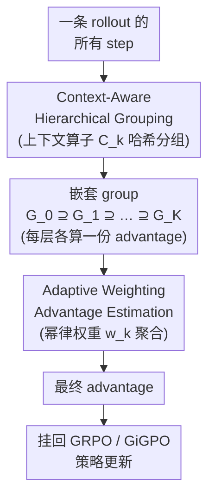

# Hierarchy-of-Groups Policy Optimization for Long-Horizon Agentic Tasks

**会议**: ICLR 2026  
**arXiv**: [2602.22817](https://arxiv.org/abs/2602.22817)  
**代码**: 待确认  
**领域**: LLM对齐  
**关键词**: group-relative RL, advantage estimation, long-horizon agent, bias-variance tradeoff, context consistency  

## 一句话总结
揭示了 stepwise group-based RL（如 GRPO/GiGPO）中的「历史上下文不一致」问题——同一 group 内的 step 可能具有不同历史上下文导致 advantage 估计偏差，提出 HGPO 通过层次化分组和自适应加权实现低偏差、平衡方差的 advantage 估计，在 ALFWorld 和 WebShop 上以极低额外开销（<0.001%）取得显著提升。

## 研究背景与动机
**领域现状**：基于 RL 的 LLM Agent 训练（如 GRPO、GiGPO）在长 horizon 任务中表现突出，核心思想是将同一 rollout 中的多个 step 分到一个 group，用 group 内的相对信号估计 advantage。

**现有痛点**：在长 horizon 任务中，同一 rollout 的不同 step 虽然来自同一 episode，但其历史上下文可能完全不同（例如第 3 步和第 10 步面对的是不同的环境状态组合）。将这些不一致上下文的 step 混在一起计算 advantage 会引入系统偏差。

**核心矛盾**：step-level 的 advantage 估计无偏但高方差；group-level 估计低方差但有偏。如何在两者之间找到最优平衡？

**本文要解决**：设计一种层次化的 advantage 估计方法，按历史上下文一致性构建嵌套 group 结构，实现可控的 bias-variance 权衡。

**切入角度**：定义 k-step 上下文算子 $\mathcal{C}_k$，按共享 0 到 K 步历史上下文构建嵌套 group $G_0^H \supseteq G_1^H \supseteq \cdots \supseteq G_K^H$。

**核心idea**：上下文越一致的 group，其 advantage 估计越准确（低偏差），应获得更大权重。

## 方法详解

### 整体框架
HGPO 想解决的是 group-based RL 里一个被忽视的偏差来源：同一 rollout 的不同 step 被塞进一个 group 算相对 advantage，但它们面对的历史上下文其实可能天差地别，混在一起算均值 baseline 就把偏差带了进来。它的做法是在标准 GRPO/GiGPO pipeline 里插一个层次化 advantage 估计模块——拿到一条 rollout 的所有 step 后，先按历史上下文一致性把它们切成从粗到细的多层嵌套 group，在每一层各算一份 advantage，再用一组随层级递增的自适应权重把这些估计聚合成最终值，最后把这个 advantage 喂回原有的策略更新。整条链路不引入任何额外模型、额外 rollout 或前向传播，分组与查找全靠一个离线 hashmap 完成，因此每迭代只多花约 0.5 秒（不到总训练时间 0.001%），而且只改「advantage 怎么算」、不动 rollout 和模型，能即插即用地挂到 GRPO、GiGPO、DAPO 等任何 group-based 方法上。

### 关键设计

**1. Context-Aware Hierarchical Grouping：按历史上下文一致性把 step 分成嵌套的多层 group**

痛点很直接：把整个 rollout 的所有 step 当成一个 group，会把历史上下文完全不同的 step 当成可比对象。HGPO 的对策是定义 k-step 上下文算子 $\mathcal{C}_k$，构造一串嵌套 group $G_0^H \supseteq G_1^H \supseteq \cdots \supseteq G_K^H$：$G_k^H$ 只收那些共享前 k 步相同历史的 step。$k=0$ 时所有 step 都「共享空历史」，于是 $G_0^H$ 就是整个 rollout（退化回 GiGPO）；$k=K$ 时是约束最强、粒度最细的 group。k 越大，组内 step 的历史上下文越一致，用组内均值当 baseline 的偏差就越小。实现上把每个 step 的状态序列哈希后存进 hashmap，分组与查找都是 $O(1)$，不需要任何前向传播——这也是整套机制几乎零开销的原因。

**2. Adaptive Weighting Advantage Estimation：用一组随层级递增的权重聚合各层 advantage，显式控制 bias-variance**

光有多层 group 还不够，得决定信谁多一点。HGPO 在每一层 $G_k^H$ 上各算一份 advantage，再用幂律权重聚合：

$$w_k = \frac{(k+1)^\alpha}{\sum_k (k+1)^\alpha}$$

层级越高（k 越大、上下文越一致、偏差越低）拿到的权重越大。指数 $\alpha$ 就是那个旋钮：$\alpha \to 0$ 时权重趋于均匀，相当于平摊各层估计；$\alpha \to \infty$ 时权重压到最细粒度那一层。这正好把开头那对矛盾收进一个可调参数——step-level 估计无偏但高方差、粗粒度 group 估计低方差但有偏，论文给出理论保证：这样聚合出来的 advantage 恰好落在 step-level（无偏高方差）和 Oracle 估计之间做插值，于是偏差和方差之间的取舍变成一条连续可调的谱。

## 实验关键数据

### 主实验

| 方法 | ALFWorld In-Succ | ALFWorld Out-Succ | WebShop Score | WebShop Succ |
|------|-----------------|------------------|--------------|-------------|
| GiGPO (1.5B) | 93.29% | 91.53% | 86.80% | 73.24% |
| **HGPO (1.5B, K=4)** | **94.85%** | **92.12%** | **90.64%** | **78.12%** |
| GiGPO (7B) | 95.43% | 92.79% | 88.44% | 72.50% |
| **HGPO (7B, K=4)** | **95.96%** | **93.75%** | **90.49%** | **79.29%** |
| GPT-4o | — | 48.0% | — | — |
| Gemini-2.5-Pro | — | 60.3% | — | — |

### 消融实验

| 配置 | WebShop Score |
|------|-------------|
| HGPO K=0 (=GiGPO) | 86.80% |
| HGPO K=1 | 87.32% |
| HGPO K=2 | 88.92% |
| HGPO K=4 | **90.64%** |

### 关键发现
- 小模型（1.5B）收益更大：平均提升 3.41%（K=2），大模型（7B）提升 0.74%
- K 值越大效果越好，但收益递减
- HGPO 超越 GPT-4o 和 Gemini-2.5-Pro 等闭源模型（在 ALFWorld 上）
- 计算开销可忽略不计（<0.001% 时间增加）

## 亮点与洞察
- **问题发现有价值**："历史上下文不一致"是 group-based RL 的一个真实且被忽视的问题
- **零成本改进**：不需要额外模型、额外 rollout、额外 GPU，仅靠 hashmap 和加权就能提升
- **即插即用**：与 GRPO、GiGPO、DAPO 等任何 group-based 方法兼容
- 理论分析证明 HGPO 在 bias-variance 谱上严格优于纯 step-level 和纯 group-level

## 局限与展望
- 仅在 ALFWorld 和 WebShop 两个 benchmark 验证，覆盖范围可更广
- 大模型（7B）提升有限，K=4 时仅提升 0.13%——大模型 advantage 估计已较准
- 依赖环境状态可哈希比较，连续状态空间适用性未讨论
- 未与 value-based advantage 估计（如 GAE）深入比较

## 相关工作与启发
- **vs GRPO**: GRPO 在 outcome-level 分组，忽略 step-level 上下文差异
- **vs GiGPO**: GiGPO 扩展到 step-level 但仍用全 rollout 作 group，存在上下文不一致
- **vs DAPO**: DAPO 关注探索和截断，与 HGPO 正交，可组合使用
- 对所有 group-based RLHF/Agent 训练方法有普遍启示

## 补充技术细节

### 上下文一致性的影响示例
在 ALFWorld 中，一个“找到苹果并放到冰箱”的任务可能有多步，第 3 步（打开抽屉）和第 8 步（打开冰箱）可能在同一个 rollout group 中，但它们面对的环境状态完全不同，直接用 group 内均值作 baseline 会引入偏差。

### 与 GAE 的概念对比
GAE（Generalized Advantage Estimation）通过 $\lambda$ 参数在 TD(0) 和 MC 之间插值，控制 bias-variance tradeoff。HGPO 的理念类似但操作在 group 层面而非时间步层面，且不需要额外的 value function 近似。

## 评分
- 新颖性: ⭐⭐⭐⭐ 问题发现有价值，解决方案优雅且零成本
- 实验充分度: ⭐⭐⭐ 两个 benchmark 足够说明效果但可更广
- 写作质量: ⭐⭐⭐⭐ 动机链清晰，理论分析严谨
- 价值: ⭐⭐⭐⭐ 即插即用改进，对 group-based RL 社区有实际意义

<!-- RELATED:START -->

## 相关论文

- [\[ICML 2026\] Long Live The Balance: Information Bottleneck Driven Tree-based Policy Optimization](../../ICML2026/llm_alignment/long_live_the_balance_information_bottleneck_driven_tree-based_policy_optimizati.md)
- [\[ICLR 2026\] Pretrain Value, Not Reward: Decoupled Value Policy Optimization](pretrain_value_not_reward_decoupled_value_policy_optimization.md)
- [\[ICLR 2026\] Mitigating the Safety Alignment Tax with Null-Space Constrained Policy Optimization](mitigating_the_safety_alignment_tax_with_null-space_constrained_policy_optimizat.md)
- [\[ICLR 2026\] RE-PO: Robust Enhanced Policy Optimization as a General Framework for LLM Alignment](re-po_robust_enhanced_policy_optimization_as_a_general_framework_for_llm_alignme.md)
- [\[ICLR 2026\] Is On-Policy Data always the Best Choice for Direct Preference Optimization-based LM Alignment?](is_on-policy_data_always_the_best_choice_for_direct_preference_optimization-base.md)

<!-- RELATED:END -->
