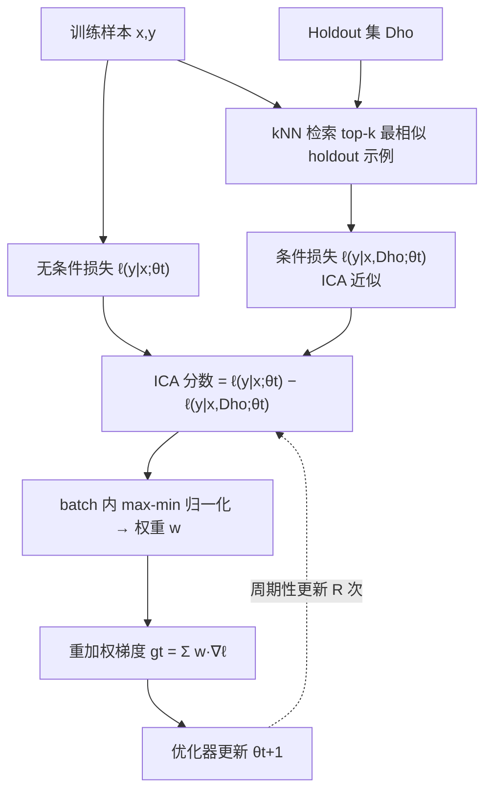

# Holdout-Loss-Based Data Selection for LLM Finetuning via In-Context Learning

**会议**: ICLR 2026  
**OpenReview**: [https://openreview.net/forum?id=Cw9Bxpda2h](https://openreview.net/forum?id=Cw9Bxpda2h)  
**代码**: [https://github.com/microsoft/HeurAgenix/tree/dpo](https://github.com/microsoft/HeurAgenix/tree/dpo)  
**领域**: LLM 对齐 / 数据选择 / 微调  
**关键词**: 数据选择, holdout loss, in-context learning, 梯度重加权, SFT, DPO, SimPO  

## 一句话总结
用上下文学习（把 holdout 集当作 in-context 示例）来近似"某条样本训练后会带来的 holdout 损失"，从而无需参考模型、无需重训就能给每条微调样本打分并动态重加权梯度，让 SFT/DPO/SimPO 的对齐效果稳定提升、额外开销仅约 1.5%。

## 研究背景与动机
**领域现状**：微调（SFT + 偏好对齐如 RLHF/DPO/SimPO）是把预训练 LLM 拉向人类意图的标准做法，而数据质量直接决定对齐信号的清晰度。学界已反复发现"小而精"的数据集往往能匹敌大而杂的数据集，因此如何系统地挑出高价值训练样本成为关键问题。

**现有痛点**：偏好数据里有 20–40% 是噪声标注，对齐性能对这种噪声高度敏感。但现有的数据选择方法各有硬伤——影响函数类（LESS、GREATS）依赖一阶泰勒展开，批量选择时假设容易被违反、还要额外算力控误差；代理模型/双层优化/元学习类要么训练昂贵要么缺理论支撑；启发式质量打分缺乏与下游性能的严格联系。

**核心矛盾**：理论上最该用的指标是"某条样本训练后模型在 holdout 集上的损失下降了多少"（即 holdout loss），因为这直接对应微调的最终目标；但**朴素计算它需要对每个候选子集都重训一遍并评估，计算上完全不可行**。RHO-Loss 用贝叶斯公式把这个量化简了，但仍要单独训练一个参考模型，且固定的参考模型会给"样本贡献估计"引入偏差。

**本文目标**：设计一个有原则、省资源、且能随模型演化动态更新的数据选择/重加权框架，既要保留 holdout loss 这个理论锚点，又要彻底去掉参考模型与重训成本。

**核心 idea（In-Context Approximation, ICA）**：借助"in-context learning 能诱导出类似梯度更新的模型行为"这一观察（Dai et al. 2023），**直接把 holdout 集塞进上下文当作示例，用条件损失去近似"在 holdout 上训练后"的损失**，从而把昂贵的重训替换成一次额外前向传播。

## 方法详解

### 整体框架
方法把数据选择重铸成"给每条样本打分"的问题：贪心地逐条加样本时，最该加的就是能让 holdout 损失下降最多的那条。借助 RHO-Loss 的贝叶斯化简，这个"holdout 损失分数"可写成"当前模型在该样本上的损失"减去"在 当前数据∪holdout 上训练后的模型在该样本上的损失"。前一项现成可算，难点全在后一项——本文用 ICA 把它近似成"把 holdout 集当 in-context 示例时的条件损失"，于是整条评分既不用参考模型也不用重训。打完分后再用 max-min 归一化转成 [0,1] 权重，重加权整个 batch 的梯度。

### 关键设计

**1. 贝叶斯化简：把"重训后的 holdout 损失"变成逐样本可算的分数。** 直接求解 $\bar{D}^\star = \arg\min_{\bar D\subset D} L(D_{ho};\theta^\star(\bar D))$ 需要遍历所有子集重训，不可行。本文沿用 RHO-Loss 的贝叶斯框架：以负对数似然为损失，在条件独立假设下用贝叶斯法则把"加入样本 $(x,y)$ 后的 holdout 损失"展开为 $\ell(y|x;\theta^\star(D_t\cup D_{ho})) - \ell(y|x;\theta_t) - L(D_{ho};\theta_t)$。丢掉与 $(x,y)$ 无关的常数项并反号，就得到逐样本的 holdout-loss 分数 $s_{ho}(x,y;\theta_t)=\ell(y|x;\theta_t)-\ell(y|x;\theta^\star(D_t\cup D_{ho}))$。这一步把"全局重训"问题降维成"每条样本两个损失之差"，但第二项里那个 $\theta^\star(D_t\cup D_{ho})$ 仍意味着要在每个选择步重训——这正是 ICA 要解决的瓶颈。

**2. In-Context Approximation：用上下文示例替代重训。** 核心创新是把 $\ell(y|x;\theta^\star(D_t\cup D_{ho}))\approx \ell(y|x,D_{ho};\theta_t)$，即"在 holdout 上训练后的损失"用"把 holdout 集当 in-context 示例时的条件损失"来近似。直觉来自 ICL 能模拟梯度更新效果：与其真的拿 holdout 去更新参数，不如把它当作 demonstration 喂进上下文，让模型"假装已经学过"。由此得到 ICA 分数 $s_{ICA}(x,y;\theta_t):=\ell(y|x;\theta_t)-\ell(y|x,D_{ho};\theta_t)$。这个分数完全省掉了参考模型与额外微调，且**因为它依赖当前 $\theta_t$，能随模型演化动态重新评估每条样本的价值**——这是固定参考模型的 RHO-Loss 做不到的。该框架同样适用于偏好对（DPO/SimPO），此时 $y$ 是偏好对 $(y_w,y_l)$，损失换成对应的 Bradley-Terry 形式。

**3. batch 内 max-min 归一化重加权，而非硬筛选。** 实际训练是按 batch 而非逐条选样本。本文不做"只留 top 样本"的硬筛选（会损失 batch 多样性、忽略样本间交互），而是把整个 batch 的 ICA 分数通过 max-min 归一化 $w(x_i,y_i;\theta_t)=\frac{s_i-\min_j s_j}{\max_j s_j-\min_j s_j}$ 转成 $[0,1]$ 权重，再缩放各样本对 batch 梯度的贡献 $g_t=\sum_i w(x_i,y_i)\nabla_\theta\ell(x_i,y_i)$。**选 max-min 而非 softmax 是有意为之**：softmax 的指数放大会扭曲高/低分样本的相对差异，而 max-min 保留了线性的相对差距、训练更稳。消融显示重加权确实优于百分位过滤。

**4. 两个工程加速：kNN 截断 + 周期更新。** 把整个 holdout 集塞进上下文常因长度受限不可行，本文用 kNN 在嵌入空间（默认 all-mpnet-base-v2）为每条候选只挑 top-$k$ 个最相似的 holdout 示例（默认 $k=3$）；同时不在每步都算分，而是整个训练过程只周期性更新 $R$ 次（默认 $R=1$，仅初始化时算一次）。即使有这两层近似，方法仍稳定提升对齐效果，且把额外开销压到约 1.5%。

## 实验关键数据

### 主实验
覆盖 SFT / DPO / SimPO 三种范式，骨干含 LLaMA-3-3B/8B-Instruct、Qwen-3-4B/8B，用 GPT-4o 判定的 win rate（>50% 即本方法更优）。

**SFT（表 1，win rate %）：**

| 模型 | Alpaca vs w/o | vs RHO-Loss | vs One-Shot | Yahoo vs w/o | vs RHO-Loss | vs One-Shot |
|------|------|------|------|------|------|------|
| LLaMA 3B | 77.81 | 48.96 | 57.03 | 78.90 | 46.73 | 62.33 |
| LLaMA 8B | 80.55 | 49.92 | 62.11 | 85.10 | 54.03 | 66.93 |
| Qwen 4B | 71.21 | 50.56 | 56.82 | 80.30 | 49.93 | 58.73 |
| Qwen 8B | 82.92 | 51.21 | 58.33 | 82.93 | 54.43 | 63.13 |

**DPO（表 2，win rate %）：**

| 模型 | UltraFeedback vs w/o | vs RHO-Loss | vs One-Shot | SHP-2 vs w/o | vs RHO-Loss | vs One-Shot |
|------|------|------|------|------|------|------|
| LLaMA 3B | 61.05 | 46.85 | 57.60 | 79.90 | 56.70 | 60.20 |
| LLaMA 8B | 64.00 | 48.25 | 58.40 | 77.20 | 48.70 | 55.10 |
| Qwen 4B | 64.30 | 51.90 | 54.60 | 79.20 | 49.90 | 57.00 |
| Qwen 8B | 64.85 | 49.90 | 60.45 | 70.40 | 47.60 | 54.40 |

SimPO（表 3）趋势一致，对 w/o 普遍 62–94%，对 One-Shot 多在 50% 以上。**关键结论**：相对标准训练（w/o）全面大幅领先；相对 One-Shot 稳定 >50%、常超 60%；相对 RHO-Loss 在不需要参考模型的前提下打平甚至略优。对比影响函数类 LESS / GREATS（Yahoo 上 8B 模型），win rate 略高于 50%，性能相当但更省算力。

### 消融实验

| 维度 | 设置与结果 | 结论 |
|------|------|------|
| holdout 示例数 $k$ | $k=1$:43.5%, $k=5$:48.0%, $k=10$:46.0%（vs 默认 $k=3$） | 少量示例已足够，$k$ 过大反引入不相关样本 |
| 评分更新次数 $R$ | $R=3$:50.73%, $R=5$:52.77%, $R=9$:51.6%（vs 默认 $R=1$） | 多更新略有提升，但极频繁（$R=9$）无必要 |
| 重加权 vs 过滤 | 75 分位:48.67%, 50 分位:40.80%, 90 分位:40.07% | 硬过滤普遍 <50%，自适应重加权更优且免调阈值 |
| 嵌入模型 | bge-m3:52% vs 默认 all-mpnet-base-v2 | 更强嵌入能进一步提升 |

### 关键发现
- **算力开销极低**：本方法仅 ~1.5% 额外开销，RHO-Loss ~10%、One-Shot ~4%（4×A6000 上 LLaMA-3B 实测）。
- **抗噪能力**：在 GSM8K 故意污染 CoT 标注的实验里，对污染集用本方法重加权能逼近"在原始高质量集上训练"的表现，说明能从噪声数据里挑出有价值样本。
- **权重动态稳定**：ICA 权重大多在训练早期变化、后期趋稳（首次更新与后续相关系数 0.89/0.75/0.69/0.71），故无需频繁重算分数。
- **分数分布合理**：当 holdout 取自 Sports 主题时，Sports 域样本获得更高分，验证打分确实对齐目标分布。

## 亮点与洞察
- **把 ICL 当"虚拟训练"用**：最巧妙之处是把"在 holdout 上微调后的损失"近似成"把 holdout 当上下文示例时的条件损失"，用一次前向传播替代一次重训，理论锚点（holdout loss）和 RHO-Loss 一致，却砍掉了参考模型这个最大成本。
- **动态性**：因为分数随当前模型 $\theta_t$ 变化，本方法天然支持"随模型演化重新评估样本价值"，比 RHO-Loss 的固定参考模型更贴合真实训练动态、也减小偏差。
- **统一覆盖 SFT 与偏好对齐**：同一套贝叶斯+ICA 框架通过把 $y$ 换成偏好对、损失换成 BT 形式，无缝迁移到 DPO/SimPO，泛用性强。
- **工程上"小动作大收益"**：kNN top-3 截断 + 仅初始化打一次分这两个看似激进的近似，几乎不掉点却把开销压到 1.5%，非常实用。

## 局限与展望
- **依赖高质量 holdout 集**：整套方法的有效性建立在有一个干净、有代表性的 holdout 集上；若 holdout 本身有噪声或不具代表性，即使对齐看起来很好，对未见数据的泛化也可能受损。
- **不适用 on-policy 设置**：实验全为 off-policy（SFT/DPO/SimPO）。直接套到 on-policy 方法（如 PPO）会因为新生成数据需频繁重算所有分数而形成严重算力瓶颈，作者将其列为未来方向。
- **评估以 GPT-4o win rate 为主**：尽管补充了 PPL/BERTScore 作绝对指标，主结果仍重度依赖模型评审，且每个配置只训练评估一次（算力所限），存在一定方差。
- **ICA 近似的理论保证有限**：用 in-context 条件损失替代"训练后损失"主要靠 Dai et al. 的经验观察支撑，近似误差在不同任务/模型上的边界尚未严格刻画。

## 相关工作与启发
- **RHO-Loss（Mindermann et al. 2022）**：本文最直接的基础与对标对象，提供了 holdout 损失的贝叶斯化简；本文最大改进是用 ICA 去掉它的参考模型并支持动态打分。
- **影响函数类（LESS、GREATS、TracIn）**：用一阶泰勒展开近似性能变化，批量选择时假设易破、需额外控误差；本文从贝叶斯而非一阶展开出发，规避了这层开销。
- **One-Shot Learning（Li et al. 2023b）**：同样用 ICL 打分（one-shot 损失减 zero-shot 损失），但机制不同；本文在所有设置上稳定优于它。
- **ICL 模拟梯度（Dai et al. 2023）**：提供了"上下文示例 ≈ 梯度更新"的关键直觉，是 ICA 成立的理论依据。
- **启发**：把"昂贵的训练操作"用"一次前向 + 上下文工程"近似的思路，可能迁移到课程学习、主动学习、数据清洗等任何需要"反事实训练评估"的场景。

## 评分
- **新颖性**: ⭐⭐⭐⭐ — 把 ICL 当作 holdout-loss 重训的轻量替代品，是对 RHO-Loss 简洁而有洞察力的改进，去参考模型 + 动态打分两点都很漂亮。
- **实验充分度**: ⭐⭐⭐⭐ — 覆盖 SFT/DPO/SimPO、LLaMA/Qwen 两族多尺度、高质量与领域相关两种场景，消融（$k$、$R$、过滤、嵌入、开销、噪声）扎实；但主指标偏重 GPT 评审且单次运行。
- **写作质量**: ⭐⭐⭐⭐ — 从 holdout loss 到贝叶斯化简再到 ICA 的推导链条清晰，算法与实现技巧交代完整。
- **价值**: ⭐⭐⭐⭐ — 仅 1.5% 开销即可稳定提升对齐、且无需参考模型，对资源受限的微调数据筛选很有实用价值；on-policy 不适用是主要落地限制。

<!-- RELATED:START -->

## 相关论文

- [\[ICLR 2026\] Data Selection for LLM Alignment Using Fine-Grained Preferences](data_selection_for_llm_alignment_using_fine-grained_preferences.md)
- [\[ACL 2026\] What Makes Good Instruction-Tuning Data? An In-Context Learning Perspective](../../ACL2026/llm_alignment/what_makes_good_instruction-tuning_data_an_in-context_learning_perspective.md)
- [\[AAAI 2026\] Importance-Aware Data Selection for Efficient LLM Instruction Tuning](../../AAAI2026/llm_alignment/importance-aware_data_selection_for_efficient_llm_instruction_tuning.md)
- [\[ACL 2026\] Alignment Data Map for Efficient Preference Data Selection and Diagnosis](../../ACL2026/llm_alignment/alignment_data_map_for_efficient_preference_data_selection_and_diagnosis.md)
- [\[ICLR 2026\] Humanline: Online Alignment as Perceptual Loss](humanline_online_alignment_as_perceptual_loss.md)

<!-- RELATED:END -->
