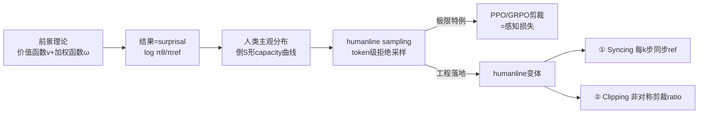

# Humanline: Online Alignment as Perceptual Loss

**会议**: ICLR 2026  
**OpenReview**: [https://openreview.net/forum?id=FONB5dIxSB](https://openreview.net/forum?id=FONB5dIxSB)  
**代码**: 待确认  
**领域**: LLM 对齐 / 偏好优化  
**关键词**: 在线对齐, 离线对齐, 前景理论, 感知损失, GRPO, DPO, KTO, 拒绝采样, 剪裁  

## 一句话总结
本文用行为经济学的**前景理论**解释"在线对齐为何强于离线对齐"——在线 on-policy 采样更接近人类对模型输出的主观感知分布，而 PPO/GRPO 的剪裁恰好隐式恢复了这种感知偏差，因此它们本质上已是"感知损失"；据此提出一个把感知失真显式注入 DPO/KTO/GRPO 的设计范式（humanline 变体），让离线 off-policy 数据也能匹配在线性能，同时训练快达 6×。

## 研究背景与动机
- **领域现状**：后训练对齐分两类——离线 off-policy（DPO、KTO，闭式损失、数据静态、便宜稳定）与在线 on-policy（PPO、GRPO，边训边采样边打分）。近年共识是在线方法性能天花板更高，但代价是更多算力、更长训练时间和更强不稳定性。
- **现有痛点**：业界只知道"在线更好"，解释却众说纷纭——数据覆盖更全、强调生成而非判别、策略搜索空间更简单等。这些解释都根植于 RL 理论，但都没回答一个更根本的问题：如果目标是**最大化模型对人类的效用**，在线/离线这个二分本身是否真的重要？
- **核心矛盾**：在线采样反映的是策略"字面上能产出什么"，而非"人类感知它能产出什么"。人会系统性高估极端结果、低估典型结果（前景理论）——所以连在线 on-policy 数据本身都不是最优的。
- **本文目标**：给出一个以人为中心的统一解释，并据此打破"必须用在线数据"的束缚，让数据可以来自任何地方（在线/离线/on-policy/off-policy），只要使用方式模仿人类感知即可，从而让后训练更快、更便宜、更灵活。
- **核心 idea**：**【感知损失视角】** 把对齐看成"在人类主观感知分布上"做优化；**【剪裁=感知偏差】** 证明 PPO/GRPO 的剪裁是前景理论加权函数的一个特例；**【humanline 设计范式】** 用"参考模型同步 + 非对称剪裁"两步，把感知失真显式注入任意带参考模型的对齐目标。

## 方法详解

### 整体框架
本文先在理论上把对齐重述为"前景理论效用最大化"：输出 $y$ 的"结果"被定义为 surprisal $z_{x,y}=\log[\pi_\theta(y|x)/\pi_{\text{ref}}(y|x)]$（单位是 nats），人类对这些结果的主观感知由前景理论的价值函数 $v$ 和加权函数 $\omega$ 刻画。论文证明：要逼近人类主观效用，最直接的办法就是按主观分布采样——而在线 on-policy 采样恰好比离线 off-policy 更接近这个分布。接着把"按主观分布采样"实现为一种 token 级拒绝采样（humanline sampling），并证明 PPO/GRPO 的剪裁是它的极限特例。最后把理论落地成一个工程化的设计范式：humanline syncing + humanline clipping。

### 关键设计

**1. 前景理论解释在线优于离线：感知分布是那条倒 S 曲线。** 前景理论指出人对概率的感知由 capacity 函数 $\Omega^+(a;\gamma)=a^\gamma/(a^\gamma+(1-a)^\gamma)^{1/\gamma}$ 扭曲（$\gamma\in(0,1)$ 时呈倒 S 形，高估极端、低估典型）。把它套到生成模型上，作者论证在线 on-policy 采样得到的隐含 capacity 曲线（虚线）能松散地贴合人类感知曲线（实线），而离线 off-policy 会显著偏离：用比当前策略**差**的模型采样，输出 surprisal 偏低，隐含曲线饱和过快；用比当前策略**好**的模型采样则饱和过慢。Proposition 3.4 进一步给出界——只要候选分布 $Q$ 与感知权重 $\omega$ 的 KL 足够小（$\sqrt{\text{KL}(\omega\|Q)}\le\delta/(\sqrt2\|v\|_\infty)$），就能保证主观效用逼近。这把"在线为何更好"翻译成了一句话：它离人类感知分布更近。

**2. humanline sampling：用拒绝采样模拟人类感知分布。** 既然拿不到任何人的真实感知分布，就改造标准拒绝采样去模拟前景理论里的那个分布。Proposition 4.1 给出单边判据：当 $\pi_\theta(y_t)/\pi_{\text{ref}}(y_t)<M'_\theta B$（$B\sim\text{Beta}(\gamma,1)$）时拒绝该 token。但训练中直接拒绝会带来三个工程问题——在线时参考/策略都在变、只重采被拒 token 会破坏序列连贯性、置零被拒 token 会扰乱 KTO 这类序列级损失的饱和动态。为此作者给出双边版定义（公式 5）：当 $\frac{\pi_\theta(y_t)}{\pi_{\text{ref}}(y_t)}<M_P B_P$ 或 $\frac{\pi_{\text{ref}}(y_t)}{\pi_\theta(y_t)}<M_R B_R$ 时，**不删除 token 而是把它从计算图里 detach**（停止梯度），既保住序列完整又不让被拒 token 影响 $\theta$ 更新。$\gamma_P,\gamma_R$ 还隐式控制探索-利用权衡（$\gamma_P<\gamma_R$ 偏利用）。

**3. 剪裁恢复感知偏差：PPO/GRPO 本就是感知损失。** Theorem 4.3 证明 PPO/GRPO 的剪裁项是 humanline sampling 在极限条件下的特例——存在一种构造使得"从 Beta 分布采样"退化为"确定性地取其均值"，于是两条单边判据合并成一个区间，正好对应剪裁的 $[1-\epsilon,1+\epsilon]$ 范围，区间外梯度为零（剪裁靠导数为零，humanline 靠显式停梯度）。这就给了"剪裁原本只为稳定训练、却意外恢复了人类感知偏差"一个理论解释。但 PPO/GRPO 的未剪裁分量仍让区间外比率影响梯度，要更彻底地注入这个偏差，得在损失**上游**就剪裁比率。

**4. humanline 设计范式：syncing + clipping 两步落地。** 把上述理论变成可加到任意带参考模型目标（DPO/KTO/GRPO）上的两步改造。**① humanline syncing**：每 $k$ 步在算完损失、优化器更新前，把 $\pi_{\text{ref}}$ 同步成 $\pi_\theta$（图 3）；因为 surprisal 的"标尺"参考模型必须随策略漂移而更新，$k$ 越小性能越好但越不稳。**② humanline clipping**：在 token 级比率 $\pi_\theta(y_t)/\pi_{\text{ref}}(y_t)$ 喂进损失**之前**就把它剪裁到可非对称的 $[\epsilon_P,\epsilon_R]$（在 log 空间剪以保精度），像 GRPO 这种本就剪裁的目标会被剪两次。相比 §4 的 humanline sampling，clipping 更快（不分配新张量）、超参更少、更稳定且性能相当，所以最终落地用 clipping。该变体既能配在线数据（online+humanline）也能配离线数据（offline+humanline）；没有参考模型的目标（如 SimPO）无法构造 humanline 变体。

## 实验关键数据

### 主实验：指令遵循（不可验证奖励）
Llama3-8B-Instruct 在 UltraFeedback ArmoRM 上对齐，AlpacaEval2 长度控制胜率（GPT-4.1 当裁判）：

| 目标 | offline → online 提升 | offline+humanline |
|------|----------------------|-------------------|
| DPO | +1.4× | 与 online 持平 |
| KTO | +1.3× | 与 online 持平 |
| GRPO | +1.6× | 与 online 持平 |

- offline+humanline 显著优于 offline（$p<0.05$）并与 online 持平；其中 humanline GRPO 比 offline GRPO 好 1.6×。
- online+humanline 仅略好于 online（符合理论：在线数据本就离感知分布近，边际收益小）。
- offline+humanline GRPO 训练比 online 快 **6× 以上**且性能相当（online GRPO 是 offline 的 12× 墙钟时间）；提升在 27B 规模和不同模型家族上依然成立。

### 数学推理（可验证奖励）
Qwen2.5-1.5B-Instruct 在 MATH500 上对齐：

| 设置 | 表现 |
|------|------|
| online GRPO（每步采样） | Pass@1 = 0.593 ± 0.019 |
| 64× 更稀疏采样 + 普通 GRPO | 显著变差（$p<0.05$） |
| 64× 更稀疏采样 + humanline GRPO | 1000 步内追平，1600 步 Pass@1 = 0.593 ± 0.019 |

- humanline GRPO 允许采样频率降低 **64×**而无性能损失；剪裁范围沿用 $\log\epsilon_P=-1.5,\log\epsilon_R=1.5$，是跨任务的强默认值。
- 同步太频繁（$k=1$）会导致奖励崩溃；$k\in[12,24]$ 既追平在线又避免崩溃。

### 消融实验

| 移除项 | 效果 |
|--------|------|
| 去 humanline syncing | 退化到接近 offline 水平（最关键成分） |
| 去 humanline clipping | 仍无法追平 online（syncing 单独不够） |
| humanline sampling vs clipping | 性能相当，但 clipping 更稳更简单 |

### 关键发现
- **syncing 贡献了大部分提升**，但 clipping 是闭合最后差距的必要补充；$k=4$ 仍无性能损失。
- **数据质量仍然重要**：输出在 $\pi_{\text{ref}}$ 下（训练前）的平均 token log-prob 是离线数据是否"够好"的良好代理；最低四分位（$[-1.03,-0.36]$）的数据训练效果显著更差。
- humanline 变体不需改方法专属超参，但学习率/最大梯度范数需按情况调 0.1×–4×。

## 亮点与洞察
- **跨学科解释力**：用前景理论给"在线 vs 离线"这个纯工程经验现象一个以人为中心的统一解释，与既有 RL 理论解释互补而非冲突。
- **"剪裁本是感知损失"是个漂亮的事后顿悟**：PPO/GRPO 剪裁原本只为稳定训练，却被证明恰好恢复了前景理论的概率扭曲，把工程 trick 升格为理论必然。
- **解耦数据来源与性能**：核心论点"在线/离线二分是 incidental 的，关键是数据是否反映人类感知分布"具有方法论意义——它把对齐从"必须在线采样"的算力枷锁中解放出来。
- **工程上极轻量**：syncing + clipping 都是几行改动，可即插即用到 DPO/KTO/GRPO，6× 加速且不掉点，落地性强。

## 局限与展望
- offline+humanline 能匹配 online 仍是**经验规律而非形式保证**；除平均 token log-prob 外，还有哪些指标能量化"好数据"，以及是否存在必须在线 on-policy 的场景，都待研究。
- 前景理论源于货币情境，作者**假设**其形状能平移到生成模型的大输出空间，这一假设无理论保证（在大词表上实测人类感知偏差不可行）；发展专门面向生成模型的人类概率感知理论是重要方向。
- 系统层面尚未量化"训练/推理/打标完全异步重叠"能带来多大收益；同步成本能否降低（如只同步部分权重）、$\gamma$ 是否应个性化，都是开放问题。

## 相关工作与启发
- **前景理论 → 对齐**：延续 Ethayarajh et al. (2024, KTO) 把前景理论引入对齐的思路，但 KTO 忽略了加权函数（假设概率感知客观），本文正是补上了被忽略的加权函数这一块。
- **在线/离线对齐**：与 online DPO、offline PPO 等"互相借鉴"的工作相关，但本文不是再造一个混合方法，而是论证二分本身不重要。
- **剪裁技术**：多次剪裁（Team et al., 2025）与非对称剪裁（Yu et al., 2025）此前都有人探索，但 humanline clipping 的具体形式（上游剪裁 + 感知理论解释）是新的。
- **启发**：这条"把心理学/行为经济学先验显式编码进损失函数"的路线，对其他偏好建模、奖励塑形任务有借鉴价值——当目标涉及人类判断时，建模"人如何感知"可能比建模"客观分布"更对齐真实效用。

## 评分
- **新颖性**: ⭐⭐⭐⭐⭐ 用前景理论给出在线优于离线的全新解释，并证明剪裁=感知偏差，视角极具原创性。
- **实验充分度**: ⭐⭐⭐⭐ 覆盖可验证/不可验证两类任务、三种目标、多规模多模型家族，消融完整；但数学推理仅用了 1.5B 小模型。
- **写作质量**: ⭐⭐⭐⭐⭐ 理论铺陈层层递进、图示清晰、把抽象前景理论讲得直观易懂。
- **价值**: ⭐⭐⭐⭐⭐ 让离线数据匹配在线性能且快 6×、采样稀疏 64×，对降低后训练成本有直接且广泛的实用价值。

<!-- RELATED:START -->

## 相关论文

- [\[ICLR 2026\] Enforcing Axioms for AI Alignment under Loss-Based Rules](enforcing_axioms_for_ai_alignment_under_loss-based_rules.md)
- [\[ICLR 2026\] Holdout-Loss-Based Data Selection for LLM Finetuning via In-Context Learning](holdout-loss-based_data_selection_for_llm_finetuning_via_in-context_learning.md)
- [\[ACL 2026\] Topology-Enhanced Alignment for Large Language Models: Trajectory Topology Loss and Topological Preference Optimization](../../ACL2026/llm_alignment/topology-enhanced_alignment_for_large_language_models_trajectory_topology_loss_a.md)
- [\[AAAI 2026\] When Human Preferences Flip: An Instance-Dependent Robust Loss for RLHF](../../AAAI2026/llm_alignment/when_human_preferences_flip_an_instance-dependent_robust_loss_for_rlhf.md)
- [\[NeurIPS 2025\] Provably Efficient Online RLHF with One-Pass Reward Modeling](../../NeurIPS2025/llm_alignment/provably_efficient_online_rlhf_with_one-pass_reward_modeling.md)

<!-- RELATED:END -->
