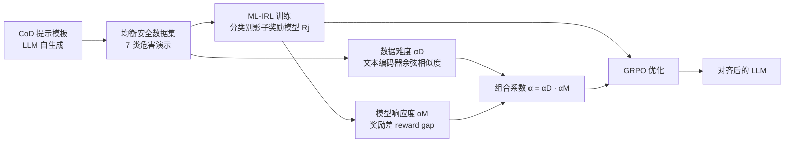

# Inverse Reinforcement Learning with Dynamic Reward Scaling for LLM Alignment

**会议**: ICLR 2026  
**OpenReview**: [https://openreview.net/forum?id=K0Zh6mzTzc](https://openreview.net/forum?id=K0Zh6mzTzc)  
**代码**: 待确认  
**领域**: LLM 对齐 / 安全对齐  
**关键词**: 逆强化学习, 动态奖励缩放, GRPO, 安全对齐, 影子奖励模型, 长尾威胁  

## 一句话总结
DR-IRL 用逆强化学习从「均衡的安全演示数据」训练分类别的影子奖励模型，再给 GRPO 的优势函数乘上一个由「数据难度 × 模型响应度」共同决定的动态系数，把优化火力集中到长尾、高难度的有害样本上，从而在不牺牲（甚至提升）通用能力的前提下显著增强安全对齐。

## 研究背景与动机
**领域现状**：LLM 对齐主要分两条路线——奖励式（先在偏好对上训奖励模型，再用 PPO/GRPO 等 RL 优化）与免奖励式（直接在排序输出上微调，如 DPO）。近期研究发现调好的奖励式管线在多样基准上更鲁棒，而且单条演示数据（demonstration，输入配一条示范回复）训出的奖励甚至能超过昂贵的成对偏好数据。

**现有痛点**：作者指出两个被忽视的关键缺陷。其一，**安全训练集严重失衡**——常见危害（如辱骂）被大量过采样，而长尾威胁（如隐私、伦理）样本稀少，导致模型对罕见高危场景防护薄弱。其二，**奖励模型是静态的**——固定奖励对所有样本一视同仁，完全忽略任务难度，使简单样本和困难样本承受相同的更新压力，限制了优化效率和可达上限。

**核心矛盾**：罕见但高影响的长尾威胁恰恰是最该被重点优化的，但失衡数据 + 静态奖励的组合反而让它们「训练不足」；与此同时盲目加大权重又会在高不确定性样本上引发训练不稳定。

**本文目标**：构造均衡安全数据并让奖励随任务难度自适应缩放，在提升安全性的同时尽量压低 alignment tax（对通用能力的损害）。

**核心 idea（DR-IRL = Dynamically adjust Reward via IRL）**：用 IRL 把演示数据转成分类别奖励模型，并在 GRPO 优化中按「数据层难度（文本编码器余弦相似度）」与「模型层响应度（奖励差）」相乘得到的系数动态缩放优势函数。

## 方法详解

### 整体框架
DR-IRL 分三步：先用 CoD（Chain-of-Draft）提示模板让 LLM 自己生成覆盖 7 类危害的**均衡安全演示数据集**；再用 ML-IRL 在该数据集上为每个类别训练一个专用「影子奖励模型」；最后在 GRPO 对齐时，为每个问题计算一个组合难度系数 $\alpha$，把它乘进优势函数，让优化自适应地聚焦长尾难样本。

### 关键设计

**1. 用 ML-IRL 训练分类别影子奖励模型：把演示数据等价转成 RLHF 式对比信号。** DR-IRL 不依赖昂贵的成对偏好标注，而是把奖励与策略的联合学习写成最大似然 IRL 的双层优化 $\max_\theta \mathbb{E}_{(x,y)\sim D}[\log \pi_\theta(y|x)]$，下层约束 $\pi_\theta$ 在奖励 $r(x,y;\theta)$ 减去 KL 正则下取最优。借助 Li et al. (2024) 的结论，该问题等价于一个极小极大形式 $\max_\theta \min_\pi \mathbb{E}_{(x,y)\sim D,\tilde y\sim\pi}\big[\tfrac{r(x,y;\theta)-r(x,\tilde y;\theta)}{\beta}+D_{KL}(\pi\|\pi_{ref})\big]$——这意味着即便只有单条演示，公式里仍在对比「演示回复 $y$」和「策略采样回复 $\tilde y$」两个奖励，本质与 RLHF 同构。关键差异在于：作者**为 7 个危害类别各训练一个独立的影子奖励模型**，且把 IRL 仅用于预训练奖励（与 Li et al. 同时做奖励学习+策略对齐不同），让每类有害提示都有量身定制的精确奖励信号。

**2. 双视角难度度量：数据层语义可分性 × 模型层奖励差。** 难度由两个弱相关信号联合刻画。**数据难度**衡量演示回复与策略生成回复的语义差异：先把成对回复拆成自包含子句集，用文本编码器 $\Phi$ 算子句间余弦相似度 $s_{k,l}=\cos(\Phi(S^k),\Phi(\tilde S^\ell))$，取每个子句对另一集合的最大相似 $s_k^{max}$ 并平均得整体相似度 $W_{ji}$，再以差异 $\delta_{ji}=1-W_{ji}$ 归一化为 $\alpha^D_{ji}=\sigma(\delta_{ji})/\sigma(\bar\delta_j)$。**模型响应度**用影子奖励模型的奖励差 $R_{ji}=R_j(q,o)-R_j(q,\tilde o)$ 度量，并用掩码 $M$ 剔除奖励差异常大/小的离群样本后求均值 $\bar R_{P_j}$，归一化为 $\alpha^M_j=\sigma(\bar R_{P_j})/\sigma(\bar R_j)$。直觉上 $\alpha^D$ 大代表样本易分、置信高，$\alpha^M$ 大代表模型当前已能清晰区分。

**3. 乘性门控的组合系数：只有「内容难且模型仍不确定」才被重点优化。** 两个信号相乘得组合难度 $\alpha_{ji}=\alpha^D_{ji}\cdot\alpha^M_j$。作者强调用乘法而非加法是刻意的——乘性形式起到门控作用：只有当一个样本**同时**内容上有区分度、模型上仍存在不确定时才会被放大，从而防止平凡样本或过度自信样本主导更新，比加性方案约束更严、对训练更稳。由于两信号源自同一数据集但视角不同、相关性弱，其乘积构成一个保守的联合判据，在安全与效用间取平衡。

**4. 动态缩放 GRPO 优势函数：把优化火力导向长尾难样本。** 标准 GRPO 用组内相对得分替代 critic，但静态奖励让所有样本承受同等更新压力，罕见高危威胁被训练不足。DR-IRL 把组合系数乘进优势函数：$A_i^j=\alpha_j(q)\cdot\frac{R_{j,i}-\text{mean}(\{R_{j,\cdot}\})}{\text{std}(\{R_{j,\cdot}\})}$，再以裁剪式 GRPO 目标 $J^j_{\text{DR-IRL}}(\theta)$（含 PPO 风格 clip 与 KL 正则 $\beta D_{KL}(\pi_\theta\|\pi_{ref})$）迭代更新策略。每个类别用各自的影子奖励模型单独对齐，使优化自适应地集中在最具挑战、长尾的样本上，同时避免在平凡样本上过优化。

## 实验关键数据

### 主实验表格
在 Llama-3.1-8B-Instruct 与 Qwen-2-7B-Instruct 上对比 4 个 harmlessness + 4 个 helpfulness 基准（StrongReject 报 goodness 分，XsTest/WildChat/Stereotype 报拒答率）：

| 方法 (Llama-3.1-8B) | StrongReject | XsTest | WildChat | Stereotype | AdvGLUE | GSM8k | HHH |
|---|---|---|---|---|---|---|---|
| Base | 0.4054 | 88.00% | 47.94% | 87.37% | 58.33% | 85.60% | 82.50% |
| DPO | 0.5054 | 86.00% | 54.79% | 97.89% | 66.27% | 84.15% | 83.84% |
| SACPO | 0.7264 | 88.50% | 58.45% | 96.84% | 65.60% | 86.50% | 85.21% |
| GRPO | 0.8105 | 91.50% | 55.61% | 96.91% | 66.93% | 82.37% | 84.50% |
| STAIR | 0.8798 | 99.00% | 69.86% | 96.84% | 69.20% | 87.64% | 85.66% |
| **DR-IRL** | **0.9361** | **99.00%** | **74.21%** | **98.87%** | **70.71%** | **88.10%** | **86.16%** |

DR-IRL 在两个模型上都把 StrongReject 推到最高（Llama 0.9361 / Qwen 0.8798），几乎在所有 harmlessness 基准上领先，同时在 AdvGLUE、GSM8k、HHH 上刷新 SOTA，有效降低 alignment tax。

### 消融实验表格
作者以「GRPO → +IRL → +动态缩放(DR-IRL)」逐步消融（Llama-3.1-8B）：

| 变体 | StrongReject | WildChat | AdvGLUE | GSM8k | HHH |
|---|---|---|---|---|---|
| GRPO（静态奖励） | 0.8105 | 55.61% | 66.93% | 82.37% | 84.50% |
| + IRL（影子奖励，仍静态缩放） | 0.8917 | 67.54% | 68.27% | 87.13% | 85.13% |
| + 动态缩放（**DR-IRL**） | **0.9361** | **74.21%** | **70.71%** | **88.10%** | **86.16%** |

两个组件各有明显贡献：换上 IRL 影子奖励把 StrongReject 从 0.8105 提到 0.8917，再加动态难度缩放进一步提到 0.9361，且 helpfulness 指标同步上升而非此消彼长。

### 关键发现
- CoD 演示 + 分类别 IRL 奖励本身就强于静态 GRPO，说明「均衡演示数据 + 量身定制奖励」是安全收益的主要来源。
- 动态缩放在最难的 WildChat 高毒提示上增益最大（+6.67 个点），印证其「把火力导向长尾难样本」的设计意图。
- DR-IRL 在 7 类危害的逐类拒答率上全面领先 Base/SFT/GRPO/STAIR，长尾类别提升尤为明显。

## 亮点与洞察
- **乘性门控的设计哲学很到位**：把「内容难度」与「模型不确定度」两个弱相关视角相乘，天然过滤掉「平凡样本」和「模型已自信样本」，比加性融合更能避免误把简单样本当难样本而过训。
- **难度信号不引入额外标注**：数据难度来自现成文本编码器的余弦相似度，模型响应度来自已训好的影子奖励模型，几乎零额外成本就实现了课程式的自适应加权。
- **安全与效用同涨而非权衡**：多数安全对齐方法会牺牲 GSM8k/通用能力，DR-IRL 反而同步提升，说明聚焦长尾难样本的优化没有「过拟合到拒答」。

## 局限与展望
- 影子奖励模型按类别各训一个（本文 7 类），类别数扩张或类别边界模糊时，训练与维护成本、跨类泛化都可能受限。
- 危害类别划分与 CoD 演示数据均由 LLM 自生成，奖励质量上界受生成模型自身安全认知制约，可能放大其固有偏见。
- 难度系数依赖文本编码器的语义相似度与奖励差的归一化，对编码器选择、掩码阈值 $\tau$、$T$ 等超参的敏感性论文未充分展开。
- 仅在 7-8B 规模、两个开源模型上验证，更大模型或多语言/多模态场景下的可扩展性待考。

## 相关工作与启发
- **IRL for alignment**：延续 Ng et al. (2000) 的 IRL 与 Li et al. (2024) 用演示数据联合学奖励+策略的思路，区别在于把 IRL 收缩为「分类别奖励预训练」这一专用模块。
- **GRPO / RLHF**：在 Shao et al. (2024) 的 GRPO 上动手术，核心改动是优势函数的动态缩放，思想上与课程学习、难样本挖掘相通。
- **动态奖励调整**：受多模态 DPO 的 model-free 动态调整（Lu et al., 2025）启发，把「数据难度 + 模型响应度」的双信号思路迁移到安全对齐的 RL 优化中。
- **启发**：「奖励缩放系数」可视为一种轻量、可插拔的样本加权器，原则上能嫁接到任意 GRPO/PPO 安全或推理对齐管线，是个值得复用的通用组件。

## 评分
- **新颖性**: ⭐⭐⭐⭐ — IRL 影子奖励 + 双视角乘性动态缩放的组合在安全对齐里较新颖，单个组件多为已有思路的迁移组合。
- **实验充分度**: ⭐⭐⭐⭐ — 两模型 × 8 基准 + 逐步消融 + 7 类逐类分析较完整，但模型规模与编码器/超参敏感性覆盖有限。
- **写作质量**: ⭐⭐⭐⭐ — 动机—方法—公式推导清晰，乘性门控的设计理由解释到位。
- **价值**: ⭐⭐⭐⭐ — 在不牺牲通用能力下提升长尾安全性，难度缩放系数可插拔复用，对安全对齐工程有实用价值。

<!-- RELATED:START -->

## 相关论文

- [\[ICLR 2026\] No Prompt Left Behind: Exploiting Zero-Variance Prompts in LLM Reinforcement Learning via Entropy-Guided Advantage Shaping](no_prompt_left_behind_exploiting_zero-variance_prompts_in_llm_reinforcement_lear.md)
- [\[ICLR 2026\] Capability-Based Scaling Trends for LLM-Based Red-Teaming](capability-based_scaling_trends_for_llm-based_red-teaming.md)
- [\[ICLR 2026\] AlphaAlign: Incentivizing Safety Alignment with Extremely Simplified Reinforcement Learning](alphaalign_incentivizing_safety_alignment_with_extremely_simplified_reinforcemen.md)
- [\[ACL 2025\] Dynamic Scaling of Unit Tests for Code Reward Modeling](../../ACL2025/llm_alignment/dynamic_scaling_of_unit_tests_for_code_reward_modeling.md)
- [\[ICLR 2026\] Learning More with Less: A Dynamic Dual-Level Down-Sampling Framework for Efficient Policy Optimization](learning_more_with_less_a_dynamic_dual-level_down-sampling_framework_for_efficie.md)

<!-- RELATED:END -->
