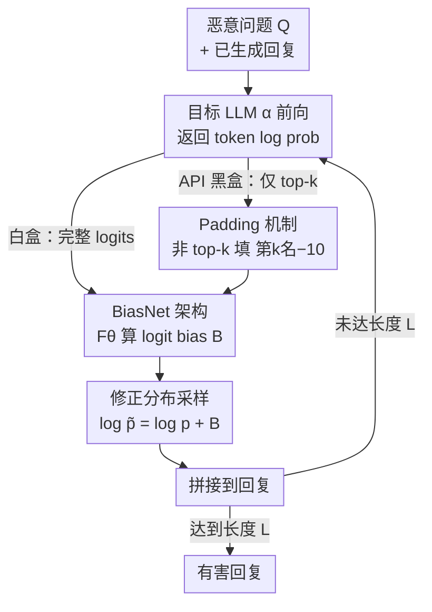

# JULI: Jailbreak Large Language Models by Self-Introspection

**会议**: ICLR 2026  
**arXiv**: [2505.11790](https://arxiv.org/abs/2505.11790)  
**代码**: [JessonWong/JULI](https://github.com/JessonWong/JULI)  
**领域**: LLM 对齐  
**关键词**: jailbreak, logit bias, API attack, token log probability, BiasNet

## 一句话总结
揭示对齐 LLM 的 top-k token log probability 中仍包含有害信息的知识泄露问题，提出 JULI——仅用不到目标模型 1% 参数量的 BiasNet 插件操纵 logit bias，在仅访问 top-5 token 概率的 API 场景下成功越狱 Gemini-2.5-Pro（Harmful Info Score 4.19/5），比 LINT 快 140 倍同时 harmfulness 提升约 2 倍。

## 研究背景与动机
**领域现状**：LLM 越狱攻击分为需要模型权重的白盒攻击和仅通过 API 的黑盒攻击。API 场景下的攻击极具挑战——无法访问梯度、完整 logits 或生成过程。

**现有痛点**：(a) GCG 等白盒方法需要完整梯度访问，不适用于商用 API；(b) LINT（当前 API 攻击方法）需要 top-500 token 访问（多数 API 仅提供 top-5/20），且推理需 99.7 秒，harmfulness 仅 2.25/5；(c) Weak-to-Strong 和 Emulated Disalignment 需要对齐前后两个版本的模型权重。

**核心矛盾**：对齐训练应该消除有害知识的表达，但 LLM API 返回的 top-k token 概率中是否仍泄露有害信息？

**本文目标** 能否仅用 API 返回的少量 token 概率（如 top-5）高效越狱主流商用 LLM？

**切入角度**：统计发现 >85% 的有害 response token 出现在 top-5 概率中——对齐只是压低了它们的采样概率而非消除知识。

**核心 idea**：用轻量 BiasNet（<1% 目标模型参数）学习 logit bias 来提升有害 token 采样概率，仅需 100 条有害数据训练。

## 方法详解

### 整体框架
JULI 全程不去触碰目标模型本身，而是在它的输出端挂一个轻量插件 BiasNet $F_\theta$，把越狱变成一个逐 token 的"重采样"循环。给定恶意问题 $Q$，每生成一个 token 时：目标 LLM $\alpha$ 先返回当前位置的 token log probability $\log p_\alpha(x_n)$，BiasNet 读入它算出一组 logit bias $B = F_\theta(\log p_\alpha(x_n))$，再把这组 bias 加回原始概率得到修正分布 $\log \tilde p_\alpha(x_n) = \log p_\alpha(x_n) + B$，从中采样出本步 token、拼回回复，循环直到生成完整答案——相当于把被对齐压低的有害 token 一步步重新顶到采样概率的高位。

这套循环要落到两类场景。**白盒**下能拿到目标模型权重，BiasNet 的两层投影直接复用目标的 LM head，与词表语义天然对齐；**API 黑盒**下既看不到权重、又只能拿到 top-k（如 top-5）个 token 的概率，于是 BiasNet 的投影改用随机正交矩阵临时拼出语义空间，并对残缺的概率向量先做 padding 补全，再喂进同一个循环。下图给出这条逐 token 攻击回路：

### 关键设计

**1. Token 泄露发现：找到对齐没堵住的漏洞**

整套攻击之所以成立，靠的是一个被反复验证的统计现象：对多个对齐 LLM 逐 token 统计，超过 85% 的有害 response token 其实就出现在模型自己的 top-5 预测概率里（top-10 内则超过 95%）。换句话说，RLHF/DPO 这类对齐训练并没有把有害知识从模型里擦掉，只是把对应 token 的采样概率压低了——它们排名靠后但依然"在场"。这个洞察是上面那条循环能跑通的前提：攻击不需要任何梯度或权重，只要能拿到 top-k 概率、再把这些被压低的 token 重新捞上来顶高就够了。

**2. BiasNet 架构：用不到 1% 的参数学一组 logit bias**

这是循环里真正决定"给哪些 token 加分"的核心模块。BiasNet 是一个参数量约 $10^7$（不到目标模型 1%）的三层结构，本质是在 token 空间和一个低维隐藏空间之间走一个来回：第一层投影把 token 空间映射进隐藏空间，中间是可学习的变换层负责选出该被顶高的关键 token，第二层投影再把结果映射回 token 空间，输出 logit bias $B = F_\theta(\log p_\alpha(x_n))$ 并以 $\log \tilde p = \log p + B$ 修正分布。两个投影层在白盒和黑盒下取法不同：能拿到目标模型 LM head 时直接复用它（第二层用 LM head 本体、第一层用其伪逆），保证投影与目标词表语义对齐；拿不到时则退而用一个随机初始化、再做无数据正交化的矩阵（列向量归一化并优化到互相正交，对随机种子鲁棒），靠中间层把语义学回来。正因为只有中间层需要训练，整个插件才能做得这么小。

**3. Padding 机制：让插件在残缺的概率向量上也能跑**

商用 API 往往只返回 top-k（如 top-5）个 token 的概率，剩下整个词表都是缺失的，而 BiasNet 期望的是一个完整概率向量。JULI 的处理很直接：把所有非 top-k 的 token 统一填上一个 padding 值——取第 $k$ 个 token 的概率再减去一个固定偏移 10，相当于告诉网络"这些 token 都比榜尾还低一截"。这样既补齐了输入维度，又不会让缺失 token 被误当成高概率候选，使 BiasNet 能在 top-5 这种极度受限的 API 场景下照常嵌入逐 token 循环工作。

**4. 训练：100 条数据、极低成本就能学成**

因为要学的只是中间变换层（首尾投影层固定不训），训练代价小到几乎可以忽略：仅用 100 条 LLM-LAT 有害问答对，跑 15 个 epoch，batch size 取 1，AdamW 优化器学习率 $10^{-5}$，目标是让修正后的分布在每个位置都更倾向真实有害 token，即 $\min_\theta \mathbb{E}_{(x,y)}[\mathrm{CE}(F_\theta(F_\alpha(x)) + F_\alpha(x),\, y)]$。如此小的数据和算力就能把插件训到可用，也反过来印证了"有害知识本就在模型里、只需轻轻一推"这一前提。

## 实验关键数据

### 开源模型攻击（白盒设置，AdvBench）

| 目标模型 | JULI Harmful Score | 最佳基线 | 基线方法 | JULI 推理时间 |
|----------|-------------------|---------|---------|-------------|
| Llama3-8B-Instruct | **3.44** | 3.02 | ED | 0.71s |
| Llama2-7B-Chat | **3.38** | 2.89 | ED | 0.71s |
| Llama3-3B-Instruct | **3.52** | 3.15 | ED | 0.65s |
| Qwen2-1.5B-Instruct | **3.61** | 3.28 | ED | 0.58s |
| Llama3-8B-CB (Circuit Breaker 防御) | **2.95** | 1.85 | GCG | 0.71s |
| Llama2-7B-DeepAlign (DeepAlign 防御) | **3.21** | 2.45 | GCG | 0.71s |

### API 攻击（黑盒设置，top-5 API）

| 目标模型 | JULI Harmful Info Score | FLIP | Naive | Base |
|----------|----------------------|------|-------|------|
| Gemini-2.5-Pro | **4.19** | 2.09 | 1.21 | 0.06 |
| Gemini-2.5-Flash | **1.74** | 1.33 | 1.29 | 0.02 |

### 关键发现
- 对齐 LLM 的 top-5 token 概率足以恢复有害输出——对齐是概率压低而非知识擦除
- 仅 100 条训练数据 + <1% 参数的插件即可攻破 SOTA 防御（Circuit Breaker + DeepAlign）
- 比 LINT 快 140 倍（0.71s vs 99.7s），harmfulness 提升 ~2 倍（3.44 vs 2.25）
- 新提出的 Harmful Info Score 与人类判断的相关性高于传统 BERT Score 和 Harmful Score

## 亮点与洞察
- **"知识泄露" vs "知识擦除"的深刻启示**：与 Erase or Hide 的"浅层对齐"发现一致——对齐后有害知识仍完整保留在模型中，只是被概率性地抑制。JULI 证明这种抑制可以被外部插件轻松逆转。这一发现对对齐研究有根本性影响——意味着当前所有基于 RLHF/DPO 的安全训练都只是"表面功夫"。
- **API 安全的红旗**：现实中的 LLM API（如 Gemini API）返回 top-k 概率，JULI 证明这本身就是一个攻击面。API 设计者需要重新评估返回 log probability 的安全风险。
- **Harmful Info Score 的方法论贡献**：新提出的评估指标更关注回复的信息量和质量而非表面"有害性"标签，与人类判断相关性更高——可以作为越狱评估的新标准。

## 消融实验与深入分析

| 分析维度 | 发现 |
|----------|------|
| Top-k 命中率 | >85% 有害 token 在 top-5 中，>95% 在 top-10 中 |
| 训练数据量 | 仅 100 条样本即达到饱和，更多数据边际收益极小 |
| 投影层选择 | 白盒复用 LLM head 优于随机初始化，但黑盒随机正交矩阵也可工作 |
| 对防御的鲁棒性 | 攻破 Circuit Breaker 和 DeepAlign 两种 SOTA 防御 |
| 困难子集 | 在 AdvBench 的 5% 困难子集上仍有效，而基线方法几乎失败 |
| Harmful Info Score | 新提出的评估指标，与人类判断的相关性高于 BERT Score 和 Harmful Score |

## 局限与展望
- BiasNet 需要少量有害数据训练（100 条），限制了完全零知识攻击
- 防御方案未深入讨论——限制 API 返回的 token 数或对概率加噪是显而易见的缓解措施
- API 提供商可以通过不返回 log probability 来防御，但这会牺牲合法用途
- 目前仅在 Gemini API 上验证黑盒攻击，OpenAI API 需进一步测试
- BiasNet 的 padding 机制在某些 token 分布下可能引入偏差

## 相关工作与启发
- **vs GCG (Zou et al.)**：GCG 需要完整梯度访问（白盒），JULI 仅需 top-5 概率——实用性有质的差距
- **vs Weak-to-Strong (Zhao et al.)**：WTS 需要预训练基座模型权重；JULI 完全通过 API 工作
- **vs LINT (Zhang et al.)**：LINT 需要 top-500 token，推理 99.7 秒；JULI 仅需 top-5，0.71 秒——140 倍加速
- **vs Emulated Disalignment**：ED 需要对齐前后两个版本的权重；JULI 完全黑盒
- **启发——对齐是"概率压低"而非"知识擦除"**：最深刻贡献是证明对齐后有害知识仍完整保留在模型中——top-5 内部仍有足够信息恢复完整有害输出

## 评分
- 新颖性: ⭐⭐⭐⭐ 首个仅用 top-5 API 概率的实用越狱，BiasNet 概念新颖
- 实验充分度: ⭐⭐⭐⭐ 多模型（含闭源）× 多场景 × 多评估指标 × 含 SOTA 防御
- 写作质量: ⭐⭐⭐⭐ 清晰，Harmful Info Score 有方法论贡献
- 价值: ⭐⭐⭐⭐ 对 API 安全设计有直接警示——是否应该返回 log probability 需重新评估

<!-- RELATED:START -->

## 相关论文

- [\[ICLR 2026\] Toward Universal and Transferable Jailbreak Attacks on Vision-Language Models (UltraBreak)](toward_universal_and_transferable_jailbreak_attacks_on_vision-language_models.md)
- [\[ICLR 2026\] Sysformer: Safeguarding Frozen Large Language Models with Adaptive System Prompts](sysformer_safeguarding_frozen_large_language_models_with_adaptive_system_prompts.md)
- [\[AAAI 2026\] BiasJailbreak: Analyzing Ethical Biases and Jailbreak Vulnerabilities in Large Language Models](../../AAAI2026/llm_alignment/biasjailbreakanalyzing_ethical_biases_and_jailbreak_vulnerabilities_in_large_lan.md)
- [\[ICLR 2026\] GuardAlign: Test-time Safety Alignment in Multimodal Large Language Models](guardalign_test-time_safety_alignment_in_multimodal_large_language_models.md)
- [\[ICLR 2026\] Test-Time Alignment for Large Language Models via Textual Model Predictive Control](test-time_alignment_for_large_language_models_via_textual_model_predictive_contr.md)

<!-- RELATED:END -->
