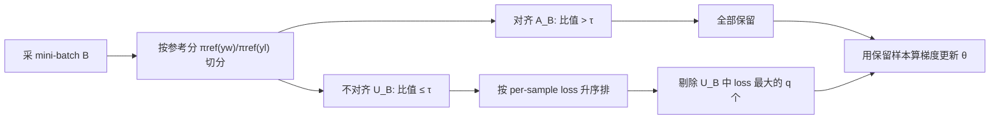

# Keep the Best, Forget the Rest: Reliable Alignment with Order-Aware Preference Optimization

**会议**: ICLR 2026  
**OpenReview**: [https://openreview.net/forum?id=LrHfYPFTtg](https://openreview.net/forum?id=LrHfYPFTtg)  
**代码**: [https://github.com/pxyWaterMoon/rappo](https://github.com/pxyWaterMoon/rappo)  
**领域**: LLM 对齐 / 偏好优化  
**关键词**: DPO, 偏好优化, 参考策略, 样本筛选, 泛化界, RLHF  

## 一句话总结
RAPPO 在每个 batch 内用参考策略给样本打"可信度"分，把那些参考模型本身就站错队、又最难学的高损失偏好对临时剔除掉，只用几行代码改造 DPO 就能在情感、去毒、摘要、安全对齐上稳定超过 SimPO/DPO 等基线，并配套证明了更紧的泛化界。

## 研究背景与动机
**领域现状**：DPO 把 RLHF 里"先训奖励模型再做 RL"两步压成一步，直接从成对偏好数据学策略，已成为对齐 LLM 的主流框架。它的隐式奖励是 $r_\theta(x,y)=\beta\log\frac{\pi_\theta(y|x)}{\pi_{\text{ref}}(y|x)}$，整个目标都锚定在一个固定的参考策略 $\pi_{\text{ref}}$（通常就是 SFT 模型）上。

**现有痛点**：DPO 的效果高度依赖参考策略的质量。论文图 1 显示，无论 GPT2-Small/Medium/Large，参考模型给出的偏好里都有相当比例"站错队"（即 $\pi_{\text{ref}}$ 反而把人类更偏好的回答打了低分），模型越小越严重。理论上已有工作证明：哪怕参考模型只有轻微的对齐误差，DPO 及其变体也几乎不可能把正确偏好学回来——因为这些"参考说反了"的样本会主导梯度信号，把模型往错误方向拉。

**核心矛盾**：现有两条路都不够好。其一是**数据筛选**（RSO、Selective DPO 等）在训练前一刀切掉模糊样本，但它们只盯着数据本身，没去管"参考模型自己错了"这个根因；其二是**去参考化**（SimPO、ORPO）干脆把参考策略整个扔掉，虽然避免了传播坏信号，却也丢掉了参考本可提供的有用引导，还面临灾难性遗忘的风险。于是问题变成：**能不能用一个简单的、样本感知的小改动，既保留参考策略的好处，又屏蔽它误导的那部分？**

**本文目标**：系统理解参考策略在 DPO 里的角色，给出一个轻量、即插即用、且有泛化保证的修正。

**核心 idea（order-aware 选择性更新）**：受 Ordered-SGD 选择性更新思想启发，RAPPO 不做静态删数据，而是在**每一步更新时**先用参考策略把 batch 切成"对齐 / 不对齐"两堆，只在"不对齐"那堆里、按当前损失把最难啃的若干高损失样本临时踢掉。这样既不一刀切丢信息，又能动态地把"参考说反 + 当前还学不会"的有毒梯度挡在门外。

## 方法详解

### 整体框架
RAPPO（Reliable Alignment for Preference Policy Optimization）是 DPO 的一个 order-aware 变体，核心只改梯度计算前的"留谁/弃谁"逻辑，几行代码即可嵌入任意 DPO 类算法。每步训练做四件事：采 mini-batch → 用参考分把样本切成对齐子集 $A_B$ 与不对齐子集 $U_B$ → 在 $U_B$ 内按 per-sample loss 排序 → 只把 $U_B$ 里损失最大的 Top-$q$ 个剔除，用剩下的样本算梯度更新。

### 关键设计

**1. 参考对齐门控：先用 $\pi_{\text{ref}}$ 把样本分成可信与不可信两堆。** RAPPO 对 batch 里每个样本 $z_i=(x_i,y_i^w,y_i^l)$ 算一个参考对齐分 $\frac{\pi_{\text{ref}}(y_i^w|x_i)}{\pi_{\text{ref}}(y_i^l|x_i)}$，并用阈值 $\tau$ 切分：比值大于 $\tau$ 的进入对齐集 $A_B$（参考模型本身就支持人类偏好，这类信号可信），其余进入不对齐集 $U_B$（参考模型给人类偏好回答的概率反而不高，潜在有毒）。这一步的关键在于，它把"风险来源"精确定位到参考策略层面——只有参考说反话的样本才有资格被剔除，对齐集里的样本无论难易一律全留，避免误伤真正有价值的难样本。

**2. 不对齐子集内的损失排序剔除：只丢"参考错 + 当前最难"的那批。** 在 $U_B$ 内，RAPPO 把每个样本的 DPO 损失 $\ell_i(\theta)=-\log\sigma\big(\beta(\Delta_\theta(z_i)-\Delta_{\text{ref}}(z_i))\big)$ 升序排列，剔除其中损失最大的 $q$ 个，再用保留样本更新。直觉上，在已经"参考站错队"的前提下，损失越大说明模型当前越无法把它学对、梯度越有可能把模型带偏，所以优先剔这些。值得强调的是剔除是**临时的**：选择依据 $\ell_i(\theta)$ 随训练动态变化，一个曾经"不可信且难"的样本，等模型变强后可能变成"不可信但已学会"，自然重新回到保留集——这构成一个参考分作粗筛、瞬时损失作细筛的**模型自适应课程**。

**3. 无偏目标与闭式期望损失。** 虽然每步剔除带随机性，但 RAPPO 不是凭感觉删数据，而是对应一个明确的目标函数。论文给出闭式形式（命题 4.8）：

$$\hat{L}_{\text{RAPPO}}=\sum_{b=0}^{\min(q,\hat\mu N)}P(|U_B|=b)\frac{m_g+m_b}{s}+\sum_{b=q+1}^{\min(s,\hat\mu N)}P(|U_B|=b)\frac{m_g+\sum_j \alpha_j\ell_{(j)}}{s-q}$$

其中 $m_g,m_b$ 分别是对齐/不对齐样本的损失之和，$P(|U_B|=b)$ 是超几何分布给出的"batch 里恰好有 $b$ 个不对齐样本"的概率。第一项对应不对齐样本数不超过 $q$ 时全保留、第二项对应超过 $q$ 时留对齐集并剔掉 $q$ 个最大损失。论文证明保留样本算出的梯度 $\tilde g_t$ 是 $\partial\hat{L}_{\text{RAPPO}}$ 的无偏估计，从而保证随机更新与最小化该目标一致。

**4. 更紧的泛化界（理论保证）。** 论文把 RAPPO 放进一个一般化的"剔除最大分数项"优化框架，主定理（Theorem 4.7）在光滑、Lipschitz 假设下（不需要凸性）证明了三件事：(i) 在所有"保留 $K_t$ 个不对齐样本"的规则中，剔除分数 $z$ 最大（即损失最大）的若干样本，能取得对总体风险 $R(\theta)$ **最大的期望一阶下降**；(ii) 它同时**最小化更新方向的条件方差**，让每步更新更稳；(iii) 通过 uniform stability 推出 $\Delta_T\le\frac{2C}{s-q}\exp(\cdot)\sum\eta_u\,\mathbb{E}[\max_{i\in\text{Kept}}w(z_{t,i})]$，由于权重函数 $w(z)=\sigma(-z)$ 随 $z$ 单调不增，剔掉大损失样本恰好压低了 $\max$ 项，从而收紧稳定性递推、进而收紧泛化间隙 $\mathbb{E}[R(\theta_T)-R_n(\theta_T)]\le G\Delta_T$。三点合起来形式化地说明：丢掉高损失、参考错配的样本，能更可靠地朝人类对齐方向前进。

## 实验关键数据

### 主实验表格

IMDb 情感引导（GPT2-Large，奖励越高越好）与 Real-Toxicity-Prompts 去毒（GPT-Neo-2.7B，毒性越低越好）：

| 方法 | Reward Score ↑ | Toxicity (%) ↓ |
|------|---------------|----------------|
| DPO | 1.5513 | 6.30 |
| DPO-Offset | 1.5526 | 8.11 |
| IPO | 1.5446 | 6.49 |
| SimPO (β=2.5,γ=0.5) | 1.5537 | 7.49 |
| RAPPO-1 | 1.6625 | 2.64 |
| RAPPO-2 | 1.6790 | 2.60 |
| **RAPPO-4** | **1.6811** | **2.28** |

IMDb 上 RAPPO 全部变体 reward ≥ 1.66，最优 1.6811 比最强基线 SimPO（1.5611）高 7.7%；去毒上把毒性从基线最优 6.30% 压到 2.28%。

PKU-SafeRLHF 大规模安全对齐（Mistral-7B 参考策略，对比 DPO/CPO/KTO/SimPO）：RAPPO 在全部指标取得最优——安全率 0.573（绝对 +0.014 vs 次优 DPO）、有用性 0.693（+34.8% vs DPO）、无害性 0.357（−21.0% vs DPO）、最高胜率 65%。

摘要任务（GPT-J-6B 与 Llama-3.1-8B，GPT-4 当裁判）：RAPPO 在两个 base model 上都稳定胜过 SimPO 和 DPO，且大模型上保持同样排序，说明增益能迁移到更大、更新的预训练规模。

### 消融实验表格

围绕两个超参——每 batch 剔除数 $q$ 与参考对齐阈值 $\tau$——在 IMDb（GPT2-Large）上做敏感性分析：

| 消融维度 | 设置 | 现象 |
|----------|------|------|
| 剔除数 $q$ | $q\in\{1,2,4,8\}$，batch 16/32 | 适度增大 $q$ 普遍提升，过大会丢有用信号 |
| 阈值 $\tau$ | 控制对齐/不对齐切分粒度 | 影响"哪些样本被判为不可信"的范围 |
| 参考规模 | GPT2-Small/Medium/Large | 参考越弱、RAPPO 相对 DPO 增益越大（+3.5%/+1.1%/+7.1%）|

### 关键发现
- 参考策略越弱、错配样本越多时，RAPPO 相对 DPO 的提升越明显，正好印证"屏蔽参考误导"是增益主因。
- 即便最保守的 RAPPO-1（每 batch 只剔 1 个）也能在 IMDb 上拿到 6.5% 提升，说明少量高损失错配样本就足以拖累 DPO。
- 去毒任务上毒性近乎砍半（6.30%→2.28%），表明剔除的正是那些会诱导有害生成的有毒梯度。

## 亮点与洞察
- **把"参考错配"显式建模成可识别、可门控的风险**：不同于一刀切删数据或彻底弃参考，RAPPO 用参考分定位风险、用瞬时损失细筛，兼顾了"保留参考引导"与"屏蔽参考毒信号"两个看似矛盾的目标。
- **临时剔除而非永久删除**，配合损失随训练变化，天然形成模型自适应课程，避免静态筛选把有潜力的难样本永久误杀。
- **理论与算法对齐得很干净**：剔最大损失这一启发式直接对应"最大期望一阶下降 + 最小方差 + 最紧稳定性界"，并给出无偏估计与闭式目标，不是事后补的理论。
- **工程成本极低**：几行代码即可挂到任意 DPO 类方法上，落地门槛很低。

## 局限与展望
- 剔除数 $q$ 和阈值 $\tau$ 需要调，且最优值与参考模型质量、batch 大小耦合，缺少自动选取机制。
- 主实验规模偏中小（GPT2/GPT-Neo/GPT-J/Mistral-7B/Llama-3.1-8B），更大模型与在线/迭代式偏好优化场景下的表现待验证。
- 方法假设存在一个可靠的"对齐/不对齐"分类器（这里用参考分近似），当参考分本身极不可靠时门控的有效性会下降。
- 剔掉的样本虽可后续回收，但每步丢弃仍意味着数据利用率下降，在数据稀缺场景下需权衡。

## 相关工作与启发
- **DPO 及其变体**：IPO（加 KL 正则）、DPO-Offset（可学习 margin 修正参考误标）、KTO（前景理论非对称加权）、token-level DPO（细粒度信用分配）。RAPPO 与它们正交，可叠加使用。
- **数据筛选路线**：RSO、Selective DPO、margin-based 选样等在训练前筛数据；RAPPO 的差异是把筛选下沉到每步更新、并显式针对参考错配。
- **去参考化路线**：SimPO、ORPO 彻底弃用参考；RAPPO 选择保留参考但门控其坏信号，实验上更稳。
- **优化层面的启发**：Ordered-SGD 的选择性更新思想是 RAPPO 的算法母体，本文把"按损失排序选样"从加速收敛的视角迁移到"屏蔽错配信号"的对齐视角。

## 评分
- **新颖性**: ⭐⭐⭐⭐ —— "参考分门控 + 不对齐子集内损失排序剔除"的组合切入点新颖，把参考错配显式建模并配套泛化理论，区别于一刀切筛数据/弃参考两条主流路线。
- **实验充分度**: ⭐⭐⭐⭐ —— 覆盖情感、去毒、摘要、安全对齐四类任务与多个 base model，含参考规模、$q$、$\tau$ 的敏感性消融；但模型规模偏中小、在线场景未涉及。
- **写作质量**: ⭐⭐⭐⭐ —— 动机—算法—理论—实验逻辑清晰，图 1/2 直观展示参考错配与增益来源；个别公式排版与拼写小瑕疵。
- **价值**: ⭐⭐⭐⭐ —— 几行代码即插即用、有理论背书、增益稳定，对 DPO 类对齐 pipeline 有较高实用价值。

<!-- RELATED:START -->

## 相关论文

- [\[ICLR 2026\] Is On-Policy Data always the Best Choice for Direct Preference Optimization-based LM Alignment?](is_on-policy_data_always_the_best_choice_for_direct_preference_optimization-base.md)
- [\[ICML 2026\] Alignment-Aware Decoding](../../ICML2026/llm_alignment/alignment-aware_decoding.md)
- [\[ICLR 2026\] A2D: Any-Order, Any-Step Safety Alignment for Diffusion Language Models](a2d_any-order_any-step_safety_alignment_for_diffusion_language_models.md)
- [\[ICLR 2026\] Multiplayer Nash Preference Optimization](multiplayer_nash_preference_optimization.md)
- [\[ICLR 2026\] Semi-Supervised Preference Optimization with Limited Feedback](semi-supervised_preference_optimization_with_limited_feedback.md)

<!-- RELATED:END -->
