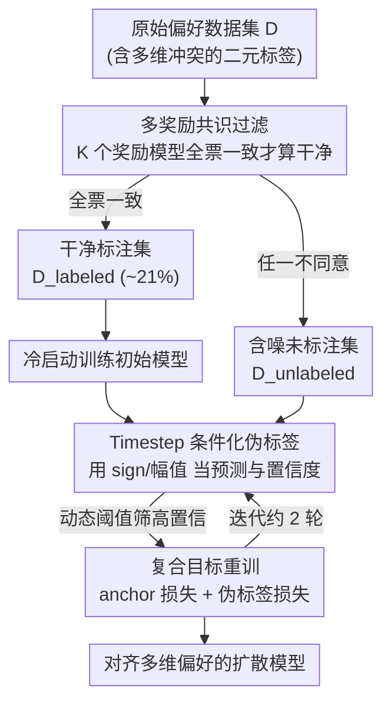

# Learning from Noisy Preferences: A Semi-Supervised Learning Approach to Direct Preference Optimization

**会议**: ICLR 2026  
**OpenReview**: [https://openreview.net/forum?id=rRc04jyoAk](https://openreview.net/forum?id=rRc04jyoAk)  
**代码**: https://github.com/L-CodingSpace/semi-dpo  
**领域**: 对齐RLHF / 扩散模型  
**关键词**: Diffusion DPO, 偏好对齐, 标签噪声, 半监督学习, 伪标签

## 一句话总结
针对"人类视觉偏好是多维的、却被压成一个二元标签"导致的 Diffusion-DPO 梯度冲突问题，本文提出 Semi-DPO：把多个奖励模型一致认可的样本当作干净标注、把维度冲突的样本当作含噪未标注数据，用扩散模型自身作为隐式分类器在不同 timestep 上生成伪标签做迭代自训练，在不引入额外人工标注和显式奖励模型的前提下取得 SOTA 对齐效果。

## 研究背景与动机

**领域现状**：文生图扩散模型与人类偏好对齐，主流要么训练显式奖励模型再做 RLHF（贵、需要大规模标注），要么用 Diffusion-DPO 直接在偏好对 $(x_0^w, x_0^l, c)$ 上优化，把去噪过程当作 MDP，用策略与参考模型的对数似然比隐式表达奖励，从而省掉奖励模型。

**现有痛点**：Diffusion-DPO 忽略了一个根本事实——人类视觉偏好本身是**多维的**（美学、细节保真度、语义对齐……），但标注数据集只给一个整体的二元标签。一张图可能构图/语义出色但纹理平平，另一张纹理惊艳却语义对不上；标注者被迫二选一时，判断往往只取决于某一个维度，却被记录成"整体更优"。模型于是被错误地教成"赢家图的一切属性都好、输家图的一切都坏"，包括赢家的缺点和输家的优点。

**核心矛盾**：把多维偏好压成单一二元标签，会在数据集层面制造**维度冲突**。作者从理论上证明（见下文关键设计），只要存在冲突子集，DPO 的逐样本梯度就必然同时包含"朝向 oracle 方向"和"背离 oracle 方向"的更新，内积方差有正的下界，导致参数反复震荡、收敛到次优解。

**本文目标**：在不增加人工标注、不训练显式奖励模型的前提下，把这种由标签噪声引起的梯度冲突拆解掉，得到更一致、更有效的训练信号。

**切入角度**：把对齐任务重新表述为**带噪标签学习（LNL）**，并进一步转化为**半监督学习（SSL）**——一致的偏好对是干净标注集，冲突的偏好对是需要重新打标的未标注集。关键问题随之变成"用谁来当分类器生成伪标签"。作者的回答是：**扩散模型自己**。因为 DPO 损失等价于二元交叉熵，训练过程本身就在每个 timestep 上隐式训练一个区分"偏好/非偏好"的分类器，逐 timestep 的 margin $z_\theta^{(t)}$ 正好就是这个分类器的 logit。再结合扩散过程的层级性（早期 timestep 管全局构图、后期管局部细节），一个冲突的整体标签就能被改写成一串"按 timestep 条件化、彼此不冲突"的偏好信号。

**核心 idea**：用"多奖励共识过滤 + 扩散模型自身在不同 timestep 上做置信度伪标签"的半监督自训练，把一个含噪的整体偏好信号解耦成细粒度、timestep 条件化的干净信号。

## 方法详解

### 整体框架
Semi-DPO 是一个两阶段框架。**阶段一（多奖励共识）**：用一个由 $K$ 个预训练奖励模型组成的委员会过滤原始数据集 $D$——只有当**所有**奖励模型都与人类整体标签一致时，这对偏好才进入干净标注集 $D_{\text{labeled}}$；任何一个模型不同意，就划入含噪未标注集 $D_{\text{unlabeled}}$（在 Pick-a-Pic V2 上约 21% 被判为干净）。**阶段二（迭代自训练）**：先只用干净集冷启动训练出初始模型 $p_\theta^0$；之后每一轮用上一轮模型 $p_\theta^{i-1}$ 对未标注集生成**timestep 条件化伪标签**，只保留高置信度的伪标签，与干净集一起用复合目标重训，循环往复直到收敛。整体输入是带噪的人类偏好对，输出是一个对齐多维人类偏好的扩散模型。

### 关键设计

**1. 维度冲突制造梯度冲突：理论刻画标签噪声为何致命**

这一节解释"为什么二元标签会害了 DPO"。作者先把逐样本、逐 timestep 的 DPO 梯度分解为 $\nabla_\theta \mathcal{L}_{\text{DPO}}^{(t)} = -f_\theta^{(t)} \cdot \Delta\phi_\theta^{(t)}$，其中 $\Delta\phi_\theta^{(t)}$ 是偏好样本与非偏好样本的特征差方向。对某个维度 $k$（如构图），定义维度奖励差 $\Delta r_k := r_k(x_0^w,c) - r_k(x_0^l,c)$，据此把数据集切成"对齐集 $A_k$（$\Delta r_k>0$，维度偏好与整体标签一致）"和"冲突集 $C_k$（$\Delta r_k<0$，维度偏好与整体标签相反）"，概率各为 $p_{a,k}$、$p_{c,k}$。再定义 oracle 方向 $v_k(\theta,t) := \text{sign}(\Delta r_k)\,\Delta\phi_\theta^{(t)}$，即对维度 $k$ 而言理想的更新方向。核心结论是实际更新与 oracle 方向内积的方差有下界：

$$\text{Var}\big[\langle -g_\theta^{(t)}, v_k(\theta,t)\rangle\big] \ge p_{a,k}\,p_{c,k}\cdot\big(m_{a,k}^{(t)} + m_{c,k}^{(t)}\big)^2$$

只要冲突集存在（$p_{c,k}>0$），乘积项 $p_{a,k}p_{c,k}>0$，就**数学上保证**训练信号里同时含有"朝向 oracle"和"背离 oracle"的更新。两者并存让参数反复震荡、方向频繁反转：一步的进展被下一步抵消，既低效又不稳定，最终收敛到次优。这个 $p_{c,k}$ 正是后面伪标签机制要去压低的目标。

**2. 多奖励共识过滤：用奖励模型的"全票一致"挑出无歧义的干净标注**

要做半监督，先得有一份可靠的干净标注集来稳定冷启动。作者利用一个事实——不同奖励模型与人类偏好的不同维度强相关（如 CLIP Score 对应语义对齐、Aesthetic Score 对应美学）。于是用 $K$ 个预训练模型 $\{r_k\}_{k=1}^K$ 当委员会，一对偏好 $(c,x_0^w,x_0^l)$ 只有在**所有**模型都满足 $\Delta r_k = r_k(x_0^w,c)-r_k(x_0^l,c)>0$ 时才进入 $D_{\text{labeled}}$，其余进入 $D_{\text{unlabeled}}$。这样筛出来的样本在各维度上都无歧义，给冷启动提供一个明确的初始梯度方向。实现上用了五个代理奖励模型（PickScore、HPS v2、CLIP Score、LAION Aesthetics、ImageReward），在 Pick-a-Pic V2 上得到约 17.7 万对干净数据。消融显示委员会越大、生成性能越好，且能提升到未参与过滤的评估器（MPS）上的泛化，因此最终采用五模型共识。

**3. Timestep 条件化伪标签 + 动态阈值：让扩散模型给自己重新打标**

这是解决梯度冲突的核心。关键洞察是 DPO 损失等价于二元交叉熵，所以训练过程在**每个 timestep** 都隐式训练了一个分类器：逐 timestep 的 margin $z_\theta^{(t)}$ 就是 logit，其符号 $\text{sign}(z_\theta^{(t)})$ 给出预测偏好（正号保留原"赢/输"分配、负号则交换两张图），其幅值 $|z_\theta^{(t)}|$ 作为置信度。又因为扩散过程是层级的（早期 timestep 管全局构图、后期管局部细节），一个冲突的整体标签就被自然改写成一串按 timestep 条件化、彼此不冲突的偏好——同一对图在"构图主导"的早期 timestep 可能判 A 赢、在"纹理主导"的后期判 B 赢，正好对应它们各自的强项。由于模型在不同 timestep 的置信度与准确率并不一致，作者不用单一固定阈值，而是把时间轴切成 $N$ 个区间 $\{I_j\}$、每个区间一个动态阈值 $\tau_{i-1}^{\alpha(t)}$（随迭代更新），只有 $|z_{\theta_{i-1}}^{(t)}|$ 超过其所在区间阈值的伪标签才被采纳重训。这一步把含噪样本里"维度冲突"的比例 $p_{c,k}$ 实质性降下来，从源头缓解梯度冲突。

**4. 带复合目标的迭代自训练：用干净集锚定、防止确认偏差与模型漂移**

为防止自训练放大自身错误（确认偏差、模型漂移），重训阶段用复合目标 $\mathcal{L}_{\text{Semi-DPO}}^{(i)}(\theta) = \mathcal{L}_{\text{labeled}}(\theta) + \mathcal{L}_{\text{unlabeled}}^{(i)}(\theta)$。其中 **anchor 损失**是干净集上的标准 Diffusion-DPO 损失 $\mathcal{L}_{\text{labeled}}(\theta) = \mathbb{E}_{D_{\text{labeled}}}[-\log\sigma(z_\theta^{(t)})]$，充当"ground-truth 正则"把模型拉住；**伪标签损失**只作用在被动态阈值筛过的高置信子集上：

$$\mathcal{L}_{\text{unlabeled}}^{(i)}(\theta) = \mathbb{E}_{D_{\text{unlabeled}}}\Big[\mathbb{I}\big(|z_{\theta_{i-1}}^{(t)}| > \tau_{i-1}^{\alpha(t)}\big)\cdot\big(-\log\sigma(\hat z_\theta^{(t)})\big)\Big]$$

其中新偏好对的赢/输由上一轮 logit 的符号决定（正号保留、负号交换）。冷启动只用 anchor 损失训出 $p_\theta^0$，之后每轮用上一轮模型生成伪标签、再用复合目标重训，形成"模型变好→伪标签变准→模型再变好"的良性循环。实验上两轮自训练即收敛，第二轮后收益递减并趋稳，作者据此固定为两轮以平衡性能与算力。

### 损失函数 / 训练策略
基座用 SD1.5 与 SDXL；训练集为 Pick-a-Pic V2（去掉约 12% 平局对后剩 851,293 对、58,960 个 prompt）。五模型共识过滤出 176,999 对干净数据，再切成 173,007 训练 / 3,992 测试（用于每轮迭代后评估模型准确率）。总目标即上文复合目标，anchor 损失稳定、伪标签损失提供来自噪声集的增益，迭代两轮收敛。

## 实验关键数据

### 主实验
在 HPS v2 / Parti-Prompt / Pick-a-Pic V2 三个评测集、SD1.5 与 SDXL 两种基座上，Semi-DPO 在多数奖励指标上超过 Diffusion-DPO、Diffusion-KTO、MaPO、InPO 等强基线。以 SD1.5 + HPS v2 评测集为例：

| 方法 | ImageReward | HPSv2.1 | PickScore | Aesthetic | MPS |
|------|------------|---------|-----------|-----------|-----|
| SD1.5 | 0.139 | 0.246 | 20.862 | 5.578 | 12.211 |
| Diffusion-DPO | 0.339 | 0.259 | 21.308 | 5.714 | 12.739 |
| Diffusion-KTO | 0.690 | 0.284 | 21.454 | 5.803 | 13.016 |
| **Semi-DPO** | **0.816** | **0.287** | **21.945** | **5.899** | **13.514** |

在专门评测上同样领先：GenEval（SD1.5）整体分从 SD1.5 的 42.34 提到 47.31（InPO 为 46.74），其中 Two-object 49.75、Color-attr 9.25 等子项突出；T2I-CompBench++ 上 Shape、Texture、2D-Spatial、Numeracy 等多个组合维度取得最佳或次佳。多维偏好分 MPS 在 Pick-a-Pic V2（SD1.5）上达 11.030（基座 9.635、Diff-KTO 10.226），验证其对多维偏好的对齐能力。

### 消融实验
| 配置 | ImageReward | HPSv2.1 | PickScore | MPS | 说明 |
|------|------------|---------|-----------|-----|------|
| Semi-DPO (Iter0) | 0.569 | 0.269 | 21.493 | 13.039 | 仅干净集冷启动 |
| Semi-DPO (Iter1) | 0.798 | 0.284 | 21.892 | 13.495 | 第一轮伪标签重训 |
| Semi-DPO (Iter2) | 0.816 | 0.287 | 21.945 | 13.514 | 第二轮，趋于收敛 |

（SD1.5 + HPS v2 评测集）迭代自训练逐轮提升，Iter0→Iter1 增益最大，Iter1→Iter2 收益减小并稳定。奖励模型数量消融（CLIP+Aes 起逐步加到五个）显示所有指标随委员会增大而单调改善，且对未参与过滤的 MPS 也有泛化提升。

### 关键发现
- **迭代轮数**：两轮自训练即足够收敛，第二轮后收益递减，是性能与算力的折中点；增益主要来自第一轮（伪标签把大量噪声样本重新利用起来）。
- **共识委员会规模**：奖励模型越多，过滤出的干净集越可靠，不仅提升参与过滤的指标，还提升未参与的 MPS——说明多模型共识降低了单一评估器偏差。
- **timestep 条件化的价值**：把单一冲突标签拆成 timestep 条件信号，正是把理论分析里的冲突比例 $p_{c,k}$ 压低的实现手段，对应定性结果中语义对齐、细节、美学的同步改善（如唯一正确生成"戴厨师帽的皮卡丘"）。

## 亮点与洞察
- **把"DPO 损失=二元交叉熵"这一等价关系用活了**：既然每个 timestep 都在隐式训练一个分类器，那 margin 的符号天然是预测、幅值天然是置信度，于是模型可以零架构改动地给自己当伪标签器——这是整套自训练能跑起来的支点。
- **用扩散的层级性把"冲突标签"变"非冲突信号"**：早期管构图、后期管细节，于是"A 构图好 vs B 纹理好"的整体冲突被拆成不同 timestep 上各自一致的偏好，把噪声转化成细粒度监督，思路很巧。
- **理论与方法严丝合缝**：方差下界 $p_{a,k}p_{c,k}(\cdot)^2$ 直接点名 $p_{c,k}$ 是病根，而伪标签机制恰好就是降 $p_{c,k}$ 的手段，动机不空泛。
- **可迁移性**："多评估器共识挑干净子集 + 模型自身做置信度伪标签 + 干净集锚定防漂移"这套半监督范式，对 LLM 的 DPO 数据同样有噪、同样多维的场景有直接借鉴价值。

## 局限与展望
- **依赖外部奖励模型做过滤**：虽然训练阶段不需要显式奖励模型，但共识过滤阶段仍用了五个预训练奖励模型，干净集质量受这些模型偏好的约束；若它们集体偏向某维度，过滤可能系统性偏置。
- **干净集占比偏低**：约 21% 被判干净，意味着大部分监督信号来自模型自产伪标签，伪标签质量与动态阈值设置对最终效果影响较大，阈值调参成本未充分讨论。
- **timestep 区间划分是超参**：$N$ 个区间与各区间动态阈值的设计较启发式，区间数与边界如何最优划分缺少系统分析。
- **基座规模有限**：实验止于 SD1.5/SDXL，对更大或更新的扩散基座（如 DiT 类）是否仍成立未验证。

## 相关工作与启发
- **vs Diffusion-DPO**：它直接在二元偏好对上优化、忽视多维冲突，本文证明这会制造梯度冲突；Semi-DPO 在其框架上加了一层"共识过滤 + timestep 伪标签"的半监督修正，把噪声标签重新利用而非简单丢弃。
- **vs Diffusion-KTO / MaPO / InPO**：都是 offline 对齐的改进，但仍以原始整体标签为监督；Semi-DPO 的差异在于显式建模"标签是带噪的"，并用模型自身在 timestep 维度上重新打标。
- **vs 经典 LNL/SSL（Co-teaching、Noisy Student）**：本文沿用"划分干净标注集 + 含噪未标注集 + 自训练伪标签"的范式，但创新点是分类器不是额外网络，而是扩散模型在每个 timestep 的隐式 DPO 分类器，并把伪标签做成 timestep 条件化。

## 评分
- 新颖性: ⭐⭐⭐⭐⭐ 把多维偏好噪声形式化为梯度冲突，并用扩散模型自身的 timestep 隐式分类器做半监督伪标签，角度新颖且自洽
- 实验充分度: ⭐⭐⭐⭐ 覆盖两基座三评测集 + GenEval/T2I-CompBench + 迭代与委员会规模消融，但缺更大基座与阈值敏感性分析
- 写作质量: ⭐⭐⭐⭐ 理论—动机—方法衔接清晰，图示直观，部分符号（动态阈值/区间）略密
- 价值: ⭐⭐⭐⭐⭐ 不增标注、不训显式奖励模型即提升多维对齐，范式对 LLM/扩散 DPO 都有迁移价值

<!-- RELATED:START -->

## 相关论文

- [\[ICLR 2026\] Semi-Supervised Preference Optimization with Limited Feedback](semi-supervised_preference_optimization_with_limited_feedback.md)
- [\[ICLR 2026\] SafeDPO: A Simple Approach to Direct Preference Optimization with Enhanced Safety](safedpo_preference_optimization_safety.md)
- [\[ICLR 2026\] Learning Ordinal Probabilistic Reward from Preferences (OPRM)](learning_ordinal_probabilistic_reward_from_preferences.md)
- [\[ICLR 2026\] Stackelberg Learning from Human Feedback: Preference Optimization as a Sequential Game](stackelberg_learning_from_human_feedback_preference_optimization_as_a_sequential.md)
- [\[ICLR 2026\] RE-PO: Robust Enhanced Policy Optimization as a General Framework for LLM Alignment](re-po_robust_enhanced_policy_optimization_as_a_general_framework_for_llm_alignme.md)

<!-- RELATED:END -->
