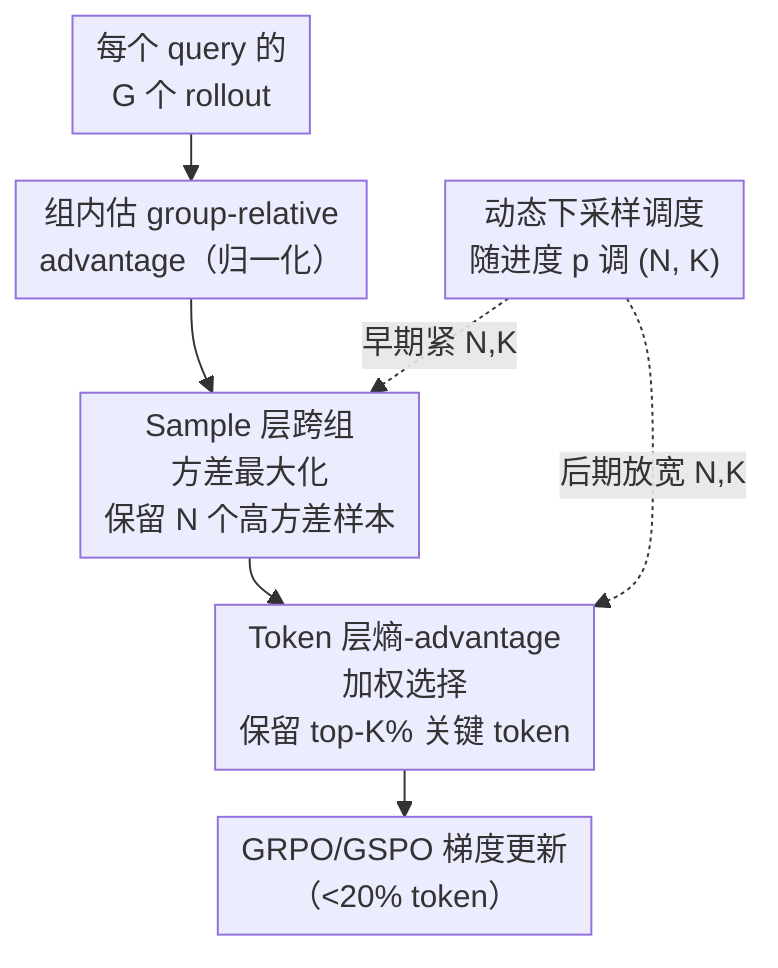

# Learning More with Less: A Dynamic Dual-Level Down-Sampling Framework for Efficient Policy Optimization

**会议**: ICLR 2026  
**arXiv**: [2509.22115](https://arxiv.org/abs/2509.22115)  

**作者**: Chao Wang, Tao Yang, Hongtao Tian 等（清华大学 & 腾讯微信）  
**代码**: 已公开（补充材料）  
**领域**: LLM Alignment / 强化学习  

**关键词**: GRPO, policy optimization, down-sampling, advantage variance, token selection, curriculum learning

## 一句话总结

提出**D3S**（Dynamic Dual-Level Down-Sampling）框架，在sample层最大化advantage方差、在token层优先选取高熵+高advantage的token，配合动态调度策略，用不到20% token实现更快收敛和更优性能。

## 研究背景与动机

1. Critic-free方法（GRPO/GSPO）通过group相对奖励估计advantage，消除了critic网络的显存负担，但**效率瓶颈**仍然存在

2. 大group中大量uninformative样本（如全对/全错组）稀释关键学习信号，有价值的梯度被海量无差异样本的平均效应淹没

3. 小group则因采样不足而难以产生多样性回答，优化精度受限——这构成一个固有的**group size trade-off**

4. Razin等发现提高奖励方差$\text{Var}(R)$可加速收敛，但GRPO对advantage进行归一化后方差恒为1，**最大化$\text{Var}(R)$无法改变梯度范数上界**

5. Token层面同样存在大量低信息量token（简单token、中性token）稀释梯度信号的问题，Wang等发现top 20%高熵token主导策略梯度

6. 本文动机：能否同时在sample和token两个层级精选最有价值的数据，用更少的计算获得更强的梯度信号？

## 方法详解

### 整体框架

D3S 要解决的痛点是：critic-free 的 GRPO/GSPO 把一个大 group 里所有 rollout、一条回答里所有 token 一视同仁地塞进梯度，结果海量「无差异」样本和简单 token 把真正有价值的学习信号稀释掉，收敛很慢。D3S 的思路是在策略优化外面套一层「先选数据、再算梯度」的下采样器：每个 batch 先用全部 rollout 估出组内归一化的 group-relative advantage，然后在 sample 层挑出让 advantage 方差最大的回答子集，在 token 层只保留高熵×高 advantage 的关键 token，再用一个随训练进度变化的调度器同时控制这两层「保留多少」。最终只有不到 20% 的 token 进入 GRPO/GSPO 的梯度更新，但携带的学习信号反而更集中、梯度范数上界更高。

### 关键设计

**1. Sample 层跨组 advantage 方差最大化：把零信号样本筛掉**

GRPO 的痛点在于大 group 里塞满了全对/全错的「无差异」回答，它们的 advantage 接近零，被平均进梯度后只起稀释作用。D3S 反过来主动保留方差最大的子集——给定 query $x$ 的 $G$ 个 rollout，先在组内求 $\hat{\mathcal{S}}_{\text{query}} = \arg\max_{\hat{S},\,|\hat{S}|=N_{\hat{s}}} \text{Var}(A_{\hat{S}})$，实现上就是取正 advantage 最大的 $N_{\hat{S},\text{pos}}$ 个加负 advantage 最小的 $N_{\hat{S},\text{neg}}$ 个。考虑到不同 group 的 advantage 分布差异很大（有些整组全对全错直接归零），再在整个 batch 上做一次跨组选择 $\hat{\mathcal{S}}_{\text{batch}} = \arg\max_{\hat{S},|\hat{S}|=N} \text{Var}(A_{\hat{S}})$；注意 advantage 只在组内归一化、跨组时不再二次归一化，从而保留原始的分布幅度。之所以盯住 advantage 方差而非奖励方差，本文给了理论支撑：GRPO 的梯度范数上界与 $\text{Var}(R)$ 无关（Proposition 1），所以单纯放大奖励方差不会改变上界；而下采样后的上界正比于 $(\text{Var}(A'))^{1/3}$（Proposition 2），且从标准化集合中总能抽出方差 $\geq 1$ 的子集（Lemma 1），保证筛选后梯度上界不低于原始。

**2. Token 层熵-advantage 加权选择：只在关键决策点更新**

即便选对了样本，一条回答里仍混着大量简单 token（模型既自信又正确）和中性 token（对结果几乎没影响），它们和真正的关键 token 一起平均，照样稀释梯度。D3S 为每个 token 定义生成熵 $H_{i,t} = -\sum_{j=1}^{V} \pi_\theta(\text{token}_j \mid x_i, y_{i,<t}) \log \pi_\theta(\text{token}_j \mid x_i, y_{i,<t})$，再以 $|A_{i,t}| \times H_{i,t}$ 为打分取 top-$K\%$ 的 token 进入更新：$\mathcal{T} = \text{top}_{K\%}(y_{i,t},\; y_{i,t} \in \hat{\mathcal{S}},\; \text{key} = |A_{i,t}| \times H_{i,t})$。这个乘积度量同时要求「影响力大」和「不确定性高」——$|A_{i,t}|$ 大说明该 token 对策略改进的潜力大（正负都算），$H_{i,t}$ 大说明模型在此处摇摆不定，两者都满足的 token 恰是奖励关键区里最值得优化、最该让模型「想清楚」的决策点。

**3. 动态下采样调度：早期猛筛加速、后期放宽防过拟合**

固定强度的激进下采样虽然早期收敛快，但持续只盯着少量高方差样本会诱发 reward hacking 和过拟合（消融里不带调度的 D1S/D2S 后期被 GRPO 反超就是这个原因）。借鉴课程学习「由简到繁」的思想，D3S 用一个随训练进度 $p \in [0,1]$ 线性插值的调度同时控制前两个设计的保留量——其中 $N_s^{(p)}$ 调每个 query 保留的样本数、$K^{(p)}$ 调每条回答保留的 token 比例：

$$[N_s^{(p)}, K^{(p)}] = (1-p) \cdot [N_{\text{init}}, K_{\text{init}}] + p \cdot [N_{\text{final}}, K_{\text{final}}]$$

$p=0$ 时用少样本+少 token 的激进配置快速学习，$p \to 1$ 时逐步纳入更多样本和 token、把强度放回常规水平，从而在前期吃到效率红利的同时避免后期泛化崩塌。

## 实验

### 表1: 主实验结果（Pass@1 / Pass@8，32次并行生成）

| 模型/方法 | AIME24 | AIME25 | AMC23 | GSM8k | MATH | Minerva | Olympiad | 平均 |
|-----------|--------|--------|-------|-------|------|---------|----------|------|
| Qwen2.5-Math-7B Base | 8.9/33.2 | 2.3/13.4 | 22.8/70.4 | 30.1/83.2 | 27.9/64.6 | 8.4/33.7 | 4.1/14.6 | 14.9/44.7 |
| + GRPO | 13.2/37.6 | 5.5/21.6 | 47.0/83.5 | 64.9/94.3 | 48.5/70.2 | 19.8/45.0 | 9.7/19.8 | 29.8/53.1 |
| + GRPO+PODS | 16.1/40.5 | 7.8/24.5 | 52.8/81.5 | 73.3/95.0 | 53.0/71.1 | 24.6/47.5 | 11.0/20.7 | 34.1/54.4 |
| + **GRPO+D3S** | **20.3/48.2** | 7.9/25.8 | **54.4/87.1** | 73.4/95.7 | 52.2/71.5 | 25.0/48.2 | 10.7/20.8 | **34.3/56.8** |
| + **GSPO+D3S** | 18.3/43.3 | **8.3/26.9** | 53.2/83.8 | **76.0/96.1** | **54.9/71.4** | **28.4/51.1** | **11.5/21.1** | **35.8/56.2** |
| Llama3.1-8B + GRPO | 2.0/5.0 | 0.0/0.0 | 13.7/33.4 | 78.6/93.5 | 31.5/52.0 | 15.9/35.6 | 2.1/7.2 | 20.5/32.4 |
| + **GRPO+D3S** | **5.3/20.7** | 0.1/0.8 | **20.3/50.8** | **79.0/95.0** | **35.9/59.2** | **22.5/44.3** | **3.3/10.7** | **23.8/40.2** |

### 表2: 消融实验（Qwen2.5-Math-7B，Pass@1/Pass@8）

| 方法 | AIME24 | AIME25 | AMC23 | MATH | 平均 |
|------|--------|--------|-------|------|------|
| GRPO | 13.2/37.6 | 5.5/21.6 | 47.0/83.5 | 48.5/70.2 | 29.8/53.1 |
| +D1S（仅样本下采样） | 13.2/42.9 | 5.9/20.2 | 50.6/84.4 | 50.1/70.5 | 31.3/54.2 |
| +D1S-Cross（+跨组） | 17.3/40.0 | 7.7/25.6 | 51.9/83.3 | 52.8/70.9 | 34.1/54.7 |
| +D2S（+token层，无调度） | 16.9/42.2 | 6.0/21.2 | 49.6/82.8 | 49.5/70.7 | 31.3/54.1 |
| +**D3S**（完整框架） | **20.3/48.2** | **7.9/25.8** | **54.4/87.1** | 52.2/71.5 | **34.3/56.8** |

### 表3: 训练效率对比

| 方法对比 | Avg@32提升 | 训练加速 |
|----------|-----------|----------|
| D3S vs GRPO (Qwen-7B) | +6% | 2.04× |
| D3S vs GSPO (Qwen-7B) | +17% | 5.51× |
| D3S vs GRPO (Qwen-1.5B) | +4% | 1.57× |

## 关键发现

1. **Sample-level和token-level下采样**在训练早期有效消除无差异信号，加速策略收敛
2. 不带动态调度的下采样方法（D1S/D2S）虽然早期加速收敛，但后期出现**过拟合**，Avg@32最终被GRPO反超
3. **动态调度**起到关键作用：在后期放宽下采样强度，维持持续提升而不过拟合
4. D3S使Sample Usefulness Rate从~70%提升至近100%，跨组操作有效过滤了batch内的模糊数据
5. D3S更好地管理**熵波动**：在well-aligned模型上降低熵（更确定），在under-aligned模型（Llama3.1）上反而促进探索
6. KL散度分析显示D3S与参考模型的偏离更小，过拟合风险更低

## 亮点

- 理论清晰：从梯度范数上界出发，严谨证明advantage方差最大化优于reward方差最大化，且推导出$(\text{Var}(A'))^{1/3}$的正相关关系

- Token-level选择的 $|A| \times H$ 度量设计精巧——"影响力"×"不确定性"，直觉合理且实验验证有效

- D3S是即插即用模块，与GRPO/GSPO均兼容，跨模型架构（Qwen/Llama）、跨模型规模（1.5B/7B/8B）一致有效

- 动态调度借鉴课程学习思想，优雅平衡训练效率与泛化能力

- 实验设计全面：7个benchmark、4种backbone、2种基线算法、逐步消融

## 局限性

- 仅在**数学推理**任务验证，代码生成、通用对话、多模态等任务效果未知

- Sample-level跨组操作在**分布式训练**中可能引入额外通信开销

- 动态调度采用简单线性插值，非线性schedule（如cosine、exponential）可能更优但未探索

- 未深入分析D3S在不同reward分布（稀疏reward vs 密集reward）下的行为差异

- Token熵计算需要完整词表的概率分布，带来一定的额外计算成本

## 相关工作对比

| 方法 | 核心策略 | D3S的优势 |
|------|----------|-----------|
| PODS (Xu, 2025) | 最大化$\text{Var}(R)$选样本 | D3S证明最大化$\text{Var}(A)$提供更紧的梯度上界，且PODS无法改变归一化后的固定上界 |
| Razin (2024, 2025) | 奖励方差加速收敛 | D3S将此insight从reward拓展到advantage层面，并增加token级精细选择 |
| ETPO (Wen, 2024) | 熵正则化token级优化 | D3S将熵与advantage magnitude乘积作为联合度量，更聚焦于高影响+高不确定的token |
| LPPO (Chen, 2025) | 基于学习进度动态调权 | D3S从理论上保证梯度上界提升，且同时操作sample和token两个层级 |

## 评分

- **新颖性**: ⭐⭐⭐⭐ — 双层下采样+动态调度的组合设计新颖，advantage方差最大化的理论视角有独创性
- **实验充分度**: ⭐⭐⭐⭐ — 多模型多benchmark多算法的全面实验+逐步消融+训练动态分析
- **写作质量**: ⭐⭐⭐⭐ — 理论-方法-实验逻辑链清晰，图表设计直观，证明细致完整
- **推荐度**: ⭐⭐⭐⭐ — 理论与实践兼具，即插即用的实用性强，对RLHF效率优化方向有重要参考价值

## 总结

D3S框架通过sample-level advantage方差最大化和token-level熵-advantage加权选择，在双层级精选最有价值的训练数据，配合动态调度策略平衡效率与泛化。理论分析严谨地建立了advantage方差与梯度范数上界的正相关关系，实验在7个数学推理benchmark上验证了一致的性能提升和显著的训练加速（最高5.51×）。该方法对RLHF中的数据利用效率问题提供了系统性解决方案，未来可进一步拓展到更多任务类型和更大规模模型。

<!-- RELATED:START -->

## 相关论文

- [\[ICLR 2026\] Inverse Reinforcement Learning with Dynamic Reward Scaling for LLM Alignment](inverse_reinforcement_learning_with_dynamic_reward_scaling_for_llm_alignment.md)
- [\[ICLR 2026\] RE-PO: Robust Enhanced Policy Optimization as a General Framework for LLM Alignment](re-po_robust_enhanced_policy_optimization_as_a_general_framework_for_llm_alignme.md)
- [\[ICML 2025\] Can RLHF be More Efficient with Imperfect Reward Models? A Policy Coverage Perspective](../../ICML2025/llm_alignment/can_rlhf_be_more_efficient_with_imperfect_reward_models_a_policy_coverage_perspe.md)
- [\[CVPR 2026\] MorphSeek: Fine-grained Latent Representation-Level Policy Optimization for Deformable Image Registration](../../CVPR2026/llm_alignment/morphseek_fine-grained_latent_representation-level_policy_optimization_for_defor.md)
- [\[NeurIPS 2025\] Greedy Sampling Is Provably Efficient for RLHF](../../NeurIPS2025/llm_alignment/greedy_sampling_is_provably_efficient_for_rlhf.md)

<!-- RELATED:END -->
