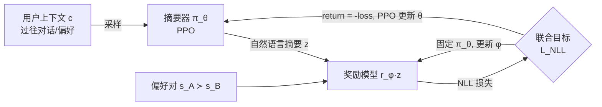

# Learning to Summarize User Information for Personalized RLHF（PLUS）

**会议**: ICLR 2026  
**OpenReview**: [https://openreview.net/forum?id=Ar078WR3um](https://openreview.net/forum?id=Ar078WR3um)  
**代码**: 已开源（基于 OpenRLHF）  
**领域**: LLM 对齐 / 个性化 RLHF  
**关键词**: 多元对齐, 个性化奖励模型, RLHF, 用户摘要, PPO, 协同自适应  

## 一句话总结
PLUS 用 RL（PPO）训练一个"用户摘要器"，把每个用户的偏好、特征、历史对话压缩成一段**自然语言摘要** $z$，再用这段摘要去 condition 奖励模型，并让摘要器和奖励模型在线协同自适应，从而在不假设"所有人偏好相同"的前提下，把奖励模型准确率相对 Bradley-Terry 提升 11–77%。

## 研究背景与动机
**领域现状**：标准 RLHF 用一个 Bradley-Terry-Luce（BTL）奖励模型拟合整个用户群体，隐含假设"所有人偏好一致"。当两个用户对同一 prompt 的两个回复有相反偏好、又没有额外上下文时，BTL 根本无法区分。随着 ChatGPT/Gemini 等助手日活逼近十亿、用户需求高度异质，"多元对齐（pluralistic alignment）"成为刚需。

**现有痛点**：已有的个性化奖励模型（VPL、DPL 等）走的是"把用户压成一个隐向量/线性权重"的路线——VPL 用 VAE 学一个 512 维 user embedding。但把丰富的文本上下文压成定长向量会损失信息，且**可解释性差**（一个向量无法让用户看懂、编辑、信任）。另一条路是直接把全部历史对话塞进奖励模型的 prompt（ICL），但长上下文样本效率低、对话题漂移敏感，换个话题就崩。

**核心矛盾**：既想保留 LLM"用文本推理"的强大能力与可解释性，又要让用户表示足够紧凑、能泛化到新用户和新话题——定长向量丢信息，全量 ICL 太臃肿，两头不讨好。

**本文目标**：在没有用户 ID（隐私不可得、且无法泛化到新用户）的现实设定下，仅凭上下文 $c$（如过往对话）学出一个对下游奖励预测真正有用、且人类可读的用户表示。

**核心 idea**：**用自然语言摘要充当隐用户变量**——不预先定义"好摘要"的标准，而是让"摘要对奖励预测的帮助程度"来定义摘要质量，因此摘要器和奖励模型必须在一个联合目标下**在线协同自适应（online co-adaptation）**地一起训。

## 方法详解

### 整体框架
PLUS 由两个相互依赖的模块组成：一个用 PPO 训练的**摘要器** $\pi_\theta$，从用户上下文 $c$ 采样出自然语言摘要 $z\sim\pi_\theta(\cdot|c)$；一个**摘要条件奖励模型** $r_\phi(\cdot|z)$，在 $z$ 条件下预测用户更偏好哪个回复。两者共享一个目标——最小化摘要条件下的偏好负对数似然，于是奖励模型为摘要器提供奖励信号，摘要器又为奖励模型提供越来越有判别力的条件，形成交替优化的闭环。

### 关键设计

**1. 用文本摘要作隐用户变量，并以"奖励预测准确率"定义摘要质量**：传统个性化方法把用户 $z$ 建成 embedding 向量或线性权重，PLUS 转而让 $z$ 是一段自然语言，由摘要器 $\pi_\theta$ 生成。关键在于作者**拒绝**为"什么是好摘要"预设任何 ground-truth 标准、也不预训练摘要器，而是断言：一个摘要好不好，唯一标准是它能否让下游奖励模型更准地预测该用户的偏好。这把摘要器和奖励模型绑进同一个目标——在用户条件偏好数据集 $D'=\{(s_A^i,s_B^i,c^i)\}$ 上最小化负对数似然：
$$L_{NLL}(\phi,\theta) = -\hat{\mathbb{E}}_{(s_A,s_B,c)\sim D',\,z\sim\pi_\theta(\cdot|c)}\Big[\log\sigma\big(r_\phi(s_A|z)-r_\phi(s_B|z)\big)\Big]$$
注意 $z$ 不再是数据集里给定的用户 ID，而是从上下文 $c$ 现学出来的，因此天然能泛化到训练时没见过的用户。

**2. 在线协同自适应：交替冻结-更新打破耦合**：$L_{NLL}$ 里 $\theta$ 和 $\phi$ 互相依赖，无法一步到位。PLUS 设计了交替训练——**固定摘要器训奖励模型**：用当前摘要器采出的 $z$ 作条件，按 Eq.3 做标准偏好 NLL 更新 $\phi$（$M_\phi$ 步）；**固定奖励模型训摘要器**：用最新 $\phi$ 给摘要器提供奖励信号，更新 $\theta$（$M_\theta$ 步）。这样摘要器始终针对"最新版"奖励模型去提取最有用的用户信息，奖励模型又在更新后的摘要上学得更准。作者强调这一步是 PLUS 的灵魂：消融显示，哪怕用 GPT-4o 当摘要器配一个训练好的 3B 奖励模型，也打不过协同训练的"3B 摘要器 + 0.5B 奖励模型"，因为好摘要的判据来自奖励模型的损失，而非任何外部固定标准。

**3. 把摘要生成建成 RL 后训练问题（PPO + 轨迹级稀疏奖励）**：摘要器的最优权重无法靠监督学习直接得到——只有等整段摘要采样完、喂给奖励模型后，才知道这段摘要好不好。所以作者把生成摘要 $(z_1,\dots,z_H)$ 形式化成 RL 问题：只在序列末端 $t=H$ 给一个奖励，等于奖励模型在该摘要下的偏好对数似然，中间 token 奖励为 0：
$$R_\phi(z_t,s_A,s_B) = \begin{cases} 0, & t<H \\ \log\sigma\big(r_\phi(s_A|z_t)-r_\phi(s_B|z_t)\big), & t=H \end{cases}$$
再用 GAE 把这个序列级 return 分配到 token 级优势 $A_t^{GAE}$，做归一化后喂给带 clipping 的 PPO 目标 $L_{PPO}$。

**4. 选 PPO 应对非平稳奖励（MARL 视角）**：因为奖励模型在持续更新，摘要器面对的奖励是**非平稳**的，这本质上是个多智能体 RL（MARL）问题。作者据此选择 PPO——它在非平稳奖励下表现稳健，是 MARL 的常用强基线，而不是更易受 reward 漂移影响的算法。这也是 PLUS 能在"两个模型都在动"的设定下不发散的工程关键。

## 实验关键数据

### 主实验：三个 benchmark 上的奖励模型准确率（held-out）

| 方法 | Pets (Qwen-0.5B) | UF-P2 (Qwen-0.5B) | UF-P4 (Qwen-0.5B) |
|---|---|---|---|
| BTL | 44.15 | 58.12 | 53.53 |
| DPL | 46.20 | 58.53 | 55.22 |
| VPL | **100** | 58.37 | 54.20 |
| ICL | **100** | 59.62 | 57.22 |
| PLUS-untrained | 96.20 | 59.90 | 56.89 |
| **PLUS** | 99.80 | **69.40** | **62.10** |
| Oracle | 100 | 69.10 | 70.60 |

要点：在简单的 Pets 上 VPL/ICL 也能到 100%，但在更接近真实人类偏好的 UltraFeedback（话题在训练/测试间变化、底层用户群不变）上，VPL 几乎没比 BTL 强（-2.76～4.81%），ICL 只涨 0.9～8.4%，而 PLUS 涨 10.4～17.7%，几乎逼平 Oracle，且 3B PLUS 比 7B/8B 的 ICL 还准。

### 鲁棒性：Pets-OOD（测试时用户偏好内容彻底漂移：猫狗→兔鸟）

| 方法 | OOD 用户上下文准确率 |
|---|---|
| BTL / DPL | 49.5 / 49.0 |
| VPL | 44.83 |
| ICL | 72.50 |
| PLUS-untrained | 85.83 |
| **PLUS** | **93.67** |

PLUS 是唯一在内容漂移下仍 >90% 的方法（ICL 从 100 掉到 72，VPL 掉到 50 以下），说明它学到的是"如何从上下文里抽用户信息"的通用算法，而非死记某些用户。

### 消融：协同自适应 vs. 固定一方（UltraFeedback）

| 摘要器 | 奖励模型 | UF-P2 | UF-P4 |
|---|---|---|---|
| 训练 3B | 静态 0.5B | 53.45 | 49.50 |
| 静态 3B | 训练 0.5B | 59.90 | 56.40 |
| GPT-4o | 训练 3B | 59.30 | 60.80 |
| **训练 3B** | **训练 0.5B** | **69.40** | **61.80** |
| **训练 3B** | **训练 3B** | **69.85** | **62.45** |

协同训练的"3B 摘要器 + 0.5B 奖励模型"全面碾压"GPT-4o 摘要器 + 训练 3B 奖励模型"——证明摘要必须由奖励模型损失来定义，而非套用任何强模型的固定标准。

### 关键发现
- **超越偏好标签的灵活输入**：PLUS 能从无 chosen/rejected 配对的自然对话（non-preference）或"用户通常在意 helpfulness/honesty…"这类 user-guide 提示中学习，比 ICL 高 9–16%（VPL 因输入假设根本用不了这类数据）。
- **真实数据 PRISM（1500 用户/75 国/20 LLM）**：是首批在 PRISM 上报告多元奖励建模结果的工作之一。奖励准确率 62.9%（BTL 59.8 / VPL 60.4 / ICL 60.1），数值提升有限（数据方差大、样本少），但摘要的价值体现在下游。
- **零微调个性化专有模型**：把 PLUS 摘要喂给 GPT-4o/4.1 当 LLM-as-judge，准确率提升（GPT-4o +19.5%）；用于个性化回复生成时，PLUS 条件回复对默认 GPT 的胜率达 **72%（GPT-4o）/ 69%（GPT-4.1）**，且摘要人类可读、可审查可编辑。

## 亮点与洞察
- **"质量由下游任务定义"的范式很优雅**：不预设摘要标准、让奖励模型损失反向定义"什么是好摘要"，把一个难以监督的生成问题转成 RL 问题，思路干净且可迁移到其他"中间表示难标注"的场景。
- **可解释性是真正的差异化优势**：相比 VPL 的 512 维黑箱向量，自然语言摘要能直接展示给用户"系统在依据你哪些偏好"，支持编辑/删除，对隐私和信任友好——这是多元对齐落地的关键。
- **小模型协同 > 大模型拼装**：3B+0.5B 协同打败 GPT-4o+3B，说明 RLHF 个性化的瓶颈不在摘要器本身多强，而在"摘要器与奖励模型是否互相塑形"。
- **把个性化 RLHF 看成 MARL** 是一个有解释力的视角，也直接指导了 PPO 的选型。

## 局限与展望
- **PPO 在 MARL 设定下对超参（尤其学习率）敏感**，易出现不稳定/欠收敛；作者建议的缓解手段包括多训几个 epoch、一个 epoch 后冻结摘要器只训奖励模型、或用未训练摘要器的输出 warm-start 奖励模型——但都要小心过拟合。
- **PRISM 上奖励准确率仍偏低**（~63%），对 OOD 新用户所有多元方法都表现差，说明"小样本+高方差"的真实多元偏好建模远未解决。
- **隐私**：任何按用户/群体保存信息的方法都涉及用私有数据区分用户，部署前需先剥离敏感信息。
- 未来可探索把摘要器/奖励模型的更新调度、用户对摘要的交互式编辑纳入闭环。

## 相关工作与启发
- **个性化/多元 RLHF**：VPL（Poddar et al. 2024，VAE 学 user embedding）、DPL（Siththaranjan et al.，学奖励分布的均值与方差）、shared LoRA 等都把用户表示成向量/权重；PLUS 的根本区别是用**文本**表示，兼顾表达力与可解释性。
- **RLHF 基础**：建立在 Bradley-Terry + Ouyang et al. (2022) 的标准 RLHF 流水线上，聚焦其奖励建模阶段。
- **LLM 摘要微调**：最接近的是 Wu et al. (2025)——用学到的用户摘要做推荐个性化，但假设有固定的用户分类器；PLUS 的关键创新是摘要器与奖励模型的**在线协同闭环**。
- **启发**：这套"用 RL 学一个面向下游任务最优的中间自然语言表示，并与下游模型协同训练"的框架，可推广到检索 query 改写、agent 记忆压缩、个性化推荐等任何"中间表示难以直接监督"的任务。

## 评分
- **新颖性**: ⭐⭐⭐⭐⭐ 把隐用户变量从向量换成"由下游奖励定义、协同训练"的自然语言摘要，范式清晰且差异化明确。
- **实验充分度**: ⭐⭐⭐⭐ 三 benchmark + OOD + 灵活输入 + 真实 PRISM + 专有模型个性化，对比 6 个 baseline，覆盖全面；PRISM 绝对数值偏低稍减分。
- **写作质量**: ⭐⭐⭐⭐ 动机—矛盾—方法—消融逻辑顺畅，摘要对比示例直观；公式与算法表清楚。
- **价值**: ⭐⭐⭐⭐⭐ 可解释、可零微调迁移到 GPT-4、能用无标签上下文，对多元对齐落地有很强实用价值。

<!-- RELATED:START -->

## 相关论文

- [\[ACL 2026\] PERSA: Reinforcement Learning for Professor-Style Personalized Feedback with LLMs](../../ACL2026/llm_alignment/persa_reinforcement_learning_for_professor-style_personalized_feedback_with_llms.md)
- [\[ACL 2026\] P-Check: Advancing Personalized Reward Model via Learning to Generate Dynamic Checklist](../../ACL2026/llm_alignment/p-check_advancing_personalized_reward_model_via_learning_to_generate_dynamic_che.md)
- [\[ICLR 2026\] Eliminating Inductive Bias in Reward Models with Information-Theoretic Guidance](eliminating_inductive_bias_in_reward_models_with_information-theoretic_guidance.md)
- [\[ICLR 2026\] General Exploratory Bonus for Optimistic Exploration in RLHF](general_exploratory_bonus_for_optimistic_exploration_in_rlhf.md)
- [\[ICLR 2026\] Unifying Stable Optimization and Reference Regularization in RLHF (DAR)](unifying_stable_optimization_and_reference_regularization_in_rlhf.md)

<!-- RELATED:END -->
