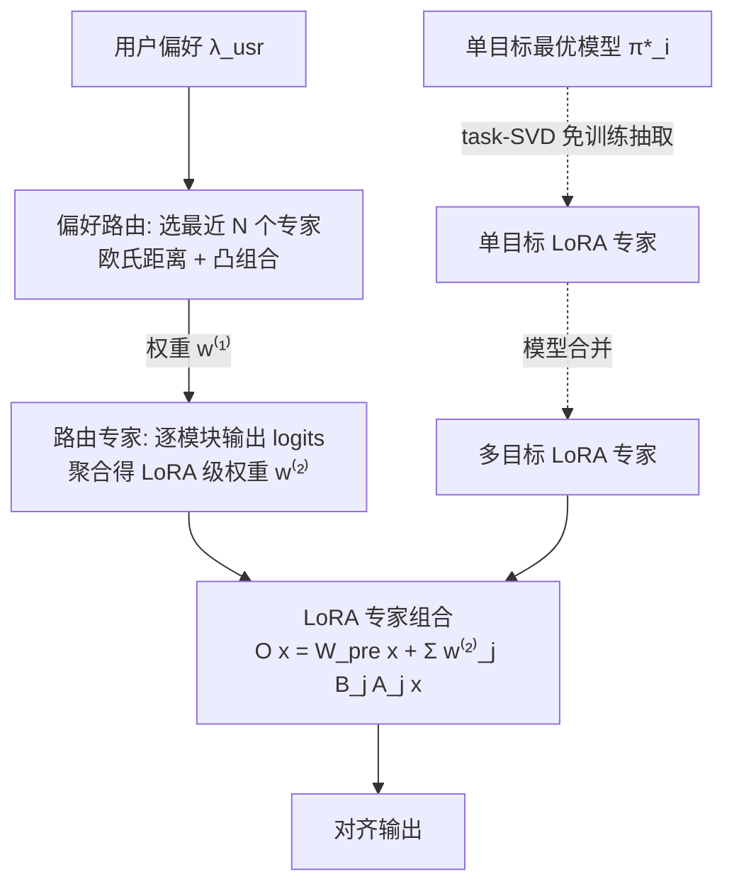

# Multi-objective Large Language Model Alignment with Hierarchical Experts

**会议**: ICLR 2026  
**OpenReview**: [https://openreview.net/forum?id=UhmEdfAk46](https://openreview.net/forum?id=UhmEdfAk46)  
**代码**: 已开源（论文中给出链接，待确认具体仓库）  
**领域**: LLM 对齐 / 多目标对齐 / 参数高效  
**关键词**: 多目标对齐, Pareto 前沿, LoRA, Mixture-of-Experts, 模型合并, 偏好可控  

## 一句话总结
HoE 把多目标对齐拆解成一系列"单偏好子问题"，用免训练抽取的 LoRA 专家 + 轻量路由专家 + 无参偏好路由构成三层 Mixture-of-Experts，无需重训主干即可即插即用地覆盖整条 Pareto 前沿、响应任意用户偏好权重。

## 研究背景与动机
**领域现状**：人类偏好高度多样且常相互冲突——同样是"有用 / 无害 / 幽默"几个目标，不同用户、不同场景下的相对权重也各不相同。多目标对齐（MOA）的核心诉求是让一个 LLM 能按用户给定的偏好权重向量 $\lambda=(\lambda_1,\dots,\lambda_N)$ 动态可控，相当于一个"万金油"模型沿 Pareto 前沿任意游走。

**现有痛点**：主流做法各有硬伤。MORLHF / MODPO 走线性标量化路线，每个偏好都要单独训一个模型，存储和训练成本随偏好数线性爆炸；MOD / Args / PAD 在解码时做 logits 融合，推理需多次前向；RiC / DPA 把偏好塞进 prompt，依赖结构化提示且难处理强冲突目标。LoraMoE 虽然也用 LoRA 当专家，但需要把所有专家一起从头训练、专家间难共享知识，不适合 MOA。

**核心矛盾**：单个"大一统"模型在所有权重上均匀训练，无法在某个具体权重（如 $[0.5,0.5]$）上达到该点专门微调专家的最优——既存在**目标间冲突**（调好 helpfulness 往往牺牲 harmlessness），也存在**偏好间竞争**（均匀训练的前沿被各点专属前沿支配）。这正是"可控性瓶颈"。

**本文目标**：在不重训任何模型、参数开销极小的前提下，让 LLM 即插即用地逼近最优 Pareto 前沿，并对任意偏好权重做细粒度可控。

**核心 idea**：**分解 + 分层专家**——把多目标问题拆成单偏好子问题，每个子问题交给一组专门的"专家"参数处理，再用分层 MoE 框架把这些局部专家组装回完整前沿，从而绕开单模型覆盖全前沿的可控性瓶颈。

## 方法详解

### 整体框架
HoE 由三层层级化组件自上而下组成：**LoRA 专家**（粗粒度、对应固定偏好的参数块）、**路由专家**（轻量、做模块级细粒度自适应选择）、**偏好路由**（无参、把用户偏好定位到邻近专家）。推理时一条用户偏好向量 $\lambda_{usr}$ 先被偏好路由"定位"到邻近专家，再由路由专家"精修"出 LoRA 级混合权重，最后在前向中由 LoRA 专家"实现"，把局部专家组装成针对该偏好的定制模型。

### 关键设计

**1. 免训练抽取 LoRA 专家：从现成单目标模型里"榨"出可组合的适配器。** HoE 不重新训练任何对齐模型，而是直接拿一组现成的单目标最优策略 $\{\pi_1^*,\dots,\pi_N^*\}$，按模型合并里的 task vector 思路定义目标向量 $\tau_i=\theta_i-\theta_{pre}$（微调权重与预训练权重之差），它天然编码了第 $i$ 个目标的能力。再用 task-aware 截断 SVD（task-SVD）把 $\tau_i$ 压成低秩适配器 $A_i\in\mathbb{R}^{d_{in}\times r}, B_i\in\mathbb{R}^{r\times d_{out}}$，$r\ll\min(d_{in},d_{out})$——挑高幅值分量、逐层截断、重缩放，几乎无性能损失就得到高度专门化的 LoRA 专家。把 Transformer 所有线性层改造成 MoE 插件后，给定路由权重 $\lambda$，模块输出为 $O_\lambda(x)=W_{pre}x+\sum_{i=1}^N \lambda_i B_i(A_i x)$，即预训练权重叠加各专家的低秩残差。

**2. 多目标 LoRA 专家：用模型合并补齐前沿中间点。** 单目标专家的线性组合在前沿中间点（如 $\lambda=[0.5,0.5]$）往往恢复不出最优。HoE 借鉴模型合并"放大对所有任务有益的参数、抑制冲突参数"的非线性思路，对目标偏好 $\lambda$ 合成新专家参数 $\tau_\lambda=\text{Merge}(\{\tau_i\}_{i\in[N]},\lambda)$，再走同一套 task-SVD 压缩。得到的适配器不再对应单一目标，而是专精于某个目标组合，按需生成任意偏好配置下的对齐能力，弥补线性融合的不足。

**3. 路由专家：用可忽略的参数换细粒度、输入自适应的专家选择。** 纯靠堆 LoRA 专家提升前沿覆盖会让参数预算迅速膨胀。HoE 在每个 Transformer block 插入一个轻量线性路由层作为"路由专家"，它读取与 LoRA 相同的隐状态 $x$，对所有 LoRA 专家投票打分；每个路由专家 $\eta_\lambda$ 绑定一个目标偏好 $\lambda^{(e)}$，只激活偏好空间中离它最近的 $N$ 个 LoRA 专家。关键在于**所有 LoRA 专家参数全程冻结**，只训这些极小的路由层，于是它能按输入在模块级动态决定激活哪些 LoRA，实现比静态线性组合更高效自适应的容量利用。

**4. Tchebycheff 标量化 + 在线镜像下降：稳住非凸前沿区域的训练。** 路由专家的训练目标是最大化与 $\lambda^{(e)}$ 对齐的标量化多目标奖励。为应对 Pareto 前沿的非凸区域，HoE 不用容易把策略推向前沿边缘的线性标量化，而采用 Tchebycheff 标量化，聚焦相对参考点 $z^*$ 表现最差的目标：$J(\theta|\lambda)=\max_\theta \min_i\{\lambda_i(R_i(\theta)-z_i^*)\}$。这个 max–min 问题用在线镜像下降（OMD）求解，维护一个在目标上平滑的分布 $w$，等价改写为 $J(\theta|\lambda)=\max_\theta\sum_i w_i(R_i(\theta)-z_i^*)$，$w$ 用时序差分在线更新以稳定训练，最终嵌入 PPO，策略梯度为 $\nabla_\theta J=\mathbb{E}[(\sum_i w_i A_i^{\pi_\theta})\nabla_\theta\log\pi_\theta]$，并有 $O(\log N/T)$ 的收敛保证。

**5. 无参偏好路由与分层组装推理：把"定位—精修—实现"串成一次前向。** 偏好路由层不含参数，按欧氏距离选出离 $\lambda_{usr}$ 最近的 $N$ 个专家 $\Lambda_{selected}=\arg\min^N_i\|\lambda_{usr}-\lambda_i\|$，把 simplex 划成粗区域（LoRA 专家）再用路由专家细化。推理三步走：① 偏好路由把 $\lambda_{usr}$ 表达成邻近专家偏好的凸组合 $\lambda_{usr}=\sum_{i\in\Lambda_{selected}} w_i^{(1)}\lambda_i$；② 路由专家按输入产出 logits，与 $w^{(1)}$ 聚合得 LoRA 级权重 $w^{(2)}=\sum_i w_i^{(1)}\vec\eta_{\lambda_i}(x)$；③ 最终输出 $O(x)=W_{pre}x+\sum_j w_j^{(2)} B_j A_j x$，完成 LoRA 专家的混合实现。

## 实验关键数据

### 主实验设置
- **规模**：6 个 NLP 任务、16 个目标（Helpful / Harmless / Humor / Correctness / Coherence / Complexity / Verbosity / Faithful / Summary / Reward / Cost / CoT-length / Math / Code 等）、200 种不同偏好、对比 15 个近期 baseline；覆盖二目标、三目标、多目标三类场景。
- **数据集**：Helpful Assistant、Math、Reddit Summary、Beaver Tail、HelpSteer、Psoups、CMMLU、HumanEval、HelpSteer2。
- **指标**：每个目标配一个开源奖励模型给分画 Pareto 前沿，并辅以 GPT-4 win rate（对比 base model）。

### 主实验结果

| 场景 | 关键结果 |
|------|----------|
| 二目标（7 组 setup）| HoE 逼近 MORLHF 理论上界，前沿平滑且凸；**完全支配** RS 和 MOD；对比 RiC 在 7 例中 5 例更优（"Summary & Deberta"上 +2 / +0.8）|
| 三目标（Helpful/Harmless/Humor）| 在 Helpful Assistant 上 Pareto 支配 RS、MOD，多数权重优于 RiC |
| 三目标严格泛化（Psoups + HelpSteer2，Llama3.1-8B，11 baseline）| 14 个评测 setup 中 **11 个排第一**，仅 3 个被 PAD 微弱超越 |
| 多目标（5 目标，HelpSteer）| 平均分最高，全目标超过 MOD / RS / RiC |
| 方法属性（Tab.1）| 存 1 个模型、推理 1 次、训练 0 个模型、Pareto 可控、多任务、可扩展、免提示——综合开销最低 |

### 消融实验（Fig.5）

| 消融项 | 配置 | 结论 |
|--------|------|------|
| 专家组合 | 2 LoRA+1 Router | 局部小幅提升，受限于参数量 |
|  | 3 LoRA | 邻近偏好大幅扩张前沿，但其他偏好快速退化（覆盖有限）|
|  | 3 LoRA+1 Router | 近乎完整前沿，路由专家与 LoRA 强协同 |
|  | 4 LoRA | 逼近 MORLHF，但相对 3 LoRA 边际收益递减 |
| LoRA rank | rank 越大越好 | Math 任务对 rank 更敏感，rank=256 足以平衡性能与效率 |
| 标量化 | 线性 vs Tchebycheff | 线性易把策略推向前沿边缘导致不稳/崩溃，Tchebycheff(OMD-STCH-MORL) 稳定且保全覆盖 |

### 关键发现
- **LoRA 专家提供主力增益但边际递减，路由专家用远少的参数提供互补增益**——二者协同才是性能与参数效率平衡的关键。
- **Token 级专家权衡**：Case study 中混合偏好 $[0.35,0.28,0.35]$ 下，早期 token 由 Helpful 专家主导，后期 token 更多激活 Harmless/Humor，从而化解对抗性 prompt——这种 token 级、可解释的细粒度偏好控制是 HoE 独有的。

## 亮点与洞察
- **"分解再组装"把可控性瓶颈转成专家路由问题**：与其逼一个模型覆盖全前沿，不如让每个专家只管自己那块局部最优，再用分层路由拼回去——思路干净且工程上极友好。
- **几乎全程免训练**：单目标专家靠 task-SVD 从现成模型抽取、多目标专家靠模型合并合成，只有极小的路由层需要训练，存储/训练成本相比 MORLHF、MODPO 量级下降。
- **三层抽象各司其职**：偏好路由（定位/无参）→ 路由专家（精修/输入自适应）→ LoRA 专家（实现/容量），层次分明，新目标只需扩展偏好向量即可加入，不必重训或作废已有专家。
- **Tchebycheff + OMD 的优化选择有理论支撑**：直击线性标量化在非凸前沿崩溃的痛点，并给出 $O(\log N/T)$ 收敛保证。

## 局限与展望
- **依赖现成的单目标最优模型**：HoE 的免训练优势建立在已有高质量单目标策略 $\pi_i^*$ 之上，若某目标缺乏现成模型，仍需先付出单目标对齐成本。
- **强冲突目标上的劣势**：在强冲突设置（如某些 Helpful & Harmless 权重）下被 RiC / PAD 微弱超越，作者归因于其在线训练对强冲突的处理优势——HoE 的离线专家组合在极端冲突区可能不够灵活。
- **专家数量与前沿覆盖的权衡**：LoRA 专家增多收益递减，覆盖整条前沿到底需要多少专家、如何自动决定专家偏好布点，论文未给出系统性的最优配置策略。
- **task-SVD / 合并的误差累积**：低秩压缩与模型合并都引入近似，多目标专家在高维偏好（many-objective）下的合成质量随目标数增长的退化情况值得进一步探究。

## 相关工作与启发
- **多目标对齐谱系**：线性标量化重训路线（MORLHF、MODPO）、解码时 logits 融合（MOD、Args、PAD）、in-context 偏好注入（DPA、RiC）、steering 向量（Steering）、输出精修（MetaAligner/Aligner）——HoE 在 Tab.1 中系统对比，定位为"存储/推理/训练三低 + Pareto 可控"。
- **知识融合**：基于 Task Arithmetic 的 task vector 与模型合并（PCB-Merging、FR-Merging 等）是 HoE 免训练抽取/合成专家的直接技术来源；与最接近的 LoraMoE 相比，HoE 免去了"所有专家一起从头训"的代价并改善了专家间知识共享。
- **启发**：把"模型合并 + LoRA-MoE + 偏好几何路由"三者缝合，提示了一条"用现成模型零件即插即用拼出可控对齐"的低成本范式，对个性化、可控生成等需要沿偏好连续游走的场景很有借鉴价值。

## 评分
- **新颖性**: ⭐⭐⭐⭐ — "分解成单偏好子问题 + 三层 MoE（免训练 LoRA 抽取 / 合并合成 / 路由专家）"的组合在 MOA 中较新颖，task-SVD + Tchebycheff-OMD 的工程整合有想法，虽各零件多来自已有技术。
- **实验充分度**: ⭐⭐⭐⭐ — 16 目标、200 偏好、6 任务、15 baseline，覆盖二/三/多目标 + 严格泛化，消融围绕核心专家组合展开，Case study 给出 token 级可解释证据；许多结果以 Pareto 前沿图呈现，绝对数值表格相对偏少。
- **写作质量**: ⭐⭐⭐⭐ — 动机—分解思想—三层方法层层递进，Tab.1 的方法属性对照清晰；公式记号略密集，部分图（如 Fig.3/4 的多目标前沿）信息量大需细读。
- **价值**: ⭐⭐⭐⭐ — 免训练、低存储、低推理、即插即用且可沿前沿连续可控，对工业界部署个性化可控 LLM 很有吸引力；强冲突区的劣势与对现成单目标模型的依赖是落地需权衡的点。

<!-- RELATED:START -->

## 相关论文

- [\[ICLR 2026\] OrthAlign: Orthogonal Subspace Decomposition for Non-Interfering Multi-Objective Alignment](orthalign_orthogonal_subspace_decomposition_for_non-interfering_multi-objective_.md)
- [\[ICLR 2026\] Towards Understanding Valuable Preference Data for Large Language Model Alignment](towards_understanding_valuable_preference_data_for_large_language_model_alignmen.md)
- [\[ICLR 2026\] IDEAL: Data Equilibrium Adaptation for Multi-Capability Language Model Alignment](ideal_data_equilibrium_adaptation_for_multi-capability_language_model_alignment.md)
- [\[ICLR 2026\] Semantic-aware Wasserstein Policy Regularization for Large Language Model Alignment](semantic-aware_wasserstein_policy_regularization_for_large_language_model_alignm.md)
- [\[ICLR 2026\] Test-Time Alignment for Large Language Models via Textual Model Predictive Control](test-time_alignment_for_large_language_models_via_textual_model_predictive_contr.md)

<!-- RELATED:END -->
