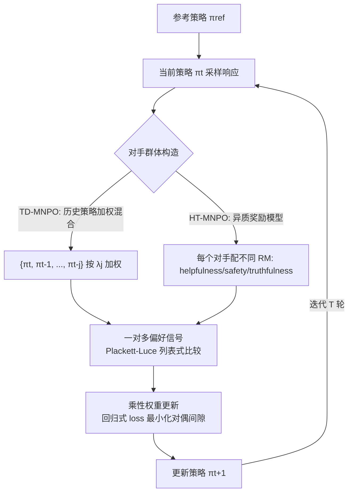

# Multiplayer Nash Preference Optimization

**会议**: ICLR 2026  
**OpenReview**: [https://openreview.net/forum?id=x7aLhLMVn1](https://openreview.net/forum?id=x7aLhLMVn1)  
**代码**: [https://github.com/smiles724/MNPO](https://github.com/smiles724/MNPO)  
**领域**: LLM 对齐 / Nash 偏好优化  
**关键词**: RLHF, Nash learning from human feedback, 多玩家博弈, 偏好非传递性, 异质奖励模型  

## 一句话总结
把 Nash learning from human feedback（NLHF）从「两玩家博弈」推广到「n 玩家博弈」，让一个策略同时对抗一整个对手群体（历史 checkpoint 或多个异质奖励模型），用乘性权重更新求近似 Nash 均衡，从而更稳、更全面地刻画真实世界中非传递、异质的人类偏好。

## 研究背景与动机
**领域现状**：主流 RLHF 建立在 Bradley–Terry 假设上——存在一个标量奖励函数 $r^*$，偏好满足传递性。但实证研究反复发现真实人类偏好是**非传递**（A>B、B>C 却 C>A）且**异质**（不同标注者、不同维度标准互相冲突）的，BT 假设并不成立。为绕开这个假设，近期工作把对齐重新表述为「在一般偏好预言机定义的博弈中找 Nash 均衡」，催生了 INPO、ONPO、SPPO、EGPO 等 NLHF 算法，它们有较好的理论保证和经验稳定性。

**现有痛点**：所有现有 NLHF 都被锁死在**两玩家**框架里——一个策略只对抗单一对手。可现实里的偏好对齐从来不是「双人对决」：它混杂着多个标注者、多套评测标准、多个奖励模型、一连串历史 checkpoint，是多源甚至自相矛盾的信号。把这片复杂图景压缩成单一对手会引入**single-opponent bias**：策略每步只对抗一个分布，导致优化震荡、探索狭窄，对整体偏好群体只是脆弱近似。

**核心矛盾**：真实偏好是「一对多」的群体竞争，而现有方法只会「一对一」。**本文目标**：建立一个把对齐显式建模为「对抗整个群体而非单一合成对手」的框架，既继承两玩家方法的均衡保证，又获得更丰富的竞争动力学和更好的偏好覆盖。

**核心 idea**：**【多玩家 Nash 博弈】** 把对齐表述为 n 玩家博弈，每个策略对抗一群对手的同时被 KL 正则化拉向参考模型；**【同质⇒强保证】** 当所有玩家共享同一偏好预言机（如对抗自身历史轨迹）时，对称博弈可用乘性权重更新拿到 $O(1/\sqrt{T})$ 的收敛保证；**【统一视角】** 通过调玩家数/对手集/距离度量/目标奖励差，DPO、IPO、SPPO、INPO 等都成为它的特例。

## 方法详解

### 整体框架
MNPO 把两玩家偏好博弈推广为 n 玩家博弈：每个策略 $\pi_i$ 最大化它对其余 $n-1$ 个对手的平均偏好胜率，同时被 KL 拉向参考策略 $\pi_{\text{ref}}$。同质设定（所有玩家共享一个预言机）下用乘性权重更新（multiplicative weights update）迭代逼近 Nash 均衡，落地为可训练的回归式 loss；落地算法 **TD-MNPO** 把「对手群体」实例化为历史策略的加权混合，**HT-MNPO** 则把对手实例化为各自带不同奖励模型的异质玩家。

### 关键设计

**1. 从两玩家到 n 玩家：群体竞争的对称博弈。** MNPO 把两玩家目标 $J(\pi_1,\pi_2)$ 推广为每个玩家对抗其余全体的目标
$$J\big(\pi_i,\{\pi_j\}_{j\neq i}\big)=\mathbb{E}_{x}\Big[\mathbb{E}_{y_i\sim\pi_i,\{y_j\sim\pi_j\}}\big[P(y_i\succ\{y_j\}_{j\neq i}\mid x)\big]-\tau\,\mathrm{KL}(\pi_i\|\pi_{\text{ref}})\Big].$$
这里的预言机 $P$ 不再是成对比较，而是把 $y_i$ 与一组对手响应作「一对多」比较。三条性质让它有意义：所有玩家被**对称对待**（均衡时 $\pi_1^*=\cdots=\pi_n^*$）、每个玩家的更新只依赖自身动作和对手的聚合行为（**去中心化**，避免复杂耦合）、$n=2$ 时精确退化回两玩家目标。这把「对抗一整个偏好群体」从口号变成了可定义、可求解的博弈对象，对偶间隙 $\mathrm{DualGap}(\pi)=\max_{\pi'}J(\pi',O_\pi)-J(\pi,O_\pi)$ 直接量化离 Nash 策略有多远。

**2. Plackett–Luce 一对多奖励 + 乘性权重更新的可训练化。** 要支持「一对多」，作者把成对的 logistic 项换成对多个候选的 softmax——即 Plackett–Luce 模型，把 $y_i$ 对其余 $k-1$ 个对手的偏好概率写成 $\exp R(x,y_i)$ 除以全体 $\exp R$ 之和；$k=2$ 时正好退回 Bradley–Terry。求解上沿用 Freund & Schapire 的乘性权重更新：
$$\pi^{(t+1)}_i(y\mid x)\propto\Big(\prod_{j\neq i}\pi^{(t)}_j(y\mid x)\Big)^{\frac{1}{n-1}}\exp\Big(\tfrac{\eta}{n-1}\textstyle\sum_{j\neq i}P(y\succ\pi^{(t)}_j\mid x)\Big),$$
保证平均策略 $\bar\pi^{(T)}$ 以 $\epsilon=O(1/\sqrt{T})$ 收敛到近似 Nash 均衡。但这个更新含一个对指数级响应空间难以计算的归一化因子 $Z$。作者的关键技巧是只看响应对 $(y,y')$ 的**对数比** $h_t(\pi,y,y')$，归一化因子在相减中抵消，于是 Nash 更新等价为一个对回归目标 $L_t(\pi)$ 的最小化——其唯一最小值点恰是 $\pi^{(t+1)}$（Lemma 1），并进一步用超参 $\eta$ 替换难算的偏好项得到自洽 loss $L'_t$。这一步是「博弈论保证」与「可端到端训练」之间的桥梁。

**3. TD-MNPO：把对手群体实例化为历史策略的时间加权混合。** n 玩家博弈最核心的工程问题是「对手集 $\{\pi_j\}$ 从哪来」。受 DNO/SPIN/INPO 用历史迭代构造对手的启发，TD-MNPO 在第 $t$ 步从近期历史策略 $\{\pi_{t-j}\}$ 取加权混合（系数 $\lambda_j\in[0,1]$），loss 写成
$$L^{t,D}_{\text{TD}}=\mathbb{E}_{y,y'\sim\pi,\,y_w,y_l\sim\lambda_P}\,D\Big[\log\tfrac{\pi(y_w\mid x)}{\pi(y_l\mid x)}-\textstyle\sum_{j}\lambda_j\log\tfrac{\pi_{t-j}(y_w\mid x)}{\pi_{t-j}(y_l\mid x)}\,\Big\|\,\eta\delta^\star\Big].$$
混合多个过去策略带来更平滑的策略演化、对近期抖动更鲁棒、收敛更稳。更妙的是这个统一式子把现有方法收编为特例：调玩家数 $n$、对手集、距离度量 $D$、目标奖励差 $\delta^\star$，就能恢复 SimPO（$n=1$）、DPO（$n=2$, 对手=$\pi_{\text{ref}}$, $D_{\text{bwd}}$）、SPPO、IPO、INPO（$n=3$, 对手=$\pi_t,\pi_{\text{ref}}$）等——MNPO 因此提供了离线/在线偏好优化的统一框架。

**4. HT-MNPO：异质奖励预言机下的多维对齐。** 现实里偏好来自多个**异质**来源（helpfulness、safety、conciseness 各自的奖励模型）。HT-MNPO 把「历史策略混合」换成「绑定不同预言机 $P_i$ 的对手策略混合」：每个玩家 $\pi_i$ 配一个独立奖励模型 $r_i$，内化各自的目标奖励差 $\delta^\star_i$。代价是当 $P_i\neq P_j$ 时博弈变成 general-sum，丢掉了对称性和形式收敛保证，因此只能用 player-specific 对偶间隙 $\mathrm{DualGap}_i$ 来刻画近似平稳点（没有玩家有强烈单边偏离动机）。但作者论证这个框架依然「自然且有原则」——每个策略对当前对手分布按自己的预言机优化，经验上能在多奖励模型场景找到有效解，恰好对应真实世界多评测者、可能冲突的对齐需求。

## 实验关键数据

设置：在线 RLHF 框架，基座 Gemma-2-9B-it，T=3 轮迭代；TD-MNPO 用 ArmoRM-Llama3-8B 作预言机，HT-MNPO 额外用 Skywork-Reward-V2 与 Athene-RM-8B 模拟异质偏好。评测用 GPT-5-mini 当裁判。

### 主实验：指令跟随 / 偏好对齐（GPT-5-mini 评判）

| 方法 | AlpacaEval 2.0 (LC WR) | Arena-Hard (WR) | MT-Bench |
|------|------------------------|------------------|----------|
| SFT (9B) | 50.15 | 44.97 | 6.49 |
| DPO | 54.35 | 45.63 | 6.87 |
| SimPO | 55.16 | 45.04 | 6.87 |
| SPPO | 55.97 | 43.89 | 6.86 |
| INPO | 56.09 | 48.03 | 6.95 |
| **TD-MNPO** | **57.27** | **52.26** | 7.03 |
| **HT-MNPO (ArmoRM)** | 57.63 | 50.93 | **7.52** |
| **HT-MNPO (Athene)** | **59.64** | 51.17 | 7.07 |

Arena-Hard 上 TD-MNPO 比次优的 INPO 高 4.23 分，且超过 Tulu-2-DPO-70B、Mixtral-8x22B-it 等大得多的模型。

### 学术能力 / 数学代码（防对齐税）

| 方法 | 知识+常识 AVG | 数学+代码 AVG | AIME-24 | HumanEval |
|------|---------------|----------------|---------|-----------|
| SFT | 70.28 | 46.61 | 0 | 60.37 |
| SimPO | 69.60（TruthfulQA 掉到 63.40） | 45.82 | 0 | 57.32 |
| INPO | 70.25 | 47.10 | 0 | 59.15 |
| **TD-MNPO** | **71.08** | **48.10** | **3.33** | **61.59** |
| HT-MNPO (Skywork) | 71.80 | 47.86 | 0 | 59.76 |

### 关键发现
- **全面领先**：在三个指令跟随基准上一致超过 DPO/SimPO/SPPO/INPO，多玩家公式确实带来对齐增益。
- **不交对齐税**：SimPO 在 TruthfulQA 上从 70.75 掉到 63.40，而 MNPO 在知识/常识/数学/代码上反而拿到最高均分，多玩家框架在提升对齐的同时保住了基础能力。
- **难任务尤其突出**：AIME-24 上 MNPO 是唯一非零（3.33）的方法，所有基线包括 SFT 全 0；HumanEval 也拿最高，说明多策略竞争对需要多种解题路径的复杂推理特别有益。
- **异质优于同质**：HT-MNPO 在多数指标上比 TD-MNPO 更强，验证了引入多个异质奖励模型能更好覆盖多维偏好。

## 亮点与洞察
- **单一对手偏差是个被忽视的真问题**：本文第一次清晰指出 NLHF 全家桶都困在两玩家里，而真实偏好天然是「一对多群体」，这个 framing 本身就有价值。
- **理论与工程之间架了桥**：用对数比消去难算的归一化因子、把乘性权重更新转成唯一最小值点的回归 loss（Lemma 1 + Proposition 1），让博弈论保证真正落到可端到端训练的目标上。
- **统一框架收编半个 RLHF 家族**：Table 1 用一张表把 SimPO/DPO/IPO/SPPO/INPO 等映射为 TD-MNPO 的特例，提供了离线/在线偏好优化的统一坐标系，理解和扩展都更顺。
- **同质要保证、异质要实用的清醒切分**：同质 MNPO 给收敛证明，异质 HT-MNPO 坦承丢掉形式保证但用 player-specific 对偶间隙描述平稳点，理论诚实且贴合现实多评测者场景。

## 局限与展望
- **异质设定无收敛保证**：HT-MNPO 在 general-sum 博弈下没有 Nash 均衡的形式收敛，只能保证近似平稳点；而恰恰是 HT-MNPO 在实验里表现最好，理论与最强经验结果之间存在缺口。
- **预言机用奖励模型模拟**：为省人工标注，所谓「异质人类偏好」其实是用 ArmoRM/Skywork/Athene 三个 RM 模拟的，是否真能代表真实非传递、冲突的人类偏好仍待验证。
- **规模与成本**：只在单一基座 Gemma-2-9B、T=3 轮上验证；多玩家意味着维护多个历史/异质策略，训练与采样开销随玩家数上升，扩展到更大模型与更多玩家的代价没有充分讨论。
- **裁判依赖**：核心结论建立在 GPT-5-mini 单一 LLM 裁判上，长度/风格偏置与裁判一致性对结论的稳健性影响值得进一步评估。

## 相关工作与启发
- **NLHF 谱系**：建立在 Munos et al. 的一般偏好预言机博弈、以及 INPO（no-regret）、SPPO、ONPO（optimistic mirror descent）、EGPO（extragradient）之上，把它们的两玩家公式统一进 n 玩家框架。
- **迭代/自博弈偏好优化**：TD-MNPO 的对手构造直接借鉴 DNO、SPIN、INPO 用历史迭代当对手的思路，本质是把「自博弈」从两玩家扩成群体级。
- **奖励感知偏好优化**：Reward-aware PO（RPO）提供了把标量奖励信号融入隐式偏好模型的接口，MNPO 的 loss 被证明是 RPO 在平方距离下的特例，从而能在保留非传递处理能力的同时利用图省事的奖励信号。
- **启发**：「把单一对手换成对手群体/历史混合」这个思路或可迁移到 GRPO、自博弈推理 RL 等场景；而「异质多奖励模型并入一个博弈」为多目标对齐（安全 vs 有用 vs 简洁）提供了一个统一而非加权求和的新范式。

## 评分
- **新颖性**: ⭐⭐⭐⭐ — 把 NLHF 从两玩家系统性推广到 n 玩家、并用一张表统一收编半个偏好优化家族，framing 清晰且有实质理论贡献，虽然乘性权重更新与自博弈思路均有前作。
- **实验充分度**: ⭐⭐⭐⭐ — 覆盖 3 个指令跟随 + 11 个学术基准 + 数学代码，对比丰富且显示不交对齐税，但只验证单一 9B 基座、用 RM 模拟人类偏好、单一 LLM 裁判，留有缺口。
- **写作质量**: ⭐⭐⭐⭐ — 动机—理论—算法—统一框架推进清晰，公式与 Table 1 的特例映射很有说服力，符号偏密集但逻辑自洽。
- **价值**: ⭐⭐⭐⭐ — 为对齐非传递、异质人类偏好提供了可扩展的统一框架，对多目标/多评测者对齐与自博弈 RLHF 都有直接启发价值。

<!-- RELATED:START -->

## 相关论文

- [\[ICLR 2026\] Semi-Supervised Preference Optimization with Limited Feedback](semi-supervised_preference_optimization_with_limited_feedback.md)
- [\[ICLR 2026\] Keep the Best, Forget the Rest: Reliable Alignment with Order-Aware Preference Optimization](keep_the_best_forget_the_rest_reliable_alignment_with_order-aware_preference_opt.md)
- [\[ICLR 2026\] Stackelberg Learning from Human Feedback: Preference Optimization as a Sequential Game](stackelberg_learning_from_human_feedback_preference_optimization_as_a_sequential.md)
- [\[ICLR 2026\] When Data Is the Algorithm: A Systematic Study and Curation of Preference Optimization Datasets](when_data_is_the_algorithm_a_systematic_study_and_curation_of_preference_optimiz.md)
- [\[ICML 2026\] Autoregressive Direct Preference Optimization](../../ICML2026/llm_alignment/autoregressive_direct_preference_optimization.md)

<!-- RELATED:END -->
