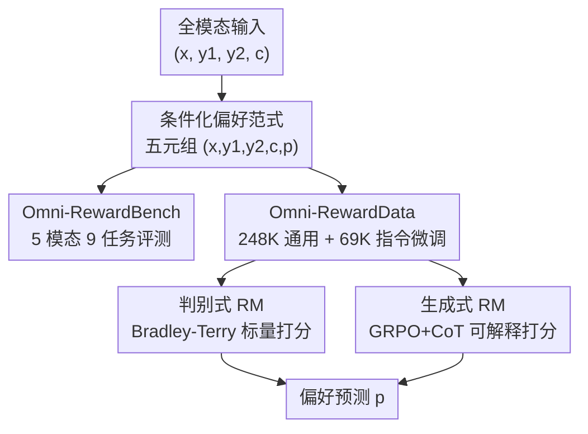

# Omni-Reward: Towards Generalist Omni-Modal Reward Modeling with Free-Form Preferences

**会议**: ICLR 2026  
**OpenReview**: [https://openreview.net/forum?id=9C4gVbPqSy](https://openreview.net/forum?id=9C4gVbPqSy)  
**代码**: https://github.com/HongbangYuan/OmniReward  
**领域**: 对齐RLHF / 多模态VLM / 奖励建模  
**关键词**: 奖励模型, 全模态, 自由形式偏好, RLHF, Bradley-Terry

## 一句话总结
本文提出 Omni-Reward，用一个统一的 benchmark（Omni-RewardBench，5 模态 9 任务）、一个大规模偏好数据集（Omni-RewardData，248K 通用 + 69K 指令微调对）和两个奖励模型（判别式 BT 版 + 生成式 R1 版），把奖励建模从「只懂文本+图像、只认固定二元偏好」扩展到「覆盖文/图/视频/音频/3D、能按用户自由文本偏好动态打分」，在自家 benchmark 上比基座模型涨 20%，并在 VL-RewardBench 等公开榜上达到/超过 SOTA。

## 研究背景与动机

**领域现状**：RLHF 是把模型行为对齐到人类偏好的主流路线，而奖励模型（RM）是其核心——它学到一个「人类偏好的代理」，给候选回答打分、引导强化学习。随着 GPT-4o、Gemini、Qwen2.5-Omni 这类 any-to-any 全模态模型的崛起，AI 既要理解也要生成文/图/视频/音频/3D 等多种模态的内容。

**现有痛点**：现有 RM 有两个结构性缺陷。其一是**模态失衡（Modality Imbalance）**——绝大多数 RM 只盯着文本和图像，对视频、音频、3D 几乎没有支持，导致这些模态上的对齐无从谈起。其二是**偏好僵化（Preference Rigidity）**——现有偏好数据都是按「有用性、无害性」这类高层共识价值标注的固定二元对，RM 训练完就把一种隐式、固定的偏好观「焊死」在参数里，无法刻画个性化偏好的多样性。

**核心矛盾**：人类偏好天然无法被整齐地切成二元类别。同一个问题，研究者想要带公式的严谨定义、普通读者想要直觉类比，两者对同一对回答的偏好恰好相反。固定二元 RM 在这种「评价标准本身在变」的场景下根本表达不出来。

**本文目标**：做一个真正的「通用全模态 RM」——既能覆盖罕见模态（视频、音频、3D）的理解与生成奖励，又能根据用户给出的自由文本偏好/多维评价标准动态调整打分。

**切入角度**：作者把问题拆成评测、数据、模型三个支点同时发力，并把「自由形式偏好」$c$ 显式地作为输入条件喂给 RM，让评价标准从「焊死在权重里」变成「运行时可指定」。

**核心 idea**：把样本从二元的 $(x, y_1, y_2, p)$ 升级为带条件的 $(x, y_1, y_2, c, p)$——给定提示 $x$、两个候选 $y_1/y_2$ 和一条自由形式偏好/标准 $c$，RM 要预测在该标准下被偏好的回答 $p$，从而用同一个模型支持任意模态 + 任意偏好。

## 方法详解

### 整体框架
Omni-Reward 不是单个模型，而是「评测—数据—模型」三件套。评测侧构造 Omni-RewardBench：从 9 个跨模态任务采集提示、用多个模型生成回答、由 3 位标注者写自由形式标准并标注偏好（含「平局」），得到 3,725 条高质量人标偏好对。数据侧构造 Omni-RewardData：一边汇集已有偏好数据集学「通用偏好」（248K 对），一边用 GPT-4o 合成带自由偏好描述的指令微调数据学「按标准打分」（69K 对）。模型侧基于这份数据训练两个 RM：判别式的 Omni-RewardModel-BT（用 Bradley-Terry 直接打标量分）和生成式的 Omni-RewardModel-R1（先生成思维链 critic 再给偏好，用 GRPO 强化学习训练）。所有样本统一表示为五元组 $(x, y_1, y_2, c, p)$，自由偏好 $c$ 作为 system message 注入，使打分行为可随标准切换。

### 关键设计

**1. 条件化的自由形式偏好范式：把评价标准从权重里挪到输入里**

针对「偏好僵化」这个痛点，本文不再让 RM 自己揣摩一种固定偏好，而是把评价标准 $c$ 显式写成输入。每条样本是 $(x, y_1, y_2, c, p)$：$x$ 是提示，$y_1/y_2$ 是两个候选回答，$c$ 是一条自由文本偏好/标准（如「需达到科研级、含正式定义与公式」或「面向无技术背景读者、强调直觉联想」），$p$ 是在该 $c$ 下被偏好的回答。评测提供两档难度：w/o Ties 时 $p \in \{y_1, y_2\}$ 强制二选一；w/ Ties 时 $p \in \{y_1, y_2, \text{tie}\}$，允许两回答在该标准下并列，更贴近真实但更难。这样同一对回答在不同 $c$ 下可以有相反的标签，RM 必须真正「读懂标准」而非记住一种偏好，从根上化解了固定二元偏好表达力不足的问题。

**2. Omni-RewardBench：首个覆盖 5 模态的自由偏好评测基准**

为暴露模态失衡，作者构造了首个全模态、带自由偏好的 RM benchmark，覆盖文/图/视频/音频/3D 五种模态下的 9 个任务（T2T、TI2T、TV2T、TA2T 四个理解任务，T2I、T2V、T2A、T23D、TI2I 五个生成/编辑任务）。构造流程是「采提示→多模型生成回答→标注者写标准→三人独立标偏好」，并做严格质量控制：先丢掉 23% 标准无效的样本、再丢掉 15% 偏好冲突的样本，由 3 名计算机博士生按详细指南标注，最终留下 3,725 条。其中音频、3D 这类罕见模态用统一手段接入 MLLM——例如 3D 用 mvdream 的多视角渲染图作为图像输入，让纯视觉 MLLM 也能评 3D。这个 benchmark 的价值在于第一次让「RM 在 audio/3D 上有多差」变得可量化（实测最强模型在 T2A 上准确率惨到 30% 出头）。

**3. Omni-RewardData：通用偏好 + 合成指令微调双源数据**

要让 RM 既懂通用价值又能按标准打分，单一数据源不够。本文用两条腿走路：**通用偏好**部分汇集 Skywork-Reward（T2T 50K）、RLAIF-V/OmniAlign-V（TI2T 133K）、HPDv2/EvalMuse（T2I）、VideoDPO/VisionReward（T2V）等现成高质量数据集共 248K 对，让模型学广泛共识偏好；**指令微调**部分则针对「按 $c$ 打分」专门合成 69K 对——从已有偏好对采样 $(x, y_1, y_2)$，让 GPT-4o 生成一条支持 $y_1$ 或 $y_2$ 的自由偏好 $c$ 及对应标签 $p$，再用 GPT-4o-mini、Qwen2.5-VL-7B、Gemma-3-12B 三模型交叉验证 $(c, x, y_1, y_2)$ 与 $p$ 的一致性以保证质量。消融显示这部分指令微调数据正是缓解偏好僵化、让模型能随自由偏好动态调分的关键。

**4. 判别式 BT 与生成式 R1 双模型：性能与可解释性两条路线**

基于上面的数据，本文给出两个互补的 RM。**判别式 Omni-RewardModel-BT** 以 MiniCPM-o-2.6 为底座，冻结视觉/音频编码器、只训语言解码器与 value head，用经典 Bradley-Terry 目标直接输出标量分：

$$\mathcal{L}_{BT} = -\log \frac{\exp(r_{BT}(c, x, y_c))}{\exp(r_{BT}(c, x, y_c)) + \exp(r_{BT}(c, x, y_r))}$$

其中 $y_c$ 是被选回答、$y_r$ 是被拒回答，偏好 $c$ 作为 system message 注入。BT 版性能强但打分过程是黑盒。为补可解释性，**生成式 Omni-RewardModel-R1** 以 Qwen2.5-VL-7B 为底座，给定 $(c, x, y_1, y_2)$ 先生成一段思维链解释 $e$、再给出偏好预测 $p'$，用 GRPO 强化学习训练（奖励 = 预测 $p'$ 与真值 $p$ 是否一致），且**仅用 3% 数据（10K 样本）从零训练**、不蒸馏更大模型。两条路线让用户在「高准确率」和「可解释推理」之间按需取舍。

### 损失函数 / 训练策略
判别式 RM 用上式 Bradley-Terry 损失，仅更新 LM 解码器与 value head；生成式 RM 用 GRPO，奖励信号是预测偏好与真值是否匹配（$reward = 1$ 当 $p' = p$），从 10K 样本从零起训。

## 实验关键数据

### 主实验
Omni-RewardBench（w/ Tie 设定，Overall 准确率，%）上，现有 RM 普遍吃力，而本文 BT 版位列第一：

| 模型 | 类型 | Overall (w/ Ties) |
|------|------|------|
| Omni-RewardModel-BT | 本文判别式 | **65.36** |
| Claude-3.5-Sonnet | 闭源最强 | 66.54 |
| Gemma-3-27B-it | 开源最强 | 65.12 |
| GPT-4o | 闭源 | 64.62 |
| UnifiedReward1.5 | 专用 RM | 59.69 |
| Omni-RewardModel-R1 | 本文生成式 | 60.18 |
| MiniCPM-o-2.6 | BT 基座 | 46.67 |

> BT 版相对其基座 MiniCPM-o-2.6（46.67%）提升约 +18.7（论文称对基座 ~20% 增益），且在 w/o Ties 下达 73.68%；R1 仅用 10K 样本就超过所有专用 RM。模态失衡显著：跨任务差距最高达 28.37%，T2A、T23D、TI2I 普遍最差。

公开 benchmark VL-RewardBench（Overall Acc，%）上 BT 版拿下 SOTA：

| 模型 | Overall Acc | Macro Acc |
|------|------|------|
| Omni-RewardModel-BT | **76.3** | 66.8 |
| Skywork-VL-Reward | 73.1 | 69.0 |
| IXC-2.5-Reward | 65.8 | 70.0 |
| GPT-4o | 65.8 | 62.4 |

### 消融实验
Omni-RewardBench（w/ Tie，Overall %）上对训练数据构成做消融：

| 配置 | Overall | 说明 |
|------|---------|------|
| MiniCPM-o-2.6 | 46.67 | 未训练基座 |
| w/ T2T | 57.13 | 只加文本偏好数据 |
| w/ TI2T | 58.84 | 加图文理解数据 |
| w/ T2I & T2V | 57.50 | 只加图/视频生成数据 |
| **w/ Full** | **65.36** | 全量数据 |
| w/ Preference-Only | 58.67 | 去掉指令微调、只留通用偏好 |

### 关键发现
- **指令微调数据是缓解偏好僵化的关键**：去掉它（Preference-Only）从 65.36 掉到 58.67，证明「按自由标准打分」的能力主要靠合成指令数据习得，而非通用偏好数据。
- **跨任务存在强相关与泛化潜力**：理解类任务（T2T/TI2T/TV2T 相关系数 0.8+）与生成类任务内部高度相关，说明同类任务间能迁移；BT 版甚至在训练未覆盖的 TA2T、T2A 上拿到 SOTA。
- **模态失衡客观存在**：T2A、T23D 这类罕见模态上所有模型都明显偏弱，最强模型在 T2A 也仅 30% 出头，是后续最该补的短板。

## 亮点与洞察
- **把评价标准「外置」是最聪明的一招**：用 $(x, y_1, y_2, c, p)$ 五元组代替二元对，让同一模型支持矛盾偏好——这套条件化范式可直接迁移到任何需要个性化/多维评价的打分任务。
- **3D「降维」成多视角图像**喂给纯视觉 MLLM，是把罕见模态低成本接入统一 RM 的实用 trick，避免为每个模态单独造编码器。
- **生成式 R1 仅用 3% 数据从零训出可解释 RM**，说明「先 CoT 再裁决 + GRPO」在 RM 上的样本效率很高，对算力有限的团队友好。
- **benchmark 本身是大贡献**：第一次把「RM 在 audio/3D 上到底多差」量化出来，为社区指明了模态失衡的具体短板。

## 局限与展望
- **R1 性能仍逊于 BT**（60.18 vs 65.36）：可解释性目前以一定准确率为代价换取，两者尚未兼得。
- **3D 评测靠多视角渲染图近似**，并非真三维表示，可能漏掉几何/拓扑层面的偏好；音频也依赖 MLLM 的有限听觉能力。
- **指令微调数据由 GPT-4o 合成**，自由偏好 $c$ 的分布可能带有合成偏置，与真实用户表达存在 gap；虽有三模型交叉验证但仍非人工。
- **w/ Ties 整体天花板偏低**（最强也仅 66 左右），说明「判平局」这一更真实的设定仍是开放难题。

## 相关工作与启发
- **vs 文本/图像 RM（Skywork-Reward、HPSv2、PickScore）**：它们只覆盖单/双模态且偏好固定，本文把模态扩到 5 种、把偏好变成运行时可指定，泛化面更广但单模态绝对精度未必反超专用模型。
- **vs 多模态专用 RM（IXC-2.5-Reward、UnifiedReward）**：专用 RM 在其训练模态上很强但跨模态/跨标准迁移弱，Omni-Reward 以统一数据+统一范式换取更强的跨任务泛化（在 VL-RewardBench 上反超它们）。
- **vs R1 系生成式 RM**：本文沿用「CoT + GRPO」思路，但创新在把自由偏好 $c$ 作为条件、并验证其在全模态 RM 上的样本效率。

## 评分
- 新颖性: ⭐⭐⭐⭐⭐ 首个全模态 + 自由偏好的 RM benchmark/数据/模型三件套，条件化偏好范式有普适价值
- 实验充分度: ⭐⭐⭐⭐⭐ 评测覆盖 30+ 基线、5 模态 9 任务，数据构成消融与跨任务相关分析扎实
- 写作质量: ⭐⭐⭐⭐ 结构清晰、贡献切分明确，部分表格信息量大需细读
- 价值: ⭐⭐⭐⭐⭐ 直指全模态对齐的核心缺口，benchmark + 数据 + 模型全开源，社区基建意义强

<!-- RELATED:START -->

## 相关论文

- [\[ICLR 2026\] Robust Reward Modeling via Causal Rubrics](robust_reward_modeling_via_causal_rubrics.md)
- [\[ICLR 2026\] Beyond Binary Preferences: A Principled Framework for Reward Modeling with Ordinal Feedback](beyond_binary_preferences_a_principled_framework_for_reward_modeling_with_ordina.md)
- [\[ICLR 2026\] Learning Ordinal Probabilistic Reward from Preferences (OPRM)](learning_ordinal_probabilistic_reward_from_preferences.md)
- [\[ICLR 2026\] RewardBench 2: Advancing Reward Model Evaluation](rewardbench_2_advancing_reward_model_evaluation.md)
- [\[ICLR 2026\] Reward Model Routing in Alignment](reward_model_routing_in_alignment.md)

<!-- RELATED:END -->
