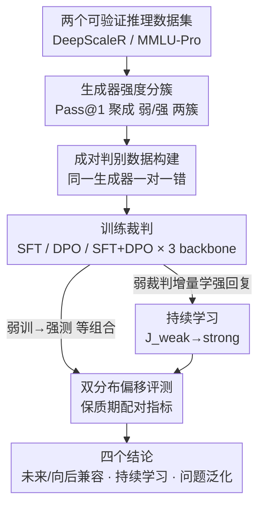

# On the Shelf Life of Fine-Tuned LLM-Judges: Future-Proofing, Backward-Compatibility, and Question Generalization

**会议**: ICLR 2026  
**OpenReview**: [https://openreview.net/forum?id=fVTqNpny5r](https://openreview.net/forum?id=fVTqNpny5r)  
**代码**: https://github.com/iamjanvijay/judge-training-analysis  
**领域**: 对齐RLHF / LLM-as-judge 评测  
**关键词**: LLM 裁判, 分布偏移, 未来兼容性, 向后兼容性, 持续学习

## 一句话总结
这篇论文把"被微调好的 LLM 裁判能用多久"形式化成一个**双分布（问题分布 × 回复分布）偏移问题**，通过两个推理数据集、三种训练配方、三个 backbone 的系统实验发现：裁判很难"未来兼容"（在更强新模型的回复上掉点严重）、却比较容易"向后兼容"（在更弱旧回复上几乎不掉点），而持续学习能在新旧之间取得更平衡的适配，且所有裁判对训练时没见过的新问题都泛化不佳。

## 研究背景与动机

**领域现状**：LLM-as-judge 已经成为 LLM 开发流程里的核心环节——既当训练时的奖励模型，又当推理时（test-time scaling）的验证器。早期做法是直接 zero-shot prompt 一个强模型当裁判，但这类裁判被反复证明带有风格偏好、长度偏好、位置偏好等系统性 bias。于是近期主流转向**微调专用裁判**：用更小的模型、配上裁判专用数据训练，既性能更好又对常见 bias 更鲁棒。

**现有痛点**：现有评测只衡量裁判在**固定数据集**上的准确率，完全忽略了真实部署里最要命的一件事——**生成器是不断更替的**。今天用 Gemma-2、Qwen-2 这一代模型的回复训出来的裁判，明年要去评 Gemma-3、Qwen-2.5 的回复；一条已经上线的评测流水线，把旧裁判换成新裁判后，对历史回复还判得准吗？这些"保质期"问题从没被系统研究过。

**核心矛盾**：裁判的输入其实由两个会随时间漂移的来源构成——**回复的来源模型在变强**、**要评的问题在变新**。但现有训练/评测都把裁判当成静态的，训练分布和测试分布默认一致。一旦生成器换代，训练-测试就出现分布偏移，而没人量化过这个偏移到底有多伤。

**本文目标**：把裁判的"保质期"拆成四个可量化的实际问题——未来兼容性（future-proofing）、向后兼容性（backward-compatibility）、持续学习能否两头兼顾、对新问题的泛化能力。

**切入角度**：作者提出一个关键观察——裁判输入可以**解耦**成"问题分布 $\mathcal{Q}$"和"回复分布 $\mathcal{R}$"两条独立的漂移源。把它们分开，就能各自隔离、单独量化"生成器变强"和"问题变新"对裁判性能的影响。

**核心 idea**：用**双分布形式化** $\mathcal{X} = \mathcal{Q} \times \mathcal{R} \times \mathcal{R}$ 来重新定义自动评测，用弱/强两簇生成器模拟模型发展时间线，再设计一组配对指标去测裁判在各种分布偏移下的"保质期"。

## 方法详解

这篇论文本质是一个**测量框架 + 系统性实证研究**，而不是提出新的裁判训练算法。它的"方法"是：先把自动评测形式化成双分布问题，再搭一套可控实验把训练/测试分布拆成弱/强、见过/没见过的不同组合，最后用一组专门设计的指标去读出裁判在每种偏移下掉了多少点。

### 整体框架

整条流水线是：拿两个有标准答案的推理数据集（DeepScaleR 的奥赛数学、MMLU-Pro 的多领域知识题）→ 对一批指令模型按 Pass@1 测强度并聚成"弱""强"两簇 → 用每个生成器采样回复、按对错配成"一对一错"的成对样本，分别堆成 weak 数据集和 strong 数据集 → 用 SFT / DPO / SFT+DPO 三种配方、在三个 backbone 上训出裁判 → 在双分布的不同训练-测试组合下评测，用配对指标读出未来兼容、向后兼容、持续学习、问题泛化四个方面的结论。

### 关键设计

**1. 双分布形式化：把"生成器变强"和"问题变新"两条漂移源拆开**

痛点是现有评测把裁判输入当成单一分布，无法区分"性能下降是因为回复变难判了，还是因为问题没见过"。作者提出把成对裁判的输入分布写成
$$\mathcal{X} = \mathcal{Q} \times \mathcal{R} \times \mathcal{R}$$
其中 $\mathcal{Q}$ 是问题分布（由领域、难度等刻画），$\mathcal{R}$ 是回复分布（由风格、模型族特有的习惯刻画），且一对里的两条回复来自**同一个**生成器。训练和测试各自有 $\mathcal{X}^{\text{train}} = \mathcal{Q}^{\text{train}} \times \mathcal{R}^{\text{train}} \times \mathcal{R}^{\text{train}}$ 与对应的 $\mathcal{X}^{\text{test}}$。这样一来，只动 $\mathcal{R}$（弱→强）就能隔离"生成器换代"的影响，只动 $\mathcal{Q}$（见过→没见过）就能隔离"问题更新"的影响。这个解耦是后面所有指标能成立的地基——它把一个混杂的"裁判会不会失效"问题，拆成几个能单独拨动一个旋钮的受控实验。

**2. 生成器强度分簇与成对数据构建：用 Pass@1 把模型时间线压成弱/强两簇**

要模拟"模型一代代变强"，得先有个客观的强弱标准。作者对每个生成器在每道题上采样 20 条回复，用 **Pass@1**（均匀抽一条回复正确的概率）度量强度。在 DeepScaleR 上，模型自然分成两个**界限分明**的簇：弱簇 0.17–0.26（Gemma-2-9B、Qwen-2-7B、Llama-3.1-8B、Ministral-8B），强簇 0.42–0.50（Gemma-3-12B、Qwen-2.5-7B、Qwen-2.5-32B 等），中间 0.26–0.42 有一道 0.16 宽的空隙没有任何模型落入，所以无论阈值取在这个区间哪儿，分簇都稳健，而且强弱簇恰好对应模型发布日期的新旧。数据构建上，对每道题采多条回复、按标准答案 $A^\star$ 标对错，再把**一条正确 + 一条错误**配成一对（两条回复必来自同一生成器），得到一个有客观正解的成对样本，按弱/强簇聚成 weak 数据集和 strong 数据集。

**3. 四组保质期配对指标：把每种分布偏移翻译成一个可读的掉点数**

这是论文测量的核心。所有指标都基于 consistent accuracy（计入回复顺序 bias 的准确率），记 $\text{Acc}_e(J_t)$ 为"在分布 $t$ 上训练、在分布 $e$ 上评测"的裁判准确率。

*未来兼容*用两个指标：$\text{FutureProof} = \text{Acc}_{\text{strong}}(J_{\text{weak}}) - \text{Acc}_{\text{weak}}(J_{\text{weak}})$，即弱回复训出的裁判从弱测试集换到强测试集后性能的变化，负值=在更强回复上退化；$\text{RefreshAdvantage} = \text{Acc}_{\text{strong}}(J_{\text{strong}}) - \text{Acc}_{\text{strong}}(J_{\text{weak}})$，即针对强回复，把训练数据换成强回复带来的增益。

*向后兼容*对称地用：$\text{BackCompatibility} = \text{Acc}_{\text{weak}}(J_{\text{strong}}) - \text{Acc}_{\text{weak}}(J_{\text{weak}})$，衡量用强训裁判替换旧裁判后、在旧弱回复上是涨是跌（正值=新裁判能当无损 drop-in 替换）；$\text{CompatibilityShift} = \text{Acc}_{\text{weak}}(J_{\text{strong}}) - \text{Acc}_{\text{strong}}(J_{\text{strong}})$，衡量强训裁判去评弱回复时相对自己"主场"掉了多少（强→弱的偏移代价）。

*问题泛化*固定回复来源、只切问题见/未见：$\text{QuestionGen}_{\text{weak}} = \text{Acc}_{\text{weak,unseen}}(J_{\text{weak}}) - \text{Acc}_{\text{weak,seen}}(J_{\text{weak}})$（强簇同理），负值=对没见过的问题泛化失败。这套配对设计的巧妙在于：每个指标都是同一裁判在"只改一个分布旋钮"前后的差，因此读数直接就是某一种偏移的净代价，干净可比。

**4. 持续学习 $J_{\text{weak}\to\text{strong}}$：在旧裁判上增量学新回复，兼顾两头**

从零在强回复上重训虽然对评强回复最优，但会丢掉对旧回复的适配、也浪费已有裁判。作者模拟持续学习：在 $J_{\text{weak}}$ 基础上继续用强生成器回复做 DPO 微调，得到 $J_{\text{weak}\to\text{strong}}$（受算力限制，这部分只在 DeepScaleR + DPO 上做）。评估时把未来兼容公式(4)(5)里的 $J_{\text{weak}}$、向后兼容公式(6)(7)里的 $J_{\text{strong}}$ 都替换成这个持续学习模型，看它能否一边提升对强回复的适配、一边保住对弱回复的兼容。结果是 FutureProof 普遍上升、RefreshAdvantage 逼近零（说明"从零重训"相对持续学习的优势几乎消失），且向后兼容在多数模型上也有改善——持续学习在新旧分布间给出了比"只训弱"或"只训强"都更平衡的折中。

### 损失函数 / 训练策略

裁判训练用三种通用配方：SFT 只用正样本 $(x, y^+)$，DPO 用正负对 $(x, y^+, y^-)$，以及 SFT+DPO 组合。由于 SFT/DPO 都需要 CoT 解释 $C$ 作为监督，作者沿用教师模型蒸馏惯例：从教师模型采样裁判输出，再用标准答案判定的 verdict $V^\star$ 把输出分成正样本 $y^+$ 与负样本 $y^-$。训练的三个 backbone 是 Llama-3.1-8B、Ministral-8B、Mistral-24B，覆盖不同规模与强度。

## 实验关键数据

### 主实验（DeepScaleR，consistent accuracy 差值，单位：百分点）

| 维度 | 指标 | 典型表现 | 结论 |
|------|------|----------|------|
| 未来兼容 | FutureProof | 全部为负（约 −0.9 ~ −6.2） | 弱训裁判评强回复**普遍退化** |
| 未来兼容 | RefreshAdvantage | 全部为正（最高 DPO/Mistral-24B +7.6） | 换强回复重训**稳定涨点**，DPO 最猛 |
| 向后兼容 | BackCompatibility | 接近 0，DPO 甚至转正（如 +2.1） | 强训裁判评弱回复**几乎不掉点** |
| 向后兼容 | CompatibilityShift | 多为负（如 Mistral-24B −3.4） | 仍有强→弱偏移代价，但小于未来兼容的代价 |
| 问题泛化 | QuestionGen | 几乎全负（Mistral-24B 最低 −10.2） | 对未见问题**泛化失败** |

### 持续学习与配方对比

| 配置 | 关键现象 | 说明 |
|------|---------|------|
| $J_{\text{weak}\to\text{strong}}$ vs $J_{\text{weak}}$ | FutureProof 三模型全升 | 持续学习更能适配弱→强偏移 |
| $J_{\text{weak}\to\text{strong}}$ vs $J_{\text{strong}}$ | RefreshAdvantage 逼近 0 | 从零重训的优势几乎被持续学习抹平 |
| DPO vs SFT（RefreshAdvantage） | DPO 增益最大（+7.6 vs SFT 微正） | 重训时 DPO 配方最受益，且随模型增大更明显 |
| SFT vs DPO（QuestionGen） | SFT 掉点最小 | 问题泛化上反而 SFT 配方最稳 |

### 关键发现
- **未来兼容是真难题**：在 DeepScaleR 所有模型×配方组合里，FutureProof 没有一个是正的，且配方/模型族之间没有可辨的规律，作者建议逐模型评估而非套用经验。
- **向后兼容是"白送"**：强训裁判去评旧弱回复几乎无损，DPO 甚至反超弱训裁判——意味着用新回复重训出来的裁判可以当旧裁判的无损 drop-in 替换，既会评新回复又不丢旧能力，"重训永远值得"。
- **强→弱比弱→强容易**：CompatibilityShift 的掉点普遍小于 FutureProof，说明弱→强（评更强回复）才是更难的偏移方向，反过来印证了"必须拿新回复重训"。
- **规模反直觉**：最大的 Mistral-24B 在 CompatibilityShift 和 QuestionGen 上掉点都最大，更大的裁判并不天然泛化更好。

## 亮点与洞察
- **双分布解耦是真正的"地基级"贡献**：把混杂的"裁判会不会过期"拆成只动一个旋钮的受控实验，让每个掉点数都能归因到具体偏移源——这个思路可以迁移到任何"训练-部署分布会随时间漂移"的评测/奖励建模场景。
- **配对指标设计干净**：每个指标都是同一裁判在改一个分布前后的差，省掉了跨模型绝对值不可比的麻烦，读数即代价。
- **"重训永远值得"是个很实用的部署结论**：未来兼容差 + 向后兼容好，合起来意味着维护方应该**主动追新**——只要用最新生成器回复重训，新裁判既显著更会评新模型、又能无损接管旧评测流水线。
- **配方各有所长**：DPO 在追新（RefreshAdvantage）上最猛，SFT 在问题泛化上最稳，说明没有一种配方全面占优，要按目标选。

## 局限与展望
- **持续学习只在单一设置验证**：$J_{\text{weak}\to\text{strong}}$ 受算力限制只跑了 DeepScaleR + DPO 一种组合，向后兼容结果还出现了 Ministral-8B 反降的混合现象，结论的普适性有待更多数据集/配方验证。
- **只覆盖可验证推理任务**：两个数据集都是有客观标准答案的数学/知识题，成对样本靠"一对一错"自动构造；对开放式生成、风格偏好这类**没有 ground-truth verdict** 的评测，保质期结论能否迁移是未知的。
- **强弱靠 Pass@1 二分簇**：用单一准确率指标把生成器二分成弱/强，虽然 DeepScaleR 上空隙明显，但把"模型变强"压成两档可能掩盖了连续漂移下的更细致行为。
- **未提供"如何造未来兼容裁判"的解法**：论文是诊断性的——它精确量化了问题严重性，但除了"持续学习有帮助"外，没有给出系统的未来兼容训练方法，这是留给后续工作的明确缺口。

## 相关工作与启发
- **vs 弱到强泛化（Weak-to-Strong Generalization, Burns et al. 2023）**：他们研究"用弱监督提升强模型"，本文研究的是裁判这一侧——弱回复训的裁判去评强回复，关注的是评估器对生成器换代的鲁棒性，互补而非重叠。
- **vs 易到难泛化 / 可扩展监督**：那条线关注训练难度的迁移，本文则把漂移源具体定位到"生成器群体随时间演化"和"问题更新"两条真实世界的轴。
- **vs 既有 LLM-as-judge bias 分析（位置/长度/自偏好）**：以往工作多在**静态**裁判 + 固定数据集上分析系统性偏差，本文转向**动态**设定——生成器随时间变化引入回复分布偏移，从而催生未来/向后兼容、问题泛化这套新指标。

## 评分
- 新颖性: ⭐⭐⭐⭐⭐ 把"裁判保质期"形式化成双分布偏移并配套一组干净指标，是此前无人系统研究过的角度
- 实验充分度: ⭐⭐⭐⭐ 两数据集×三配方×三 backbone 的受控网格扎实，但持续学习仅单设置、只覆盖可验证任务
- 写作质量: ⭐⭐⭐⭐⭐ 定义、公式、动机层层递进，每个指标都讲清了它测的是哪种偏移
- 价值: ⭐⭐⭐⭐⭐ "重训永远值得""未来兼容难、向后兼容易"这类结论对裁判/奖励模型的真实部署直接有指导意义

<!-- RELATED:START -->

## 相关论文

- [\[ICLR 2026\] Enhancing Trustworthiness of Fine-Tuned LLMs via Regularized Subset Selection](enhancing_trustworthiness_of_fine-tuned_llms_via_regularized_subset_selection.md)
- [\[ACL 2026\] Compatibility-Aware Dynamic Fine-Tuning for Large Language Models](../../ACL2026/llm_alignment/compatibility-aware_dynamic_fine-tuning_for_large_language_models.md)
- [\[ICLR 2026\] Weak-to-Strong Generalization with Failure Trajectories](weak-to-strong_generalization_with_failure_trajectories.md)
- [\[ICLR 2026\] Fluent Alignment with Disfluent Judges: Post-training for Lower-Resource Languages](fluent_alignment_with_disfluent_judges_post-training_for_lower-resource_language.md)
- [\[ICLR 2026\] Data Selection for LLM Alignment Using Fine-Grained Preferences](data_selection_for_llm_alignment_using_fine-grained_preferences.md)

<!-- RELATED:END -->
