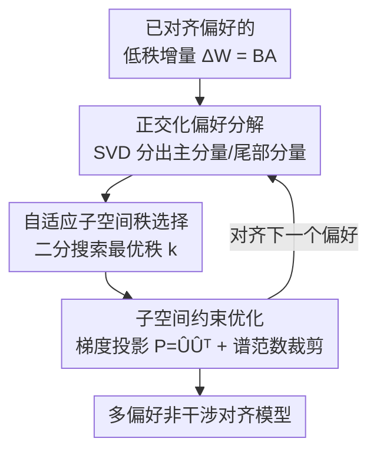

# OrthAlign: Orthogonal Subspace Decomposition for Non-Interfering Multi-Objective Alignment

**会议**: ICLR 2026  
**OpenReview**: [https://openreview.net/forum?id=rO2uXIP019](https://openreview.net/forum?id=rO2uXIP019)  
**代码**: https://github.com/233liang/OrthAlign  
**领域**: 对齐RLHF  
**关键词**: 多偏好对齐, 正交子空间, SVD, 谱范数约束, 参数级冲突

## 一句话总结
针对"提升一个偏好就损害另一个偏好"的多目标对齐困境，OrthAlign 把不同偏好的参数更新约束到彼此正交的子空间里，让各偏好的优化方向在数学上互不干扰，从而在不牺牲单项性能的前提下同时对齐 helpful / harmless / truthful，单项最高提升 50.89%、整体奖励平均提升 13.96%。

## 研究背景与动机

**领域现状**：大模型对齐通常要同时满足"3H"——有用（Helpful）、无害（Harmless）、诚实（Truthful）。主流做法是 SFT / RLHF / DPO，但这些方法本质上是针对单一目标优化。多偏好对齐（Multi-Preference Alignment, MPA）则试图同时协调多个相互冲突的目标，现有路线大致三类：基于约束的训练（给损失加约束项，如 MODPO、SPO）、数据合成/混合（按规则或冲突分数筛训练数据，如 RSDPO）、模型合并（把多个专精模型按权重融合，如 Reward-Soup、Knots、TSV）。

**现有痛点**：约束类方法在"同时优化"时仍把多个偏好的梯度塞进同一份参数里，内部参数冲突无法消除，矩阵更新不稳定；数据混合类高度依赖人工标注与专家打分，还会引入难以消除的系统性偏差；模型合并类则是一种"妥协"——为了实现多偏好，单项性能不可避免地下滑，陷入"专精 vs 泛化"的两难。

**核心矛盾**：作者指出冲突的根源在**参数层面**而非模型行为层面。不同偏好对应的梯度并不正交，而是相互干扰，量化表现为两者梯度内积非零：$\frac{|\langle \nabla_\theta L(D_i), \nabla_\theta L(D_j)\rangle|}{\|\nabla_\theta L(D_i)\|_2 \cdot \|\nabla_\theta L(D_j)\|_2} \neq 0$。只要这个内积不为零，优化一个偏好就会在另一个偏好的关键方向上产生扰动，这才是 trade-off 的本质来源。已有 MPA 方法都在"全局参数空间的轨迹引导"层面打转，没有直接处理这种参数对抗。

**本文目标**：直接在参数层面消除冲突——让"对齐新偏好"的参数更新落在与"旧偏好关键方向"正交的子空间，使内积严格为零；同时保证多步累积更新的稳定性。

**切入角度**：奇异值分解（SVD）能把一个权重增量矩阵分解成主奇异分量与尾部分量，尾部奇异值对应的特征空间近似正交于当前偏好信息。如果把新偏好的更新投影到这个正交补空间，就能在不动旧偏好关键方向的前提下学习新偏好。

**核心 idea**：用"正交子空间分解 + 谱范数裁剪"代替"约束损失/模型合并"来解决多偏好冲突——把每个偏好的更新关进互不干扰的正交子空间，并配套一套理论证明保证累积更新呈线性 Lipschitz 增长而非指数爆炸。

## 方法详解

### 整体框架
OrthAlign 解决的是**序列式偏好对齐**：模型从 SFT 基座出发，先对齐第一个偏好（如安全），再依次对齐第二、第三个偏好，关键要求是后续对齐不能破坏前面已经对齐好的偏好。整体是一条清晰的三步流水线：先对已对齐偏好的低秩增量做 SVD 分解，分出"关键方向"与"近似无影响方向"；再用一个自适应规则在无影响方向里进一步筛出一个最优秩 $k$ 的子空间；最后把新偏好的梯度更新投影到这个子空间里，配合谱范数裁剪保证稳定。第 3.2 节给出理论保证：满足正交子空间约束 + 谱范数约束时，逐层 Lipschitz 上界呈线性增长，从而累积更新稳定。

### 关键设计

**1. 正交化偏好解码：把旧偏好的关键方向与可动方向分开**

要做到"动新偏好不伤旧偏好"，首先得知道旧偏好到底占据了参数空间的哪些方向。作者对第一次对齐得到的低秩适配矩阵 $\Delta W = BA$（$B \in \mathbb{R}^{m\times r}$，$A \in \mathbb{R}^{r\times n}$）做奇异值分解，把它对安全输入 $X_{safe}$ 的变换拆成两部分：

$$\Delta W X_{safe} = \underbrace{\sum_{i=1}^{r}\sigma_i(v_i^T X_{safe})\cdot u_i}_{\text{偏好关键方向}} + \underbrace{\sum_{j=r+1}^{\max(m,n)}\sigma_j(v_j^T X_{safe})\cdot u_j}_{\text{对当前偏好近乎无影响}}$$

前 $r$ 个奇异分量捕获了安全对齐最重要的方向，后面的尾部分量对已对齐行为影响极小。这就为后续"在尾部方向上学新偏好"提供了几何依据——新偏好只要在第二部分张成的空间里更新，就基本不会触碰旧偏好的关键方向。

**2. 自适应子空间秩选择：尾部方向也可能"被激活"，要动态筛出真正安全的子空间**

一个关键且容易被忽视的陷阱是：尾部方向在当前看似可忽略，但一旦它们对应的奇异值被新偏好更新，就可能从近乎为零变成非平凡，重新干扰旧偏好。作者形式化了这一点：$\sum_{j=r+1}\sigma_j(v_j^\top X_{safe})u_j \approx 0$，但更新后 $\sum_{j=r+1}\hat\sigma_j(\hat v_j^\top X_{safe})u_j \neq 0$。因此不能简单地用整个 $\max(m,n)-r$ 维零空间，而要进一步筛出一个影响被严格压住的子空间。

作者设计了一个动态秩选择规则（Algorithm 1，二分搜索）：把最后 $k$ 个奇异值重标定为前 $r$ 个奇异值的均值 $\hat\sigma_i = \frac{1}{r}\sum_{j=1}^{r}\sigma_j$ 来**模拟潜在更新**，重构出 $\Delta W^{new}=U\hat\Sigma(k)V^\top$，然后选出在容差 $\gamma$ 内、奖励偏移最小的最大可行 $k$：

$$k = \max_k \left\{ \left| R(U\hat\Sigma(k)V^\top; X_{safe}) - R(W; X_{safe}) \right| \le \gamma,\ \hat\sigma_i = \tfrac{1}{r}\sum_{j=1}^{r}\sigma_j \right\}$$

其中 $R(W; X_{safe})$ 是期望正奖励。$\gamma$ 越小，被允许的子空间越保守、对旧偏好越安全；这一步本质是"在保住旧偏好奖励的前提下，尽量留出大一点的空间给新偏好学习"。

**3. 子空间约束优化：把新偏好的梯度投影进选定子空间**

选定最优秩 $k$ 后，取对应的左奇异向量组成矩阵 $\hat U$，构造投影矩阵 $P = \hat U\hat U^T$，然后把新偏好的梯度更新投影进去：

$$\Delta W_{new} = P\cdot \nabla_W L_{new}(W)$$

这样每一步参数增量都被严格限制在与旧偏好正交的子空间内，对应回 Eq.1，新偏好梯度被正交投影后与旧偏好梯度内积为零，冲突在数学上被消除。整套流程对每个新偏好循环一遍，因此天然适配序列式对齐。

**4. 谱范数约束下的稳定性保证：让多步累积呈线性而非指数增长**

仅有正交还不够——序列对齐要做很多步，若不约束每步幅度，谱范数（即整体 Lipschitz 上界）可能沿同一主方向累积出现超线性甚至指数膨胀。作者在每步增量上加谱范数裁剪 $\|\Delta W\|_2 \le \tau$，并给出两条理论结论。其一（Theorem 2a，线性 Lipschitz 累积）：$\|W+\sum_{t=1}^{T}\Delta W_t\|_2 \le \|W\|_2 + \sum_{t=1}^{T}\|\Delta W_t\|_2 \le \|W\|_2 + T\tau$，逐步谱控制把层 Lipschitz 常数的增长压成至多线性。其二（Theorem 2b，正交分配消除破坏性干扰）：若各步更新落在两两正交子空间 $U_t \perp U_s$，则 $\|\sum_{t=1}^{T}\Delta\theta_t\|^2 = \sum_{t=1}^{T}\|\Delta\theta_t\|^2$，即各偏好增量是"可加保留"而非互相抵消/覆盖。配合 Theorem 1 的二阶界（沿正交补的安全变化由尾部曲率 $\lambda_{k+1}$ 控制，给出全局安全预算），共同保证序列对齐全程稳定、旧偏好不漂移。

### 损失函数 / 训练策略
基础对齐目标沿用多源 DPO：$L_{\pi_\theta} = -\sum_{i=1}^{k}\lambda_i \mathbb{E}_{(x,y_w,y_l)\sim D_i}\big[\log\sigma(\beta\log\frac{\pi_\theta(y_w|x)}{\pi_0(y_w|x)} - \beta\log\frac{\pi_\theta(y_l|x)}{\pi_0(y_l|x)})\big]$，其中 $\pi_0$ 为参考策略、$\beta$ 控制 KL 约束强度。OrthAlign 不改这个目标本身，而是在梯度回传时对参数增量做投影（Eq.10）+ 谱范数裁剪，因此可作为即插即用模块叠加到 DPO / MODPO / SPO 等已有方法上。序列上按 harmless → helpful → truthful 的顺序逐个对齐。

## 实验关键数据

实验在 LLaMA-3-SFT 与 Mistral-7B-SFT 两个基座、UltraFeedback / HelpSteer2 / SafeRLHF-10k / 等 4 个 benchmark 上对比 7+ baseline，评测指标为 Helpful win rate（Alpaca-Eval）、Harmless Rate（AdvBench）、TruthfulQA MC2。

### 主实验
三目标序列对齐（harmless → helpful → truthful）整体得分对比（节选 LLaMA-3，UltraFeedback / HelpSteer2 两套配置的 Average Score）：

| 方法 | UltraFeedback Avg↑ | HelpSteer2 Avg↑ |
|------|------|------|
| SFT | 50.04 | 50.04 |
| DPO Baseline | 63.55 | 63.78 |
| MODPO (ACL'24) | 64.55 | 67.49 |
| SPO (AAAI'25) | 64.57 | 65.46 |
| RSDPO (NAACL'24) | 72.12 | 69.92 |
| Knots (ICLR'25) | 69.27 | 70.13 |
| TSV-M (CVPR) | 66.30 | 67.51 |
| **OrthAlign** | **75.15** | **75.95** |

在 Mistral 基座上 OrthAlign 同样领先（UltraFeedback 72.93 / HelpSteer2 73.51）。论文报告：两目标对齐相比最强 baseline 平均提升 20.23%，三目标对齐平均提升 13.96%；单偏好在多偏好对齐后提升幅度 34.61%~50.89%。

### 消融实验

即插即用增强（Table 2，在 HelpSteer2 + SafeRLHF 上做两目标对齐，给 baseline 叠加子空间投影）：

| 配置 | Harmless Rate↑ | Helpful Win Rate↑ | 说明 |
|------|------|------|------|
| DPO | 71.24 | 60.24 | 原方法 |
| DPO-Orth | 93.84 (↑22.60) | 65.71 (↑5.47) | 叠加 OrthAlign |
| MODPO | 48.46 | 67.95 | 原方法 |
| MODPO-Orth | 79.32 (↑30.86) | 71.02 (↑2.32) | 叠加后无害性大涨 |
| SPO | 71.15 | 61.24 | 原方法 |
| SPO-Orth | 92.88 (↑21.73) | 67.28 (↑0.04) | 叠加后无害性大涨 |

叠加 OrthAlign 后各 baseline 平均性能提升 14.96%，证明其作为通用增强模块的价值（平均无害性 +25.06%、有用性 +4.86%）。

自适应秩选择（RQ4，LLaMA-3 上扫 rank 10~26）：无害率对 rank 高度敏感，从 rank 12 的 93.80% 一路降到 rank 26 的 81.34%，最优安全区间在 rank 16~18（>89%）；有用 win rate 从 rank 14 起相对稳定，仅在 63.59%~65.79% 间小幅波动。这说明自适应选秩对"保住安全又不牺牲有用性"很关键。

### 关键发现
- **谱范数 + 正交两个约束缺一不可**：正交保证不干扰，谱范数保证多步累积稳定（线性 Lipschitz），两者共同把序列对齐的偏好漂移压住。
- **隐表示分布几乎不漂移（RQ2）**：t-SNE 可视化显示 OrthAlign 第一次对齐与第三次对齐的隐状态点云几乎重合、边缘分布形状保持不变，而 baseline 出现明显的簇分裂，直观证明参数冲突被消除。
- **秩越大越偏向有用、越小越偏向安全**：rank 是一个可调的 trade-off 旋钮，自适应规则的作用就是在保住旧偏好奖励的前提下选出尽量大的可行秩。

## 亮点与洞察
- 把"多目标对齐冲突"从**优化算法/数据层面**重新定位到**参数几何层面**，并用梯度内积是否为零给出量化判据——这是把一个模糊的"trade-off"问题变成可数学求解问题的关键一步。
- "尾部奇异方向看似无害、被更新后会复活"这一观察很精彩，直接催生了自适应秩选择：不是简单用整个零空间，而是用奖励偏移容差 $\gamma$ 动态筛出真正安全的子空间。
- 配套的两条 Lipschitz 定理把"为什么序列对齐不会崩"讲清楚了：正交保证可加保留、谱裁剪保证线性增长，理论与方法咬合得很紧。
- 作为即插即用模块叠加到 DPO/MODPO/SPO 都能涨点（尤其无害性），这种"正交投影 + 谱裁剪"的思路可迁移到持续学习、多任务微调等任何"学新不忘旧"的场景。

## 局限与展望
- 方法依赖对低秩增量做 SVD 并构造投影矩阵，序列每步都要分解+选秩，计算与工程开销在大规模参数/多偏好时值得关注（论文未给出明显的开销分析）。
- 评测主要在 3H 三个偏好、两个 7B 量级基座上；偏好数量进一步增多（4+ 个）时正交补空间是否足够容纳所有新偏好、是否会"用尽"可动方向，文中未充分探讨。
- 自适应秩依赖容差 $\gamma$ 与奖励函数 $R$ 的可靠性，奖励噪声可能影响选秩质量；正交假设建立在"尾部方向近似正交于关键方向"的局部近似上，远离该近似时保证可能减弱（理论多为局部二阶分析）。
- 序列对齐对偏好顺序是否敏感（先安全 vs 先有用结果是否一致）值得进一步验证。

## 相关工作与启发
- **vs 约束类 (MODPO / SPO)**: 它们在损失里加约束项试图缓解冲突，但仍在同一参数空间里同时优化多目标，内部参数对抗未消除；OrthAlign 直接在参数几何层面用正交投影让梯度内积为零，从根上断开干扰。
- **vs 模型合并类 (Reward-Soup / Knots / TSV-M)**: 它们靠融合多个专精模型实现多偏好，本质是妥协，单项性能必然下滑；OrthAlign 在单一模型内逐步对齐，保住单项性能（主实验单项与整体均领先）。
- **vs 数据合成类 (RSDPO)**: 它们靠多维打分筛数据，依赖大量人工与专家知识、引入系统偏差；OrthAlign 不改数据，只改更新方向，省去数据策划负担。

## 评分
- 新颖性: ⭐⭐⭐⭐⭐ 把多目标对齐冲突定位到参数正交性并给出 SVD 子空间投影解法，视角新颖、理论扎实。
- 实验充分度: ⭐⭐⭐⭐ 两基座、4 benchmark、7+ baseline，含分布可视化与即插即用验证，但开销分析与更多偏好维度略欠。
- 写作质量: ⭐⭐⭐⭐ 动机—方法—理论咬合紧密，公式清晰；部分理论细节放附录。
- 价值: ⭐⭐⭐⭐⭐ 即插即用、单项不掉点的多偏好对齐方案，对持续/多任务对齐有较强迁移价值。

<!-- RELATED:START -->

## 相关论文

- [\[ICML 2026\] Simultaneous Multi-objective Alignment Across Verifiable and Non-verifiable Rewards](../../ICML2026/llm_alignment/simultaneous_multi-objective_alignment_across_verifiable_and_non-verifiable_rewa.md)
- [\[ICLR 2026\] Multi-objective Large Language Model Alignment with Hierarchical Experts](multi-objective_large_language_model_alignment_with_hierarchical_experts.md)
- [\[ICLR 2026\] IDEAL: Data Equilibrium Adaptation for Multi-Capability Language Model Alignment](ideal_data_equilibrium_adaptation_for_multi-capability_language_model_alignment.md)
- [\[ACL 2025\] LSSF: Safety Alignment via Low-Rank Safety Subspace Fusion](../../ACL2025/llm_alignment/lssf_safety_subspace.md)
- [\[ICLR 2026\] SEMA: Simple yet Effective Learning for Multi-Turn Jailbreak Attacks](sema_simple_yet_effective_learning_for_multi-turn_jailbreak_attacks.md)

<!-- RELATED:END -->
