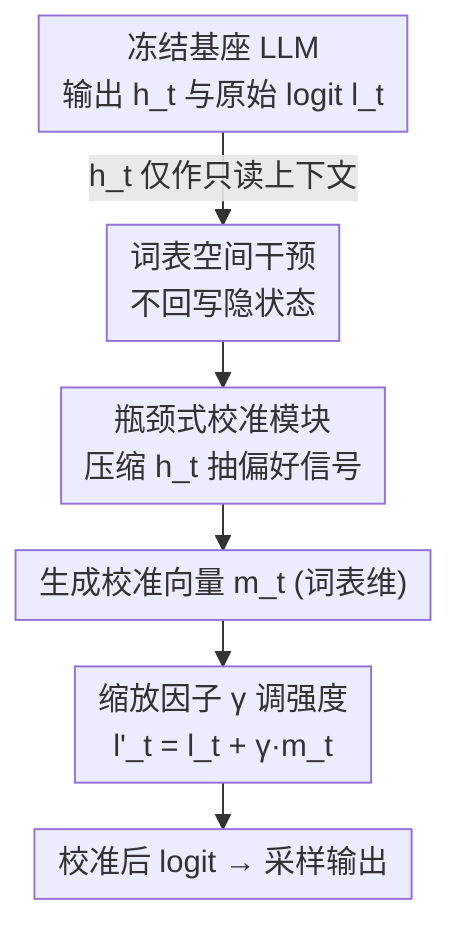

# PALC: Preference Alignment via Logit Calibration

**会议**: ICLR 2026  
**OpenReview**: [https://openreview.net/forum?id=0cmuYj3WeG](https://openreview.net/forum?id=0cmuYj3WeG)  
**代码**: https://github.com/s4n9hyun/PALC  
**领域**: 对齐RLHF / LLM效率 / 测试时对齐  
**关键词**: 测试时对齐, logit 校准, 表征工程, 瓶颈结构, 偏好优化

## 一句话总结
PALC 给冻结的大模型外挂一个极小的"校准模块"，把对齐干预从纠缠的隐空间挪到天然解耦的词表 logit 空间——只把隐状态当只读上下文、生成位置相关的 logit 偏移量加到原始 logit 上，仅增加 0.002%–0.13% 参数、几乎不掉推理速度，就能在测试时实现可调强度的偏好对齐。

## 研究背景与动机

**领域现状**：让 LLM 对齐人类偏好的主流是训练时对齐（RLHF、DPO 及其参数高效变体）。这类方法效果好，但会把行为"烤死"在权重里，得到的是静态模型，想换对齐目标就得重训。为此学界转向测试时对齐——在推理时动态调整一个冻结模型的行为，无需改参数。

**现有痛点**：测试时对齐分裂成两条路，各有硬伤。第一条是**引导解码**（ARGS、GenARM、CARDS 等），用一个外部奖励模型给 LLM 的输出概率打分、引导 token 选择；但这要同时跑两个大模型，推理成本翻倍、延迟飙升（GenARM 延迟 3.17×、ARGS 4.40×）。第二条是**表征工程（RepE）**，直接改冻结 LLM 的内部激活；但隐表征处于**叠加态（superposition）**——模型用重叠、非正交的方向编码比神经元更多的特征，于是为了控制一个概念去改激活，会连带搞坏不相关的概念，导致连贯性崩塌。

**核心矛盾**：现有方法被逼着在**计算效率**和**自适应控制**之间二选一。引导解码效率差；RepE 内部又有一个"控制困境"——静态方法（CAA、BiPO）用固定 steering 向量，省但不会随上下文变；动态方法（RE-Control）能做位置相关控制，却要在每步生成时做梯度优化，把测试时该省的算力又赔进去了。根子在于：**在叠加态的隐空间里做干预，本身就既危险又低效。**

**本文目标**：能不能在不牺牲计算效率的前提下，实现动态、位置相关、强度可调的对齐？

**切入角度**：作者注意到隐空间之所以麻烦，是因为它纠缠；而模型最后一层的 **logit / 词表空间**天然是解耦的——每一维唯一对应一个 token，改某个 logit 对其他 token 概率的影响是可预测的 $\partial p_i/\partial l_j = p_i(\delta_{ij}-p_j)$。如果只在这层做干预、把隐状态退化成"只读上下文"，就能绕开叠加态问题。

**核心 idea**：用一个轻量瓶颈模块读取隐状态、在**词表 logit 空间**学习并生成位置相关的校准向量，直接加到原始 logit 上完成偏好对齐——既不碰内部表征，也不挂外部奖励模型。

## 方法详解

### 整体框架
PALC 在一个**冻结**的基座 LLM（$\pi_\text{base}$）旁边挂一个轻量**校准模块** $\theta$。在每个解码步 $t$，基座模型照常吐出最后一层隐状态 $h_t \in \mathbb{R}^H$ 和原始 logit $l_t \in \mathbb{R}^V$。校准模块**只读** $h_t$ 作为上下文，经过一个瓶颈结构压缩出位置相关的校准向量 $m_t \in \mathbb{R}^V$，再以一个固定缩放因子 $\gamma$ 加回到原始 logit 上，得到校准后的 logit $l'_t = l_t + \gamma \cdot m_t$，最后照常 softmax 采样。整条链路最关键的一点是：$m_t$ 在计算上依赖 $h_t$，但**不回写、不修改** $h_t$——干预的"信息源"（纠缠的隐状态）和干预的"落点"（解耦的 logit）被彻底解耦。

### 关键设计

**1. 词表空间干预：把对齐落点从纠缠隐空间挪到解耦 logit**

这一条直接针对 RepE 的叠加态痛点。隐状态里多个语义概念共享重叠方向，改一个方向会级联污染别的能力；而词表 logit 空间每一维唯一对应一个 token，是"天然解耦的接口"。PALC 的做法是把隐状态 $h_t$ 严格当作**只读上下文**，干预只发生在最终 logit 上。这样做的好处是可解释且可控：对某个 logit $l_i$ 加一个小量 $\Delta l_i$，该 token 概率近似变化 $p_i(1-p_i)\Delta l_i$，其余 token 按各自概率成比例重分配（雅可比 $\partial p_i/\partial l_j = p_i(\delta_{ij}-p_j)$），不会出现隐空间那种不可预测的级联崩坏。这也是和 CAA/RE-Control 这类"直接改激活"方法的本质区别——后者要么用静态向量缺乏适应性，要么靠在线梯度优化付出效率代价，而 PALC 在解耦空间里既能动态又安全。

**2. 瓶颈式校准模块：用低秩子空间逼出"本质偏好信号"**

校准向量的生成走一个瓶颈结构（bottleneck $B \ll H$），公式上是先降维再升维：$z_t = \mathrm{ReLU}(W_\text{down} h_t)$，$m_t = W_\text{up} z_t$，其中 $W_\text{down}\in\mathbb{R}^{B\times H}$ 把隐状态压到瓶颈维 $B$，$W_\text{up}\in\mathbb{R}^{V\times B}$ 再投到词表维。这个"先压窄再放开"的约束逼着模块只能抽取最本质的偏好信号，从而把参数量压到极致——7B 模型（$H{=}4096,V{=}32000$）取 $B{=}256$ 时只要约 9.2M 参数、占基座 0.13%，每 token 复杂度 $O(B(H+V))$，不到末层投影的 7%。作者还从理论上论证瓶颈诱导了强低秩结构：校准空间 $\mathcal{C}=\{W_\text{up}W_\text{down}h\}$ 维度至多为 $B$，而偏好优化会让有效维度 $d_\text{eff}=(\sum_i\sigma_i)^2/\sum_i\sigma_i^2 \ll B$（$\sigma_i$ 为 $W_\text{up}W_\text{down}$ 的奇异值）——即人类偏好真的集中在出乎意料低维的流形上，这也是为什么极小的模块就够用。

**3. 固定缩放因子 γ：一个标量在推理时调对齐强度**

PALC 不去学 token 级的复杂自适应权重，而是用一个固定标量 $\gamma$ 来缩放整条校准向量：$l'_t = l_t + \gamma\cdot m_t$。它的价值在于**部署灵活性**——同一个训练好的校准模块，推理时只改 $\gamma$ 就能在"保留基座能力"和"强化偏好"之间滑动：$\gamma<1$ 干预更轻、更像原模型，$\gamma>1$ 对齐更强。无需任何重训。实验显示在 $\gamma\in[0.5,3.0]$ 区间性能稳定（55.3%–58.2% 胜率），$\gamma{=}1.0$ 最优（训练已把校准幅度优化到位），而 $\gamma{=}10.0$ 会因为偏离基座分布的 KL 过大而崩到 38.7%。这种"简单到只调一个数"的控制，正是它相对动态 RepE 方法的体面之处。

### 损失函数 / 训练策略
PALC 用一个**简化的偏好损失**端到端训练校准模块，直接拉大"被偏好回答"和"被拒绝回答"的对数似然差：

$$\mathcal{L} = -\mathbb{E}_{(x,y_w,y_l)\sim D}\left[\log\sigma\left(\log\pi_\text{PALC}(y_w|x) - \log\pi_\text{PALC}(y_l|x)\right)\right]$$

对数概率只在 prompt 之后的**回答部分**计算，避免模块去记忆 prompt。它和标准 DPO 有三处关键不同：其一，**去掉了与参考模型的 KL 项**——因为冻结基座本身就约束了优化空间（校准模块只能加 logit 偏移，无法造成剧烈分布漂移）；其二，训练时**不需要再维护和前向一个参考模型**，显存约省一半、吞吐翻倍；其三，梯度流自然鼓励**稀疏校准**——只在确有必要处调 logit，多余干预只会增加复杂度而不改善偏好 margin，反而损害泛化，于是模型学会"最小干预"。配置上：在 HH-RLHF 训练集训 1 epoch，batch size 4、梯度累积 4、学习率 $1\times10^{-5}$、$B{=}256$，推理 $\gamma{=}1.0$。

## 实验关键数据

### 主实验
基座为 `argsearch/llama-7b-sft-float32`，全部在 `Dahoas/full-hh-rlhf`（helpful & harmless 对话偏好对）上训练评测，90/10 切分。评测用 GPT-5 在 helpfulness/harmlessness/relevance/accuracy/insightfulness 五个维度做成对比较，报告 Win+½Tie。下表是 PALC 对各基线的成对胜率：

| PALC vs. | Win (%) ↑ | Tie (%) | Lose (%) ↓ | Win+½Tie (%) ↑ |
|----------|-----------|---------|------------|-----------------|
| Base Model | 54.67 | 7.00 | 38.33 | **58.17** |
| DPO | 39.33 | 3.67 | 57.00 | 41.17 |
| CAA（静态 steering） | 76.00 | 2.33 | 21.67 | **77.17** |
| RE-Control（在线优化） | 57.67 | 8.00 | 34.33 | 61.67 |
| ARGS（外部奖励模型） | 55.33 | 0.33 | 44.33 | 55.50 |
| BiPO | 45.33 | 7.33 | 47.33 | 49.00 |
| GenARM（7B 奖励模型） | 43.67 | 1.33 | 55.00 | 44.33 |

PALC 大幅赢过静态 RepE 的 CAA（77.17%）、在线优化的 RE-Control（61.67%），与激活空间的 BiPO 近乎打平（49.00%，说明 logit 空间和激活空间捕获的偏好信号相近）；对需要全套训练设施的 DPO（41.17%）和双 7B 架构的 GenARM（44.33%）则略逊——作者把这定位为**有意的效率换性能**，而非全面替代。

效率对比（H100、生成 128 token、10 次平均）：

| 方法 | 额外组件 | 时间 (s) ↓ | 相对延迟 ↓ |
|------|----------|-----------|-----------|
| Base Model | — | 1.79 | 1.00× |
| **PALC** | 校准模块 (9.2M) | 1.93 | **1.08×** |
| BiPO | steering 向量 | 2.19 | 1.22× |
| RE-Control | 价值模型 (33.6M) | 2.32 | 1.30× |
| CAA | steering 向量 | 2.51 | 1.40× |
| GenARM | 自回归奖励模型 (7B) | 5.67 | 3.17× |
| ARGS | 轨迹奖励模型 (7B) | 7.88 | 4.40× |

PALC 仅 9.2M 参数（比 ARGS/GenARM 的 7B 奖励模型少 833×）、只慢 8%，在效率轴上碾压所有依赖外部奖励模型或在线优化的方法。

### 消融实验

| 配置 | Win+½Tie (%) | GPT-5 质量分 | 说明 |
|------|--------------|--------------|------|
| $B{=}16$ | 53.7 | 3.84 | 极端压缩仍可用（仅 0.59M 参数） |
| $B{=}64$ | 54.7 | 3.96 | 进入性能平台 |
| **$B{=}256$** | **58.2** | **3.96** | 最优瓶颈维 |
| $B{=}1024$ | 56.5 | 3.91 | 仍稳定，边际收益递减 |
| $B{=}4096$ | 18.3 | 2.15 | 过度参数化 → 灾难性崩塌 |
| $\gamma{=}0.5$ | 55.3 | 3.96 | 轻干预 |
| **$\gamma{=}1.0$** | **58.2** | 3.96 | 最优，等于直接用学到的校准 |
| $\gamma{=}3.0$ | 56.0 | 3.95 | 仍稳定 |
| $\gamma{=}10.0$ | 38.7 | 3.07 | KL 偏离过大 → 低于基线 |

### 关键发现
- **偏好集中在极低维流形**：性能在 $B{=}256$ 达峰，$B{=}16$（仅 0.59M 参数）也有 53.7%，实证了理论里 $d_\text{eff}\ll B$ 的低秩假设——这是 PALC 能做到极致参数高效的根因。
- **过度压缩反而灾难**：$B{=}4096$ 时胜率暴跌到 18.3%（低于随机）、质量掉到 2.15/10。作者归因为缺乏正则下的瓶颈过大会在训练数据的伪模式上过拟合，学到反而有害的校准——印证了"架构约束本身就是一种必要的正则"。
- **$\gamma$ 不挑值**：$[0.5,3.0]$ 区间都稳，给实践者留了无需重训的调节空间，但 $\gamma{=}10.0$ 会因 KL 失控而崩，与理论预测一致。

## 亮点与洞察
- **换干预空间，而非换更强的模型**：把对齐落点从"纠缠的隐空间 / 概率空间"换到"解耦的 logit 空间"，一招同时绕开叠加态污染和外部奖励模型的双模型开销——这是全文最"啊哈"的地方，且是第一个系统性探索 learned logit-space 校准的工作。
- **瓶颈即正则**：低秩瓶颈不仅压参数，还顺带成了防过拟合的结构约束，$B{=}4096$ 崩塌的反例把这点讲得很硬。
- **可迁移性**："只读上下文 + 在解耦输出空间做加性干预"这个范式可推广到任何想在测试时控制冻结模型、又怕改内部表征会塌的场景（如安全护栏、风格控制），落点换成对应的输出维度即可。

## 局限与展望
- 实验只在单一基座（llama-7b-sft）+ 单一数据集（HH-RLHF）+ 单一评测器（GPT-5）上验证，跨模型规模（70B）、跨任务、跨偏好维度的泛化性未充分检验。
- 对 DPO/GenARM 仍有明显性能差距，PALC 自我定位是"效率优先的可及替代"而非全面 SOTA；当算力充足、性能至上时不一定划算。
- $\gamma$ 的最优值会随任务/数据集变化，作者只给出 HH-RLHF 上 $\gamma{\approx}1.0$ 的默认；自动选 $\gamma$、以及把单一 $\gamma$ 扩展到多偏好维度的独立调强，是自然的延伸方向。
- 校准向量虽然源于隐状态，作者用雅可比论证其在 logit 空间"可控可解释"，但偏好因子是否真能对应到 helpfulness/harmlessness 等具体方向，仍主要靠附录分析支撑，存疑处宜以原文为准。

## 相关工作与启发
- **vs 引导解码（ARGS / GenARM）**：它们靠外部奖励模型打分引导 token，需双模型并行、延迟 3–4×；PALC 用基座自身表征生成校准、自洽运行，延迟仅 1.08×，但性能略逊于训了 7B 奖励模型的 GenARM。
- **vs 静态 RepE（CAA / BiPO）**：它们在隐空间加固定 steering 向量，受叠加态拖累且不随上下文变；PALC 在解耦 logit 空间做位置相关校准，对 CAA 胜率高达 77.17%，与 BiPO 打平说明两空间信息量相近但 logit 空间更安全。
- **vs 动态 RepE（RE-Control）**：它每步做梯度优化、延迟 1.30×且仍是隐空间干预；PALC 把"动态性"前置到训练好的模块里，推理只需一次前向，既动态又省，胜率 61.67%。
- **vs DPO**：DPO 是训练时方法、改基座权重得到静态模型，PALC 损失正是 DPO 去掉参考模型 KL 项的简化版，定位互补——PALC 牺牲部分性能换 99%+ 算力削减，面向资源受限部署。

## 评分
- 新颖性: ⭐⭐⭐⭐⭐ 首个系统性地把对齐干预落到 learned logit 空间，换了对齐的"作用点"而非堆模型。
- 实验充分度: ⭐⭐⭐⭐ 基线、效率、双消融都到位，但只在单基座单数据集单评测器上验证，泛化性待补。
- 写作质量: ⭐⭐⭐⭐⭐ 动机推导（叠加态→解耦空间）清晰，理论与消融互相印证。
- 价值: ⭐⭐⭐⭐ 为资源受限部署提供了极轻量的测试时对齐方案，可迁移性强，但非性能上限。

<!-- RELATED:START -->

## 相关论文

- [\[ICLR 2026\] Annotation-Efficient Honesty Alignment via Confidence Elicitation and Calibration](annotation-efficient_honesty_alignment_via_confidence_elicitation_and_calibratio.md)
- [\[ICLR 2026\] Keep the Best, Forget the Rest: Reliable Alignment with Order-Aware Preference Optimization](keep_the_best_forget_the_rest_reliable_alignment_with_order-aware_preference_opt.md)
- [\[ICLR 2026\] Robust Preference Alignment via Directional Neighborhood Consensus](robust_preference_alignment_via_directional_neighborhood_consensus.md)
- [\[ICLR 2026\] Towards Understanding Valuable Preference Data for Large Language Model Alignment](towards_understanding_valuable_preference_data_for_large_language_model_alignmen.md)
- [\[ICLR 2026\] Semi-Supervised Preference Optimization with Limited Feedback](semi-supervised_preference_optimization_with_limited_feedback.md)

<!-- RELATED:END -->
