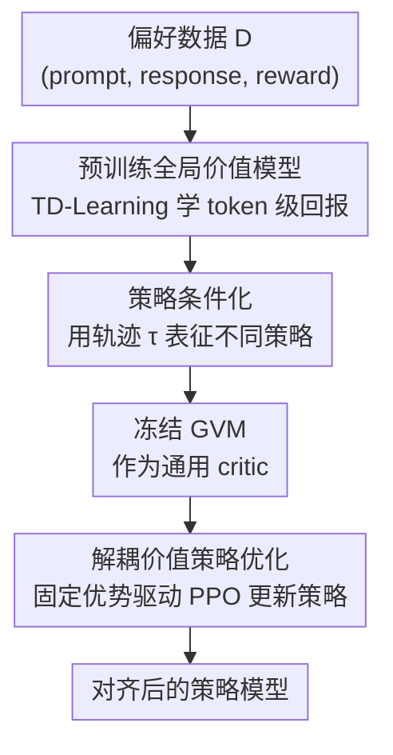

# Pretrain Value, Not Reward: Decoupled Value Policy Optimization

**会议**: ICLR 2026  
**OpenReview**: [https://openreview.net/forum?id=qirGds1BmK](https://openreview.net/forum?id=qirGds1BmK)  
**代码**: https://github.com/microsoft/DKI_LLM/tree/main/dvpo  
**领域**: 对齐RLHF / LLM效率  
**关键词**: RLHF, 价值模型, Critic 预训练, PPO, Token 级信用分配

## 一句话总结
作者指出在固定偏好数据下「先训奖励模型再在线学 critic」与「直接预训练一个价值模型」在信息上等价，于是提出 DVPO：离线预训练一个全局价值模型（GVM）并冻结它作为通用 critic 来指导策略优化，省掉了在线 critic 训练，在 MT-Bench / Alpaca-Eval / Arena-Hard 上达到或超过主流 RLHF 方法，同时省 30–40% 显存、30–45% 训练时间。

## 研究背景与动机
**领域现状**：RLHF 是把大模型对齐到人类偏好的核心手段。由于语言模型缺乏能给出真值奖励的交互环境，社区的标准做法是先从偏好数据训一个奖励模型（RM），再用它去监督一个在线训练的 critic（PPO 路线），或者通过轨迹采样间接估计价值（DPO、ReMax、GRPO 路线）。

**现有痛点**：这两条路都既贵又不稳。PPO 这类 actor–critic 方法在联合训练时 critic 会「漂移」（critic drift）——价值函数追着不断变化的策略跑，目标一直在动；而且训练时要同时加载策略、价值、奖励、参考四个模型，显存和算力开销巨大。采样类方法（ReMax / GRPO）则干脆丢掉了 token 级的信用分配，对整句话只给一个标量奖励、把所有 token 一视同仁，导致方差高、训练不稳。

**核心矛盾**：作者抓住一个被忽视的事实——**偏好数据一旦采集完，训练过程中就再没有新的真值奖励信号了**。既然如此，从一个固定的奖励模型在线去学价值函数，本质上没有引入任何新信息：先训 RM 再从 RM 导出价值，与直接在同一批数据上预训练一个价值模型，在信息上是等价的。在线 critic 训练因此是冗余的。

**切入角度**：作者进一步观察到，在开放式任务里奖励大体上是「策略无关」（policy-invariant）的——无论策略 A 还是策略 B 产出的答案，回报主要由正确性 / 偏好决定，而非某个策略特有的随机性。这就允许把价值估计「摊销」（amortize）成一个**全局价值模型 GVM**：在多样轨迹上一次性预训练，然后作为冻结的 critic 跨策略复用。

**核心 idea**：用「离线预训练一个冻结的全局价值模型」代替「在线联合训练 critic」，把 RLHF 重构成由单个预训练价值模型引导的「纯策略优化」。

## 方法详解

### 整体框架
DVPO 把 RLHF 拆成两个互相解耦的阶段。**阶段一**用离线轨迹数据训练一个策略条件的动作价值函数 $Q_\phi(\tau, s, a)$（即 GVM），它预测「在状态 $s$ 下采取动作 $a$、并按轨迹 $\tau$ 所代表的策略续写到底」的 return-to-go；这步用的数据和训练奖励模型的数据完全一样，不需要任何额外标注。**阶段二**把 $Q_\phi$ 冻结，作为一个固定的 critic，用标准 PPO 目标只更新策略，优势函数直接取自冻结的 GVM。这样一来，actor 和 critic 的学习动态被彻底解耦，「移动靶」问题消失。

任务被建模成 MDP：状态 $s_t=[x, y_{<t}]$ 是提示加已生成前缀，动作 $a_t=y_t$ 是下一个 token。句子级奖励 $r(x,y)$ 由人类反馈给出，再通过一种简化的 TD 处理把它转成 token 级——中间步奖励全设为 0，只在最后一步用句子级奖励，于是从第 $t$ 步起的累积回报简化为 $G_t = \gamma^{T-t} r(x,y)$。

### 关键设计

**1. 价值/奖励等价性：从根上论证在线 critic 是冗余的**

这是全文的理论基石。在固定反馈的 RLHF 里，常规流程先训奖励模型 $R_\phi$，再从它导出价值——要么在线学一个 critic（PPO），要么采样很多输出再归一化 $R_\phi$ 分数。作者指出这两条路除了原始偏好数据 $D$ 之外不消耗任何新监督，价值信号完全由已训好的 $R_\phi$ 派生。因此「训奖励 + 从奖励估价值」与「直接在同一个 $D$ 上预训练价值模型 $Q_\psi$」在信息上等价。论文用 Lemma 3.1 形式化：设 $|R_\phi(s,a)-r(s,a)|\le\epsilon_R$，奖励诱导价值 $\tilde{Q}^R_\phi$ 与预训练 GVM $Q_\psi$ 对真值 $Q^\pi$ 的逼近误差都 $\le\epsilon_Q$，则两者诱导的策略梯度之差有界：$\|\nabla_\theta J_{\tilde{Q}^R_\phi}(\pi_\theta)-\nabla_\theta J_{Q_\psi}(\pi_\theta)\|\le\kappa(\epsilon_R,\epsilon_Q)$，且当 $\epsilon_R,\epsilon_Q\to0$ 时 $\kappa\to0$。注意作者强调的不是「奖励和价值相同」，而是「从一个固定的预训练奖励再导出价值，相比直接预训练价值，不增加任何新信息」。一个收敛推论进一步说明：只要策略更新被 KL-clip 正则、GVM 误差有界，DVPO 就继承了 PPO 的单调改进保证。

**2. 全局价值模型 GVM：用 TD-Learning 学策略条件的 token 级价值**

针对「采样类方法只给句子级标量、丢掉 token 级信用分配」的痛点，GVM 直接学一个 token 级的动作价值。它的训练目标是标准 TD 损失：

$$\mathcal{L}_{\text{GVM}}(\phi) = \mathbb{E}_{(\tau, s_t, a_t, r_t, s_{t+1}, a_{t+1})\in D}\left[\big(r_t + \gamma Q_\phi(\tau, s_{t+1}, a_{t+1}) - Q_\phi(\tau, s_t, a_t)\big)^2\right]$$

TD 目标 $G_t = r(s_t,a_t)+\gamma Q_\phi(\tau, s_{t+1}, a_{t+1})$ 用 bootstrap 的方式让价值估计同时反映即时与未来回报。这种基于前缀的 TD 学习让 GVM 能给一段回复的不同部分赋不同的值——决定性的推理 token 拿到高值，误导性的续写拿到低值，从而提供比「整句一个分」细得多的监督。和奖励模型相比，GVM 训练所需的显存几乎一样（同一个 base 加一个 hidden→1 的线性头），每步也只做一次反向传播。

**3. 轨迹条件化：让单个价值模型「全局」到跨策略复用**

传统 actor–critic 要求 critic 在线适配 actor 不断演化的行为，这正是 critic drift 的来源。作者希望要一个能跨不同策略泛化、不用反复重学的全局 $Q_\phi$。做法是不去显式条件化策略参数，而是从目标策略里随机采一些轨迹 $\tau$（在 LLM 任务里就是一串问答对）作为条件，这些轨迹隐式地揭示了策略的特征（风格倾向、正确性、领域专长），从而隐式决定了在逼近哪个策略 $\pi(\cdot|s)$。形式上 $Q_\phi(\tau,s,a)\approx\mathbb{E}\big[\sum_{t=0}^\infty\gamma^t r(s_t,a_t)\mid s_0=s,a_0=a,\tau\big]$。论文在分析中验证：GVM 之所以「全局」，一是它策略无关（policy-agnostic）而非绑死某个行为策略，二是它从轨迹层面评估每个动作如何贡献最终结果。这让 GVM 即使在分布漂移（如换到 HH-RLHF 新提示）下仍比 PPO 的 A/C critic 更准。

**4. 解耦价值策略优化：冻结 critic，消除「移动靶」**

GVM 收敛后参数冻结，用它来指导策略更新。策略侧用裁剪 PPO 目标 $\mathcal{L}_{\text{PPO}}(\theta)=\mathbb{E}\big[\min(r_t(\theta)\hat{A}_t,\ \text{clip}(r_t(\theta),1-\epsilon,1+\epsilon)\hat{A}_t)\big]$，其中重要性比 $r_t(\theta)=\pi_\theta(a_t|s_t)/\pi_{\theta_{\text{old}}}(a_t|s_t)$。关键区别在优势函数：它直接用 GVM 训练阶段算好的固定价值估计 $\hat{A}_t=\tilde{Q}_\phi(\tau,s_t,a_t)$，是一个**静态优势**。由于反馈固定、没有新的环境奖励，这个静态 $Q_\phi$ 已包含全部所需监督信息，可以高效复用离线数据；同时因为 critic 不再随策略更新而变，actor–critic 的「移动靶」彻底消失，训练曲线更平滑稳定。值得强调的是，DVPO 并不比标准 PPO 引入更强假设——只是把在线 critic 换成预训练冻结的 GVM。

## 实验关键数据

### 主实验

Base 设置（从 SFT 初始化，UltraFeedback 训 GVM，10K 留存提示做 RL），MT-Bench 满分 10：

| 模型 | 方法 | MT-Bench | Arena-Hard | AlpacaEval2 |
|------|------|----------|-----------|-------------|
| Llama3.2-3B | SFT | 5.22 | 10.4 | 8.19 |
| Llama3.2-3B | PPO | 5.33 | 13.5 | 11.54 |
| Llama3.2-3B | GRPO | 5.46 | 13.4 | 10.86 |
| Llama3.2-3B | **DVPO** | **5.73** | **15.1** | **12.33** |
| Llama3-8B | PPO | 4.98 | 11.7 | 11.14 |
| Llama3-8B | **DVPO** | **5.01** | **11.8** | **11.33** |

Instruction 设置（从已对齐模型出发，更贴近真实 RLHF）DVPO 提升更显著：

| 模型 | 方法 | MT-Bench | Arena-Hard | AlpacaEval2 |
|------|------|----------|-----------|-------------|
| Mistral-7B | Instruction | 6.60 | 12.6 | 17.11 |
| Mistral-7B | DPO | 6.30 | 16.3 | 26.80 |
| Mistral-7B | GRPO | 6.31 | 21.8 | 27.19 |
| Mistral-7B | **DVPO** | **6.79** | **24.7** | **27.43** |
| Llama3-8B | PPO | 7.55 | 36.3 | 34.98 |
| Llama3-8B | **DVPO** | **7.72** | **39.2** | **42.59** |

相对 Mistral-7B-Instruct，DVPO 在 Arena-Hard 上 +12.1%、Alpaca-Eval 长度控制胜率 +10.32%；相对 DPO 在 Mistral 上 Arena-Hard 高 8.4 点。

### 消融 / 分析实验

GVM vs ScalarRM（同数据，RewardBench 子集）与 GVM vs PPO 的在线 critic（A/C value model）：

| 对比 | 配置 | Llama3-8B | Mistral-7B | 说明 |
|------|------|-----------|-----------|------|
| RewardBench Chat-Hard | GVM | 67.5 | 61.4 | GVM 在难样本更强 |
| RewardBench Chat-Hard | ScalarRM | 58.5 | 52.4 | 句子级 BT loss 在难例弱 |
| UltraFeedback 测试集 | GVM | 68.1 | 64.5 | 价值估计更准 |
| UltraFeedback 测试集 | A/C critic | 60.6 | 57.6 | 与策略耦合、分布漂移 |
| HH-RLHF（分布漂移） | GVM | 63.3 | 60.8 | 漂移下仍领先 |
| HH-RLHF（分布漂移） | A/C critic | 57.5 | 53.8 | 泛化更差 |

计算开销（Table 6）：PPO 训练显存 $2\times m_{\text{train}}$（要同时训策略和价值），DVPO / ReMax / GRPO 均为 $1\times m_{\text{train}}$；但 GRPO 每个提示要生成多份回复（$n\times c_{\text{gene}}$），DVPO 只需 $1\times c_{\text{gene}}$。整体 DVPO 在显存与时间上取得最佳平衡，省 30–40% 显存、30–45% 训练时间。

### 关键发现
- GVM 与 ScalarRM 在 RewardBench 上**整体均分相当**，但分布不同：ScalarRM 在 Chat（易）更强（句子级 BT loss 擅长抓全局偏好），GVM 在 Chat-Hard（难）更强（token 级 TD 学习对复杂问题泛化更好）——说明细粒度价值在难任务上更有价值。
- GVM 显著优于 PPO 的在线 critic，且优势能跨 backbone 迁移；根因是 A/C critic 绑死当前策略、数据分布随训练漂移，而 GVM 策略无关、从大规模偏好学「哪些状态转移会增/减回报」。
- 细粒度 token 级反馈是性能优势的来源：ReMax/GRPO 给整句一个分、所有 token 同权，DVPO 给每个 token 不同回报值（决定性推理 token 高值、误导续写低值），同时保留 PPO 的 on-policy 探索空间，性能上限更高。

## 亮点与洞察
- **「先固定反馈、再学价值就是冗余」是一个很干净的观察**：很多 RLHF 框架默认要先 RM 再 critic，作者用一句「没有新奖励信号进来时，从固定 RM 导价值不增加信息」就把在线 critic 训练论证成多余的，并配上等价性引理，理论与工程动机咬合得很紧。
- **把「全局」做实**：GVM 的 policy-agnostic 不是口号——通过随机采轨迹 $\tau$ 做隐式策略条件化，加上分布漂移实验（HH-RLHF）证明它比绑死策略的 A/C critic 更鲁棒，这个设计可以迁移到任何「想要一个跨策略复用的固定 critic」的离线 RL 场景。
- **省资源是结构性的而非调参得来的**：去掉在线 critic 直接把 PPO 的 $2\times$ 训练显存砍回 $1\times$，且 GVM 与训 RM 的开销几乎一样，相当于「用本来就要花的 RM 预算换来一个更好用的价值模型」。

## 局限与展望
- 作者承认 DVPO 假设离线偏好数据对相关轨迹有足够覆盖、且 GVM 能在有界误差内逼近 token 级回报；不过「需要足够多样的偏好数据」是奖励学习本身的要求，并非 GVM 特有。
- **静态 critic 在高度非平稳场景会失效**：GVM 冻结后不随策略演化而更新，等价性分析也只在「训练中无新奖励信号」的约束下成立——一旦训练期间能拿到新的人类/环境反馈，静态 GVM 无法充分利用。作者提出的解法是半在线（semi-online）：周期性用新采集的偏好数据刷新 GVM。
- 自己的观察：主实验里 DVPO 相对 PPO 的绝对提升在 Base/8B 上其实较小（MT-Bench 5.01 vs 4.98），核心卖点更偏「同等效果下更省更稳」，Instruction 设置的大幅领先才更有说服力；另外把句子级奖励硬塞成「中间步全 0、末步给奖励」的 TD 设定相当粗糙，token 级价值更多来自 bootstrap 而非真实中间监督，其细粒度的可信度仍依赖 GVM 自身的泛化。

## 相关工作与启发
- **vs PPO**：PPO 在线联合训 actor 和 critic、靠 RM 提供环境反馈，要同时加载四个模型且存在 critic drift；DVPO 离线预训练并冻结 GVM，把价值学习与策略学习解耦，显存减半、训练更稳，效果持平或更好。
- **vs DPO**：DPO 绕过奖励建模和 actor–critic 直接从偏好学，但因离线性质与在线 RL 有性能差距；DVPO 保留了 PPO 的 on-policy 探索，同时省掉在线 critic，实验中在多个 benchmark 超过 DPO。
- **vs ReMax / GRPO（reward-only）**：它们用句子级标量奖励、缺 token 级价值估计，方差高；DVPO 用 GVM 提供 token 级监督，既降资源又更稳，且 GRPO 还要每提示多采样、训练时间更长。
- **vs 用价值模型引导解码 / 仍用 actor-critic 的预训练价值工作**：前者把价值塞进解码阶段、推理成本大增；后者（如 Yuan et al. 2025）虽也预训练价值但仍保留 actor–critic 架构、开销大。DVPO 既预训练价值又彻底去掉在线 critic。

## 评分
- 新颖性: ⭐⭐⭐⭐ 「固定反馈下价值=奖励冗余」的视角清晰，等价性引理把工程做法上升为理论判断。
- 实验充分度: ⭐⭐⭐⭐ Base/Instruction 双设置 + 多 backbone + RewardBench/分布漂移分析，覆盖较全，但 Base 绝对提升偏小。
- 写作质量: ⭐⭐⭐⭐ 动机推导和方法叙述顺，理论与实验呼应清楚。
- 价值: ⭐⭐⭐⭐ 给出一条「更省更稳的 RLHF」实用路线，且代码开源，易被复用。

<!-- RELATED:START -->

## 相关论文

- [\[ICLR 2026\] Reward Models Inherit Value Biases from Pretraining](reward_models_inherit_value_biases_from_pretraining.md)
- [\[ICML 2026\] Toward Stable Value Alignment: Introducing Independent Modules for Consistent Value Guidance](../../ICML2026/llm_alignment/toward_stable_value_alignment_introducing_independent_modules_for_consistent_val.md)
- [\[ICLR 2026\] Cognitive models can reveal interpretable value trade-offs in language models](cognitive_models_can_reveal_interpretable_value_trade-offs_in_language_models.md)
- [\[ICML 2026\] PICACO: Pluralistic In-Context Value Alignment of LLMs via Total Correlation Optimization](../../ICML2026/llm_alignment/picaco_pluralistic_in-context_value_alignment_of_llms_via_total_correlation_opti.md)
- [\[ACL 2026\] How Value Induction Reshapes LLM Behaviour](../../ACL2026/llm_alignment/how_value_induction_reshapes_llm_behaviour.md)

<!-- RELATED:END -->
