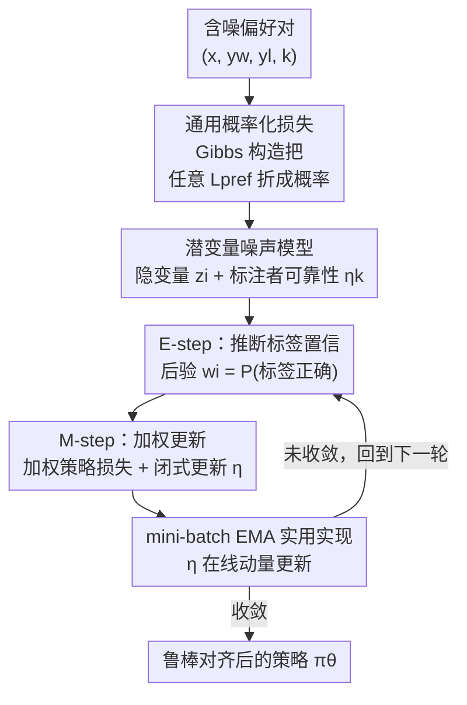

# RE-PO: Robust Enhanced Policy Optimization as a General Framework for LLM Alignment

**会议**: ICLR 2026  
**OpenReview**: [https://openreview.net/forum?id=jDKpOvTCM8](https://openreview.net/forum?id=jDKpOvTCM8)  
**代码**: https://repo-alignment.github.io  
**领域**: 对齐RLHF  
**关键词**: 偏好对齐, 标签噪声, EM算法, 标注者可靠性, DPO

## 一句话总结
RE-PO 把每条偏好标签的"正确与否"当成隐变量，用 EM 算法在训练中边推断每条数据的置信度边更新策略，从而对含噪偏好数据做自适应降权；它还把 DPO/IPO/SimPO/CPO 等一大类偏好损失统一接入同一概率框架，使它们都能被"鲁棒化"，在 AlpacaEval 2 上最多提升 7.0 个百分点。

## 研究背景与动机
**领域现状**：用人类偏好对齐 LLM 的主流范式是 RLHF，以及把对齐重写成分类问题的直接对齐方法（DPO、IPO、SimPO、CPO 等）。这些方法都建立在一个隐含假设之上：收集到的偏好数据是干净的，每个观测标签都同等可信。

**现有痛点**：现实里这个假设几乎总是被违背。大规模偏好数据集往往由多个众包标注者或教师模型聚合而成，受走神、误解、专业度差异乃至对抗/敷衍标注影响，含有大量标签噪声——已有分析指出现代对齐数据集里 20%~40% 的偏好对可能是被污染或自相矛盾的。经典的含噪学习理论表明，标准损失会过拟合这些被污染的监督信号；Gao 等人更进一步发现，标签噪声率只要上升 10 个百分点，下游胜率就可能掉几十个百分点。

**核心矛盾**：直接对齐方法用的是**硬标签**——把人类反馈当成一个非黑即白、绝对可信的二元选择。一次误点击和一次深思熟虑的判断被赋予完全相同的权重，模型无法区分可靠反馈和噪声，于是随错误率上升而显著退化。

**本文目标**：在训练数据含大量噪声时，仍能学到准确、稳定的偏好模型，并且这套机制要能套用到现有各种对齐损失上，而不是只针对 DPO 打补丁。

**切入角度**：作者借鉴了众包里从不可靠标注者学习的经典思路（Dawid–Skene 模型、Crowd-BT）——既然标签可能错，就不要把它当真值，而是把"这条标签是否正确"当成一个隐变量去推断，同时估计标注者的可靠性。

**核心 idea**：用软置信权重代替硬标签——把每条观测偏好的正确性当作隐变量 $z_i$，用 EM 在训练中算出"这条标签正确"的后验概率 $w_i$，再拿它作为自适应权重去更新策略，让高可靠反馈贡献更大、可疑样本被压低。

## 方法详解

### 整体框架
RE-PO 解决的是"偏好标签可能有错"的问题，它的整体思路是把一次普通的偏好优化，改造成一个 EM 迭代：每一轮先估计每条标签有多可信（E-step），再用这些可信度作为权重去更新策略和标注者可靠性（M-step），如此交替，逐步把可能被污染的标签压低、把可靠监督凸显出来。

为了让这套机制不局限于 DPO，作者先做了一层"通用化"：用一个受 Boltzmann 分布启发的 Gibbs 构造，把任意一类偏好损失 $L_{\text{pref}}$ 折算成一个无噪偏好概率 $p(y_w \succ^* y_l \mid x, \theta)$。有了这个概率，E-step 才能算后验、M-step 才能算加权似然，从而 DPO/IPO/SimPO/CPO 都能被同一套 EM 流程套上。最后为了能在大数据上跑，可靠性 $\eta$ 的更新被改成 mini-batch 上的 EMA 在线更新。

### 关键设计

**1. 潜变量噪声模型：把"标签是否正确"显式建模成隐变量**

DPO 的根本缺陷是默认数据集里每条偏好都对。RE-PO 针对这一点，为每个样本 $(x_i, y_{w,i}, y_{l,i})$ 假设存在一个**无噪真值偏好** $y_{w,i} \succ^* y_{l,i}$，而观测到的标签只是它的一个可能被污染的版本。为此引入二元隐变量 $z_i \in \{0,1\}$：$z_i=1$ 表示观测标签和无噪真值一致，$z_i=0$ 表示被翻转。标注者 $k$ 的可靠性参数化为 $\eta_k \triangleq p(z_i=1 \mid k_i=k)$，即"这位标注者给的标签有多大概率是对的"。这样，单条观测偏好的概率就是对隐变量 $z_i$ 边缘化的结果：

$$p(y_{w,i} \succ_{k_i} y_{l,i} \mid x_i, \theta, \eta) = p(y_{w,i} \succ^* y_{l,i} \mid x_i, \theta)\,\eta_{k_i} + p(y_{l,i} \succ^* y_{w,i} \mid x_i, \theta)\,(1-\eta_{k_i}).$$

这个混合形式正是后面 EM 能跑起来的根基——它把"可能标对、也可能标反"两种情况按可靠性加权混在一起，比硬标签多了一个可以学习的可靠性维度。

**2. 通用概率化损失：用 Gibbs 构造把一大类偏好损失接进同一概率框架**

要让 RE-PO 不只对 DPO 有效，必须先把各种偏好损失统一成概率。作者借鉴 Boltzmann 分布的思路，把每种排序按 $\exp(-L_{\text{pref}})$ 打分，由此定义无噪偏好概率：

$$p(y_w \succ^* y_l \mid x, \theta) = \sigma\big(L_{\text{pref}}(x, y_l \succ y_w; \theta) - L_{\text{pref}}(x, y_w \succ y_l; \theta)\big).$$

这个构造的意义在于：对**似然型损失**（如 DPO），它能精确还原原来的概率解释——代入标准 DPO 损失正好得到 Bradley–Terry 模型，保持"概率等价"；对**非似然型损失**（如 IPO 的平方铰链损失），它把损失诱导成一个鲁棒替代目标，可能和原始训练目标不同，但仍是良定义的二元概率。正因如此，DPO、IPO、SimPO、CPO 都能套上同一套 E-step/M-step，RE-PO 从一个具体算法升格成一个**通用元框架**。

**3. EM 交替优化：E-step 算软置信、M-step 闭式更新可靠性**

有了概率模型，RE-PO 用 EM 去最大化观测数据的边缘对数似然——直接最大化那个 log-sum 形式可行但耦合且非凸，EM 提供了稳定的交替更新。**E-step**在当前参数 $\theta^{(t)}, \eta^{(t)}$ 下，算出第 $i$ 条标签正确的后验概率 $w_i$，它充当一个"软标签"或模型对这条数据的置信度：

$$w_i^{(t)} = \frac{p(y_{w,i} \succ^* y_{l,i} \mid x_i, \theta^{(t)})\,\eta_{k_i}^{(t)}}{p(y_{w,i} \succ^* y_{l,i} \mid x_i, \theta^{(t)})\,\eta_{k_i}^{(t)} + p(y_{l,i} \succ^* y_{w,i} \mid x_i, \theta^{(t)})\,(1-\eta_{k_i}^{(t)})}.$$

**M-step**用这些置信度去更新策略和可靠性，且二者解耦：策略通过最小化加权损失更新，$L_{\text{RE-PO}}(\theta) = -\sum_i [\,w_i^{(t)} \log p(y_{w,i}\succ^* y_{l,i}) + (1-w_i^{(t)}) \log p(y_{l,i}\succ^* y_{w,i})\,]$；而每个标注者的可靠性 $\eta_k$ 有简洁的闭式解——就是他所有标签置信度的平均 $\eta_k^{(t+1)} = \frac{1}{N_k}\sum_{i\in I_k} w_i^{(t)}$。这套机制的妙处体现在训练动态上：训练初期模型预测接近 0.5，$w_i$ 近似等于可靠性 $\eta_{k_i}$，损失起到标签平滑的作用，避免早期被错标严重误导；随着策略变好，高质量标签的 $w_i\to 1$ 损失退化成标准偏好优化，噪声标签的 $w_i\to 0$ 则让 $(1-w_i)$ 项主导、把优化方向**翻转**回真实偏好。

**4. mini-batch EMA 实用实现：把可靠性更新摊到小批次上在线进行**

精确 M-step 要在每次策略更新后扫一遍全数据集来重算 $\eta$，代价太大。RE-PO 改用指数滑动平均（EMA）做在线软更新：$\eta_k \leftarrow (1-\alpha)\eta_k + \alpha \cdot \frac{\sum_{i\in B\cap I_k} w_i}{N_{k,B}}$，其中 $N_{k,B}$ 是当前 batch 里标注者 $k$ 的样本数，$\alpha\in(0,1]$ 是动量超参。这样可靠性既保留历史估计的稳定性、又能吸收新 batch 的信息，使整套 EM（实为广义 EM）能在大规模 LLM 微调里跑起来。理论上作者还证明（Theorem 4.1）：在完美校准、全批次的理想设定下，迭代式 (6) 的可靠性估计会收敛到真值 $\eta_k^\star = \mathbb{E}[z_i\mid k_i=k]$。

### 损失函数 / 训练策略
训练目标即上面的加权 RE-PO 损失 $L_{\text{RE-PO}}(\theta)$，按 Algorithm 1 执行：每个 batch 先用当前 $\theta, \eta_{k_i}$ 算 $w_i$，再算加权损失并用 AdamW 更新 $\theta$，最后对 batch 中出现的每个标注者用 EMA 更新 $\eta_k$。关键超参：初始可靠性 $\eta_0\in[0.5,1]$（主实验取 0.9）、EMA 动量 $\alpha$（主实验取 0.1）。单标注者数据集（如 UltraFeedback 派生集）令 $K=1$ 当作单一虚拟标注者；多标注者数据集（MultiPref）则为每个标注者各开一个 $\eta_k$。

## 实验关键数据

### 主实验
两个基座模型 Mistral-7B-Instruct-v0.2 和 Llama-3-8B-Instruct，在 UltraFeedback 派生偏好集上微调，AlpacaEval 2 上报告 LC（长度受控胜率）/ WR（原始胜率），单位百分点。每个算法族对比 Standard / 标签平滑(LS) / RE-PO：

| 算法族 | 基座 | Standard (LC/WR) | w/ LS | w/ RE-PO |
|--------|------|------------------|-------|----------|
| DPO | Mistral-7B | 28.5 / 28.6 | 29.7 / 27.5 | **35.5 / 33.0** |
| DPO | Llama-3-8B | 40.8 / 42.9 | 41.3 / 42.6 | **44.1 / 46.2** |
| IPO | Llama-3-8B | 43.6 / 41.6 | 40.3 / 38.2 | **48.3 / 48.6** |
| CPO | Llama-3-8B | 35.9 / 40.3 | 35.3 / 34.8 | **40.1 / 43.8** |

RE-DPO 在 Mistral-7B 上 LC 从 28.5→35.5（+7.0）、WR 从 28.6→33.0（+4.4）；RE-IPO 在 Llama-3-8B 上 WR 从 41.6→48.6（+7.0）。与专门的鲁棒基线对比，RE-DPO（Llama-3-8B 44.1/46.2）也优于 rDPO（37.3/35.4）和 Hölder-DPO（39.3/38.2）。

### 多标注者实验（MultiPref）
真实多标注者数据集（227 名标注者），为每人单独建 $\eta_k$：

| 方法 | Mistral-7B (LC/WR) | Llama-3-8B (LC/WR) |
|------|--------------------|--------------------|
| DPO | 28.8 / 26.4 | 36.7 / 39.3 |
| RE-DPO | **31.8 / 28.8** | **41.1 / 44.4** |

### 消融实验
RE-DPO + Mistral-7B，扫初始 $\eta_0$ 与 EMA 动量 $\alpha$（AlpacaEval 2 LC / WR、Arena-Hard WR）：

| 超参 | 取值 | AlpacaEval2 LC | 说明 |
|------|------|----------------|------|
| $\eta_0$ | 0.99 | 30.9 | 过于乐观，早期太信任噪声标签 |
| $\eta_0$ | **0.9 (Ours)** | **35.5** | 最佳平衡 |
| $\eta_0$ | 0.55 | 31.4 | 过于悲观，拖慢学习无噪偏好 |
| $\alpha$ | 0.001 | 30.9 | 可靠性更新太慢、跟不上模型演化 |
| $\alpha$ | **0.1 (Ours)** | **35.5** | 最佳 |
| $\alpha$ | 1.0 | 31.1 | 只看当前 batch，估计过于波动 |

### 关键发现
- RE-PO 作为"即插即用鲁棒层"在四个损失族、两个基座上普遍匹配或超过标准实现，且常常在族内取得最佳，说明显式建模噪声监督比纯损失层面修改或全局噪声校正更有效。
- 初始可靠性 $\eta_0=0.9$、EMA $\alpha=0.1$ 是甜点；两端取值都会变差，模型对 $\alpha$ 较敏感。
- 受控合成噪声实验（用 Qwen2.5-0.5B-Instruct 近似完美校准）显示，RE-PO 估计的可靠性能紧跟 GPT-4o 标签建立的真值，单/双标注者两种设定下都成立——即便模型只是近似校准，可靠性估计仍准确稳定，缓解了"早期失校准会系统性压低正确标签"的担忧。
- 定性分析（附录 F）表明被赋低置信 $w_i$ 的样本，多是离题、与提示不符或不如另一候选合理的标注，说明 RE-PO 确实在样本级别识别并降权噪声。

## 亮点与洞察
- **把众包里的 Dawid–Skene/Crowd-BT 思想迁到 LLM 对齐**：标注者可靠性 + 标签隐变量这套老工具被重新用在偏好数据上，既给了软置信权重又给了可解释的 $\eta_k$，思路干净且有理论支撑。
- **Gibbs 构造是真正的"通用化"杠杆**：用 $\exp(-L_{\text{pref}})$ 打分把任意偏好损失折成概率，使得 DPO/IPO/SimPO/CPO 一次性都能鲁棒化——这是从"一个算法"升格为"一个框架"的关键，也是论文标题里 general framework 的底气。
- **训练动态的自校正很优雅**：$w_i$ 在早期≈可靠性起标签平滑作用、在后期对噪声标签翻转优化方向，这种"随模型变好而越来越敢拒绝错标"的行为不靠额外教师模型，纯靠 EM 自洽完成。
- **可迁移性**：任何写成偏好对比损失的对齐目标，原则上都能套这层 EM 加权；多标注者场景还能直接落地为 per-annotator 可靠性，给数据质量审计提供了天然抓手。

## 局限与展望
- **理论依赖完美校准假设**：Theorem 4.1 的收敛保证建立在模型完美校准、全批次训练上；若基座模型初始严重失配，E-step 可能给错标赋高置信，反而无法去噪。把收敛保证扩展到显著失配的基座是重要的未来工作（作者承认）。
- **实践上靠强指令模型兜底**：实验始终从 Mistral-7B-Instruct / Llama-3-8B-Instruct 这类已有良好零样本偏好行为的强模型出发，回避了上面的失败模式；在弱基座或冷启动上是否同样稳健未充分验证。
- **非似然损失的目标会偏移**：对 IPO 这类非似然损失，Gibbs 诱导出的概率与原始训练目标不同，等价性只在似然型损失上严格成立，意味着"鲁棒化"后优化的其实是个替代目标。
- **可靠性建模粒度**：当前按标注者建 $\eta_k$，对系统性偏差或随提示难度变化的噪声刻画有限；把可靠性与样本难度/语境解耦或许能进一步提升。

## 相关工作与启发
- **vs DPO/IPO/SimPO/CPO**：它们都用硬标签、对每条偏好同等绝对信任；RE-PO 不改它们的损失形态，而是在外面套一层 EM 软置信加权，把它们各自的损失通过 Gibbs 构造接进概率框架后逐一鲁棒化，是正交的增强而非替代。
- **vs ROPO**：ROPO 用噪声容忍损失 + 对高不确定样本降权/丢弃，不依赖外部教师；RE-PO 不只改损失形状或丢点，而是显式建模数据生成过程（标注者可靠性 + 标签正确性都作隐变量推断），给出细粒度、样本特定的后验置信权重。
- **vs rDPO / Hölder-DPO**：rDPO 构造真损失的无偏估计但需先验已知全局噪声率，Hölder-DPO 用"redescending"损失抑制极端离群点而无需已知噪声率；RE-PO 不需要预先知道噪声率，靠 EM 自动推断每条标签与每个标注者的可靠性，实验上也优于二者。
- **vs Selective DPO**：Selective DPO 按样本相对模型能力的难度过滤（用验证损失代理），是和"标签正确性"正交的维度；RE-PO 聚焦标签是否被污染，两者互补。

## 评分
- 新颖性: ⭐⭐⭐⭐ 把众包可靠性建模 + Gibbs 通用化巧妙嫁接到偏好对齐，框架化程度高
- 实验充分度: ⭐⭐⭐⭐ 四损失族×两基座×单/多标注者+受控噪声验证+消融，覆盖全面
- 写作质量: ⭐⭐⭐⭐ 动机—方法—理论—实验链条清晰，公式与训练动态解释到位
- 价值: ⭐⭐⭐⭐ 即插即用、无需已知噪声率，对真实含噪偏好数据的对齐实用性强

<!-- RELATED:START -->

## 相关论文

- [\[ACL 2026\] Teaching LLM to be Persuasive: Reward-Enhanced Policy Optimization for Alignment from Heterogeneous Rewards](../../ACL2026/llm_alignment/teaching_llm_to_be_persuasive_reward-enhanced_policy_optimization_for_alignment_.md)
- [\[ICLR 2026\] Robust Preference Alignment via Directional Neighborhood Consensus](robust_preference_alignment_via_directional_neighborhood_consensus.md)
- [\[ICLR 2026\] The Alignment Auditor: A Bayesian Framework for Verifying and Refining LLM Objectives](the_alignment_auditor_a_bayesian_framework_for_verifying_and_refining_llm_object.md)
- [\[ICLR 2026\] Learning More with Less: A Dynamic Dual-Level Down-Sampling Framework for Efficient Policy Optimization](learning_more_with_less_a_dynamic_dual-level_down-sampling_framework_for_efficie.md)
- [\[ICLR 2026\] Mitigating the Safety Alignment Tax with Null-Space Constrained Policy Optimization](mitigating_the_safety_alignment_tax_with_null-space_constrained_policy_optimizat.md)

<!-- RELATED:END -->
