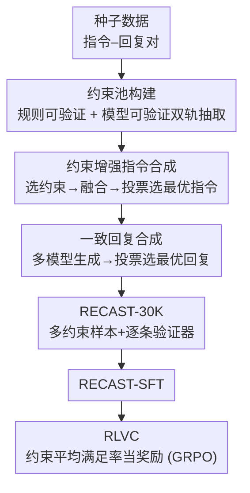

# RECAST: Expanding the Boundaries of LLMs' Complex Instruction Following with Multi-Constraint Data

**会议**: ICLR 2026  
**OpenReview**: [https://openreview.net/forum?id=90tCp2KszA](https://openreview.net/forum?id=90tCp2KszA)  
**代码**: https://github.com/Thekey756/RECAST  
**领域**: 对齐RLHF / 指令跟随  
**关键词**: 复杂指令跟随、多约束、数据合成、可验证奖励、强化学习

## 一句话总结
RECAST 从真实的「指令–回复」对里反向挖掘出大量可验证的约束，把它们重新拼装成单条指令含十几个约束的高复杂度训练数据（RECAST-30K，30K 条 / 19 类约束），再配上规则与模型双轨验证器；用它做 SFT 就能让小模型的复杂指令跟随能力超过大几个量级的模型，进一步用「约束满足率」当奖励做 RL（RLVC）还能再涨一截，同时不损伤通用能力。

## 研究背景与动机
**领域现状**：随着 LLM 应用变广、用户越来越会写 prompt，一条指令里塞进多个显式要求（角色设定、字数、关键词、格式、语气、事实一致性……）已经是常态。现有提升指令跟随的工作要么靠人工构造评测集（无训练集、不可扩展），要么靠 LLM 对指令做改写式扩增（AutoIF、Evol-Instruct 等）。

**现有痛点**：作者指出两个硬伤。其一，**约束数量上不去**——据他们调研，现有数据集每条样本的约束数几乎都不超过 10 个，而真实场景（如并购条款起草、企业助理执行业务规则）动辄十几条约束同时成立。其二，**约束太单一或难验证**——AutoIF 只用代码可验证的约束，覆盖面窄；改写式扩增又容易产生同质化、相互矛盾的约束，且没有配套的验证方法。

**核心矛盾**：要训出能扛十几条约束的模型，就得有「约束多、类型杂、还能逐条验证」的数据；但这三者很难兼得——靠人写不可扩展，靠 LLM 凭空生成约束既同质又无法保证回复真满足它。

**本文目标**：(1) 造出约束密度远超现有 benchmark 的高质量训练/评测数据；(2) 让每条约束都自带验证方法；(3) 把这种可验证性进一步用于 RL，逼模型同时满足多约束。

**切入角度**：与其「凭空生成约束再让模型去满足」，不如**反过来**——既然真实回复本身就隐含了大量被满足的约束，那就从已有的「指令–回复」对里把这些约束**抽取**出来。这样约束天然真实、天然被对应回复满足，验证信号也就现成了。

**核心 idea**：Realistic Extraction of Constraints for Augmented inStruction synThesis——先从种子数据的回复里挖出可验证约束建成约束池，再把多条约束自然融合进原指令、重新合成一致的回复，从而「无中生有」地把约束密度推高；并由约束的可验证性派生出 RL 奖励（RLVC）。

## 方法详解

### 整体框架
RECAST 是一条「三阶段数据合成流水线 + 一套 RL 训练方案」。数据侧的输入是普通的种子「指令–回复」数据（用 Tülu 3 Persona IF），输出是 RECAST-30K：每条样本是一个被多约束改写过的指令、一个满足全部约束的回复，并标注了每条约束及其验证方式。拿到数据后，先做 SFT（RECAST-30K-SFT），再以「约束平均满足率」作奖励做 GRPO 强化学习（RECAST-30K-RLVC）。

流水线分四步：① 种子数据收集；② 约束池构建（规则可验证 + 模型可验证双轨）；③ 约束增强指令合成（选约束→融合进指令→投票选最优指令）；④ 一致回复合成（多模型生成候选→投票选最优回复）。之后 RLVC 复用约束的验证器，把「这条回复满足了几条约束」量化成 reward 喂给 GRPO。

### 关键设计

**1. 从真实回复反向抽取约束：用「双轨抽取」把约束密度做高又保证可验证**

要让一条指令带十几个约束还都真实可满足，关键是别凭空造约束，而是从种子回复里**反推**「这条回复其实已经满足了哪些此前没在指令里写出来的要求」。RECAST 把约束按验证机制分两类双轨抽取：**规则可验证约束**指结构（段落数）、词汇（必含/禁含关键词）、数量（字数上限）这类能用确定性程序判定的客观要求，作者实现了 9 个专门的规则抽取器去扫描回复、识别可程序化验证的属性；**模型可验证约束**指风格（正式度）、语气（礼貌度）、内容特性（说服力）这类需要语义判断的主观要求，流程是先从 10 类约束 taxonomy 里判定哪些类型适用于该回复、再用 LLM 生成多个具体约束实例、最后用一道过滤把「回复其实没满足」的约束剔掉。两轨合起来既覆盖客观可程序判定、又覆盖主观语义维度，而且每条约束都**自带**一个验证方法——这正是后面 RL 能用的基础。

**2. 约束增强指令合成：把多条约束「自然」融进一句指令，而不是机械堆叠**

有了约束池，还得把选中的多条约束写成一条读起来通顺的指令，否则就是把约束生硬罗列。这一步分三小步：先用 LLM 从池中**挑出**一组与原指令相关、彼此不矛盾的约束子集（避免塞进无关或冲突的要求）；再让**多个** LLM 各自把这组约束自然地融合进原指令，得到多个候选改写；最后用**多数投票**机制让多个 LLM 按语言流畅度、语义连贯性、约束完整性给候选打分排序，取最高分者作为最终的增强指令。多模型 + 投票的设计是为了对冲单模型的偏置，保证最终指令既保留全部约束又读着像人写的。

**3. 一致回复合成：让回复真的满足被改写后的指令，消除指令–回复错位**

原种子回复未必满足新加进去的约束，直接拿旧回复配新指令会造成监督信号错位。RECAST 用两阶段修复：**多样回复生成**——用不同 LLM 各自独立对增强指令生成多个候选回复，引入多样性、避免单模型偏置；**回复质量评估**——再用多数投票综合考虑约束遵守度、准确性、简洁性等维度，选出最佳回复入库。最终每条样本是「多约束指令 + 确实满足这些约束的回复 + 逐条约束及其验证方法」的三元组，可直接用于下游训练和评测。

**4. RLVC：把「逐条约束可验证」变成细粒度奖励，逼模型同时满足多约束**

数据天生可验证这件事，被进一步榨成 RL 信号。传统 RLHF 给一条整体奖励，模型不知道到底违反了哪条约束；RECAST 因为每条约束都有验证器，可以给出更有信息量的奖励。验证函数定义为
$$f(x,y,c_i)=\begin{cases}V_{\text{rule-based}}(x,y,c_i) & c_i\text{ 是规则约束}\\ V_{\text{model-based}}(x,y,c_i) & c_i\text{ 是模型约束}\end{cases}$$
两类验证器都返回二值（满足 1 / 违反 0）。对含约束集合 $C=\{c_1,\dots,c_n\}$ 的指令 $x$，回复 $y$ 的奖励取**所有约束的平均满足率**：
$$R(x,y)=\frac{1}{|C|}\sum_{i=1}^{|C|} f(x,y,c_i)$$
这样每条约束相当于一个独立的奖励通道，给模型「哪条做到了、哪条没做到」的细粒度反馈，而不是一个笼统的好/坏分。RLVC 把这个奖励接到 GRPO（Group Relative Policy Optimization）上，用其组内相对比较的方式做策略优化；训练从 SFT 后的模型出发继续 RL。

## 实验关键数据

### 主实验（RECAST-Test，四难度等级，HSR 平均）
RECAST-Test 是作者自建的分四档难度的层级化 benchmark，约束密度远超既有 benchmark。指标用 HSR（Hard Constraint Satisfaction Rate，一条指令所有约束**同时**满足才算对），并分解为 RSR（规则约束）、MSR（模型约束）、OSR（整体）。下表为各方法在 Qwen2.5-7B 基座上的四档平均满足率：

| 方法（Qwen2.5-7B 基座） | Average HSR(%) |
|--------------------------|------|
| Tülu 3 Persona IF（种子数据直训） | 26.83 |
| Conifer | 22.21 |
| Evol-Instruct | 16.46 |
| ShareGPT | 19.13 |
| **RECAST-30K-SFT** | **31.25** |
| **RECAST-30K-RLVC** | **32.33** |

闭源/大模型对照（同一 benchmark）：Gemini-2.5-Pro 39.75、DeepSeek-V3 35.50、GPT-4o 34.46、Qwen2.5-7B-Instruct 26.46、Llama-3.3-70B-Instruct 24.75。可见连最强的 Gemini-2.5-Pro 平均也不到 40%，说明复杂指令跟随对当前 LLM 仍很难；而 RECAST-30K-SFT/RLVC 让一个 7B 模型超过了 Qwen2.5-72B-Instruct（33.38）之外的多数同尺寸 instruct 模型，并远超用同一种子数据直训的 26.83。

### 对比 / 泛化实验

| 对比维度 | 设置 | 结果 |
|----------|------|------|
| vs 推理期方法 DVR | RSR 平均（Qwen 基座） | RECAST-SFT 13.0% vs DVR 6.5%（+6.5 点）；Llama 基座 12.5% vs 7.0%（+5.5 点） |
| 外部 IF benchmark | IFEVAL / FollowBench | RECAST-SFT 已超全部 baseline，RLVC 在 Llama3.1-8B、Qwen2.5-7B 上均取最佳 |
| 通用能力保持 | GPQA / MUSR 平均 | RLVC 在 Llama3.1-8B 达 34.64、Qwen2.5-7B 达 38.39，未见退化 |

### 关键发现
- **规则约束反而比模型约束更难满足**：所有模型的 RSR 普遍远低于 MSR（如 GPT-4o L1 MSR 89.5 / RSR 24.5），说明字数、关键词、格式这类「客观但精确」的要求才是当前 LLM 的短板。
- **难度越高，RLVC 增益越明显**：RECAST-30K-RLVC 相对 SFT 的提升集中在 Level 3–4，即约束交互更复杂时，细粒度的逐约束奖励价值更大。
- **训练期 > 推理期**：RECAST 这种把约束烤进权重的训练方案，比 DVR 这类推理期自我对齐/验证的方法稳健，且两者收益互补。
- **不偷通用能力**：复杂指令跟随大涨的同时，GPQA/MUSR 等推理与知识 benchmark 基本持平，说明没有为了对齐约束而牺牲通用能力。

## 亮点与洞察
- **「抽取 > 生成」的数据哲学**：从真实回复反推被满足的约束，天然解决了「约束真实性」与「回复是否满足约束」两个老大难——约束既来自真实分布，又默认被对应回复满足，验证信号免费送上门。这一思路可迁移到任何「需要带可验证标签的合成数据」的场景。
- **可验证性贯通数据与 RL**：同一套规则/模型双轨验证器，既用于数据过滤（保证质量），又直接当 RL 奖励（RLVC），把数据集的「可验证」属性一鱼两吃。
- **平均满足率当奖励**比单一整体奖励更稠密：每条约束一个通道，让 GRPO 知道具体哪条没做到，这是它在高难度档涨得多的根因。
- **小模型逆袭大模型**的样本效率：仅 30K 样本 SFT，Llama3.1-8B-Base 就在复杂指令跟随上压过用海量数据训的 instruct 版乃至 70B 模型，凸显「数据复杂度对路」比「数据量大」更重要。

## 局限与展望
- **强依赖种子数据的覆盖面**：约束是从 Tülu 3 Persona IF 的回复里挖的，种子数据没覆盖到的领域/约束类型就挖不出来，数据多样性上限被种子框住。
- **模型可验证约束的判定可能有噪声**：主观约束（语气、说服力）由 LLM 当验证器，filtering 与 RL reward 都依赖 LLM 判断，存在评判偏差；作者用人工评估抽样验证了一致性，但规模化后的稳定性仍待观察。
- **绝对满足率仍低**：即便最强模型在 RECAST-Test 上平均也才约 40%，说明十几约束同时满足这个问题远未解决，本文更多是把「天花板抬高、提出可训练的范式」，而非刷到高分。
- **评测器与训练器同源**：主实验大量用 GPT-4o 当评判，存在评测器偏好的潜在循环，跨评判器的鲁棒性值得补充。

## 相关工作与启发
- **vs Evol-Instruct / Conifer**：它们靠 LLM 迭代改写或多级约束生成来加难度，约束是「造」出来的，易同质化、且不保证可验证；RECAST 从真实回复**抽取**约束并配验证器，约束更真实、更可控、可直接用于 RL。
- **vs AutoIF**：AutoIF 只用代码可验证约束，覆盖窄；RECAST 用规则 + 模型双轨，把主观语义约束也纳入可验证体系。
- **vs CRaB（back-translation 推约束）/ MUFFIN（扩输入特征）**：同属约束/指令扩增，但 RECAST 强调约束密度（>10）与逐条验证机制这两点是它们没有的。
- **vs DVR（Divide-Verify-Refine，推理期）**：DVR 在推理时做自验证–修正，RECAST 把能力训进权重，实验证明训练期方案更稳健且与推理期互补。

## 评分
- 新颖性: ⭐⭐⭐⭐ 「从真实回复反向抽取可验证约束」这一数据哲学，配上把可验证性贯通到 RL 奖励，思路干净且实用。
- 实验充分度: ⭐⭐⭐⭐ 自建分档 benchmark + 多基座 + 外部 IF/通用能力多维评测，覆盖较全；绝对分偏低但诚实。
- 写作质量: ⭐⭐⭐⭐ 框架与动机清晰，流水线四步交代到位；图为 OCR 噪声较多但正文自洽。
- 价值: ⭐⭐⭐⭐ 复杂指令跟随是真实部署刚需，数据集 + RLVC 范式可复用性强。

<!-- RELATED:START -->

## 相关论文

- [\[ACL 2026\] MDP-GRPO: Stabilized Group Relative Policy Optimization for Multi-Constraint Instruction Following](../../ACL2026/llm_alignment/mdp-grpo_stabilized_group_relative_policy_optimization_for_multi-constraint_inst.md)
- [\[ACL 2025\] Reverse Preference Optimization for Complex Instruction Following](../../ACL2025/llm_alignment/reverse_preference_optimization_for_complex_instruction_following.md)
- [\[ACL 2025\] IOPO: Empowering LLMs with Complex Instruction Following via Input-Output Preference Optimization](../../ACL2025/llm_alignment/iopo_input_output_preference.md)
- [\[ICLR 2026\] ContextIF: Enhancing Instruction-Following through Context Reward](contextif_enhancing_instruction-following_through_context_reward.md)
- [\[ICLR 2026\] IDEAL: Data Equilibrium Adaptation for Multi-Capability Language Model Alignment](ideal_data_equilibrium_adaptation_for_multi-capability_language_model_alignment.md)

<!-- RELATED:END -->
