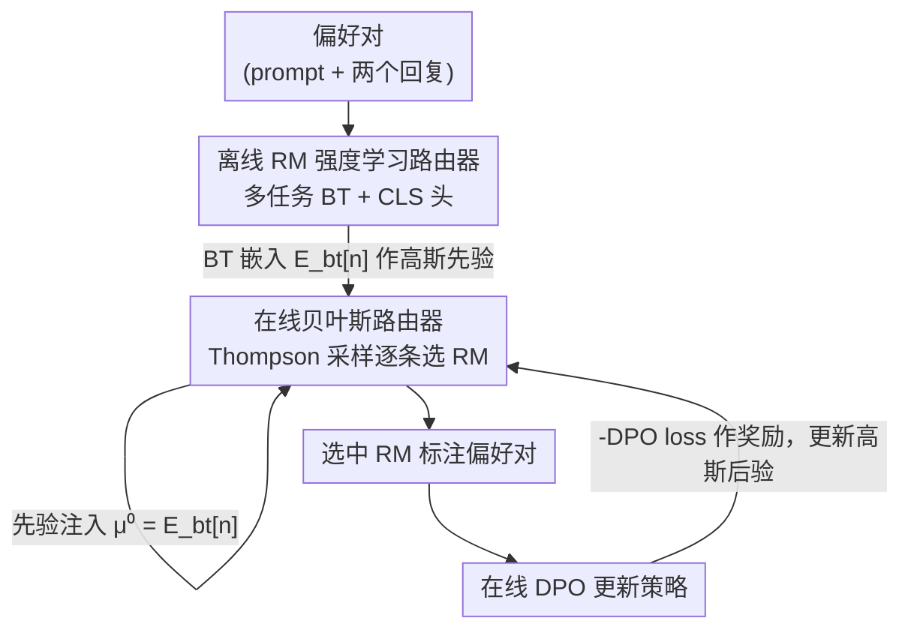

# Reward Model Routing in Alignment

**会议**: ICLR 2026  
**OpenReview**: [https://openreview.net/forum?id=i3OKIHSsHC](https://openreview.net/forum?id=i3OKIHSsHC)  
**代码**: https://github.com/XinleWu/BayesianRouter  
**领域**: 对齐RLHF  
**关键词**: 奖励模型路由, RLHF, 在线DPO, Thompson采样, 上下文老虎机

## 一句话总结
本文提出 **BayesianRouter**，一个在 RLHF/在线 DPO 训练中为每条偏好对**逐条挑选最合适奖励模型**的混合路由框架：离线阶段用偏好数据训练一个多任务路由器学习各奖励模型的擅长领域，在线阶段用贝叶斯 Thompson 采样按 query 选模型，并把离线学到的强度当作高斯先验注入，在线性更新中边对齐边适应策略分布，最终在指令跟随与推理基准上稳定超过单一 RM、RM 集成和已有路由方法 LASER。

## 研究背景与动机
**领域现状**：RLHF/RLAIF 已是对齐大模型的标准范式。主流做法是用**一个固定的奖励模型（RM）**贯穿整个训练，由它给策略模型的回复打分（PPO 给标量奖励）或做成对比较（DPO 判断哪个回复更好），从而把人类偏好注入策略。

**现有痛点**：单一 RM 有三个结构性缺陷。其一**泛化性有限**——没有任何一个 RM 在所有任务上都最强，RewardBench 2 显示某个 RM 在数学/安全上领先，却在事实性上输给别人；用一个 RM 包打天下必然在部分领域吃亏。其二**成本高**——想用 GPT-5 级别的通用大模型当 RM 质量虽高，但大规模查询代价高到无法承受。其三**过优化风险**——死磕单个 RM 会放大对它特有偏见/噪声的过拟合，策略容易学会钻 RM 漏洞（reward hacking）而非真正对齐人类意图。

**核心矛盾**：想兼得「多个 RM 的互补强度」与「低推理开销」是矛盾的。朴素地对每条 query 跑全部 N 个 RM 再集成（多数投票等），把每步 RM 调用从 $O(1)$ 抬到 $O(N)$，训练成本爆炸，而且模型意见相左时还会引入冲突/噪声信号。

**切入角度**：路由（routing）是折中点——不聚合所有模型输出，而是动态**为每条输入只选一个最合适的 RM**，既保留模型多样性又把开销压回 $O(1)$。前作 LASER 首次把 RM 选择建模成上下文老虎机（LinUCB），但它有三个硬伤：**粗粒度**（一个 batch 共用一个 RM，可同 batch 内不同 prompt 偏好不同 RM）、**探索不足**（LinUCB 靠点估计+乐观值，容易过早锁死某个次优臂）、**冷启动低效**（开局假设所有 RM 一样好，要采集大量交互才能识别各自强项，早期一直在用次优 RM）。

**核心 idea**：用「离线学到的 RM 强度先验」+「在线贝叶斯 Thompson 采样」组合，把先验当高斯均值注入在线路由器——离线先验治冷启动、提升早期路由准确率，在线贝叶斯后验更新治分布漂移与探索不足，逐条 query 选 RM 替代逐 batch 选。

## 方法详解

### 整体框架
BayesianRouter 服务于**在线 DPO**：每步给一个 prompt mini-batch，对每个 prompt 采样 $k$ 个候选回复，需要一个 RM 把它们评成偏好对 $(x, y_w, y_l)$，再用 DPO 损失更新策略。问题就是——这一步该用候选池 $M=\{R_n\}_{n=1}^N$ 里的哪个 RM？

整个框架分两阶段串联：**离线阶段**在静态偏好语料上训练一个 RM 路由器，学出「给定偏好对，哪个 RM 最可能判对」的强度表示，产出每个 RM 的 BT 嵌入 $E_{bt}[n]$；**在线阶段**在 DPO 训练中用贝叶斯 Thompson 采样逐条偏好对选 RM，每个 RM 维护一个高斯后验 $w_n\sim\mathcal{N}(\mu_n,\Sigma_n)$，被选中后用观测奖励更新后验。两阶段的桥梁是**先验注入**：把离线 BT 嵌入设为在线后验的先验均值 $\mu_n^{(0)}=E_{bt}[n]$，让在线路由器开局就带着离线知识，训练中再被在线奖励逐步打磨。

### 关键设计

**1. 离线 RM 强度学习路由器：用多任务目标在共享嵌入空间刻画每个 RM 的擅长领域**

针对「冷启动低效」——在线路由器若从零开始，要烧很多交互才知道谁擅长什么。本文先在离线偏好数据 $\hat{D}_{pref}=\{(x_i,y_i,y_i',\ell_i)\}$（$\ell_i$ 标注哪个回复更优）上把这件事学好。做法是先**采集 RM 行为数据**：让每个候选 $R_n$ 跑遍每条偏好对，记一个二元指标 $\delta_i^{(n)}\in\{0,1\}$ 表示它是否与真值 $\ell_i$ 一致。与 LASER 只用 prompt 当输入不同，本文把**整条偏好对**编码，因为 RM 的判断不仅取决于 prompt，还取决于两个回复的语义内容与对比：先用共享编码器把 prompt 与每个回复拼接编码成 $e_i=\text{Enc}(x_i\Vert y_i)$、$e_i'=\text{Enc}(x_i\Vert y_i')$，再融合成偏好对表示 $h_i=\text{MLP}([e_i+e_i';\ |e_i-e_i'|])$。

在 $h_i$ 上挂**两个头做多任务学习**。主头是 **Bradley–Terry 头**：从「两个 RM 行为不一致」的分歧样本集 $D_{bt}=\{(q_i,n,n')\mid\delta_i^{(n)}=1,\delta_i^{(n')}=0\}$ 学一个 RM 嵌入矩阵 $E_{bt}$，BT 分用内积 $s_i^n=\langle h_i,E_{bt}[n]\rangle$ 算，优化成对 logistic 损失 $L_{bt}=-\frac{1}{|D_{bt}|}\sum\log\sigma(s_i^n-s_i^{n'})$，让判对的 RM 拿更高能力分。辅助头是**分类（CLS）头**：因为 BT 头只用了分歧样本、浪费了其余数据，CLS 头对每个 RM 独立预测其行为标签 $\delta_i^{(n)}$，用二元交叉熵 $L_{cls}$ 把整份 $D_{beh}$ 都用上，通过共享表示反哺 BT 排序。总损失 $L_{total}=L_{bt}+\lambda L_{cls}$，训练完**只保留 BT 嵌入 $E_{bt}$** 当在线先验，因为它最直接编码了「条件于偏好对的相对 RM 强度」。

**2. 在线贝叶斯 Thompson 采样路由器：用后验采样替代点估计，逐条 query 选 RM 并持续探索**

针对 LASER「探索不足 + 粗粒度」——作者实证发现 LinUCB 跑几个 batch 后常**坍缩到单一固定臂**，因为每臂观测稀少、上下文又相似，导致过早 exploit。本文把在线路由建模成**上下文部分反馈学习**（候选 RM 是臂、偏好对嵌入 $h_i$ 是上下文），用贝叶斯线性回归建模选 $R_n$ 的期望效用 $r=w_n^\top h_i+\varepsilon$，$\varepsilon\sim\mathcal{N}(0,\sigma^2)$，每个 RM 维护高斯后验 $w_n\sim\mathcal{N}(\mu_n,\Sigma_n)$。每步对 batch 里每条偏好对，从各 RM 后验**采样**一组权重 $w_n^{(t)}\sim\mathcal{N}(\mu_n^{(t)},\Sigma_n^{(t)})$，选 $n_i^*=\arg\max_n h_i^\top w_n^{(t)}$。这种从「不确定性感知后验」里采样的方式天然平衡探索与利用，比单一确定性估计更能稳健地发现每类 query 该用哪个 RM。

被选中 RM 在其分配到的样本 $I_n^{(t)}$ 上观测奖励后，用累积充分统计量更新后验：

$$\Sigma_n^{(t+1)}=\Big(\Sigma_n^{(t)-1}+\tfrac{1}{\sigma^2}\sum_{i\in I_n^{(t)}}h_ih_i^\top\Big)^{-1},\quad \mu_n^{(t+1)}=\Sigma_n^{(t+1)}\Big(\Sigma_n^{(t)-1}\mu_n^{(t)}+\tfrac{1}{\sigma^2}\sum_{i\in I_n^{(t)}}\hat{r}_i^n h_i\Big).$$

奖励信号沿用 LASER 取 $\tilde{r}_i^n=-L_{DPO}^i$（DPO 损失越低奖励越高），再做**分位数归一化**得到方差更小、数值更稳的 $\hat{r}_i^n$。作者论证这个「策略损失」信号不会坍向迎合当前（可能有缺陷）策略的「拍马屁」RM：一个靠偏好短回复等取巧的低质 RM 只能在窄分布上保持低损失，当 Thompson 采样探索多样 RM、策略分布随之迁移时，这种 RM 的损失会飙升；而高质 RM 偏好梯度自洽，长期轨迹方差更低、损失量级更小，因此路由器会偏好提供长期稳定指导的 RM。

**3. 离线-在线先验注入整合：把 BT 嵌入当后验先验均值，而非简单加权两个分数**

针对「离线/在线各有短板」——离线路由器有充足监督但怕分布漂移（OOD 时退化），在线路由器能适应目标分布但冷启动慢、探索难，单用谁都不够。朴素整合是直接对两者预测分数加权平均，但需要手调一个全局权重 $\alpha$，其最优值未知且可能随训练阶段变化。本文的关键洞察是：**离线 BT 头与在线贝叶斯路由器本质都是偏好对嵌入上的线性模型**——离线算 $\langle h,E_{bt}[n]\rangle$，在线算 $\langle h,w_n\rangle$，$E_{bt}[n]$ 与 $w_n$ 语义角色高度一致，只是监督来源不同（离线标签 vs 在线奖励）。

于是更原则化的做法是**先验注入**：把在线每个 RM 权重向量的先验均值直接设为对应离线嵌入 $\mu_n^{(0)}=E_{bt}[n]$（对照无先验时设 $\mu_n^{(0)}=0$、$\Sigma_n^{(0)}=\sigma_w^2 I$）。这让在线路由器开局就带着「各 RM 擅长哪类偏好对」的知识，缓解冷启动、提升早期路由准确率；训练中后验被在线奖励迭代精炼，适应策略诱导的分布漂移，同时把离线先验当作正则保留下来。这样就把离线训练的鲁棒性与在线学习的适应性合二为一。

### 损失函数 / 训练策略
离线路由器：$L_{total}=L_{bt}+\lambda L_{cls}$，联合优化编码器 $W_e$、融合 MLP $W_l$、两个头嵌入 $E_{bt}$/$E_{cls}$。策略侧：标准在线 DPO 损失（式 1），$\pi_{ref}$ 取初始策略 $\pi_0$。在线路由器奖励 $\hat{r}_i^n$ 由 $-L_{DPO}^i$ 经分位数归一化得到，后验按式 5/6 增量更新。框架对 DPO 家族（IPO、SLiC 等变体）兼容，原则上也能用于 PPO 等依赖标量奖励的方法（本文未评估）。

## 实验关键数据

### 主实验
策略模型初始化为 LLaMA3-SFT-v2；RM 池为 4 个来自 RewardBench 2 的小而强模型（Mistral-RM、GRM-Llama3.2-3B、GRM-gemma2-2B、Skywork-Reward-V2-Qwen3-0.6B）；离线路由器编码器用 SmolLM2-135M-Instruct；离线偏好数据由 HelpSteer3 + RM-Bench 合成 50,402 对。

| 方法 | AlpacaEval-2 | MT-Bench | Arena-Hard | GSM8K | MMLU |
|------|------|------|------|------|------|
| SFT | 50.00 | 50.00 | 50.00 | 67.63 | 54.29 |
| 单一最佳 RM（RM1） | 61.86 | 56.25 | 64.80 | 74.22 | 57.03 |
| Majority vote | 60.75 | 53.75 | 63.40 | 74.22 | 56.71 |
| UWO（不确定性加权集成） | 61.74 | 56.25 | 63.60 | 74.30 | 56.43 |
| LASER（逐 batch LinUCB） | 60.50 | 51.25 | 62.40 | 74.00 | 56.35 |
| **BayesianRouter** | **63.23** | **58.75** | **66.20** | **75.66** | **57.39** |

在指令跟随（AlpacaEval-2 / MT-Bench / Arena-Hard）与推理（GSM8K / MMLU）两类分布上，BayesianRouter 全面超过单一 RM、RM 集成（多数投票/UWO）和路由基线（随机/LASER），且只需 $O(1)$ RM 调用，集成方法却要 $O(N)$。

### 消融实验

| 配置 | AlpacaEval-2 | Arena-Hard | GSM8K | 说明 |
|------|------|------|------|------|
| w/o offline（无离线先验） | 60.99 | 63.20 | 74.37 | 仅在线贝叶斯；已超 LASER |
| w/o online（仅离线路由器） | 61.61 | 64.40 | 74.68 | 怕分布漂移 |
| Weighted-score（分数加权整合） | 61.12 | 63.80 | 74.37 | 手调 $\alpha$ 的朴素整合 |
| **Ours（先验注入）** | **63.23** | **66.20** | **75.66** | 完整模型 |

离线路由器单独评估（表 2）：ID（HelpSteer3）上路由准确率 90.31，明显高于单 RM/多数投票/随机；OOD（RewardBench 2）上 87.92 仍有增益但距 oracle（100）有差距，印证在线适应的必要；去掉 CLS 头（w/o CLS）降到 87.34，验证多任务训练有效；换 0.5B 编码器仅微涨（88.06），故选 135M 平衡效率。

### 关键发现
- **两个组件互补、缺一不可**：w/o offline 和 w/o online 都明显掉点；尤其 w/o offline（仅在线 Thompson 采样）已超过 LASER，说明逐 query 贝叶斯后验采样本身就强于 LASER 的逐 batch LinUCB。
- **先验注入优于分数加权**：Weighted-score 即便扫了最优 $\alpha\in\{0.25,0.5,0.75\}$ 仍全面落后于先验注入，证明「把 BT 嵌入当后验先验均值」比线性加权两套分数更原则化、更有效。
- **增益来自更准的路由**：受控在线 DPO 模拟（用 RewardBench 2 真值复现，可直接测路由是否选对 RM）显示 BayesianRouter 标注准确率最高（88.23），下游对齐也最好，排除了混杂因素。
- **奖励信号不坍向「拍马屁」RM**：用 $-L_{DPO}$ 当奖励虽看似偏好迎合当前策略的 RM，但探索带来的分布迁移会让取巧 RM 损失飙升，实证未坍缩到次优「yes-man」模型。

## 亮点与洞察
- **把「离线知识→在线先验」做成线性模型对齐**：发现离线 BT 头与在线贝叶斯路由器都是 $\langle h,\cdot\rangle$ 形式，于是 $E_{bt}[n]$ 可以无缝充当 $w_n$ 的先验均值——这个统一视角让冷启动初始化变得既自然又免调参，比加权平均优雅得多。
- **逐 query 而非逐 batch 路由**：同 batch 内不同 prompt 可能偏好不同 RM，Thompson 采样在偏好对嵌入上逐条决策，把路由粒度从 batch 细化到 instance，这是相对 LASER 的直接质变。
- **偏好对整体编码**：用 $[e+e';|e-e'|]$ 同时喂入「和」与「差」特征，让路由器抓住两回复的对比信息，而不只看 prompt——这个特征构造可迁移到任何「成对判别该用哪个评判器」的场景。
- **Thompson 采样治 LinUCB 坍缩**：把点估计+乐观值换成后验采样，是缓解「过早 exploit、锁死单臂」的通用解法，对一切上下文老虎机式选择问题都有借鉴。

## 局限与展望
- 作者明确**只在 DPO 家族上验证**，PPO 等标量奖励 RL 方法虽原则上兼容但未评估。
- 离线路由器在 OOD 上距 oracle 仍有显著差距，说明离线先验质量受限于偏好数据的规模/多样性/领域覆盖；先验注入虽能被在线更新纠偏，但若先验严重偏差，早期路由仍可能误导。
- RM 池仅 $N=4$ 个小模型，未验证扩到大规模 RM 池（几十上百个）时贝叶斯后验维护与采样的开销/效果；高斯线性假设在更复杂效用面上是否够用也待考。
- 奖励用 $-L_{DPO}$ 是间接代理，依赖「高质 RM 训练轨迹更稳」这一假设；在某些 RM 强度接近、损失信号噪声大的情形下，路由区分度可能下降。

## 相关工作与启发
- **vs LASER**：同为 RLHF 中的 RM 路由、同建模成上下文老虎机，但 LASER 用 LinUCB 逐 batch 选一个 RM、只拿 prompt 当输入、冷启动假设所有 RM 等优；本文用 Thompson 采样逐 query 选、编码整条偏好对、用离线先验 bootstrap 冷启动，三处都更细更稳，实验全面领先。
- **vs RM 集成（UWO / 多数投票）**：集成靠聚合多 RM 输出提鲁棒性，但每 query 要 $O(N)$ 调用；本文路由保留互补强度却只用 $O(1)$，性能反而更高。
- **vs LLM 推理路由（RouteLLM / P2L 等）**：那些方法在推理时把 query 分给强/弱模型平衡精度与成本；本文首次为**奖励模型**做离线预训练路由器，输入特征与标签构造都不同（偏好对 vs 单 query），且补上在线适应解决纯离线路由的 OOD 短板。

## 评分
- 新颖性: ⭐⭐⭐⭐ 离线先验注入在线贝叶斯路由的混合框架，对 RM 路由是清晰且原则化的推进。
- 实验充分度: ⭐⭐⭐⭐ 指令跟随+推理双分布、丰富消融、受控模拟直接验证路由准确率，链条完整。
- 写作质量: ⭐⭐⭐⭐ 问题动机层层递进，离线/在线/整合三段结构清晰，公式与直觉兼顾。
- 价值: ⭐⭐⭐⭐ 在不增推理开销下提升对齐质量，方法可直接套进现有在线 DPO 管线。

<!-- RELATED:START -->

## 相关论文

- [\[ICLR 2026\] RewardBench 2: Advancing Reward Model Evaluation](rewardbench_2_advancing_reward_model_evaluation.md)
- [\[ICML 2025\] On the Robustness of Reward Models for Language Model Alignment](../../ICML2025/llm_alignment/on_the_robustness_of_reward_models_for_language_model_alignment.md)
- [\[ICLR 2026\] Towards Understanding Valuable Preference Data for Large Language Model Alignment](towards_understanding_valuable_preference_data_for_large_language_model_alignmen.md)
- [\[ICLR 2026\] Multi-objective Large Language Model Alignment with Hierarchical Experts](multi-objective_large_language_model_alignment_with_hierarchical_experts.md)
- [\[ACL 2025\] HAF-RM: A Hybrid Alignment Framework for Reward Model Training](../../ACL2025/llm_alignment/haf-rm_a_hybrid_alignment_framework_for_reward_model_training.md)

<!-- RELATED:END -->
