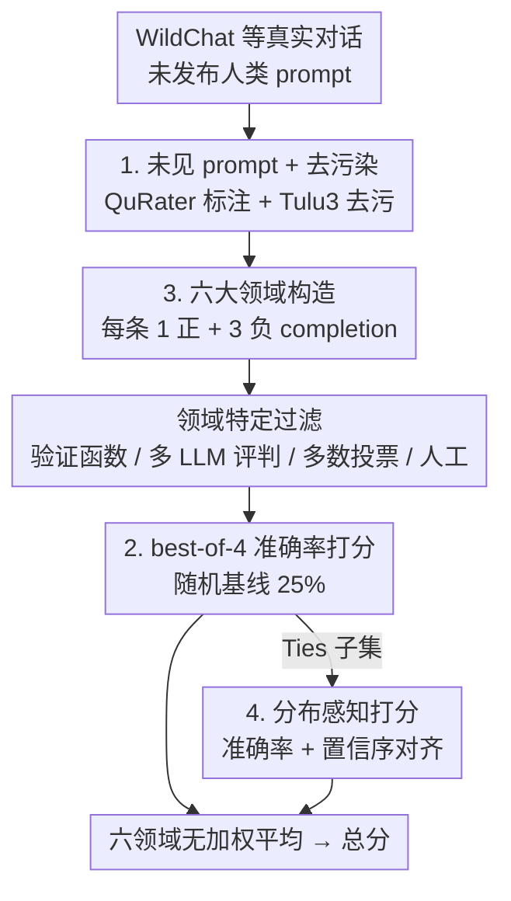

# RewardBench 2: Advancing Reward Model Evaluation

**会议**: ICLR 2026  
**OpenReview**: [https://openreview.net/forum?id=fb0G86Dewb](https://openreview.net/forum?id=fb0G86Dewb)  
**代码**: 接收后开源（代码 Apache 2.0，数据 ODC-By）  
**领域**: 对齐RLHF  
**关键词**: 奖励模型, 评测基准, best-of-N, RLHF, 下游相关性

## 一句话总结
本文提出 RewardBench 2——一个用全新未见人类 prompt、把"1 选 1"改成"4 选 1（1 正 3 负）"、覆盖 6 大领域（含新增的 Ties / Precise IF / Factuality）的奖励模型评测基准；它比初代 RewardBench 平均难 20 分，且与 best-of-N 采样、PPO 训练等下游用法的相关性显著更强。

## 研究背景与动机

**领域现状**：奖励模型（Reward Model, RM）几乎贯穿语言模型后训练的每个环节——RLHF、在线直接对齐、数据过滤、推理时扩展（best-of-N 采样）都靠它给文本打一个标量分。社区已经开始建立 RM 评测的最佳实践，从测特定技能的 RewardBench、RM-Bench，到测人类偏好一致性的各种基准。

**现有痛点**：评测的"进步"并没有同步反映到 RM 的下游有效性上——很多场景里更简单的直接对齐算法（如 DPO）反而工作得更好。更糟的是，大多数现有 RM 基准**直接复用下游评测里的 prompt**（如直接拿 AlpacaEval、MATH 的题目），这会让"基准分数与下游表现相关"的结论被数据污染所污染：你不知道是真相关，还是因为基准和下游用了同一批题。此外，主流的"1 个 chosen vs 1 个 rejected"二选一格式，随机基线高达 50%，强弱 RM 的差距被压缩，缺少爬坡空间。

**核心矛盾**：一个好的 RM 基准需要同时满足两个被现有工作割裂的诉求——既要**准确度可测**（accuracy-based，避免 LM-as-a-judge 偏好的主观性），又要**与下游真实用法强相关且不被污染**。现有基准要么用 LM 评判的主观偏好，要么复用下游 prompt 导致相关性存疑。

**本文目标**：构造一个新基准，让它（1）足够难、有爬坡空间；（2）用全新、未见过的人类 prompt，与下游评测解耦；（3）覆盖多技能领域；（4）基准分数能真实预测 best-of-N 和 RLHF 的下游表现。

**切入角度**：作者从 WildChat 真实用户对话里捞**从未公开发布过**的人类 prompt，并用去污染工具确保与 20 个主流下游评测零重叠；同时把评测格式从"2 选 1"升级为"4 选 1"，把随机基线从 50% 拉低到 25%。

**核心 idea**：用"未见人类 prompt + 1 正 3 负的 best-of-4 准确率 + 6 个精心构造的领域（含分布感知的 Ties）"重做 RM 评测，让基准既更难又更能预测下游。

## 方法详解

### 整体框架

RewardBench 2 本质上是一套**数据构造 + 打分**的流水线，而非一个模型。它要解决的是"如何造出一批既未被污染、又能区分强弱 RM、还能预测下游的评测样本"。整体分四个阶段串行推进：先从 WildChat 等来源捞**未发布的人类 prompt**，用分类器做质量与领域标注；再针对每个领域用专门的方式生成 completion，刻意构造"1 个对 + 3 个错"；然后用领域特定的验证管线（验证函数 / 多 LLM 评判 / 多数投票 / 人工核验）过滤；最后用 **best-of-4 准确率**打分，六个领域无加权平均得到总分。最终留下 1,865 条 prompt、来自 20 个不同模型或人工撰写的 completion。

### 关键设计

**1. 全新未见的人类 prompt + 严格去污染：让"相关性"可信**

大多数 RM 基准复用下游评测的 prompt，导致"基准与下游相关"可能只是污染的假象。本文约 70% 的 prompt 来自 WildChat 流水线里**从未公开发布**、用户授权的真实查询（表中标 "Human"），其余来自作者手写（"Manual"）或 CoCoNot。作者先攒约 3,000 条目标领域的高质量 prompt，再经人工核验与过滤收敛到最终 1,865 条；并用 QuRater 做质量标注、用主题分类器分领域、用 Tulu 3 去污染工具对照 20 个主流下游评测，确保零重叠。这样一来，第 5 节里"基准分数与下游表现强相关"的结论才不会被"题目重复"解释掉——这是本文相比 RewardBench 等最关键的方法论改进。

**2. best-of-4（1 正 3 负）的准确率评测：拉低随机基线、留出爬坡空间**

主流 RM 评测是"1 个 chosen vs 1 个 rejected"的二选一，随机基线 50%，强弱模型挤在一起难以区分。本文把每条 prompt 配成 **4 个 completion：恰好 1 个正确、3 个错误**，RM 必须从 4 个里挑出唯一正确的那个才算对，随机基线因此从 50% 降到 25%。底层仍是经典的 Bradley-Terry 偏好建模——RM 输出标量 $r(x,y)$，对一对 completion 的偏好概率为

$$p(y_1 \succ y_2 \mid x) = \frac{\exp(r(x,y_1))}{\exp(r(x,y_1)) + \exp(r(x,y_2))}$$

训练用最大似然拟合 $L(\theta,D)=\mathbb{E}_{(x,y_c,y_r)\sim D}\big[\log(1+e^{r_\theta(x,y_r)-r_\theta(x,y_c)})\big]$。更低的随机基线意味着分数有更大的爬坡余量，也让接近随机基线的困难子集（如 Math、Precise IF）的分数更稳健可读——这正是 RewardBench 2 比初代平均难 20 分的结构性原因。

**3. 六大领域的差异化构造：每个领域一套专门的"造错"与验证管线**

基准覆盖 6 个领域，其中 Math / Safety / Focus 是对 RewardBench 同名领域的升级重做，Factuality / Precise IF / Ties 是测现有评测未覆盖能力的全新领域。难点在于"3 个错误 completion"不能随便造，否则太容易被识破、失去区分度，所以每个领域有**专属的生成与验证方式**：Factuality 用"自然回答 + 系统提示诱导模型犯细微事实错误"，再用两个 LLM 独立判"准确/不准确"、双方一致才赋标签；Precise IF 借 IFBench 的约束（如"回答中不出现字母 u"），用**验证函数**自动判是否守约；Math 覆盖中学物理到大学微积分，用**多数投票**初筛再**逐例人工核验**（因为答案抽取很脆）；Safety 基于 CoCoNot 的合规分类与 rubric，用 GPT-4o 判合规、人工核验全部样本；Focus 仿 LLMBar 用 LM 改写 prompt 制造偏题/答非所问的 rejected；Ties 由人工借 AI 辅助构造。这一整套"领域各异、宁可慢也要人工兜底"的构造法，是基准质量与难度的根本保障。

**4. Ties 的分布感知打分：奖励"既答对又不乱表态"**

Ties 是本文新增的领域类型，专门测 RM 在"有多个等价正确答案"时的标定能力——例如"说一个彩虹的颜色"有七个正确答案、无穷个错误答案，一个好的 RM 应该给**任意正确答案都高于任意错误答案**，同时**不在等价正确答案之间表现出过强或武断的偏好**。因此 Ties 不用普通准确率，而是一个加权分数：既看"所有正确答案的分都高于所有错误答案"（正确性），又看"正确与错误答案之间的奖励 margin 是否大于最高分正确答案与最低分正确答案之间的 margin"（即模型对'对错差异'的置信度，要压过它对'正确答案内部差异'的置信度）。这个分布感知的组件呼应了近期关于"RM 脆弱性"和"光看准确率不够、要看分数分布"的研究——它确保在 RLHF 里，朝"正确"优化的信号强于朝"减少正确答案多样性"优化的信号。

## 实验关键数据

### 主实验

作者评测了 100+ 个 RM（既有开源主流模型，也有自己受控训练的新模型）。总体上 RewardBench 2 对当前最强 RM 也很有挑战性，Precise IF、Math、Factuality 三个子集是重灾区。

| 模型 | Average | Factuality | Precise IF | Math | Safety | Focus | Ties |
|------|---------|------------|------------|------|--------|-------|------|
| Skywork-Reward-V2-Llama-3.1-8B | **84.1** | 84.6 | 66.3 | 77.6 | 96.7 | 98.4 | 81.2 |
| LMUnit-qwen2.5-72b* | 82.1 | 87.2 | 54.4 | 72.7 | 91.3 | 96.8 | 90.1 |
| gemini-2.5-pro* | 79.5 | 75.5 | 61.9 | 89.8 | 88.1 | 80.5 | 81.1 |
| claude-opus-4* | 76.5 | 82.7 | 41.9 | 74.9 | 89.5 | 86.2 | 83.7 |
| Skywork-Reward-Llama-3.1-8B | 73.1 | 69.9 | 42.5 | 62.8 | 93.3 | 96.2 | 74.1 |

（* 为 LM-as-a-judge 模型。）顶尖模型在 Precise IF 上普遍低于 40–66%、Math 多在 70% 上下，说明基准留出了充足的爬坡空间。与初代 RewardBench 相比，同一批领先模型在 RewardBench 2 上平均掉 20 分以上。

### 下游相关性与受控训练分析

本文的核心卖点之一是基准分数能预测下游表现。在 113 个 RM 上做 best-of-N 采样（候选数 16，覆盖 GSM8K / MATH / IFEval / AlpacaEval 2 / BBH / PopQA / HumanEval+），基准平均分与下游平均分的 Pearson 相关达 **0.87**。

| 下游用法 | 关键发现 |
|----------|---------|
| best-of-N 采样（113 RM） | 基准均分 vs 下游均分相关 0.87；Factuality 子集相关最高，Math 子集对数学/代码任务信号尤强 |
| PPO 训练（17 RM，Tulu 3 8B SFT 为策略） | 对低分 RM 能提供粗信号；但对"还不错"的 RM（RB2 分 49.8–68.5）下游很快饱和到与 Tulu 3 8B DPO（60.3）相当 |
| 同源 vs 异源（on-policy vs off-policy） | RM 与策略模型**同一血统/同分布**时 PPO 表现好；血统或训练 prompt 分布错配时下游显著下降 |

### 关键发现
- **不能只挑"基准最高分"的 RM 做 RLHF**：PPO 下游表现强依赖训练设置——RM 必须与策略模型同血统，否则即使基准分高，下游也可能大幅退化（off-policy 的星点明显低于 on-policy 的圆点）。
- **训练数据各有所长**：Skywork 数据对 Focus / Safety 特别有效，Tulu 数据对 Factuality 更好，两者混合在所有基座上都优于单用其一。
- **多 epoch 不一定有害**：与"RM 只训 1 epoch 防过拟合"的惯例相反，本文发现训超过 1 epoch 有时能涨点（18 个最佳模型里 8 个训了 2 epoch），且不必然损害下游。
- **后训练阶段会"遗传"给 RM**：同样基于 Llama 3.1 8B Base，Tulu 3 8B 与 Llama 3.1 8B Instruct 基座训出的 RM 能力不同——后训练赋予的能力会带到 RM 上。

## 亮点与洞察
- **"4 选 1"是个小而关键的格式改动**：把随机基线从 50% 拉到 25%，几乎不增加构造成本，却显著增大了强弱 RM 的可分辨度和爬坡空间——这种"改评测格式而非改模型"的思路可迁移到任何挤在高分区的分类型基准。
- **用未发布 prompt + 去污染来正本清源**：相关性研究最怕污染，本文用"WildChat 未公开 prompt + Tulu3 去污对照 20 个下游评测"把这个隐患从根上堵住，让"基准能预测下游"的结论可信，这是方法论层面最值得借鉴的一点。
- **Ties 这个新领域抓住了被忽视的标定问题**：现有评测只问"对不对"，Ties 进一步问"面对多个等价正确答案时会不会乱表态"，并用分布感知打分把它量化——这对真实部署（不希望 RM 在等价答案间制造无谓偏好）很有现实意义。
- **"基准高分 ≠ RLHF 好"是反直觉但实用的结论**：它提醒从业者选 RM 时要考虑与策略模型的血统/分布匹配，而不是无脑挑榜单第一。

## 局限与展望
- **PPO 信号饱和**：基准只对低分 RM 段能预测 PPO 表现，对"还不错"的 RM 下游迅速饱和，说明准确率型基准对 RLHF 的预测力天然有限（与 Ivison et al. 的发现一致）。
- **构造重度依赖人工**：Math、Safety、Ties 等领域都需逐例人工核验，规模化与可复现性受限；Ties 仅 102 条，样本偏少。
- **PPO 实验受 tokenizer 限制**：只评了与 Tulu 8B SFT 同 tokenizer 的 RM，异 tokenizer 的跨血统情形未充分覆盖。
- **改进方向**：Focus / Ties 与现有下游评测相关性偏低，部分是因为下游评测本身没覆盖这些技能——未来可补齐能直接测这些能力的下游任务，让相关性分析更完整。

## 相关工作与启发
- **vs RewardBench（初代）**: 都做准确率型 RM 评测，但初代用 2 选 1、随机基线 50%、prompt 多复用下游；本文用 4 选 1、25% 基线、未见人类 prompt + 去污染，平均难 20 分且下游相关性更可信。
- **vs PPE (Frick et al.)**: PPE 也关注下游相关性，但其 Human Pref. 分支用人类/LM 偏好（主观），Correctness 分支仍复用既有 prompt；本文坚持 accuracy-based 且全用未见 prompt，规避了偏好主观性与污染。
- **vs RM-Bench / RMB**: 同为多技能 RM 基准，但本文新增 Factuality / Precise IF / Ties 三个现有评测未覆盖的领域，并系统量化了与 best-of-N、PPO 的相关性。

## 评分
- 新颖性: ⭐⭐⭐⭐ 基准本身是工程集成，但"未见 prompt + 4 选 1 + Ties 分布感知打分"组合与系统的下游相关性分析有实质新意。
- 实验充分度: ⭐⭐⭐⭐⭐ 评了 100+ RM，覆盖 best-of-N（113 RM）与 PPO（17 RM）两大下游，还做了受控训练消融。
- 写作质量: ⭐⭐⭐⭐ 构造决策与发现交代清晰，但领域构造细节较碎、需对照附录。
- 价值: ⭐⭐⭐⭐⭐ 提供了一个更难、更可信、与下游强相关的 RM 评测标准，对后训练社区是即用型基础设施。

<!-- RELATED:START -->

## 相关论文

- [\[ICLR 2026\] Reward Model Routing in Alignment](reward_model_routing_in_alignment.md)
- [\[ACL 2025\] Rethinking Reward Model Evaluation Through the Lens of Reward Overoptimization](../../ACL2025/llm_alignment/rethinking_reward_model_evaluation_through_the_lens_of_reward_overoptimization.md)
- [\[ACL 2026\] P-Check: Advancing Personalized Reward Model via Learning to Generate Dynamic Checklist](../../ACL2026/llm_alignment/p-check_advancing_personalized_reward_model_via_learning_to_generate_dynamic_che.md)
- [\[ICLR 2026\] Omni-Reward: Towards Generalist Omni-Modal Reward Modeling with Free-Form Preferences](omni-reward_towards_generalist_omni-modal_reward_modeling_with_free-form_prefere.md)
- [\[ICLR 2026\] Robust Reward Modeling via Causal Rubrics](robust_reward_modeling_via_causal_rubrics.md)

<!-- RELATED:END -->
