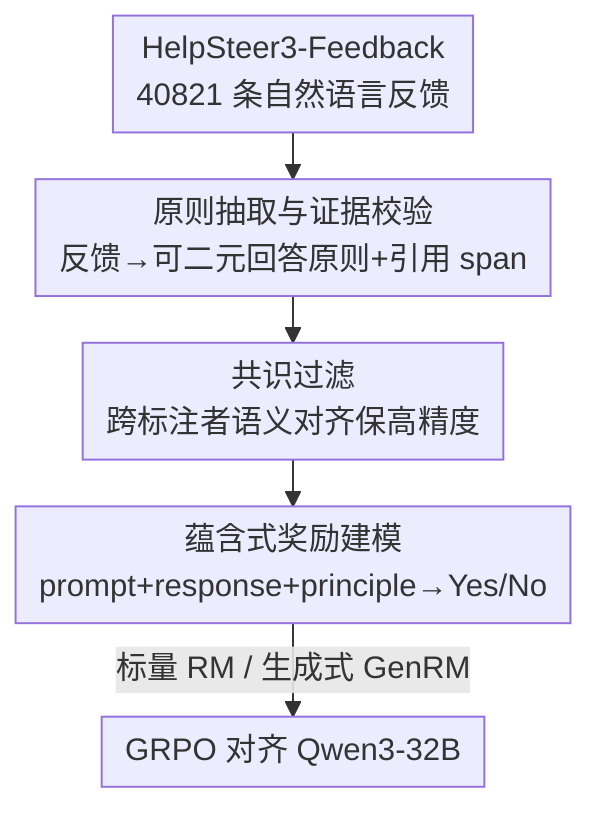

# RLBFF: Binary Flexible Feedback to Bridge Between Human Feedback & Verifiable Rewards

**会议**: ICLR 2026  
**OpenReview**: [https://openreview.net/forum?id=P3R3S6S5Km](https://openreview.net/forum?id=P3R3S6S5Km)  
**代码**: https://huggingface.co/collections/nvidia/reward-models-10-2025 (模型与数据开源)  
**领域**: 对齐RLHF  
**关键词**: 奖励模型, RLHF, 可验证奖励, 二元原则, 蕴含判断

## 一句话总结
本文提出 RLBFF（Reinforcement Learning with Binary Flexible Feedback），从自然语言反馈里抽取「可二元回答的原则」（如「信息准确性：是」「代码可读性：否」），把奖励模型训练改造成「回答是否满足某条原则」的蕴含判断，从而兼得 RLHF 的广覆盖和 RLVR 的可解释/抗 reward hacking；训练出的标量奖励模型在 RM-Bench（83.6）、JudgeBench（76.3）上超过同数据的 Bradley-Terry 模型，GenRM 进一步把 RM-Bench/JudgeBench 推到 86.2/81.4（榜首），并用它把 Qwen3-32B 对齐到媲美 o3-mini/DeepSeek R1 的水平、推理成本不到对手 5%。

## 研究背景与动机
**领域现状**：当下 LLM 后训练的两大 RL 范式是 RLHF（用人类偏好训练 Bradley-Terry 奖励模型）和 RLVR（用规则验证器给二元正确/错误奖励）。新一代开源模型往往两者并用，因为它们各有所长。

**现有痛点**：RLHF 依赖「响应 A 比 B 好」的偏好，但人类判断背后的标准是隐式的——训练出的 BT 模型分数（如 -14.5）只能在同一 prompt 内部相对比较、跨 prompt 不可校准，而且是黑箱、给不出「为什么这个分」的解释，还容易 reward hacking（精度低：把长度、迎合用户立场等无关特征当成质量）。RLVR 虽然可解释、精度高，但只覆盖「正确性可机械验证」的窄场景（数学单一答案、竞赛代码），且召回低——会把「3 小时 vs 180 分钟」这类等价正确答案误判为错。

**核心矛盾**：广覆盖（human feedback 的优势）和可解释+高精度（verifiable rewards 的优势）之间存在割裂，没有一种信号同时占齐「广覆盖 / 可解释 / 高精度 / 高召回」四项。

**本文目标**：设计一种反馈信号，既能像人类反馈那样覆盖任意质量维度，又像可验证奖励那样可解释、抗 hacking。

**切入角度**：作者注意到 RLVR 的二元奖励和 KTO 的「好/坏」标注是同构的，但 KTO 没说清「好在哪条标准上」。如果把判断显式地绑定到一条**原则**（principle，即一个可二元评判的评价轴），就能既保留二元信号的精确，又让标准变得透明、可指定。

**核心 idea**：把奖励建模从「A 优于 B 的偏好排序」改成「给定 prompt + response + principle，判断 response 是否满足该 principle」的二元蕴含任务——用「带原则的二元判断」替代「无标准的偏好对比」。

## 方法详解

### 整体框架
RLBFF 的核心是把人类的自然语言反馈「翻译」成一堆可二元回答的原则，再用这些 (prompt, response, principle) → Yes/No 三元组训练奖励模型，最后用奖励模型做 RL 对齐。整条管线分三段：**数据构建**（从 HelpSteer3-Feedback 反馈里抽原则、过滤、取标注者共识）→ **奖励建模**（用三元组训练标量 RM 或生成式 GenRM，奖励 = $\log p(\text{Yes}) - \log p(\text{No})$）→ **模型对齐**（用 GenRM 当奖励，GRPO 训练 Qwen3-32B）。其中数据构建里的「过滤」和「共识」两步决定了原则的质量，是本文最吃功夫的地方。

### 关键设计

**1. 把反馈拆成「可二元回答的原则」：用蕴含判断替代偏好对比**

这一步直接针对 RLHF「标准隐式、不可解释」的痛点。作者把 principle 定义为「一个可以二元评判响应的评价轴」，不预先固定原则清单，而是用 DeepSeek-V3-0324 对每条人类反馈零样本地抽取出若干 (原则, Yes/No) 对（例如反馈里夸「修对了用户要的那一行」就抽出「遵循用户要求：是」，吐槽「没有行内注释」就抽出「包含行内注释：否」）。三处设计选择都很务实：用**原则**而非笼统好坏，是因为人喜欢一条回答的理由各不相同（Reddit 上最高赞可能是最好笑而非最正确，StackExchange-Math 上最高赞才是最正确），不点明原则会让优化目标模糊；用**单响应**而非响应对，是因为现实里人写反馈大多针对单个对象本身（点评一家餐厅很少显式地拿 A 比 B），且响应对易受位置偏置；用**二元**而非 Likert，是因为多档评分跨标注者难以校准（谁的 3 分该是别人的 4 分说不清），二元化「简洁 vs 不简洁」能压掉这种标注分歧。抽取时**要求模型先引用反馈里的支持性文本片段再判断**，并用 RapidFuzz 字符串匹配（`partial_ratio > 60`）剔除引不到原文的片段（去掉 2.2%），这一证据-引用机制把幻觉压到比纯合成原则低得多。

**2. 共识过滤：用高精度低召回换取「不在错标准上训练」**

抽出来的原始原则有 120 万条，但单个标注者的视角可能主观、偏离共识。难点在于原则是自由文本，没法像 HelpSteer2 那样对数值评分直接算一致性——不同标注者会用不同词表达同一意思（correctness / accuracy / accuracy of information）。作者用 MTEB 榜首的 Qwen-3-8B Embedding 把原则向量化，**只保留那些「其余每个标注者都至少有一条 cosine 相似度 > 0.8 的原则」与之对应**的项（0.8 阈值经 0.7/0.8/0.9 抽检选定，能匹配近义词又不要求逐字相同）。这是整条管线里最严格的过滤器：120 万 → 约 10 万（跨 3 标注者）≈ 3.3 万条「独立含义」原则，平均每条反馈只剩 $1.27 \pm 0.543$ 条原则。作者刻意选**高精度、低召回**——宁可滤掉一些正确原则，也要防止在被误设的标准上训练。此外还专门剔除了「helpfulness」原则（它是对响应的全局质量评价、不是某条具体原则，且 HelpSteer3 里所有反馈都以「The response is ... helpful」开头，是个数据 artifact，占 4.5%）和「部分满足」的原则（自然语言说不清 partial 到底是 10% 还是 90%，仅占 13.8%，删掉后剩下 64.6% yes / 35.4% no）。一次 126 样本的人工核验显示抽取原则与多数标注者一致率达 88.9%（Fleiss' κ=0.447，中等一致）。

**3. 单 token 标量 RM + 推理时可指定原则：极致高效又可定制**

奖励建模把上面三元组喂给模型，训练它在给定 (prompt, response, principle) 时输出 Yes 或 No，推理时奖励定义为 $r = \log p(\text{Yes}) - \log p(\text{No})$。**标量 RM**（Flexible Principles，基座 Llama-3.3-70B-Instruct）只需生成 1 个 token 的算力就能打分，<0.1 秒/任务，且对数概率差还顺带给出「满足该原则的置信度」。它的关键价值在于：这是**第一个允许用户在推理时指定任意原则来 ground 打分的标量 RM**——此前能按用户原则打分的（RewardAnything、R3）都是要生成上千 token 的推理式 GenRM，慢 100 倍以上。作者也训了一个**生成式 GenRM**（基座 Qwen3-32B，GRPO 训练，先逐步推理再给 Yes/No），它在需要逐步推理的复杂任务上更强、把 RM-Bench/JudgeBench 推到更高，但慢约两个数量级，故只在最佳标量配方上训一个。由于按单个响应独立打分，这套设计天然规避了成对 GenRM 的位置偏置（实验显示基线 GenRM 在 JudgeBench 上 chosen-first 77.1、rejected-first 骤降到 65.1、双序一致仅 62.6）。

**4. 用 GenRM 当奖励做 GRPO 对齐：把原则信号灌进策略模型**

最后一步验证 RLBFF 不只是会评分、还能把模型练好。在 Qwen3-32B 上用 GRPO 做 RL：策略模型在给定对话上下文（以用户问题结尾）时生成多个候选响应，且**策略本身并不知道当前的判分原则**；GenRM 则按该训练样本绑定的原则评估这些响应，策略被训练去最大化 $\log p(\text{Yes}) - \log p(\text{No})$，即生成尽量贴合原则的回答。对照组用 Tab. 2 里的 Bradley-Terry RM 训同一个策略。这一步把「原则」从评测信号变成了驱动策略改进的训练信号，把数据构建里抽出的人类反馈原则真正用到了对齐上。

### 损失函数 / 训练策略
奖励统一定义为 $r = \log p(\text{Yes}) - \log p(\text{No})$，既用于标量 RM 评测，也用于 GenRM 训练/评测以及下游策略的 GRPO 优化。标量 RM 直接监督模型在 (prompt, response, principle) 下输出 Yes/No 单 token；GenRM 用 GRPO 训练「先推理后判断」；对齐阶段同样用 GRPO，以 GenRM 给出的 $r$ 作为奖励信号。

## 实验关键数据

### 主实验（奖励模型质量）

| 模型 | RM-Bench Overall | JudgeBench Overall | PrincipleBench Overall | 速度 |
|------|------|------|------|------|
| **Flexible Principles ScalarRM**（本文） | **83.6** | **76.3** | **91.6** | <0.1 s/任务 |
| Bradley-Terry（同数据） | 78.5 | 68.9 | 89.5 | <0.1 s/任务 |
| Llama-3.3-Nemotron-70B-Reward | 79.9 | 73.7 | 89.7 | <0.1 s/任务 |
| **Flexible Principles GenRM**（本文） | **86.2** | **81.4** | 83.8 | >10 s/任务 |
| Llama-3.3-Nemotron-Super-49B-GenRM | 82.7 | 75.1 | 82.1 | >10 s/任务 |
| RM-R1-DeepSeek-Distilled-Qwen-32B | 83.9 | 66.0 | 73.9 | >10 s/任务 |
| R3-QWEN3-14B-LORA-4K | 84.9 | 60.9 | 67.2 | >10 s/任务 |

标量 RM 在同数据下全面超过 Bradley-Terry；GenRM 把 RM-Bench/JudgeBench 进一步推到 86.2/81.4，JudgeBench 为榜首（截至 2025-09-24，原榜首 80.9）。值得注意的是基线 GenRM 在 RM-Bench 上不弱、却在 JudgeBench 上崩盘（RewardAnything 仅 62.6，低于最差标量 RM），根因是成对评判的位置偏置；本文按单响应打分故无此问题。在 PrincipleBench 上则反过来——标量 RM 全面强于 GenRM，因为 GenRM 多由推理模型初始化，过度关注正确性而忽略可读性、无重复等维度。

### 消融实验

| 配置 | RM-Bench | JudgeBench | 说明 |
|------|---------|-----------|------|
| Group Similarity = 0.8（默认，33k 样本） | 83.6 | 76.3 | 数据量/质量权衡最佳 |
| Group Similarity = 0.7（95k 样本） | 82.8 | 72.3 | 数据多但混入主观原则 |
| Group Similarity = 0.9（11k 样本） | 81.9 | 73.7 | 数据太少 |
| Fixed Principle Train Time | 79.9 | 71.4 | 只用单一固定原则训练 |
| Fixed Principle Test Time | 81.9 | 70.9 | 灵活训练但测试时固定为「信息准确性」 |

### 模型对齐结果

| 模型 | MT-Bench | Arena Hard v2 | WildBench | 推理成本 |
|------|---------|--------------|-----------|---------|
| Qwen3-32B | 9.38 | 44.0 | 67.57 | 1x |
| **+ RLBFF training** | **9.50** | **55.6** | **70.33** | 1x |
| + Baseline BT training | 9.45 | 47.5 | 67.38 | 1x |
| o3-mini | 9.26 | 50.0 | 71.64 | 61x |
| DeepSeek R1 | 9.49 | 57.4 | 64.24 | 25x |

### 关键发现
- **共识阈值是数据质量的总开关**：0.8 把原始 120 万原则压到约 3.3 万，0.7 放宽到 95k 反而掉点（混入主观原则），0.9 收紧到 11k 也掉点（数据太少），0.8 是质量/数量的甜点。
- **训练多原则不伤单原则**：哪怕用户只想用单一原则，灵活训练后再在测试时固定原则（Fixed Principle Test Time）也比一开始只训单原则强（RM-Bench +2.0），印证多任务训练常能反哺单任务。
- **位置偏置是成对 GenRM 的致命伤**：JudgeBench 上双序一致要求把基线 GenRM 从 77.1 拖到 62.6，而本文单响应打分天然免疫，这是它 JudgeBench SOTA 的主因。
- **极致性价比**：RLBFF 对齐后的 Qwen3-32B 在三个对齐基准上媲美甚至超过 o3-mini/R1，推理成本不到对手 5%（按 OpenRouter 报价便宜 24–187 倍）。

## 亮点与洞察
- **「带原则的二元蕴含」是一个优雅的统一视角**：它把 RLVR（原则=正确性）和 KTO（原则未定义）都收编为特例，只是显式补上了「好/坏在哪条标准上」这一信息，一招同时解决可解释性和 reward hacking。
- **证据-引用机制治幻觉**：要求 LLM 先引原文片段再判断、并用模糊匹配校验引用真实性，是把「让 LLM 抽标注」从不可信变可信的关键 trick，可迁移到任何「用 LLM 从文本里抽结构化标签」的场景。
- **单 token 标量 RM 是被低估的工程价值**：用对数概率差 $\log p(\text{Yes})-\log p(\text{No})$ 当奖励，既快（<0.1 秒）又自带置信度，还能在推理时换原则——把「可定制打分」从 GenRM 的专利变成标量 RM 也能做的事。
- **PrincipleBench 揭示了被掩盖的维度**：现有 RM 基准几乎只测正确性，GenRM 在 PrincipleBench 上反被标量 RM 压制，说明「推理模型初始化」会让奖励模型过度关注逻辑正确而忽视可读性、无重复等质量轴。

## 局限与展望
- **依赖单一高质量反馈数据集**：整套原则全靠 HelpSteer3-Feedback 反推，作者一开始想找现成的二元原则数据「without success」，方法的可复制性受限于是否有同等质量的段落级人类反馈。
- **高精度低召回的代价**：共识过滤把 120 万原则砍到 3.3 万、每条反馈平均只剩 1.27 条原则，必然丢掉不少正确原则；这套保守策略在反馈数据本就稀缺时可能不够用。
- **GenRM 的偏科**：生成式 RM 由推理模型初始化，天然过度关注正确性，在非正确性维度（可读性、无重复）上不如标量 RM，说明「会推理」不等于「会全面评判质量」。
- **二元化丢失程度信息**：删掉 13.8% 的「部分满足」原则虽简化了标注，但对那些本质上连续的质量维度（如简洁程度）是有损的。

## 相关工作与启发
- **vs Bradley-Terry / RLHF**：BT 学「A 优于 B」的偏好，分数不跨 prompt 校准且是黑箱；本文学「response 是否满足某原则」的二元蕴含，分数可解释、可指定原则，同数据下 RM-Bench/JudgeBench 全面更高。
- **vs RLVR（可验证奖励）**：RLVR 只用「正确性」一条原则、覆盖窄且对等价正确答案召回低；RLBFF 把原则泛化到 1000+ 条细粒度评价轴，覆盖远更广，并靠在「已预训练能识别等价答案」的 LLM 上训练来缓解低召回。
- **vs 自生成 rubric 的 GenRM（DeepSeek-GRM / RM-R1）**：它们先合成评分标准再打分，但标准不可被用户控制、推理时无法换原则；本文原则直接来自人类反馈、且推理时可由用户指定。
- **vs 原则跟随式 GenRM（RewardAnything / R3 / LMUnit）**：它们多用人工策划或合成的几百条标准 + Likert 打分、且都是慢速推理式 GenRM；本文原则规模 1000+、直接源自人写反馈、保持二元 yes/no，并能用单 token 标量 RM 实现同等或更好性能。

## 评分
- 新颖性: ⭐⭐⭐⭐⭐ 「带原则的二元蕴含」把 RLHF 与 RLVR 统一起来，视角清晰且填补了奖励建模的真实空白。
- 实验充分度: ⭐⭐⭐⭐⭐ 三个 RM 基准 + 自建 PrincipleBench + 完整对齐实验 + 共识阈值/固定原则消融，证据链完整。
- 写作质量: ⭐⭐⭐⭐⭐ 动机推导（四象限对比表）和设计选择（why principle/single/binary）讲得透彻易懂。
- 价值: ⭐⭐⭐⭐⭐ 全开源配方（含数据），把 Qwen3-32B 对齐到媲美 o3-mini/R1、成本不到 5%，实用价值极高。

<!-- RELATED:START -->

## 相关论文

- [\[ICLR 2026\] Beyond Binary Preferences: A Principled Framework for Reward Modeling with Ordinal Feedback](beyond_binary_preferences_a_principled_framework_for_reward_modeling_with_ordina.md)
- [\[ICLR 2026\] What's In My Human Feedback? Learning Interpretable Descriptions of Preference Data](whats_in_my_human_feedback_learning_interpretable_descriptions_of_preference_dat.md)
- [\[ICLR 2026\] Stackelberg Learning from Human Feedback: Preference Optimization as a Sequential Game](stackelberg_learning_from_human_feedback_preference_optimization_as_a_sequential.md)
- [\[NeurIPS 2025\] Strategyproof Reinforcement Learning from Human Feedback](../../NeurIPS2025/llm_alignment/strategyproof_reinforcement_learning_from_human_feedback.md)
- [\[ICML 2026\] Simultaneous Multi-objective Alignment Across Verifiable and Non-verifiable Rewards](../../ICML2026/llm_alignment/simultaneous_multi-objective_alignment_across_verifiable_and_non-verifiable_rewa.md)

<!-- RELATED:END -->
