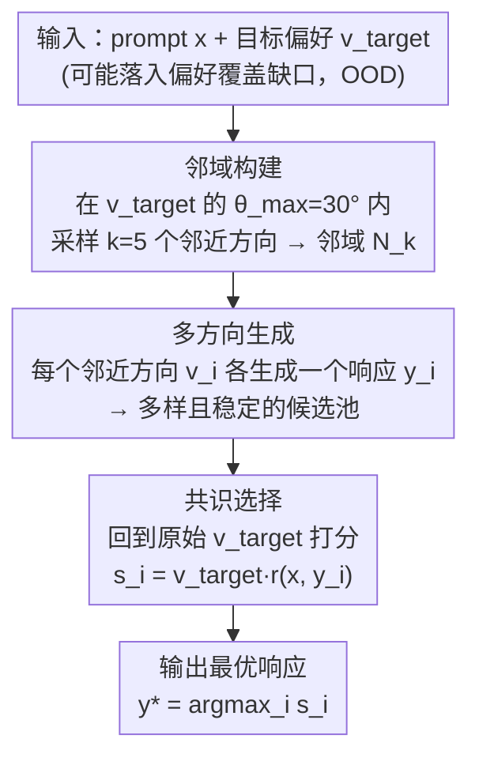

# Robust Preference Alignment via Directional Neighborhood Consensus

**会议**: ICLR 2026  
**arXiv**: [2510.20498](https://arxiv.org/abs/2510.20498)  
**代码**: [rcmao/robust-preference-alignment](https://github.com/rcmao/robust-preference-alignment)  
**领域**: 信号通信  
**关键词**: 偏好对齐, 鲁棒性, 推理时调整, 方向性邻域共识, 分布外偏好

## 一句话总结
提出Robust Preference Selection (RPS)，一种无需重训练的推理时偏好对齐增强方法，通过从目标偏好的局部邻域采样多个候选方向并生成响应、再根据原始偏好选择最优响应，在OOD偏好上相比基线达到最高69%的胜率。

## 研究背景与动机

将大语言模型（LLM）与人类偏好对齐是构建可靠可控AI系统的关键。用户偏好可以建模为多维空间中的方向向量，不同维度代表不同属性（如有用性 vs. 冗长度）之间的权衡。现有的偏好对齐方法（RLHF、DPO、DPA等）通常针对训练数据中占主导的"平均"偏好进行优化。

**核心痛点**：训练数据的偏好覆盖范围有限，集中在狭窄区域（偏好覆盖缺口，Preference Coverage Gap）。当用户的真实偏好偏离训练分布的集中趋势时（即OOD偏好），模型性能会不可预测地下降。这是一个根本性的分布外（OOD）挑战。

**现有方案的不足**：
1. 训练时方法（如数据增强、分布鲁棒优化DRO）需要昂贵的重训练过程，且可能仍无法泛化到完整的偏好谱
2. 推理时方法（如token级引导、激活引导）需要直接操纵模型内部状态或引入辅助模型

**切入角度**：作者提出了一个关键洞察——**与其强迫模型从一个特定的、不常见的偏好方向直接生成响应（这本质上是脆弱的），不如探索该偏好的局部邻域，从更可靠的邻近方向生成候选响应池，再选出最符合原始偏好的响应。** 这一范式从"直接生成"转变为"邻域共识选择"。

## 方法详解

### 整体框架

RPS（Robust Preference Selection）要解决的是「用户真实偏好落在训练没覆盖到的方向上、模型直接生成就崩」这个 OOD 难题，整个方法是一条纯推理时、不碰模型参数的三阶段流水线。给定用户 prompt $x$ 和一个可能落在覆盖缺口里的目标偏好向量 $\mathbf{v}_{target}$，它不把这个脆弱方向直接喂给模型，而是先在 $\mathbf{v}_{target}$ 的角度邻域里采样 $k$ 个更靠近训练密集区的邻近方向，让模型各生成一个响应、凑成一个既多样又稳定的候选池；最后再回到原始 $\mathbf{v}_{target}$ 给每个候选打分、挑出最忠实于用户真实意图的那一个输出。一句话概括：生成阶段「换方向」换稳定性，选择阶段「认目标」保忠实，二者解耦。

其中「偏好覆盖缺口」与打分用的「投影奖励」是贯穿全流程的两个基础概念，下面先把它们形式化，再依次展开三个阶段。

### 关键设计

**1. 偏好空间与覆盖缺口的形式化：把"OOD 偏好"讲清楚**

用户偏好被建模为单位圆上的归一化方向向量 $\mathbf{v} = (\cos\theta, \sin\theta)$，角度 $\theta$ 参数化了有用性与冗长度两个属性之间的权衡；奖励模型把 prompt-response 对映射为奖励向量 $\mathbf{r}(x,y) = (r_h(x,y), r_v(x,y))$，对齐质量则用投影奖励 $\mathbf{v}_{target}^T \mathbf{r}(x,y)$ 衡量（论文采用 RewardModel-Mistral-7B-for-DPA-v1 作为奖励模型）。在这个坐标系下，作者把完整偏好谱 $\mathcal{V}_{user}$ 与训练实际覆盖的偏好子集 $\mathcal{V}_{train}$ 的差集定义为**偏好覆盖缺口（Preference Coverage Gap）**：当 $\mathbf{v}_{target}$ 落入这个缺口，模型从未在该方向充分训练，输出质量便不可预测地下降——这正是 RPS 要解决的 OOD 病灶。

**2. 邻域构建：用熟悉方向替代脆弱方向**

RPS 不直接把可能脆弱的 $\mathbf{v}_{target}$ 喂给模型生成，而是在其角度阈值 $\theta_{max}$ 范围内采样 $k$ 个邻近偏好方向，组成局部邻域 $\mathcal{N}_k$（实验中取 $\theta_{max}=30°$、$k=5$）。这些邻近方向更靠近训练分布的密集区，模型在它们上的表现远比在原始 OOD 方向上稳定，从而把"在缺口里硬采"换成"在缺口边缘多点采"。

**3. 多方向生成：把单点采样升级为方向多样的候选池**

对邻域中每个偏好向量 $\mathbf{v}_i$，让 LLM 各生成一个独立响应 $y_i$。由于每个 $\mathbf{v}_i$ 编码了略有差异的属性权衡，得到的 $k$ 个响应在"有用性 vs 冗长度"上各有侧重，却都来自模型表现可靠的区域，因此整体是一个既多样又高质量的候选池——这与从同一目标方向重复采样的基线在计算量上严格对等，区别只在候选的方向来源。

**4. 共识选择：生成用邻域、评估用目标**

候选生成完后，RPS 回到**原始目标偏好** $\mathbf{v}_{target}$ 给每个候选打分 $s_i = \mathbf{v}_{target}^T \mathbf{r}(x,y_i)$，取得分最高者作为最终输出 $y^*$。这一步是整个方法的关键解耦：生成阶段借邻近方向换取稳定性，选择阶段则用目标方向保证输出忠实于用户真实意图，二者互不妥协。作者进一步在 OOD 性能退化假设（Assumption 1）下证明（Theorem 1），RPS 的候选池在随机一阶占优意义上优于基线，故 $\mathbb{E}[\max(S_{RPS})] > \mathbb{E}[\max(S_{Baseline})]$，且鲁棒性增益随邻域大小 $k$ 与邻域-目标质量差距的增大而放大。

### 损失函数 / 训练策略

RPS 是完全的推理时方法（training-free），不涉及任何训练或微调，作为后处理（post-hoc）技术即插即用于任何已对齐的偏好模型。

## 实验关键数据

### 主实验
3×3实验矩阵：3种模型 × 3种数据集，所有配对均超过50%基线胜率。

| 模型 | 数据集 | RPS胜率 | 说明 |
|------|--------|---------|------|
| DPA (DPA-v1-Mistral-7B) | UltraFeedback | ~60% | 最强OOD增益 |
| DPA | HelpSteer | ~60% | 一致优势 |
| DPA | HelpSteer2 | ~61% | 一致优势 |
| DPO (Zephyr-7B-Beta) | UltraFeedback | ~52% | 稳定但温和 |
| DPO | HelpSteer | ~53% | DPO已有内在鲁棒性 |
| DPO | HelpSteer2 | ~54% | 改进温和 |
| SFT (Mistral-7B-Instruct-v0.2) | UltraFeedback | 52% | 最低改进 |
| SFT | HelpSteer | ~57% | 较好改进 |
| SFT | HelpSteer2 | 67.3% | 最大改进——SFT最受益 |

### 方向鲁棒性（偏好角度 vs 胜率）

| 偏好方向 | DPA/UltraFeedback | DPA/HelpSteer | SFT/HelpSteer2 |
|----------|-------------------|---------------|-----------------|
| v1 (10°) | 55.1% | 56.1% | 52.1% |
| v3 (20°) | 53.4% | 58.0% | 58.9% |
| v5 (30°) | 59.3% | 60.2% | 66.7% |
| v7 (40°) | 64.9% | 62.8% | 83.2% |
| v8 (45°) | 69.1% | 64.3% | 94.3% |

### 消融实验

| 配置 | 关键指标 | 说明 |
|------|---------|------|
| k=5 (邻域大小) | 基准方案 | 与基线计算量严格对等 |
| θ_max=30° (角度阈值) | 最佳平衡点 | 太小→多样性不足，太大→偏离目标 |

### 关键发现
- RPS在所有9个模型-数据集对上均超过50%基线胜率，证明邻域共识是广泛有效的后处理增强
- **RPS的优势随偏好角度增大（更OOD）而显著放大**：DPA在45°时达到69.1%，SFT在HelpSteer2上45°时达到94.3%
- 不同训练范式受益程度不同：SFT最受益（缺乏显式偏好训练），DPO相对稳健（已有内在鲁棒性），DPA在OOD方向改进最显著
- 定性分析显示RPS生成的响应更详细、更有针对性，更好匹配用户意图

## 亮点与洞察
- **范式转换**：从"直接生成"到"邻域采样+选择"的推理时范式转变，思路清晰有力
- **理论扎实**：基于随机一阶占优的理论框架优雅地证明了方法的优越性
- **零成本部署**：纯推理时方法，无需重训练，模型无关，即插即用
- **计算对等**：RPS和基线生成相同数量的候选，唯一区别是候选的偏好方向来源不同
- **洞察深刻**：揭示了偏好对齐中的OOD问题，并量化了"偏好覆盖缺口"的影响
- **SFT模型获益最大**：暗示RPS可以作为一种有效的推理时偏好引导机制，替代昂贵的RLHF训练

## 局限与展望
- 偏好空间仅限2维（有用性和冗长度），未验证在更高维偏好空间中的表现
- 需要可用的奖励模型来评估候选，增加了推理开销
- k=5意味着5倍的推理成本（生成5个响应），在延迟敏感场景中可能不可接受
- 邻域大小k和角度阈值θ_max的选择依赖先验知识，缺乏自适应调整机制
- 理论框架依赖Assumption 1（邻近方向的模型表现更好），虽然合理但在极端OOD情况下可能不成立
- 未与其他推理时对齐方法（如activation steering、ARGS等）进行直接对比
- GPT-4o-mini作为评判模型的局限性——模型评判本身可能有偏差

## 相关工作与启发
- **DPA (Directional Preference Alignment)**：本文建立在DPA的多维偏好空间形式化之上
- **Self-Consistency (Wang et al., 2022)**：通过采样多条推理路径并聚合共识来提高可靠性，与RPS的邻域共识思想异曲同工
- **DRO (Distributionally Robust Optimization)**：训练时的鲁棒优化方法，RPS提供了互补的推理时方案
- **Best-of-N Sampling**：RPS可以看作是Best-of-N的方向性推广——不是从同一方向重复采样，而是从不同方向各采一次
- 启发：邻域共识的思想可以推广到其他条件生成任务（如图像风格控制、音乐生成等）中的OOD条件处理

## 评分
- 新颖性: ⭐⭐⭐⭐ （思路清晰但本质是Best-of-N的巧妙推广）
- 实验充分度: ⭐⭐⭐⭐ （3×3矩阵+多角度分析+定性案例）
- 写作质量: ⭐⭐⭐⭐⭐ （形式化清晰，可视化直观，理论与实验紧密结合）
- 价值: ⭐⭐⭐⭐ （即插即用的推理时增强，实用价值高）

<!-- RELATED:START -->

## 相关论文

- [\[ICLR 2026\] RE-PO: Robust Enhanced Policy Optimization as a General Framework for LLM Alignment](re-po_robust_enhanced_policy_optimization_as_a_general_framework_for_llm_alignme.md)
- [\[AAAI 2026\] Differentiated Directional Intervention: A Framework for Evading LLM Safety Alignment](../../AAAI2026/llm_alignment/differentiated_directional_intervention_a_framework_for_evading_llm_safety_align.md)
- [\[ICLR 2026\] Robust Reward Modeling via Causal Rubrics](robust_reward_modeling_via_causal_rubrics.md)
- [\[ICLR 2026\] When Weak LLMs Speak with Confidence, Preference Alignment Gets Stronger](when_weak_llms_speak_with_confidence_preference_alignment_gets_stronger.md)
- [\[ICLR 2026\] Towards Self-Robust LLMs: Intrinsic Prompt Noise Resistance via CoIPO](towards_self-robust_llms_intrinsic_prompt_noise_resistance_via_coipo.md)

<!-- RELATED:END -->
