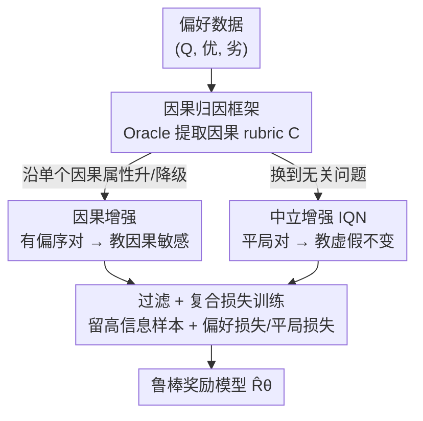

# Robust Reward Modeling via Causal Rubrics

**会议**: ICLR 2026  
**OpenReview**: [https://openreview.net/forum?id=oP99JQiDYp](https://openreview.net/forum?id=oP99JQiDYp)  
**代码**: 无  
**领域**: 对齐RLHF / 奖励建模 / 因果推断  
**关键词**: 奖励模型, 奖励黑客, 因果属性, 反事实增强, RLHF

## 一句话总结
针对奖励模型容易抓住长度、格式等虚假特征作弊的问题，CROME 让 Oracle LLM 先为每个问题列出真正决定质量的「因果 rubric」，再围绕这些 rubric 合成两类反事实数据——沿单个因果属性升/降级的「因果增强」和把答案对配到无关问题上的「中立增强」，配合复合损失训练，使奖励模型对因果属性敏感、对未知虚假属性不变，在 RewardBench 上平均提升 5.3%（安全 +12.4%、推理 +7.1%）。

## 研究背景与动机
**领域现状**：RLHF 是对齐大模型的主流范式，其核心是先用人类偏好对训练一个奖励模型（RM），再用 RM 的打分去指导策略优化（DPO / PPO / Best-of-N）。RM 的好坏直接决定对齐质量——它的缺陷会原封不动地传导到最终策略上。

**现有痛点**：标准 RM 普遍存在「奖励黑客（reward hacking）」。由于训练数据里被偏好的回答常常恰好更长、格式更花哨、语气更讨好，RM 会把这些**表面/虚假特征**（length、formatting、sycophancy）误当成质量的来源，给它们高分。标准的 Bradley-Terry 偏好损失并不约束 RM「只依赖真正的质量驱动因素」，于是学出来的 RM 很脆，被策略一优化就专挑这些虚假捷径。

**核心矛盾**：质量的真正驱动因素（事实性、相关性等「因果属性」）和虚假相关因素（长度、风格等）在数据里是**纠缠**的；而虚假属性本身**既高维又未知**——你根本不知道 RM 会去钻哪个空子。已有的鲁棒化方法要么只针对**预先指定**的虚假因素（如专门压长度偏置）做正则，会漏掉未列出的；要么用粗粒度的非上下文增强（如 RRM），不能精细隔离因果与虚假。

**本文目标**：在两个苛刻约束下训鲁棒 RM——(a) RM 可能利用的具体虚假属性**未知**、不能直接对它们做干预；(b) 只能访问到稳定的、不变的**因果属性**（来自人类偏好的真实质量维度）。

**切入角度**：作者引入一个显式的因果图：真实奖励 $R^*$ 只由问题 $Q$ 和答案的因果属性 $C(A)$ 决定，且在给定 $C(A)$、$Q$ 时与虚假属性独立，即 $R^* \perp SP(A)\mid C(A),Q$；而 $(Q, C(A))\to R^*$ 这条关系是**稳定/不变**的，涉及 $SP(A)$ 的相关性则可能随标注者/生成器变化而漂移。既然真信号在因果属性上、且只有因果属性可访问，那就**只沿因果属性做干预**。

**核心 idea**：让 Oracle LLM 为每个 prompt 显式列出因果 rubric，然后**只围绕这些因果属性合成反事实**——沿因果属性造对比对来教「敏感」，把答案换到无关问题上造平局对来教「不变」——从而在完全不知道虚假属性是什么的前提下，把奖励对虚假特征的依赖压下去。

## 方法详解

### 整体框架
CROME（Causally Robust Reward Modeling）是一个**数据增强 + 损失改造**的训练框架，不改 RM 架构，可套在任意基座（PairPM 或 Bradley-Terry）上。它要解决的核心问题是：在不知道虚假属性是什么的情况下，让 RM 只依赖真正决定质量的因果属性。整条流水线这样转：先对每个问题 $Q$ 用 Oracle LLM 提取一小撮「因果 rubric」$C=(C_1,\dots,C_\ell)$（如事实性、相关性、简洁性）；再以这些 rubric 为锚，合成两类反事实数据——**因果增强**（沿单个 $C_j$ 升级或降级答案，生成有明确偏序的对）和**中立增强**（把同一对答案配到一个无关问题上，生成 tie 平局对）；接着用一个 baseline RM 过滤、只留下它「拿不准或答错」的信息量高的样本；最后把原始偏好数据、因果对、中立对合到一起，用一个复合损失训练出鲁棒 RM。

### 关键设计

**1. 因果归因框架：把奖励拆成因果与虚假，只对因果 rubric 下手**

这一步直接回应「虚假属性未知、不能直接干预」这个根本约束。作者先在概念上建一个答案生成的因果图：答案 $A$ 同时含因果属性 $C(A)$（事实性、相关性等真正决定质量的维度）和虚假属性 $SP(A)$（长度、格式等与偏好相关但不决定质量的特征），且通常 $\dim(C(A)) \ll \dim(SP(A))$、$SP(A)$ 未知。真实奖励满足 $R^*(Q,A)=f^*(Q,C(A))$，于是有条件独立 $R^*\perp SP(A)\mid Q,C(A)$；并显式假设 $(Q,C(A))\to R^*$ 是跨重复实验**稳定**的，而牵涉 $SP(A)$ 的相关性会漂移。落到实现上，因为真实 $C(A)$ 拿不到，就用 Oracle LLM 当代理：对每个 $Q$ 提示它列出并精炼相关的因果 rubric $C_1,\dots,C_\ell$。这一步是后面所有增强的锚点——**只要拿到了因果属性清单，就能只沿它们做干预，而完全绕开「枚举虚假属性」这件不可能的事**。这正是 CROME 与「针对已知虚假因素做正则」类方法的根本区别：它不去猜 RM 会钻哪个空子，而是把 RM 的依赖**正向拉**到稳定的因果维度上。

**2. 因果增强：沿单个因果属性升降级，教模型对真质量敏感**

光知道因果属性还不够，得让 RM 真的对「沿某个因果属性的质量变化」做出反应。CROME 用 LLM 生成**反事实**：对一个原始答案 $A$ 和某个因果属性 $C_j$，提示 LLM 只改 $C_j$、尽量保持其它属性不变，得到 $\tilde A_{(C_j\leftarrow \text{target})}$。如果 $A$ 在 $C_j$ 上偏弱，就升级出 $\tilde A_{(C_j\leftarrow \text{upgraded})}$，构成偏好对 $(\tilde A_{\text{upgraded}}, A)$ 并标「升级版更优」；如果 $A$ 在 $C_j$ 上偏强，就降级出 $\tilde A_{(C_j\leftarrow \text{degraded})}$，构成 $(A, \tilde A_{\text{degraded}})$ 并标「降级版更差」（都经过验证后入库 $D_{\text{causal}}$）。这些对的偏序**只由单个因果属性的改动驱动**，所以它们逼着 RM 把分数变化归因到这一维真信号上，而不是顺带变化的表面特征——这就是 Figure 3 左图说的「causal sensitivity」。

**3. 中立增强（Irrelevant Query Neutrals）：换无关问题给平局，教模型对虚假不变**

这是 CROME 最巧的一招，也是它「无需知道虚假属性」的关键。要教不变性，常规做法是直接扰动虚假属性——但虚假属性未知，没法直接扰。CROME 反过来做：取一对答案 $B_1,B_2$（来自原数据或因果增强），把它们**重新配到一个完全无关的问题 $Q_{\text{irrelevant}}$** 上。在新问题语境下，这两个答案的因果属性 $C(B_i\mid Q_{\text{irrelevant}})\approx 0$——原本的因果信号现在变得无关了，两者剩下的差异**主要落在虚假属性上**。于是给这对打 **tie 平局标签**（$A_1\approx A_2$），训练 RM 在「没有真因果信号可依据」时给两者打近乎相同的分。换句话说，它不需要点名任何一个虚假属性，只要制造出「因果信号被抹平、只剩虚假差异」的场景并要求模型不动声色，就同时压住了**一大批**未知虚假相关——作者也正是凭这点论证「只沿因果 rubric 干预，足以缓解对大量虚假相关的敏感」。

**4. 数据过滤 + 复合损失：把敏感与不变拧进一个目标**

合成的 $D_{\text{aug}}=D_{\text{causal}}\cup D_{\text{neutral}}$ 先过一道**过滤**：用只在原始偏好数据上训过的 baseline RM 打分，只保留它「不确定或判错」的对，把训练聚焦到真正有信息量的难例上。最后在 $D=D_{\text{pref}}\cup D_{\text{aug, filtered}}$ 上最小化复合损失：

$$L(\theta) = -\!\!\sum_{(Q,y_w,y_l)\in D_{\text{pref}}\cup D_{\text{causal}}}\!\!\log \sigma(\Delta_{wl}) \;-\; \lambda\!\!\sum_{(Q,A_1,A_2,\,y=\text{tie})\in D_{\text{neutral}}}\!\!\Big[-\tfrac12\big(\log\sigma(\Delta_{12})+\log\sigma(-\Delta_{12})\big)\Big]$$

其中 $\Delta_{wl}=\hat R_\theta(Q,A_w)-\hat R_\theta(Q,A_l)$、$\Delta_{12}=\hat R_\theta(Q,A_1)-\hat R_\theta(Q,A_2)$。第一项是标准偏好损失，作用在原始对和因果对上，负责**因果敏感**；第二项是平局损失，对中立对鼓励 $\Delta_{12}\approx 0$（两个对称交叉熵项的均值在 $\Delta_{12}=0$ 处取最小），负责**虚假不变**，用 $\lambda\ge 0$ 加权（实验取 $\lambda=1$）。两项合在一起，把「该敏感的地方敏感、该麻木的地方麻木」同时写进同一个训练目标。

### 损失函数 / 训练策略
基座覆盖 Gemma-2-9B-IT / Qwen2.5-7B / Gemma-2-2B，PairPM 与 Bradley-Terry 两种 RM 形式都试。训练数据为 UltraFeedback，反事实由 Gemini-2.0-Flash 生成（消融另用 Gemma-2-27B-IT）。中立增强的平局权重 $\lambda=1$。作者还给出一个理论注记：复合损失下误差向量的 $\ell_2$ 范数在最坏情况下随因果维度 $k$ 线性增长、在 $R^*$ 对因果因素更稀疏依赖时趋于零，优于直接在偏好数据上训练时可能正比于 $\|\theta\|_1$（量级 $O(k^2)$）的误差。

## 实验关键数据

### 主实验
RewardBench 上对比 Vanilla RM、RRM（ICLR'25 的 SOTA 鲁棒 RM）与 CROME（Gemma-2-9B-IT，PairPM 与 BT 两种设定）：

| 设定 | 方法 | Average | Chat | Chat-Hard | Safety | Reasoning |
|------|------|---------|------|-----------|--------|-----------|
| PairPM | Vanilla RM | 81.22 | 97.90 | 63.64 | 77.48 | 85.88 |
| PairPM | RRM | 82.54 | 97.12 | 71.05 | 74.70 | 87.27 |
| PairPM | **CROME** | **87.84** | 97.54 | 72.30 | **87.14** | **94.39** |
| PairPM | Δ(CROME−RRM) | +5.30 | +0.42 | +1.25 | +12.44 | +7.12 |
| BT | **CROME** | **85.46** | 96.28 | 65.83 | **84.05** | **95.70** |
| BT | Δ(CROME−RRM) | +2.00 | −0.93 | −3.32 | +10.92 | +1.35 |

CROME 在最难的 **Safety（+12.44%）和 Reasoning（+7.12%）** 子集上提升最大。在 reWordBench（测对保义变换的鲁棒性）上，PairPM/Gemma-2-9B-IT 设定下聚合精度 **+9.1%**，23 种变换里 **21 种变好**（含改写、加无关代码/注释、标点扰动等）；RewardBench2 上整体比 RRM/RM 高 1.5%/5.5%，平局子集 +2%/+4%（说明校准更好）。

### 下游对齐

| 任务 | 方法 | 关键指标 | 说明 |
|------|------|---------|------|
| DPO @ AlpacaEval 2.0 | RRM | LC-WR 56.2 / Drop 23.4 | 长度受控胜率 |
| DPO @ AlpacaEval 2.0 | **CROME** | **LC-WR 59.9 / Drop 18.6** | 至少 +3.7% LC-WR，掉点更小 |
| DPO @ AlpacaEval 2.0 | ODIN | LC-WR 41.5 / Avg Len 1866 | 压长度但胜率低 |
| Best-of-N @ RewardBench | CROME vs RRM/RM | 各 N 下 win-rate 占优 | GPT-4 评判 |
| Safety @ WildGuardTest | CROME (BoN) | ASR 更低，且随 N 拉大 | 越权攻击成功率下降 |

### 关键发现
- **「只干预因果属性」足以压制大量未知虚假相关**：CROME 没在任何 reWordBench 变换上专门训练过，却在 21/23 种变换上变好，验证了核心假设——不必枚举虚假属性。
- **中立增强（IQN）是虚假不变性的主要来源**：去掉它则对无关扰动的鲁棒性显著退化（消融见原文 Fig. 6/13）。
- **安全-过度拒绝的权衡更优**：CROME 在压低有害 prompt 的攻击成功率的同时，没有抬高对良性 prompt 的拒答率，因为对比对更忠实地刻画了有害内容的决策边界。
- **难度越高、收益越大**：增益集中在 Safety / Reasoning 等需要真因果判断、虚假捷径更易失效的子集上。

## 亮点与洞察
- **「换无关问题造平局」的反向构造**：要教虚假不变却又不知道虚假是什么，CROME 不去扰动虚假属性，而是制造一个「因果信号被抹平」的语境，逼模型对剩余（即虚假）差异打平局——一招绕开了「枚举未知虚假因素」的死结，是全文最 aha 的设计。
- **因果与虚假各管一项损失**：因果对走偏好损失教敏感、中立对走平局损失教不变，结构清爽、可直接套在任意 RM 上，不动架构。
- **可迁移性强**：「让 Oracle 列因果 rubric → 沿 rubric 造反事实」这套思路可迁移到任何需要鲁棒打分/判别的场景（如 RAG 相关性判别、内容审核），核心是把判别器的依赖从相关性拉回到稳定因果维度。

## 局限与展望
- **强依赖 Oracle LLM 的因果归因质量**：因果 rubric 是用 LLM 提取的代理，若 Oracle 漏掉关键质量维度或误把虚假当因果，整条增强链都会偏；论文承认这些反事实是「不完美的近似」。
- **反事实生成成本与可控性**：「只改单个因果属性、其它不变」在文本上很难严格做到，升降级时往往有虚假属性共变（Figure 3 左图也画出了这点），近似误差未量化。
- **理论假设较强**：$R^*$ 只依赖因果属性、$(Q,C(A))\to R^*$ 稳定不变是理想化假设，真实人类偏好里因果/虚假未必如此干净可分。
- **改进方向**：把 rubric 提取与 RM 训练做成联合/迭代闭环、对反事实质量做自动验证打分、把 IQN 扩展到多语种与多模态偏好。

## 相关工作与启发
- **vs RRM (Liu et al., 2024)**：RRM 用非上下文/跨问题的粗粒度增强压虚假，但不绑定具体的因果或虚假属性；CROME 显式枚举每个问题的因果 rubric 并只沿其干预，粒度更细、对未知虚假更鲁棒——RewardBench 平均高 5.3%。
- **vs ODIN (Chen et al., 2024)**：ODIN 在架构上把质量奖励和长度奖励解耦，只针对「长度」这个已知虚假因素；CROME 不预设任何虚假因素，靠数据增强覆盖一大批未知虚假相关，且 AlpacaEval LC-WR 远高于 ODIN。
- **vs 针对已知偏置的正则（如 MMD 压指定虚假因素，Wang et al., 2025）/ 因果效应估计 RATE (Reber et al., 2024)**：这类方法或锁定预先指定的虚假因素、或偏评估而非训练；CROME 是 data-centric 的训练侧方案，直接用反事实把鲁棒性「训」进 RM。

## 评分
- 新颖性: ⭐⭐⭐⭐⭐ 「只沿因果 rubric 干预 + 换无关问题造平局」绕开枚举未知虚假因素，思路新且自洽
- 实验充分度: ⭐⭐⭐⭐⭐ 多基座、PairPM/BT 双设定、RewardBench/reWordBench/下游 DPO 与 BoN/安全全覆盖
- 写作质量: ⭐⭐⭐⭐ 因果图与增强动机讲得清楚，但部分实现细节压在附录
- 价值: ⭐⭐⭐⭐⭐ 直击 RLHF 奖励黑客痛点，方法通用可即插到现有 RM 训练

<!-- RELATED:START -->

## 相关论文

- [\[ICLR 2026\] Omni-Reward: Towards Generalist Omni-Modal Reward Modeling with Free-Form Preferences](omni-reward_towards_generalist_omni-modal_reward_modeling_with_free-form_prefere.md)
- [\[ICLR 2026\] Beyond Binary Preferences: A Principled Framework for Reward Modeling with Ordinal Feedback](beyond_binary_preferences_a_principled_framework_for_reward_modeling_with_ordina.md)
- [\[ICML 2026\] Mitigating Reward Hacking in RLHF via Bayesian Non-negative Reward Modeling](../../ICML2026/llm_alignment/mitigating_reward_hacking_in_rlhf_via_bayesian_non-negative_reward_modeling.md)
- [\[ICLR 2026\] Eliminating Inductive Bias in Reward Models with Information-Theoretic Guidance](eliminating_inductive_bias_in_reward_models_with_information-theoretic_guidance.md)
- [\[ICLR 2026\] RewardBench 2: Advancing Reward Model Evaluation](rewardbench_2_advancing_reward_model_evaluation.md)

<!-- RELATED:END -->
