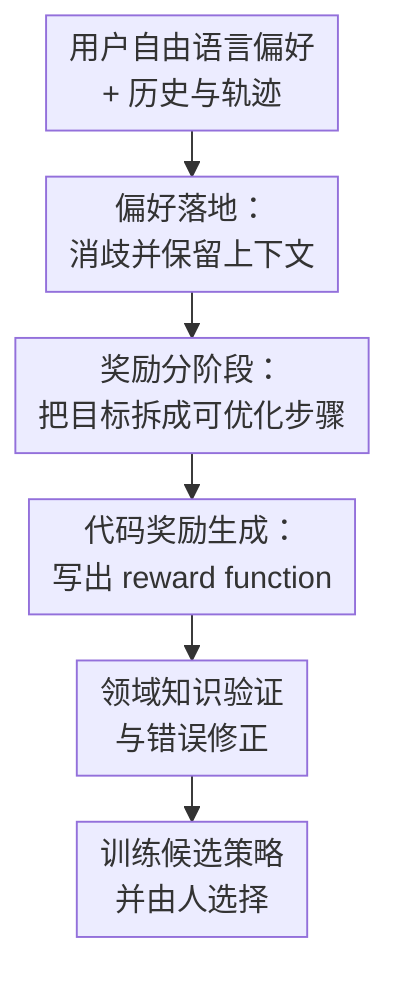

# ROSETTA: Constructing Code-Based Reward from Unconstrained Language Preference

**会议**: ICLR 2026  
**OpenReview**: [https://openreview.net/forum?id=Ig6goVdtjb](https://openreview.net/forum?id=Ig6goVdtjb)  
**论文**: [OpenReview](https://openreview.net/forum?id=Ig6goVdtjb)  
**代码**: 无  
**领域**: 对齐RLHF / 语言偏好奖励构造 / 具身智能  
**关键词**: 语言偏好对齐, 代码奖励, 强化学习, 具身智能, 人类反馈  

## 一句话总结
ROSETTA 把人类在机器人交互中随口给出的、会随时间变化的自然语言偏好，分解为“偏好落地、奖励分阶段、代码生成与验证”三步，在线生成可训练的代码奖励函数，并在 116 条偏好上达到 87% 成功率和 86% 人类满意度。

## 研究背景与动机
**领域现状**：强化学习里的具身智能如果想按人类偏好行动，关键瓶颈不是“有没有控制算法”，而是“有没有可优化的奖励”。传统 reward shaping 往往需要专家手写目标、距离、阶段和成功条件；RLHF / reward modeling 则通常需要大量离线数据或专门训练的奖励模型。近年来 LLM 代码生成能力让“用语言描述任务，再生成 reward code”成为可能，Eureka、Text2Reward 等方法已经证明 LLM 可以为机器人任务写出 dense reward。

**现有痛点**：这些方法大多假设目标比较干净、固定、结构化。真实用户不会总是说“把红方块放到绿色方块上”；他们可能说“不是那个”“慢一点，看起来太猛了”“红的放中间吧”“刚才不错，但换到左边那个箱子”。这些偏好既含糊，又依赖当前视频和历史上下文，还可能推翻上一轮目标。若直接把原话塞给代码模型，模型很容易把代词、空间关系、赞美语气或历史目标理解错；即使代码能跑，奖励函数也可能优化出一个与用户意图无关的行为。

**核心矛盾**：本文抓住的根本矛盾是：人类偏好天然是开放、主观、动态的，而强化学习需要的是明确、可微/可优化、状态条件清楚的奖励函数。一个偏好在用户脑中对应的是未知且随时间变化的满意度函数 $F^{(t)}$，但机器人训练只能接收某个代码形式的 $R^{(t)}$。因此问题不只是“生成 reward”，而是每一轮都要把最新偏好、历史偏好、当前策略 rollout 和环境几何共同解释成一个新的、可训练的奖励目标。

**本文目标**：ROSETTA 希望做到三件事：第一，处理未经约束的自然语言偏好，包括口语、模糊指代、多部分请求和上下文依赖；第二，在单轮偏好后生成可执行、可优化的代码奖励，而不是为了同一个固定目标反复收集反馈；第三，用比训练成功率更贴近 alignment 的评估体系，检查生成奖励是否真的符合人类意图。

**切入角度**：作者没有训练一个新的通用 reward model，而是把 foundation model 的能力拆开使用：用视觉语言模型先看懂 rollout 和语言，用 LLM 的规划能力把目标拆成奖励阶段，再用推理/代码模型生成 reward code，并通过领域知识 checklist 反复校验。这个角度的优势在于无需为每个新偏好重新训练奖励模型，也能把开放语言逐步收敛到环境代码可表达的形式。

**核心 idea**：用“先语义落地、再分阶段、最后生成并验证代码奖励”的模块化 pipeline，把开放的人类语言偏好翻译成强化学习可以优化的 reward function。

## 方法详解

### 整体框架
ROSETTA 的输入不是一个干净任务描述，而是一轮交互中的完整上下文：原始任务、上一轮策略 rollout 的图像/轨迹、历史偏好以及用户当前说出的偏好。系统先用 Preference Grounding 把随口说出的反馈改写成明确、上下文化的指令，再用 Staging 把这个指令拆成适合 dense reward 的阶段计划，最后由 Coding 模块把阶段计划转成环境中的奖励函数代码，并用领域知识检查和错误修正得到可运行版本。

从问题形式上看，经典 reward generation 假设有固定任务描述 $l$ 和已知 fitness function $\bar{F}$，目标是生成 $R$ 让 $\bar{F}(A_M(R))$ 最大。ROSETTA 处理的是更难的版本：第 $t$ 轮用户偏好 $h^{(t)}$ 改变了隐藏在用户心里的满意度函数 $F^{(t)}$，系统要基于历史 $\{l^{(0)}, h^{(1)}, \ldots, h^{(t)}\}$ 生成 $R^{(t)}$，使训练出的策略 $\pi^{(t)} = A_M(R^{(t)})$ 尽可能让当前用户满意。这里的 $F^{(t)}$ 无法被硬编码成标准成功率，所以方法和评估都必须承认人类评价是核心目标。

### 关键设计
**1. 偏好落地：先把“人话”变成环境可指代的任务语义**

ROSETTA 的第一步不是写 reward，而是先解决语言指代和上下文问题。用户可能说 “no, get it to the center”，其中 “it” 是哪个物体、“center” 是目标区域中心还是桌面中心、“no” 是否推翻了上一轮目标，单靠当前句子无法判断。Preference Grounding 模块把 rollout 图像、符号状态、逐帧语言描述、原任务和历史偏好一起交给 gpt-4o，让模型生成三类中间结果：当前执行表现摘要、被消歧后的 grounded preference，以及下一轮使用的一句话任务目标。

这个设计真正解决的是 reward code 之前的语义对齐问题。若直接生成代码，代码模型会把非标准表达当作字面字符串处理，或者忽略历史偏好；Grounding 则把“不是那个”“再往右一点”“保持刚才那样但慢些”转成具体对象、方向、动作和保留约束。例如论文中的例子里，“no, get it to the center” 会被改写为“机器人没有按要求把球推到目标中心；它仍应从更远处开始并把球推到目标中心”。这样后续模块面对的是明确目标，而不是含糊反馈。

**2. 奖励分阶段：用语言规划把开放目标变成 dense reward 结构**

许多机器人偏好看起来只有一句话，但直接写成终点成功条件很难训练。比如“把球 nestle 到箱子角落里”不仅要到达箱子，还要考虑目标点、接触、阈值和可能的中间动作。Staging 模块把 grounded preference、环境代码、demo 摘要和任务描述输入 gpt-4o，让模型输出自然语言阶段计划：每个 stage 是一个状态结果，而不是一个模糊动作意图。

这一步利用了 LLM 的规划能力，但又不把它变成高层行为 planner。它的产物是 reward engineer 能执行的设计说明，例如“奖励机器人把球放到箱子角落，并使用较紧阈值”“先奖励接近目标物体，再奖励将物体移动到目标位置”。对于短 horizon 连续控制，阶段会影响 `evaluate` 和 `compute_dense_reward`；对于长 horizon primitive setting，阶段被限制在 pick/place/push 这类动作模板中，以保证生成内容符合环境可执行动作空间。这样做的关键好处是把开放语言中的细节保留下来，同时给 RL 一个逐步可优化的奖励地形。

**3. 代码奖励生成与领域知识复核：让 LLM 不只会写代码，还要写“可训练”的奖励代码**

Coding 模块接收阶段计划、环境代码、环境属性说明、函数签名、grounding 输出和一组领域知识 checklist，再由 o1-mini 生成 reward function。论文强调，reward code 的难点不是语法，而是奖励形状：距离奖励要 dense，阶段 mask 不能过早打开或关闭，成功条件要明确，目标位置要考虑几何尺寸，速度/平滑这类行为偏好不能被 dense penalty 过度压到机器人不动。

ROSETTA 因此把同一套领域知识拆成初始 prompt 和多个验证问题反复输入。短 horizon 中会检查几何、目标位置、奖励设计和 masking；长 horizon 中会检查 target position、归一化和代码清理。生成的代码先在模拟器里运行，报错时再把 trace 交回 o1-mini 修复。这个复核机制很实际：主实验 116 条偏好中，79.35% 的 reward function 在错误修正前就能运行，修正后可运行率升到 95.38%。换句话说，ROSETTA 不是相信一次性代码生成，而是把 reward engineering 中最容易踩坑的规则显式地重新压回模型上下文。

**4. 三轴评估：把 alignment、语义匹配和可优化性分开看**

本文的评估设计也是方法的一部分。传统 RL 只看 success rate，但在开放偏好里，成功率只能说明 agent 优化了某个 reward，不说明这个 reward 是否符合用户真正想要的行为。ROSETTA 把评估拆成三轴：alignment 看人类是否更满意、是否觉得机器人采纳了偏好；semantic match 由机器人专家直接看 preference-code pair，判断 reward code 是否漏掉目标或有常识错误；optimizability 看训练出的策略成功率和成功率超过 50% 的比例。

这个拆分解释了为什么单一指标会误导。低 alignment 但高 optimizability 可能意味着代码把一个错误目标优化得很好，例如忽略用户的非标准表达，只沿用旧 reward；高 alignment 但低 optimizability 则说明 reward 语义可能更接近用户，但训练算法还没学好。论文用这种评估框架把“奖励是否对”“奖励是否能训”“用户是否满意”分开诊断，比单看 simulator success 更贴近 human-centered embodied intelligence。

### 一个完整示例
可以把一轮交互想成这样：机器人原本被训练成“把球推到目标上”，用户看完视频后说：“Way too fast. Let’s slow it down.” 这句话没有给新位置，也没有说具体速度阈值，但它改变的是行为偏好而非最终目标。

ROSETTA 首先用 Preference Grounding 结合视频和状态描述，把这句话改写成明确约束：机器人仍应完成原任务，但移动球或机械臂时速度应更慢、更平滑。接着 Staging 不会简单生成“slow down”这个终点，而会把它变成 reward 计划：保留球到目标的 dense distance reward，同时加入速度上界或超过阈值的惩罚，并避免把速度惩罚做成“越慢越好”的 dense reward，否则机器人可能学会不动。

Coding 模块随后在 `compute_dense_reward` 里读取物体或机械臂速度，例如用线速度范数 $\|v\|$ 判断是否超过阈值：当 $\|v\| > \epsilon$ 时给固定惩罚，目标接近奖励仍然保留。几何/奖励设计 review 会检查这个惩罚是否过强、是否与移动到目标的阶段奖励冲突。最终训练得到的候选策略视频再由用户选择，用户满意的策略对应的 reward function 被视为当前轮的有效适配结果。

### 损失函数 / 训练策略
ROSETTA 本身不是一个端到端训练的神经网络，没有新引入可微损失函数；它生成的是用于下游强化学习的奖励函数 $R^{(t)}$。训练策略随环境不同而变化：短 horizon 任务使用 7-DoF operational space control，并用 PPO 训练；长 horizon 任务使用来自 MAPLE 的 primitive skills 和 SAC 训练层级策略。每一轮偏好会生成多个 reward variants，系统最多训练每个 generation 中的三个变体，并从每个变体训练过程中选 success rate 最高的 checkpoint；如果所有 checkpoint 成功率都为 0，则用平均累计奖励最高者。

策略选择并不完全自动化：论文让偏好标注者从候选 rollout 中选择最喜欢的策略，作为当前轮 $\pi^{(t)}$。这与论文设定一致，因为当前偏好对应的 $F^{(t)}$ 只存在于用户心中。作者没有针对每个 reward function 调参，而是为每个环境预先固定超参，强调研究重点是 reward generation 和评价，而不是通过 per-task hyperparameter tuning 把结果调到最好。

## 实验关键数据

### 主实验
论文在 5 个 task-agnostic 机器人操控环境上评估：短 horizon 包括 SphereAndBins 和 BallAndTarget，各 10 条长度为 4 的偏好序列；长 horizon 包括 ThreeCubes、ObjectsAndBins、ObjectsAndDrawer，各 5 条长度为 2 或 3 的偏好序列。总计 35 条偏好链、116 条偏好，环境基于 ManiSkill 3 和 Franka Panda，用户偏好来自 Upwork 标注者。

| 设置 | 偏好数 | Grounding | Staging | Coding | Cascading | Success Rate | Success >50% | Satisfied | Satisfaction Score |
|------|--------|-----------|---------|--------|-----------|--------------|-------------|-----------|--------------------|
| Short Horizon | 80 | 95.7 | 87.3 | 84.6 | 78.1 | 89.2 | 90.1 | 84.8 | 76.4 |
| Long Horizon | 36 | 80.0 | 90.0 | 82.9 | 78.6 | 82.2 | 88.8 | 88.8 | 92.4 |
| Overall | 116 | 约 90+ | 约 88 | 约 84 | 约 78 | 87.0 | 约 90 | 86.0 | 79.0 |

这些数字说明 ROSETTA 的三个中间模块都不是摆设：Grounding/Staging/Coding 的专家评分整体较高，Cascading match 约 78，表示从语言到阶段再到代码的链路大多没有断；同时 87% 平均成功率和 86% satisfied 说明生成 reward 既能被 RL 优化，也能在多数情况下让用户觉得偏好被采纳。

| 对比维度 | ROSETTA 的表现 | 相对 Eureka / Text2Reward 的结论 |
|----------|----------------|----------------------------------|
| Corrective preference | 与 baseline 接近 | baseline 本来就擅长固定目标下的纠错反馈 |
| Preferential preference | 明显更好 | 用户新增/改变任务要求时，ROSETTA 的 grounding + staging 更稳 |
| Goal-related preference | 明显更好 | 成功定义变化时，直接改 reward code 的 baseline 容易沿用旧目标 |
| Behavioral preference | 明显更好 | 速度、平滑、旋转等 reward landscape 偏好需要领域知识检查 |
| Context-dependent preference | ROSETTA 满意度约 76，成功率约 73 | 无 grounding 时尤其容易误解代词和历史上下文 |

与 Eureka、Text2Reward 的差异主要出现在“任务真的变了”的偏好上，而不是普通纠错上。这符合问题设定：Eureka 和 Text2Reward 原本面向固定目标的多轮 reward refinement，而 ROSETTA 面向每轮都可能出现的新目标和新满意度函数。

### 消融实验
| 配置 | 观察到的变化 | 说明 |
|------|-------------|------|
| Full ROSETTA | alignment 和 optimizability 整体最好 | 三模块共同把开放语言转成可训练 reward |
| No-grounding | optimizability 有时看似更高，但 alignment 明显受损 | 未消歧偏好常导致代码只做很小修改，旧 reward 容易训练成功却不符合用户意图 |
| No-staging | 多数偏好类型上下降 | 少了阶段计划后，代码模型更难把一句开放偏好变成 dense、可推进的奖励结构 |
| No-followup | corrective cases 有时接近 full，但复杂偏好下降 | 领域知识 review 对几何、masking、速度惩罚等细节很重要，简单纠错时反而可能显得冗余 |

### 关键发现
- ROSETTA 在 4 轮偏好链中没有明显崩溃：第 1 到第 4 轮的满意比例分别为 90.0、80.0、80.0、89.5，满意度分数都保持在 75 以上，说明历史上下文叠加后仍能适配新偏好。
- 可优化性和对齐不是同一个指标：73% 的人类选择策略成功率超过 50%，但只有 66% 的人类选择策略是所有候选中 success rate 最高的，说明用户有时更在意行为方式而非 simulator success。
- 对特定位置、上下文依赖、行为偏好这类难点，ROSETTA 仍能保持可用结果。例如 specific position preference 上报告约 60% 成功率和 92% satisfaction score；context-dependent preference 上约 73% 成功率和 76% satisfaction score。
- 真实机器人实验虽然规模小，但给出正面信号：在 ThreeCubes 长 horizon 环境的 4 条两轮偏好链上，sim-to-real 后第一轮平均成功率 72.5%，第二轮 80.0%，作者未观察到明显 sim-to-real gap。

## 亮点与洞察
- **把 reward generation 重新定义成动态 alignment 问题**：本文最重要的贡献不是“LLM 又能写 reward code”，而是明确指出开放人类偏好对应的是随轮次变化的 $F^{(t)}$。这个建模让评估焦点从固定 task success 转向每一轮用户满意度。
- **模块拆分非常务实**：Grounding 处理语义，Staging 处理 reward 结构，Coding 处理环境实现。三个模块都使用已有 foundation model，但职责边界清楚，避免把“看图、理解代词、规划阶段、写 PyTorch reward、修 bug”全压给一个 prompt。
- **领域知识 checklist 是 reward code 生成的关键工程 trick**：论文没有把 prompt 写得神秘，而是把几何偏移、dense reward、masking、速度惩罚、success boost 等经验显式列成复核问题。这种做法可以迁移到其他 code-as-reward 场景，比如游戏 AI、仿真控制或 agent tool-use reward。
- **评估框架值得单独借鉴**：alignment、semantic match、optimizability 三轴拆开后，能解释“代码能跑但用户不满意”和“用户喜欢但训练指标差”的不同失败模式。这对 LLM agent 对齐也有启发：任务通过率不等于用户偏好满足。
- **Open-source LLM 实验说明结构比具体闭源模型更重要**：作者还测试了 Qwen2.5-VL-72B-Instruct + Qwen3-Coder-480B-A35B-Instruct-FP8，得到不错的 mean best reward；prompt paraphrase 实验也显示概念结构比逐字 prompt 更稳定。

## 局限与展望
- **跨模拟器迁移仍未充分验证**：ROSETTA 的 prompt 和 checklist 与 ManiSkill、Franka、特定状态字典和环境几何紧密相关。换到 Isaac Gym、MuJoCo 或真实家用机器人时，需要多少环境文档和 domain checklist 还不清楚。
- **语义匹配评估依赖专家人工判断**：专家看 reward code 能发现 hallucination 和 common-sense error，但成本高、主观性也存在。未来可以研究自动代码语义评估、轨迹反事实评估或 learned reward-code verifier。
- **历史错误会污染后续轮次**：论文给出例子，上一轮 reward code 中错误的 z-offset 被下一轮继承，导致机器人反复在苹果上方尝试抓取但不够低。这说明把 prior reward code 放进上下文虽有助于连续适配，也会传播 hallucination。
- **部分偏好受环境状态表达限制**：例如“放下后松手”“从高处丢进箱子”这类带时间依赖的要求，在默认无历史 reward formulation 中很难表达。若 reward function 看不到足够时间信息，再强的语言模型也只能生成近似或失败的奖励。
- **安全问题只是被提出，还没有完整解决**：如果用户偏好本身有害，或者 reward code 生成了危险行为，ROSETTA 需要额外的 domain-specific safety filter。论文承认这是开放伦理和技术问题。

## 相关工作与启发
- **vs Eureka**: Eureka 用 LLM 写 reward，并通过 hard-coded fitness function 和多轮 best-of-n 改进固定目标。ROSETTA 的区别在于不假设目标固定，也不假设每轮反馈只是帮同一个目标调 reward；它更关注自由语言偏好改变任务本身时的在线适配。
- **vs Text2Reward**: Text2Reward 同样把语言转成 reward shaping code，但输入更接近结构化任务或纠错反馈。ROSETTA 增加了 Grounding 和 Staging，把“用户随口说的话”先翻译成明确目标和 reward 阶段，因此在 goal-related、preferential、behavioral preference 上更稳。
- **vs 传统 reward modeling / RLHF**: 传统方法通过数据训练 reward model，泛化依赖离线数据分布；ROSETTA 不训练新模型，而是每轮用 foundation model 生成任务特定 reward code。它牺牲了一些自动化闭环程度，换来对 unseen dynamic preference 的快速适配。
- **vs 语言机器人规划方法**: Code as Policies、Inner Monologue、VoxPoser 等工作关注把语言转成动作或 value maps；ROSETTA 不直接输出策略，而是输出 RL 可优化的 reward function，因此适合需要训练策略、处理连续控制和重复优化的场景。
- **对 LLM agent 的启发**: 很多 agent 系统也面临“用户偏好开放、任务目标随对话变化、执行指标不等于满意度”的问题。ROSETTA 的三步结构可以迁移成：先 grounding 用户意图，再 staging 子目标和检查点，最后生成可执行代码/工具调用，并用多轴评价区分语义正确性与执行成功率。

## 评分
- 新颖性: ⭐⭐⭐⭐ 不是第一个 LLM 生成 reward 的工作，但把 unconstrained dynamic preference、代码奖励和三轴评估系统性连起来，很有问题设定上的新意。
- 实验充分度: ⭐⭐⭐⭐ 116 条真实人类偏好、短/长 horizon、baseline、ablation、真实机器人小实验都覆盖了；不足是跨模拟器和真实世界规模仍有限。
- 写作质量: ⭐⭐⭐⭐ 论文问题定义清楚，例子丰富，prompt 附录透明；主文部分图表数字有些分散，需要结合附录才能完整理解。
- 价值: ⭐⭐⭐⭐⭐ 对“LLM + RL + human preference”的实际落地很有参考价值，尤其适合研究如何把开放语言反馈转成可执行、可评估的训练信号。

<!-- RELATED:START -->

## 相关论文

- [\[ACL 2025\] Dynamic Scaling of Unit Tests for Code Reward Modeling](../../ACL2025/llm_alignment/dynamic_scaling_of_unit_tests_for_code_reward_modeling.md)
- [\[ICLR 2026\] Towards Understanding Valuable Preference Data for Large Language Model Alignment](towards_understanding_valuable_preference_data_for_large_language_model_alignmen.md)
- [\[ICLR 2026\] Skywork-Reward-V2: Scaling Preference Data Curation via Human-AI Synergy](skywork-reward-v2_scaling_preference_data_curation_via_human-ai_synergy.md)
- [\[ICLR 2026\] Chasing the Tail: Effective Rubric-based Reward Modeling for Large Language Model Post-Training](chasing_the_tail_effective_rubric-based_reward_modeling_for_large_language_model.md)
- [\[ICLR 2026\] Omni-Reward: Towards Generalist Omni-Modal Reward Modeling with Free-Form Preferences](omni-reward_towards_generalist_omni-modal_reward_modeling_with_free-form_prefere.md)

<!-- RELATED:END -->
