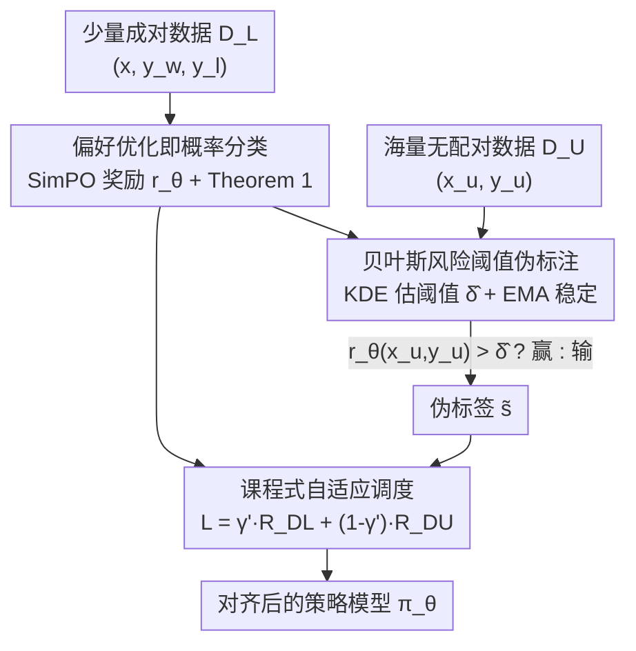

# Semi-Supervised Preference Optimization with Limited Feedback

**会议**: ICLR 2026  
**OpenReview**: [https://openreview.net/forum?id=ghwxbTx7do](https://openreview.net/forum?id=ghwxbTx7do)  
**代码**: https://github.com/MLAI-Yonsei/SSPO  
**领域**: 对齐RLHF  
**关键词**: 偏好优化, 半监督学习, 伪标注, 奖励阈值, 数据效率

## 一句话总结
SSPO 把偏好优化重述成一个概率分类问题，从少量成对偏好标签中学到一个能可靠分开"赢/输"回答的奖励阈值，再用这个阈值给海量无配对样本（如 SFT 数据）打伪标签，配合课程式调度联合训练——只用 1% 的 UltraFeedback 就能稳定超过用 10% 数据训练的强基线。

## 研究背景与动机
**领域现状**：偏好优化（PO）是让 LLM 对齐人类价值的核心手段。从 RLHF、DPO 到 SimPO、ORPO、KTO，主流路线都依赖**成对**的偏好数据 $(x, y_w, y_l)$——给定一个 prompt，标注者要从两个回答里挑出更优的那个。

**现有痛点**：这种成对标注极其昂贵，平均每条比较要花 5–10 分钟、$10–30 美元，专家标注在医疗、商业等专业领域更是瓶颈。为了省钱，已有工作转向合成反馈或用 LLM 自动标注，但这些做法缺乏可验证的 ground truth，质量难保证。

**核心矛盾**：一边是成对偏好标签稀缺且昂贵，另一边是大量现成的 SFT 数据（问答对、领域语料）虽然富含**隐式偏好**（连贯的思路、合适的语气），却因为没有显式偏好标签而被 PO 直接丢弃。用合成数据/自标注又会陷入"模型用自己的偏见标自己"的反馈回环，放大错误。

**本文目标**：在只有少量成对标签 + 大量无配对样本的设定下，把无配对数据里的隐式偏好真正用起来，既省标注成本又不牺牲对齐质量。作者把这个问题正式定义为**半监督偏好优化（SSPO）**。

**切入角度**：作者观察到，当奖励函数在少量成对数据上训练后，赢回答和输回答的奖励值会自然形成一个**可分离的间隔**。既然如此，是否存在一个奖励阈值，能以高概率把两类分开？如果存在，就能拿它给无标签数据打伪标签。

**核心 idea**：把偏好学习重述为概率二分类，理论上证明存在一个**最优奖励阈值** $\delta^*$，再用核密度估计在实践中求出这个阈值，给无配对数据做有理论保证的伪标注，最后用课程调度把成对与伪标注数据联合优化。

## 方法详解

### 整体框架
SSPO 的核心思路是：**先用少量成对数据训练奖励函数 → 在奖励空间里找一个能分开赢/输的阈值 → 用阈值给海量无配对数据打伪标签 → 课程式联合训练策略模型**。

奖励函数沿用 SimPO 的无参考形式 $r_\theta(x, y) = \frac{\beta}{|y|}\log \pi_\theta(y\mid x)$，把语言模型自己的长度归一化对数似然当奖励，因此不需要额外的奖励模型或参考模型。成对数据 $D_L$ 提供可靠监督，让赢回答的奖励稳定高于输回答；由此在赢/输奖励分布之间出现一个间隔，SSPO 用核密度估计在这个间隔里定位一个**最小化贝叶斯风险**的阈值 $\hat\delta$。对无配对数据 $D_U$ 里的每个回答，只要其奖励超过 $\hat\delta$ 就打伪标签 $\tilde s = 1$（赢），否则 $\tilde s = 0$（输）。最终训练目标是成对损失与伪标注损失的加权和，权重 $\gamma'$ 随训练自适应衰减，实现"先学可靠的成对数据、再逐步倚重无配对数据"的课程。

### 关键设计

**1. 把偏好优化重述为概率分类，并证明最优阈值存在**

SSPO 要给无配对数据打伪标签，前提是"奖励能不能可靠区分赢/输"这件事有理论依据，而不是拍脑袋设阈值。作者先把偏好学习重新建模为一个贝叶斯最优分类问题：定义偏好分类器 $f_\theta(x, y, y') \to [0,1]$ 输出 $y$ 优于 $y'$ 的置信度，用 Bradley-Terry 形式 $f_\theta = \sigma(r_\theta(x,y) - r_\theta(x,y'))\cdot P(s{=}1) + \sigma(r_\theta(x,y') - r_\theta(x,y))\cdot P(s{=}0)$ 把奖励差映射成偏好概率。对成对数据，由于标注总是 $s = 1$，风险函数恰好退化为标准的偏好优化目标 $\mathbb{E}_{D_L}[-\log\sigma(r_\theta(x, y_w) - r_\theta(x, y_l))]$——这说明这套分类视角和现有 PO 是自洽的。

在此基础上，作者把"找阈值"形式化为最小化误分类风险 $R(\delta) = P(s{=}1)\int_{-\infty}^{\delta} p(r\mid s{=}1)\,dr + P(s{=}0)\int_{\delta}^{\infty} p(r\mid s{=}0)\,dr$，它度量赢/输奖励分布的重叠面积。**定理 1** 证明：当赢、输奖励都服从均值满足 $\mu_w > \mu_l$ 的次高斯分布时，对任意 $\alpha \in (0,1)$ 存在最优阈值 $\delta^*$ 落在区间 $[\mu_l + t_1, \mu_w - t_2]$ 内，使 $P(\max_i r_\theta(x^{(i)}, y_l^{(i)}) \le \delta^* \le \min_j r_\theta(x^{(j)}, y_w^{(j)})) \ge 1 - \alpha$。也就是说，只要奖励模型学出了足够间隔，就一定存在一个阈值以高概率把两类干净分开——这给伪标注提供了统计学上的合法性，而不是启发式过滤。

**2. 基于贝叶斯风险阈值的伪标注**

定理 1 只保证 $\delta^*$ 存在，但它依赖未知的真实均值 $\mu_w, \mu_l$，实践中算不出来。SSPO 的解法是：用**核密度估计（KDE）**从成对数据里估计赢、输回答的奖励密度 $\hat p_w(r)$、$\hat p_l(r)$（高斯核，带宽 $h$），然后数值搜索使估计贝叶斯风险 $\hat R(\delta)$ 最小的 $\hat\delta = \arg\min_\delta \hat R(\delta)$。

有了这个实践阈值，SSPO 给每个无配对回答打伪标签 $\tilde s_k = \mathbb{I}\{r_\theta(x_u^{(k)}, y_u^{(k)}) > \hat\delta\}$，并定义无配对数据的风险 $R_{D_U}(f_\theta) = \frac{1}{n_U}\sum_k \ell(f_\theta, \tilde s_k)\cdot P_{D_U}(s {=} \tilde s_k)$。这里有个巧妙处理：无配对样本只有单个回答、没有对照，作者引入一个**虚拟对照** $y_b$——其奖励恰好落在决策边界上，于是单样本也能套进第一点里的偏好分类器框架。先验 $P_{D_U}(s{=}1)$ 固定为 0.5，代表对无配对数据中赢回答比例的初始信念。由于奖励分布在训练中会漂移，阈值 $\hat\delta$ 还用 **EMA（指数滑动平均）** 稳定，避免边界因为奖励非平稳而抖动或崩塌。和直接卡个固定分数的启发式过滤相比，这套阈值是从奖励分布、以最小误分类风险为目标推导出来的，更稳健。

**3. 课程式自适应调度**

把成对损失和伪标注损失简单等权相加是有风险的：训练早期奖励函数还没学好，赢/输分布重叠严重，此时的伪标签噪声很大，若过早倚重它们会放大错误（confirmation bias）。SSPO 用一个自适应系数 $\gamma'$ 实现课程学习：$L(f_\theta) = \gamma' \cdot R_{D_L}(f_\theta) + (1-\gamma')\cdot R_{D_U}(f_\theta)$，其中 $\gamma' = \max\{\gamma_{\min}, \gamma_0 \cdot \exp(-\lambda\tau)\}$，初值 $\gamma_0 = 1$、随训练步 $\tau$ 指数衰减，下界 $\gamma_{\min} = n_L/(n_L + n_U)$ 取成对数据的占比。

效果是：开始时模型几乎只看可靠的成对数据，把它当锚点学到干净的偏好模式；随着奖励函数变好、间隔变清晰，伪标注无配对数据的权重逐渐上升并最终主导优化。这正好契合"模型先学干净模式、后才过拟合噪声"的早期学习现象——在伪标签最不可信的早期给它最低权重，在它最可信的后期才放手用，从而既吃到大规模无配对数据的红利，又不被早期噪声带偏。

### 损失函数 / 训练策略
最终目标即第三点的加权损失 $L(f_\theta) = \gamma' R_{D_L} + (1-\gamma') R_{D_U}$。奖励采用 SimPO 形式（含缩放系数 $\beta$ 和奖励间隔 $\Delta$），无需参考模型。阈值 $\hat\delta$ 每步由 KDE 重估并以 EMA 平滑。无配对先验默认 0.5。训练以已在 UltraChat 上微调好的现成模型为初始权重。

## 实验关键数据

### 主实验
真实数据上以 UltraFeedback 作为成对数据，分别用 1%（$n_L{=}611$）和 10%（$n_L{=}6{,}113$）模拟数据稀缺，无配对数据取 10% 的 UltraChat-200k（$n_U{=}20{,}786$）。评测用 AlpacaEval2.0（LC 长度控制胜率、WR 原始胜率）与 MT-Bench，GPT-4-Turbo 当裁判。

| 数据集 / 骨干 | 设置 | 指标 | SSPO | 最强基线 | 说明 |
|--------|------|------|------|----------|------|
| UltraFeedback / Mistral-7B | 1% | LC | **26.7** | 18.2 (SPA) | 1% 即超所有 1% 基线 |
| UltraFeedback / Mistral-7B | 1% vs 基线 10% | LC | **26.7** | 19.1 (SPA, 10%) | 1% 数据超基线 10% |
| UltraFeedback / Mistral-7B | 10% | LC | **30.0** | 19.1 (SPA) | 全面领先 |
| UltraFeedback / Phi-2 | 1% | LC / WR | **7.2 / 4.1** | 4.3 / 2.6 | 小模型同样领先 |
| UltraFeedback / Llama3-8B | 10% | LC / WR | **20.7 / 20.8** | 16.7 / 18.2 (KTO) | 领先 KTO |

跨域实验（医疗 UltraMedical-Preference、商业 DSP Business）上，Llama3 系骨干的 LC 在各数据规模下都打败最强基线，验证了 SSPO 在专业领域同样有效。

### 消融实验

| 配置 | 关键指标（Mistral, 10% UF, LC/WR） | 说明 |
|------|------|------|
| Full（自适应调度 ✓） | 30.0 / 20.7 | 完整模型 |
| 固定 $\gamma'{=}0.5$ | 29.3 / 19.8 | 去掉调度仍强于基线，但掉点 |
| 固定 $\gamma'{=}0.1$ | 27.5 / 18.1 | 过早倚重无配对数据，掉得更多 |
| 先验 0.5 | 30.0 / 20.7 | 最佳默认 |
| 先验 0.1 / 0.9 | 25.6 / 25.7 (LC) | 过于自信的先验过拟合噪声伪标签 |

玩具实验（GPT-2-small 当奖励模型，最短词为优）显示：noise-free 下 $n_L{=}100$ 时 SSPO 达 0.960 准确率（SimPO 仅 0.817）；即便 50% 标签噪声，SSPO 在 $n_L{=}10$ 时仍有 0.757，远超 DPO/SimPO 的 ~0.59，证明对标签噪声的鲁棒性。

### 关键发现
- **自适应调度贡献关键**：去掉后即使固定 $\gamma'$ 也仍强于基线，但固定值越偏向无配对数据（0.1）掉点越多——说明"先成对后无配对"的课程顺序是吃满无配对红利的前提。
- **先验 0.5 最稳**：偏离中性（0.1/0.9）会让模型过拟合噪声伪标签；但即便最差先验，SSPO 仍显著超基线，说明方法整体很耐用。
- **数据效率惊人**：Mistral 在 1% UltraFeedback 上即超过所有用 10% 数据训练的基线，把成对标注需求压缩约一个数量级。
- **奖励分布演化可视化**：训练早期赢/输分布大量重叠时调度器优先靠成对损失当锚点，间隔拉开后 KDE+EMA 阈值稳定跟踪最优边界，避免确认偏误与奖励非平稳带来的崩塌。

## 亮点与洞察
- **把"找阈值"上升为有定理保证的问题**：大多数伪标注方法靠经验卡阈值，SSPO 用次高斯假设证明最优阈值存在、再用 KDE 求贝叶斯风险最小点，让伪标注从启发式变成有统计依据的操作——这是最让人"啊哈"的地方。
- **虚拟对照 $y_b$ 的技巧**：单个无配对回答本来没法做成对比较，引入一个落在决策边界上的假想对手，就把单样本无缝接入了成对分类器框架，复用同一套 $f_\theta$。
- **课程调度对接早期学习理论**：用 $\gamma'$ 指数衰减让模型"早期信成对、后期信伪标签"，正好规避了自训练最怕的确认偏误，这个调度思路可迁移到任何 pseudo-labeling 的半监督场景。
- **无参考奖励降本**：沿用 SimPO 的长度归一化似然当奖励，省掉参考模型与奖励模型，整套方法的额外开销主要只在 KDE 估阈值。

## 局限与展望
- **依赖奖励分布的可分性假设**：定理 1 建立在赢/输奖励次高斯且 $\mu_w > \mu_l$ 上。若成对数据太少或太脏，奖励分布迟迟不分开，阈值就不可靠，伪标签会带噪。
- **固定先验是简化**：$P_{D_U}(s{=}1)$ 全程固定为 0.5，假设无配对数据里赢/输大致各半；当无配对数据本身质量偏高或偏低、真实比例远离 0.5 时，这个假设可能不成立（实验也显示偏离 0.5 会掉点）。
- **伪标签是硬阈值**：超过 $\hat\delta$ 即判赢、否则判输，边界附近的样本被强行二分，没有利用置信度做软加权，边界模糊区可能引入误标。
- **改进思路**：可以让先验随训练自适应、或对靠近阈值的样本做置信度软标签 / 丢弃；也可探索把 KDE 阈值与具体领域的奖励尺度解耦。

## 相关工作与启发
- **vs DPO / SimPO / ORPO / KTO**：这些标准 PO 只用成对标签、直接丢掉无配对数据，数据效率受限；SSPO 复用 SimPO 奖励但额外把无配对数据通过阈值伪标注用起来，在 1% 数据下大幅反超。
- **vs SSRM（半监督奖励建模）**：SSRM 也在半监督设定下用自训练做奖励建模，但 SSPO 的差异在于给伪标注一个最优阈值存在性定理 + 贝叶斯风险最小化的求解，理论更扎实，且直接优化策略而非单独奖励模型。
- **vs SPA（Spread Preference Annotation）**：SPA 靠反复用改进后的偏好模型自标注来渐进对齐，计算开销大且可能放大错误；SSPO 不做迭代自标注，一次性用 KDE 阈值打伪标签 + 课程调度，更稳更省，实验中在多数设置下超过 SPA。

## 评分
- 新颖性: ⭐⭐⭐⭐⭐ 把偏好优化重述为概率分类并给伪标注阈值一个存在性定理，半监督 PO 这一设定本身也少见。
- 实验充分度: ⭐⭐⭐⭐ 覆盖玩具+真实、3 个骨干、通用+医疗+商业三域、含先验与调度消融，但多为 GPT 裁判的胜率类指标。
- 写作质量: ⭐⭐⭐⭐ 理论与实践衔接清晰，图示直观，理论假设的实际成立性可再多讨论。
- 价值: ⭐⭐⭐⭐⭐ 把成对标注需求压缩约一个数量级，对成本敏感的专业领域对齐很实用。

<!-- RELATED:START -->

## 相关论文

- [\[ICLR 2026\] Stackelberg Learning from Human Feedback: Preference Optimization as a Sequential Game](stackelberg_learning_from_human_feedback_preference_optimization_as_a_sequential.md)
- [\[ICLR 2026\] Anchored Supervised Fine-Tuning](anchored_supervised_fine-tuning.md)
- [\[ACL 2025\] Fine-grained Video Dubbing Duration Alignment with Segment Supervised Preference Optimization](../../ACL2025/llm_alignment/fine-grained_video_dubbing_duration_alignment_with_segment_supervised_preference.md)
- [\[ICLR 2026\] What's In My Human Feedback? Learning Interpretable Descriptions of Preference Data](whats_in_my_human_feedback_learning_interpretable_descriptions_of_preference_dat.md)
- [\[ICLR 2026\] Multiplayer Nash Preference Optimization](multiplayer_nash_preference_optimization.md)

<!-- RELATED:END -->
