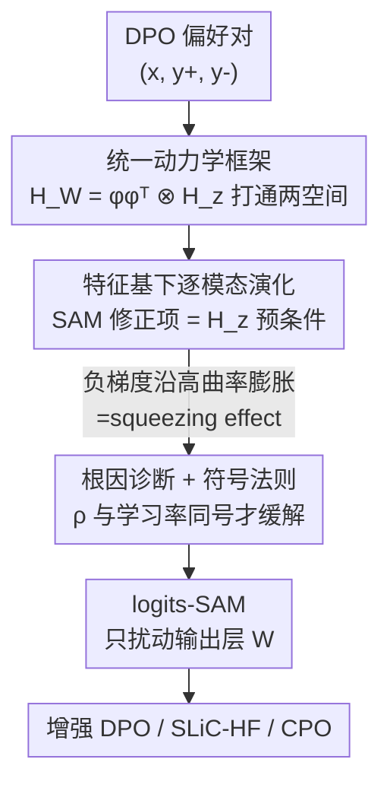

# Sharpness-Aware Minimization in Logit Space Efficiently Enhances Direct Preference Optimization

**会议**: ICLR 2026  
**OpenReview**: [https://openreview.net/forum?id=4mE2FlL66E](https://openreview.net/forum?id=4mE2FlL66E)  
**代码**: https://github.com/RitianLuo/logits-sam-dpo  
**领域**: 对齐RLHF  
**关键词**: DPO, squeezing effect, Sharpness-Aware Minimization, logit 空间, 曲率正则

## 一句话总结
本文从 logit 空间动力学出发解释了 DPO 训练中"偏好回答概率反而下降"的 squeezing effect（负梯度让残差沿高曲率方向疯狂膨胀），证明 SAM 的曲率正则恰好能压住这种膨胀，并落地为只扰动输出层、几乎零开销的 logits-SAM，在 Pythia-2.8B / Mistral-7B / Gemma-2B-IT 上稳定提升 DPO 及其变体。

## 研究背景与动机
**领域现状**：DPO（Direct Preference Optimization）已经成为对齐 LLM 的主流离线算法——它把隐式奖励重参数化成"策略 vs 参考策略的对数似然比"，配合 Bradley–Terry 模型直接在偏好对 $(x, y^+, y^-)$ 上优化一个闭式目标，省掉了显式训练奖励模型这一步，因而以简单、稳定著称。

**现有痛点**：但 DPO 有一个被反复观察到的诡异现象——squeezing effect（也叫 likelihood displacement）：训练过程中**偏好回答 $y^+$ 的生成概率不升反降**，这与 DPO 目标"提高偏好回答概率"的初衷完全相反。后果很严重：性能退化、安全性下降，甚至彻底对齐失败（在 AI safety 场景里会让模型对有害请求的拒绝率掉下来）。

**核心矛盾**：问题出在 DPO 损失里和"被拒绝回答 $y^-$"绑定的那一项是**负目标**——它等价于用负学习率做梯度下降。而负梯度更新会让残差向量沿着 Hessian 大特征值对应的**高曲率方向快速膨胀**，这正是 squeezing effect 的根源。已有工作（Ren & Sutherland, 2024）只证明了"真值类概率必降、最自信错误类概率必升"，但没有一个能逐坐标刻画全部类别演化、并据此给出解药的统一框架。

**本文目标**：(1) 建立一个能同时追踪参数空间和 logit 空间动力学的统一理论框架，找出 squeezing effect 的精确根因；(2) 在这个框架里证明某种"曲率感知训练"能压住这种漂移；(3) 把理论落成一个实际可用、几乎不增开销的训练技巧。

**切入角度**：作者把目光投向 Sharpness-Aware Minimization（SAM）——它在监督学习里通过"在参数邻域内最小化最坏情况损失"来寻找平坦极小值，本质是一种曲率正则。既然 squeezing effect 是高曲率方向上的膨胀，那么一个能压曲率的优化器理应能治它。

**核心 idea**：用 logit Hessian 把参数空间和 logit 空间的二阶动力学统一起来，证明"扰动半径 $\rho$ 取和学习率同号"时 SAM 能缓解 squeezing effect，再把 SAM 退化成只扰动输出层的 **logits-SAM**——以可忽略的开销获得曲率正则的全部好处。

## 方法详解

### 整体框架
本文是一篇"理论驱动 + 极简落地"的工作，主线是：**先在一个可解析的简化设定里把 DPO 的学习动力学算清楚，定位 squeezing effect 的根因，再证明 SAM 能治它、并给出一条朴素的符号法则，最后把这条法则落成只动输出层的高效实现 logits-SAM**。

具体地，作者沿用 Ren & Sutherland（2024）的多分类 logistic 回归 + 固定特征（kernel regime）设定：特征 $\phi(x)$ 固定，logits $z = W\phi$，概率 $p = \mathrm{softmax}(z)$，残差 $g = p - y$。DPO 的 $y^+$ 项对应正学习率的标准下降，$y^-$ 项对应负学习率的负梯度更新。在这个抽象里，作者打通参数空间 Hessian $H_W$ 与 logit Hessian $H_z$ 的几何联系，推出 GD 和 SAM 在参数 / logit / 残差三个空间下的统一动力学方程，再在 $H_z$ 的特征基下把向量动力学对角化成逐模态的标量演化，从而看清 SAM 修正项到底在每个曲率方向上做了什么——结论是一条"$\rho$ 与学习率同号即可缓解 squeezing"的法则，最终物化为 logits-SAM。

### 关键设计

**1. 统一动力学框架：用 logit Hessian 把参数空间的二阶效应"降维"到 logit 空间**

要分析 SAM 这种曲率正则，绕不开 Hessian，但参数空间 Hessian $H_W \in \mathbb{R}^{Vd \times Vd}$ 维度太高、难以处理。作者的 Proposition 3.1 给出关键的几何桥梁：在固定特征下 $H_W = (\phi\phi^\top) \otimes H_z$，因此当 $\phi \neq 0$ 时 $\mathrm{rank}(H_W) = \mathrm{rank}(H_z)$，且任何参数扰动的二阶效应**只通过它诱导的 logit 扰动 $\Delta W \,\phi$ 起作用**。这意味着原本在 $\mathbb{R}^{Vd}$ 里纠缠的二阶动力学，可以等价地在小得多的 logit Hessian $H_z \in \mathbb{R}^{V \times V}$ 里研究。

基于这座桥，Theorem 3.2 给出 SAM 在参数 / logit / 残差三个空间下的统一展开（带 $O(\eta^2)$ 余项），其中残差的演化为

$$g^{t+1} = \big(I - \eta\mu H_z^t - \eta\mu\,\tilde\rho^{\,t}(H_z^t)^2\big)(p^t - y) + r_g^t,$$

等效扰动系数 $\tilde\rho^{\,t} = \rho\sqrt{\mu}/\|g^t\|$。当 $\rho = 0$ 时退化为标准 GD；SAM 相比 GD 多出一个由 $(H_z)^2$ 构成的预条件修正项。这个统一框架的价值在于：GD 和 SAM 共享同一套结构，差别只在那个曲率修正项，从而把"SAM 到底改变了什么"暴露得清清楚楚。

**2. squeezing effect 根因诊断与 SAM 符号法则：负梯度沿高曲率方向膨胀，$\rho$ 同号即可压制**

有了统一框架，作者在 $H_z$ 的特征基下把残差动力学对角化（Corollary 3.4）：记残差在特征向量 $v_k^t$ 上的模态系数 $e_k^t = (v_k^t)^\top g^t$，则

$$e_k^{t+1} = \Big(1 - \eta\mu\big(\lambda_k^t + \tilde\rho^{\,t}(\lambda_k^t)^2\big)\Big)e_k^t + r_k^t.$$

这一步把向量动力学拆成逐坐标的标量，SAM 的作用一目了然：它在每个模态上额外加了一项正比于 $(\lambda_k^t)^2$ 的修正——曲率 $\lambda_k$ 越大，这项影响越强。据此分两种情形分析：**正 $\eta$（对应 $y^+$）** 时 GD 本就在高曲率方向收缩残差，正 $\rho$ 的 SAM 与之同号、进一步放大收缩；**负 $\eta$（对应 $y^-$）** 时 GD 让残差沿高曲率方向更快膨胀——这正是 squeezing effect 的来源，而正 $\rho$ 的标准 SAM 会火上浇油、膨胀得更快，**只有负 $\rho$ 才能反向抵消这种膨胀**。

进一步对接 Ren & Sutherland 的"单步置信比"分析，作者证明（Corollary 3.6）：在 $\eta\rho > 0$ 且 $|\rho| = \kappa\sqrt{|\eta|}$ 的设定下，$\alpha_{y^*}^{\mathrm{SAM}} \le \alpha_{y^*}^{\mathrm{GD}}$ 且 $\alpha_{y}^{\mathrm{SAM}} \ge \alpha_{y}^{\mathrm{GD}}$——即 SAM 抑制了最自信错误类 $y^*$ 的增长、放缓了真值类的衰减。把两种情形合起来就是一条朴素法则：**$\rho$ 取和学习率同号即可缓解 squeezing effect**。1000 维三分类的 toy 实验和 GPT-2/WebGPT、Pythia-2.8B/TL;DR 的真实模型实验都验证了这一预言。

**3. logits-SAM：只扰动输出层的高效实现，几乎零开销拿到曲率正则**

理论虽好，但把标准 SAM 直接套到 DPO 上有个致命问题：它需要额外一次完整的前向 + 反向传播来计算扰动，几乎让训练成本翻倍，对十亿参数模型在 A100 上甚至会 OOM（扰动缓冲区和模型同量级，要多占 10GB+ 显存）。作者的动力学分析恰好指出，曲率正则**只在 logit 空间施加扰动就能实现**（配合正确的 $\rho$ 符号），于是提出 logits-SAM——只对输出层参数 $W$ 做 SAM 扰动：

$$\mathcal{L}^{\text{logits-SAM}}_{\text{DPO}}(W, \theta) = \mathcal{L}_{\text{DPO}}\!\Big(W + \rho\,\tfrac{\nabla_W \mathcal{L}_{\text{DPO}}}{\|\nabla_W \mathcal{L}_{\text{DPO}}\|},\, \theta\Big).$$

实现上，它用倒数第二层的隐状态和最后一层参数**手动**算扰动，只需一次完整的前向–反向，而非标准 SAM 的两次。由于输出层只占总参数的一小部分（Pythia-2.8B 里 4.64%，Mistral-7B 里 1.81%），额外开销可忽略——实测只多 2–3% 时间、显存几乎不变。值得一提的是常见 DPO 实现把 $y^-$ 项编码成负目标、统一用正学习率，因此据"$\rho$ 与学习率同号"法则，实践中**一律用正 $\rho$** 即可。logits-SAM 此前只在别的工作里作为副产品被一笔带过，本文是第一个把它和 DPO 结合、系统分析并用起来的工作。

### 损失函数 / 训练策略
核心损失即上面的 logits-SAM 增强版 DPO 目标，唯一新增超参是扰动半径 $\rho$，在 $\{10^{-5}, 10^{-4}, 10^{-3}\}$ 中搜索（远小于原 SAM 推荐的 0.01–0.5，因为只扰动输出层）。优化器统一用 AdamW；Pythia-2.8B 用 batch 64、学习率 $1\times10^{-6}$，Mistral-7B 用 batch 128、学习率 $5\times10^{-7}$，$\beta$ 沿用 DPO 论文与 Alignment Handbook 的推荐值。把 logits-SAM 套到 SLiC-HF、CPO 上时所有超参与对应 baseline 保持一致，只额外引入 $\rho$，保证公平。

## 实验关键数据

### 主实验
摘要 / 对话生成（Pythia-2.8B，GPT-5-mini 评判，WR%）：logits-SAM 对 DPO、SLiC-HF、CPO 三个 baseline 一致提升。

| 方法 | HH vs SFT | HH vs chosen | TL;DR vs SFT | TL;DR vs chosen |
|------|-----------|--------------|--------------|-----------------|
| DPO | 70.52 | 56.35 | 84.21 | 34.78 |
| DPO+logits-SAM | **72.28** | **60.51** | **89.58** | **36.57** |
| SLiC-HF | 65.27 | 54.72 | 91.88 | 31.36 |
| SLiC-HF+logits-SAM | **71.87** | **62.21** | **94.40** | **32.80** |
| CPO | 66.60 | 58.19 | 90.99 | 39.38 |
| CPO+logits-SAM | **70.24** | **59.90** | **93.29** | **45.41** |

开放式指令跟随（Mistral-7B）：

| 方法 | AlpacaEval2 LC | AlpacaEval2 WR | Arena-Hard WR | MT-Bench |
|------|----------------|----------------|---------------|----------|
| DPO | 13.08 | 10.96 | 19.0 | 5.49 |
| DPO+logits-SAM | **13.90** | **11.62** | **23.1** | **5.79** |
| CPO | 8.97 | 8.13 | 19.2 | 5.22 |
| CPO+logits-SAM | **13.32** | **11.78** | **21.4** | **5.49** |

CPO+logits-SAM 在 AlpacaEval 2 上拿到 +4.35pp LC / +3.65pp WR，DPO+logits-SAM 在 Arena-Hard 上 +4.1pp。

### 消融实验
$\rho$ 敏感性（HH / TL;DR，WR vs SFT / vs chosen）：

| 配置 | HH | TL;DR | 说明 |
|------|-----|-------|------|
| $\rho=0$ (AdamW) | 70.52 / 56.35 | 84.21 / 34.78 | 纯 DPO baseline |
| $\rho=10^{-5}$ | 69.47 / 58.27 | 87.79 / 33.97 | 已开始受益 |
| $\rho=10^{-4}$ | **72.28 / 60.51** | **89.58 / 36.57** | 最优点 |
| $\rho=10^{-3}$ | 68.49 / 59.52 | 84.25 / 29.93 | 过大开始退化 |
| $\rho=10^{-2}$ | 65.49 / 56.31 | 81.56 / 29.31 | 明显恶化 |

效率（Pythia-2.8B / TL;DR，2×A100 DDP）：logits-SAM vs AdamW 为 72min vs 70min、69.39GB vs 69.36GB，仅多 2–3% 时间、显存几乎不变；标准 SAM 则会让步时间近翻倍、且 OOM（batch=1 都跑不动）。

### 关键发现
- **$\rho$ 有最优区间**：太小没用、太大反而显著掉点，最优值约在 $10^{-4}$，且因只扰动输出层，合适尺度远小于原 SAM 的 0.01–0.5。
- **泛化更好**：Mistral-7B/UltraFeedback 上 logits-SAM 训练 loss 与 AdamW 接近，但评测 loss 更低、评测准确率更高，且多个 $\rho$ 都稳定改善，说明收益对超参鲁棒。
- **确实收敛到更平坦解**：终点 checkpoint 的参数 / logit Hessian 迹从 AdamW 的 $1.337\times10^4$ / $2.732\times10^2$ 降到 $1.186\times10^4$ / $2.586\times10^2$，直接印证"压曲率"的机制。
- **可迁移到 AI safety**：on-policy + SorryBench 设定下，DPO+logits-SAM 把有害请求拒绝率从退化拉回到优于参考模型；叠加 CHES 后训练/测试拒绝率再涨约 9pp（CHES 0.8459/0.7846 → CHES+logits-SAM 0.9324/0.8769）。

## 亮点与洞察
- **把"玄学现象"算成了"特征方向上的膨胀"**：squeezing effect 过去更像经验观察，本文用 logit Hessian 特征基下的逐模态动力学，把它精确归因到"负梯度沿大特征值方向膨胀"，根因清晰可证。
- **$H_W = (\phi\phi^\top)\otimes H_z$ 这步降维很关键**：它让原本不可处理的高维参数 Hessian 分析坍缩到 $V\times V$ 的 logit Hessian，是整套理论能算下去的支点，这种"用 Kronecker 结构把二阶分析搬到低维空间"的思路可迁移到其他二阶动力学分析。
- **一条朴素符号法则统领全局**："$\rho$ 与学习率同号"把正负目标两种情形统一成一句可操作的话，理论优雅又便于落地。
- **几乎免费的增益**：logits-SAM 把"曲率正则"的成本从"翻倍 + OOM"压到"+2–3% 时间"，且即插即用地增强 DPO/SLiC-HF/CPO，工程性价比极高。

## 局限与展望
- **理论建立在简化设定上**：多分类 logistic + 固定特征（kernel regime）虽能复现 squeezing effect，但真实 LLM 微调里特征会随训练变化，理论与实践之间仍有 gap，作者主要靠实验弥合。
- **只扰动输出层是一种取舍**：logits-SAM 放弃了对深层参数的曲率正则，换来了几乎零开销，但是否在所有场景都能逼近完整 SAM 的收益并未充分探讨。
- **$\rho$ 仍需调**：虽然区间窄、收益鲁棒，但最优 $\rho$ 随模型 / 数据集变化（HH 与 TL;DR 的退化点不同），实际仍需小范围搜索。
- **评测依赖 LLM judge**：win rate 用 GPT-5-mini / GPT-4 类模型评判，存在评判偏差，跨数据集的绝对数值不宜直接横比。

## 相关工作与启发
- **vs DPO 及其变体（SLiC-HF / CPO / IPO / f-DPO）**：这些工作大多在**损失形式**上改进（换闭式目标、去参考项、换 f-散度），本文不改 DPO 损失，而是从**优化器/曲率**角度切入，因此能正交地叠加到任意 DPO 变体上，是"增强器"而非"替代品"。
- **vs Ren & Sutherland (2024)**：他们最早形式化 squeezing effect，证明真值类必降、最自信错误类必升，但只给出现象级结论。本文在其设定上**升级为追踪全部类别的逐模态统一动力学**，不仅诊断根因还给出 SAM 这一解药。
- **vs 标准 SAM (Foret et al., 2021)**：原 SAM 扰动全部参数、成本翻倍且默认正 $\rho$；本文揭示在 DPO 负目标下需按符号法则选 $\rho$，并退化为只扰动输出层的 logits-SAM，把 SAM 从"对 LLM 不可行"变成"几乎免费"。
- **vs CHES (Razin et al., 2024)**：CHES 通过按分数过滤样本来缓解 likelihood displacement，属数据侧手段；logits-SAM 属优化侧手段，两者正交，叠加后拒绝率进一步提升约 9pp。

## 评分
- 新颖性: ⭐⭐⭐⭐⭐ 首次在 DPO 语境下分析并应用 SAM，用 logit Hessian 统一框架把 squeezing effect 算到根因并给出符号法则。
- 实验充分度: ⭐⭐⭐⭐ 覆盖三模型、多数据集、多 DPO 变体、效率/敏感性/Hessian 迹/AI safety 全套分析，但绝对增益偏温和。
- 写作质量: ⭐⭐⭐⭐⭐ 理论推导层层递进、从动力学一路引到极简实现，逻辑非常顺。
- 价值: ⭐⭐⭐⭐⭐ 即插即用、几乎零开销地增强主流 DPO 训练，理论与工程兼具。

<!-- RELATED:START -->

## 相关论文

- [\[ICLR 2026\] PALC: Preference Alignment via Logit Calibration](palc_preference_alignment_via_logit_calibration.md)
- [\[CVPR 2026\] Uncertainty-Aware Exploratory Direct Preference Optimization for Multimodal Large Language Models](../../CVPR2026/llm_alignment/uncertainty-aware_exploratory_direct_preference_optimization_for_multimodal_larg.md)
- [\[ICML 2026\] Autoregressive Direct Preference Optimization](../../ICML2026/llm_alignment/autoregressive_direct_preference_optimization.md)
- [\[ICLR 2026\] Keep the Best, Forget the Rest: Reliable Alignment with Order-Aware Preference Optimization](keep_the_best_forget_the_rest_reliable_alignment_with_order-aware_preference_opt.md)
- [\[ICML 2026\] Boosting Direct Preference Optimization with Penalization](../../ICML2026/llm_alignment/boosting_direct_preference_optimization_with_penalization.md)

<!-- RELATED:END -->
